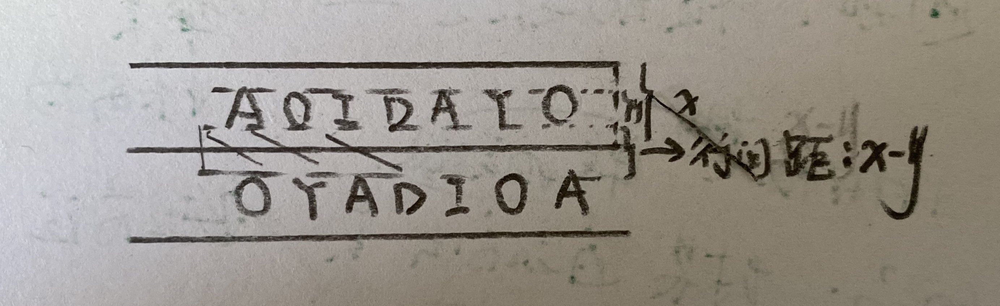
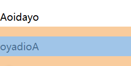
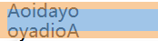

# css基础  

Cascading（级联,层叠） Style Sheets(薄片，纸张，覆盖)，层叠样式表 

网页实际上是一个多层的结构，通过 CSS 可以分别为网页的每一个层来设置样式，而最终我们能看到只是网页的最上边一层

总之一句话，CSS 用来设置网页中元素的样式

使用 CSS 来修改元素样式的方式大致可以分为 3 种

## 引入方式

### 内联样式 (行内样式):元素内写style

可以将css样式编写到**元素的style属性**中,css的样式使用`;`分割
将样式直接编写在style属性中，这样的样式成为内联样式 
只对当前元素（标签）有效，不方便复用 
内联样式属于**结构与表现耦合，不方便后期维护**  

```html  
<p style="color: red; font-size: 40px">锄禾日当午，汗滴禾下土</p>  
<p>谁知盘中餐，粒粒皆辛苦</p>  
```

> 问题：使用内联样式，样式只能对一个标签生效。如果希望影响到多个元素，必须在每一个元素中都复制一遍；并且当样式发生变化时，我们必须要一个一个的修改，非常的不方便。（注意：开发时绝对不要使用内联样式）

### 内部样式表:head编写style便签  

也可以将CSS样式编写到**head中的style标签**里 
将样式表编写的style标签中，然后通过CSS选择器选中指定元素 
然后可以**同时为这些元素一起设置样式**，这样可以使样式进一步的复用 
将样式表编写到style标签中，也可以使**表现和结构进一步分离**它也是我们推荐的使用方式	  

```html  
<style type="text/css">  
    /*
    type的默认值就是text/css,表明使用css样式
    */
    p{  /*
        使用;分割属性
        以键值对的方式写
        */
        color: red;   
        font-size: 40px;  
    }  
</style>  
```

问题：我们的内部样式表只能对一个网页起作用，它里边的样式不能跨页面进行复用

### 外部的CSS文件  

还可以将样式表编写到**外部的CSS文件中**,然后通过**link标签来将外部的CSS文件引入到当前页面中**， 
这样外部文件中的css样式表将会应用到当前页面中。 

将CSS样式统一编写到外部的样式表中，完全使结构和表现分离，可以是样式表可以在不同的页面中使用， 
最大限度的使样式可以进行复用，将样式统一写在样式表中，然后通过link标签引入，可以利用浏览器的缓存 
加快用户访问的速度提高了用户体验，所以在开发中我们最推荐使用的方式就是外部的CSS文件  

```html  
<link rel="stylesheet" type="text/css" href="style.css" />  
<!--
	rel:必须,与被连接文档的关系;选填stylesheet,
	href:必须,连接文档的地址,一般都是一个本地服务器的相对地址,也可以连接一个网络链接
-->
```

## 注释

### css 中的注释

只能使用`/*`和`*/`包裹。即不管是单行注释，还是多行注释，都是以`/*`开头，以`*/`结尾

```css
/* css中的单行注释 */

/* 
css中的多行注释
css中的多行注释
css中的多行注释
*/
```

我们对比下其他几种前端语言的注释

### html 中的注释

只能使用`<!--`和`-->`包裹。即不管是单行注释，还是多行注释，都是以`<!--`开头，以`-->`结尾

```html
<!-- html中的单行注释 -->

<!-- 
html中的多行注释
html中的多行注释
html中的多行注释
-->
```

### JS(JavaScript)和 JQuery 中的注释

单行注释使用`//`。多行注释使用`/*`和`*/`包裹，以`<!--`开头，以`-->`结尾

```js
/* JS(JavaScript)和JQuery中的单行注释*/

/*
JS(JavaScript)和JQuery中的多行注释
JS(JavaScript)和JQuery中的多行注释
JS(JavaScript)和JQuery中的多行注释
*/
```

> 总结:无脑使用快捷键就行了,不记得的时候回来看看


## css选择器介绍

### 基本语法

`选择器 声明块`

`p{}`

### 选择器

通过选择器可以选中页面中指定的元素，
并且将**声明块中的样式应用到选择器对应的元素上** 

### 声明块 

声明块紧跟在选择器的后边，使用一对`{}`括起来， 
声明块中实际上就是一组一组的**名值对**(键值对)结构， 这一组一组的名值对我们称为声明， 

- 在一个声明块中可以写多个声明
- 多个声明之间使用`;`隔开
- 声明的样式名和样式值之间使用`:`来连接 

```css
p{  
	color:red;  
	font-size:50px;  
}
```

## 单位  

### 长度单位  

**px** 
	像素，像素就是构成一个图片的最小的单位，我们的屏幕就是由一个一个像素点构成  
	一个像素指的就是一个像素点 
	在不同的显示器中，一个像素的大小是不同的，越清晰的屏幕像素越小 
**%** 
	可以将一个元素的样式值设置为一个百分比的值，这样浏览器将会根据父元素的值去计算出相应的值 
	当父元素的值改变时，子元素的值会按照一定比例一起改变，经常用于自适应的页面 
**em** 
	em会相对于当前元素的字体大小来计算 
	1em = 1font-size 
	em经常用于设置文字相关的一些样式，因为当文字大小发生改变时，em会随之改变  

**rem....**  

## 色值

### 颜色的英文

​	直接使用英文单词来表示颜色
​	red green blue orange 


### RGB值

所谓RGB值就是通过红 绿 蓝三元色的不同组合来搭配出各种不同的颜色 
语法： 

```
rgb(红色,绿色,蓝色) 
```

这三个值需要**一个0-255之间的值** 
	0表示没有 
	255表示最大 
	rgb(50,200,30) 
也可以使用**百分数**来设置RGB值，需要0%-100%之间的值 
	百分数最终也是转换为0-255的 
	0%相当于0 
	100%相当于255 
	rgb(100%,0%,0%) 

### 十六进制RGB值

也是一种RGB值的表示方式，不同的是它使用的是16进制数字来表示而不是 
语法： 

```
#红色绿色蓝色 
```

这里的每一个颜色需要一个00-ff(HEX)之间的值 

```
也就是(00-ff)=>(0,16*16)=(0,256)
```

例子： 

```
#ff0000 
```

如果颜色的是两位两位重复的，可以进行简写 

```
比如 #aabbcc 可以写成 #abc 
比如 #bbffaa 可以写成 #bfa  
```

## 文本样式  

字体

```css
color 
	字体的颜色 
font-size
	字体的大小 
	浏览器中默认的字体大小一般都是16px，而我们开发时一般会统一为12px  
font-family 
	设置文字的字体
font-style      
	设置斜体
font-style  
	设置斜体
font-weight  
	设置文字的加粗
font-variant  
	小型大写字母  
```

```css
font  
    文字的简写属性  
    可以同时设置所有的字体相关的样式  
    语法：  
        font: [加粗 斜体 小大字母] 大小[/行高] 字体
```

- 加粗，斜体，小大字母，顺序无所谓，写不写都行，如果不写在使用默认值 
- 文本大小，和字体必须写，且大小必须是倒数第二个，字体必须是最后一个  
- 大小后可以设置行高，可写可不写，如果不写则使用默认值  
  文本默认都是在行高中垂直居中的,通过line-height可以修改行高,行间距 = 行高 - 字体大小

```css
text-transform  
	设置文本的大小写
可选值：  
	none 默认值，该怎么显示就怎么显示，不做任何处理  
	capitalize 单词的首字母大写，通过空格来识别单词  
	uppercase 所有的字母都大写  
	lowercase 所有的字母都小写  
```

```css
text-decoration  
	设置文本修饰  
	a {  
    /*超链接会默认添加下划线，也就是超链接的text-decoration的默认值是underline  
    如果需要去除超链接的下划线则需要将该样式设置为none  
    * */  
  	  text-decoration: none;  
	}  
text-align  
	设置文本对齐
text-indent  
	设置首行缩进  
	它需要一个长度单位，如果是正值则首行向右移动，如果是负值则向左移动
	/*  
    * text-indent用来设置首行缩进  
    * 	当给它指定一个正值时，会自动向右侧缩进指定的像素  
    * 	如果为它指定一个负值，则会向左移动指定的像素,  
    * 		通过这种方式可以将一些不想显示的文字隐藏起来  
    *  这个值一般都会使用em作为单位  
    */  
```

```css  
letter-spacing  
	字符间距  
word-spacing  
	单词间距  
/*  
 * 在CSS并没有为我们提供一个直接设置行间距的方式，  
 * 	我们只能通过设置行高来间接的设置行间距，行高越大行间距越大  
 * 使用line-height来设置行高   
 * 	行高类似于我们上学单线本，单线本是一行一行，线与线之间的距离就是行高，  
 * 	网页中的文字实际上也是写在一个看不见的线中的，而文字会默认在行高中垂直居中显示  
 *   
 * 行间距 = 行高 - 字体大小  
 */  
```



### 测试行间距

```css
        p {
            font-size: 20px;
            line-height: 2; 
            /* 传入数值,根据倍数计算*/
        }
```

​	

```css
        p {
            font-size: 20px;
            line-height: 2px;
            /* 传入一个具体的长度单位,根据单位设置计算*/
        }
```




```css  

.p1{  
	font-size: 20px;  
	  
	/*  
	 * 通过设置line-height可以间接的设置行高，  
	 * 	可以接收的值：  
	 * 		1.直接就收一个大小()
	 * 		2.可以指定一个百分数，则会相对于字体去计算行高
	 * 		3.可以直接传一个数值，则行高会设置字体大小相应的倍数 
	 */  
	/*line-height: 200%;*/  
	  
	line-height: 2;  
}  
  
.box{  
	width: 200px;  
	height: 200px;  
	round-color: #bfa; 
	/*  
	 * 对于单行文本来说，可以将行高设置为和父元素的高度一致，  
	 * 	这样可以让单行文本在父元素中垂直居中  
	 */  
	line-height: 200px;  
}  
  
.p2{  
	/*  
	 * 在font中也可以指定行高  
	 * 	在字体大小后可以添加/行高，来指定行高，该值是可选的，如果不指定则会使用默认值  
	 */  
	font: 30px "微软雅黑";  
	line-height: 50px;  
}  
```

