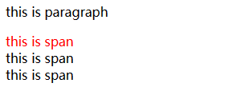
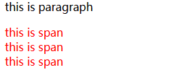
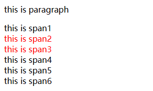

# CSS选择器

## 1. 基本CSS 选择器

### 通配选择器（Universal selector）

- 作用：选中页面中的所有元素
- 语法：`*`
- 例子：`*{}`

```css
* {
  color: red;
}
```

### 元素选择器（Type selector）

也叫类型选择器、标签选择器

- 作用：根据标签名来选中指定的元素
- 语法：`elementname{}`
- 例子：`p{}` `h1{}` `div{}`

```css
p {
  color: red;
}

h1 {
  color: green;
}
```

### 类选择器（Class selector）

- 作用：根据元素的 class 属性值选中一组元素
- 语法：`.classname`
- 例子：`.blue{}`

```css
.blue {
  color: blue;
}
.size {
  font-size: 20px;
}
```

`class`是一个标签的属性，它和`id`类似，不同的是`class`

- 可以重复使用，
- 可以通过`class`属性来为元素分组，
- 可以同时为一个元素指定多个`class`属性

```html
<p class="blue size">类选择器（Class selector）</p>
```

### ID 选择器（ID selector）

- 作用：根据元素的`id`属性值选中一个元素
- 语法：`#idname{}`
- 例子：`#box{}` `#red{}`

相对于class:id

- 不可以重复使用,唯一标识一个标签
- 只能使用一次

```css
#red {
  color: red;
}
```

### 属性选择器（Attribute selector）

- 作用：根据元素的属性值选中一组元素
- 语法 1：`[属性名]` 选择含有指定属性的元素
- 语法 2：`[属性名=属性值]` 选择含有指定属性和属性值的元素
- 语法 3：`[属性名^=属性值]` 选择**属性值以指定值开头**的元素(下面估计是使用了正则表达式进行匹配的,只要匹配成功,全都放进去)
- 语法 4：`[属性名$=属性值]` 选择**属性值以指定值结尾**的元素
- 语法 5：`[属性名*=属性值]` 选择**属性值中包含某值**的元素
- 例子：`p[title]{}` `p[title=e]{}` `p[title^=e]{}` `p[title$=e]{}` `p[title*=e]{}`

```css
p[title] {
  color: orange;
}
p[title="e"] {
  color: orange;
}
p[title^="e"] {
  color: orange;
}
p[title$="e"] {
  color: orange;
}
p[title*="e"] {
  color: orange;
}
```

#### 测试

```css
p[name*="c"] {/*渲染颜色*/
    /*
    p[name^="c"]渲染颜色
    p[name$="c"]不渲染颜色
    */
    color: aqua;
    font-size: 20px;
    /* line-height: 2; */
    /* 传入数值 */
    line-height: 2px;
}
```

```html
    <p name="classA">Aoidayo</p>
    <p>oyadioA</p>
```

## 2. 复合选择器

### 交集选择器

- 作用：选中同时复合多个条件的元素
- 语法：`选择器1选择器2选择器3选择器n{}`
- 注意点：交集选择器中如果有元素选择器，必须使用元素选择器开头

```css
div.red {
    /*标签选择+类选择,没有空格*/
  font-size: 30px;
}
	/*多重类选择*/
.a.b.c {
  color: blue;
}
```

### 并集选择器（选择器分组）

- 作用：同时选择多个选择器对应的元素
- 语法：`选择器1,选择器2,选择器3,选择器n{}`
- 需要使用`,`分割不同的选择去
- 例子：`#b1,.p1,h1,span,div.red{}`

```css
h1,
span {
  color: green;
}
```

### 测试:

```css
div.write {
    color: brown;
}
html--
    <div>a normal div</div>/*1*/
    <div class="write">
			/*2*/
            abnormal div;
			/*只有这个渲染brown颜色,交集选择器*/

    </div>

    <p name="classA">Aoidayo</p>/*3*/
    <p>oyadioA</p>/*4*/
========================================================================================================
div,
p {
    color: brown;
}
p[name*="c"] {
    color: aqua;
    font-size: 20px;
    /* line-height: 2; */
    /* 传入数值 */
    line-height: 2px;
}
渲染brown颜色的有1,2,4;并集选择器;
3由于有被后面的选择器覆盖,渲染为aqua,可以看出来选择器是有优先级的
```

## 3. 关系选择器

- <mark>父元素</mark>：直接包含子元素的元素叫做父元素
- <mark>子元素</mark>：直接被父元素包含的元素是子元素
- <mark>祖先元素</mark>：直接或间接包含后代元素的元素叫做祖先元素；一个元素的父元素也是它的祖先元素
- <mark>后代元素</mark>：直接或间接被祖先元素包含的元素叫做后代元素；子元素也是后代元素
- <mark>兄弟元素</mark>：拥有相同父元素的元素是兄弟元素

### 子元素选择器（Child combinator）

- 作用：选中指定父元素的指定子元素
- 语法：`父元素 > 子元素`
- 例子：`A > B`

```css
div.box > p > span {
  color: orange;
}
```

### 后代元素选择器（Descendant combinator）

- 作用：选中指定元素内的指定后代元素
- 语法：`祖先 后代`
- 例子：`A B`

```css
div span {
  color: skyblue;
}
```

### 兄弟元素选择器（Sibling combinator）

- 作用：选择下一个兄弟
- 语法：`前一个 + 下一个` `前一个 + 下一组`
- 例子 1：`A1 + A2`（Adjacent sibling combinator),指定元素的下一个兄弟节点
- 例子 2： `A1 ~ An`（General sibling combinator),指定元素后面所有的兄弟节点

```css
p + span {/*1*/
  color: red;
}

p ~ span {/*2*/
  color: red;
}
```

```html
    <p>this is paragraph</p>
    <span>this is span</span><br>
    <span>this is span</span><br>
    <span>this is span</span><br>
```

> 1. 
> 2. 

## 4. 伪类选择器

伪类（不存在的类，特殊的类）

伪类用来描述一个元素的特殊状态，比如：第一个子元素、被点击的元素、鼠标移入的元素.…

### 子元素无视类型排序

伪类一般情况下都是使用`:`开头

- <mark>`:first-child`</mark> 匹配父元素中的第一个子元素
- <mark>`:last-child`</mark> 最后一个子元素
- <mark>`:nth-child()`</mark> 选中第 n 个子元素
  - 参数:
  - 常数：第常数个，n 的范围1 到正无穷
  - n: 选中所有的子元素
  - 2n 或 even：选中偶数位的元素
  - 2n+1 或 odd：选中奇数位的元素
  - 也可以写3n,4n...


以上这些伪类都是根据所有的子元素进行排序的

```css
div>p:nth-child(1){}
```

> 对div中的所有元素排序
>
> - 如果p是第一个选中
>
> - 如果p不是第一个则不选中

### 子元素中按同类型排序

- <mark>`:first-of-type`</mark> 匹配父元素中同类型中的第一个子元素
- <mark>`:last-of-type`</mark> 同类型中的最后一个子元素
- <mark>`:nth-of-type()`</mark> 选中同类型中的第 n 个子元素

这几个伪类的功能和上述的类似，不同点是他们是在同类型元素中进行排序的

```css
        div>span:nth-child(1) {
            /* 不会选中span1,因为是在子类元素中排序,而span1虽然满足span,但是不满足第一个*/
            /* 语义:在div的元素中找第一个,如果第一个是div,则匹配,作用在div上 */
            color: red;
        }

        div>span:first-of-type {
            /* 选中span1,因为是在同span类型的元素中排序*/
            /* 语义:在类型为span的div子类元素中找第一个,作用在sapn上 */
            color: red;
        }
```

```html
    <div>
        <p>this is paragraph</p>
        <span>this is span1</span><br>
        <span>this is span2</span><br>
        <span>this is span3</span><br>
    </div>
    <span>this is span4</span><br>
    <span>this is span5</span><br>
    <span>this is span6</span><br>
```

### 否定

- <mark>`:not()`</mark>否定伪类，将符合条件的元素从选择器中去除

```css
        div>span:not(:nth-of-type(1)) {
            color: red;
        }
```



```css
/* ul下所有li，黑色 */
ul > li {
  color: black;
}

/* ul下第偶数个li，黄色 */
ul > li:nth-child(2n) {
  color: yellow;
}

/* ul下第奇数个li，绿色 */
ul > li:nth-child(odd) {
  color: green;
}

/* ul下第一个li，红色 */
ul > li:first-child {
  color: red;
}

/* ul下最后一个li，黄色 */
ul > li:last-child {
  color: orange;
}
```


### 链接

- <mark>`:link`</mark> 未访问的链接
- <mark>`:visited`</mark> 已访问的链接
  - 由于隐私的原因，所以`visited`这个伪类只能修改链接的颜色
- <mark>`:hover`</mark> 鼠标悬停的链接
- <mark>`:active`</mark> 鼠标点击的链接

```css
/* unvisited link */
a:link {
  color: red;
}

/* visited link */
a:visited {
  color: yellow;
}

/* mouse over link */
a:hover {
  color: green;
}

/* selected link */
a:active {
  color: blue;
}
```


## 5. 伪元素选择器

伪元素，表示页面中一些特殊的并不真实的存在的元素（特殊的位置）

伪元素使用`::`开头

- <mark>`::first-letter`</mark> 表示第一个字母
- <mark>`::first-line`</mark> 表示第一行
- <mark>`::selection`</mark> 表示选中的内容
- <mark>`::before`</mark> 元素的开始
- <mark>`::after`</mark> 元素的最后
- <mark>`::before`和`::after`</mark> 必须结合`content`属性来使用

```css
/* 段落首字母设置大小为30px */
p::first-letter {
  font-size: 30px;
}

/* 段落第一行设置为黄色背景 */
p::first-line {
  background-color: yellow;
}

/* 段落选中的部分变绿色 */
p::selection {
  background-color: green；;
}

/* div前加上内容 */
div::before {
  content: "BEFORE";
  color: red;
}

/* div后加上内容 */
div::after {
  content: "AFTER";
  color: blue;
}
```


## 6. 样式继承

样式的继承，我们为一个元素设置的样式，同时也会应用到它的后代元素上

继承是发生在祖先后后代之间的，继承的设计是**为了方便我们的开发**

利用继承，我们可以将一些通用的样式，统一设置到共同的祖先元素上。这样只需设置一次即可让所有的元素都具有该样式

- 比如:在p内设置一个span,给p设置一个颜色的样式,则span也会继承这个颜色;
- 在div内设置一个span,span中嵌套一个span,给p设置一个颜色的样式,则span也会继承这个颜色,span的span作为后代元素也继承这个颜色
- 在body设置样式`font-size:12px`,则页面内所有元素的字体大小都是12px

注意，并不是所有的样式都会被继承：

- 比如背景相关的，布局相关等的这些样式都不会被继承。


我们可以再 Zeal 手册中，搜索`background-color`属性，可以看到一个定义的表格。其中就说明了其不可被继承性


样式覆盖,根据选择器的设置位置,会覆盖父元素设置的样式

## 7. 选择器的权重

当我们通过不同的选择器，选中相同的元素，并且为相同的样式设置不同的值时，此时就发生了样式的冲突。

发生样式冲突时，应用哪个样式由**选择器的权重（优先级）决定选择器的权重**

| 选择器         | 权重       |
| :------------- | :--------- |
| 内联样式       | 1, 0, 0, 0 |
| ID 选择器      | 0, 1, 0, 0 |
| 类和伪类选择器 | 0, 0, 1, 0 |
| 元素选择器     | 0, 0, 0, 1 |
| 通配选择器     | 0, 0, 0, 0 |
| 继承的样式     | 没有优先级 |

比较优先级时，需要将所有的选择器的优先级进行相加计算，最后优先级越高，则越优先显示（分组选择器是单独计算的）

选择器的累加不会超过其最大的数量级，类选择器再高也不会超过 ID 选择器

如果优先级计算后相同，此时则优先**使用靠下的样式**

可以在某一个样式的后边添加`!important`，则此时该样式会获取到最高的优先级，甚至超过内联样式，注意：在开发中一定要慎用！


```html
<style>
  #box1 {
    background-color: orange;
  }
  div {
    background-color: yellow;
  }
  .red {
    background-color: red;
  }
</style>

<div id="box1" class="red" style="background-color: skyblue;">选择器的权重</div>
```


