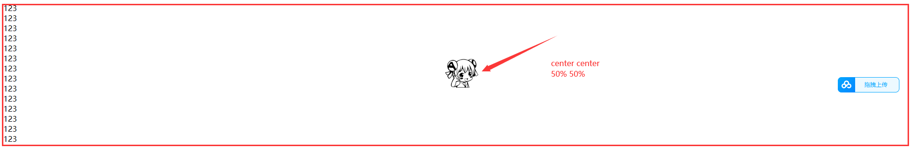

# 03属性

⭐️ 属性

- 单位
  - px
  - em
  - rem
  - vw
  - vh
- 背景
- 文本
- 字体
- 列表
- 表格

## 长度单位

### 像素

我们先来看下某度上关于像素（pixel,缩写 px）的介绍

> 像素是指由图像的小方格组成的，这些小方块都有一个明确的位置和被分配的色彩数值，小方格颜色和位置就决定该图像所呈现出来的样子。
>
> 可以将像素视为整个图像中不可分割的单位或者是元素。不可分割的意思是它不能够再切割成更小单位抑或是元素，它是以一个单一颜色的小格存在 [1] 。每一个点阵图像包含了一定量的像素，这些像素决定图像在屏幕上所呈现的大小。

也就是说，显示器屏幕实际上是由一个一个的小点（单位色块，即像素）构成的

**问题 1：像素和分辨率有什么关系呢？**

`分辨率 = 水平方向像素 * 垂直方向像素`

#### 屏幕分辨率

例如，屏幕分辨率是 1920×1080，则该屏幕水平方向有 1920 个像素，垂直方向有 1080 个像素

- 不同屏幕的像素大小是不同的，也就是说像素大小不像我们现行的长度单位（如米/m）那样有着固定的国际标准
- 所以同样的像素大小在不同的设备上显示效果是不一样的，像素越小的屏幕显示的效果越清晰

举例:27寸屏幕`1920*1080`的像素比23寸屏幕`1920*1080`的像素要大,即27寸的比较糊

#### 图像分辨率

例如，一张图片分辨率是 300x200，则该图片在屏幕上按 1:1 缩放时，水平方向有 300 个像素，垂直方向有 200 个像素点

- 图片分辨率越高，1:1 缩放时面积越大
- 图片分辨率越低，1:1 缩放时面积越小

同一台设备像素大小是不变的，那把图片放大超过 100%时占的像素点就多了，但是图像也会变得模糊


**问题 2：屏幕实现图片放大或缩小的原理是什么呢？**

- 其实是设备通过算法对图像进行了像素补足；
- 同理，把图片按小于 100%缩放时，也是通过算法将图片像素减少

### 百分比

也可以将属性值设置为相对于其父元素属性的百分比，可以使子元素跟随父元素（暂且先理解成父元素，后面会详细说）的改变而改变

```css
        .box1 {
            width: 200px;
            height: 200px;
            background-color: brown;
        }

        /* 其中box2为box1的子类 */
        .box2 {
            /* width:100px */
            width: 50%;
            height: 50%;
            background-color: brown;
        }
```

### em

em 是相对于元素的字体大小来计算的，`1em = <self>.font-size`，也就说 em 值会根据元素本身的字体大小的改变而改变

```css
    <style>
        /* body {
            font-size: 20px;
        } */

        .box1 {
            /* 
            相对于最近的字体大小计算,或者说,相对于自身的字体大小
            body默认字体大小16px,
            所以10em=160px,
            若设置box1内的字体大小是40px
            则10em
            =400px
            */
            font-size: 40px;
            width: 10em;
            height: 10em;
            background-color: brown;
        }

        /* 其中box2为box1的子类 */
        .box2 {
            /* width:100px */
            width: 50%;
            height: 50%;
            background-color: rgb(66, 173, 164);
        }
    </style>
```

### rem

rem 是相对于根元素的字体大小来计算，`1em = <root>.font-size`，也就说 em 值会根据根元素的字体大小的改变而改变

用于移动端的适配

```css
    <style>
        body {
            font-size: 20px;
        }

        .box1 {
            /*当时用rem时，不管怎么改本元素的font-size都是不会变的。需要定义root元素的font-size才可以 */

            font-size: 40px;
            /* 10rem=200px */
            width: 10rem;
            height: 10rem;
            background-color: brown;
        }

        /* 其中box2为box1的子类 */
        .box2 {
            /* width:100px */
            width: 50%;
            height: 50%;
            background-color: rgb(66, 173, 164);
        }
    </style>
```

## 颜色单位

**人眼能够识别多少种颜色？**

> 正常人有三种视椎细胞，是三色视觉者（红绿蓝），总共能看到大约 100 万种颜色

> 男的大约 130 万 女的大约 180 万

> 大概有经验的油漆工人辨别 1000 种左右，再高就难以分辨了。
>
> 比如红色，可以分为 50 个等级，邻近的两个等级能够别出来，说明他的眼睛辨别能力就很不错了。
>
> 过去的老工人，凭肉眼可辨别 50 种黑色，当然都要有特定的样板色做对比。


我引用了网上的一些答案，也是众说纷纭。不过我的理解是

- 人眼能至少接收 100 多万种颜色，因人而异
- 但最多只能够对 1000 多种颜色做出识别，因人而异


**css 中的颜色名称**

我们生活中会使用各种颜色名称去描述看到的各种颜色，在 css 中当然也可以直接使用颜色名来设置颜色，比如：red、orange、yellow、blue、green 等等


其中有 140 种颜色名称是所有浏览器都支持的，但是有个问题，就是在 css 中直接使用颜色名非常不方便

而且世界上有无数种颜色，人眼也不能分辨出所有颜色，更不可能对每一种颜色都进行命名

而且就算能够有办法对那么多种颜色进行命名，我们也不可能一个一个的去记或去查这种对应关系。试问下，有多少人看一眼某个颜色，就能够在调色板上快速准确的定位那个颜色或者直接叫出那种颜色的名称？这显然不现实，至少现在如此


另外，那么 css 中还可以怎么调和出更多的颜色呢？

在介绍 css 的颜色单位之前，我们首先来了解下光的三原色，因为 css 的颜色单位就是按照光的三原色来调和的

> 发现光的色散奥妙之后，牛顿开始推论：既然白光能被分解及合成，那么这七种色光是否也可以被分解或合成。于是，纷繁的实验和不停的计算充斥着他日后的生活。
>
> 一段时间后，牛顿通过计算，得出了一个结论：七种色光中只有红、绿、蓝三种色光无法被分解，于是也就谈不到合成了。
>
> 而其他四种色光均可由这三种色光以不同比例相合而成。于是红、绿、蓝则被称为“三原色光”或“光的三原色”（注意，这有别于我们熟知的三原色“红黄蓝”）。
>
> 牛顿通过计算得出上述结论后，未能完成实验，便与世长辞。


这里再科普下光的三原色和颜料的三原色的区别

> **颜料三原色**（CMYK）：品红、黄、青(天蓝)。色彩三原色可以混合出所有颜料的颜色，同时相加为黑色，黑白灰属于无色系。
>
> **光学三原色**（RGB）：红、绿、蓝(靛蓝)。光学三原色混合后，组成显示屏显示颜色，三原色同时相加为白色，白色属于无色系（黑白灰）中的一种。


那看到这里有人会问了，**css 为什么不按照颜料的三原色来调和呢？**

因为道理很简单，聪明的小伙伴应该已经知道答案了。上面我们也说过，屏幕是由像素组成的，每个像素就是一个单位色块。而这个单位色块之所以能显示颜色，就是靠发光来实现的


既然光是由三种色光组成的，任何一种颜色均可以由这三种颜色调和出来的，那么为什么我们不能用三原色来表示一种颜色呢？

### RGB 值

RGB 通过三原色的不同浓度来调配出不同的颜色

- 语法：`RGB(red, green, blue)`
- 范围：每一种颜色的范围在 0 ~ 255（0% ~ 100%）之间

### RGBA

就是在 rgb 的基础上增加了一个 a 表示不透明度

- `1`表示完全不透明
- `0`表示完全透明
- `.5`半透明

### 十六进制的 RGB 值

就是 RGB 值的十六进制写法

- 语法：`#RRGGBB`
- 范围：每一种颜色的范围在 00 ~ ff 之间

如果颜色两位两位重复可以进行简写，如`#aabbcc` => `#abc`

在 vscode 中，我们可以看到其会对颜色进行预览展示。并且将鼠标移至 color 处悬浮，会智能的弹出一个 rgb 调色板，方便我们进行调色


如果我们看到某种颜色，非常喜欢，~~那么在哪里才能买得到呢？~~ 怎么知道这个颜色的 rgb 值呢？


我们可以直接搜索~~黄色~~，哦不是，取色器！有些录制软件也会自带取色功能，如 FastStone Capture

下载地址：[FastStone Capture - Download](https://faststone-capture.en.softonic.com/)


## 背景

background 的常见背景属性
css2.1 中，常见的背景属性有以下几种：（经常用到，要记住）

background-color:#ff99ff; 设置元素的背景颜色。

background-image:url(images/2.gif); 将图像设置为背景。

background-repeat: no-repeat; 设置背景图片是否重复及如何重复，默认平铺满。（重要）

- no-repeat不要平铺；
- repeat-x横向平铺；
- repeat-y纵向平铺。

background-position:center top; 设置背景图片在当前容器中的位置。

background-attachment:scroll; 设置背景图片是否跟着滚动条一起移动。 属性值可以是：scroll（与fixed属性相反，默认属性）、fixed（背景就会被固定住，不会被滚动条滚走）。

另外还有一个综合属性叫做background，它的作用是：将上面的多个属性写在一个声明中。

**CSS3** 中，新增了一些[background属性](https://so.csdn.net/so/search?q=background属性&spm=1001.2101.3001.7020)：

- background-origin
- background-clip 背景裁切
- background-size 调整尺寸
- 多重背景

### background-color

```css
属性:background-color(简写为background)
属性值:文本颜色、边框颜色、背景颜色的属性都是通用的
```

### background-color

```css
2.背景图片的使用
属性:background-image
属性值:url(图片的路径地址)
    - 背景图片比容器小的时候 默认是平铺的
    - 背景图片和容器一样大小的时候 默认是沾满
    - 背景图片比容器大的时候 默认只显示一部分
结论
    - 背景图是不占位置的 必须需要父级容器支持的 不然不会显示
    - 图片结构是占位置的 有自己初始大小 不需要容器支持也能显示出来的
```

### background-repeat

```css
3.背景图片的平铺设置
属性:background-repeat
属性值
    - 默认值 repeat,默认xy轴同时铺满
    - 常用的属性值 no-repeat 不平铺 只会显示一张背景图
    - 拓展 repeat-x/y 背景图片可以沿着x/y轴进行平铺
```

x为横向,y为纵向


### background-position属性

```
4.背景定位属性
属性:background-position
属性值
	使用像素描述:定位图片开始的位置
	background-position:向右偏移量 向下偏移量;
	使用关键词
    - x轴方向 left right center
    - y轴方向 top bottom center
    使用百分比
```


测试:

```html
<head>
    <meta charset="UTF-8">
    <meta http-equiv="X-UA-Compatible" content="IE=edge">
    <meta name="viewport" content="width=device-width, initial-scale=1.0">
    <title>Document</title>
    <style>
        body {
            background-image: url("./img/ac0.png");
            background-repeat: no-repeat;
            background-position: 50% 50%;
        }
    </style>
</head>

<body>
    <div>123</div>
    <div>123</div>
    <div>123</div>
    <div>123</div>
    <div>123</div>
    <div>123</div>
    <div>123</div>
    <div>123</div>
    <div>123</div>
    <div>123</div>
    <div>123</div>
    <div>123</div>
    <div>123</div>
    <div>123</div>
</body>

</html>
```



### background-attachment 属性

- ```
  background-attachment:scroll;
  ```

   设置背景图片是否固定。属性值可以是：

  - `fixed`（背景就会被固定住，不会被滚动条滚走）。
  - `scroll`（与fixed属性相反，默认属性）

### 属性简写

```
background属性可以像margin padding属性一样，有简写方法，它的简写顺序是：

background-color
background-image
background-repeat
background-attachment
background-position
如果某属性不想写，可以忽略。
```

```css
background:red url(1.jpg) no-repeat 100px 100px fixed;
/*简写background-attachment*/
background: blue url(images/wuyifan.jpg) no-repeat 100px 100px;
```

## background-size属性：背景尺寸

`background-size`属性：设置背景图片的尺寸。

```css
	/* 宽、高的具体数值 */
	background-size: 500px 500px;
 
	/* 宽高的百分比（相对于容器的大小） */
	background-size: 50% 50%;   // 如果两个属性值相同，可以简写成：background-size: 50%;
 
	background-size: 100% auto;  //这个属性可以自己试验一下。
 
	/* cover：图片始终填充满容器，且保证长宽比不变。图片如果有超出部分，则超出部分会被隐藏。 */
	background-size: cover;
 
	/* contain：将图片完整地显示在容器中，且保证长宽比不变。可能会导致容器的部分区域为空白。  */
	background-size: contain;
```

## 文本

### color&font-size

- `color`用来设置字体颜色

- `font-size`字体的大小
  - `em` 相当于当前元素的一个`font-size`
  - `rem` 相对于根元素的一个`font-size `

###  font-family

`font-family` 字体族（字体的格式）

- 字体分类

  ```css
  - `serif` 衬线字体
  
  - `sans-serif` 非衬线字体
  
  - `monospace` 等宽字体
  
  - `cursive` 手写体
  
  - `fantasy` 梦幻字体
  上述字体均不表示具体的某种字体，而是字体的分类
  ```

- 具体字体

  - 如`微软雅黑`、`黑体`、`楷体`、`宋体`、`Consolas`等
  
  - 也就是说，`font-family` 指定字体的类别，浏览器会自动使用该类别下的字体
  
  - `font-family`可以同时指定多个字体，多个字体间使用`，`隔开
  
    - 字体生效时优先使用第一个，第一个无法使用则使用第二个，以此类推
  
  - ```
    font-family: "Courier New", Courier, monospace;
    ```
  

### @font-face

我们除了可以使用系统自带的字体样式外，还可以在服务器端自定义字体位置

`@font-face`可以将服务器中的字体直接提供给用户去使用(写在css的style中)

```css
@font-face {
  /* 指定字体名字 */
  font-family: "myFont1";
  /* 服务器中字体路径 */
  src: url("/font/ZCOOLKuaiLe-Regular.woff"),
    url("/font/ZCOOLKuaiLe-Regular.otf"),
    url("/font/ZCOOLKuaiLe-Regular.ttf") format("truetype"); /* 指定字体格式，一般不写 */
}

p {
  font-size: 30px;
  color: salmon;
  font-family: myFont1;
}
```


**问题**

1. 加载速度：受网络速度影响，可能会出现字体闪烁一下变成最终的字体
2. 版权：有些字体是商用收费的，需要注意
3. 字体格式：字体格式也有很多种（woff、otf、ttf），未必兼容，可能需要指定多个

## 图标字体（iconfont）

### 图标字体简介

在网页中经常需要使用一些图标，可以通过图片来引入图标,但是图片大小本身比较大，并且非常的不灵活

所以在使用图标时，我们还可以将图标直接设置为字体，然后通过`@font-face`的形式来对字体进行引入

这样我们就可以通过使用字体的形式来使用图标

### fontawesome

官方网站：[https://fontawesome.com/](https://fontawesome.com/)

下载解压完毕之后，直接将 css 和 webfonts 移动到项目中即可使用

**示例**

```html
//=========================引入=================================
<link rel="stylesheet" href="/font/fontawesome/css/all.css" />
//=========================css=================================
<style>
  i {
    color: green;
  }

  .fa-venus-mars,
  .fa-mars-double {
    color: red;
  }

  .fa-html5 {
    color: #e34d22;
  }

  .fa-css3 {
    color: blue;
  }

  .fa-js {
    color: #d1b514;
  }
</style>
//=========================html=================================
<!-- 大小 -->
<i class="fab fa-weixin fa-lg"></i>
<i class="fab fa-weixin fa-2x"></i>
<i class="fab fa-weixin fa-3x"></i>
<br />

<!-- 边框 -->
<i class="fab fa-weixin fa-2x fa-border"></i>
<br />

<!-- 旋转 -->
<i class="fab fa-weixin fa-2x  fa-rotate-90 "></i>
<!-- 水平对称 -->
<i class="fab fa-weixin fa-2x fa-flip-horizontal "></i>
<!-- 垂直对称 -->
<i class="fab fa-weixin fa-2x fa-flip-vertical "></i>
<br />

<!-- 动画 -->
<i class="fa fa-venus-mars fa-3x fa-spin"></i>
<i class="fa fa-mars-double  fa-3x fa-pulse"></i>
<br />

<!-- 列表 -->
<ul class="fa-ul">
  <li><i class="fa-li fa fa-check-square"></i>can be used</li>
  <li><i class="fa-li fa fa-spinner fa-spin"></i>as bullets</li>
  <li><i class="fa-li fa fa-square"></i>in lists</li>
</ul>
<br /><br /><br />

<!-- 组合 -->
<span class="fa-stack fa-lg">
  <i class="fab fa-html5 fa-stack-1x fa-10x"></i>
  <i class="fab fa-css3 fa-stack-1x fa-4x"></i>
  <i class="fab fa-js fa-stack-1x fa-2x"></i>
</span>
```

**效果**


其中`fas`/`fab`是免费的，其他是收费的

### 图标字体其他使用方式

#### 通过伪元素设置

1. 找到要设置图标的元素通过`::before`或`::after`选中
2. 在`content`中设置字体的编码
3. 设置字体的样式
   - `fab`：`font-family: 'Font Awesome 5 Brands';`
   - `fas`：`font-family: 'Font Awesome 5 Free'; font-weight：900;`

**示例**

```html
<style>
  .poem {
    width: 200px;
    height: 300px;
    margin: auto;
  }

  li {
    list-style: none;
    margin-left: -40px;
  }

  li::before {
    content: "\f130";
    /* font-family: 'Font Awesome 5 Brands'; */
    font-family: "Font Awesome 5 Free";
    font-weight: 900;
    margin-right: 10px;
    color: gray;
  }
</style>

<div class="poem">
  <h1>武陵春·春晚</h1>
  <p>[宋] 李清照</p>
  <ul>
    <li>风住尘香花已尽，</li>
    <li>日晚倦梳头。</li>
    <li>物是人非事事休，</li>
    <li>欲语泪先流。</li>
    <li>闻说双溪春尚好，</li>
    <li>也拟泛轻舟。</li>
    <li>只恐双溪舴艋舟，</li>
    <li>载不动、许多愁。</li>
  </ul>
</div>
```

**效果**


#### 通过实体设置

通过实体来使用图标字体：`&#x图标编码;`

**示例**

```html
<i class="fas">&#xf025;</i>
```

**效果**


### iconfont

官方网站：[https://www.iconfont.cn/](https://www.iconfont.cn/)

iconfont 是阿里的一个图标字体库，海量图标库，图标字体非常丰富

但是版权有点模横两可，如果需要商用，最好联系作者

不过一般情况下，公司企业都会有自己的 UI 设计团队，会自己去进行设计

这里使用方式大同小异，不过

- iconfont 需要添加购物车后再添加至项目然后下载，下载包中有 demo.html，详细介绍了使用方式
- iconfont 也提供了一种在线方式，直接在`我的项目`中选择`在线链接`可以复制出一份`@font-face`的 css 代码


后续步骤与前面介绍的一致

**示例**

```html
<!-- <link rel="stylesheet" href="/font/iconfont/iconfont.css"> -->
<style>
  i.iconfont {
    font-size: 100px;
  }

  p::before {
    content: "\e811";
    font-family: "iconfont";
    font-size: 50px;
  }

  /* 3、通过在线连接：这里link和@font-face择其一即可  */
  @font-face {
    font-family: "iconfont";
    /* Project id 2580407 */
    src: url("//at.alicdn.com/t/font_2580407_c0kpuhebb7r.woff2?t=1622373966454")
        format("woff2"), url("//at.alicdn.com/t/font_2580407_c0kpuhebb7r.woff?t=1622373966454")
        format("woff"),
      url("//at.alicdn.com/t/font_2580407_c0kpuhebb7r.ttf?t=1622373966454")
        format("truetype");
  }
</style>

<!-- 1、通过字符实体设置 -->
<i class="iconfont">&#xe810;</i>
<i class="iconfont">&#xe811;</i>
<i class="iconfont">&#xe812;</i>
<i class="iconfont">&#xe813;</i>

<!-- 2、通过伪元素设置 -->
<p>
  Lorem ipsum, dolor sit amet consectetur adipisicing elit. Totam deserunt
  tempore fugit quos eaque, ipsa rerum suscipit iure cumque aspernatur esse
  cupiditate nihil quas nulla odit? Sequi accusantium labore maiores.
</p>
```

**效果**


