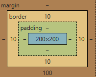
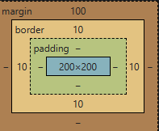
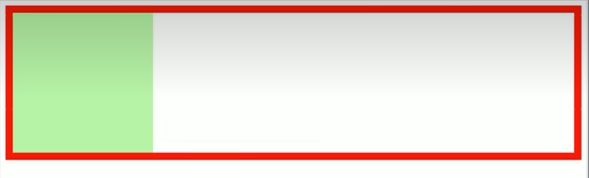
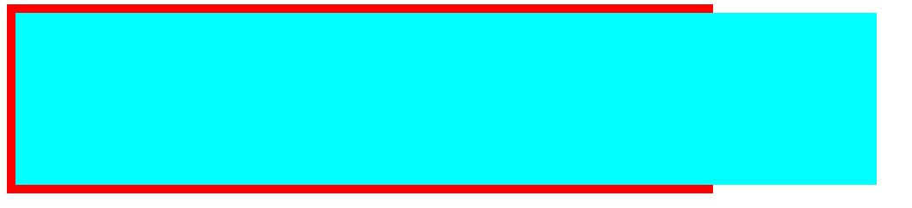
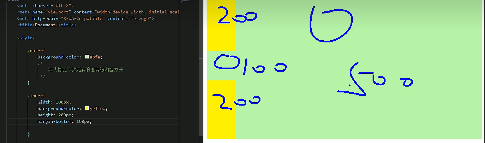
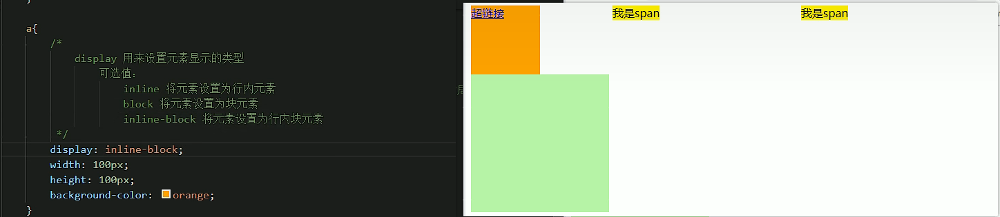

# 布局

## 盒子模型

> 网页设计中常听的属性名：内容(content)、内边距(padding)、边框(border)、外边距(margin)， CSS 盒子模型都具备这些属性。
>
> 这些属性我们可以用日常生活中的常见事物——盒子作一个比喻来理解，所以叫它盒子模型。
>
> CSS 盒子模型就是在网页设计中经常用到的 CSS 技术所使用的一种思维模型。[^1]

### 盒模型、盒子模型、框模型（box model）

CSS 将页面中的所有元素都设置为了一个矩形的盒子

将元素设置为矩形的盒子后，对页面的布局就变成将不同的盒子摆放到不同的位置

每一个盒子从内向外由以下组件组成：

- 内容区（content）
- 内边距（padding）
- 边框（border）
- 外边距（margin）


### 内容区（content）

内容区是盒子模型的中心，它呈现了盒子的主要信息内容,盒子里面装着的东西，这些内容可以是文本、图片等多种类型


元素中的所有的子元素和文本内容都在内容区中

- `width和height` 设置排列内容区的大小
- `width` 设置内容区的宽度
- `height` 设置内容区的高度

**示例**

```css
.box1 {
  width: 200px;
  height: 200px;
  background-color: #bfa;
}
```

**效果**


### 边框（border）

边框属于盒子边缘，边框里边属于盒子内部padding，出了边框都是盒子的外部margin

注意：<mark>边框的大小会影响到整个盒子的大小</mark>

- `border-width` 边框的宽度：默认 3px

  - `border-top-width` 上边框的宽度
  - `border-right-width` 右边框的宽度
  - `border-bottom-width` 下边框的宽度
  - `border-left-width` 左边框的宽度

  > 上右下左:从上方开始的顺时针方向
  >
  > border-width:3px,默认写一个的时候全部设置

- `border-color` 边框的颜色：默认使用 color 的颜色值

  - `border-top-color` 上边框的颜色
  - `border-right-color` 右边框的颜色
  - `border-bottom-color` 下边框的颜色
  - `border-left-color` 左边框的颜色

- `border-style` 边框的样式：没有默认值，必须指定

  - `border-top-style` 上边框的样式

  - `border-right-style` 右边框的样式

  - `border-bottom-style` 下边框的样式

  - `border-left-style` 左边框的样式

  - > 值:solid,dashed,dotted,double
    >
    >   /* 
    >     	solid  实线 
    >     	dotted 点状虚线 
    >     	dashed 虚线 
    >     	double 双线 
    >     */

**示例**

```css
.box1 {
  border-width: 10px;
  border-color: red;
  border-style: solid;
}
```

**效果（solid）**


**效果（dotted）**


**效果（dashed）**


**效果（double）**


不论是`border-width` 、 `border-color` 、`border-style` 还是其衍生出来的属性写法，都可以指定每个方向的边框情况

设定几个值就决定了对应方向的宽度、颜色或样式

- 四个值：`上 右 下 左`
- 三个值：`上 左右 下`
- 两个值：`上下 左右`
- 一个值：`上下左右`

其实不管设置几个值，只要记住：<mark>其顺序是按顺时针方向设置的，剩下的可以由矩形的对称性推导出来</mark>

`border`：简写属性，通过该属性可以同时设置边框所有的相关样式，并且<u>没有顺序要求</u>

- `border-top` 上边框的宽度、颜色和样式
- `border-right` 右边框的宽度、颜色和样式
- `border-bottom` 下边框的宽度、颜色和样式
- `border-left` 左边框的宽度、颜色和样式

```css
.box1 {
  border: 10px red solid;
}
```

### 内边距(padding）

内边距，也叫填充，是内容区和边框之间的空间

- `padding-top` 上内边距
- `padding-right` 右内边距
- `padding-bottom `下内边距
- `padding-left` 左内边距

padding 内边距的简写属性，可以同时指定四个方向的内边距，规则和边框中属性值设置一样

注意：<mark>内边距的设置会影响到盒子的大小，背景颜色会延伸到内边距上</mark>

**示例**

```html
<style>
  .outer {
    width: 200px;
    height: 200px;
    border: 10px orange solid;
    padding-right: 100px;
    padding-bottom: 100px;
    padding-left: 100px;
  }

  .inner {
    width: 200px;
    height: 200px;
    background-color: greenyellow;
  }
</style>

<div class="outer">
  <div class="inner"></div>
</div>
```

**效果**


可以看出，当内外 div 宽度和高度一样时，由于 outer 设置了一个 padding 属性，其盒子大小被“撑大了”

盒子可见框的大小，由内容区、内边距和边框共同决定，所以在计算盒子大小时，需要将这三个区域加到一起计算

### 外边距（margin）

外边距，也叫空白边，位于盒子的最外围，是添加在边框外周围的空间。空白边使盒子之间不会紧凑地连接在一起，是 CSS 布局的一个重要手段

外边距不可见

> 注意：边距不会影响盒子可见框的大小，
>
> ​			但是外边距会影响盒子的位置和占用空间
>
> ​			设计到和其他盒子之间的位置关系

一共有四个方向的外边距：

- `margin-top` 上外边距
  - 设置正值，元素自身向下移动(?)
  - 设置负值，元素自身向上移动
- `margin-right` 右外边距
  - 设置正值，其右边的元素向右移动
  - 设置负值，其右边的元素向左移动
  - 上述说法并不准确，对于块元素，**设置`margin-right`不会产生任何效果**,块元素右边不会再有其他元素
- `margin-bottom ` 下外边距
  - 设置正值，其下边的元素向下移动
  - 设置负值，其下边的元素向上移动
  - 上述说法并不准确，对于块元素，会有**垂直方向上的边距重叠问题**（后面会细说）
- `margin-left` 左外边距(上左)
  - 设置正值，元素自身向右移动
  - 设置负值，元素自身向左移动

元素在页面中是按照自左向右的顺序排列的，所以默认情况下

- 如果我们设置的左和上外边距则会移动元素自身
- 而设置下和右外边距会移动其他元素

**示例 1**

```css
.box1 {
  width: 200px;
  height: 200px;
  background-color: #bfa;
  border: 10px orange solid;

  margin-top: 100px;
  margin-right: 100px;
  margin-bottom: 100px;
  margin-left: 100px;
}
```

**效果**


**示例 2**

```css
.box1 {
  width: 200px;
  height: 200px;
  background-color: #bfa;
  border: 10px orange solid;
  margin-bottom: 100px;
}

.box2 {
  width: 200px;
  height: 200px;
  background-color: #bfa;
  border: 10px red solid;
  margin-top: 100px;
}
```

**效果**:box2和box1共享一个margin`垂直方向上外边距的共享和折叠机制`


> 通过网页检查可以看到
>
> - box1
>   
> - box2
>   
> - 两者共享垂直方向上的边距

## 水平方向布局

元素在其父元素中水平方向的位置由以下几个属性共同决定

- `margin-left`
- `border-left `
- `padding-left`
- `width`
- `padding-right`
- `border-right`
- `margin-right`

```css
    <style>
        .box1 {
            width: 800px;
            height: 200px;
            background-color: #bfa;
            border: 10px red solid;

        }

        .box2 {
            width: 200px;
            height: 200px;
            background-color: aqua;
        }
    </style>
</head>

<body>
    <div class="outer">
        <div class="inner"></div>
    </div>

</body>
```



> 说明:inner不止占200*200,如果在inner下面加一段文本,则会在下面显示,则此时inner占`200*800`

一个子元素在其父元素中，水平布局必须要满足以下的等式

```
margin-left + border-left + padding-left + width + padding-right + border-right + margin-right = 其父元素的宽度
```

- 以上等式必须满足
  - 现在的值
  - margin-left:默认0
  - border-left:默认0
  - padding-left:默认0
  - width:200
  - padding-right:0
  - border-right:0
  - margin-right:0
  - sum=200!=800
- 如果相加结果使等式不成立，则称为<mark>过度约束</mark>

则等式会自动调整调整的情况：

- 如果这七个值中没有`auto`的情况，则浏览器会自动调整`margin-right`值以使等式满足

  - 一般margin-right是由浏览器自动调整,所以margin-right对块元素没有用


  `0 + 0 + 0 + 200 + 0 + 0 + 0 = 800` ==> `0 + 0 + 0 + 200 + 0 + 0 + 600 = 800`

- 如果这七个值中有`auto`的情况，则会自动调整`auto`值以使等式成立

  这七个值中有三个值可以设置为`auto` ：`width`、`margin-left`、`maring-right`

  1. 如果某个值为 auto，则会自动调整`auto`的那个值以使等式成立
     `200 + 0 + 0 + auto + 0 + 0 + 200 = 600 ` ==> `200 + 0 + 0 + 400 + 0 + 0 + 200 = 800`

     `auto + 0 + 0 + 200 + 0 + 0 + 200 = 600 ` ==> `400 + 0 + 0 + 200 + 0 + 0 + 200 = 800`

     `200 + 0 + 0 + 200 + 0 + 0 + auto = 600 ` ==> `200 + 0 + 0 + 200 + 0 + 0 + 400 = 800`

  2. 如果宽度为`auto`，则宽度会调整到最大，其他`auto`的外边距会自动设置为 0

     `auto + 0 + 0 + auto + 0 + 0 + 200 = 600 ` ==> `0 + 0 + 0 + 600 + 0 + 0 + 200 = 800`

     `200 + 0 + 0 + auto + 0 + 0 + auto = 600 ` ==> `200 + 0 + 0 + 600 + 0 + 0 + 0 = 800`

     `auto + 0 + 0 + auto + 0 + 0 + auto = 600 ` ==> `0 + 0 + 0 + 800 + 0 + 0 + 0 = 800`

  3. 如果外边距都为`auto`，则`auto`的外边距会自动均分以使等式成立

     `auto + 0 + 0 + 200 + 0 + 0 + auto = 600 ` ==> `300 + 0 + 0 + 200 + 0 + 0 + 300 = 800`

  4. 如果width为1000,且没有其他的auto,则`margin`外边距会设置为负值,
     `0 + 0 + 0 + 1000 + 0 + 0 + 0 = 1000 ` ==> `0 + 0 + 0 + 1000 + 0 + 0 + -200 = 800`
  
     - 虽然margin-right设置为负值,但是因为margin-right根本看不见,所以不会有可见的效果(见下图)
     - 

**示例**

```html
<style>
  .box1 {
    width: 200px;
    height: 200px;
    background-color: #bfa;
    border: 10px orange solid;
    /* 下列条件等价于 margin: 0 auto */
    margin-left: auto;
    margin-right: auto;
  }
</style>
<div class="box1"></div>
```

**效果**


**应用**

设置`width:xxpx;margin:0 auto;`来使一个元素在父元素中水平居中

## 垂直方向布局

正常情况:

- 父元素高度不写,则子元素撑起父元素的高度height

- 若父元素设置了height,则不会再被子元素撑开



### 元素溢出

子元素是在父元素的内容区中排列的，如果子元素的大小超过了父元素，则子元素会从父元素中溢出

使用`overflow`/`overflow-x`/`overflow-y`属性来在设置父元素如何处理溢出的子元素

- overflow-x:在水平方向上处理溢出
- overflow-y:在垂直方向上处理溢出

可选值：`visible`/`hidden`/`scroll`/`auto`

1.`visible` 溢出内容会在父元素外部位置显示，默认值

**示例**

```html
<style>
  .box1 {
    width: 200px;
    height: 200px;
    background-color: #bfa;
    border: 10px orange solid;
    overflow: visible; /* 默认值 */
  }
</style>
<div class="box1">
  Lorem ipsum dolor sit amet consectetur adipisicing elit. Asperiores aspernatur
  illo inventore deleniti laudantium quaerat excepturi sed quidem tempore?
  Eaque, cumque porro. Fuga quam error cupiditate quasi eveniet in numquam!
</div>
```

**效果**


2.`hidden` 溢出内容会被裁剪，不会显示

**示例**

```html
<style>
  .box1 {
    width: 200px;
    height: 200px;
    background-color: #bfa;
    overflow: hidden; /* 隐藏溢出内容 */
  }
</style>
<div class="box1">
  Lorem ipsum dolor sit amet consectetur adipisicing elit. Asperiores aspernatur
  illo inventore deleniti laudantium quaerat excepturi sed quidem tempore?
  Eaque, cumque porro. Fuga quam error cupiditate quasi eveniet in numquam!
</div>
```

**效果**


3.`scroll` 生成两个滚动条，通过滚动条来查看完整的内容

**示例**

```html
<style>
  .box1 {
    width: 200px;
    height: 200px;
    background-color: #bfa;
    overflow: scroll;
  }
</style>
<div class="box1">
  Lorem ipsum dolor sit amet consectetur adipisicing elit. Asperiores aspernatur
  illo inventore deleniti laudantium quaerat excepturi sed quidem tempore?
  Eaque, cumque porro. Fuga quam error cupiditate quasi eveniet in numquam!
</div>
```

**效果**


4.`auto` 根据需要生成滚动条

**示例**

```html
<style>
  .box1 {
    width: 200px;
    height: 200px;
    background-color: #bfa;
    overflow: auto;
  }
</style>
<div class="box1">
  Lorem ipsum dolor sit amet consectetur adipisicing elit. Asperiores aspernatur
  illo inventore deleniti laudantium quaerat excepturi sed quidem tempore?
  Eaque, cumque porro. Fuga quam error cupiditate quasi eveniet in numquam!
</div>
```

**效果**


### 边距折叠

垂直外边距的重叠（折叠）：相邻的垂直方向外边距会发生重叠现象

#### 兄弟元素

兄弟元素间的相邻，垂直外边距会取两者之间的较大值（两者都是正值）

也可以说是垂直外边距的共享

特殊情况：

- 如果相邻的外边距一正一负，则取两者的和
- 如果相邻的外边距都是负值，则取两者中绝对值较大的(体现为下面的元素向上移动)

**示例**

```css
.box1,
.box2 {
  width: 200px;
  height: 200px;
  font-size: 100px;
}

.boxl {
  background-color: #bfa;
  /*设置一个下外边距*/
  margin-bottom: 100px;
}

.box2 {
  background-color: orange;
  /*设置一个上外边距*/
  margin-top: 100px;
}
```

**效果**


**疑问**

当浏览器缩放比例是 100%时，我们使用[FastStone Capture](https://faststone-capture.en.softonic.com/)工具自带的刻度尺测量，发现“兄弟”之间似乎没有我们想象的那么“亲近”

两者的垂直方向间距是 125px，我们明明上下元素设置的都是 100px 啊，这是为什么呢？

> 在网页布局中，通过谷歌浏览器或火狐浏览器预览时，发现我们定义的盒模型 width，height，margin，padding 值都是不准确的
>
> 谷歌、火狐浏览器 缩放为 80% 时，margin 值才正确[^2]

**总结**

兄弟元素之间的外边距的重叠，对于开发是有利的，所以我们不需要进行处理

#### 父子元素

父子元素间相邻外边距(外边距相邻)，子元素会传递给父元素（上外边距）

**示例**

```css
.box3{
width：200px;
    height:200px;
    background-color: #bfa;
}

.box4{
    width: 100px;
    height: 100px;
    background-color: orange;
    /* margin-top: 100px; */
}
```

**效果**

不加 margin-top

加 margin-top


父子外边距的折叠会影响到页面的布局，必须要进行处理

**处理方式 1**:设置padding

1、我们转换思路，将对子元素的调整转为对父元素的调整

```css
.box3 {
  width: 200px;
  height: 200px;
  background-color: #bfa;
  padding-top: 100px; /* 不调整子元素的margin，而是转而调整父元素的padding */
}

.box4 {
  width: 100px;
  height: 100px;
  background-color: orange;
  /* margin-top: 100px; */
}
```

**效果**


可以看到父元素位置虽然正确了，但是高度却被“撑大了”。我们之前说过，padding 属性会影响元素的大小

2、这里我们还需要计算并手动调整下父元素的高度

```css
.box3 {
  width: 200px;
  height: 100px; /* height: 200px; */
  background-color: #bfa;
  padding-top: 100px;
}

.box4 {
  width: 100px;
  height: 100px;
  background-color: orange;
}
```

**效果**


**处理方式 2**:加border,子元素的外边距此时不再和父元素的相邻

1、我们仍然保留子元素的`margin-top`属性，但是给父元素加一个上边框

```css
.box3 {
  width: 200px;
  height: 200px;
  background-color: #bfa;
  border-top: 1px rebeccapurple solid; /* 在父元素上加一个border-top（上边框） */
}

.box4 {
  width: 100px;
  height: 100px;
  background-color: orange;
  margin-top: 100px; /* 不删除，保留 */
}
```

**效果**


2、但是因为加了 1px 的边框，所以父元素盒子的高度也增加了 1px。那我们就需要手动调整父元素的高度，同时让边框颜色与父元素盒子颜色保持一致

```css
.box3 {
  width: 200px;
  height: 199px; /* height: 200px; */
  background-color: #bfa;
  border-top: 1px #bfa solid;
}

.box4 {
  width: 100px;
  height: 100px;
  background-color: orange;
  margin-top: 100px;
}
```


但是我们~~没有发现一个问题~~不难发现一个问题，子元素也往下移动了 1px 的距离

因为父元素高度少了 1px，而子元素的 margin-top 是从边框下面开始算的

所以，~~凭借大家朴素的情感，哪个应该怎么判？~~ 应该怎么改？


改法也很简单，margin-top 减去一个像素即可

```css
.box3 {
  width: 200px;
  height: 199px;
  background-color: #bfa;
  border-top: 1px #bfa solid;
}

.box4 {
  width: 100px;
  height: 100px;
  background-color: orange;
  margin-top: 99px; /* margin-top: 100px; */
}
```

**效果**


同时，我们用刻度尺测量，父子元素底部是在一条水平线上的


### 脱离文档流

上述示例 2 中，使用了 border 属性，就让子元素的外边距不去传递给父元素了，这是为什么呢？

> margin (子元素远离父元素边框)[^3]
>
> 如果父盒子没有设置 border 框着，那么他的子元素无法利用 margin-top 来远离父元素的上边框
>
> 如果使用了 margin-top 会使子元素和父元素一起往下移（子想离，父不设置 border 边框 则离得是流 不是父盒子）
>

应该是 border 让元素脱离了文档流（margin 塌陷）

好吧好吧，至于什么是 margin 塌陷，我也是问了度娘，有兴趣的可以自行百度，这里就不再赘述了

## 行内元素的盒模型

- 行内元素不支持设置宽度和高度

  ```css
  .s1 {
    /* 行内元素设置了宽高也没用，不会生效 */
    width: 100px;
    height: 100px;
    background-color: yellow;
  }
  ```

  

- 行内元素可以设置`padding`，但是垂直方向`padding`不会影响页面的布局

  ```css
  .s1 {
    /* 
      下方的div元素并没有因span设置了padding属性，而受到位置上的影响
      覆盖了div
      为什么上面看不见,因为超出了浏览器的显示范围
      如果是块元素设置的padding:100px,则此时会向下移动
      */
    padding: 100px;
    background-color: yellow;
  }
  
  .box1 {
    width: 200px;
    height: 200px;
    background-color: #bfa;
  }
  ```

  

- 行内元素可以设置`border`，垂直方向的`border`不会影响页面的布局

  ```css
  .s1 {
    border: 10px orange solid;
    background-color: yellow;
  }
  
  .box1 {
    width: 200px;
    height: 200px;
    background-color: #bfa;
  }
  ```

  

- 行内元素可以设置`margin`，垂直方向的`margin`不会影响页面的布局

  - 且水平方向上的margin不会共享,是相加
  
  ```css
  .s1 {
    margin: 100px;
    background-color: yellow;
  }
  
  .box1 {
    width: 200px;
    height: 200px;
    background-color: #bfa;
  }
  ```
  
  
  

如果我就是想要行内元素对页面布局产生影响呢？


~~那就拉出去枪毙了！~~ 那也是有办法的！

`display`用来设置元素显示的类型

- `inline`将元素设置为行内元素

- `block `将元素设置为块元素(不常用)

  ```css
  .s1 {
    margin: 100px;
    background-color: yellow;
    /* 将行内元素设置为块元素 */
    display: block;
  }
  ```

  

- `inline-block` 将元素设置为行内块元素-行内块，既可以设置宽度和高度又不会独占一行

  - 宽和高需要被撑起或者设置


  ```css
  .s1 {
    margin: 100px;
    background-color: yellow;
    /* 
      将行内元素设置为行内块元素，兼顾行内元素和块元素的特点 
      
      */
    display: inline-block;
  }
  ```

  

  

- `table`将元素设置为一个表格

- `none`元素不在页面中显示

  ```css
  .s1 {
    margin: 100px;
    background-color: yellow;
    /* 将行内元素设置为none：不显示,且不占据在页面内的元素 */
    display: none;
  }
  ```

  

`visibility`用来设置元素的显示状态

- `visible`默认值，元素在页面中正常显示

- `hidden`元素在页面中隐藏不显示，但是依然占据页面的位置

  ```css
  .s1 {
    margin: 100px;
    background-color: yellow;
    display: block;
    visibility: hidden;
  }
  ```

  

##  浏览器的默认样式

通常情况，浏览器都会为元素设置一些默认样式

默认样式的存在会影响到页面的布局，通常情况下编写网页时必须要去除浏览器的默认样式（PC 端的页面）

> 在当今网页设计/开发实践中，使用 CSS 来为语义化的(X)HTML 标记添加样式风格是重要的关键。
>
> 在设计师们的梦想中都存在着这样的一个完美世界：所有的浏览器都能够理解和适用多有 CSS 规则，并且呈现相同的视觉效果(没有兼容性问题)。
>
> 但是，我们并没有生活在这个完美的世界，现实中发生的失窃却总是恰恰相反，很多 CSS 样式在不同的浏览器中有着不同的解释和呈现。
>
> 当今流行的浏览器(如:Firefox、Opera、Internet Explorer、Chrome、Safari 等等)中，有一些都是以自己的方式去理解 CSS 规范，这就会导致有的浏览器对 CSS 的解释与设计师的 CSS 定义初衷相冲突，使得网页的样子在某些浏览器下能正确按照设计师的想法显示
>
> 而且有些浏览器却并没有按照设计师想要的样子显示出来，这就导致浏览器的兼容性问题。
>
> 更糟的是，有的浏览器完全无视 CSS 的一些声明和属性。[^4]

我们可以尝试编写 css 样式，以去除浏览器的默认样式

**示例**

html 代码

```html
<div class="box1"></div>
<p>我是一个段落</p>
<p>我是一个段落</p>
<p>我是一个段落</p>
<ul>
<1i>列表项1</1i>
<1i>列表项2</1i>
<1i>列表项3</1i>
</ul>
```

css 代码

```css
.box1 {
  width: 100px;
  height: 100px;
  border: 1px solid black;
}
```

**效果**


**F12 看盒子默认样式**

1. body有一个8px的默认外边距
   

2. 段落之间有 16px 的默认行距

   

3. 列表外有 16px 的上下外边距和 40px 的左内边距，而且每项列表前有一个小黑点

   

**去除默认样式**

1. 去除与浏览器的边缘间距

   ```css
   body {
     margin: 0;
   }
   ```

   

2. 去除段落之间行距

   ```css
   p {
     margin: 0;
   }
   ```

   

3. 去除列表的上下外边距和左内边距

   ```css
   ul {
     margin: 0;
     padding: 0;
   }
   ```

   

   我们只是去除了列表的内外边距，但是发现前面的黑点也消失了，真的如此吗？

   我们先给`ul`加上一个`margin-left`

   ```css
ul {
     margin: 0;
     padding: 0;
     margin-left: 16px;
   }
   ```
   
   

   看来黑点并没有自动清除，而只是“缩进”了浏览器的左侧

4. 去除列表前的黑点

   ```css
   ul {
     margin: 0;
     padding: 0;
     margin-left: 16px;
     list-style: none;
   }
   ```

   

   再将之前加的 16px 的`margin-left`样式去除

   ```css
   ul {
     margin: 0;
     padding: 0;
     /* margin-left: 16px; */
     list-style: none;
   }
   ```

   

   到这里似乎就大功告成了，但是我们会发现写法似乎 ~~很完美~~ 有点麻烦

   ```css
   body {
     margin: 0;
   }
   
   p {
     margin: 0;
   }
   
   ul {
     margin: 0;
     padding: 0;
     list-style: none;
   }
   ```

   有没有简化空间了呢？

   答案是肯定的，我们前面介绍过通配选择器的概念，可以直接简化成一个

5. 简化写法

   ```css
   * {
     margin: 0;
     padding: 0;
     list-style: none;
   }
   ```

   效果是一样的

   

去除浏览器的默认样式的需求是非常普遍的，我们难道每次都需要手动去除浏览器的默认样式？

这样岂不是很麻烦，难道官方就没有想到解决方案吗？

答案也是肯定的，有！


> 正因为上述冲突和问题依然存在于这个”不完美的世界”，所以一些设计师想到了一种避免浏览器兼容性问题的方法，那就是 CSS Reset
>
> 什么是 CSS Reset？
>
> 我们可以把它叫做 CSS 重设，也有人叫做 CSS 复位、默认 CSS、CSS 重置等。
>
> CSS 重设就是先定义好一些 CSS 样式，来让所有浏览器都按照同样的规则解释 CSS，这样就能避免发生这种问题。[^4]

下方两种 css 样式，我们引入其中一个即可

### reset 样式

官方地址：[reset.css](https://meyerweb.com/eric/tools/css/reset/)

```html
<link rel="stylesheet" href="assets/reset.css" />
```

**效果**


我们可以看到 reset.css 的作用就是将各个内外边距置为 0，将一些样式置为 none

```css
/* http://meyerweb.com/eric/tools/css/reset/ 
   v2.0 | 20110126
   License: none (public domain)
*/

html,
body,
div,
span,
applet,
object,
iframe,
h1,
h2,
h3,
h4,
h5,
h6,
p,
blockquote,
pre,
a,
abbr,
acronym,
address,
big,
cite,
code,
del,
dfn,
em,
img,
ins,
kbd,
q,
s,
samp,
small,
strike,
strong,
sub,
sup,
tt,
var,
b,
u,
i,
center,
dl,
dt,
dd,
ol,
ul,
li,
fieldset,
form,
label,
legend,
table,
caption,
tbody,
tfoot,
thead,
tr,
th,
td,
article,
aside,
canvas,
details,
embed,
figure,
figcaption,
footer,
header,
hgroup,
menu,
nav,
output,
ruby,
section,
summary,
time,
mark,
audio,
video {
  margin: 0;
  padding: 0;
  border: 0;
  font-size: 100%;
  font: inherit;
  vertical-align: baseline;
}
/* HTML5 display-role reset for older browsers */
article,
aside,
details,
figcaption,
figure,
footer,
header,
hgroup,
menu,
nav,
section {
  display: block;
}
body {
  line-height: 1;
}
ol,
ul {
  list-style: none;
}
blockquote,
q {
  quotes: none;
}
blockquote:before,
blockquote:after,
q:before,
q:after {
  content: "";
  content: none;
}
table {
  border-collapse: collapse;
  border-spacing: 0;
}
```

### normalize 样式

官方地址：[normalize.css](https://necolas.github.io/normalize.css/8.0.1/normalize.css)

```css
<link rel="stylesheet" href="assets/normalize.css">
```

**效果**


这里并没有去除所有样式，因为 normalize 的作用不同于 reset。reset 是将所有默认样式去除，而 normalize 是将所有默认样式统一，这样在不同的浏览器里显示效果也是统一的

至于文件内容就不再这里赘述了，感兴趣的可以仔细研究

## 盒模型补充

### 1. 盒子大小

默认情况下，盒子可见框的大小由内容区、内边距和边框共同决定

`box-sizing`用来设置盒子尺寸的计算方式（设置 width 和 height 的作用）

```css
.box {
  width: 200px;
  height: 200px;
  background-color: yellow;
  border: 10px red solid;
  /* box-sizing: content-box; */
  box-sizing: border-box;
}
```

可选值：

- `content-box `默认值，宽度和高度用来设置内容区的大小

  

- `border-box` 宽度和高度用来设置整个盒子可见框的大小

  

`width`和`height`指的是内容区、内边距和边框的总大小

### 2. 轮廓

`outline`用来设置元素的轮廓线，用法和`border`一模一样

轮廓和边框不同点是，轮廓不会影响到可见框的大小

**边框**

```css
.box {
  width: 200px;
  height: 200px;
  background-color: yellow;
  border: 10px red solid;
}
```


**轮廓**

```css
.box {
  width: 200px;
  height: 200px;
  background-color: yellow;
  outline: 10px red solid;
}
```


可以很明显看到`outline`与`border`的区别

我们一般不会直接这么设置轮廓，而是下面这种场景

```css
.box:hover {
  outline: 10px red solid;
}
```


从上面的动态图也可以很清晰地看出，`outline`属性并没有改变盒子的布局

### 3. 阴影

> `box-shadow`属性用于在一个元素的框架周围添加阴影效果
>
> 你可以设置多个由逗号分隔的效果
>
> 一个盒状阴影由相对于元素的 X 和 Y 的偏移量、模糊和扩散半径以及颜色来描述

`box-shadow`用来设置元素的阴影效果，阴影不会影响页面布局

```css
.box {
  width: 200px;
  height: 200px;
  background-color: yellow;
  box-shadow: 10px 10px orange;
}
```


```css
box-shadow: 10px 10px 5px orange;
```


```css
box-shadow: 10px 10px 5px rgba(0, 0, 0, 0.2);
```


- 第一个值-水平偏移量：设置阴影的水平位置
  - 正值向右移动
  - 负值向左移动
- 第二个值-垂直偏移量：设置阴影的垂直位置
  - 正值向下移动
  - 负值向上移动
- 第三个值-阴影的模糊半径
- 第四个值-阴影的颜色

### 4. 圆角

> `border-radius`属性使一个元素的外边框边缘的角变圆
>
> 你可以设置一个半径来做圆角，或者设置两个半径来做椭圆角

`border-radius` 用来设置圆角，圆角设置的是圆的半径大小

- `border-top-left-radius`
- `border-top-right-radius`
- `border-bottom-left-radius`
- `border-bottom-right-radius`

```css
.box {
  width: 200px;
  height: 200px;
  background-color: yellow;
  box-shadow: 10px 10px orange;
}
border-radius: 20px;
```


```css
border-top-right-radius: 50px 100px;
```


`border-radius` 可以分别指定四个角的圆角

- 四个值：`左上` `右上` `右下` `左下`
- 三个值：`左上` `右上/左下` `右下`
- 两个值：`左上/右下` `右上/左下`
- 一个值：`左上/右上/右下/左下`

这里同样不需要死记硬背，只要记住遵循顺时针方向和矩形中心点对称原则

与`border`不同的是，`border`是从`上`开始顺时针设置，而圆角是从`左上`开始

#### 圆

原理很简单，就是绘制正方形，并将四个圆角半径设置为正方形的一半

```css
.box {
  width: 200px;
  height: 200px;
  background-color: yellow;
  border-radius: 50%;
}
```


#### 椭圆

只需要对上述样式对一点点的改动，设置`width`和`height`属性不相等即可

```css
.box {
  width: 300px;
  height: 200px;
  background-color: yellow;
  border-radius: 50%;
}
```


---

**参考资料**

[^1]: CSS 盒子模型：[https://baike.baidu.com/item/CSS 盒子模型/9814562?fr=aladdin](https://baike.baidu.com/item/CSS盒子模型/9814562?fr=aladdin)
[^2]: 谷歌、火狐浏览器 缩放为 80% 时，margin 值才正确：[https://www.cnblogs.com/taohuaya/p/7642742.html](https://www.cnblogs.com/taohuaya/p/7642742.html)
[^3]: margin（子元素远离父元素边框）：[https://www.cnblogs.com/FlFtFw/p/9627026.html](https://www.cnblogs.com/FlFtFw/p/9627026.html)
[^4]: 目前比较全的 CSS 重设(reset)方法总结：[https://www.cnblogs.com/hnyei/archive/2011/10/04/2198779.html](https://www.cnblogs.com/hnyei/archive/2011/10/04/2198779.html)