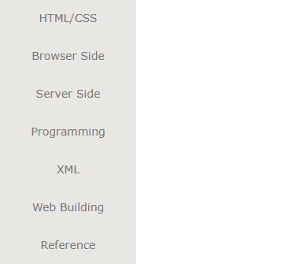
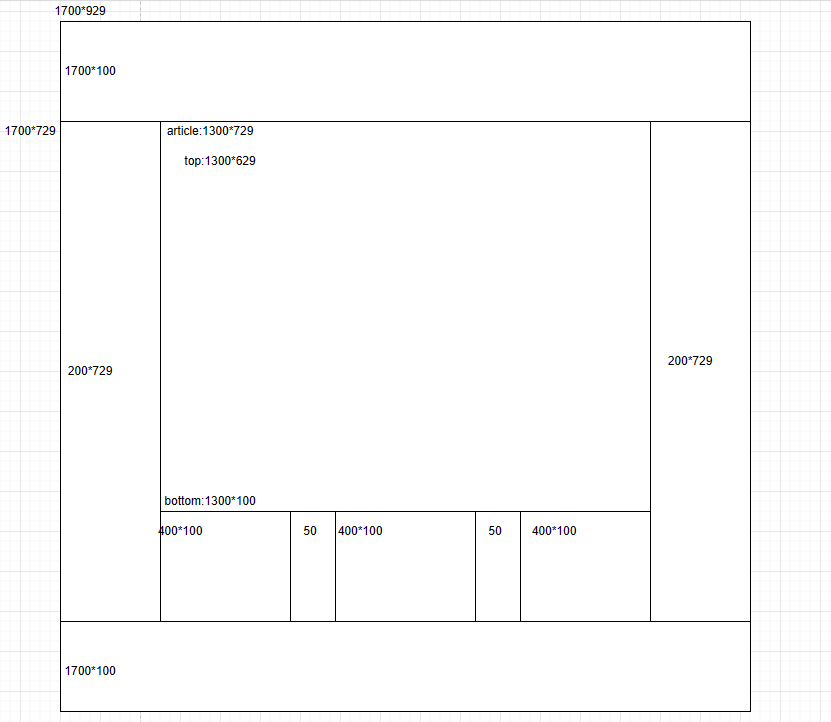

# 浮动流

## 1. 浮动的简介

通过浮动可以使一个元素向其**父元素的左侧或右侧**移动

使用`float`属性来设置于元素的浮动

- `none` 默认值，元素不浮动
- `left` 元素向左浮动
- `right` 元素向右浮动

注意

- 元素设置浮动以后，水平布局的等式便不需要强制成立
- 元素设置浮动以后，会完全从文档流中脱离，不再占用文档流的位置，所以元素下边的还在文档流中的元素会自动向上移动

## 2. 浮动的特点

1. 浮动元素会完全脱离文档流，<mark>不再占据文档流中的位置</mark>

2. 设置浮动以后，元素会向父元素的左侧或右侧移动

3. 浮动元素默认<mark>不会从父元素中移出</mark>,边界就是父元素的边界

   ```html
   <style>
     .box1 {
       width: 100px;
       height: 100px;
       background-color: orange;
       float: left;
     }
   
     .box2 {
       width: 200px;
       height: 200px;
       background-color: red;
     }
   </style>
   
   <div class="box1"></div>
   <div class="box2"></div>
   ```

   

4. 浮动元素向左或向右移动时，<mark>不会超过前边的浮动元素</mark>（先来后到的顺序）

   ```html
   <style>
     .box1 {
       width: 200px;
       height: 200px;
       background-color: orange;
       float: left;
     }
   
     .box2 {
       width: 200px;
       height: 200px;
       background-color: red;
       float: left;
     }
   
     .box3 {
       width: 200px;
       height: 200px;
       background-color: yellow;
       float: left;
     }
   </style>
   
   <div class="box1"></div>
   <div class="box2"></div>
   <div class="box3"></div>
   ```

   

5. 浮动元素<mark>不会超过上边的浮动的兄弟元素</mark>

   ```html
   <style>
     .box1 {
       width: 300px;
       height: 300px;
       background-color: orange;
       float: left;
     }
   
     .box2 {
       width: 400px;
       height: 400px;
       background-color: red;
       float: left;
     }
   
     .box3 {
       width: 300px;
       height: 300px;
       background-color: yellow;
       float: right;
     }
   </style>
   
   <div class="box1"></div>
   <div class="box2"></div>
   <div class="box3"></div>
   ```

   

6. <mark>如果浮动元素的上边是一个没有浮动的块元素，则浮动元素无法上移</mark>

   ```html
   <style>
     .box1 {
       width: 200px;
       height: 200px;
       background-color: orange;
     }
   
     .box2 {
       width: 200px;
       height: 200px;
       background-color: red;
       float: left;
     }
   </style>
   
   <div class="box1"></div>
   <div class="box2"></div>
   ```

   

7. 浮动元素不会盖住文字，文字会自动环绕在浮动元素的周围，所以我们可以利用浮动来设置<mark>文字环绕</mark>图片的效果

   

简单总结：

- 浮动目前来讲它的主要作用就是让页面中的元素可以水平排列，通过浮动可以制作一些水平方向的布局
- 元素设置浮动以后，将会从文档流中脱离，从文档流中脱离后，元素的一些特点也会发生变化

## 3. 脱离文档流的特点

块元素：

- 块元素不再独占页面的一行
- 脱离文档流以后，块元素的宽度和高度默认都被内容撑开

```html
<style>
  .box1 {
    background-color: orange;
    /* float: left; */
  }
</style>

<div class="box1">hello</div>
```


行内元素：

- 行内元素脱离文档流以后会，特点和块元素一样

```html
<style>
  span {
    width: 200px;
    height: 200px;
    background-color: orange;
    float: left;
  }
</style>

<span>I am a Span</span>
```


脱离文档流之后的特点很像行内块元素，不过存在一些差异

> 行内块元素会有一个间距

```html
<style>
  span {
    width: 200px;
    height: 200px;
    background-color: orange;
    /* display: inline-block; */
    float: left;
  }
</style>

<span>I am a Span</span>
<span>I am a Span</span>
```


## 4. 练习：w3school 导航条


去除默认样式，引入 reset.css

```html
<link rel="stylesheet" href="css/reset.css" />
```

css 样式

```css
/* 去除默认样式 */
a {
  text-decoration: none;
}

/* ul整体布局 */
.menu {
  width: 1211px;
  height: 48px;
  background-color: #e8e7e3;
  margin: 100px auto;
}

/* li整体布局 */
.nav {
  /* 浮动li元素 */
  float: left;
  width: 173px;
  line-height: 48px;
}

.nav a {
  /* 注意点：升级为块元素，使之继承父类宽高
    否则鼠标悬浮在li元素上时，鼠标“箭头”不会进入a元素变成“小手” */
  display: block;
  /* 内容水平居中 */
  text-align: center;
  /* 字体样式 */
  font-size: 14px;
  color: #777777;
  font-family: Verdana, Arial, "微软雅黑", "宋体";
}

/* 超链接悬浮效果 */
.nav a:hover {
  background-color: #3f3f3f;
  color: #e8e7e3;
}
```

html 代码

```html
<ul class="menu">
  <li class="nav"><a href="#">HTML/CSS</a></li>
  <li class="nav"><a href="#">Browser Side</a></li>
  <li class="nav"><a href="#">Server Side</a></li>
  <li class="nav"><a href="#">Programming</a></li>
  <li class="nav"><a href="#">XML</a></li>
  <li class="nav"><a href="#">Web Building</a></li>
  <li class="nav"><a href="#">Reference</a></li>
</ul>
```

效果


## 5. 简单布局

**整体样式**


**目的**

1. 熟悉布局（块元素、浮动）
2. 公共 css 部分复用
3. 复习语义标签

**代码**

html 代码

```html
<!-- 页眉 -->
<header></header>
<!-- 主体 -->
<main>
  <!-- 左边栏 -->
  <nav></nav>
  <!-- 中心 -->
  <article>
    <!-- 内容上 -->
    <div class="top"></div>
    <!-- 内容下 -->
    <div class="bottom">
      <!-- 内容左 -->
      <div class="left"></div>
      <!-- 内容中 -->
      <div class="middle"></div>
      <!-- 内容右 -->
      <div class="right"></div>
    </div>
  </article>
  <!-- 右边栏 -->
  <aside></aside>
</main>
<!-- 页脚 -->
<footer></footer>
```

css 代码

```css
/* 公共部分 */
header,
main,
footer {
  width: 1000px;
  margin: 10px auto;
}

main nav,
main article,
main aside {
  float: left;
  /* 虽然设置浮动了，但整体大小是被内容撑开的，所以设置一个高度,继承父元素的高度*/
  height: 100%;
}

.bottom .left,
.bottom .middle,
.bottom .right {
  float: left;
  width: 220px;
  height: 100%;
}

/* ==========整体布局-上========== */
header {
  height: 100px;
  background-color: silver;
}

/* ==========整体布局-中========== */
main {
  height: 400px;
  background-color: #bfa;
}

/* ------左边栏------ */
main nav {
  width: 150px;
  background-color: red;
}

/* ------中心------ */
main article {
  width: 680px;
  background-color: green;
  margin: 0 10px;
}

/* ---上--- */
article .top {
  height: 190px;
  background-color: yellow;
  margin-bottom: 10px;
}

/* ---下--- */
article .bottom {
  height: 200px;
  background-color: orange;
}

/* 左 */
.bottom .left {
  background-color: lightblue;
}

/* 中 */
.bottom .middle {
  background-color: gray;
  margin: 0 10px;
}

/* 右 */
.bottom .right {
  background-color: wheat;
}

/* ------右边栏------ */
main aside {
  width: 150px;
  background-color: blue;
}

/* ==========整体布局-下========== */
footer {
  height: 100px;
  background-color: tomato;
}
```

**效果**


## 6.我的浮动练习

### 1)侧边栏



```css
    <style>
        /* ul */
        .menu {
            float: left;
            width: 173px;
            height: calc(48*7)px;
            background-color: #e8e7e3;
        }

        /* li */
        .nav {
            line-height: 48px;
        }

        .nav a {
            /* 注意点：升级为块元素，使之继承父类宽高
            	布局一般使用块元素
                否则鼠标悬浮在li元素上时，鼠标“箭头”不会进入a元素变成“小手” */
            text-decoration: none;
            display: block;
            /* 内容水平居中 */
            text-align: center;
            /* 字体样式 */
            font-size: 14px;
            color: #777777;
            font-family: Verdana, Arial, "微软雅黑", "宋体";
        }

        /* 超链接悬浮效果 */
        .nav a:hover {
            /* 背景颜色 */
            background-color: #3f3f3f;
            /* 设置字体的颜色 */
            color: #e8e7e3;
        }
    </style>
    <ul class="menu">
        <li class="nav"><a href="#">HTML/CSS</a></li>
        <li class="nav"><a href="#">Browser Side</a></li>
        <li class="nav"><a href="#">Server Side</a></li>
        <li class="nav"><a href="#">Programming</a></li>
        <li class="nav"><a href="#">XML</a></li>
        <li class="nav"><a href="#">Web Building</a></li>
        <li class="nav"><a href="#">Reference</a></li>
    </ul>
```

### 2)网页布局



```css
    <style>
        /* 公共部分 */
        header,
        main,
        footer {
            width: 1700px;
            margin: 0 auto;
        }

        main nav,
        main article,
        main aside {
            float: left;
            /* 虽然设置浮动了，但整体大小是被内容撑开的，所以设置一个高度 */
            height: 100%;
        }

        .bottom .left,
        .bottom .middle,
        .bottom .right {
            float: left;
            width: 400px;
            height: 100%;
        }

        /* ==========整体布局-上========== */
        header {
            height: 100px;
            background-color: silver;
        }

        /* ==========整体布局-中========== */
        main {
            /*宽度继承,高度需要自己设置*/
            height: 729px;
            background-color: #bfa;
        }

        /* ------左边栏------ */
        main nav {
            /* height不继承main的高度 */
            width: 200px;
            background-color: red;
        }

        .menu {
            /* width:200px */
            height: 100%;
            background-color: #e8e7e3;
        }

        /* li设置 */
        .nav {
            width: 100%;
            /* 设置行高,否则字体元素上浮 */
            line-height: 104.1428571428571px;
        }

        .nav a {
            float: left;
            width: 100%;
            height: 100%;
            text-decoration: none;
            text-align: center;
            /* 字体样式 */
            font-size: 18px;
            color: #777777;
            font-family: Verdana, Arial, "微软雅黑", "宋体";
        }

        /* 超链接悬浮效果 */
        .nav a:hover {
            /* 背景颜色 */
            background-color: #3f3f3f;
            /* 设置字体的颜色 */
            color: #e8e7e3;
        }

        /* ------中心------ */
        main article {
            width: 1300px;
            /* height继承main的高度729px */
            background-color: green;
            /* margin: 0 10px; */
        }

        /* ---上--- */
        article .top {
            /* 块元素-宽度继承父元素article:1300px */
            height: 629px;
            background-color: yellow;
            /* margin-bottom: 10px; */
        }

        /* ---下--- */
        article .bottom {
            height: 100px;
            background-color: orange;
        }

        /* 左 */
        .bottom .left {
            /* 高度继承bottom的高度 */
            background-color: lightblue;
        }

        /* 中 */
        .bottom .middle {
            background-color: gray;
            margin: 0 50px;
        }

        /* 右 */
        .bottom .right {
            background-color: wheat;
        }

        /* ------右边栏------ */
        main aside {
            /* 高度继承main */
            width: 200px;
            background-color: blue;
        }

        /* ==========整体布局-下========== */
        footer {
            height: 100px;
            background-color: tomato;
        }
    </style>


    <!-- 页眉 -->
    <header>可以放一个导航栏</header>
    <!-- 主体 -->
    <main>
        <!-- 左边栏 -->
        <nav>
            <ul class="menu">
                <li class="nav"><a href="#">HTML/CSS</a></li>
                <li class="nav"><a href="#">Browser Side</a></li>
                <li class="nav"><a href="#">Server Side</a></li>
                <li class="nav"><a href="#">Programming</a></li>
                <li class="nav"><a href="#">XML</a></li>
                <li class="nav"><a href="#">Web Building</a></li>
                <li class="nav"><a href="#">Reference</a></li>
            </ul>
        </nav>
        <!-- 中心 -->
        <article>
            <!-- 内容上 -->
            <div class="top"></div>
            <!-- 内容下 -->
            <div class="bottom">
                <!-- 内容左 -->
                <div class="left"></div>
                <!-- 内容中 -->
                <div class="middle"></div>
                <!-- 内容右 -->
                <div class="right"></div>
            </div>
        </article>
        <!-- 右边栏 -->
        <aside></aside>
    </main>
    <!-- 页脚 -->
    <footer></footer>
```

