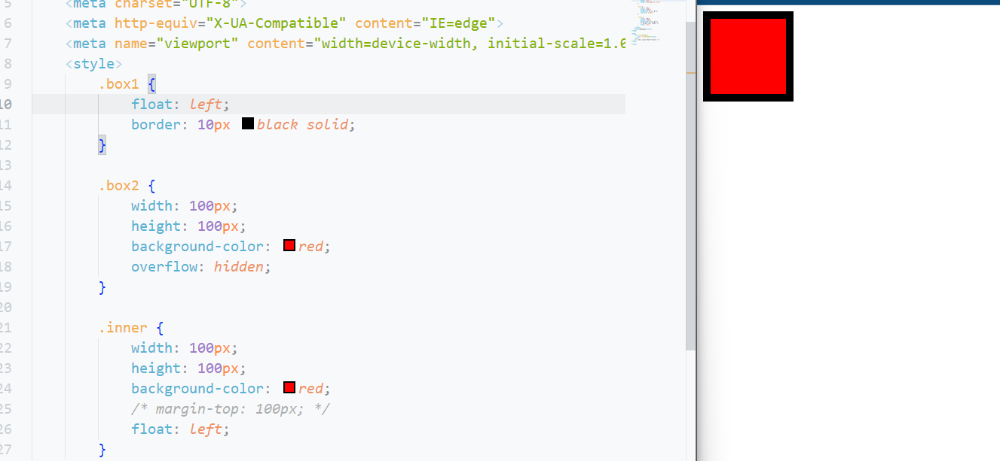

## 1. 高度塌陷

浮动主要用于元素的水平排列

在文档流中，父元素的高度默认是被子元素撑开的

当子元素浮动后，其会完全脱离文档流，子元素从文档流中脱离将会无法撑起父元素的高度，导致父元素的高度丢失

父元素高度丢失以后，其下的元素会自动上移，导致页面的布局混乱(影响到其他元素)

所以高度塌陷是浮动布局中比较常见的一个问题，这个问题我们必须要进行处理

也可以叫`高度溢出`

## 2. BFC

BFC（Block Formatting Context）块级格式化环境

- BFC 是一个 CSS 中的一个<mark>隐含的属性</mark>，可以为一个元素开启 BFC
- 开启 BFC 该元素会变成一个<mark>独立的布局区域</mark>

元素开启 BFC 后的特点：

- 不会被浮动元素覆盖(不会被下方的浮动元素覆盖)
- 父子元素外边距不会重叠(Outer和Inner的外边距不在一起)
- 可以包含浮动的子元素(Outer包含Inner)

### 开启方式

可以通过一些特殊方式来开启元素的 BFC：

#### float

- 设置为<mark>浮动（不推荐）</mark>：`float:left`

  - 开启outer的BFC

  - outer宽度和高度被inner撑起,脱离文档流

  - 很明显下方元素蓝块被浮动元素块覆盖

#### InlineBlock

- 设置为<mark>行内块元素（不推荐）</mark>：不再独占一行，宽度变了，同时与下方元素产生了一点空隙
  - 宽度消失

  - 且存在垂直布局上的边距

#### overflow

- 设置<mark>`overflow`为非`visible`值</mark>：

  - 本来用于裁剪溢出,但是在这里可以开启BFC
  - 可以不被浮动元素覆盖
  - 既没有覆盖元素，也保持了独占一方的特性（保持了宽度），与下方元素也保持了最初的间隙
  - 常用的方式为元素设置`overflow:hidden`（`overflow:auto`也是 ok 的） 开启Outer的BFC， 以使其可以包含浮动元素
  - `overflow:scroll` 会有滚动条，可能并不需要的，所以不太推荐
  - 

  开启BFC后,outer保持块特性,同时能够容纳浮动元素,内部子元素和外部的兄弟元素分开处理;


  ### 特性分析:

####  ①不会被浮动元素覆盖

```css
<!DOCTYPE html>
<html lang="en">

<head>
    <meta charset="UTF-8">
    <meta http-equiv="X-UA-Compatible" content="IE=edge">
    <meta name="viewport" content="width=device-width, initial-scale=1.0">
    <style>
        .box1 {
            width: 100px;
            height: 100px;
            background-color: antiquewhite;
            float: left;
            /* 开启后box1覆盖box2 */
        }

        .box2 {
            width: 100px;
            height: 100px;
            background-color: red;
        }
    </style>
    <title>Document</title>
</head>

<body>
    <div class="box1"></div>
    <div class="box2"></div>
</body>

</html>
```

- 

此时如果在box2中开启overflow

```css
overflow:hidden;
```

此时box2不会被box1覆盖,表现为两者平齐

- 

#### ②不会与子元素的外边距重叠

```
    <style>
        .box1 {
            width: 100px;
            height: 100px;
            background-color: antiquewhite;
            /* float: left; */
            /* 开启后BFC后box1与inner的外边距不会重叠, 
            inner的外边距是在box2内部处理的
            */
        }

        .box2 {
            width: 100px;
            height: 100px;
            background-color: red;
            overflow: hidden;
        }

        .inner {
            width: 50px;
            height: 50px;
            background-color: red;
            margin-top: 50px;
        }
    </style>
===============================================
    <div class="box1">
        <div class="inner"></div>
    </div>
    <!-- <div class="box2"></div> -->
```

- 

- 设置BFC后

  - ```
    float:hidden
    ```

  - 容纳inner,不会产生外边距问题
  -   

#### ③包含浮动子元素

- 不会被浮动的子元素覆盖住
- 没有开启时
  - 
  - 被inner覆盖注一部分边框
- 开启后
  - 
  - inner被包含

不过，这种方式也存在一定问题，如下，`overflow`并没有完全清除 div2 布局上受到的影响

  


**总结**

- 可以通过变成浮动元素，来防止自身被浮动元素覆盖
- 可以设置行内块，来防止自身及其他元素被浮动元素覆盖（
- 可以设置`overflow`属性，包含浮动元素


我们可以打开`Zeal`手册（《02-前端开发准备》有介绍），查看关于 BFC 的说明文档


打开`Block formatting context`模块后，可以看到有很多开启 BFC 的方式


| 元素或属性                                                   | 说明                                                         |
| ------------------------------------------------------------ | ------------------------------------------------------------ |
| `<html>`                                                     | 文档根元素                                                   |
| <mark>`float: left`</mark><br/><mark>`float: right`</mark>   | 浮动元素（`float`不为`none`）                                |
| <mark>`position: absolut`</mark><br/><mark>`position: fixed`</mark> | 绝对定位元素                                                 |
| <mark>`display: inline-block`</mark>                         | 行内块元素                                                   |
| `display: table-cell`                                        | 表格单元，默认值                                             |
| `display: table-caption`                                     | 表格标题，默认值                                             |
| `display: table`<br/>`display: table-row`<br/>`display: table-row-group`<br/>`display: table-header-group`<br/>`display: table-footer-group`<br/>`display: inline-table` | 匿名的表格单元，分别是 HTML 表格、表行、表体、表头和表脚的默认值 |
| <mark>`overflow: hidden`</mark><br/><mark>`overflow: scroll`</mark><br/><mark>`overflow: auto`</mark> | `overflow`不为`visible`和`clip`的块元素                      |
| `display: flow-root`                                         |                                                              |
| `contain: layout`<br/>`contain: content`<br/>`contain: paint` |                                                              |
| `display: flex`<br/>`display: inline-flex`的直接子元素       | Flex 项，如果它们本身既不是`flex`，也不是`grid`或`table`容器 |
| `display: grid`<br/>`display: inline-grid`的直接子元素       | Grid 项，如果它们本身既不是`flex`，也不是`grid`或`table`容器 |
| `column-count`不为`auto`<br/>`column-width`不为`auto`        | Multicol 容器，包含`column-count: 1`                         |
| `column-span: all`                                           | 应该总是创建一个新的格式化上下文，即使`column-span: all`元素不在 multicol 容器中 |

但是，注意不管哪种方式，多多少少都会有些隐患、缺陷或者说“副作用”

## 3. clear

我们这里设计三个兄弟元素，对前两个元素进行`float`的浮动属性设置


由于 box1 的浮动，导致 box3 位置上移也就是 box3 受到了 box1 浮动的影响，位置发生了改变（注意，这里文字并没有被覆盖，浮动的特点，其中第 7 点就是“文字环绕”的问题）

如果我们不希望某个元素因为其他元素浮动的影响而改变位置，可以通过`clear`属性来清除浮动元素对当前元素所产生的影响

`clear`作用：<mark>清除浮动元素对当前元素所产生的影响（本质是为元素添加一个`margin-top`属性，值由浏览器自动计算）</mark>

可选值：

- `left` 清除左侧浮动元素对当前元素的影响
- `right ` 清除右侧浮动元素对当前元素的影响
- `both` 清除两侧中影响较大一侧元素的影响（注意，这里不是同时清除两侧的影响）


```
/*相当于添加一个*/
margin-top:200px;
```

both,left和right

```css
<head>
    <meta charset="UTF-8">
    <meta http-equiv="X-UA-Compatible" content="IE=edge">
    <meta name="viewport" content="width=device-width, initial-scale=1.0">
    <title>Document</title>
    <style>
        div {
            font-size: 50px;
        }

        .box1 {
            width: 200px;
            height: 200px;
            background-color: #bfa;
            float: left;
            /* box1浮动,box3上移:box3受到box1的影响 */

        }

        .box2 {
            width: 400px;
            height: 400px;
            background-color: yellow;
            float: right;
            /* box1浮动,box3上移:box3受到box1的影响 */

        }

        .box3 {
            width: 200px;
            height: 200px;
            background-color: orange;
            /* 去除改变位置的影响 */
            /* clear: left; */
            /* clear: right; */
            /* right=相当于加上一个400px的外边距 */
            clear: both;
            /* 如果清除left的margintop大,就清除left的;
                如果清除right的margintop大,就清除right的;
            */
            /* margin-top: 200px; */
        }
    </style>
</head>

<body>
    <div class="box1">1</div>
    <div class="box2">2</div>
    <div class="box3">3</div>
</body>

</html>
```

- 

## 4. after

```css
<!DOCTYPE html>
<html lang="en">

<head>
    <meta charset="UTF-8">
    <meta http-equiv="X-UA-Compatible" content="IE=edge">
    <meta name="viewport" content="width=device-width, initial-scale=1.0">
    <title>Document</title>
    <style>
        .outer {
            border: 10px solid red;
            /* overflow: hidden; */
        }

        .inner {
            background-color: aqua;
            width: 100px;
            height: 100px;
            float: left;
        }


        /* .box3 {
            clear: both;
        } */
        .outer::after {
            /* 通过css向类内部的最后添加尾元素,可以使用::after伪类 */
            /* 添加一个行内元素,不会独占一行,会在inner后面排列 */
            content: "";
            clear: both;
            /* 
            display为什么要设置
            块元素转换
            设置after这个行内文本类,表示为块元素
            */
            display: block;
        }
    </style>
</head>

<body>
    <div class="outer">
        <div class="inner"></div>
        <!-- <div style="width: 100px;height: 100px;background-color: black;"></div> -->
        <!-- 浮动不会遮蔽文字，文字会在其周围环绕，可以利用box3清除浮动影响，此时可以撑起outer的高度-->
        <!-- <div class="box3">aa</div> -->
    </div>
    <div class="down"></div>
</body>

</html>
```

**为什么需要使用`display: block`呢？**

A：因为默认情况下，`::after`伪元素是一个行内元素，如果不转为块元素，将会排列在inner后面

## 5. clearfix

我们在盒模型一节中说过垂直布局中边距重叠的问题：相邻的垂直方向外边距会发生重叠现象,**清除父子元素的外边距共享**


如上图所示，子元素设置了一个`margin-top`之后，父元素跟随子元素一起进行了移动

即我们之前说的**父子元素间相邻外边距，子元素会传递给父元素**（上外边距）

```
.box1::after{
	content:"";
	display:block;
	clear:both;
}
```

没有任何变化


我们再来回顾下使用`after`伪元素的心路历程：

- 使用无内容的 box3 撑起 box1 ==》表现代替结构（`::after`代替 box3）
- `clear`清除浮动对元素产生的影响


其实就是给元素设置了一个`margin-top`属性，不过这个在开发者工具中是看不到的

既然如此，就相当于在 box2 下面添加一个 box3，然后给 box3 设置一个`margin-top`属性

具体点就是，<q>父子元素间相邻外边距，子元素会传递给父元素（上外边距）</q>，表现为 box1 和 box2 同步往下移动

那我们应该怎么做才能解决这个问题？怎么能够不满足？

让两个元素垂直外边距不相邻

### ::before(display-block)


我们用了`before`伪元素选择器，目的当然是让 box1 和 box2 的外边距不相邻，此时并没有效果

### ::before(display-inline-block)


好像是解决了父元素布局的问题，但是子元素怎么还往下跑了一段距离

- 因为`inline-block`兼顾行内元素和块元素的特点，既可以设置宽高也不独占一行

- 在没有设置宽高时，会存在一个默认高度，所以`inline-block`仍然行不通
- 相当于一个字

### ::before(display-table)


此时成功

- 隔开边距
- 不会占据位置

**Q1：为什么没有使用 clear 属性？**

A：clear`是为了清除浮动对布局的影响，我们现在没有浮动的元素啊，讨论的不是浮动的问题

**Q2：display 不是还有一个`none`属性么，为什么不用呢？**

A：`none`属性不占据位置，不能让元素相邻的外边距分离啊

**Q3：为什么`table`值就可以呢？**

A：这个问题问的非常好，算是问到点上了！我们上面在讲开启 BFC 的一些方法的时候，也提到了该属性。而且，应该牢记的是，元素开启 BFC 后的其中一个特点就是 <q><mark>父子元素外边距不会重叠</mark></q>。当然，这里也需要合理选择伪元素选择器，使其外边距不相邻才行

### 总结

- 高度塌陷问题，一般用`::after`
- 外边距重叠问题，一般用`::before`

### 同时解决高度塌陷和外边距重叠

`clearfix` 这个样式就可以同时解决高度塌陷和外边距重叠的问题

当在遇到这些问题时，直接使用`clearfix`这个类即可

```css
.clearfix::before,
.clearfix::after {
  content: "";
  display: table;
  clear: both;
}
```

其中`.clearfix::before`是为了解决外边距重叠问题

```css
.clearfix::before {
  content: "";
  display: table;
}
```

`.clearfix::after`是为了解决高度塌陷问题

```css
.clearfix::after {
  content: "";
  display: table;
  clear: both;
}
```

两者合在一起，就可以完美地解决高度塌陷和外边距重叠
