# 定位流

## 例子:一个不借助定位流定位的例子

```css
<!DOCTYPE html>
<html lang="en">

<head>
    <meta charset="UTF-8">
    <meta http-equiv="X-UA-Compatible" content="IE=edge">
    <meta name="viewport" content="width=device-width, initial-scale=1.0">
    <title>Document</title>
    <style>
        body {
            font-size: 50px;
        }

        .box1 {
            width: 200px;
            height: 200px;
            background-color: #bbffaa;
        }

        .box2 {
            width: 200px;
            height: 200px;
            background-color: orange;
        }

        .box3 {
            width: 200px;
            height: 200px;
            background-color: yellow;
        }
    </style>
</head>

<body>
    <div class="box1">1</div>
    <div class="box2">2</div>
    <div class="box3">3</div>
</body>

</html>
```

- 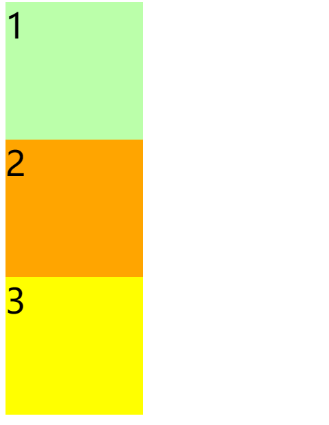

- 不借助定位流实现如下效果

  - 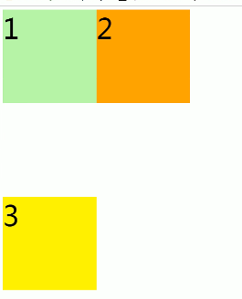

  - 使用margin-left右移2,margin-top负值上移;margin-top正值下移

  - ```css
        <style>
            body {
                font-size: 50px;
            }
    
            .box1 {
                width: 200px;
                height: 200px;
                background-color: #bbffaa;
            }
    
            .box2 {
                width: 200px;
                height: 200px;
                background-color: orange;
                margin-left: 200px;
                margin-top: -200px;
            }
    
            .box3 {
                width: 200px;
                height: 200px;
                background-color: yellow;
                margin-top: 200px;
            }
        </style>
    ```

  - 缺点:定位麻烦

## 定位

- 可以放置元素到页面的任意位置

### 使用-position属性

#### 可选值

```css
static:默认值,静止,没有开启定位
relative:相对定位,开启元素相对定位
absolute:开启元素绝对定位
fix:开启元素固定定位
sticky:开启元素粘滞定位
```

#### 相对定位relative

```css
position:relative
```

##### 特点

```css
1. 开启相对定位,不设置偏移量,元素不发生变化
	1.1 偏移量offset
		条件:开启定位
		作用:通过偏移量设置元素位置,类似margin-trbl(top,left影响自己;right,bottom影响其他元素)
			但是只会移动自己,不影响其他
			top,right,bottom,left;
			top:定位元素与定位位置`上边`的距离
				`top:100px`
			bottom:定位元素与定位位置`下边`的距离
			right:定位元素与定位位置`右边`的距离
			left:定位元素与定位位置`左边`的距离
		1.1.1定位元素是box
		1.1.2定位位置是什么?
			参照物:元素在文档流中的位置,就是其自身
2. 相对定位的含义其实就是相对自身的定位
3. 相对定位提升元素的层级
4. 相对定位不会使元素脱离文档流
5. 相对定位不会改变元素的性质(块依旧是块,行内依旧是行内)
```

- 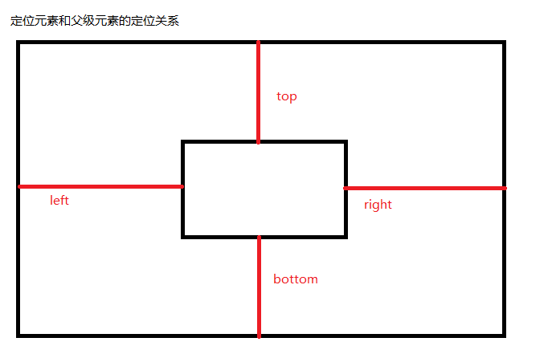
- 下面是错误理解
  - 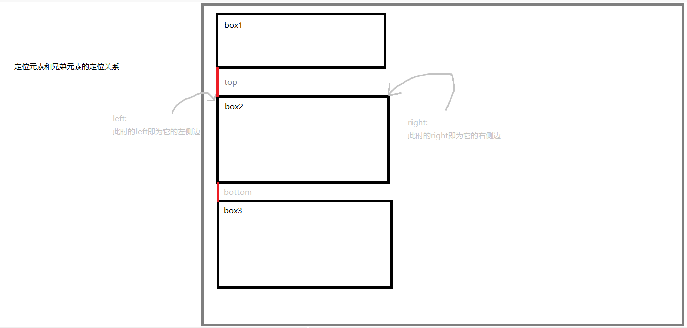
  - 正解
  - 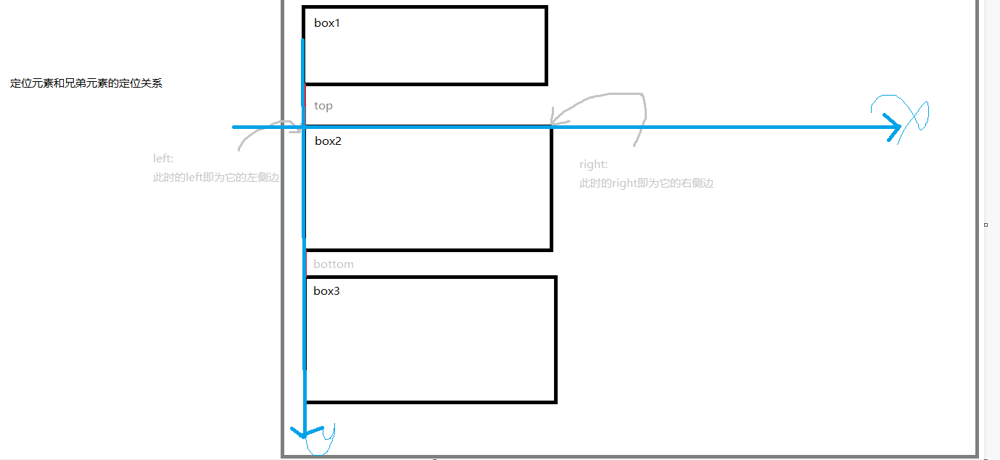

- ```css
          body {
              font-size: 50px;
          }
        
          .box1 {
              width: 200px;
              height: 200px;
              background-color: #bbffaa;
          }
        
          .box2 {
              width: 200px;
              height: 200px;
              background-color: orange;
              position: relative;
              /*==============修改部分*/
              left: 200px;
              bottom: 200px;/*或者top:-200px;*/
              /*==============修改部分*/
          }
        
          .box3 {
              width: 200px;
              height: 200px;
              background-color: yellow;
              /* margin-top: 200px; */
          }
  ```

  - 此时实现效果
  - 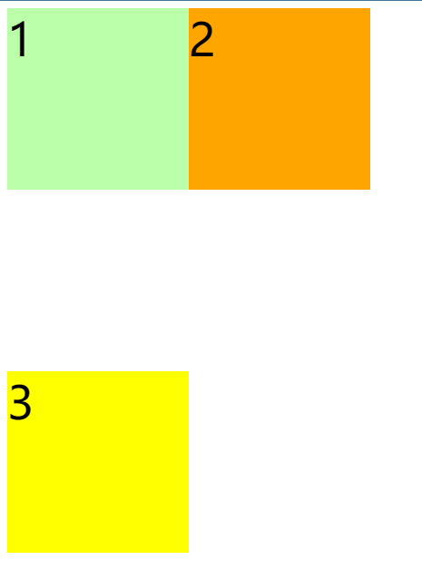

特点:相对定位的元素脱离原来的位置后任然独占一行,元素的级别任然是块级,3块依旧没有上来

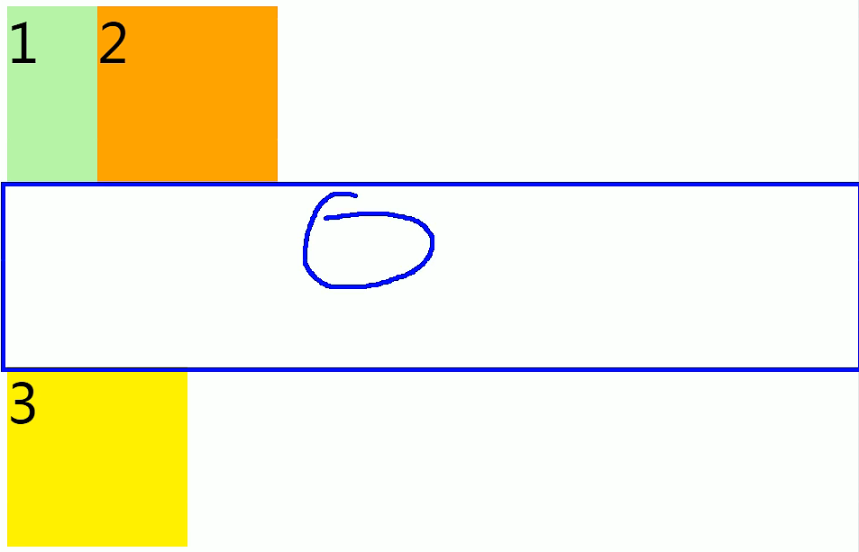

#### 绝对定位absolute

```css
position:absolute
```

##### 特点

```css
1. 开启绝对定位,不设置偏移量,元素位置不发生变化
```

```css
2. 但是脱离了文档流,此时块3上移被块2盖住
```

```css
3. 改变元素的性质(同2)
	3.1 行内变成块;
	3.2 块的宽高被内容撑开
```

- 块的宽高被内容撑开
  - 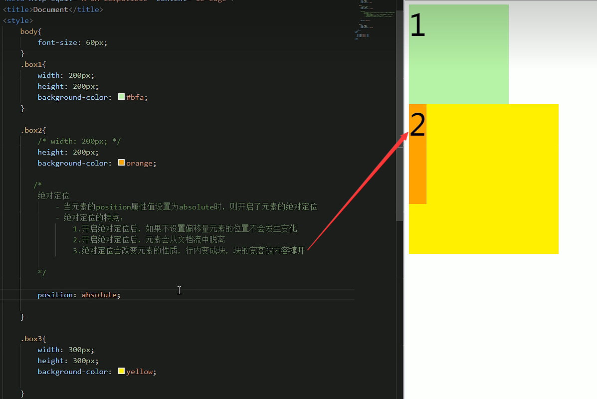

```css
4. 绝对定位使元素提升层级(2盖住3)
```

```
5. 绝对定位的xy轴:相对于包含块定位
	5.1 包含块(containing block)
		- 普通文档流元素:
			离当前元素最近的祖先级元素
			例子:div(span(em)),em和span的包含元素都是div,因为span是一个行内元素,不算包含`块`
		- 绝对定位元素:
			离当前元素最近的开启定位的祖先级元素
			如果所有的祖先元素都没有开启定位,就像对于根元素(初始包含块)就是其包含块
```

测试:

图1:

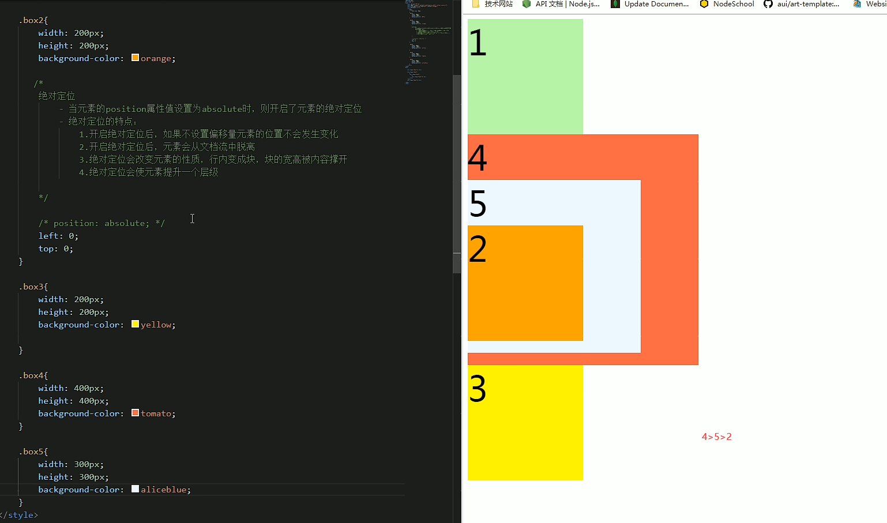

图2:打开2的绝对定位

> 2的原点在网页原点

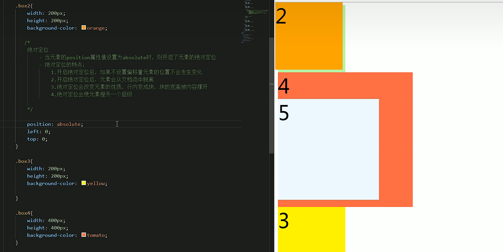

图3:打开box4和box5的相对定位

> 此时2的原点在5块原点上

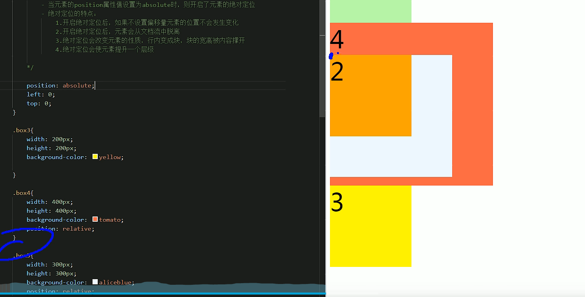

图4:只开4块的相对

> 2的原点在4块上

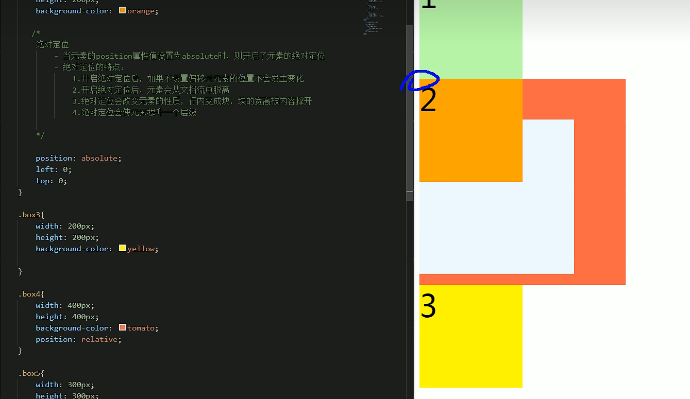

#### 固定定位fixed

```
position:fixed
```

##### 特点

```
1.大部分特点和绝对定位一样
2.唯一不同的是:
	固定定位永远参考浏览器的视口定位
	2.1 视口
		特点:视口大小不变,固定不动;所以此时设置fixed的元素会一直在视线范围内
			不会随网页的滚动条滚动
		距离:赖皮广告,导航条,侧边活动栏
```


#### 粘滞定位sticky

```
position:sticky
```

##### 兼容性:

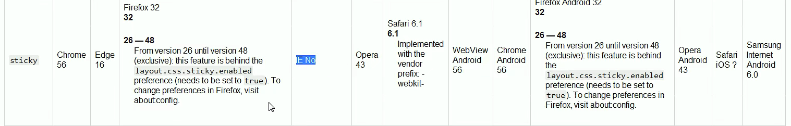

##### 特点:

```
正常情况下滚动,到一定位置时固定成为粘滞
1. 特点基本和绝对定位的特点一致
2. 可以使元素在到达某个位置时固定
3. 参考包含块
```

##### 例子:

使下面这个ul组件在跟随滚动条移动到页面首部时不再滚动

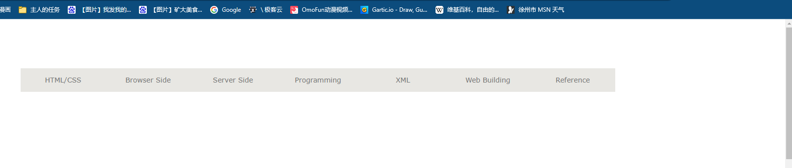

- 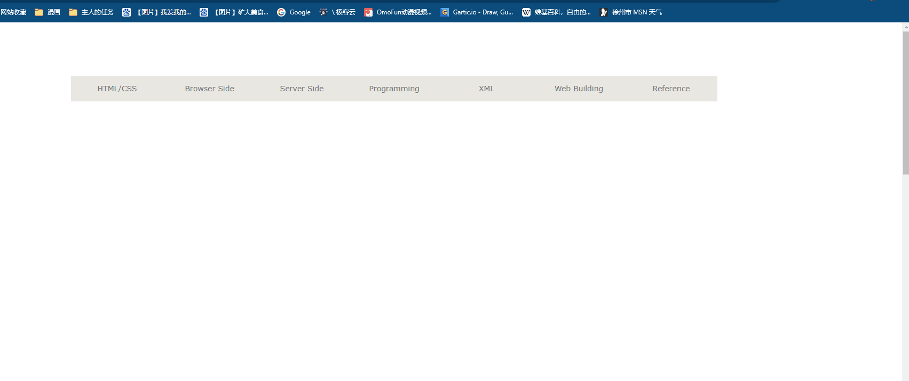

```css
        .menu {
            width: 1211px;
            height: 48px;
            background-color: #e8e7e3;
            margin: 100px auto;
            /*add*/
            position: sticky;
            top: 0px;
        }
```

## 绝对定位元素的布局

### 水平方向的布局

我们之前说过，水平方向的布局等式：

`margin-left + border-left + padding-left + width + padding-right + border-right + margin-right = 其父元素的宽度`

当使用绝对定位时，需要添加`left`和`right`两个值（此时规则和之前一样，只是多添加了两个值）

`left + margin-left + border-left + padding-left + width + padding-right + border-right + margin-right + right = 其父元素的宽度`

当发生**过度约束**时

- 如果 9 个值中没有`auto`，则自动调整`right`值以使等式满足（之前 7 个值是`margin-right`）
- 如果 9 个值中有`auto`，则自动调整`auto`的值以使等式满足

可设置`auto`的值：`margin-left`/`margin-right` /`width `/`left `/`right`

因为`left`和`right`的值默认是`auto`，所以如果没有设置`left`和`right`，当等式不满足时，则会自动调整这两个值

当指定`left`和`right`的值为非auto时:如`width`的值为auto时,优先调整width

```css
left:0;
right:0;
margin:auto;
//此时父元素的width较大,为1000;子元素为100px
//0+auto+pad+border+100+pad+border+auto+0!=1000
//auto=900/2=450
```

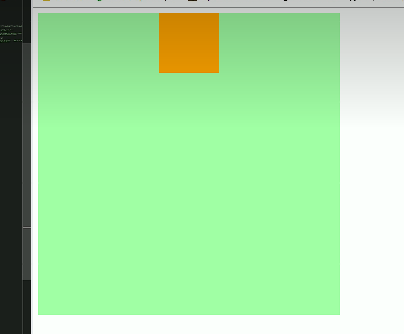

### 垂直方向的布局

垂直方向布局的等式的也必须要满足

<mark>`top + margin-top + border-top + padding-top + height + padding-bottom + border-bottom + margin-bottom + bottom = 其包含块的高度`</mark>

<table >
    <tr>
    	<th>列1</th>
        <th>列2</th>
        <th>列3</th>
    </tr>
</table>


### 垂直居中

```css
.box2 {
  width: 100px;
  height: 100px;
  background-color: orange;
  /* 左右外边距设置为auto */
  margin-top: auto;
  margin-bottom: auto;
  /* 绝对定位 */
  position: absolute;
  top: 0;
  bottom: 0;
}
```


### 水平垂直居中

目前，我们可以根据绝对定位进行元素的水平垂直双方向居中，所以这个方法只是其中之一

```css
.box2 {
  width: 100px;
  height: 100px;
  background-color: orange;
  /* 左右外边距设置为auto */
  margin: auto;
  /*等价于所有margin的lrtb为auto*/
  /* 绝对定位 */
  position: absolute;
  top: 0;
  bottom: 0;
  left: 0;
  right: 0;
}
```


## 元素的层级

对于开启了定位元素，可以通过`z-index`属性来指定元素的层级(xy为平面轴,z为层的轴)

```css
z-index：1;
/*一般设置正数*/
```

- `z-index`需要一个整数作为参数，值越大元素的层级越高，元素的层级越高越优先显示
- 兄弟元素之间，如果元素的层级一样，则优先显示靠下的元素
- 祖先的元素的层级再高，也不会盖住后代元素
  - 后代元素就继承了祖先元素的层级


> 只要是定位就是由z-index决定先后的

