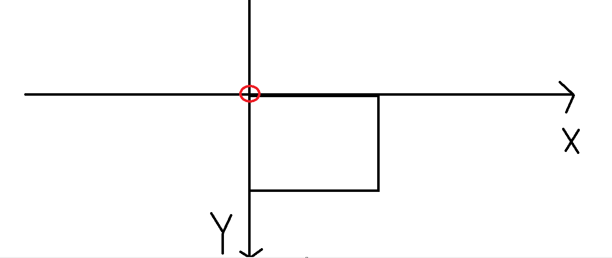
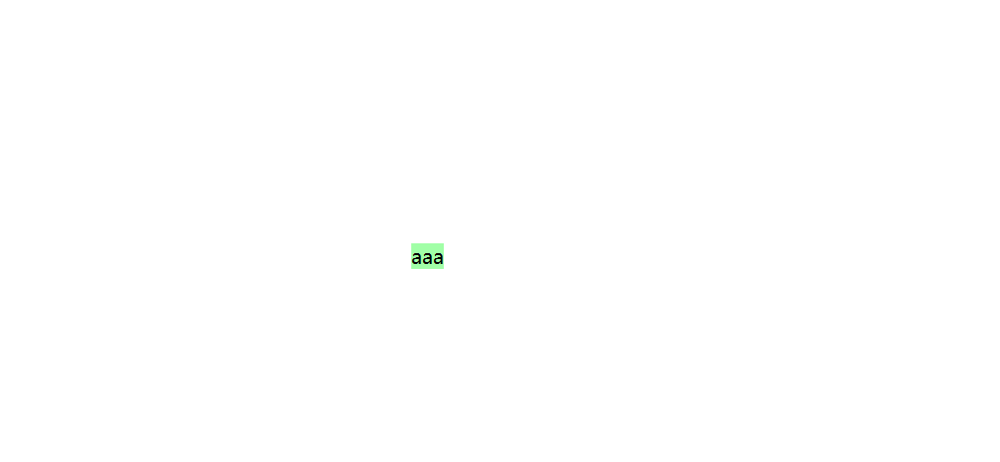

# 过渡

## 例子

```css
<!DOCTYPE html>
<html lang="en">

<head>
    <meta charset="UTF-8">
    <meta http-equiv="X-UA-Compatible" content="IE=edge">
    <meta name="viewport" content="width=device-width, initial-scale=1.0">
    <style>
        * {
            margin: 0;
            padding: 0;
        }

        .box1 {
            width: 800px;
            height: 800px;
            background-color: silver;
            overflow: hidden;
        }

        .box1 div {
            width: 100px;
            height: 100px;
            margin-bottom: 100px;
        }

        .box2 {
            background-color: #bfa;
        }
    </style>
    <title>Document</title>
</head>

<body>
    <div class="box1">
        <div class="box2"></div>
    </div>
</body>

</html>
```

实现:在鼠标移入box1的时候,box2变成200px

```css
        .box1:hover .box2 {
            width: 200px;
            height: 200px;
        }
```

> 虽然实现了这个作用,但是100px->200px是瞬间的行为,我们需要一个缓慢的过渡

## transition

```css
属性:transition
	作用:过渡,在图片的一个属性发生变化的时候缓慢进行变化,设置在属性的内部
	`transition:all 2s;`
	所有属性变化时需要两秒
```

## transition-property

过渡属性

- 指定需要过渡的属性

```css
transition-property:width;//指定一个
transition-property:width,height;//指定多个,使用`,`隔开
transition-property:all;//指定所有,all
```

- 支持过渡的属性

  - 可计算的数值型属性`px`,`rgb`

- 过渡需要从一个有效的数值向另一个有效的数值过渡

  - 值也不能是auto,必须是一个有效数值

  - ```css
            .box2 {
                background-color: #bfa;
                /* add */
                margin-left: 0px;
                transition-property: all;
                transition-duration: 2s;
            }
          
            .box1:hover .box2 {
                /* add */
                margin-left: 700px;
            }
    ```

  - 初始
  - hover后移动
  
   能否对过渡的速度进行控制,先快后慢,先慢后快?

## transition-duration

过渡效果持续的时间

```css
transition-duration:2s;
```

单位:s,ms

```css
1s=1000ms
```

分别指定过渡时间

```css
        transition-property: width,height;
        transition-duration: 2s,20ms;
```

## transition-timing-function

过渡的时序函数,指定过渡执行的方式

**可选值**:

```css
ease:默认值,慢速开始,再加速,最后减速
linear:线性,匀速
ease-in:慢速开始,逐渐加速
ease-out:快速开始,逐渐减速
ease-in-out:基本上同ease,先加速后减速;通过
/*通过贝塞尔曲线指定*/
cubic-bezier():指定时序函数
url:https://cubic-bezier.com/#.17,.67,.83,.67
steps(n):分步执行过渡效果
	steps(n,arg1):arg1有end结束,start开始
		steps(2,end):time:2s,则过渡执行事件[0-1-2],在1和2的结尾执行
		steps(2,start):time:2s,则过渡执行事件[0-1-2],在0和1的开头执行
	
```


指定图上的贝塞尔曲线的时候,可以再往回走

## transition-delay

过渡效果延迟;

等待一段时间后再执行过渡;

```css
参数:时间
transition-delay:2s
```

## 总体在transition写

无严格的次序要求

- 写延迟的时候,第一个是持续时间,第二个是延迟

推荐抒写顺序
  过渡时间 过渡样式 过渡形式 延迟时间 [，过渡时间 过渡样式 过渡形式 延迟时间]

```css
transition: 3s width linear 2s, 2s height linear 3s,4s background-color linear 2s;
```

```css
transition-property: margin-left;
transition-duration: 2s;
transition-timing-function: linear;
```

```
transition:margin-left 2s linear 2s;
```

## 应用:实现米兔的过渡效果


```css
<!DOCTYPE html>
<html lang="en">

<head>
    <meta charset="UTF-8">
    <meta http-equiv="X-UA-Compatible" content="IE=edge">
    <meta name="viewport" content="width=device-width, initial-scale=1.0">
    <style>
        .box1 {
            height: 271px;
            width: 132px;
            /* 块级元素自动补全居中 */
            margin: 0 auto;
            background-image: url(./img/bigtap-mitu-queue-big.png);
            /* 水平偏移 */
            background-position: 0 0;
            transition: 2s steps(3);
        }

        .box1:hover {
            /* 左移图片 */
            background-position: -396px 0;
        }
    </style>
    <title>Document</title>
</head>

<body>
    <div class="box1"></div>
</body>

</html>
```

# background

```
.box1{
	width:500px;
	heigth:500px;
}
```

## background-color

设置背景颜色

## background-img

设置背景图片

```css
background-img:url("../img/xxx.jpg");
```

可以同时设置:背景颜色成为背景图片的背景色(前提是背景图片是透明的)

- 如果背景图片<元素，则背景图片会自动在元素中平铺将元素铺满
- 如果背景图片>元素，则背景图片一部分会无法完全显示
- 如果背景图片=元素，则背景图片会直接正常显示

例子:

```css
img:500*600,有一部分不显示
img:500*400,双向平铺一部分
img:500*500,正常显示
```

## background-repeat

`background-repeat` 设置背景图片的重复方式

- `repeat` 默认值，背景图片沿着 x 轴和 y 轴双方向重复
- `repeat-x` 背景图片沿着 x 轴方向重复
- `repeat-y` 背景图片沿着 y 轴方向重复
- `no-repeat` 背景图片不重复

## background-position

`background-position` 设置背景图片的位置

- 通过`top` `left` `right` `bottom` `center`几个表示方位的词来设置背景图片的位置：

  - ```css
    九宫格
    `left top` 		`center top` 			`right top`
    `left center 	`center center` 		`right center`
    `left bottom` 	`center bottom` 		`right bottom`
    ```

- 使用方位词时必须要同时指定两个值，如果只写一个则第二个默认就是`center`

- 通过偏移量来指定背景图片的位置：

  - 水平方向偏移量、垂直方向变量

  - x,y

  - ```
    background-position:0px 0px;
    ```

  - 使用负值比较多

border的背景也有background


## background-clip

`background-clip` 设置背景的范围

- `border-box` 默认值，背景会出现在边框的下边
- `padding-box` 背景不会出现在border，只出现在content和padding
- `content-box` 背景只会出现在内容区

## background-origin

`background-origin` 背景图片的偏移量计算的原点

- `padding-box` 默认值，`background-position`从内边距处开始计算

- `border-box` 背景图片的变量从边框处开始计算
- `content-box` 背景图片的偏移量从内容区处计算

## background-size

`background-size` 设置背景图片的大小

- 第一个值表示宽度，第二个值表示高度；如果只写一个，则第二个值默认是`auto`

  - ```css
    background-size:200px,auto;<=>background-size:200px;
    第二个值自动随图片的宽度等比例缩放
    ```

- `cover` 图片的比例不变，将元素铺满

  - 把元素按原比例铺满

  - ```css
    background-size:100%,auto;
    ```

- `contain` 图片比例不变，将图片在元素中完整显示

  - 完整显示

  - ```css
    background-size:auto,100%;
    ```

## 应用:调整box中的图片显示

```css
<!DOCTYPE html>
<html lang="en">

<head>
    <meta charset="UTF-8">
    <meta http-equiv="X-UA-Compatible" content="IE=edge">
    <meta name="viewport" content="width=device-width, initial-scale=1.0">
    <style>
        .box1 {
            width: 500px;
            height: 500px;
            background-image: url(./img/typora_bg.png);
            background-size: auto 100%;
            /* background-position: -100px; */
        }
    </style>
    <title>Document</title>
</head>

<body>
    <div class="box1"></div>
</body>

</html>
```

显示如下:

- 
- 将注释掉的`/* background-position: -100px; */`复位
  - 水平方向左移100px
  - 

## background-attachment

`background-attachment` 背景图片是否跟随元素移动

- `scroll` 默认值，背景图片会跟随元素移动
- `fixed` 背景会固定在页面中，不会随元素移动

```css
<!DOCTYPE html>
<html lang="en">

<head>
    <meta charset="UTF-8">
    <meta http-equiv="X-UA-Compatible" content="IE=edge">
    <meta name="viewport" content="width=device-width, initial-scale=1.0">
    <style>
        .box1 {
            position: relative;
            width: 500px;
            height: 500px;
            background-image: url(./img/typora_bg.png);
            background-size: auto 100%;
            background-position: -100px;
            overflow: scroll;
        }

        .box2 {
            position: absolute;
            top: 10px;
            left: 10px;
            width: 200px;
            height: 1000px;
            background-color: aqua;
            background-image: url(./img/QQ图片20230103210540.jpg);
            background-size: auto 200px;
            background-repeat: no-repeat;
			/*background-attachment:scroll;*/
        }
    </style>
    <title>Document</title>
</head>

<body>
    <div class="box1">
        <div class="box2">
            孤独摇滚<br />
            孤独摇滚<br>
            孤独摇滚<br>
        </div>
    </div>
</body>

</html>
```

- 此时box2中背景会跟随元素移动
  - 

- 设置fixed后背景不跟随移动
  - 

# 动画

过渡属于一个交互效果,不会自己移动

实际表现和过渡类似,但是动画会自动触发效果

动画和过渡类似，都是可以实现一些动态的效果，不同的是

- 过渡需要在某个属性发生变化时才会触发
- 动画可以自动触发动态效果

设置动画效果，必须先要设置一个**关键帧**，关键帧设置了动画执行每一个步骤

```css
/*写在和选择器平级的地方*/
@keyframes test {
    /*from可以写0%,动画的开始位置*/
  from {
    margin-left: 0;
  }
    /*to可以写100%,动画的结束位置*/
  to {
    margin-left: 900px;
  }
}
```

设置动画

```css
        .box2 {
            background-color: #bfa;
            /* 设置动画 */
            /* animation-name:对元素生效的关键帧的名字 */
            animation-name: test;
            /* 设置动画的持续时间 */
            animation-duration: 2s;

        }
```

## animation-name

`animation-name` 指定动画的关键帧名称

## animation-duration

`animation-duration`：指定动画效果的持续时间

## animation-delay

`animation-delay`：动画效果的延迟，等待一段时间后在执行动画

## animation-timing-function

`animation-timing-function`：动画的时序函数

动画从各个关键帧处的移动速度

## animation-iteration-count

循环次数

`animation-iteration-count` 动画执行的次数

- 可选值

- `infinite` 无限执行

  - ```css
                animation-iteration-count: infinite;
    ```

- 一个常数

  - ```css
                animation-iteration-count: 2;
    ```


## animation-direction

`animation-direction` 指定动画运行的方向

- `normal` 从`from`向`to`运行，每次都是这样，默认值

- `reverse` 从`to`向`from`运行，每次都是这样

- `alternate` 从`from`向`to`运行，重复执行动画时反向执行

  - 相当于

  - ```css
            /*写在和选择器平级的地方*/
            @keyframes test {
          
                /*from可以写0%*/
                from {
                    margin-left: 0;
                }
          
                50% {
                    margin-left: 700px;
                }
          
                /*to可以写100%*/
                to {
                    margin-left: 0;
                }
            }
    ```

    

- `alternate-reverse` 从`to`向`from`运行，重复执行动画时反向执行

## animation-play-state

`animation-play-state` 设置动画的执行状态

- `running` 动画执行，默认值
- `paused` 动画暂停
  - 也可以在伪类中设置这个属性,使动画停留在任意位置


## animation-fill-mode

`animation-fill-mode` 动画的填充模式

- `none` 动画执行完毕，元素回到原来位置，默认值
- `forwards` 动画执行完毕，元素会停止在动画结束的位置(对应none)
- `backwards` 动画延时等待时，元素就会处于动画开始的位置
  - 动画开始的位置其实就是from关键帧中的状态

- `both` 结合了`forwards`和`backwards`

## 简写属性

duration前,delay后;其他的没有固定顺序

```css
animation:test 2s infinite 1s alternate
```

## 小练习:奔跑的小人

```
1536*256
6个动作
1536/6=256
bg-pos:
	0-256-512-768-1024-1280
	(0,256,512,768,1024,1280)
	0-第一个动作
	256-第二个
	512-3
	768-4
	1024-5
	1280-6
	[1,6]5段,进行5次展示
```

****

```css
<!DOCTYPE html>
<html lang="en">

<head>
    <meta charset="UTF-8">
    <meta http-equiv="X-UA-Compatible" content="IE=edge">
    <meta name="viewport" content="width=device-width, initial-scale=1.0">
    <style>
        .box1 {
            width: 256px;
            height: 256px;
            margin: 100px auto;
            background-image: url(./img/bg2.png);
            background-position: 0px;
            animation-name: run;
            animation-delay: 0.1s;
            animation-duration: 2s;
            animation-timing-function: steps(5, start);
            /* animation-iteration-count: infinite; */
            animation-fill-mode: backwards;
        }

        @keyframes run {
            0% {
                background-position: 0px 0;
            }

            100% {
                background-position: -1280px 0;
                /*
                如果写1536px,此时因为图片是平铺的所以是有显示的
                此时steps(6);
                */
            }
        }
    </style>
    <title>Document</title>
</head>

<body>
    <div class="box1"></div>
</body>

</html>
```

## 小练习:小球落地弹起


多个小球的实现

```css
<!DOCTYPE html>
<html lang="en">

<head>
    <meta charset="UTF-8">
    <meta http-equiv="X-UA-Compatible" content="IE=edge">
    <meta name="viewport" content="width=device-width, initial-scale=1.0">
    <style>
        .box1 {
            height: 500px;
            border-bottom: 10px solid black;
            margin: 50px auto;
            overflow: hidden;
        }


        .inner {
            width: 100px;
            height: 100px;
            border-radius: 50%;
            background-color: #bfa;
            animation-name: ball;
            animation-duration: 2s;
            animation-timing-function: ease-in;
            animation-direction: alternate;
            animation-iteration-count: infinite;
            /* cubic-bezier(.08,.75,.19,1) */
        }

        .box1>div {
            float: left;
            width: 100px;
            height: 100px;
            border-radius: 50%;
            animation-name: ball;
            animation-duration: 2s;
            animation-timing-function: ease-in;
            animation-direction: alternate;
            animation-iteration-count: infinite;
        }

        .box1 .inner1 {
            background-color: #bfa;
            animation-delay: .2s;
        }

        .box1 .inner2 {
            background-color: #bfa;
            animation-delay: .3s;
        }

        .box1 .inner3 {
            background-color: #bfa;
            animation-delay: .4s;
        }

        .box1 .inner4 {
            background-color: #bfa;
            animation-delay: .5s;
        }

        .box1 .inner5 {
            background-color: #bfa;
            animation-delay: .6s;
        }


        @keyframes ball {
            from {
                margin-top: 0px;
            }

            25% {
                margin-top: 400px;
                animation-timing-function: cubic-bezier(.08, .75, .19, 1);
            }

            50% {
                margin-top: 100px;
                animation-timing-function: ease-in;
            }


            to {
                margin-top: 400px;
            }
        }

        .box1>div:hover {
            background-color: green;
        }
    </style>
    <title>Document</title>
</head>

<body>
    <div class="box1">
        <div class="inner"> </div>
        <div class="inner1"> </div>
        <div class="inner2"> </div>
        <div class="inner3"> </div>
        <div class="inner4"> </div>
        <div class="inner5"> </div>
    </div>
</body>

</html>
```

# 变形transform

变形就是指通过 css 来改变元素的形状或位置

- 变形不会影响到页面的布局
- 
- box1的变形不会影响到box2的布局

`transform`用来设置元素的变形效果

## 平移translate

- `translateX()` 沿着x轴方向平移
- `translateY()` 沿着 y 轴方向平移
- `translateZ()` 沿着 z 轴方向平移平移元素

### translateX()&translateY()

#### 参数

**平移参数**:`px`

- 参考自身进行平移,可正可负
- 

```css
        .box1 {
            width: 200px;
            height: 200px;
            margin: 0 auto;
            background-color: #bfa;
            margin-top: 200px;
            transform: translateX(100px);
        }
```

- 此时右移100px

**平移参数**:`%`

百分比是相对于自身计算的

```css
transform: translateX(50%);
//移动自身宽度的50%
transform: translateY(100%);
//移动自身高度的100%
```

#### 应用:居中

使用定位流居中的问题

```
<div class="box"></div>
```

```css
        .box {
            width: 200px;
            height: 200px;
            /*此时大小确定*/
            background-color: #bfa;
            /* 下面开启居中定位 */
            position: absolute;
            margin: auto;
            left: 0;
            top: 0;
            bottom: 0;
            right: 0;

        }
```

> 开启定位流后,块的宽高被内容撑开,除非此时使用width和height设置
>
> 如果此时不设置width和height,只是一个单纯地文字块,想让他居中
>
> - ```
>   <div class="box"></div>
>   ```
>
> - ```css
>       .box {
>           background-color: #bfa;
>           /* 下面开启居中定位 */
>           position: absolute;
>           margin: auto;
>           left: 0;
>           top: 0;
>           bottom: 0;
>           right: 0;
>   
>       }
>   ```
>
> - 因为此时的width没有设置,所以是auto的,自动调整width适应等式
>
>   - 产生如图的效果
>   - 
>   - 这种居中方式只适用于元素的大小确定时
>   - 解决方式1:`display: table;`
>     - ok
>
> - 使用平移+定位实现水平居中
>
>   - ```css
>     position:absolute;
>     /*此时相对包含块根元素*/
>     left:50%;
>     /*水平50%*/
>     transform:translateX(-50%);
>     ```
>
> - 使用平移+定位实现垂直居中
>
>   - ```css
>     position:absolute;
>     /*此时相对包含块根元素*/
>     top:50%;
>     /*垂直50%*/
>     transform:translateY(-50%);
>     ```
>
> - 页面居中
>
>   - ```css
>     position:absolute;
>     /*此时相对包含块根元素*/
>     left:50%;
>     /*水平50%*/
>     transform:translateX(-50%);
>     top:50%;
>     /*垂直50%*/
>     transform:translateY(-50%);
>     /*注意transform只能写一个,只有一个会生效,作为一个简写属性,要写多个就写在一起*/
>     /*=================================*/
>                 position: absolute;
>                 /*此时相对包含块根元素*/
>                 left: 50%;
>                 top: 50%;
>                 /*水平垂直50%*/
>                 transform: translateX(-50%) translateY(-50%);
>     
>     ```
>
>   - OK

#### 应用:商品标签的平移和阴影

总的来说就是实现了一个浮出效果

```css
        .box1,
        .box2 {
            width: 200px;
            height: 300px;
            background-color: white;
            float: left;
            margin: 0 10px;
            /* transition: transform box-shadow 3s; */
            transition: transform .5s, box-shadow .3s;
        }

        .box1:hover,
        .box2:hover {
            transform: translateX(-4px) translateY(-4px);
            box-shadow: 0 0 10px rgba(107, 182, 90, 0.6);

        }
```


### traslateZ()

z 轴平移，调整元素在 z 轴的位置，正常情况就是调整元素和人眼之间的距离，

- 距离越大，元素离人越近

- z 轴平移属于立体效果（近大远小），默认情况下网页是不支持透视，如果需要看见效果必须要设置网页的视距
  - 视距perspective:设置给html
  - 单位px,值600-1200px
  - 人眼距离网页的距离5
- 当translzteZ()的值是perspective的时候,此时元素占据整个屏幕

> 注意:
>
> 给body设置bgc的时候,实际上是给html设置的
>
> 要查看body的真实大小,需要设置一个可见border

#### 应用:透视效果

```css
html {
  background-color: rgb(71, 44, 32);
   /*设置视距*/ 
  perspective: 800px;
}

.box {
  width: 200px;
  height: 300px;
  background-color: silver;
  margin: 100px auto;
  transition: all 0.3s;
}

.box:hover {
  box-shadow: 0 0 10px rgba(0, 0, 0, 0.2);
  transform: translateZ(200px);
}
```


如果此时不能显示这个效果,我们可以设置

```css
  transform:perspective(800px) translateZ(200px);
```

## 旋转rotate

通过旋转可以使元素沿着 x、y 或 z 旋转指定的角度

> 以X,Y,Z轴为转轴旋转

- `rotateX()`
- `rotateY()`
- `rotateZ()`

### **参数**

- deg度数
- turn圈数

```css
/* transform: rotateY(0.5turn); */
transform: rotateY(180deg);
```


```css
/* 是否显示背面的图片,visible表示显示,hidden表示隐藏 */
backface-visibility: hidden;
```

### 应用:综合旋转

```css
<!DOCTYPE html>
<html lang="en">

<head>
    <meta charset="UTF-8">
    <meta http-equiv="X-UA-Compatible" content="IE=edge">
    <meta name="viewport" content="width=device-width, initial-scale=1.0">
    <style>
        .box1 {
            width: 200px;
            height: 200px;
            margin: 200px auto;
            background-color: #bfa;
            transition: all 1s;
        }

        .box1:hover {
            transform: perspective(800px) rotateY(135deg) translateZ(100px);
            /* 是否显示背面的图片,visible表示显示,hidden表示隐藏 */
            backface-visibility: hidden;
            /*  先沿着Y轴旋转,再向上移动100px*/
            /* 上下两个效果不同 */
            /* transform: perspective(800px) translateZ(100px) rotateY(45deg); */
            /*  先向上移动100px,再沿着Y轴旋转*/
            box-shadow: 0 0 10px rgba(0, 0, 0, 0.6);
            /* size: 120%; */
        }
    </style>
    <title>Document</title>
</head>

<body>
    <div class="box1"></div>
</body>

</html>
```

### 应用:表的旋转

**秒针**

设置一个秒针

```css
        * {
            margin: 0;
            padding: 0;
        }

        .sec {
            height: 200px;
            width: 4px;
            background-color: red;
            margin: auto;
        }
```

如何让其沿着其边旋转:

```css
        @keyframes run {
            from {
                transform: rotateZ(0deg);

            }

            to {
                transform: rotateZ(360deg);
            }
        }
```

- 此时只是沿着其中心旋转

设置一个sec容器,让容器旋转,将sec放在sec容器的中心位置,此时可以实现效果

```css
    <style>
        * {
            margin: 0;
            padding: 0;
        }

        .sec-wrapper {
            height: 400px;
            width: 400px;
            border-radius: 50%;
            /* background-color: silver; */

            margin: 100px auto;
            animation: run 60s;
        }

        .sec {
            height: 200px;
            width: 4px;
            background-color: red;
            margin: 0 auto;
        }

        @keyframes run {
            from {
                transform: rotateZ(0deg);

            }

            to {
                transform: rotateZ(360deg);
            }
        }
    </style>
```

```css
    <div class="sec-wrapper">
        <div class="sec"></div>
    </div>
```

- 此时实现效果

**html 代码**

```html
<div class="clock">
  <div class="hour-wrapper">
    <div class="hour"></div>
  </div>
  <div class="minute-wrapper">
    <div class="minute"></div>
  </div>
  <div class="second-wrapper">
    <div class="second"></div>
  </div>
</div>
```

**css 代码**

```css
.clock {
  width: 500px;
  height: 500px;
  background-image: url("assets/鸭子表/clock.png");
  background-image: url("assets/鸭子表/clock_duck.jpg");
  background-size: cover;
  margin: 100px auto;
  position: relative;
}

.clock > div {
  position: absolute;
  top: 0;
  bottom: 0;
  left: 0;
  right: 0;
  margin: auto;
}

.clock > div > div {
  height: 50%;
  margin: 0 auto;
}

/* 时针 */
.hour-wrapper {
  height: 60%;
  width: 60%;
  animation: clock-run 720s infinite;
}

.hour {
  width: 8px;
  background-color: black;
}

/* 分针 */
.minute-wrapper {
  height: 75%;
  width: 75%;
  animation: clock-run 60s steps(60) infinite;
}

.minute {
  width: 4px;
  background-color: black;
}

/* 秒针 */
.second-wrapper {
  height: 90%;
  width: 90%;
  animation: clock-run 1s steps(60) infinite;
}

.second {
  width: 2px;
  background-color: red;
}

@keyframes clock-run {
  from {
    transform: rotateZ(0);
  }

  to {
    transform: rotateZ(360deg);
  }
}
```


### 应用:正方体旋转

设置正方体的原理:

```css
.surface1 {
  background-image: url("/assets/复仇者联盟/1.jpg");
    /*左侧面,translate*/
  transform: translateX(-100px) rotateY(90deg);
}
.surface2 {
  background-image: url("/assets/复仇者联盟/2.jpg");
    /*右侧面,translate*/
  transform: translateX(100px) rotateY(90deg);
}

.surface3 {
  background-image: url("/assets/复仇者联盟/3.jpg");
    /*上面,translate*/
  transform: translateY(-100px) rotateX(90deg);
}

.surface4 {
  background-image: url("/assets/复仇者联盟/4.jpg");
     /*下面,translate*/
  transform: translateY(100px) rotateX(90deg);
}

.surface5 {
  background-image: url("/assets/复仇者联盟/5.jpg");
    /*后面,translate*/
  transform: translateZ(-100px);
}

.surface6 {
  background-image: url("/assets/复仇者联盟/6.jpg");
    /*前面*/
  transform: translateZ(100px);
}
```

在容器中设置3d效果,否则不是3d的变化

```css
transform-style: preserve-3d;
```

html 代码

```html
<div class="cube">
  <div class="surface1"></div>
  <div class="surface2"></div>
  <div class="surface3"></div>
  <div class="surface4"></div>
  <div class="surface5"></div>
  <div class="surface6"></div>
</div>
```

css 代码

```css
html {
  perspective: 800px;
}

.cube {
  height: 200px;
  width: 200px;
  margin: 200px auto;
  position: relative;
  /* 设置3d变形效果 */
  transform-style: preserve-3d;
  animation: cube-rotate 12s infinite linear;
}

.cube div {
  height: 200px;
  width: 200px;
  background-size: cover;
  position: absolute;
  top: 0;
  left: 0;
  /* 为元素设置透明效果 */
  opacity: 0.85;
}

.surface1 {
  background-image: url("/assets/复仇者联盟/1.jpg");
  transform: translateX(-100px) rotateY(90deg);
}

.surface2 {
  background-image: url("/assets/复仇者联盟/2.jpg");
  transform: translateX(100px) rotateY(90deg);
}

.surface3 {
  background-image: url("/assets/复仇者联盟/3.jpg");
  transform: translateY(-100px) rotateX(90deg);
}

.surface4 {
  background-image: url("/assets/复仇者联盟/4.jpg");
  transform: translateY(100px) rotateX(90deg);
}

.surface5 {
  background-image: url("/assets/复仇者联盟/5.jpg");
  transform: translateZ(-100px);
}

.surface6 {
  background-image: url("/assets/复仇者联盟/6.jpg");
  transform: translateZ(100px);
}

@keyframes cube-rotate {
  from {
    transform: rotateX(0) rotateY(0) rotateZ(0);
  }

  to {
    transform: rotateX(1turn) rotateY(2turn) rotateZ(3turn);
  }
}
```


## 缩放scale

对元素进行缩放的函数

- `scalex()` 水平方向缩放

- `scaleY()` 垂直方向缩放

- `scale()` 双方向的缩放

- `scaleZ()`Z轴缩放

  - *Z轴缩放平时没有什么用,沿着Z轴拉长,如果只是一个平面的图,则不会有效果*

    ​        *必须要开启`transform-style: preserve-3d`;*

  - ```css
    <head>
        <meta charset="UTF-8">
        <meta http-equiv="X-UA-Compatible" content="IE=edge">
        <meta name="viewport" content="width=device-width, initial-scale=1.0">
        <style>
            .box1 {
                width: 200px;
                height: 200px;
                margin: 0 auto;
                overflow: hidden;
                border: 1px red solid;
                background-color: #bfa;
                transition: all 2s;
            }
    
            .box1:hover {
                /* Z轴缩放平时没有什么用,沿着Z轴拉长,如果只是一个平面的图,则不会有效果
                    必须由开启transform-style: preserve-3d;
                */
                transform: perspective(800px) scaleZ(2);
            }
        </style>
        <title>Document</title>
    </head>
    
    <body>
        <div class="box1">
            
        </div>
    </body>
    
    </html>
    ```

> `>1`放大
>
> `=1`不变
>
> `<1`缩小

```css
.box {
  height: 200px;
  width: 200px;
  background-color: #bfa;
  margin: 200px auto;
  transition: 2s;
}

.box:hover {
  /* transform: scaleX(2); */
  /* transform: scaleY(2); */
  transform: scale(2);
  /* 变形的原点 */
  transform-origin: 0 0;
}
```


### transform-origin

- 默认值:center
- 可选值:x y
  - `0 0`:元素的左上角
  - `50% 50%`:center
- 也可以以`px`为单位设置


### 应用:hover放大

网易新闻的类似效果

```css
    <div class="box1">
        
    </div>
```

```css
        .box1 {
            width: 200px;
            height: 200px;
            margin: 0 auto;
            overflow: hidden;
            border: 1px red solid;
        }

        img {
            width: 200px;
            transition: all .2s;
        }

        .box1:hover img {
            transform: scale(1.2);
        }
```


