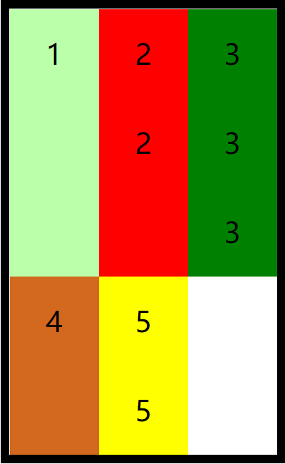

# 弹性盒

`flex`（弹性盒、伸缩盒）

- 是`css`中的又一种布局手段，它主要用来代替浮动来完成页面的布局
- `flex`可以使元素具有弹性，让元素可以跟随页面的大小的改变而改变

## 弹性容器

要使用弹性盒，必须先将一个元素设置为弹性容器

> 其内的元素变成弹性容器

我们通过`display` 来设置弹性容器

- `display:flex` 设置为块级弹性容器
  - 会独占一行

- `display:inline-flex` 设置为行内的弹性容器
  - 不会独占一行


```css
/* 设置弹性容器 */
display: flex;
display: inline-flex;
```

### 弹性元素的排列方向

flex-direction:指定弹性元素的排列方式(弹性容器的属性)

- 指定主轴

```css
row:行,横向排列,自左向右(默认值)
row-reverse:行,横向排列,自右向左
column:列,纵向排列,自上向下
column-reverse:列,纵向排列,自下向上
```

### 自动换行

`flex-wrap` 设置弹性元素是否在弹性容器中自动换行

此时元素溢出,且没有自动换行


- `nowrap` 默认值，元素不会自动换行
- `wrap` 元素沿着**辅轴**方向自动换行
- `wrap-reverse`元素沿着辅轴反向换行(3up 12down)

```css
/* 设置弹性元素排列方式 */
flex-direction: row;
/* 设置自动换行 */
flex-wrap: wrap;
```

换行,且此时元素不溢出

### flex-flow

`flex-flow` 是`wrap`和`direction`的简写属性,

- 同时设置两个顺序
- 没有顺序要求

```css
/* 简写属性 */
flex-flow: row wrap;
```

### 主轴属性

#### 空白空间

`justify-content` 如何分配主轴上的空白空间（主轴上的元素如何排列）

justify-主轴

- `flex-start` 元素沿着主轴`起始边(自a向b的a)`排列

  

- `flex-end` 元素沿着主轴`终止边(自a向b的b)`排列

  

- `center` 元素居中排列

  

- `space-around` 空白分布到元素两侧

  

- `space-between` 空白均匀分布到元素间

  

- `space-evenly` 空白分布到元素的单侧

  - 兼容性差

  


### 辅轴属性

#### 辅轴对齐

`align-items`元素在辅轴上如何对齐,元素之间对齐的方式

条件:

```html
    <ul>//width:300px,500px;flex;wrap row;align-items
        <li>1</li>
        <li>2
            <div>2</div>
        </li>
        <li>3
            <div>3</div>
            <div>3</div>
        </li>
        <li>4</li>
        <li>5
            <div>5</div>
        </li>
    </ul>
```

align:侧轴上的

- `stretch` 默认值，将元素的长度设置为相同的值

  

- `flex-start` 元素不会拉伸，沿着辅轴起边对齐

  - 


  

- `flex-end` 沿着辅轴的终边对齐

  - 元素靠下排列


  

- `center` 居中对齐

  

- `baseline` 基线对齐(不常用)

  

##### 应用:弹性盒中居中

利用弹性盒对元素进行水平垂直双方向居中

```css
justify-content: center;
align-items: center;
```


#### 空白空间

`align-content` 如何分配辅轴上的空白空间（辅轴上的元素如何排列）

- `flex-start` 元素沿着辅轴起边排列

  

- `flex-end` 元素沿着辅轴终边排列

  

- `center` 元素居中排列

  

- `space-around` 空白分布到元素两侧

  

- `space-between` 空白均匀分布到元素间

  

- `space-evenly` 空白分布到元素的单侧

  

### 总结:

> 弹性容器上的样式总体上都是控制弹性元素的排列对齐方式

## 主轴和侧轴

- 主轴：弹性元素的排列方向称为主轴
- 侧轴：与主轴垂直方向的称为侧轴

```css
row:行,横向排列,自左向右(默认值)
	主轴:自左向右
row-reverse:行,横向排列,自右向左
	主轴:自右向左
column:列,纵向排列,自上向下
column-reverse:列,纵向排列,自下向上
```

## 弹性元素

弹性容器的子元素是弹性元素（弹性项）

一个元素可以是弹性元素,也可以同时是弹性容器(flex可以嵌套)

```css
    <ul>
        <li>1</li>
			<div>div</div>
        <li>2</li>
        <li>3</li>
    </ul>
```

> ul.css是flex,则此时三个li都是弹性元素,但div不是ul的直接子元素,所以div不是弹性元素
>
> - 解决办法,可以设置li为弹性容器
>
>   - ```css
>     li.css:{display:flex}
>     ```
>
>   - 此时div为弹性容器

### flex-grow

指定弹性元素的伸展系数

父元素有多余的空间时,子元素如何伸展

- 默认0,不伸展
- 父元素的剩余空间，子元素会按照伸展系数比例进行分配

**举例**

```less
    <ul>//flex,width:800px,剩余:500px
		//li:100px 弹性元素
        <li>1</li>//grow:1 add:500*(1/6) after=100+500*(1/6)
        <li>2</li>//grow:2 add:500*(2/6) after=100+500*(2/6)
        <li>3</li>//grow:3 add:500*(3/6) after=100+500*(3/6)
    </ul>
```

### flex-shrink

指定弹性元素的收缩系数，默认值为 1

- 当父元素中的空间不足以容纳所有的子元素时，如何对子元素进行收缩
- 缩减系数的计算方式比较复杂，缩减多少是根据 _缩减系数_ 和 _元素大小_ 来计算
  - 1,等比例收缩
  - 0,不收缩
  - 缩减系数值越大,收缩的越多
  - 元素的大小越大,缩的越多

**举例**

```less
    <ul>//flex,width:200px 多100px
		//li:100px 弹性元素
        <li>1</li>//shrink:1 -:100*(1/6) after=100-100*(1/6) 
        <li>2</li>//shrink:2 -:100*(2/6) after=100-100*(2/6)
        <li>3</li>//shrink:3 -:100*(3/6) after=100-100*(3/6)
    </ul>
```

- 通过审查可以看到收缩的程度
  - 

### 应用:w3导航条

```css
    <ul class="menu">
        <li class="nav"><a href="#">HTML/CSS</a></li>
        <li class="nav"><a href="#">Browser Side</a></li>
        <li class="nav"><a href="#">Server Side</a></li>
        <li class="nav"><a href="#">Programming</a></li>
        <li class="nav"><a href="#">XML</a></li>
        <li class="nav"><a href="#">Web Building</a></li>
        <li class="nav"><a href="#">Reference</a></li>
    </ul>
```

```css
    <style>
        .menu {
            width: 1211px;
            height: 48px;
            background-color: #e8e7e3;
            margin: 100px auto;
            display: flex;
        }

        /* 去除默认样式 */
        a {
            text-decoration: none;
        }

        .nav {
            height: 48px;
            text-align: center;
            font-size: 20px;
            line-height: 48px;
            /* 设置 */
            flex-grow: 1;
        }

        .nav a {
            height:48px;
            /* 注意点：升级为块元素，使之继承父类宽高
            否则鼠标悬浮在li元素上时，鼠标“箭头”不会进入a元素变成“小手” */
            display: block;
            /* 内容水平居中 */
            text-align: center;
            /* 字体样式 */
            font-size: 14px;
            color: #777777;
            font-family: Verdana, Arial, "微软雅黑", "宋体";

        }

        .nav a:hover {
            background-color: #3f3f3f;
            color: #e8e7e3;
        }
    </style>
```

### align-self

覆盖辅轴

`align-self` 用来覆盖当前弹性元素上的`align-items`

```css
li:nth-child(1) {
  background-color: #bfa;
  align-self: flex-end;
}
```

### flex-basis

基础长度,弹簧的基础长度

`flex-basis` 指定的是元素在主轴上的基础长度

- 如果主轴是横向的，则该值指定的就是元素的宽度
- 如果主轴是纵向的，则该值指定的就是元素的高度
- 默认值是`auto`，表示参考元素自身的高度或宽度(一般)
- 如果传递了一个具体的数值，则以该值为准

```css
li:nth-child(1) {
  background-color: #bfa;
  flex-basis: 200px;
}
```

> flex-basis:
>
> flex-grow:
>
> flex-shrink:
>
> 简写:
>
> **简写属性flex**
>
> `flex`可以设置弹性元素所有的三个样式 `flex: 增长 缩减 基础`
>
> - `initial`：`flex: 0 1 auto`不伸展(初始值,默认值)
> - `auto`：`flex: 1 1 auto`可增可减(一般)
> - `none`：`flex: 0 0 auto` 弹性元素没有弹性,指定多少长度就是多少长度

### 排列顺序

`order` 决定弹性元素的排列顺序

```css
li:nth-child(1) {
  background-color: #bfa;
  order: 2;
}

li:nth-child(2) {
  background-color: red;
  order: 3;
}

li:nth-child(3) {
  background-color: green;
  order: 1;
}
```


> 能用flex就不用float

# 应用:淘宝


```css
<!DOCTYPE html>
<html lang="en">

<head>
    <meta charset="UTF-8">
    <meta http-equiv="X-UA-Compatible" content="IE=edge">
    <meta name="viewport" content="width=device-width, initial-scale=1.0">
    <style>
        * {
            margin: 0;
            padding: 0;
        }

        .nav {
            width: 100%;
        }

        .nav-inner {
            /* 设置每一行的容器,横向排列 */
            display: flex;
            justify-content: space-around;
        }

        .item {
            width: 15%;
            background-color: #bfa;
            /* flex: auto; */
            text-align: center;
        }

        .item img {
            /* 
            设置图片宽度和父元素一样 
            如果不设置,图片的大小不会变化
            设置之后,会跟随页面的大小变化
            */
            width: 100%;

        }

        .item a {
            text-decoration: none;
            font-size: 10vw;
            color: black;
        }
    </style>
    <title>Document</title>
</head>

<body>
    <!-- 外层容器nav -->
    <nav class="nav">
        <div class="nav-inner">
            <div class="item">
                <a href="#">
                    
                </a>
                <span>天猫</span>
            </div>
            <div class="item">
                <a href="#">
                    
                </a>
                <span>天猫</span>
            </div>
            <div class="item">
                <a href="#">
                    
                </a>
                <span>天猫</span>
            </div>
            <div class="item">
                <a href="#">
                    
                </a>
                <span>天猫</span>
            </div>
            <div class="item">
                <a href="#">
                    
                </a>
                <span>天猫</span>
            </div>
        </div>
        <div class="nav-inner">
            <div class="item">
                <a href="#">
                    
                </a>
                <span>天猫</span>
            </div>
            <div class="item">
                <a href="#">
                    
                </a>
                <span>天猫</span>
            </div>
            <div class="item">
                <a href="#">
                    
                </a>
                <span>天猫</span>
            </div>
            <div class="item">
                <a href="#">
                    
                </a>
                <span>天猫</span>
            </div>
            <div class="item">
                <a href="#">
                    
                </a>
                <span>天猫</span>
            </div>
        </div>
    </nav>
</body>

</html>
```

