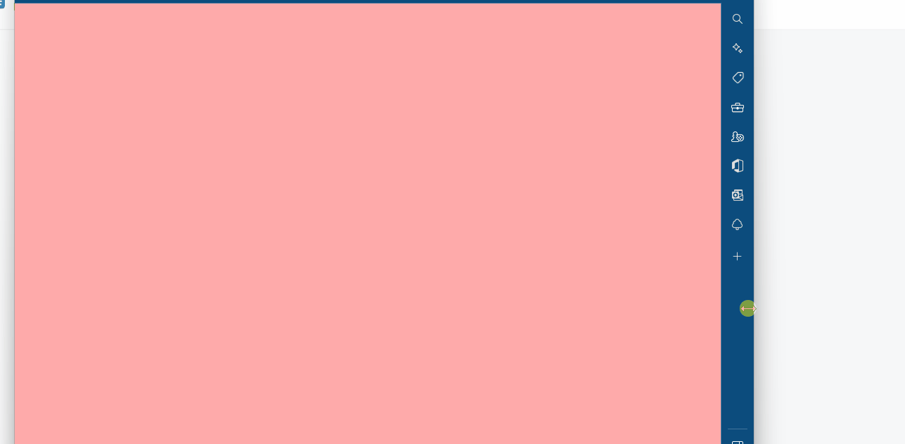

# 媒体查询

## 响应式布局

- 形式:网页可以根据不通的设备或窗口大小呈现出不同的效果
- 使用 *响应式布局*，可以使一个网页适用于所有设备
  - 响应布局的关键就是 *媒体查询*

- 通过媒体查询，可以为不同的设备，或设备不同状态来分别设置样式

## 媒体查询

### 媒体查询语法

- `@media 查询规则{}`

### **媒体类型**

- `all` 所有设备,默认值,可以不写

  - ```less
    @media all{
    	body{
    		bgc:#bfa;
    	}
    }
    //等价于
    /*
    @media{
    	body{
    		bgc:#bfa;
    	}
    }
    */
    ```

- `print` 打印设备
- `screen`带屏幕的设备

  - 手机,电脑

- `speech` 屏幕阅读器

  - 电子书?


可以使用`,`连接多个媒体类型，这样它们之间就是一个或的关系

```less
@media print,screen{
	body{
		bgc:#bfa;
	}
}
```

可以在媒体类型前添加一个`only`，表示只有。`only`的使用主要是为了兼容一些老版本浏览器

```less
@media  screen{
    //老版本兼容
	body{
		bgc:#bfa;
	}
}
@media only screen{//写或不写都是只有屏幕响应此布局,没有任何区别
    //老版本不认识only时,此时不响应这个布局
	body{
		bgc:#bfa;
	}
}
```

### **媒体特性**

- `width` 视口的宽度

  - ```less
            @media (width:500px) {
                //视口宽度为500px的时候,背景颜色改变
                body {
                    background-color: #bfa;
                }
            }
    ```

- `height` 视口的高度
- `min-width` 视口的最小宽度（视口大于指定宽度时生效,小于指定宽度时失效）

  - 指定最后的界限

- `max-width` 视口的最大宽度（视口小于指定宽度时生效）

  - 指定手机等移动设备适配的开始

  - ```less
            @media (max-width:1200px) {
                body {
                    background-color: #bfa;
                }
            }
    ```


### **断点**

样式切换的分界点，我们称其为断点，也就是网页的样式会在这个点时发生变化一般比较常用的断点

| 范围（px）                        | 类型（屏幕） | 写法（媒体特性）   |
| :-------------------------------- | :----------- | :----------------- |
| 小于768(**<768**)                 | 超小屏幕     | `max-width=768px`  |
| 大于768(**(768,992]**)            | 小屏幕       | `min-width=768px`  |
| 大于992(**(992,1260]**)           | 中型屏幕     | `min-width=992px`  |
| 大于1260(**(1260,device-width]**) | 大屏幕       | `min-width=1200px` |

**或的指定**

```less
        @media (min-width:1200px),(max-width:500px) {
        //(0,500)或者(1200,...)的背景颜色是bfa
            body {
                background-color: #bfa;
            }
        }
```

**与的指定**

```less
        @media (max-width:1200px) and (min-width:500px) {
        //同时满足条件时响应布局
        //[500,1200]px时响应布局
            body {
                background-color: #bfa;
            }
        }
```

**例子**

```css
    <style>
        body {
            transition: all 1s;
        }

        @media (min-width:600px) {

            /* [600,infinite] */
            body {
                background-color: rgb(255, 170, 170);
            }
        }

        @media (max-width:600px) and (min-width:500px) {

            /* [500,600] */
            body {
                background-color: #bfa;
            }
        }

        @media only screen and (max-width:500px) {

            /* [0,500] */
            body {
                background-color: rgb(67, 11, 119);
            }
        }
    </style>
```


