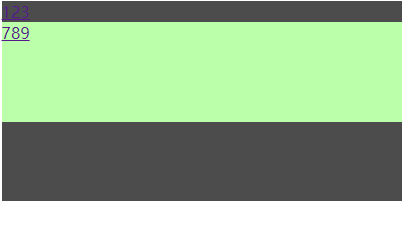

# 伪类选择器后面再加一个选择器

## 引出问题:

```html
		<div id="div1">
			<a href="">123</a>
			<div>
				<a href="">789</a>
			</div>
		</div>
		
		<a href="#">456</a>
```

```html
		<style>
			#div1 {
				width: 400px;
				height: 200px;
				background-color: rgba(0, 0, 0, .3);
				margin: 0 auto;
			}

			#div1:hover {
				background-color: rgba(0, 0, 0, .7);
			}

			a {
				display: none;
			}

			#div1:hover a{
				display: block;
			}
			
			#div1:hover div{
				height: 100px;
				background-color: #bfa;
			}
		</style>
```

其中`#div1:hover a`会让div1的兄弟元素a标签显示吗?

## `parentSelector:hover childSelector`

> 伪类选择器后面再加一个选择器实际上就是在父选择器hover时,选择父选择器的子选择器进行样式的改变
>
> - 上图没有hover的效果
> - hover后的效果