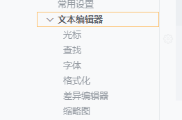

# 安装vscode

1. 安装插件

2. 设置自动保存

   

​	在延时1000ms后自动保存

3. 设置字体大小,设置为20



编写html文件

```html
<!DOCTYPE html>
<!-- !+tab自动按模板生成一个html文件 -->
<html lang="zh">

<head>
    <meta charset="UTF-8">
    <meta http-equiv="X-UA-Compatible" content="IE=7">
    <meta name="viewport" content="width=device-width, initial-scale=1.0">
    <title>Document</title>
</head>

<body>

</body>

</html>
```

4. 配置liveserver插件