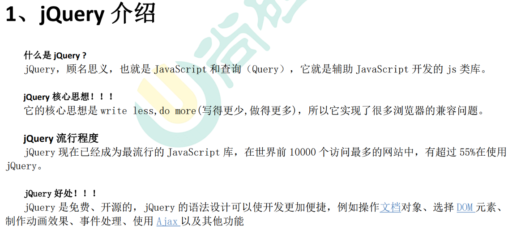
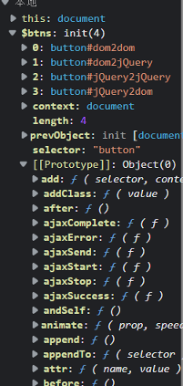
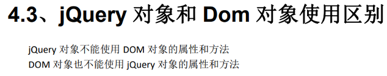

# jQuery 简介

# 1、jQuery 初识



## What?

- `jQuery`官网：[http://jquery.com/](http://jquery.com/)
- 一个优秀的 JS 函数库
- 使用了`jQuery`的网站超过 90%
- 中大型 WEB 项目开发首选
- `Write Less，Do More！！！`

## Why?

- HTML 元素选取（选择器）
- HTML 元素操作
- CSS 操作
- HTML 事件处理
- JS 动画效果
- **链式调用** a().b().c()...
- **读写合一**
- 浏览器兼容
- 易扩展插件
- ajax 封装

## How?

### 1. 引入`jQuery`库

```html
<!-- 引入jQuery -->
<!--服务器本地库-->
<script src="js/jquery-3.6.0.js"></script>
<!--CDN远程库-->
<!--<script src="https://cdn.bootcdn.net/ajax/libs/jquery/3.6.0/jquery.js"></script>-->
```

### 2. 使用`jQuery`

- `jQuery`核心函数：`$`/`jQuery`
- `jQuery`核心对象：执行`$()`返回的对象

```js
// 绑定文档加载完成的监听
$(function () {
    // 绑定监听事件
    var $btn02 = $("#btn02");
    $btn02.click(function () {
        var username = $("#username").val();
        username && alert(username);
    });
})
```


### 区别 2 种 JS 库文件

- 开发版（测试版）
- 生产版（压缩版）

### 区别 2 种引用 JS 库的方式

- 服务器本地库
- CDN远程库
  - 项目上线时，一般使用比较靠谱的CDN资源库，减轻服务器负担
  - [https://www.bootcdn.cn/](https://www.bootcdn.cn/)：搜索`jQuery`，复制`<script>`标签到项目中即可使用

### 区别`jQuery`的不同版本

- 1.x
  - 兼容老版本 IE
  - 文件更大
- 2.x
  - 部分 IE8 及以下支持
  - 文件小，执行效率更高
- 3.x
  - 完全不再支持 IE8 及以下版本
  - 提供了一些新的 API
  - 提供不包含 ajax / 动画 API 的版本


# 2、jQuery 的 2 把利器

```js
// jQuery核心代码
(function(window){
    var jQuery = function(){
        return new jQuery.fn.init();
    }
    window.$ = window.jQuery = jQuery
})(window)
```

$其实就是一个函数对象,可以接收不同的参数(选择器和上下文),返回不同的对象或者值

## jQuery 核心函数

简称：`jQuery`函数（`$`/`jQuery`），`jQuery`库向外直接暴露的就是`$`/`jQuery`

引入`jQuery`库后，直接使用即可

- 当函数用：`$(xxx)`

- 当对象用：`$.xxx()`

```js
// jQuery函数：直接可用
console.log($, typeof $);  // ƒ ( selector, context ) {}    function
console.log(jQuery === $); // true
```

```js
Window.jQuery=jQuery=$
```

### $函数功能

根据参数不同有不同的功能,四个作用

**传入参数为Function匿名函数时**

表示页面加载完成

```html
window.onload=function(){...}
$(function(){...})
```

```html
<script type="text/javascript">

	//核心函数的4个作用
    $(function () {
        alert("页面加载完成之后，自动调用");
    });
	//传入参数为[函数]时：在文档加载完成后执行这个函数

</script>
```

**传入参数为HTML代码字符串时**

传入HTML代码字符串将创建html对象,一次可以创建多个,**同时,这些创建的对象是jq对象**

```html
<script type="text/javascript">

	//核心函数的4个作用
    $(function () {
        $("    <div>" +
            "        <span>div-span1</span>" +
            "        <span>div-span2</span>" +
            "    </div>").appendTo("body");
        //此处appendTo("body"),等价于appendTo($("body"))
        //先查找body,再添加
    });
	//传入参数为[HTML字符串]时：根据这个字符串创建元素节点对象
</script>
```

```html
  <script src="jquery-1.7.2.js"></script>
  <script>

    // alert($("<h1>远坂凛</h1>"));//使用html代码创建jq对象
    //Object object输出
    $(function () {
      $("<h1>远坂凛</h1>").appendTo(document.body);
    })
  </script>
```

**传入参数为选择器字符串时**

| 调用              | 选择器      |
| ----------------- | ----------- |
| $("#id值")        | id选择器    |
| $(".class属性值") | class选择器 |
| $("标签名")       | 标签选择器  |

返回:一个jq对象,是一个dom对象组成的伪数组,可能不止一个对象

```html
$("#id")
$(".class")
$("Tagname")
其中这些返回的都是jq对象，可以一次返回多个
使用$().length可以查看查询到了几个
```

```html
<script type="text/javascript">

	//核心函数的4个作用
    $(function () {

        alert($("button").length);//3个button的标签元素
		//返回的是什么? 

        var btnObj = document.getElementById("btn01");
        // alert(btnObj);//dom对象 HTMLbuttonElement
        // alert( $(btnObj) );//$(btnObj)转换为jq对象
        //object object

    });
	//传入参数为[选择器字符串]时：根据这个字符串查找元素节点对象
	//传入参数为[DOM对象]时：将DOM对象包装为jQuery对象返回

</script>
```

**传入参数为DOM对象时**

传入DOM对象转换为JQ对象

```
上面的$(btnObj)
```


## jQuery 核心对象

简称：`jQuery`对象

得到`jQuery`对象：执行`jQuery`函数返回的就是`jQuery`对象

使用`jQuery`对象：`$obj.xxx()`

```js
// jQuery对象：执行jQuery函数得到它
console.log($(), typeof $(), $() instanceof Object); // jQuery.fn.init {} "object" true
```


jQuery对象以$打头

```js
 $() 代替window.onload
	$(function(){...})先于window.onload执行
 $name 为jQuery的对象
	jq对象以`$`打头
	var $btn=$("#btn01");
 $(#id) 为使用jQ按id查询对象
	var $btn=$("#btn01");
 $(.class) 
	var $btn=$(".btn");
绑定单击事件 $jqobj.click(function(){...}) 
```

```html
<html lang="en">
<head>
    <meta charset="UTF-8">
    <title>Title</title>
  <script src="jquery-1.7.2.js"></script>
  <script>
    // alert($);验证是否成功引入jQuery
    //使用$()代替window.onload

    $(function(){
        var $btnobj=$("#btn01");
       //$name为jQuery对象,$("#id")按标签查询对象
      //使用选择器获取按钮对象，随后绑定单击响应函数
      $("#btn01").click(function(){
        //弹出Hello
        alert('Hello');
      });
    });
  </script>
</head>
<body>
  <button id="btn01">ack</button>
</body>
</html>

```

 使用jq添加注册单击事件的方法

 - 使用$()查询到对象

 - 使用jQ对象.click(function(){});

### jq对象和dom对象

dom对象:

> 通过document调用getElement(s)By(Id,ClassName,Name)查询出来的对象
>
> 通过document调用createElement或者createTextNode()创建出来的对象
>
> log出来的效果是[object HTMLXXXXObject]
>
> 
>
> 其实就是标签转换的dom树节点(HTMLXXXObj,比如Btn就是HTMLBUTTONOBJ)

jq对象:

> 通过jq_API创建出来的对象
>
> - 例如`$("<h1></h1>")`
>
> 通过jq_API查询出来的对象
>
> - 例如`$("#btn1")`,`$(".btn")`,`$("Button")`
>
> 通过jq_API包装dom对象得出来的对象
>
> - 例如`$(domObj)`
>
> 本质:dom对象封装到jq伪数组对象,通过`jq对象+下标`的方式可以获取封装的dom对象
>
> 1. 首先是dom对象继承的数组
> 2. 其次封装了一系列jq提供的函数

#### 代码验证jq对象

>```html
><!DOCTYPE html>
><html lang="en">
><head>
>    <meta charset="UTF-8">
>    <title>Title</title>
><!--  jq对象本质验证-->
>  <script src="jquery-1.7.2.js"></script>
>  <script>
>    $(function (){
>      var $btns=$("button");
>      for(var i=0;i<$btns.length;i++){
>        alert($btns[i]);
>        //弹出警告为HTMLButtonObject,证实为DOM对象
>      }
>    })
>  </script>
></head>
><body>
>  <button id="dom2dom">使用DOM对象调用DOM方法</button>
>  <button id="dom2jQuery">使用DOM对象调用jQuery方法</button>
>  <button id="jQuery2jQuery">使用jQuery对象调用jQuery方法</button>
>  <button id="jQuery2dom">使用jQuery对象调用DOM方法</button>
></body>
></html>
>
>```
>
>打断点并刷新网页进行JS代码的调试,可见jq对象数组提供的诸多方法
>
>- 

#### 转换:

**dom转jq**

```
$(domObj)
```

**jq转dom**

```
$jqObj[index]
```

代码验证:

```js
		$(function(){
			var btnObj=document.getElementById("btn01")
			//dom对象转换为jq对象
			//其实就是将dom对象包装到jq伪数组对象中
			var $jqObj=$(btnObj)
			//证明jq对象是一个由dom对象组成的伪数组
			console.log($jqObj[0]===btnObj)//true
			
			//jq对象转dom对象
			var domobj=$jqObj[0]
		})
```

### jq对象和dom对象的使用差别



> 代码验证
>
> ```html
> <!DOCTYPE html>
> <html lang="en">
> <head>
>     <meta charset="UTF-8">
>     <title>Title</title>
> <!--  jq对象和DOM对象在使用上的差别-->
>   <script src ="jquery-1.7.2.js"></script>
>   <script>
>     $(function (){
>       // document.getElementById("testDiv").innerHTML = "这是dom对象的属性InnerHTML";
>       // $("#testDiv").innerHTML = "这是dom对象的属性InnerHTML";
>       // 无效,innertHtml不改变,Jquery对象无法视同dom对象的属性
> 
>       /*
>         Jquery对象无法视同dom对象的属性
>         同样的,DOM对象也无法使用Jquery对象才能使用的方法
>        */
>       $("#testDiv").click(function(){alert("clickEvent")});
>       /*
>       document.getElementById("testDiv").click(function(){alert("clickEvent")});
>       无效
>        */
>         
>       /*
>         dom转JQ并注册click事件
>         在这个HTML中该对象已经注册了两次,所以也会alert两次
>          */
>         $("#testDiv")[0].onclick=function (){
>             alert("clickEvent3");
>         }
>     })
>   </script>
> </head>
> <body>
>   <div id="testDiv">Atguigu is Very Good!</div>
> </body>
> </html>
> ```
>
> 注意:通过jq对象添加事件的方式类似监听,可以多次添加
>          但是通过dom.onEvent的方式添加事件,只能添加一次,后面的覆盖前面的
>
> ```html
>   <script>
>     $(function (){
>       $("#testDiv").click(function(){alert("clickEvent1")});
> 	  $("#testDiv").click(function(){alert("clickEvent2")});
>  
>         $("#testDiv")[0].onclick=function (){
>             alert("clickEvent3");
>         }
> 		
> 		$("#testDiv")[0].onclick=function (){
> 		    alert("clickEvent4");
> 		}
> 
>     })
>   </script>
> ```
>
>  输出:jq注册的两个事件`clickEvent1,2`; dom注册的只输出最后一个事件`"clickEvent4"`


# 3、jQuery 函数的使用

作为一般函数调用：`$(param)`

1. 参数为函数：当 DOM 加载完成后，执行此回调函数
2. 参数为选择器字符：查找所有匹配的标签并将它们封装成`jQuery`对象
3. 参数为 DOM 对象：将 dom 对象封装成`jQuery`对象
4. 参数为 html 标签字符串（用得少）：创建标签对象并封装成`jQuery`对象

作为对象使用：`$.xxx()`,调用函数对象中的方法

- `$.each()`：隐式遍历数组
- `$.trim()`：去除两端的空格

```js
// 需求1.点击按钮：显示按钮的文本，显示一个新的输入框
// 1、参数为函数：当 DOM 加载完成后，执行此回调函数
$(function () { // 绑定文档加藏完成的监听
    // 2、参数为选择器字符：查找所有匹配的标签并将它们封装成`jQuery`对象
    $("#btn").click(function () {
        // alert(this.innerHTML); // this是什么？发生事件的dom元素（<button>）
        // 3、参数为 DOM 对象：将 dom 对象封装成`jQuery`对象
        alert($(this).html());
        // 4、参数为 html 标签字符串（用得少）：创建标签对象并封装成`jQuery`对象
        $('<input type="text" name="msg3"><br/>').appendTo("div");
    });
    
    // 需求2.遍历输出数组中所有元素值
    var arr = [3, 7, 4];
    $.each(arr, function (index, item) {
        //参数列:arg[下标,值,arr]
        console.log(index, item); // 0 3    1 7    2 4
    });

    // 需求3.去掉“my atguigu”两端的空格
    var str = "    my atguigu   ";
    console.log('===' + str + '===');           // ===    my atguigu   ===
    console.log('===' + str.trim() + '===');    // ===my atguigu===
    console.log('===' + $.trim(str) + '===');   // ===my atguigu===
})
```


# 4、jQuery 对象的使用

## 理解

即执行`jQuery`核心函数返回的对象

`jQuery`对象内部包含的是 **dom 元素对象的伪数组**（可能只有一个元素）

>```html
><button id="btn01"></button>
>console.log($("#btn01").length);//1
>```
>
>

`jQuery`对象拥有很多有用的属性和方法，让程序员能方便的操作 dom

## 属性和方法

- 基本行为：操作标签的基本方法
- 属性：操作内部标签的属性或值

- CSS：操作标签的样式

- 文档：对标签进行增删改操作

- 筛选：根据指定的规则过滤内部的标签

- 事件：处理事件监听相关

- 效果：实现一些动画效果

这里我们先学习`jQuery`对象的基本行为，其他的不放在当前章节中

## 基本行为

- `size()`/`length`：包含的 DOM 元素个数
- `[index]`/`get(index)`：得到对应位置的 DOM 元素
- `each()`：遍历包含的所有 DOM 元素
- `index()`：得到在所在兄弟元素中的下标

```js
// 需求1.统计一共有多少个按钮
// `size()`/`length`：包含的 DOM 元素个数
var $buttons = $('button');
console.log($buttons.length); // 4

// 需求2.取出第2个button的文本
console.log($('button:nth-child(2)').text()); // 测试二
// `[index]`/`get(index)`：得到对应位置的 DOM 元素
console.log($buttons[1].innerHTML, $buttons.get(1).innerHTML); // 测试二 测试二

// 需求3.输出所有button标签的文本
// `each()`：遍历包含的所有 DOM 元素
// $buttons.each(function (index, domEle) {
//     console.log(index, domEle.innerHTML); // 0 "测试一"   1 "测试二"   2 "测试三"    3 "测试四"
// });
$buttons.each(function () {
    console.log(this.innerHTML); // 测试一 测试二 测试三 测试四
});

// 需求4.输出’测试三’按钮是所有按钮中的第几个
console.log($("#btn3").index()); // 2
```

# **5.伪数组**

> jq对象是伪数组

- `Object`对象
- `length`属性
- 数值下标属性
- 没有数组特别的方法：`forEach()`，`push()`，`pop()`，`splice()`

```js
// 伪数组
console.log($buttons instanceof Array); // false
//自定义一个伪数组
var weiArr = {}
weiArr.length = 0;
weiArr[0] = 'atguigu';
weiArr.length = 1;
weiArr[1] = 123;
weiArr.length = 2;
for (var i = 0; i < weiArr.length; i++) {
    var obj = weiArr[i];
    console.log(i, obj); // 0 "atguigu"    1 123
}
console.log(weiArr.forEach, $buttons.forEach); //undefined undefined
```