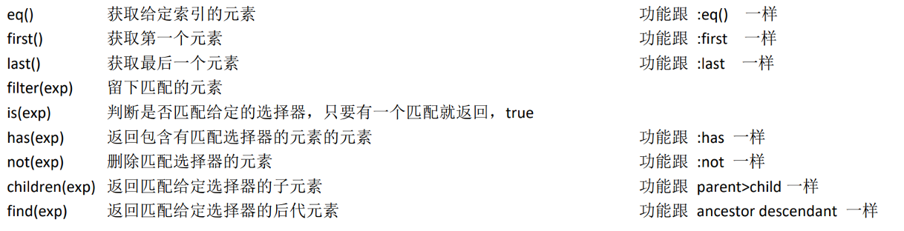
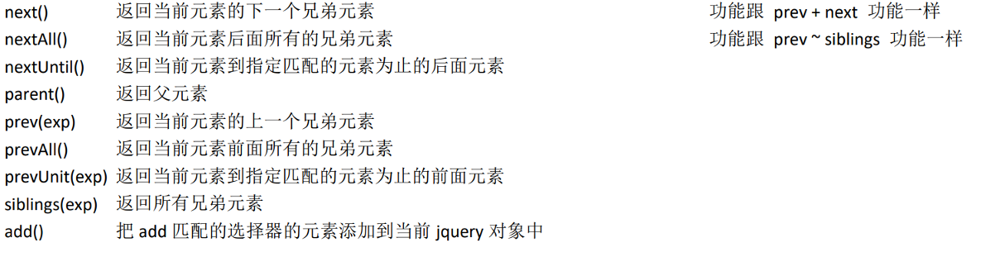

# jQuery对象的过滤与查找

## 1、对象的过滤

| 过滤方法     | 描述                                                         |
| :----------- | :----------------------------------------------------------- |
| `eq()`       | 获取第N个元素                                                |
| `first()`    | 获取第一个元素                                               |
| `last()`     | 获取最后一个元素                                             |
| `hasClass()` | 检查当前的元素是否含有某个特定的类，如果有，则返回true       |
| `filter()`   | 筛选出与指定表达式匹配的元素集合                             |
| `not()`      | 删除与指定表达式匹配的元素                                   |
| `is()`       | 根据选择器、DOM元素或 jQuery 对象来检测匹配元素集合，如果其中至少有一个元素符合这个给定的表达式就返回true |
| `has()`      | 保留包含特定后代的元素，去掉那些不含有指定后代的元素         |

### first()

```js
var $li = $('ul>li');
// 1.ul下li标签第一个
// $li[0].style.backgroundColor = 'red';
$li.first().css('background-color', 'red');
```


### last()

```js
// 2.ul下li标签的最后一个
// $li[$li.length - 1].style.backgroundColor = 'red';
$li.last().css('background-color', 'red');
```


### eq()

```js
// 3.ul下li标签的第二个
// $li[1].style.backgroundColor = 'red';
$li.eq(1).css('background-color', 'red');
```


### filter()

```js
// 4.ul下li标签中title属性为hello的
$li.filter('[title=hello]').css('background-color', 'red');
```


### not()

```js
// 5.ul下li标签中title属性不为hello的
// $li.filter('[title!=hello]').css('background-color', 'red');
$li.not('[title=hello]').css('background-color', 'red');
```


但上述的写法，将没有 title 属性的 li 元素也查询了出来，更符合题意的写法如下：

```js
// $li.filter('[title]').filter('[title!=hello]').css('background-color', 'red');
// $li.filter('[title!=hello]').filter('[title]').css('background-color', 'red');
$li.filter('[title][title!=hello]').css('background-color', 'red');
```


### has()

```js
// 6.ul下li标签中有span子标签的
$li.has('span').css('background-color', 'red');
```


### hasClass()、is()

```js
// 7.ul下li标签中class属性为box2的
// if ($li.filter('[class=box2]').hasClass('box2')) {
//     $li.filter('[class=box2]').css('background-color', 'red');
// }
if ($li.filter('[class=box2]').is('.box2')) {
    $li.filter('[class=box2]').css('background-color', 'red');
}
```


## 2、对象的查找

| 查找方法         | 描述                                                         |
| :--------------- | :----------------------------------------------------------- |
| `children()`     | 取得一个包含匹配的元素集合中每一个元素的所有子元素的元素集合 |
| `find()`         | 搜索所有与指定表达式匹配的元素。这个函数是找出正在处理的元素的后代元素的好方法 |
| `siblings()`     | 取得一个包含匹配的元素集合中每一个元素的所有唯一同辈元素的元素集合 |
| `next()`         | 取得一个包含匹配的元素集合中每一个元素紧邻的后一个同辈元素的元素集合 |
| `nextAll()`      | 查找当前元素之后所有的同辈元素                               |
| `nextUntil()`    | 查找当前元素之后所有的同辈元素，直到遇到匹配的那个元素为止   |
| `prev()`         | 取得一个包含匹配的元素集合中每一个元素紧邻的前一个同辈元素的元素集合 |
| `prevAll()`      | 查找当前元素之前所有的同辈元素                               |
| `prevUntil()`    | 查找当前元素之前所有的同辈元素，直到遇到匹配的那个元素为止   |
| `offsetParent()` | 返回第一个匹配元素用于定位的父节点                           |
| `parent()`       | 取得一个包含着所有匹配元素的唯一父元素的元素集合             |
| `parentsUntil()` | 查找当前元素的所有的父辈元素，直到遇到匹配的那个元素为止     |

### children()

```js
var $ul = $('ul');
// 1.ul标签的第2个span子标签
$ul.children('span:eq(1)').css('background-color', 'red');   
```


### find()

```js
// 2.ul标签的第2个span后代标签
$ul.find('span:eq(1)').css('background-color', 'red');
```


### parent()、offsetParent()

```js
// 3.ul标签的父标签
$ul.parent().css('background-color', 'red');
```


```js
// 3.ul标签的定位父标签
$ul.offsetParent().css('background-color', 'red');
```


### prev()、prevAll()、next()、nextAll()

```js
// 4.id为cc的li标签的前一个li标签
$('#cc').prev('li').css('background-color', 'red');
```


```js
// 4.id为cc的li标签的前面所有li标签
$('#cc').prevAll('li').css('background-color', 'red');
```


```js
// 4.id为cc的li标签的后一个li标签
$('#cc').next('li').css('background-color', 'red');
```


```js
// 4.id为cc的li标签的后面所有li标签
$('#cc').nextAll('li').css('background-color', 'red');
```


### siblings()

```js
// 6.id为cc的li标签的所有兄弟li标签
$('#cc').siblings('li').css('background-color', 'red');
```


## 练习：爱好选择器

HTML 代码

```html
<form>
    你爱好的运动是？<input type="checkbox" id="checkedAllBox"/>全选/全不选
    <br/>
    <input type="checkbox" name="items" value="足球"/>足球
    <input type="checkbox" name="items" value="篮球"/>篮球
    <input type="checkbox" name="items" value="羽毛球"/>羽毛球
    <input type="checkbox" name="items" value="乒乓球"/>乒乓球
    <br/>
    <input type="button" id="checkedAllBtn" value="全选"/>
    <input type="button" id="checkedNoBtn" value="全不选"/>
    <input type="button" id="checkedRevBtn" value="反选"/>
    <input type="button" id="sendBtn" value="提交"/>
</form>
```

jQuery 代码

```js
var $checkedAllBox = $('#checkedAllBox'); // ID选择器
var $items = $(':checkbox[name=items]'); // 表单选择器、过滤选择器、交集选择器
// 1.点击'全选'：选中所有爱好
var $checkedAllBtn = $('#checkedAllBtn');
$checkedAllBtn.click(function () { // click函数
    $items.prop('checked', true); // prop操作属性
    $checkedAllBox.prop('checked', true);
});

// 2.点击'全不选'：所有爱好都不勾选
var $checkedNoBtn = $('#checkedNoBtn');
$checkedNoBtn.click(function () {
    $items.prop('checked', false);
    $checkedAllBox.prop('checked', false);
});

// 3.点击'反选'：改变所有爱好的匀选状态
var $checkedRevBtn = $('#checkedRevBtn');
$checkedRevBtn.click(function () {
    $items.each(function () { // each函数
        this.checked = !this.checked;
    });
    $checkedAllBox.prop('checked', $items.not(':checked').length === 0); // not过滤方法
});

// 4.点击'提交'：提示所有勾送的爱好
var $sendBtn = $('#sendBtn');
$sendBtn.click(function () {
    var arr = [];
    $items.filter(':checked').each(function () { // filter过滤方法
        arr.push(this.value); // 数组push方法
    });
    alert(arr.join(',')); // 数组join方法
});

// 5.点击'全选/全不选'：选中所有爱好，或者全不选中
var $checkedAllBox = $('#checkedAllBox');
$checkedAllBox.click(function () {
    $items.prop('checked', this.checked);
});

// 6.点击某个爱好时，必要时更新'全选/全不选'的选中状态
$items.click(function () {
    $checkedAllBox.prop('checked', $items.not(':checked').length === 0);
});
```

**效果**


## 总结





> 代码演示
>
> ```html
> <!DOCTYPE HTML PUBLIC "-//W3C//DTD HTML 4.01//EN" " http://www.w3.org/TR/html4/strict.dtd">
> <html>
>     <head>
>         <meta http-equiv="Content-Type" content="text/html; charset=UTF-8">
>         <title>DOM查询</title>
>         <style type="text/css">
>             div, span, p {
>                 width: 140px;
>                 height: 140px;
>                 margin: 5px;
>                 background: #aaa;
>                 border: #000 1px solid;
>                 float: left;
>                 font-size: 17px;
>                 font-family: Verdana;
>             }
>             
>             div.mini {
>                 width: 55px;
>                 height: 55px;
>                 background-color: #aaa;
>                 font-size: 12px;
>             }
>             
>             div.hide {
>                 display: none;
>             }           
>         </style>
>         <script type="text/javascript" src="../script/jquery-1.7.2.js"></script>
>         <script type="text/javascript">
>             $(document).ready(function(){
>                 function anmateIt(){
>                     $("#mover").slideToggle("slow", anmateIt);
>                 }
>                 anmateIt();
>                 
>     /**
>                     
>     过滤
>     eq(index|-index)            
>     first()                     
>     last()                      
>     hasClass(class)             
>     filter(expr|obj|ele|fn)     
>     is(expr|obj|ele|fn)1.6*     
>     has(expr|ele)               
>     not(expr|ele|fn)            
>     slice(start,[end])          
>     
>     查找
>     children([expr])            
>     closest(expr,[con]|obj|ele)1.6*   
>     find(expr|obj|ele)              
>     next([expr])                    
>     nextall([expr])                 
>     nextUntil([exp|ele][,fil])1.6*  
>     parent([expr])                  
>     parents([expr])                 
>     parentsUntil([exp|ele][,fil])1.6*  
>     prev([expr])                    
>     prevall([expr])                 
>     prevUntil([exp|ele][,fil])1.6*  
>     siblings([expr])                
>     
>     串联
>     add(expr|ele|html|obj[,con])    
>                             
>     
>     */
>                 
>                 //(1)eq()  选择索引值为等于 3 的 div 元素
>                 $("#btn1").click(function(){
>                     $("div").eq(3).css("background-color","#bfa");
>                 });
>                 //(2)first()选择第一个 div 元素
>                  $("#btn2").click(function(){
>                      //first()   选取第一个元素
>                     $("div").first().css("background-color","#bfa");
>                 });
>                 //(3)last()选择最后一个 div 元素
>                 $("#btn3").click(function(){
>                     //last()  选取最后一个元素
>                     $("div").last().css("background-color","#bfa");
>                 });
>                 //(4)filter()在div中选择索引为偶数的
>                 $("#btn4").click(function(){
>                     //filter()  过滤   传入的是选择器字符串
>                     $("div").filter(":even").css("background-color","#bfa");
>                 });
>                  //(5)is()判断#one是否为:empty或:parent
>                 //is用来检测jq对象是否符合指定的选择器
>                 $("#btn5").click(function(){
>                     alert( $("#one").is(":empty") );
>                 });
>                 
>                 //(6)has()选择div中包含.mini的
>                 $("#btn6").click(function(){
>                     //has(selector)  选择器字符串    是否包含selector
>                     $("div").has(".mini").css("background-color","#bfa");
>                 });
>                 //(7)not()选择div中class不为one的
>                 $("#btn7").click(function(){
>                     //not(selector)  选择不是selector的元素
>                     $("div").not('.one').css("background-color","#bfa");
>                 });
>                 //(8)children()在body中选择所有class为one的div子元素
>                 $("#btn8").click(function(){
>                     //children()  选出所有的子元素
>                     $("body").children("div.one").css("background-color","#bfa");
>                 });
>                 
>                 
>                 //(9)find()在body中选择所有class为mini的div元素
>                 $("#btn9").click(function(){
>                     //find()  选出所有的后代元素
>                     $("body").find("div.mini").css("background-color","#bfa");
>                 });
>                 //(10)next() #one的下一个div
>                 $("#btn10").click(function(){
>                     //next()  选择下一个兄弟元素
>                     $("#one").next("div").css("background-color","#bfa");
>                 });
>                 //(11)nextAll() #one后面所有的span元素
>                 $("#btn11").click(function(){
>                     //nextAll()   选出后面所有的元素
>                     $("#one").nextAll("span").css("background-color","#bfa");
>                 });
>                 //(12)nextUntil() #one和span之间的元素
>                 $("#btn12").click(function(){
>                     //
>                     $("#one").nextUntil("span").css("background-color","#bfa")
>                 });
>                 //(13)parent() .mini的父元素
>                 $("#btn13").click(function(){
>                     $(".mini").parent().css("background-color","#bfa");
>                 });
>                 //(14)prev() #two的上一个div
>                 $("#btn14").click(function(){
>                     //prev()  
>                     $("#two").prev("div").css("background-color","#bfa")
>                 });
>                 //(15)prevAll() span前面所有的div
>                 $("#btn15").click(function(){
>                     //prevAll()   选出前面所有的元素
>                     $("span").prevAll("div").css("background-color","#bfa")
>                 });
>                 //(16)prevUntil() span向前直到#one的元素
>                 $("#btn16").click(function(){
>                     //prevUntil(exp)   找到之前所有的兄弟元素直到找到exp停止
>                     $("span").prevUntil("#one").css("background-color","#bfa")
>                 });
>                 //(17)siblings() #two的所有兄弟元素
>                 $("#btn17").click(function(){
>                     //siblings()    找到所有的兄弟元素，包括前面的和后面的
>                     $("#two").siblings().css("background-color","#bfa")
>                 });
>                 
>                 
>                 //(18)add()选择所有的 span 元素和id为two的元素
>                 $("#btn18").click(function(){
>     
>                     //   $("span,#two,.mini,#one")
>                     $("span").add("#two").add("#one").css("background-color","#bfa");
>                     
>                 });
>                 
> 
> 
>             });
>             
>             
>         </script>
>     </head>
>     <body>      
>         <input type="button" value="eq()选择索引值为等于 3 的 div 元素" id="btn1" />
>         <input type="button" value="first()选择第一个 div 元素" id="btn2" />
>         <input type="button" value="last()选择最后一个 div 元素" id="btn3" />
>         <input type="button" value="filter()在div中选择索引为偶数的" id="btn4" />
>         <input type="button" value="is()判断#one是否为:empty或:parent" id="btn5" />
>         <input type="button" value="has()选择div中包含.mini的" id="btn6" />
>         <input type="button" value="not()选择div中class不为one的" id="btn7" />
>         <input type="button" value="children()在body中选择所有class为one的div子元素" id="btn8" />
>         <input type="button" value="find()在body中选择所有class为mini的div后代元素" id="btn9" />
>         <input type="button" value="next()#one的下一个div" id="btn10" />
>         <input type="button" value="nextAll()#one后面所有的span元素" id="btn11" />
>         <input type="button" value="nextUntil()#one和span之间的元素" id="btn12" />
>         <input type="button" value="parent().mini的父元素" id="btn13" />
>         <input type="button" value="prev()#two的上一个div" id="btn14" />
>         <input type="button" value="prevAll()span前面所有的div" id="btn15" />
>         <input type="button" value="prevUntil()span向前直到#one的元素" id="btn16" />
>         <input type="button" value="siblings()#two的所有兄弟元素" id="btn17" />
>         <input type="button" value="add()选择所有的 span 元素和id为two的元素" id="btn18" />
> 
>         
>         <h3>基本选择器.</h3>
>         <br /><br />
>         文本框<input type="text" name="account" disabled="disabled" />
>         <br><br>
>         <div class="one" id="one">
>             id 为 one,class 为 one 的div
>             <div class="mini">class为mini</div>
>         </div>
>         <div class="one" id="two" title="test">
>             id为two,class为one,title为test的div
>             <div class="mini" title="other"><b>class为mini,title为other</b></div>
>             <div class="mini" title="test">class为mini,title为test</div>
>         </div>
>         
>         <div class="one">
>             <div class="mini">class为mini</div>
>             <div class="mini">class为mini</div>
>             <div class="mini">class为mini</div>
>             <div class="mini"></div>
>         </div>
>         <div class="one">
>             <div class="mini">class为mini</div>
>             <div class="mini">class为mini</div>
>             <div class="mini">class为mini</div>
>             <div class="mini" title="tesst">class为mini,title为tesst</div>
>         </div>
>         <div style="display:none;" class="none">style的display为"none"的div</div>
>         <div class="hide">class为"hide"的div</div>
>         <span id="span1">^^span元素 111^^</span>
>         <div>
>             包含input的type为"hidden"的div<input type="hidden" size="8">
>         </div>
>         <span id="span2">^^span元素 222^^</span>
>         <div id="mover">正在执行动画的div元素.</div>
>     </body>
> </html>
> 
> ```
>
> 

