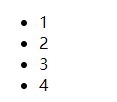

# 文档处理-增删改

文档处理,主要是添加修改html文档的标签

## 方法简单介绍及其使用

|          | 文档处理方法     | 描述                                                         |
| :------- | :--------------- | :----------------------------------------------------------- |
| 内部插入 | `append()`       | 向每个匹配的元素内部追加内容                                 |
|          | `appendTo()`     | 把所有匹配的元素追加到另一个指定的元素元素集合中             |
|          | `prepend()`      | 向每个匹配的元素内部前置内容                                 |
|          | `prependTo()`    | 把所有匹配的元素前置到另一个、指定的元素元素集合中           |
| 外部插入 | `after()`        | 在每个匹配的元素之后插入内容                                 |
|          | `before()`       | 在每个匹配的元素之前插入内容                                 |
|          | `insertAfter()`  | 把所有匹配的元素插入到另一个、指定的元素元素集合的后面       |
|          | `insertBefore()` | 把所有匹配的元素插入到另一个、指定的元素元素集合的前面       |
| 包裹     | `wrap()`         | 把所有匹配的元素用其他元素的结构化标记包裹起来               |
|          | `unwrap()`       | 这个方法将移出元素的父元素                                   |
|          | `wrapAll()`      | 将所有匹配的元素用单个元素包裹起来                           |
|          | `wrapInner()`    | 将每一个匹配的元素的子内容(包括文本节点)用一个HTML结构包裹起来 |
| 替换     | `replaceWith()`  | 将所有匹配的元素替换成指定的HTML或DOM元素                    |
|          | `replaceAll()`   | 用匹配的元素替换掉所有 selector匹配到的元素                  |
| 删除     | `empty()`        | 删除匹配的元素集合中所有的子节点                             |
|          | `remove()`       | 从DOM中删除所有匹配的元素                                    |
|          | `detach()`       | 从DOM中删除所有匹配的元素                                    |
| 克隆     | `clone()`        | 克隆匹配的DOM元素并且选中这些克隆的副本                      |

### append、appendTo

```js
// 1.向id为ul1的ul下添加一个span（最后）
// $('#ul1').append('<span>append添加的span</span>');
$('<span>appendTo添加的span</span>').appendTo($('#ul1'));
```


### prepend、prependTo

```js
// 2.向id为ul1的ul下添加一个span（最前）
// $('#ul1').prepend('<span>prepend添加的span</span>');
$('<span>prependTo添加的span</span>').prependTo($('#ul1'));
```


### before、insertBefore

```js
// 3.在id为ul1的ul下的li（title为hello）的前面添加span
// $('#ul1').children('li[title=hello]').before('<span>before添加的span</span>');
$('<span>insertBefore添加的span</span>').insertBefore($('#ul1').children('li[title=hello]'));
```


### after、insertAfter

```js
// 4.在id为ul1的ul下的li（title为hello）的后面添加span
// $('#ul1').children('li[title=hello]').after('<span>after添加的span</span>');
$('<span>insertAfter添加的span</span>').insertAfter($('#ul1').children('li[title=hello]'));
```


### replaceWith、replaceAll

```js
// 5.将id为ul2的ul下的li（title为hello）全部替换为p
// $('#ul2').children('li[title=hello]').replaceWith('<p>replaceWith替换的p</p>');
$('<p>replaceWith替换的p</p>').replaceAll($('#ul2').children('li[title=hello]'));
```


### empty、remove、detach

> empty:清空内容
>
> remove:去除元素
>
> detach:去除元素

```js
// 6.移除id为ul2的ul下的所有li
$('#ul2').children('li').empty(); // ul2下li的内容被清空
```


```js
// $('#ul2').empty(); // 所有子元素均被删除
// $('#ul2>*').remove(); // 所有子元素均被删除
// $('#ul2').children('li').remove();
$('#ul2').children('li').detach();
```

>		```html
>			<ul>
>			<li>1</li>
>			<li>2</li>
>			<li>3</li>
>			<li>4</li>
>		</ul>
>		```
>
>		- 
>
>		- 加入js后
>
>		  ```js
>		  $(function(){
>		  				$("ul>li").detach()
>		  			})
>		  ```
>
>		  - 
>		  - 所有子元素被删除

## 练习：添加删除员工

HTML 代码

```html
<table id="employeeTable">
    <tr>
        <th>Name</th>
        <th>Email</th>
        <th>Salary</th>
        <th>&nbsp;</th>
    </tr>
    <tr>
        <td>Tom</td>
        <td>tom@tom.com</td>
        <td>5000</td>
        <td><a href="deleteEmp?id=001">Delete</a></td>
        <!--唯一标识,用于后台接受并删除记录-->
    </tr>
    <tr>
        <td>Jerry</td>
        <td>jerry@sohu.com</td>
        <td>8000</td>
        <td><a href="deleteEmp?id=002">Delete</a></td>
    </tr>
    <tr>
        <td>Bob</td>
        <td>bob@tom.com</td>
        <td>10000</td>
        <td><a href="deleteEmp?id=003">Delete</a></td>
    </tr>
</table>

<div id="formDiv">
    <h4>添加新员工</h4>
    <table>
        <tr>
            <td class="word">name:</td>
            <td class="inp">
                <input type="text" name="empName" id="empName"/>
            </td>
        </tr>
        <tr>
            <td class="word">email:</td>
            <td class="inp">
                <input type="text" name="email" id="email"/>
            </td>
        </tr>
        <tr>
            <td class="word">salary:</td>
            <td class="inp">
                <input type="text" name="salary" id="salary"/>
            </td>
        </tr>
        <tr>
            <td colspan="2" align="center">
                <button id="addEmpButton" value="abc">
                    Submit
                </button>
            </td>
        </tr>
    </table>
</div>
```

jQuery 代码

```js
// 添加
$('#addEmpButton').click(function () {
    // 获取输入
    var $empName = $('#empName');
    var $email = $('#email');
    var $salary = $('#salary');
    var empName = $empName.val();
    var email = $email.val();
    var salary = $salary.val();
    // 插入输入
    $('<tr></tr>')
        .append('<td>' + empName + '</td>')
        .append('<td>' + email + '</td>')
        .append('<td>' + salary + '</td>')
        .append('<td><a href="deleteEmp?id=' + Date.now() + '">Delete</a></td>')
        .appendTo($('#employeeTable').children('tbody')); // 插入到默认生成的tbody下
    // 清除输入
    $empName.val('');
    $email.val('');
    $salary.val('');
});

// 删除
// 使用事件委派，这样即使是后续添加的元素也会被绑定对应的事件
// 否则，就需要在新增元素时手动添加单击事件，比较麻烦。下面会学到事件代理/委派/委托相关知识
$('#employeeTable').delegate('a', "click", function () { 
    var $tr = $(this).parent().parent();
    var name = $tr.children(':first').html();
    if (confirm('确定删除' + name + '的相关信息吗？')) {
        $tr.remove();
    }
    return false;
});
```

**效果**


## 