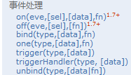
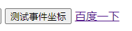
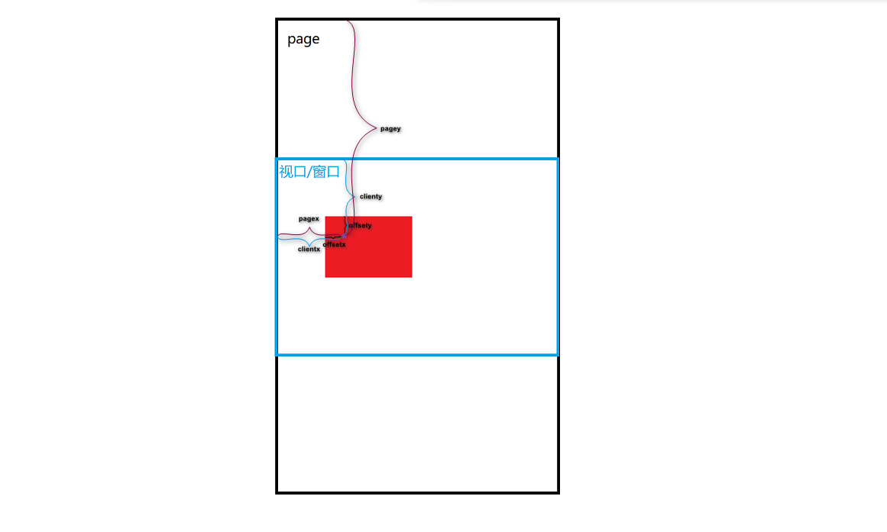
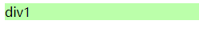
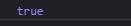

# 事件处理

一般事件处理包括:绑定事件,解绑事件,触发事件



## **事件绑定(2种)：**

  * eventName(function(){})
    绑定对应事件名的监听,	例如：
    
    ```js
    $('#div').click(function(){});
    ```
  * on(eventName, funcion(){})
    通用的绑定事件监听, 例如：
    
    ```js
    $('#div').on('click', function(){})
    ```
  * 优缺点:
    eventName: 编码方便, 但只能加一个监听, 且有的事件监听不支持
    on: 编码不方便, 可以添加多个监听, 且更通用(有的事件第一种方式不支持,只能使用第二种方式)

> eventName只能添加一个监听?
>
> ```html
> <div id="div1">123</div>
> ```
>
> ```js
> $(function(){
>     $("#div1").click(function(){
>     	console.log("click1")
>     });
>     $("#div1").click(function(){
>     	console.log("click2")
>     })
>     //click1..click2
> })
> ```
>
> 可以添加多个监听

> **通常绑定事件的方式**
>
> 给元素绑定事件,可以采用**链式绑定**
>
> ```less
> jquery对象.事件方法(回调函数(){ 触发事件执行的代码 })
> .事件方法(回调函数(){ 触发事件执行的代码 })
> .事件方法(回调函数(){ 触发事件执行的代码 })
> ```
>
> 代码示例:
>
> ```js
> $(".head").click(function(){
>     $(".content").toggle();
> 	})
> 	.mouseover(function(){
> 		$(".content").toggle();
> 	}); 
> ```
>
> **jQuery提供的绑定方式**
>
> `bind(type,[data],fn)`函数把元素和事件绑定起来
>
> ```less
> type表示要绑定的事件   [data]表示传入的数据   fn表示事件的处理方法
> bind(事件字符串,回调函数),后来添加的元素不会绑定事件
> 使用bind()绑定多个事件   
> type可以接受多个事件类型，使用空格分割多个事件
> ```
>
> 代码示例
>
> ```js
> $(".head").bind("click mouseover",function(){
> 	$(".content").toggle();
> });
> ```
>
> `one(type,[data],fn)`函数把元素和事件绑定起来
>
> ```less
> one()只绑定一次,绑定的事件只会发生一次
> type表示要绑定的事件   [data]表示传入的数据   fn表示事件的处理方法
> ```
>
> 代码示例:
>
> ```js
> $(".head").one("click mouseover",function(){
>                 $(".content").toggle();
> }); 
> ```
>
> `live()`方法会为现在及以后添加的元素都绑定上相应的事件
>
> ```js
> $(".head").live("click",function(){
> 					$(".content").toggle();
> });
> ```
>
> 

例子:1. 给.out绑定点击监听(用两种方法绑定)

```html
<div class="out">
  外部DIV
  <div class="inner">内部div</div>
</div>
```

```js
	  //1. 给.out绑定点击监听(用两种方法绑定)
	  //方法1:$JQobj.click([arg],function)
	 /* $(".out").click(function(){
		  alert("out-click1")
	  })
	  var arg="arg" 
	  //传入参数
	  $(".out").click(arg,function(){
		  alert(arg)
	  })
	  */
	//方法2
	  $(".out").on("click",function(){
		  alert("out-on-click")
	  })
	  /**
	   * 区别:
	   * 第一种写法上更方便
	   * 第二种更加通用,可以变通的加上方法
	   * 有些事件没有第一种的绑定方法,只能使用第二种
	   * */
```

## 解除绑定

`unbind(type,[data|fn]])`

bind()的反向操作，从每一个匹配的元素中删除绑定的事件。

参数

| **type:** | 删除元素的一个或多个事件,由空格分隔多个事件值。              |
| --------- | ------------------------------------------------------------ |
| **fn:**   | 要从每个匹配元素的事件中反绑定的事件处理函数(如果不写,默认将绑定事件对应的所有回调函数反绑定) |

> 代码示例1:只有一个参数时,取消对应的事件绑定的所有函数
>
> ```html
> <div id="div1">123</div>
> ```
>
> ```js
> 			$(function(){
> 				$("#div1").click(function(){
> 					console.log("click1")
> 				});
> 				$("#div1").click(function(){
> 					console.log("click2")
> 				})
> 				//click1..click2
> 				$("#div1").unbind("click");
> 				//点击无响应
> 			})
> ```
>
> 代码示例2:两个参数时,指定反绑定一个事件对应的函数
>
> ​	删除**特定函数**的绑定，将函数作为第二个参数传入
>
> 注意:这里的特定函数不能是匿名函数,一定要是有名字的函数
>
> ```js
> 			$(function(){
> 				function f1(){
> 					console.log("click1")
> 				}
> 				function f2(){
> 					console.log("click2")
> 				}
> 				$("#div1").click(f1);
> 				$("#div1").click(f2)
> 				//click1..click2
> 				
> 				//如果要解绑多个对应的指定函数,只能使用多条unbind语句
> 				$("#div1").unbind("click",f1);
> 				//click2
> 				$("#div1").unbind("click",f2);
> 				//无响应
> 			})
> ```
>
> 

`off(events,[selector],[fn])`

在选择元素上移除一个或多个事件的事件处理函数

| **events**:   | 一个或多个空格分隔的事件类型和可选的命名空间，或仅仅是命名空间，比如"click",  "keydown.myPlugin", 或者 ".myPlugin". |
| ------------- | ------------------------------------------------------------ |
| **selector**: | 一个最初传递到.on()事件处理程序附加的选择器。                |
| **fn**:       | 事件处理程序函数以前附加事件上，或特殊值false.               |

> 代码示例:
>
> 
>
> 移除所有的绑定事件
>
> ```js
> $("p").off();
> //p标签上所有的绑定事件都被移除
> ```
>
> 移除单个绑定事件
>
> ```js
> $("p").off('mouseover');
> //移除p标签上的mouseover事件
> ```
>
> 移除特定函数的绑定,将特定函数作为第三个参数传入
>
> ```js
> var foo = function () {
>   // code to handle some kind of event
> };
> 
> // ... now foo will be called when paragraphs are clicked ...
> $("body").on("click", "p", foo);
> //给body子元素的p标签添加一个foo绑定事件
> 
> // ... foo will no longer be called.
> $("body").off("click", "p", foo); 
> ```
>
> 

例子:点击后解除绑定

```js
		// 3. 点击btn1解除.inner上的所有事件监听
		$('#btn1').click(function () {
			//off(),解除所有事件的监听
		   $('.inner').off()
		})
		//4. 点击btn2解除.inner上的mouseenter事件
		$('#btn2').click(function () {
			//off(event),event为事件参数,传入一个事件字符串解绑
		   $('.inner').off('mouseenter')
		})
```

## 绑定事件

### mouseenter&mouseleave

鼠标移入和移出事件

```html
<div class="out">
  外部DIV
  <div class="inner">内部div</div>
</div>
```

```js
	   // 2. 给.inner绑定鼠标移入和移出的事件监听(用3种方法绑定)
		//方法1
	   /* $(".inner").mouseenter(function(){
	   		  console.log("移入1") 
	   }).mouseleave(function(){
		   console.log("移出1")
	   }); */
		//方法2
	   /* $(".inner").on('mouseenter', function () {
		console.log('进入2')
	   }).on('mouseleave', function () {
		console.log('离开2')
	   }) */
	   //hover方法3
	   /*
	   模仿悬停事件
	   当鼠标移动到一个匹配的元素上面时，会触发指定的第一个函数。
	   当鼠标移出这个元素时，会触发指定的第二个函数。
	   而且，会伴随着对鼠标是否仍然处在特定元素中的检测（例如，处在div中的图像），
	   如果是，则会继续保持“悬停”状态，而不触发移出事件（修正了使用mouseout事件的一个常见错误）
	   */
	   $(".inner").hover(function(){
		   console.log("进入3")
	   },function(){console.log("离开3")})
```

### mouseover&mouseout

mouseover事件会在鼠标移入对象时触发

mouseout事件在鼠标从元素上离开后会触发

```js
	   $(".inner").on('mouseover', function () {
		console.log('进入2')
	   }).on('mouseout', function () {
		console.log('离开2')
	   })
```

效果一样

## 事件对象

原生JS和JQ获取事件对象的方法一样,传入一个event参数即可,这个参数可以不命名为event

```js
//原生JS
window.onload=function(){
	document.getElementById("XXX").onclick=function(event){
		console.log(event);
	}
}
//JQ
$(function(){
	$("#XXX").click(function(event){
		console.log(event);
	})
})
```

使用bind为多个事件绑定一个函数,并在这个函数中判断事件的类型

```js
    $("div").bind("click mouseover",function (event) {
      if(event.type=="mouseover"){
          //事件的分发处理
        console.log("mouseover");
      }else if(event.type=="click"){
        console.log("click");
      }
    });
```


## 事件属性

事件属性:即事件对象的成员变量和成员方法

### 事件的坐标

  * event.clientX, event.clientY  相对于视口的左上角
  * event.pageX, event.pageY  相对于页面的左上角
  * event.offsetX, event.offsetY 相对于事件元素左上角
  * offsetX一般最小,而clentX<=pageX

event是在绑定事件的时候,向回调函数中传入的参数

```html
<div class='divBtn'>
  <button id="btn3">测试事件坐标</button>
</div>
```

- 

```js
		// 5. 点击btn3得到事件坐标  
		$('#btn3').click(function (event) { // event事件对象
			console.log(event.offsetX, event.offsetY) 
			// 原点为事件元素的左上角
			console.log(event.clientX, event.clientY) 
			// 原点为窗口的左上角
			console.log(event.pageX, event.pageY) 
			// 原点为页面的左上角
		})
```



### 事件相关处理

  * 停止事件冒泡 : `event.stopPropagation()`
  * 阻止事件默认行为 : `event.preventDefault()`

```html
<div class="out">
  外部DIV
  <div class="inner">内部div</div>
</div>

<div class='divBtn'>
  <button id="btn1">取消绑定所有事件</button>
  <button id="btn2">取消绑定mouseover事件</button>
  <button id="btn3">测试事件坐标</button>
  <a href="http://www.baidu.com" id="test4">百度一下</a>
</div>
```

```js
		//6.点击.inner区域, 外部点击监听不响应
		//分析:inner的事件触发后不冒泡,不向上传递
		$(".inner").click(function(event){
			alert("click-inner")
			//此时输出click-inner后是out-on-click
			
			//event.stopPropagation() 方法阻止事件冒泡到父元素，
			//阻止任何父事件处理程序被执行
			//必需:event 参数来自事件绑定函数
			event.stopPropagation();
			//此时只alert一个click-inner
		})
		// 7. 点击链接, 如果当前时间是偶数不跳转
		$("#test4").click(function(event){
			if(Date.now()%2===0)
				event.preventDefault();
				//阻止默认行为,超链接的默认行为就是跳转,
				//阻止就是不跳转
		})
```

> 阻止冒泡的js方法
>
> 冒泡场景:当父子元素同时绑定一个事件时,子元素触发事件时也会将这个事件传递给父元素,即父元素的这个事件也被触发
>
> ```html
>   <div>
>     父元素
>     <span>这是嵌套的子元素</span>
>   </div>
> ```
>
> ```js
>   <script>
>     $(function () {
>       $("span").click(function () {
>         alert("span Click");
>       });
>       $("div").click(function () {
>         alert("div Click");
>       })
> 
>     })
>   </script>
> ```
>
> ```
> 点击span,会先后alert span和div的click
> ```
>
> **取消冒泡**
>
> 在绑定的函数中返回false后,将会阻断事件的传递
>
> ```js
>   <script>
>     $(function () {
>       $("span").click(function () {
>         alert("span Click");
>         //add
>         return false; 
>       });
>       $("div").click(function () {
>         alert("div Click");
>       })
> 
>     })
>   </script>
> ```
>
> 此时点击span,则只有span的触发,没有div的触发
>
> 只alert一个div Click

### Event.type

返回被触发的事件类型

```html
<p>这个段落设置了点 click, double-click, mouseover 和 mouseout 事件。<br>
如果你触发了其中一个事件，div 中会显示事件类型。</p>
<div></div>
```

```js
$(document).ready(function(){
  $("p").on("click dblclick mouseover mouseout",function(event){
    $("div").html("Event: " + event.type);
  });
    //click时.div为Event:click
    //...
});
```

## Q:区别mouseover与mouseenter?

```html
<body>

<div class="divText">
	区分鼠标的事件
</div>

<div class="div1">
	div1.....
	<div class="div2">div2....</div>
</div>

<div class="div3">
	div3.....
	<div class="div4">div4....</div>
</div>
<!--
区别mouseover与mouseenter?
	* mouseover: 在移入子元素时也会触发, 对应mouseout
	* mouseenter: 只在移入当前元素时才触发, 对应mouseleave
					移入子元素的时候不会触发
					hover()使用的就是mouseenter()和mouseleave()
区别on('eventName', fun)与eventName(fun)
	* on('eventName', fun): 通用, 但编码麻烦
	* eventName(fun): 编码简单, 但有的事件没有对应的方法
	* 都可以链式绑定,库的内部都是使用addEventListener方法
	* 但是在js中传统的onclick只能添加一个监听
-->
<script src="../js/jquery-3.1.0.js" type="text/javascript"></script>
<script type="text/javascript">
	$('.div1')
		.mouseover(function () {
			console.log('mouseover 进入')
		})
		.mouseout(function () {
			console.log('mouseout 离开')
		})
		/**
		 * mouseover和mouseout在移入移出子元素的时候触发
		 * 没有子元素是mouseover和mouseenter效果相同
		 * 
		 * 鼠标从body->div1->div2
		 * 进入div1:mouseover
		 * 进入div2:mouseout,mouseover
		 * 离开div2:mouseout,mouseover
		 * 离开div1:mouseout
		 */

	$('.div3')
		.mouseenter(function () {
			console.log('mouseenter 进入')
		})
		.mouseleave(function () {
			console.log('mouseleave 离开')
		})
		/**
		 * 
		 * 鼠标从body->div1->div2
		 * 进入div1:mouseenter
		 * 进入div2:无
		 * 离开div2:无
		 * 离开div1:mouseleave
		 */

</script>
</body>
```

## Q:JQ回调函数中的this

 jquery中this代表“当前对象”的意思，this表示的是html中的当前元素，
 jquery事件回调函数中的this是**触发事件的dom对象**

利用“$(this)”语句把html元素变成jquery对象，
 进而使用jquery方法来处理当前对象，语法为“`this).jquery方法名();`”。 

> 代码验证
>
> ```html
> 		<div id="div1">div1</div>
> 		<script src="../js/jquery-3.1.0.js"></script>
> 		<script>
> 			$(function(){
> 				var div1=document.getElementById("div1");
> 				$("#div1").click(function(){
> 					console.log(div1===this)//true
> 					this.style.backgroundColor="#bfa"
> 				})
> 			})
> 		</script>
> ```
>
> 点击后:

# 事件委托

> 在**JS初级的事件机制**中提到过
>
> 指将事件统一绑定给元素的共同的祖先元素，这样当后代元素上的事件触发时，会一直冒泡到祖先元素，从而通过祖先元素的响应函数来处理事件。  
>
> 事件委派是**利用了冒泡**，通过委派可以减少事件绑定的次数，提高程序的性能

## 引出事件委托

```html
<body>

<ul>
  <li>11111</li>
  <li>1111111</li>
  <li>111111111</li>
  <li>11111111111</li>
</ul>

<li>22222</li>
<br>
<button id="btn">添加新的li</button>
<br>

<!--
绑定事件监听的问题: 新加的元素没有监听
-->
<script src="js/jquery-1.10.1.js"></script>
<script>
  /*
   需求：
   1. 点击 li 背景就会变为红色
   2. 点击 btn 就添加一个 li
  */
  $('ul>li').click(function () {
    this.style.background = 'red'
  })

  $('#btn').click(function () {
    $('ul').append('<li>新增的li....</li>')
  })
</script>
</body>
```

点击每个li后,都需要背景颜色变红

但是通过btn添加的li点击后,背景不会变红

所以我们需要事件委托,不然需要在每次添加完li后绑定一次点击事件;

## 实现事件委托

1. 事件委托(委派/代理):
   将多个子元素(li)的事件监听委托给父辈元素(ul)处理
   监听回调是加在了父辈元素上
   当操作任何一个子元素(li)时, 事件会冒泡到父辈元素(ul)
   父辈元素不会直接处理事件, **而是根据event.target得到发生事件的子元素(li), 通过这个子元素调用事件回调函数**
2. 事件委托的2方:
   委托方: 业主  li
   被委托方: 中介  ul
3. 使用事件委托的好处
   添加新的子元素, 自动有事件响应处理
   减少事件监听的数量: n==>1
4. jQuery的事件委托API
   设置事件委托: `$(parentSelector).delegate(childrenSelector, eventName, callback)`

   ​		每次当委托的事件发生时,根据`event.target`匹配父元素的`childrenSelector`,如果有匹配的,使用它调用回调函数,传入event参数
   移除事件委托:` $(parentSelector).undelegate(eventName)`
5. 回调函数中的this

   > 一般回调函数中的this是绑定事件的元素
   >
   > ```js
   >  $('ul').click(function(event){
   >  	//event.target 属性返回触发了事件的DOM元素
   >  	if(event.target.nodeName==='LI'){
   >  		console.log(this);
   >  	//this是绑定事件的元素ul而不是触发事件的元素li
   >  	}
   >  })
   > ```
   >
   > 但是在事件委派的回调函数中的this是触发事件的元素
   >
   > ```js
   >   // 设置事件委托
   >   $('ul').delegate('li', 'click', function (event) {
   > 	//事件委托的回调函数中的this,是触发事件的元素li,而不是绑定委托的元素ul
   > 	//为什么?因为回调函数不是父元素ul调用
   > 	//而是让子元素event.target触发事件的元素调用
   > 	//所以就是触发事件的元素li
   >     console.log(this)//<li>新增的li....</li>...
   > 	console.log(this===event.target)//true
   >     this.style.background = 'red'
   >   })
   > ```
   >
   > 

```html
<body>
<ul>
  <li>1111</li>
  <li>2222</li>
  <li>3333</li>
  <li>4444</li>
</ul>

<li>22222</li>
<br>
<button id="btn1">添加新的li</button>
<button id="btn2">删除ul上的事件委托的监听器</button>

<!--
1. 事件委托(委派/代理):
   将多个子元素(li)的事件监听委托给父辈元素(ul)处理
   监听回调是加在了父辈元素上
   当操作任何一个子元素(li)时, 事件会冒泡到父辈元素(ul)
   父辈元素不会直接处理事件, 而是根据event.target得到发生事件的子元素(li), 通过这个子元素调用事件回调函数
2. 事件委托的2方:
   委托方: 业主  li
   被委托方: 中介  ul
3. 使用事件委托的好处
   添加新的子元素, 自动有事件响应处理
   减少事件监听的数量: n==>1
4. jQuery的事件委托API
   设置事件委托: $(parentSelector).delegate(childrenSelector, eventName, callback)
   移除事件委托: $(parentSelector).undelegate(eventName)
-->
<!-- *
 问题:回调函数中的this是什么
 $('ul').click(function(event){
 	//event.target 属性返回触发了事件的DOM元素
 	if(event.target.nodeName==='LI'){
 		console.log(this);
 	//this是绑定事件的元素ul而不是触发事件的元素li
 	}
 })
 -->
<script src="../js/jquery-3.1.0.js"></script>
<script>
	
  // 设置事件委托
  $('ul').delegate('li', 'click', function (event) {
	//事件委托的回调函数中的this,是触发事件的元素li,而不是绑定委托的元素ul
	//为什么?因为回调函数不是父元素ul调用
	//而是让子元素event.target触发事件的元素调用
	//所以就是触发事件的元素li
    console.log(this)
	console.log(this===event.target)//true
    this.style.background = 'red'
  })

  $('#btn1').click(function () {
    $('ul').append('<li>新增的li....</li>')
  })

  $('#btn2').click(function () {
    // 移除ul接受的子元素的点击事件委托
    $('ul').undelegate('click')
  })

</script>
</body>
```

