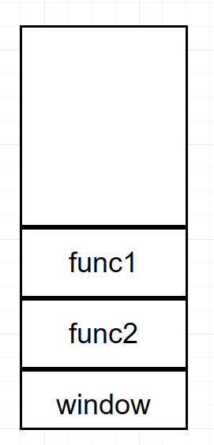

## JavaScript  

JavaScript负责页面中的的行为。  

它是一门运行在浏览器端的脚本语言。  

[JavaScript MDN文档](https://developer.mozilla.org/zh-CN/docs/Web/JavaScript)

[w3school JS教程](https://www.w3school.com.cn/js/index.asp)

### JS的编写的位置  

1.可以编写到标签的指定属性中  
```html  
<button onclick="alert('hello');">我是按钮</button>  
<a href="javascript:alert('aaa');">超链接</a>  
```

2.可以编写到script标签中  

```html  
<script type="text/javascript">  
//编写js代码  
</script>  
```
3.可以将代码编写到外部的js文件中，然后通过标签将其引入  

script标签一旦用于引入外部文件了，就不能在编写代码了，即使编写了浏览器也会忽略  ,如果需要则可以在创建一个新的script标签用于编写内部代码  

```html  
<script type="text/javascript" src="文件路径"></script>  
```
### 输出语句  

```javascript  
alert("要输出的内容");  
```
该语句会在浏览器窗口中弹出一个警告框  
```javascript  
document.write("要输出的内容");  
```
该内容将会被写到body标签中，并在页面中显示  
```javascript  
console.log("要输出的内容");  
```
该内容会被写到开发者工具的控制台中  

### 基本的语法  

js函数声明不需要；分号，但是赋值语句要加；分号  

```javascript  
function functionName(arg0,arg1,arg2){  
//函数声明  
}  
var functionName=function(arg0,arg1,arg2){  
//函数表达式  
};(注意分号)  
```

注释  

单行注释  

```javascript  
//注释内容  
```
多行注释  
```javascript  
/*  
注释内容  
*/  
```

JS严格区分大小写	  

JS中每条语句以分号(;)结尾如果不写分号，浏览器会自动添加，但是会消耗一些系统资源，  而且有些时候，浏览器会加错分号，所以在开发中分号必须写  

JS中会自动忽略多个空格和换行，所以我们可以利用空格和换行对代码进行格式化。  

### 字面量和变量  

#### 字面量  

字面量实际上就是一些固定的值，比如 1 2 3 4 true false null NaN "hello" 
**字面量都是不可以改变的。**  

由于字面量不是很方便使用，所以在JS中很少直接使用字面量  

#### 变量  

变量可以用来保存字面量，并且可以保存任意的字面量  

一般都是通过变量来使用字面量，而不直接使用字面量，而且也可以通过变量来对字面量进行一个描述  

声明变量  

使用var关键字来声明一个变量  
```javascript
var a;  
```

为变量赋值 
```javascript
a = 1; 
```
声明和赋值同时进行 
```javascript
var a = 456;   
```
#### 标识符  

在JS中所有的可以自主命名的内容，都可以认为是一个标识符， 
是标识符就应该遵守标识符的规范。  

比如：变量名、函数名、属性名  

```
规范： 
1.标识符中可以含有字母、数字、_、$ 
2.标识符不能以数字开头 
3.标识符不能是JS中的关键字和保留字 
4.标识符一般采用驼峰命名法 
	- xxxYyyZzz  
```

## 数据类型  

### 六种数据类型  

 **JS中一共分成六种数据类型 5个基本数据类型+object** 

```less
 String 字符串 
 Number 数值 
 Boolean 布尔值 
 Null 空值 
 Undefined 未定义 
```

```less
 Object 对象 
```

 其中基本数据类型有5个 ,还有一个是引用类型

**typeof运算符检查数据类型** 

#### 1.String 字符串  
JS中的字符串需要使用引号引起来双引号或单引号都行 
 在字符串中使用\作为转义字符  

```javascript  
\'  ==> '  
\"  ==> "  
\n  ==> 换行  
\t  ==> 制表符  
\\  ==> \	  
```

 使用**typeof**运算符检查字符串时，会返回"string"	 

#### 2.Number 数值  
 **JS中所有的整数和浮点数都是Number类型**  

最大能表示的值：Number.MAX_VALUE=	1.7976931348623157e+308  

 特殊的数字：能赋值给变量 

```less
	Infinity 正无穷 
		a = Infinity ,能赋值
	-Infinity 负无穷
		a = -Infinity ,能赋值 
	NaN 非法数字（Not A Number） 
```

 其他进制的数字的表示：  

```
0b 开头表示二进制，但是不是所有的浏览器都支持  
0 开头表示八进制  
0x 开头表示十六进制  
```

 使用typeof检查一个Number类型的数据时，会返回"number" 
（包括NaN 和 Infinity）  

#### 3.Boolean 布尔值  
 布尔值主要用来进行逻辑判断，布尔值只有两个 

- true 逻辑的真 
- false 逻辑的假   

使用typeof 检查一个布尔值时，会返回"boolean"	

#### 4.Null 空值  
 空值专门用来表示为**空的对象**，Null类型的值只有一个 `null`;

null本质上是给所有空对象的引用指向的地方

```JS
        var a = null;
        alert(a);
```

使用typeof检查一个Null类型的值时会返回"`object`" 

####  5.Undefined 未定义  
 **如果声明一个变量但是没有为变量赋值此时变量的值就是undefined**

```JS
var a;
console.log(a);//undefined
```

 该类型的值只有一个 undefined 
 使用typeof检查一个Undefined类型的值时，会返回"undefined"  

#### 引用数据类型	  
 Object 对象

```JS
var a={
	"key1":"value1",
	"key2":"value2",
	"key3":"value3"
}
```

### 类型转换  

 类型转换就是指将其他的数据类型，转换为String Number 或 Boolean  

#### 转换为String  

 ##### 1.调用方法
 调用被转换数据的toString()方法 
 例子： 

```JS
var a = 123; 
a = a.toString();//"123"
```

注意：**这个方法不适用于null和undefined** 
由于这两个类型的数据中没有方法(函数对象)，所以调用toString()时会报错  

 ##### 2.强制类型转换形式
 **调用String()函数** 
 例子：  

```javascript
var a = 123;  
a = String(a);  
```
> 原理：
>
> - 对于Number Boolean String都会调用他们的toString()方法来将其转换为字符串，
> - 对于null值，直接转换为字符串"null"
> - 对于undefined直接转换为字符串"undefined"

 ##### 3.隐式的类型转换
 **为任意的数据类型 +""** 
 例子：  

```javascript
var a = true;  
a = a + ""; 
```
 原理：和String()函数一样	  

#### 转换为Number  

##### 作为Number()的参数：  

 例子： 

```javascript
var s = "123";  
s = Number(s); 
```
 转换的情况：  
1. 字符串 > 数字
	
	- 如果字符串是一个合法的数字，则直接转换为对应的数字 
	- 如果字符串是一个非法的数字，则转换为NaN 
	-  如果是一个空串或纯空格的字符串，则转换为0 
	
	```JS
	var s1="123";//合法数字=>123
	var s2="a123";//不合法数字=>NaN
	var s3="";//空串=>0
	var s4="   ";//纯空格=>0
	```
2. 布尔值 > 数字
	
	- true转换为1 
	- false转换为0
	
	```JS
	var bool1=true;//1
	var bool2=false;//2
	```
3. 空值 > 数字 
	
	 - null转换为0
	
	 ```JS
	 var a=null;//0
	 ```
4. 未定义 > 数字 
	
	 - undefined 转换为NaN  

##### 作为parseXXX()的参数：  
 `parseInt()`或`parseFloat()` ,这两个函数专门用来**将一个字符串转换为数字**的  

- 如果对非String使用parseInt()或parseFloat()，它会**先将其转换为String**然后在操作 parseInt() 
- 可以将**一个字符串中的有效的整数位**提取出来，并转换为Number

例子 :

 ```javascript  
var a = "123.456px";  
a = parseInt(a); //123  
 ```
 如果需要可以在parseInt()中指定一个第二个参数，来指定进制parseFloat()可以将一个**字符串中的有效的小数位**提取出来，并转换为Number 

parseFloat可以提取一个完整的浮点数

例子：  

```javascript  
var a = "123.456px";  
a = parseFloat(a); //123.456  
```
- 如果是一个非法的数字,直接转换为一个NaN

  - ```JS
    var a="a123";//NaN
    var a="a1a2a3";//NaN
    ```

- 如果是一个空串或者空格串,转换为NaN

  - ```JS
    var a="";//NaN
    var a=" ";//NaN
    ```

他的匹配机制是

```JS
/^\d+\w*$/
```

- 

##### 隐式的类型转换+

 使用一元的+来进行隐式的类型转换 
 例子：

```javascript  
var a = "123";  
a = +a;  
```

 **原理：和Number()函数一样**  
#### 转换为布尔值  

##### 强制类型转换：  
 使用Boolean()函数 
 例子：  

```javascript
var s = "false";  
s = Boolean(s); //true 
```

转换的情况 

- 字符串 > 布尔 除了空串其余全是true 
- 数值 > 布尔 
  - 0和NaN为false//<i style="color:red">参考c++</i>
  - 非0的值都是true
- null、undefined > 布尔 
  - 都是false//<i style="color:red">无对象</i>
- 对象 > 布尔 
  - 都是true//<i style="color:red">有对象</i>

##### 方式二（隐式类型转换）：	  
 **为任意的数据类型做两次非运算，即可将其转换为布尔值**   

例子：  

```javascript  
var a = "hello";  
a = !!a; //true  
```

## 基础语法  

### 运算符  
 运算符也称为操作符 
 通过运算符可以对一个或多个值进行运算或操作  

#### typeof运算符  
 用来检查一个变量的数据类型 

```
 语法：
 typeof 变量 
 typeof(变量)
```

 它会返回一个用于描述类型的字符串作为结果

```JS
String->string
Number->number
Boolean->boolean
Null->object
Undefined->undefined
Function->function
```

例子

```JS
    console.log(typeof expamle);    //'undefined'

    console.log(typeof(true));  //'boolean'

    console.log(typeof '123');  //'string'

    console.log(typeof 123);   //'number'

    console.log(typeof NaN);   //'number'

    console.log(typeof null);  //'object'   
```

**typeof运算符用于判断对象的类型，但是对于一些创建new出来的对象，它们都会返回'object'** 

```
  var obj = new String();  
  console.log(typeof(obj));    //'object'
```

#### 算数运算符  

- +&ensp;对两个值进行加法运算并返回结果    
- -&ensp;对两个值进行减法运算并返回结果    
- *&ensp;对两个值进行乘法运算并返回结果    
- /&ensp;对两个值进行除法运算并返回结果    （js的除法，不是c语言中的整除，因为数值用Number表示）

  - ```JS
            var a = 9 / 7;
          		//就是进行浮点运算
            alert(a);//1.2857142857142858
    ```

- %&ensp;对两个值进行取余运算并返回结果  

  - ```JS
            var a = 9 % 7;
            alert(a);//2
          		//9/7=1..2
    ```


> 除了加法以外，对非Number类型的值进行运算时，都会先转换为Number然后在做运算。
>
> - 怎么转换?使用Number()转换,
>
> 加法运算时
>
> - 如果是两个字符串进行相加，则会做拼串操作，将两个字符连接为一个字符串。 
> - 任何值和字符串做加法，都会先转换为字符串，然后再拼串 

#### 一元运算符  

 一元运算符只需要一个操作数  
 ##### 一元的+  
 就是正号，不会对值产生任何影响，但是可以将一个非数字转换为数字 
 例子：    

```javascript  
var a = true;  
a = +a;  
```
##### 一元的-  
 就是负号，可以对一个数字进行符号位取反
 例子：  

```javascript  
var a = 10;  
a = a;  
```

##### 自增  
 自增可以使变量在原值的基础上自增1 
 自增使用`++`

```JS
var a=1;
a++;//先使用值,在最后+1;
++a;//先自增,然后在使用值
```

##### 自减  
 自减可以使变量在原值的基础上自减1 
 自减使用`--`

```JS
var a=1;
a--;//先使用值,在最后-1;
--a;//先自减,然后在使用值
```

#### 逻辑运算符  

`! `
	 非运算可以对一个布尔值进行取反，`true变false`和`false边true `
	 当对非布尔值使用!时,会先将其转换为布尔值然后再取反 
	 我们可以利用!来将其他的数据类型转换为布尔值

```JS
var a={};
!a => !Boolean(a)
!!a => !!Boolean(a)=>Boolean(a)
```

`&&` 与运算

| A    | B    | A&&B |
| ---- | ---- | ---- |
| 1    | 1    | 1    |
| 1    | 0    | 0    |
| 0    | 1    | 0    |
| 0    | 0    | 0    |


与是一个**短路的与**

如果第一个值是false，则不再检查第二个值(第一个值是false的时候,短路输出false)

对于非布尔值，它会将其转换为布尔值然后做运算，并返回原值 

```
			1.如果第一个值为false，则返回第一个值 
			2.如果第一个值为true，则返回第二个值  
```

`|| `或运算

| A    | B    | A\|\|B |
| ---- | ---- | ------ |
| 1    | 1    | 1      |
| 1    | 0    | 1      |
| 0    | 1    | 1      |
| 0    | 0    | 0      |

或是一个**短路的或**，

- 如果第一个值是true，则不再检查第二个值(A值为true时短路,输出true)

对于非布尔值，它会将其转换为布尔值然后做运算，并返回原值 
	 规则：

```
			1.如果第一个值为true，则返回第一个值 
			2.如果第一个值为false，则返回第二个值  
```

#### 赋值运算符  

= 
	 可以将符号右侧的值赋值给左侧变量 
+=      

```javascript
a += 5 相当于 a = a+5    
var str = "hello";  str += "world";  
```
-=    
```javascript
a -= 5  相当于 a = a-5  
```
*=    
```javascript  
a *= 5 相当于 a = a*5  
```
/=    
```javascript  
a /= 5 相当于 a = a/5	  
```


%=  
```javascript  
a %= 5 相当于 a = a%5 
```

#### 关系运算符  

 关系运算符用来比较两个值之间的大小关系的
	> 
	>= 
	< 
	<= 
 关系运算符的规则和数学中一致，用来比较两个值之间的关系， 
	如果关系成立则返回true，关系不成立则返回false。 
 如果比较的两个值是非数值，会将其转换为Number然后再比较。 
 如果比较的两个值都是字符串，此时会比较字符串的Unicode编码，而不会转换为Number。 

#### 相等运算符 

==

 相等，判断左右两个值是否相等，如果相等返回true，如果不等返回false 
 相等会自动对两个值进行类型转换，如果**对不同的类型进行比较，会将其转换为相同的类型然后再比较**，转换后相等它也会返回true，null == undifined

```JS
//比如"123"与123
var string1="123";
var a=123;
alert(a==string1);//true
```

!= 
	 不等，判断左右两个值是否不等，如果不等则返回true，如果相等则返回false 
	 不等也会做自动的类型转换。 
	 
**===** 
	 **全等**，判断左右两个值是否全等，它和相等类似，只不过它不会进行自动的类型转换， 
		如果两个值的类型不同，则直接返回false 

```JS
//比如"123"与123
var string1="123";
var a=123;
alert(a===string1);//flase
```

!== 
	 **不全等**，和不等类似，但是它不会进行自动的类型转换，如果两个值的类型不同，它会直接返回true

```JS
//比如"123"与123
var string1="123";
var a=123;
alert(a!==string1);//true
```


> 特殊的值：
>
> 
>
> **null和undefined** 
> 		 由于undefined衍生自null，所以**null == undefined** 会返回true。 
> 			但是 null === undefined 会返回false。 
> **NaN** 
> 	 NaN不与任何值相等，报告它自身 NaN == NaN //false 
>
>  判断一个值是否是NaN 
> 	 使用isNaN()函数  

#### 三元运算符：  

?:  
	 语法：条件表达式?语句1:语句2;  
	 执行流程：  
		先对条件表达式求值判断，  
			如果判断结果为true，则执行语句1，并返回执行结果  
			如果判断结果为false，则执行语句2，并返回执行结果  
			  
优先级： 
 和数学中一样，JS中的运算符也是具有优先级的， 
	比如 先乘除 后加减 先与 后或 
 具体的优先级可以参考优先级的表格，在表格中越靠上的优先级越高， 
	优先级越高的越优先计算，优先级相同的，从左往右计算。 
 优先级不需要记忆，如果越到拿不准的，**使用()来改变优先级**。  

### 流程控制语句  

 程序都是自上向下的顺序执行的， 
通过流程控制语句可以改变程序执行的顺序，或者反复的执行某一段的程序。  

#### 条件分支语句  
 条件判断语句也称为if语句 
 语法一：  

 ```javascript
 if(条件表达式){  
 	语句...  
 }  
 ```


```  
 执行流程：  
 if语句执行时，会先对条件表达式进行求值判断，  
 如果值为true，则执行if后的语句  
 如果值为false，则不执行  
```

 语法二：  
```javascript
if(条件表达式){  
	语句...  
}else{  
	语句...  
} 
```
```  
 执行流程：  
	if...else语句执行时，会对条件表达式进行求值判断，  
		如果值为true，则执行if后的语句  
		如果值为false，则执行else后的语句  
```

 语法三：  

```javascript  
if(条件表达式){  
	语句...  
}else if(条件表达式){  
	语句...  
}else if(条件表达式){  
	语句...  
}else if(条件表达式){  
	语句...  
}else{  
	语句...  
}	  
```
```  
 执行流程  
	 if...else if...else语句执行时，会自上至下依次对条件表达式进行求值判断，  
		如果判断结果为true，则执行当前if后的语句，执行完成后语句结束。  
		如果判断结果为false，则继续向下判断，直到找到为true的为止。  
		如果所有的条件表达式都是false，则执行else后的语句  
```

1.条件分支语句 
switch语句 
语法:  

```javascript  
switch(条件表达式){  
	case 表达式:  
		语句...  
		break;  
	case 表达式:  
		语句...  
		break;  
	default:  
		语句...  
		break;  
}  
```

执行流程： 
 switch...case...语句在执行时，会依次将case后的表达式的值和switch后的表达式的值进行全等比较， 
	如果比较结果为false，则继续向下比较。如果比较结果为true，则从当前case处开始向下执行代码。 
	如果所有的case判断结果都为false，则从default处开始执行代码。  

#### 循环语句  
通过循环语句可以反复执行某些语句多次 
while循环 
 语法：  

```javascript  
while(条件表达式){  
    语句...  
}  
```

 执行流程： 
	while语句在执行时，会先对条件表达式进行求值判断， 
		如果判断结果为false，则终止循环 
		如果判断结果为true，则执行循环体 
		循环体执行完毕，继续对条件表达式进行求值判断，依此类推 
		 
do...while循环 
 语法:  


```javascript  
do{  
语句...  
}while(条件表达式)  
```

 执行流程 
	do...while在执行时，会先执行do后的循环体，然后在对条件表达式进行判断， 
		如果判断判断结果为false，则终止循环。 
		如果判断结果为true，则继续执行循环体，依此类推 
		 
 和while的区别： 
	while：先判断后执行 
	do...while: 先执行后判断 
	 do...while可以确保循环体至少执行一次。 
	 
for循环 
 语法：  

```javascript
for(①初始化表达式 ; ②条件表达式 ; ④更新表达式){  
    ③语句...  
}  
```
 执行流程： 
	首先执行①初始化表达式，初始化一个变量， 
	然后对②条件表达式进行求值判断，如果为false则终止循环 
	如果判断结果为true，则执行③循环体 
	循环体执行完毕，执行④更新表达式，对变量进行更新。 
	更新表达式执行完毕重复② 
	 
死循环  

```javascript
while(true){  

}  

for(;;){  

}
```
## 对象（Object）  

对象是JS中的引用数据类型 
**对象是一种复合数据类型，在对象中可以保存多个不同数据类型的属性** 
使用typeof检查一个对象时，会返回object  

### 对象的分类：  

1.内建对象
	- 由ES标准中定义的对象，在任何的ES的实现中都可以使用  
	- 比如：Math String Number Boolean Function Object....  

2.宿主对象 

	- 由JS的运行环境提供的对象，目前来讲主要指由浏览器提供的对象 
	- 比如 BOM DOM  

3.自定义对象  

	- 由开发人员自己创建的对象  

### 创建对象 

 方式一：new

```javascript
	 var obj = new Object();  
```
 方式二： 对象字面量方法
 ```javascript
	 var obj = {}; 
 ```
### **向对象中添加属性** 

```js
 语法： 
	对象.属性名 = 属性值; 
	对象["属性名"] = 属性值;	//这种方式能够使用特殊的属性名,比如带空格或者特殊字符的属性
```

关于属性名

-  **对象的属性名没有任何要求，不需要遵守标识符的规范，但是在开发中，尽量按照标识符的要求去写。** 

- 以string类型存储,一般也都是string

关于属性值

- 属性值也可以任意的数据类型。  

### 读取对象中的属性 

```js
 语法： 
	对象.属性名 
	对象["属性名"] //"属性名"可以使字符串常量，也可以是字符串变量 
```

 如果读取一个对象中没有的属性，它不会报错，而是返回一个undefined,未定义

> 定义一个变量但是不赋值
>
> ```JS
> var a;
> console.log(a);//undefined
> ```
>
> 

**删除对象中的属性** 
 语法：  

```javascript
delete 对象.属性名  
delete 对象["属性名"]  
```


### 遍历枚举对象中的属性 

**使用in检查对象中是否含有指定属性** 
 语法："属性名" in 对象
	 如果在对象中含有该属性，则返回true 
		如果没有则返回false  

      循环遍历对象自身的和继承的可枚举属性(不含Symbol属性).  
      for...in语句的循环体会执行多次，对象中有几个属性就会执行几次，
    	每次将一个属性名赋值给我们定义的变量，我们可以通过它来获取对象中的属性

```javascript  
var obj = {'0':'a','1':'b','2':'c'};  
  
for(var i in obj) {  
     console.log(i,":",obj[i]);  
}  
```

**使用对象字面量，在创建对象时直接向对象中添加属性** 
语法： 

```javascript
var obj = {  
    属性名:属性值,  
    属性名:属性值,  
    属性名:属性值
} 
```
### 基本类型和引用类型(对象)的区别

 基本数据类型 
	String Number Boolean Null Undefined 

	基本数据类型的数据，变量是直接保存的它的值(即直接在栈中保存他的值)
	变量与变量之间是互相独立的，修改一个变量不会影响其他的变量

 引用数据类型 
	Object 

```
引用数据类型的数据，变量是保存的对象的引用（内存地址）。
	如果多个变量指向的是同一个对象，此时修改一个变量的属性，会影响其他的变量。  
```

 比较两个变量时，对于基本数据类型，比较的就是值， 
	对于引用数据类型比较的是地址，地址相同才相同  	  

### 执行环境

定义:执行环境定义了变量和函数有权访问的其他数据(变量和函数)
		每个执行环境对应一个变量对象,变量对象存储环境中定义的变量和函数

销毁时间:执行环境,也可以叫运行上下文,在最后一行代码/retrun执行时
					全局执行环境的销毁时间是关闭网页时

1. 全局执行环境,变量对象为window对象

2. 每个函数在执行是对应一个执行环境,执行时推入环境栈

   - ```
         <script>
             function fun1() {
                 alert("fun1");
             }
             function fun2() {
                 fun1();
                 alert("fun1");
             }
             fun2();
         </script>
     ```

     

   - 

作用域链:保证执行环境对成员的有序访问(符合规则的访问)
				作用域链的前端:当前执行环境,也就是环境栈顶;作用域链其实就是环境栈的另一种表达方式
				应用:标志符解析,沿着作用域链从前向后查找

### 作用域  

作用域简单来说就是一个变量的作用范围。 
在JS中作用域分成两种：  

#### ①全局作用域 

位置:直接在script标签中编写的代码都运行在全局作用域中 
**创建和销毁时间:全局作用域在打开页面时创建，在页面关闭时销毁。** 

全局作用域中有一个全局对象window，window对象由浏览器创建并提供,可以在页面中直接使用，它代表的是整个的浏览器的窗口。 

```JS
alert(window);//[object Window]
```

- 在全局作用域中创建的变量都会作为window对象的属性保存

- 在全局作用域中创建的函数都会作为window对象的**方法**保存 

在全局作用域中创建的变量和函数可以在页面的任意位置访问。 
在函数作用域中也可以访问到全局作用域的变量。 

- ```JS
          var b = 4;
          function fun() {
              document.write(window.b);//4
          }
          window.fun();
  ```

尽量不要在全局中创建变量	  

#### ②函数作用域

函数作用域是函数执行时创建的作用域，每次调用函数都会创建一个新的函数作用域。 

创建和销毁时间:函数作用域在函数执行时创建，在函数执行结束时销毁。 

作用域:只在函数中

​	在函数作用域中创建的变量，不能在全局中访问。 

**作用域链**

> 当在函数作用域中使用一个变量时
>
> 1. 它会先在自身作用域中寻找， 
> 2. 如果找到了则直接使用，如果没有找到则到上一级作用域中寻找， 
> 3. 如果找到了则使用，找不到则继续向上找，一直会到最顶部的window

#### JS没有没有块级作用域

使用var声明变量会将变量加入当前/最接近的执行环境,也就是全局作用域中

使用if/for语句创建的变量,在这些作用块结束的时候,这些变量也依然存在

有块级作用域的语言如c++/c,就是在作用块结束的时候,这些变量销毁

```js
    <script>
        var a = true;
        if (a) {
            var b = "inner-var";
        }
        console.log(b);//inner-var
    </script>
```

在函数作用域中,使用var声明的变量自动加入函数的作用域中,在函数执行完毕后销毁

> 但是如果没有使用var声明的变量,会被添加到全局作用域中,在函数执行完毕后仍然存在
>
> ```JS
>     <script>
>         function add(num1, num2) {
>             sum = num1 + num2;
>             /* 
>             沿着作用域链找sum,没有
>             创建sum,添加到全局执行环境的变量对象中,此时可以在函数外访问
>             */
>             return sum;
>         }
>         add(1, 2);
>         console.log(sum);//3
>         add(2, 2);
>         /* 
>         第二次执行:
>             1.沿着作用域链找sum,在全局window中找到sum,拿过来使用
>             2.值被修改
>          */
>         console.log(sum);//4
>     </script>
> ```
>
> 

### 声明提前

#### **变量的声明提前** 

​	 在**全局作用域**中，使用**var关键字声明的变量会在所有的代码执行之前被声明，但是不会赋值。** 

- ```JS
  alert(a);//1
  var a=4;//2
  尽管a是在alert后面声明赋值的,但是因为声明提前,相当于
  var a;//1
  alert(a);//2-->undefined
  a=4;
  ```

- 所以我们可以在变量声明前使用变量。但是不使用var关键字声明的变量不会被声明提前

  - ```JS
    alert(a);//1
    a=4;//2
    //此时会抛出一个错误
    //Uncaught ReferenceError: a is not defined
    ```

​	 在**函数作用域**中，也具有该特性，使用var关键字声明的变量会在函数所有的代码执行前被声明，但是不会赋值 
​		如果没有使用var关键字声明变量，则变量会变成全局变量 

```JS
        function add(num1, num2) {
            console.log(a);//ReferenceError: a is not defined
            sum = num1 + num2;
            a = 4;
            /* 
            在函数作用域中不使用var声明的变量尽管是添加到全局中的,
            但是既不会再所有代码之前声明,也不会在本函数内的所有代码之前声明
            如果提前使用,会抛出一个引用异常
            */
            return sum;
        }
        add(1, 2);
```

####  **函数的声明提前** 

​	①在**全局作用域**中，使用**函数声明创建的函数（function fun(){}）,会在所有的代码执行之前被创建**， 

- ```JS
  fun1();//1
  function fun1(){
  	alert("fun");
  }//2
  //实际的执行顺序是
  function fun1(){
  	alert("fun");
  }//1 声明提前
  fun1();//2
  ```

​	也就是我们可以在函数声明前去调用函数

​	但是使用函数表达式(var fun = function(){})创建的函数没有该特性

- ```JS
          fun1();//TypeError: fun1 is not a function
          var fun1 = function () { alert("fun1") };
  ```

  -  正常

    ```
            var fun1 = function () { alert("fun1") };
            fun1();//fun1
    ```

②在函数作用域中，使用**函数声明创建的函数，会在所有的函数中的代码执行之前就被创建**	

### this（!!上下文对象）  

我们每次调用函数时，解析器都会将一个上下文对象作为隐含的参数传递进函数。 
使用this来引用上下文对象，根据函数的调用形式不同，this的值也不同。  

指向当前对象 

this的不同的情况： 
1.以函数的形式调用时，**this是window**(解释:因为函数其实就是window的方法,也就是说是window调用的函数)
2.以方法的形式调用时，this就是调用方法的对象 
3.以构造函数的形式调用时，this就是新创建的对象  

### 构造函数  

构造函数是专门用来创建对象的函数 
**一个构造函数我们也可以称为一个类**
通过一个构造函数创建的对象，我们称该对象时这个构造函数的实例 

通过同一个构造函数创建的对象，我们称为一类对象

#### 调用方式

构造函数就是一个普通的函数，只是他的调用方式不同， 

- 如果直接调用，它就是一个普通函数,执行的添加几个全局变量给window
- 如果使用new来调用，则它就是一个构造函数  

例子：  

```javascript  
function Person(name , age , gender){  
    this.name = name;  
    this.age = age;  
    this.gender = gender;  
    this.sayName = function(){  
        alert(this.name);  
    };  
}  
```

  

#### 构造函数的执行流程：

1.创建一个新的对象 
2.将新的对象作为函数的上下文对象（this） 
3.执行函数中的代码 
4.将新建的对象返回 

#### instanceOf

**instanceof 用来检查一个对象是否是一个类的实例** 
 语法：对象 instanceof 构造函数 
	 如果该对象时构造函数的实例，则返回true，否则返回false 
	 **Object是所有对象的祖先，所以任何对象和Object做instanceof都会返回true** 
	 

### 原型（prototype）  

#### 原型对象

创建一个函数以后，**解析器都会默认在函数中添加一个属性prototype,这个属性唯一,不管是什么函数** 
	prototype属性指向的是一个对象，这个对象我们称为原型对象。  

- 当函数作为普通函数调用时,调用prototype没有什么作用,仅仅指向一个原型对象

- 当函数作为构造函数使用，**它所创建的对象中都会有一个隐含的属性执行该原型对象。**  

```javascript  
这个隐含的属性可以通过对象.__proto__来访问//双下划綫
```

```JS
    <script>
        function Person(name, age, gender) {
            this.name = name;
            this.age = age;
            this.gender = gender;
            this.sayName = function () {
                alert(this.name);
            };
        }
		Person.prototype.a=1;
        var person = new Person("wff", 20, "男");
		var person1 = new Person("abc", 20, "男");
        console.log(Person.prototype == person.__proto__);//true
    </script>
```


**原型对象的作用?**

**原型对象就相当于一个公共的区域，凡是通过同一个构造函数创建的对象实例他们通常都可以访问到相同的原型对象。** 
	我们可以将对象中共有的属性和方法统一添加到原型对象中， 
这样我们只需要添加一次，就可以使所有的对象都可以使用。

> 我们一般将公有的方法或者属性加在原型对象中

举例:我们将sayName方法加到原型对象中

```js
    <script>
        function Person(name, age, gender) {
            this.name = name;
            this.age = age;
            this.gender = gender;
        }
        Person.prototype.sayName = function () {
            alert(this.name);
        };
        var person = new Person("wff", 20, "男");
        var person1 = new Person("abc", 20, "男");
        console.log(person.sayName == person1.sayName);//true
		//两个函数对象指向原型对象中的sayName
    </script>
```

调用原型对象中的函数

```js
//调用方法的逻辑
person.sayName();
/*
	person调用sayName,传入一个上下文对象this,也就是person实例
	尽管是原型对象的方法,this.name=>person.name=>wff
*/
```


**访问属性**

当试图访问一个对象的属性时，它不仅仅在该对象上搜寻，还会搜寻该对象的原型，以及该对象的原型的原型，依次层层向上搜索，直到找到一个名字匹配的属性或到达原型链的末尾(Object的原型对象)。

如果不想使用原型对象中的属性,可以在对象实例中创建一个属性覆盖原型对象的属性

例子:覆盖属性

```JS
        function Person(name, age, gender) {
            this.name = name;
            this.age = age;
            this.gender = gender;
        }
        Person.prototype.sayName = function () {
            alert(this.name);
        };
        var person = new Person("wff", 20, "男");
        person.sayName=function(){
        	return this.name;
        };
        var person1 = new Person("abc", 20, "男");
        console.log(person.sayName == person1.sayName);//false
		//person的sayName指向的是自己的sayName,person1指向原型对象中的sayName
```


#### 对象中的属性&对象及其原型链中的属性

**in**
	检查对象及其原型链中是否有某个属性

```js
"name" in person//true
"sayName" in person//true
```

 **hasOwnProperty()** 
	 这个方法可以用来检查**对象自身中**是否含有某个属性 
	 语法：对象.hasOwnProperty("属性名")  

```JS
person.hasOwnProperty("name");//true
person.hasOwnProperty("sayName");//true
```

> 这个方法的位置?
>
> ```JS
>        function Person(name, age, gender) {
>             this.name = name;
>             this.age = age;
>             this.gender = gender;
>         }
>         Person.prototype.sayName = function () {
>             alert(this.name);
>         };
>         var person = new Person("wff", 20, "男");
>         var person1 = new Person("abc", 20, "男");
> 
>         console.log(person.hasOwnProperty("hasOwnProperty"));//false
>         console.log(person.__proto__.hasOwnProperty("hasOwnProperty"));//false
>         console.log(person.__proto__.__proto__.hasOwnProperty("hasOwnProperty"));//true
> ```
>
> - 不在person里面
> - 不在person的原型对象里面
> - 在person原型对象的原型对象里面
>
> 

检查一个属性是否是原型链中的属性

​	当in为true,且hasOwnProperty为false的时候.

```js
function hasPrototypeProperty(object,name){
	return (name in object)&&!(object.hasOwnProperty(name))
}
```

#### 理解原型对象


![img](data:image/png;base64,iVBORw0KGgoAAAANSUhEUgAAAsUAAAErCAIAAAC5D2kgAAAAAXNSR0IArs4c6QAAAARnQU1BAACxjwv8YQUAAAAJcEhZcwAADsMAAA7DAcdvqGQAAIKRSURBVHhe7Z13QBRX14dVFMWCoCD2rth7770n9hZr7C1qom8ssUWNJTH2FlvsLZbYe28Ue0PFioqADURQUfB7sve638YSwQVc8Dx/wNwyd+7O3HPO7+zOzsZ9/fp1HEEQBEEQBDOIp/8LgiAIgiB8KqInBEEQBEEwF9ETgiAIgiCYi+gJQRAEQRDMRfSEIAiCIAjmInpCEARBEARzET0hCIIgCIK5iJ4QBEEQBMFcRE8IgiAIgmAuoicEQRAEQTAX0ROCIAiCIJiL6AlBEARBEMxF9IQgCIIgCOYiekIQBEEQBHOR3yuPzWzdunX58uVFixZ1dnbWVYIgCMIXQ9myZZMnT64LH8Dd3f3+/ftsZM6cOU+ePKryExA9EZuZP3/+mDFjqlevXrx4cV1lGRQpUsTW1lYX4sTx8/O7ePGiLpiQM2fOtGnT6sIHuHHjxq1bt3TBBNND3L1719PTU21bWVlhYPHivf3O3FtzKFWqVKJEidT29evXvby81LaNjU3JkiXV9okTJwIDA9V2unTpcuTIobaF/4AzyfnUBUEQohhcU8KECXXhA9y7d+/Zs2c4NMyzbt263bt31w0RRPREbAY9sWTJkqFDhzo5OekqyyBr1qyJEyfWhThxAgICbt++rQsmICZSpEihCx/A19dXKeu3MD3Ew4cPMRi1jZ5wdnZ+V0+8NQekjLW1tdo2PQSWadQN165dwwjVdsqUKdOkSaO2hf+AM8n51AVBECwGhP6OHTvs7e1Hjx6tqyKI6InYDHpi586dq1at0mVBEARB+ABbt24lTfruu+90OYLI/ZiCIAiCIJiL6AlBEARBEMxF9IQgCIIgCOYiekIQBEEQBHMRPSEIgiAIgrmInhAEQRAEwVxETwiCIAiCYC6iJwRBEARBMBfRE4IgCIIgmIvoCUEQBEEQzEX0hCAIgiAI5iJ6QhAEQRAEcxE9Edvw8fG5ZcDDw4O//v7+Z86cUTXw8uVL3U8QBEEQIg/5fdHYxty5c728vNi4e/fuiRMnHj16VLJkydy5c6vWPn36ODg4qG1BEARBMGLm74uKnoht1K1b99ChQ6Ghobpsgo2NjZubW9asWXVZEARBEN4gv1cu/IvSpUs7OTnpgglWVlY1atRInDixLguCIAhC5CF6IrbRv3//IkWK6IIJCRIkmDx5cqpUqXRZEARBECIP0ROxjUSJEjVv3rxo0aK6bMDOzm7gwIG2trbx4skVFwRBECIfiS6xkCpVqhhvwFQkTZq0bdu21tbWuiwIgiAIkYroiViInZ1d1apVjZ96ZM+efdq0aU5OTvLmhCAIghBFSICJnZQvX75u3bpp06a1tbUtXrx4jRo1dIMgCIIgRAHyfdHoICws7Ny5c+o7nFmyZLG3t2fjwYMH6kER/02SJEmcnZ11IU6cK1euPH36VBfeR86cOf38/Pz9/T08PFauXHnz5s127dpVqVJFNwuWRK5cuSzwGzdPnjy5evWqLsRekNoI7kuXLulyNJI+fXrjndFBQUGXL19W26akTp2a6emCCW95gOTJk2fLlk0XTLh9+/b9+/fV9ls+RBA+RLQ+f+Lhw4fnz5/39PTUZSF8oCfc3d1fvXrFNoatnijl4+PDlTO0/xfJkiUrUKCALsSJgy7B3evC+8ifP7+3tzdXim3Gv3fvXrly5VSTYGkMGzYMfakLFsOFCxcmTJigC7EXZH3GjBnPnDmjy9EIF92oFQIDA8+ePau2TUFzZMqUSRdMeMsD8Cry5MmjCyZcv34d21fbb/kQ4cukWLFihQoV0oUPEK16gnW/YcMG3I0uC4IQcdCXpI8eHh579+5975d7Py/M6ptvvqlUqZIuC4Lw+fDz83v27JkufCo4nL59+/bv31+XP0B064nHjx9XrFhRlwVBiDjPnz9fvnz50KFDN23aZJl6YsCAAe7u7rosCMLnw9XVFUmhC5/KrFmzqlSpInpCEGIboicEQYhOunXrlj179qjWE/L9DkEQBEEQzEX0hCAIgiAI5iJ6QhAEQRAEcxE9IQiCIAiCuYieEARBEATBXERPCMKXSEhIyOHDh/mry0LE8fLymvdvvL29dVtMgPlv3rxZzXzhwoVHjx5Vz9z7ZEJDQ48dO8a6CggI0FXh4+bNmxs3btQFIcZiNWLECL0ZDnx9fZ8/f545c2ZdFqKANWvWrF279uAb3Nzc/Pz8OO2Ojo7yg16xA7z2uXPn9u3b980336RJk0bXRiPBwcHu7u6TJ09WT5tOkSJFokSJVBPcuHFj9+7dXbp00WXhA5w9e3bkyJGcSSO3b9/m4trZ2SVNmlR3slQQE+vWrVuyZMmBAweY+YkTJzw8PFgPOBnWQ8KECXW/iMBrR5ds3bq1SJEi+CtdGw5Onjw5d+7cvHnzGh9DLkQuCEcua5kyZXT5A3h6ej5+/LhkyZK6HEFET1gcGPmiRYu2b9/OpX348KGLi8upU6euX79eo0aNBAkS0AGfdf78eTJL1ofa5V3u3btHt5cvXyZLlkzVkDoQwJycnKytrWmiaGNjo5qA0XAlZ86cSZ06tfyseVTz2fVEYGDgjh075syZQ0qqHpWDHzcuFdET4SQoKOjKlStk5Jy6ChUqZMuWbcuWLUTl7Ab8/f0vXrzIhb5m4NmzZ8mTJ48fP/6dO3cI4Rg1He7fv48tv9UBM0SpEODZwJDpkz59enXEq1ev7ty5k4Niwlw4KysrDs04JB5qECP4CkZTe70XfMvdu3ex+lu3buXOnbtgwYJJkiRhSbBj4cKFb968yRwYx8fHxzhJFkaGDBk4KLufPn1adYAnT56wjPEhFy5cmD17NouKblTS9Pr1a6ObMjoZtRfTRsXihXgtGzdu3LRpE8uSo9PEieV1sc0J5ERRQxOuifr9+/cb9n4PvKJ06dKpY4Grqyu7q6YXL15ESN/EPqJHT8jzrCwOHBBJDw6idu3a9evXxypWrVoVEBCAD8qVKxeuBJ+FyMB5sThwGVRiKmQb2HxYWJga5PLlyzgLnBqDZMyYUXkHnEWrVq1InjDgsmXLFi1alJ7e3t4cAl92+PBhXGHbtm2LFy+eJUsWFhbuQ42miBs3LnIEX2OaywqfwGd/ntWjR49ITH/66Sdl/jly5GjatGm1atVYMClTppTnWYUfrLV58+ZcxFmzZhECMTcs99dff8XQDh06tGbNGkyPbtgOMRujq1mzJhF62rRpbm5uJGa2traEc9WhcuXKPXv2xAZJJ7A+Iii6097e3tnZGcvFtEni169fv2LFCgI/sQGrr169Oi7i6dOngwYNeusRitRzTYnruvwBFixY8Mcff7ASvv76a5wAho/5//bbb9u2bUO4BAcHcyBel5pkwoQJyXaUTsIpGX80LmvWrO3bt+ckLF26lKEI3syZvWhq165dhw4d2CDYI2GVk1FuKlOmTA0bNqxUqRKebdiwYUR9Mhn1OyMNGjRAauNtfv/9d6RG4sSJeaU9evRAxLAy6fBe0DQcS/2WMj3Z1/iDiwzbunXrTw6TsYDoeZ5VxN6fYFUR2PA+uixEAVgRcgHzwzfVqlULVY5zwSuVLl0a7zN16lR8CnbOhdi1axdqHSPHWkiScDo4tdWrV2PzKAasmhQBqyb1nDt37uDBg0kscAG08rdQoULYPK5NxRXSII744MED3ASSMU+ePGTP48aNw3nh+FAnOEcyDzKVqlWrWv57uRZOVLw/QfjhwhFawgMXmvT3yJEjal/kBdeXVREvXjx8PRuICXl/IjxghsRIIjGqHWtCICLRsFz+zps3j6QQM+SUYrCcYVrREyVKlIgfPz6pPAuAXTBwDJMaVgIBDy3CXlwjgjTZAmkAQxGV0f2IBqQe3RAZ7EINVwoDRwQw+J49e5gG4Z+ozLCXLl1ycHBA/euJfgCyfwSQSutxMpg/EoSQzIQJ/EySQ/Aa1REZuVmzZsidn3/+mcXGoankBZLJ4CXq1KmDw+FssC8vChFAK35G/QYVC55979y5g2DlxdJ0/Phxch5URWhoKHPgJbONi6MJ4YV3srGxYR3i4hgWsZIzZ86///575cqVvEwGYTI4RoIf/XnVL1++pIgGQkVx6B9//JE0iZmEhIQwVY6FS0QxW+DP+UYDnAHWHpElqt+fiNjn8VwSlqkuCFEJZoAr+fPPP5HnbGNLmOv27dvREJgxeczMmTNRkfgaBARGgqJHWiq/gDEPGTKEnmiFFi1aYH44BawOS0OzqwwJ6InnGj16dNGiRelMRoKbQMOiV7DSPn36tGnTJn369KQFtC5evJisyDA1weIgZcTtslrCyfLly48ePap3fgPyom/fvjh91KeuEj5GUFAQ541wjjQk28YXE/tRDAh0si9MtVSpUjQ1b96c+EeAVLdAITjQ5YTVihUrYlxAIMQSHR0dmzRpgrHj9+lA5oZWINz6+flh3YRq9MH8+fPVLkOHDiWWkx4wIBkFI3MsEgCa0ILPnz83Zuf/zY0bN0aNGsXk8RUMQvqRIEECJkxIJodhAiS16ohbtmzBCaAneJn4ClXJfL766iuyEeRR3bp1y5cvz8ucNGmSauVs6MPEiUM9Lxyfo5pwaCROwO6ktegkch7V1KpVKyQCu+CFunbtmihRIla4ynk4afi6NWvW0A3ZwVnt2LEj27zwb7/9FlGydu1a9DECAjdYr149Tj4yAj+GxyPpUjP50kDtoeR0ISqJmJ5ggSJadUGISjjViPGpU6fi/ckmWRBJkyadNWsWy4JL8MMPP+A7vv/+e+QkFqX3MUARY8Y16HKcOLiAfPnysfHHH39g8EuXLmVA1QS4sGLFirGBE8GnDBgwwPQ9UmwyV65cbCBZKlWqhDGresGi4JqiICdMmMCCCQ9z5szBj+udTSCckAteuXJFl4Xwge0g04leRHdCI4JA1RMFd+/ezQlH/SMLypUrR2KtmiBt2rQFCxbUhTcgEeiJmZNIECMvX75M8EZMcAha8+TJY3x3kG5AmCS5VzVGXr16Zfzo86MoDcHkFb/88ku2bNl0W5w4SAoCti4YSJgwIbLGwcFBFTkQ0yCQv/eX32liMmobWcBoRh9Sv359MhklsIDUyNjTlMqVK+OgUMD9+vXDASZPnnz8+PHGoyO51K+6czI5vagoXCW5ODrv9OnTZEGcfBypt7e3OoFClCLfF7BQsmbNStJA6gDkJbrWAD6oZ8+emL2iW7duusFA586d8+bNqwsGkCa4M5KAixcvMlqPHj2cnJx0mxArOH/+PG76119/VQvmo5BSv/fnyDNmzIguWbJkiS4L4YD4StpN3Jo9e7azs7OuNYCwwPQ44eh+xHrFihX/+x5JmDdvnronY+fOnaTdrVu3phI1T4ZARJw8ebK6IQOuX79+4cIFMm+kjKoxQmgP55sTQMLAymHyio86B5IZXwOqSKhmGra2tiVKlFA1ppw9e5YArwv/BomAeM2ePbsqsv3engUKFGjUqFG6dOlcXV1TpEgxbNgwU2Wg7rhkg9fL6bKxsalQoULLli1RXSVLlly/fr1a8Nu3b//mm2/ULkIUgioMPxMnTuzUqZMuCFEDDqVIkSLYJwqAzEPXGkA6pEmTBoMZPnw43ShiZqQUNCHM0e/4Ahg0aBCZjfrkFchEkyRJQgrStWvXP//8E7GfLFmyP/74g6Zt27aVLVsWr9e/f/9Fixblz58/Q4YMffv2JStihDJlyuTLl2/KlCl+fn7Tpk0jtQI2KKqRhU/j2bNn8+fPJ6M6ceKErjIPwkzjxo25grr8Me7fvz9u3DiilJHixYv37t17y5YtuPU9e/awSHRX4cPs27cvS5YsnD3sgkQZSeHj46OayI+nT5+OesCgEBmYGCk1VxwlR+vo0aMxZMyQv7SiM9ReUKNGDQakJ/UkFZgtOT3Z/8uXL7FERsucOTNNwL5t2rQ5deoUaoBt9iLctm3bljjKfCiWKlVq2bJletx3cHd3Vw6ESaIjK1eurBsMfPfddxyIAR0dHTlWlSpVNm7cqJqYDGJUvS7IlCmTnZ1d+fLlqQ8JCcGxIHHYt2nTplWrVuX8DBgwgL3wQsR4mjgVHTp0QHwwSWI89bRu2LCBVl6sGhMQUrw0wwFf48rwXbyi3LlzBwYGhoWFqXpUF5WpU6emf7Zs2XB9efLkUR2IU8yhfv36vXr1qlWrFmeyWrVq6u6WLxDkFNf3t99+0+UPgwdgGetCxInY/ZivXr1i4XLNdFmIAkgRcDq4D8I26pvYoz6PAOI9NoN1HT16FLVOVorB41PIMDZv3kyk9/f3f/HiBYKdDvgvdVvN3bt3iTSY+q1bt8gAbt++TTpFtoQrwVmwL74PIc+AdCANwtpJGlauXEmGFBAQwICIFRbZ48ePWQBIEySI+nRT+DQ4jZF7PybXHYnAUO++f/5euJRcX1aXKqIa+/Tpw2TwywQ58jn5vmh4wDTixo2L7EaNcQ4JzARLTiBN5NDEMAwQE8ubNy+WO3To0FatWhEREyZMSMzDkIn3ZA6qlUHUmNgpDlbVk5rXrVsXfY+84EBYJckD15oNfALRtH379gRsjJExGYEgjTIgjhYtWpQiI9DT9MMLU5gnexHCmWShQoU4FsJFtxnuM+WgDMiB1DhkOOpjU2tra2aOT8BHMVWUBGEb/UH/ePHicXQbGxsWEjoDGjVqhNJFcAAhjVPEIEpwdO/enZfAWWLA0NBQ5qOOpWjZsiXnSn2Y++jRI7QFZ2bJkiXoGE6FYY7/PKqHIqcIX2dlZcVsCZmqA4Zgb2/Peea4XBTmiQZCq32Z301jER47doxrbVxmH8LM+zEj9n1RLiexKkISRIgoJ0+eVDdLAgZP1Fd3MCh8fX255CSRqoiRY+qY0507dy5dumT6oSn1GBIbrI+3bkRSWY5yfMHBwV5eXtevX1dN7EIrx0WsqLdMOQTjGzuwjXEaP8QVPgF8ceR+X/TgwYNbt27lupCe6qr/BE2JgNixY0fhwoXJ5PD+XHfyRdUq3xcNJ2h9ZJwuGMBlm0Ys0w4YMjFPbRMgyebVNlBPq9rGwJEpahuIzQQDXTBw5coV4iUWimESLKmhv/HTh7dA/Rsv67sgGkBtm84BmDaT1wUDb3XAIeBYEidOzCHemqS3t7fxTggEBKht9Me9e/fUNuBJ2F1t44VMb+oC9JaHh8fatWv5y7m6efMmoap///6dO3dWHQYPHowmRsGghFi9oL4VoloBL8qYCDumR/HdM/lFET3fF42Ynpg0aRI5jdz+LQjm8Nn1BA7axcUFDUqEINdUytKI6AnBErh79+66deuMt3laW1vnzp3bGOrGjBmjkhz0CkZUqVIlU7kjvEX06Am5H1MQvjiSJk1arVq19u3bV69e/S0xIQgWAvqgQYMGvd7QpUuXqlWr6rY4cZo2barq27RpU6FCBRETloDoCUGI8Vy6dCn89/MLQkwhQ4YM6olYijwmt+7lyJFD1xYqRDddK3xWIvx5x/79+8eOHWt6XSMFb2/v58+f60I4sLGxMb2R7bbhtyp0IWpInz69ujkIHhtgQ93foCohoq9C+DJ58eLF+vXrp06dutXwy0m61gy6du164sSJ3r17h/Pzjv9m796933//PTPU5S8S9XUDrtTdu3d1lcXAxD50A5PRE6ZMmdJ448JHwWv5+fllzJhRl4XYxb179/r371+4cGGLu39i8uTJtWrVatWqla6KJFxdXR8+fKgL4cDR0bF48eK6YPj82PT+pqigQoUKRhu+evWqeuYPFlu2bFlVCS4uLo8ePdIFQfgAr169Ut/LJ3Jbpp5o165dpNt4zIL8oUCBAgEBAUfePJXcciAwfOhrQQcOHAgKCmKDlC9zuH+4kezo9OnTlStX1mUhduHu7r5ixYoWLVpYnJ4YMWKEnZ3df9wzLFgI5By4ibCwMPlk0dLgovj4+KCA0cGWqScaNmzo4OAQ/gRXiIkoFxEaGop40lUxHCwLCRgcHKzLJtjY2Lz3W+50xhKj+u3tzw7XeujQoRanJ+bNm9epU6fvv/9eVwmWChnw9OnTsa5Vq1bpKsEywH/16tVr06ZNu3btskw9wYBjxoxp0qSJ8bv+Quzj1KlTM2fODAwMXLlypa6K4fBa1q5de/ToUdNvziuKFi3avXt3XTDBxcUFM1Q/oBpbQS25ubl17NjR4vTE+fPn58yZY/witWCxcGURf7t37xY9YWk8e/Zs2bJlw4YN27x5s2XqiR9//BEHhJgQPRGLQU9s3LiRxJ3LratiODg9eFdMACv5vWGLzmovXY6NIJh+/fXXunXrRrWeiPD3O+LFiydiIkaA/Rh/a0ewKNSlseRQbfkzFCKFWOYl1MuJ/z4+FLboT5PuFEuJNluWeCMIgiAIgrmInhAEQRAEwVxETwiCIAiCYC6iJ4TPyZ07d9zd3Tds2DB27NhNmzbpWkEQBCGmIXpC+Gzs3bt32rRpU6ZMmTx58sSJE/k7e/bsWP9FcCGcPHv27NKlS7oQ9Xh6ekb1M/EEIXZjoXoiKCjo7NmzGzdu1OVwc+rUqQMHDvj5+emyYKl4eHjMmjVr+vTp69evd3NzCw4OdnFxGTJkyMGDB+WZ5QI8ePBg7ty5165dM/74dZSyYsUK1mFgYKAuC7ERROoRA+JkogKrESNG6M1wgMe/f//+119/rcsGCN63b9/28fFhQ6Eey5gkSZLXr1/7+vp6eXnx19raWj0MX/3OvfrlezqQgtDKXmiIBAkSqN/IuH79+oQJE2bOnFm9enU1Jv2NP59BT29v7zt37qimFClSqK88MY3x48evWbOGnokSJXr48GFoaKh6SDbJx7179+hMT4Z69OgRfkrtbsrVq1d5IVZWVqaPx+e1EPzenaTlg7riZTZt2lSXLYlp06Zt375dPRvYCKeaCRctWpRrGou/lkyAPHfu3L59+7755psPPTg5QmzevJnlXbJkyYIFC+oqM7hx48bu3bu7dOmiyyZg/rQqY1HY29urK4U9YumqEvtSHoB6o+0YwQ+oJ29inkwbs9UNfn6Ec0bDeNk4dOjQmDFjWAnKYFGc2B3WZ5wDBh4SEkJPNQKhAvtlGsp+qcfq2dHBweGfqRugSAflCuDJkyeMz1QJMByLenZ8+fIl9XHjxrWxsVF7KTfFC8EvMXmmx0ze8kJGYpCLwNdduXKF2ZYpU0ZXxV5YHrdu3Tp8+PBvv/22f/9+1i0vn8utVmnsBqfKCs+RI8dHLzQmQ/jGk+hyBInw86wuXrxI0qDLBpYuXbpjxw4MVZfjxLGzsytXrlzLli1tbW3VI5WwsRYtWrBwDxw4wHWtXLlygwYNcBNY6ahRo1RQyZ49e5UqVUqVKsXu+Me2bdtik8bXP3DgwBIlSiRMmBBTP378+JYtW9R7oeiDoUOHpkqVKnXq1FOmTFmwYAEW7uTklDt37mTJklWrVq1jx44BAQH/+9//MH764yXr16/PhKdOnWoY+F9cuHABT9emTRsmny5dOvw+JxcvM3LkSKZNBybZsGFDZqL0kIUzf/78nTt3WubzrJo3b85V1oV/061bN5bHex+OGzsgJm3dunW6ARaqrjUD1icuIxKfZzVgwAB3d3ddfoO/v//atWvXrVunywZ4CRkyZMA62MBZ450xc7wKHgCTp0OvXr0wQNVZgfl0794dm3369Cn+AZ+ALFBNOXPmbNSoUfny5U+cOPHDDz+cOXPG+Ps4tWrVwnIzZsy4adOmhQsXkl9igwUKFOBYdMZUOZMMxbll/bRr147wP3z4cJwJypW/OIqbN2+i4XCsWLQaM1u2bPgB9s2aNav6/SAGwXtkzpyZY9WoUYMmXjWuAzfFvrxMsileF26KvGjFihVIdjWUEVwEMvGTPXJ0wuQ5mZzGjz7mKKbDakHBE7mWLVumqwygLbiasdjVKIh3ZNp16tSxuOdjvqsnfv7550WLFpGCkBag6BHveAfWKAqAWM7MSENJKchF0AfUI/wxYwJ83rx58+XLhwNiFypJC0hBcDT4RK767NmzcQ3GK81QhPksWbLg0SZMmEAiwlBMnoWCHMHp/P7773PmzFm+fDnjMCAzQc1wBseOHcsunE12oenXX3/t2bMnE+7RowcuhqOjUXAlDIWSwBXSB6+BU8MNoV3++OMPdlGTVDOsW7dunz59YoS/iKF6giur3nAyBxYbg3DJWHi66mPQnwWgElD+Rsg0wg9LnbmRPWMmrFKV3KvHzjBVJqy6RQisgOQjSvUEs12yZAnmgF5XikGZnvLIBPLJkyeT7JISpEmThiWHNaHdU6ZMOWzYMLJ2ZWvsiHGRGhLvBw8ejFjv0KEDcZomXj5NxHU8RqtWrRiQqIwQURbKSSNvQWcwE5wjx3Jzc2MCDKtchLpejE8lSUi/fv2QAqwxakaPHs2AjIBEYC/OuTrVHM7Z2fno0aP0LFas2PXr17kuXHquCH6mvQFmjhExAkdRa5K94Pvvv69ZsyaOiAERHNQrF8FR2OYl46/YsHC+HD1x+vRp9C76T5dNQFDGiItlDuHUEzgf9ISXl9cn64n4+r8ZYDwYFXoC4+zbty+Z/a5du4jH48aN4zqVLl26cOHCXEtPT8/atWvj8vAmmG7x4sUXL17M7rgVhAKVuBU0AXoF8YEnwqrxIOyljqIMFUgycEP4ix9//BF3hoD46aefyDkePXrEysCkOXeIkq5duxr3atKkSePGjTmbhw4dMoyhSZs27YgRIxo2bIi+wSkwVIUKFY4dOzZlyhS8DHOuWrUqYgI/MmTIkNatW3MUXhTyjTnECD0RQ2HRm/+Dc/Xq1SMDJmNWvwQbHkhMEaaoHNbwmjVr1NtmkQ65MokvS3Tbtm2IWvUj0UWLFi1YsCBLiziqukUILCWq7yXELjZs2ODo6IgJVKpUCXNDXmAXmA/G++effxKhyQG++uorjA7BvWDBAtIPXhH7Dh8+nJfJXwQBxkU3NSYaBb3LBqeC1GLmzJlcL9WEJW7ZsoWY/csvv3A5EAFGD8DZI96jbBiH+ZAnULl+/XrcAnsR/j08PKjJmTNnr1696GbY6Z+PhPBRzZo145xzLFYF6YeLiwtNuJqTJ0/ikbD3zp074w2oVIdjDbi6uuIB6KDWJG6BHdlAtZCoEJI5KJ3xQrgIToVxX8FyIEK9V0wIpqC6WOemnw9GlEjQExiPsh/CNjIC28PIS5UqhTJYuXIl2fyePXvoMHHiRNIFlXpmzpwZe0YxUU+kxwipLFeuHB5k//79ly9fxl8YRn37WbAnTpzgNeP38Qg0kROQeeDIiPq0ql0yZMiAK3lrR+oRN4gGRsAh7t69m3wOUdKgQQN60kofNgC3UqhQoXPnzqkdISwsbMyYMcwf+YbXzpUrl24QzICTzKUk2dVlE77++utMmTLpwqdCUsvVZB2Seuqqj0F/MtSmTZuSv7Iwouj9CY7CyKx2BHStWrU4D1SSRlPPsv+0H4Ml2J85c0YXopLcuXMjuZgq+Tqin0iPsSvzAeqBDZQ68n3hwoU04RMmT57MhmrF9vPnz6/6Y7+jRo0aO3Ys4o9zHhwcjMIgLaFJ9eevcUe1C1CTNWvWypUr//333yQVqgk/g51y+Wg1djNuG0EE8BLYJXv27OQS6t0g1VNhONS/XAcpCgpGLSeKuBFE0oULF9AiJEtU0lSlSpUWLVooP6b2EmIKCEHiFOtBl2MjpMe3bt3CuJS+/xDnz59/9uxZu3btdDniRObqJ1FQ00XvY2PYIelF8uTJlY2RlgEGj+OglYQDt4IBs6E6nD17lteMVnhvLDl06NDt27eJ5WiFhw8fqgOxI7sjTV68eKG6wfHjx3ft2sUG+Qp5j6oEJoMv2759+6xZs8gq0qdPT9xid938BpKbtzJaJky2unHjRkb7/fffSSV1g2AG6r0rXXgDYfWHH35InTo1utNM1OcIrDddDgesWLWi1LLUtZGNelccE+Av26qSF85sWWmqGFHY0XD+ohyEy/r169ngRBG/J02a9N53cTBP45sQRgNXMFX1YgHnhTE+f/4cwYE4QLXjE1594Nschw8f9vLyUtvKh3CJkyVLpmrUmfzoeVBOhg16ent7v/VpuhFSGhIPNp48eXLgwAGkA+bPNjWkSTgiJmn8ZMp4HU1fphBTwNskTZqUVDMWw9JluWJouvwBHBwczPzl+sh0QyT9gYGBBQoUIOm8e/du+/btEexTp07dsGEDNURiPEKaNGlwGV999RUZzKBBg4jorVu3JoMsWLDg1q1bXV1dmzRpQlE5KUZTLoZw7unpOWzYMPI5hCQeat68eSRk5ECLFi3CwslvGFBN4+nTp/SnEjnGCHiQ7777Dmu3tbWl282bN8+dO1etWrWff/5Z3WRuBKHKhDmteBxOKzkQ+VPhwoVJo3/55Zc2bdocPHgQBcfiq1ixot5H+FRSpUo1YMCAjBkzHjlyRNVw8nv06JEjRw5jkBAsB8yQZb98+fLx48fzlxpiKlbWr18/ZVlLly7FWtXNVdgdHiBfvnzI94ULF2J0xP49e/Yg9EF9p4MFgB9Qd0lPnz69ePHi6HiESLly5f45noHg4OCZM2euW7eO3R88eDBkyBAWDNF91apVbm5u1CBoSC7VT1EzoNqLbIGeeAnmgCdhBDIZPEyKFClQLSdPniQnoRW75iXwuipXrqx2xFMhI/AVzJ/V2Lx587JlyzZo0GDx4sUTJkzA9vFjvJbXr183btwYOaV+hRU/wxqmM9NAJZO0qNGEGEFDA7oQS8H0lixZgv2G572Ht8JihIiE74sC/gUzw2ixQzwCEbdEiRLffvstNeqdFjwOHgF9xF/idK5cuchREIYED8ybvXAN1NSsWRNDzZIlC9kDYh9vRQbj6+t7/fr1unXrcjr+eYvDzi5lypSIBh8fH2QXg/fu3ZsFgRkzAi6DXAFNwI6MgBpAguCDOC7zfPjwIb6G6XFaqVeTDw0NnTJlCnNDPeAjcBb4ly5duuAd0GtMtUKFCngZHBPHwmcxE2qYhtrdkuHFcjks8/ui4OjoyLUuUqRIpTcQS4xvaMViCGMx7vuiBGAMliiL0fn5+WEmGC92VKhQIWXLWAqGzL6YXrp06Xr16lW7du0MGTIQpLE4dqQSMwe8ASbM7uyLdSdMmJDkib1QD9WrVycwq3NCnMbbBAQEvHjxglYMHMNE6LOqmR4Gy/rBUdCUKVMmHA5HYS91eyZ6hTGZs5OTE9NjX04OqQhSFeegvoyWJ08eTINpMzeKKBvmz2jAxHApzs7OHA7xQYaD1mF6zEd9tFG+fPm4ceMeP34cycJr5xUxSaaE/jDKGsvny/m+KFcWLajemjKFmEKiyOJhncRisFlCGJ6WVa2rPow5oS0Svt+BLxs+fPilS5fU/UpYaf/+/bFw/AWDe3h4KNtWnTE8QgheRhXpsHPnTtVK8M6WLRs+QjVh9sabswB3YGzCHXh6emLbqlijRg1rk297X716VX2VFDtBSajv4zFz+nt5ebm7u6Mtunbt2qdPH+o5ytixY3lFuIO0adPiJjAtnILaS4HIIKkyThKvZM4dK9GJJX+/40uGwIMEJ+sldcZedK0ZsJ7xF1H9fVHAiLAvdDnGhRVjJoRV3Wb4LADpzwYGUqpUKVXJCkQZsIF/UG8Zso3ox0UQ5vEPOHpMzND3n/sz1O2QQFzHkAnYqkicxqUQ+40GboSoT+xHPajiezugGzgoHgDFwxxIHjg6vkj3iBOHyEq8UZ+cMocPeQBSFHWPy1teSMGrjinOAVBmX8j3O1CxyPd58+aZxhS8fefOnUljVOSKxYT/+6JmEgl6gkpXV1fjx6jkED/88IPathwaNGjADHEoqlitWjWlJ3AHHTp0UJXQqFEjkioSDl2O4YiesEyUnjh48OCwYcOyZs2qa80g2vSEEJv4cvQEoP9cXFxM9USFChVIU9W7U7GbaNMTkfDGcrly5bp3785EFUxaN1gSzZs379u3r55i//41a9ZU9cmSJdNVBurWrRtrxIQgCIKgSJEiBbFpjAm1atX6EsREdBIJeqJ48eIVTchlkV+nbNmypboDQ2GcZKJEiXSVgRj02acgCIIgWA4R1hMvXrxQ35sSBEEQBEFQRPj+ib/++uu7774zfsNKsGSWL19+4MAB4yMCBQsBUb5u3bpTp06NGDHCMu+f+OGHH7Zv367LQizl/PnzO3futLGx6d69u66yMIwPGtFl4ZPYtWvXxIkTv/rqq/6Wdj/mkCFDdCG6ML2B/EOzNe3zIUz3/e/+qmd4xhSET6ZatWoYuWXqCfXYbF0WIgMzvUr43ddH+ZAXtUAKFChA7hopNvIlo75i3blzZ8vSE8ePH1+zZs1bj4+MOqytrUuXLt24cWMkKsXDhw/j6YzfH1NgWqVKlWrQoMFHvzX7+++/q5lnyJChatWq7z6cUaEer5kuXbpIcc2C8CE2b95ct27dSLllJ9L1RL9+/chcdVkwm9DQ0HXr1oWEhCAiPT09HR0d1WPFw0lQUBC7u7i4qIeHEhjC/xT5d5kwYYLxd5HuGH5vvUiRIqpoacQ3PE1V3p8wE1dXV29v7+HDh1uWnnj+/PmTJ0/UV7SjAbRCkiRJjA84emrA+CgLI4kTJ0ZMfHTNYTZq5izQZMmSMbKqf4vg4ODAwED6qAfjCEIU4e/vnzRpUjymLpuBfF/UwsHNcrn5i+fBC3HRjd9dDw/IkYCAAON38lOmTInTU9ufgK+vr3oiiIeHB7kTk+nRo4dqEmIlXOU5c+Y0adLEsvSEIAgWiOgJ4RP4op4/8SUTk54/IQiCIAjCF47oCUEQBEEQzEX0hCAIgiAI5iJ6QhAEQYiR+Pr6Pnz4UBeEz43oCUEQBCFGcvDgwc2bN9++fVuXP0xwcPDly5d37Nixe/fu0NBQXRs+7t27d/ToUfY9dOgQ27pWeAfRE4IgCMJn48GDB+fPn/f09Dx16tSZM2eMwf769evUeHh40CEoKEh1UBifWUCAnzJlSnieleLr67to0aJGjRq1atUqoo884CgDBw5s3bp1ly5dzH9ubEhIyLVr13gVbCBxEEPPnz/XbTEc0ROCIHwcXDA+3RQSPtNvm6sOAQEB/v7+pv6Rbqq/KcYOjGDsoB7WJHxREFNXrVrVsGHDfv36VatWrV69es+ePVNNgwcPLleuXLNmzVasWHH69Onvv/+eosLb25turJkECRLY2dm992kcqoOCxWllZUW3hAkTsuSoCQsLo8O7S456Wt96jIKNjU3+/PlLlCjx9OnTs2fP6tpww9HVAz8UyKMBAwZUqFABidO5c+eJEyfeunVLt8VwRE8IgvBxjh07tuzfrFmz5uXLl8rzklMeOXKEyl9//XX48OG7du3CU9OEd167dq3qb8revXvZiw50YxxVefXqVYrsYjig8EVw/vz5EydOODg4VKxYsUaNGlWrVjU+4Q0FEDdu3OvXr2/YsOHixYuFCxdWDzZUHVhjrBlnZ+fx48c3b97csMc/qFXHyty2bZtaV+Dm5pY+ffomTZqULVuWJhQMqpcOBHLjemOD5ffo0aPVq1ejd+nGqlbL+6uvvpoxY0anTp1UT1Pow150VpguYDUglUePHkWFmLaa+cR0y4XzJQhCjKZLly5FixZdtGiRLpvHnj17ihUrpgtvmD17NpX4fVPSpUvn4+ND6++//16oUCFqUqRIYW9vnypVKnLN4ODgJUuWZMmSRXU2Bc/OXvj0Dh06pE2bVlWmTp26SpUqeHPDAYUo5+TJkz///PNvv/2my58DouzMmTNLlSo1YcKEFi1atGvX7tmzZ6opMDCQhZ04cWJbW9vWrVvfvHlz2LBhrJPbt28TmEeMGJEnTx6K5cqVY5mpXSAkJGT58uX58+d3dHQ0LKt/qF+//v79+z08POrVq8eAKVOmZNXRIU2aNMZ93d3dGzVqpFYjCxt++eUXLy8v1Qrr1q1DlPTt21eXDUydOrVkyZKqP6BX/v77b9WEklZNTk5OrG02atWqtWPHDiQL9pIsWTIGL1++PANeunRJ7RJFbN++vXLlytFwoeX9CUEQPk7Tpk1Lly6NREAfjBkzhqhPvvj48WOcCK1t27Zt3Lgx3pM+WbNmffr06ZMnTxImTIj7JoHD78+bN69SpUrsTreBAwe+ePECMYHD3bx5MxstW7Zcs2ZN586dHzx4QCaqjih8CcQ3/EIHUZzloavekDRp0kSJEmXOnJkVhfSZO3eujY0NmT2C1crKKnfu3Kw6Z2dn9XGG3sfw4cLo0aMRH6y0VatW9enTR+kG0188QbIsXrwYUcuhly1btnPnzqtXr65fv/706dPVq1ffu3dvz549w8LCZs2a9eeff16/fl3v9j6YHiqEdY6e5lWcP38ehaGaXFxc7t69iwRp1qzZ119/jYjBKNBPyCPmpt5riWWInhAE4eOkSJGCjAqPWbt2bRwoumHo0KHU79mzJyAggAQIL3zWgPFmezymnZ0df5MkSYIKSZ48eaZMmYoUKYJzpxWdwY4oD7Zx6KSbOPQ7d+6QR5LhGQYQvgjq1KkzcuRI9AErasCAAcR43WCAgE0Sz9rbtGkT0VrXxolTpUoV9AT7ZsiQQVcZfjiNpejt7d2qVSvkaZkyZTp06IBEQNoaf7AJjcICowmI8cjZwMDA48ePr1y50snJaciQIXnz5m3fvj1iFyHy6NEj01sfEAQoG10wwIrdvXu3WvxeXl7IBeP3V7Nly8axUDYoEgZhm5VfqlQpxBB2hJJm/ClTpqBdTF9CjEb0hCAI4YUEMVWqVHhhdMDBgwep8fPze/XqFaoCV4sTnzhx4nfffZc9e3bV/y3wsKALbyhQoACePU+ePBUqVGjRogWpGw5dtwlfAARXrnjixIlZA6iKt37ZkSVXsWJFJOytW7eOHDmia+PEcXBwIDyzGk1vxkSk+vr6vn79GhWSPn16QjiDoyeI4rqH4R2RsmXLMqytra21tbWqZINxgKWLAmZkFDMdVKsRdEm6dOl0wfBj1IgJNAdr+KuvvnrrZ1p9fHyQEcyQAa9evYrawEbUrZdopnLlyjG9woULc0TTlxCjET0hCMLHOXToENnhgwcPDhw48Ndff+3bt2/p0qXUqw8syMlowtuSIF68eBG1gZOlw7Fjx3CpOFN3d/f79++TqxESKF6+fBnloUZmd7y5s7MzuoRMjh1j7d1qQkRgjV26dIl1hURInjw5STziVbcZbuRkdZ06dercuXP8ZZsaVmDx4sWJ39u3b2ehUgl0uHDhAhv8ZUc0h6ur6/Pnzwnt6u0xQCXky5ePAy1fvlztNWzYMDrkzJkTQYAUoIZFy/jMRHVgBG9v7zt37jAxBHGWLFnQBwz17NkzNze3sLAwZs6Szp8/P6IB6IB1xO7HV1iNGDFCbwqCEDMhqOOnSpYsWbBgQV1lBjdu3CDr6tKliy4bwAXjjl++fIlLxW+SaeHrU6ZMifds3LixnZ0d3jMwMBCtgI8mUUMlPH78mABAvUr4qEErsC8J6O3bt9mxRYsWqVOnZvAXL17gfzluihQpihYtSnJpb2+vjitEHSTQV65cIVcmHOoqS2LGjBlIhKRJkyJJyeBz5859+PBhpGffvn35u379+o0bNxLjeRXEdVba69evMQEHBwf29fDw8PT0PH78OIuKFag+rdu1a9fZs2dZhyxXW1vbVatW0Y3BERMMTiWDsBdawcXFBU1QrVq1Zs2aIRdQJwsWLDh58iRWRn/2okPVqlVtbGxY5AEBAXfv3mUOKGb+olc4RN26dXfu3EnP+PHjs9QxClZ4tmzZ6tWrp2YYnVy7dg0dnyNHjqi+0KInBCHGE4l6AueIJ4W39ARukdhPDleiRIkCBQqQtOGeyAWhWLFipUqVQjHgo0nC8KT169fHfWfKlAkfjbagDzvSxI7MMHv27Lly5SpdunStWrUqVqxIN/WtECpx3zVr1hQxET1YuJ5ACrBmWDxp06ZlbVSoUCE4OJhEv0aNGqzGO3fuELbz5MlTqFAhR0dHpC19gCZ6EunRvrw0tAKLE2Xg5OSEXGBZsgKdnZ1ZmUFBQShXViNHYRyWKJ0RLhyFv9WrV+/WrRsd1EwQCoyQN29e1jmtgJ7ImDEjc0MNA9uMQH+GwhDYHc2NdGAxq/45c+bENDBS9eqik2jTE3HV7dmCIMRcunbteuLEid69e7dt21ZXfSpXr16dM2fOvn373N3ddZUQSzl16tSmTZsIdf3799dVQmxkx44d48ePr1OnTlRfaLl/QhAEQRAEcxE9IQiCIAiCuYieEARB+BIJM6ALgmA2oicEQRC+RLy8vDw9PXVBEMxG7scUhBhPpN+POXfu3GzZspUvX17XCrGRc+fOnT17Nl26dO8+69ocjh079uzNb4RaPs7OzqVKlVJPqHzy5Imbm5u7uzsrv3jx4gkTJlR9gModO3awYWNjU65cOVrjxZwHZs+fP5/5Dxo0KKrvxxQ9IQgxnkjXEytXruzYsWOzZs1i7qOlyLyXL18eP378ggUL1qhRw/gkxFjAX3/9ZfyVk5w5c7Zs2ZKN0NDQ3bt3nzp1qkWLFgRFDw8P1eE/uGzAyckpcr/E6O/vz2R0weJJkiSJnZ2dehTVq1evAgzY29snT57cVDFQ+eDBAzasrKzoT2sMMg0Whre3988//yx6QhCEjxDpeoJUbNOmTSRtMVdPENUIloQEBweHjBkzvvUU5xgNUunRo0dqm9hGhs0GntzLy+v+/fsoDF9fX2OH/2Dx4sWbN2+uU6dO+/btdZUQG5k/f/727dvxD6InBEH4CPL8CeETGDdu3KJFizp27CjPn4jdLF26dNq0aU2bNpXnTwiCIAiC8Ik4Ojoaf141ShE9IQiCIAiCuYieEARBEATBXERPCIIgCIJgLqInBEEQBEEwF9ETgiAIgiCYi+gJQRAEQRDMRfSEIAgR4ObNm6tXr1bPHn6Xy5cvu7i4+Pj40GfDhg2mj7ehnlZdEIRo4fjx4yzFEydO6LIJu3fvpunatWu6LJiN6AlBEMLFH3/8UaVKlW+++WbkyJE//vhj3bp1N27c+Pz5c5rQCj179qS1Xbt2bDRp0oQ+v//+u9qxU6dONFFPq9qgv2oShChi7ty5TZs27datG0uRv8OHD9cNBljG/fv3p6l169Y//fTTuXPndINgBqInBEEIF6lTp86XL1+2bNkcHBwSJkx46NChMWPGPH36lKYVK1b8/fffNA0ePBgnHhQU5O/vr35ObPbs2Xv37rW3t+/SpQs64/Xr1/Skv2FIQYgqduzYsWfPnjJlynTs2NHOzu7IkSPHjx+n/sWLF1OmTDlw4ECuXLm+//57R0dHVuP27dvVXoI5iJ4QBCFcWFlZBQQE3Lhxw8/P79GjR6GhoWR1r169OnXq1MmTJ5MlS1axYsWvv/66Xbt2JH82NjZ58uRhr2XLltH5toGQkBAGQWowiBpTEKKIQoUKDRw4sHv37q1bt0baBgcH+/j4UB8WFsZyZSk2atSoWbNmCA40rre3t9pLMAfRE4IgfJybN2+S4Z09e9bBwQEH3bhx42zZsqmmRIkSoRKoT548OUVra2u0hWqCO3fuvHz58sKFC2SB+/fvR5HoBkGISpo2bdqlS5fcuXOz/FAPutaE58+fo4lTpkxpZ2enqwTzED0hCMLHuXXrFpoA/1uiRIlKlSrZ29sbfwEcl50jR45nz565u7sfO3Zs7969GzZsUE2QIUOGBAkSODk5pTWQMWNGlIduE4Qow9nZGaFw7969zZs3I2TRuJkyZaIe7VulShVE8F9//TV79uzDhw/7+/urXQQzET0hCMLHQQSkT58+Xrx4rq6uEyZMGDVqlIeHB/Xbt28PCAioVasWkgIlQdOCBQsOHjyo9oJWrVrh2R0dHfHm+HS0RapUqVKkSKGbBSHK8PX13bRp06JFi7y8vIoWLZo/f34q0cHt2rVr1KgRq/Hs2bOIYD8/P9VfMBPRE4IgfJy8efM2aNCgWLFiQUFBT548Kf2GpUuX3r9/n4SvTp06SZIkOXPmjNIZ8ePHR0Ow0bVr1/bt22fIkMHHx4emBw8eZM+enf6GUQUhqrh169a6devmz5/PRoECBVh1jx490m1x4kyZMmX58uW//vorOsPGxiZx4sS6QTAD0ROCIISLGjVqzJs3b/c74KldXV2XLVsWGBj49ddfV69eXb23TP+4ceOyY/fu3desWaN77969YsWKtm3bqjEFISpgKU6ePHncuHHnz5/Pnz9/woQJWbpHjx6lKSwsDGl77dq1q1evzpgxw8XFJU+ePIULF1Y7CuYgekIQBHOxsrLCI+fKlcvf3z80NLRVq1Y9evTQbYIQ7ezatWvv3r2sRmtr6+PHjx86dAhJET9+fJpevHgxYMCAsmXLFi1aFJGB8qhfv36TJk3UjoI5iJ4QBMFcqlSpMmrUqNlvGDt2bN26dXWbIEQ7SIR69erVrFmzZ8+emzZt2r59OxqievXqujlOnAoVKtD6999/37hxo3fv3rpWMA/RE4IgmIuVlVWCBAnIBY1Qo9sEIdph+fXv33/GjBn8LVy4cL58+SpWrKjWZMKECSdMmEATFCtWzMbGhqWr9hLMRPSEIAiCENuwt7d3dHS0s7NDQCBw0Q2qPl68eNQraFKVQqQgekIQhLe5f/8+2Zvpr3lFFm5ubvPmzXvv7zMJ0Q8XWn6kLQbh4+Pj7u6uC+Hm+vXrDx8+1IWoJG5UuAxBEKKTrl27EqF79+5t/vcmrl69OsdA1qxZGVZ9QSMS8fLy8vb2Tm9AVwmfiR07dmzfvj1v3rydOnXSVbGLmzdvBgQEpE6d2snJSVe9w507d6Ih1hrn8PTp0w/9oqmDg0O6dOnUdmho6IULF1R0zpIli62traq/ffv26dOnM2bMqIp58uT56Ic1V65ccXFx4e+PP/7Yv39/XRs1iJ4QhBhPpOuJ1atX9+rVC0kR6XpCsBzWr1+/e/fuChUqNG/eXFfFLlCuxO+UBnTVO/j6+kbDM+CNcwgODkbBqMq3sLOzS5UqldpGTxhlR9q0aZMmTaq2AwMD7927p7YBqfFRPXHr1i2uMv6hX79+oicEQfgIka4n9u3b9wlvqwoxi3Hjxi1atKhjx45RHWaEz8v8+fNnzpzZsmXLqL7Qcv+EIAiCIMRa0qdPr36rL6oRPSEIgiAIgrmInhAEQRAEwVxETwiCIAiCYC6iJwRBEARBMBfRE4IgfApPnjzp2bPnokWLHj9+rKs+zL59+1auXHnp0iVdFoTYS0hIyKpVq1jw0fMUKctB9IQgCJ/Cixcv1q9fj5gICwvTVR+gXbt2vXv3HjFixJEjR3SVYGEEBQVt2rTp5cuXumzCvXv3NvybBw8e6LYPcOjQoQ4dOpR7w6BBg6h8+vTp5s2bX716pfpYCKdPn9av6g3mT/L58+e//PKLt7f3R00jliF6QhCETyFRokQtWrSoWbNmsmTJdNUH6NKlS9KkSW/fvh0YGKirBEuCyDd+/PgxY8Zs3br122+/HTJkiPEh3Dt37kQZjP43XErV+iHc3d1dXFySJEnSsmVL1GSOHDmo9Pf3Z18OFJ43tKKHU6dOzZkzR70oI6NGjWratOmaNWuYsO4XQV6/fn3nzp3Q0FBdjkZQco0aNUK+Y2u8irVr10bD07qMWJE06E1BEGImZFQkkSVLlixYsKCu+lQePXp04sSJmzdvIgJ0lQl4yb///nvWrFkccfv27R4eHnny5EmfPr21tbXqcObMmQULFixbtowOu3fvTpw4cerUqbNkyfLkyZMbN24wrJubG00HDhzAzeXNm1ftJXwWDh8+zPUqUqRItmzZFi9ejAgoVqzY8uXLSa/LlCnDZb1169Zff/21Y8cOrnLz5s1DQkLYxd7evkGDBlzWq1evnj9/nj4KX19f9bhoRli5cuX169eLFi1avHjxnDlzcggy9X379rE2UJaMQGd2SZAgAevt7NmzbCMyGPPVq1fHjh1jnVCDHLl79+6FCxf+Gd2A8RCsomvXrjEZKyurZ8+emY5geGW6A5WszP/Qu8zqwYMH7P7y5UuUcd26dXPlynXu3DnEUIECBRAETIBBjh8/fvDgQabKidJ7mhxCwQgpUqSgPjg4mCY2iOucQ/X8ShY/w+qub3BycoofP/4/Y73pwL6Ojo6qxggn+dKlS3HjxlXPkEDlUEM3TlSqVKnYy9PT0/gyr1y5wsnHTlu3bo2q6NSpU6ZMmTjWkSNHUHVcVsOQUYXoCUGI8USbniDS4Hw5HBktPottjpgvXz50A60EnhkzZuzfv9/Hx4dwQqpEN3y0jY3NxYsXT548iR98+vQpPXGC+GL0hDEACNGPUU8QRHfu3MlFr1q16tGjR1OmTFmlShViISth48aNxPWffvqJ60jNqlWrcufOXbt2bSLc0qVLWQlsEMO49JcvX/76668ZdtCgQQRglgrRmmXAGiBwsj1mzBgvLy+CNPHP1dX19u3bmTNnZiXMnTuX0MiaKV++PJpm0qRJTIwaVtceA2wrWD8ZMmRgtFGjRu3atQuBgqKlnm3+om+IrxwC1YLqVYMwLC/H+Bzrt7C1tU2bNi2xHDXQpk0bTsXevXvRNCxOak6dOvXPUY8dQ/4yGsrmxYsX9EFXkfcvXLiQetUBWN68ZNTShAkTtmzZwjon/KM/MA3GR5Zx6nTXN9SqVYtzi1JhNPXsc84bpxGpjQhjehs2bFi3bh2vBZtiMkgfJvzw4cOxY8dy3mjlhGzdupURuI4cGumA5OIcorHatm07ZcqUIUOGoHJ4OdGjJ+TzDkEQwgt+uXr16uQ9KvXRtQaQF7hFMqFmzZrR+t1337Vq1QoXuW3btidPnhBOXr9+jTujqW/fvjVq1MD/Ekj0zsJnhchHdl6xYkWkYbly5Qhm6te9HRwc0qRJo0SkivqEczQHMW/evHlIWGcDKAxGIKijKgjGyAJ7e3t2Z7XQyiBUMmDWrFmpZCUgI6hHxNCNImuGgEd6jXaZPXs2reT3CNDHjx8TuQmiiBLCJ2sJ0cNyYjSGIu9HqbDkiJTsyzxZZi4uLgRRIjoagkNwUGa1ZMkSpMA/r/N98IoQtXfv3iU8T506leQe5dSjR49ChQqhrVFXHA6lzmxRTrQiKQjeHIUpoWw4BIMzN/4yW7XOeQloHdRYcHAwh6ASEaDUCS8KWYb0YRdOLK3IhcWLF9OBCdNzxYoVc+bMQSjArFmzOKKVlRVNKKeJEyeiHhAojI9eQWlNmzYNu0MSMazxdz0SJUrEIdQ2VwptobajAdETgiBEAFIuUh9AN1D08/NTN/EREvBoFSpUGDx4MK1du3YdOnQo9WRmyocScvDUnTt3RkywkTBhQpzjPyMKnxtHR8dvv/22X79+iIlevXo1btxYvW9EaksozZs3L9k56TXBm2BWvHhxoiw1XOtff/110KBB7NKzZ8+goKDly5ezGAYMGFCsWDGiWsOGDVWHypUrkzpTT2isVKnSiBEjqEdxEiaRmChUhAWaQGX2ZO0chRFat27NfJgJiXWBAgWYD4MTiQnYAwcObNeuHXE0Y8aMzJaVNmrUqG+++UbdVUpUzp8/PyOwIyIDSeHq6mp4oR+EtH79+vWoGfQBeqh+/fojR45kqsyK8Zktr5Ex6YkIYDSCfZMmTejz008/UU+32rVrt2nTBqFDZ+rjx4/PtpJlmEyRIkVQPNT06dNn2LBhnLp48f4JvqgBhAIahT5MGNUSN25cpPY/94Vu2HD69GnGQa7RxO7oKnd3d3qOHj2al88InJyOHTvy2jkDXCkGRL1hX9imtbU1M0RMKPOMHkRPCILw6ZC04Q11IU4csklcJBs4MprYsLOzI4oEBgbSzccASRuQF6rPmwVLgMhXsWJFolepUqUI/+oDAvXRFWkxiTKy4IcffiD4bdy4kRCVIEGCgIAAorXa/S1I3NVHYG9BCMyTJw9SUpcNv5CJqiCCIkNJ8Rn5l19+QYCiWtS9OBwxe/bsZcuWZcFwUIKrisQcOiQkhNk2aNCAEZBExGw1ZsqUKf/4448xY8agLVhpLLP3TsYU9G6VKlVKly7NzNEfP//8M3PQbQYY0/gr4QoEBCOnS5cOoczft1rfC/oGdcLL5ySoV3HixImHDx8+evSIqTJhxPerV69QV/zlbPCX+a9YsYKmy5cvcwiEC3vxwpWuQm9xsdAQCJHMmTPTlDNnToQaUixp0qTz58+vV6+e8bfOowHRE4IgfDp4auUZ2cBzubm54covXrx45MgRAgPuj1TMz8/v2LFjpIBkn4sXLz5w4ADJLskWAUwNIlgmSMNt27aRuHMF8+XLR8TiWhP8yMgRHFzTnTt3enp63jCAakybNi0i4+7du+gDuhGSb9++jSJRN82QeSdJkoRlwLBERxYJa4D+SBlEJ1qBbBtZQAqOrClfvjwdrly5Qrbdvn37QoUKVapUiRj59ddfMxqHcHFxuX//vjqcOgQTYByiO9H6m2+++fbbb1u0aEHEpYhKUK/oXZgn0oSJVatW7bfffqtfv77p4ER01SEoKIiXgybmVHAIdly9evX58+fRAUxSDaU+nbl16xavLiwsjJ68UsZhR4Z6/vw549y8eZMxmTBqgFOnPoxAjnz11VfogO7duyM4SpYs2blzZ2yHM4YgoJIirwjFg6hCcjENXhStWbNmRZ3w2k01/WdE7scUhBhPtN2PiSvELeK8QkNDyatIW8mEihUrhpjAJ+IiL126tGfPnqVLl27YsAHvWbNmzT59+nTt2vXQoUN4WJzy4cOHccH4XGJPy5YtcYt6aCHa4Vqo+zE/dJseioHruHv3bvTfqVOnRo4cyYUm6yWwEXG50LRu3bqVjSVLlmQzfEkE/TFv3jyGJeyxQhAHBN1EiRIR+Qi3yA7WBuH2999/nzlzJq1p0qRh0dKZoDt48GBmwlJBTBBHWWasw/379y9YsGDNmjUsLQInhyAdX7Zs2Y4dO1R4PnfuHIufQ6B4CLdqFyZPOGcyLGYWLem7+sTkXZgPgzMlNBD6ho21a9cSqpnYxo0bUQO8ipQpU169ehWhzEtAGaBUOCFHjx6lM2fg2rVrdChRogR/V6xYgVGMGTNGfWxBB9QJq33Xrl2nT59mg7+8xh49eqDMUCScNAQWg6MesAi2ObFnz57NmDFjpkyZUOcYGjKdF8V55noh4zjQwoULOQPIES4HVs+l4XDvfjHESLTdjxkXF6A3BUGImRCw8Zu9e/du27atrvpUcG1z5szZt28fvl5XmYDvxsnivvFNBw8e3L59++jRozkonpRWnAmiQfVU4ObAWIl/JLpkz569QoUKFHGptKomIfoZN27cokWLOnbs2L9/f131b9TdjsRvIhxFa2vrGTNmJE2aVF1TAuqWLVuQCESyqlWrkmGrd6r69u1LXDQM8M8CQGjWqlWL7J/lgRgl21b3IQKBuUaNGmyw2FCZP//8s+pQtGjRZs2aETvRLogVOjAH4iuL3MrKisXj6uoabLjVUYGMQLmqQ1DPCAR+Dq2iGxk/qLm9y9y5c9UhwLgLlC1bltWOZGGbqJ8gQQL1+V2SJEkqVqzYvHnzH374AalBDRKByl69elWqVIkzdvz48X/2fwMvjXpOEZqAop2dHRqaU6daixcvztywo9mzZ2N6iBheO8JiwoQJtK5cuRJtxPQ4nzkNlCpVCv3HyWF6KCpeMpKCOaP+K1eurMZ8F3qOHz++Tp06H7rQkYXoCUGI8USbniDhw9ORfcaPHx/XUbp0abLM1KlTf8hZvwVenmSRkGD6Cbrwufionnj27BmXjIvLVVM1yZMnN15rmgj/JNDUcEETJUqk6sngTWUlrTSpK86aodUYdIiFql4NRSJOk7+/P8KFXVgniAP1Tj6DUHxpuLWQVjZMI5daUcZDvPUcKoZS90W+l6CgII6uCyaYHoXxkRrqJLDBlAjefn5+6mVST1xHRZH98yrUJI0wOBNj/pwoiuyO7Rj7IFOYHgPySpVpUENn9ZEK558m4EDsBbTC48ePmR71jMyA9DSeyfciekIQhPASbXqCYECqpD70xZERANKnT4+bU61CzOKjekJ4LyiDixcvbt++3c3NzcXFpXjx4l26dClXrlzSpEl1Dwsj2vREuLIKQRAEIG3KmTNnQQMFChTInDmziAnhS8PKyip//vytW7ceMWLE0qVLR44cWaZMGYsVE9GJ6AlBEARBiBhp0qTJmzeveghYdH4n05IRPSEIgiAIgrnI/ROCEOOJ9Psn1qxZ06dPH10lxFL27t17/PjxEiVKVKpUSVd9VmxsbEqXLq0LBtT3LXXhw9ja2qpvS758+dLLy0tVQurUqZMkSaILXzD79+/fsmVLNNwoI3pCEGI8ka4nli5dWrt2bV0lxFIuXLhw7dq17Nmzh/MpIASLGzduqOdU6qo3PH/+/M6dO3Hjxs2SJUu8ePEQAcmTJ0+aNOmjR49CQ0ONj0YICwu7efOm6bc/FET9NGnS0L9hw4a6yoCrq6uLiwuD6PIHYHxmxcaLFy94UaoSsmbNamdnpwtfMO7u7iizAQMGiJ4QBOEjRNv3O4TYRES/34Ey2Lt3b5kyZd5N+h8/fkzgt7Kyqly5MmqD7UyZMiERPD09Q0JCjD9M/+rVK0ZQ35w0xcnJyfi07LdgBNakLgifBLJs/fr1bdq0ET0hCMJHED0hfALyfdEvBPm+qCAIgiAIMQbRE4IgCIIgmIvoCUEQBEEQzEX0hCDEBjJkyJApUyZdEARBiHZETwhCbCB//vyFChXSBUEQhGhH9IQgxAaSG9CFmMCDBw9mz569f//+9/66oxBzWbJkyfTp09/6kue9e/d+//33DgbY2Lp16/3793VbNOLv7z9lypSOHTtG1tHPnTu3bNky+TKUQvSEIAifgYcPH6InJkyYMHjwYILN/PnzB75hxowZly5d0v2EmENoaOjx48cXLlzo4eHxwvA744pHjx7t27dv+fLl//z29osXSMkbN24EBQXp5sjj+fPnhw8f/umnn/bu3RsYGKhrTaDDoUOHVq9eHVlHP3HiBHqCv7r8ZWM1YsQIvSkIQsxk8+bNvr6+2bJlS5Uqla76VHD9OMebN2926dJFV5lA0rlt27YjR46gADw9PZ89e5YyZUorKyuavLy8Tp8+feDAgYsXLyZJksTe3l7tQpHOiRMnTpgwobe3N4GEqeLNkyZNSnHt2rVEoHTp0j158uTatWuEgcuXL6dPn75QoUIMwoCrVq1KkCABEch0BHqeOnWKjeDgYB8fnzVr1rx69crOzo4OHNHPz+/MmTMoEsIb01PTEN6F0MuJKlKkSJkyZXSVeXAVEBOskFatWhUvXtzGxkbVc6UIuidPnqxWrVrBggW5KM7Ozq9fv75//z5/1S9zsiSuX7/u4OCgdmGl3blzh6XCdWT3uHHjvvWkS2MH4wgQEBDw559/zpw5k5Vga2uLpIgfPz4rR7U+ffoUocMuNDVs2NC4lxE6cDhmxTQ4IjUYAquIEViBHJEBU6RIoTorOOLBgwf5i/U5OTnpWgsDe8Fmc+TIEVkX+kOInhCEGA96gviaMWNGnLWu+lT+Q0/g7lesWEHAOHbsGCLAxcUFP1WpUqVEiRKdPXsWZbBz506SP1dXV9xrsmTJEDd0mD17Nr6MSOPo6Ijm2Lp16+7du6lPkyZN3bp1p0yZwsgEhl69elWtWhWXjZhgG49PErl+/foNGzbg2RkB788ICI6VK1fu37+foOXm5kZ//hI/0BDERToweeTFrl27iF5IGWZCaCEUxYsn78W+TaTriZCQkHHjxiElO3XqlDlzZlWJBNyxY8emTZsePnyI/kODUlO7dm3C8MaNG1lUXCCWEKuCC/f48WPkI3/RH3v27OHi8perf/v2bYI9PZVOZY2pZUAHRlBP9WbJsQ7nzZuHxHz+/Dm7YBQoAOSL0iK3bt1iqbx48YK1hLIxfconKnb79u0MyzxZ20yABaMWIYdA0DBbOpw7d47558qVS+8WJw4vE0PYt28fR3nrx0csh2jTE2JjgiCEC4I0Xh53XLhwYbJJNMfy5ctx3DQRud3d3QnqmTJlwk3j05ERuHh8/enTp4kTc+fOvXLlCj1JECkSJIhkhlHjkAt6enoSG5InT57BAP4a188ICBf8Pt4cscJeKqjg34k96t1sggoxI2vWrNSQd+LuJ0yYsHTpUiZJKxNGmvzxxx/EAMOhhKjl9evXRPRatWqZvk/GdWENkN/Tymphg3Xy8uVLpB6aD0HJokIQIG7+/vtvrtelS5dYNmgC5ClNShMcOHBgwIAB1ISFhd29e3fSpEnr1q1j2TAUCgARg2RhcJYKYoUDoWwYk9YLFy6wbNRMWDwcEbnAujX9vOPevXusmf79+3M4dkcf9OjRY+rUqcycSbJ0u3btSpF9UcM//vgjy8z0J0hQxhwOTazLXzCiJwRBCBd4ZyBHzJYtW40aNUh3dEOcOMWLF69bty71JIJOTk54YXwuPWvWrEkYIN4T4PG5/gZI6b799tuOHTuqfYsWLZolSxZCwuLFixlfVTo6OnKI3LlzM6b6PIUci6yxQ4cO7dq1S5s2LRsTJ05Eu3Q3oN6FJsyQ8pYtW7ZFixbZs2evUKECCTF6Qoke4bOA+uzWrRsrhHQfuYAuRDdwZQcOHNi3b1/WBn1y5sxJCC9UqBDXGgXJskFNlipViuVUr149NAerCAWAGEWkoh1ZXVzl6dOnM9SoUaNKly6dKFEie3v76tWrlyhRgkFatWq1cOFCWlkS5cqVUzNBqg4aNIiFFz9+fFWjYMDt27cXKVKERbhixQoUA7J41apV6JV+/fqxDlnJDDJkyJC2bduyCBnz1atXeuc4cSpVqsQa1oUvG9ETgiCEC9wxgZ/scNGiRcR+0jUqCdg4+t69e+N51V14ZJaqv6J27doNGzakkrxzy5YtZIdVqlQxigkFgoC4QmBYuXIlRZw1nWfNmnXmzBl8erJkyZSkMILaMH3P+S3++uuvnj17knESJJInT04YU5+FC58LIn3evHm5CsY7KhQsp/Tp0+vC+yCWs1RMvwj9+vVr1Gr+/Pn/97//qZ8ZQ0OgRahhm0NYW1sbOr4HBweHqlWrskTRB6ZL4ubNmyxjxkGAstgaN27M4KycgwcPqsWMqEUuN2jQoHz58mFhYchTpqH2FUwRPSEIQrggtOOLBw8ejJ8lX8T5UrlhwwYyOdwuzr1Pnz7Tpk1r06YN9ThcUknldn/66SfyUdK++fPnd+rUacKECcYObOCgyUfTpEnDtuLGjRv79+9PnTr1yJEjGXDq1Klp06alPz3Zhb9qW22Y1qjdSSVRPJcvX3ZxcRkxYsTw4cONd+QJUQ1xWl0OXTZAEZIkSUKoRhq+1YFtalQlqGVjLIJpN2L56NGj1d0Y6tLzF12i7gxAr5QtW9Z4rwytaFP+sm3c3c3NrVKlSkgKimpwpS3UUPxVGzRRz1/IlCmTeh8Fnj17tnfvXoalXtXQ37j9hSN6QhCE8EImN2/ePIL0gQMHCPmqslatWsT+c+fO/f777yiDH374gcq7d+8iIFQHKFasGIohZ86czs7OqubOnTuqA+OgTkqVKvXW87jQKGiXrl27sgvi4Pjx47/88ku3bt3WrVt36tSpsWPHbt++/enTp0OGDNm9e3dQUBBevkSJEoiJQ4cOkV/Ss1evXrQOHTrU9MNyIeogkFetWnX27Nm3bt3SVQaI/eoWih49eixevHj58uWmj3+4evUqNX/99RcXLiQkpG/fvrSOHz+eXWgyDhUQELBt2zb0K9fU3t6+SZMmbLBjx44d0RNcbvokTZq0adOmxo8zZs2ahepV9/x6eXnt2rWLDaQAG4hg9lU3PTBn1t6ff/7JOqRyyZIlrBl/f/8aNWpcu3aNObDs+fvPiAZevny5evVq1p4qrl+/3mgLXziiJwRBCBfZsmXDceNbN2/ejK9HOri7u7dt2zZVqlQ47u+//x6Pf+LECXx6gQIFSNpMo/iFCxcIEvUNqBpjB7wzG5UrV65bt26GDBmoyZgx41dffVWkSJHHjx+TiTZv3hzJwrDBwcE4cUIOIYFtNsgL2ZcR2GvRokW2trbfffcdkgLvv3HjRg6KZMHXv/VVQyGKsLKy4uRzUfbt22e8P/HYsWO//vqrq6srlww1MHLkSGQBS4WmwoUL165d+8mTJ8OHD58zZw7XMTQ0dOvWrUhGLt+9e/cuXrzIYps5cyYXl2G54nRo2bIll5X1gDRhRw8PD0QnGwyIoEmUKFHcuHHZpXr16r/99hsjqLtx2WBtsGhRLS9evJg0aRK7LFiw4Pr164gJliWLBzFBJVKGmh07dhQtWhTZwZJGVcyfP5+l3qlTJ4Zi91GjRiE42D569Chit3Tp0ogPil84/7yfozcFQYiZ4E9xviR2VapU0VWfCpEYz048ePeRfz4+PgQJJQKIHA4ODs7OzsbPoWny9vbGdyc0QPCgQ86cOXHcR44ccXFxwf+2bt2aSebOnZv+z58/9/T0fPToEdvEe8QKHRiBvbJmzYpuwIkrl02Rg9KTUMHIHIJi4sSJ6UnSSYcUKVIQn4g0uXLlog8zIRWmns4IIIt9KsBnZ9y4ccRp8vv+/fvrKvNAI/r5+SEN8+TJ89NPP6EIqeTC3bp1C9Gg+oC9vX327NnVh1D0V1/bYZs1Q7CvWrUqrSw2dRdtypQpkyRJwkpghAQJEqgLyvW9ceMG64o1wHJKly5d2rRp/xna8PYDi23Pnj2MRjFfvnzly5fPnDkzcvbw4cM0qW5QpkwZtS/jM0mEMvOkA0dp2rQpTdbW1ufPn0ePMkOWOiIjMDCQtcdxmSS7s9hQ0rNnz65Xrx4Sx2IfUIs2QiTVqVMnsi70hxA9IQgxHvQEbveHH37AveqqT+U/9MSn0a1btytXruDl2SbhI7ksUaKEahI+L5GuJxSk+GjB7777rmTJkroqfLx8+RItmClTpnA+LATNYWNj894ojtBU71o5Ojra2tqqSpQoglVtA0oCQaALBlQHjm46B4QIUoZBGIpiSEjI3bt3jR3UU1Jq1qzZvn17Q3dLBD2BlipXrhzz1FVRg+gJQYjxoCdy5szZr18/XTaDSNcTZIq4YLVtZ2dHfpk6dWpVFD4vUaQnPD09Ced58+b9Ei70LQNp06bNnj27rrI80BMItWLFipn/vLv/Ru6fEAQhCqlatWrtN5QuXVrERKwnR44cXPQv5EJnypSpQoUKliwmohPRE4IgCIIQm3n8+LF6pGyUIp93CEKMJ9I/79i4ceOkSZN0lRBLUQ8+r169eqNGjdQNtrpBiF3s3bvXy8urXr16Uf0lFNETghDjiUQ9cfv27VWrVs2fPz9u3Lgpo+DHOYMN6IJgMSRMmDCit08KT58+DQsLS5QokbW1dUhIyJMnT9S3n7Cd5MmTU6SVYuLEiW1tbTnDbL969SowMND02y7RwPnz52vXrt2rV6+ovn9C9IQgxHgiUU+Aj4/P/v37cX8NGjQwfh00svDw8DD+EpggxGhOnz6NpMiePXvq1Km9vb2PHTt29uxZ6uPHj1+hQoWjR4+qr7zmyZOnTJky6tkqAQEBLi4uNP2zfzSCLbdr146Z6HLUIHpCEGI8kasnBEEQPgG5H1MQBEEQBHMRPSEIgiAIgrmInhAEQRAEwVxETwiCIAiCYC6iJwRBEARBMBfRE4IgCIIgmIvoCUEQBEEQzEX0hCAIgiAI5iJ6QhAEQRAEcxE9IQiCIAiCuYieEARBEATBXERPCIIgCIJgLqInBEEQBEEwF9ETgiAIgiCYi+gJQRAEQRDMRfSEIAiCIAjmInpCEARBEARzET0hCIIgCIK5iJ4QBEEQBMFcRE8IgiAIgmAuoicEQRAEQTAX0ROCEBsIDQ0NCQl59eqVLguCIEQvoicEITZw+vTp5cuXHzlyRJcFQRCil7ivX7/Wm4IgxEy6du26du1aGxubBAkSJEqUSNcKwpdB+vTpc+XKxUZwcPDRo0dVJRQoUCBVqlRq29fX99y5c2obypQpkzhxYl0Q3lCpUqVGjRrpQsQRPSEIMR70xM2bN5s3b54vXz5dJQiWjbu7u4+Pjy6YR8KECZU4CA0NffLkiaqEJEmSWFtbq+2QkJCgoCC1Dba2tlZWVrogGDh06FCyZMn69OlTtGhRXRVBRE8IQowHPeHo6PjDDz+kSJFCVwmCZXP//v3g4GBdECyA1atXu7q61qtXr3379roqgoieEIQYD3oiZ86c/fr102VBEIQIsmLFikOHDlWtWrVx48a6KoLI/ZiCIAiCIMTJmjXrJ3/YAaInBEEQBEGIkypVqsyZM+tCxBE9IQiCIAiCuYieEARBEATBXERPCIIgCIJgLqInBEEQBEEwF9ETgiAIgiCYi+gJQRAEQRDMRfSEIAiCIAjmInpCEARBEARzET0hCIIgCIK5iJ4QBEEQBMFcRE8IgiAIgmAuoicEQRAEQTAX0ROCIAiCIJiL6AlBEARBEMxF9IQgCIIgCOYiekIQBEEQBHMRPSEIgiAIgrmInhAEQRAEwVxETwiCIAiCYC5xX79+rTfDwalTp1xcXHRBEAQzaNOmTdKkSXXBPLp27ZozZ85+/frpshn4+vqeOHHi1q1buiwIHyB16tSFCxfOnDmzLseJ8/Lly0WLFvG3QYMGadKk0bVCDGHFihVcu7Zt2+pyxImYnvjzzz8nT56sC8I7ZMqU6fHjx0+ePNFlCwCbL1GihC78m8sGdOED8IoKFiyoC0IkERISsmPHjnHjxpUvXz5JkiS61gwiUU9cvXp13bp158+f59LrqmgnMDDw2rVrXl5euixYJClSpMiWLRseRpfjxAkNDWVh87ds2bK06lrBAihUqFCZMmXSpk2ry+8juvXEpEmTli5dWr16dV0W/g1S/dGjRxalJ8gSSpUqpQv/xsPD49KlS7rwAbJkycJC1AUhkmCFNGrUqFOnTv3790+XLp2uNYNI1xPE8jZt2uiqaIfzwzTkPRIhRnD37l3SSF2wSM6cOVOrVq1evXr9d3L4GfTExYsX586dq8uCIEQcRCdCrXLlyhMnTsyaNauuNYNI1xMPHjz49ddfdZUgCB/m8uXL9+7d0wWLZOnSpQ4ODi1bthQ9IQixDdETgiBEGzt27Lhz506xYsWiWk/I9zsEQRAEQTAX0ROCIAiCuYSFhQUEBPj5+fn7+wcFBYWGhuoG4YtB9IQgCIJgLg8ePOjUqVOOHDnatGkze/Zs+XrOF4joCUEQBOHTuX379rhx44oXL37gwIFBgwZdvHhx/PjxFy5c0M3CF4PoCSHC4DVIQdauXavLgiBEDffu3Vu8ePHQoUMxt8GDBw8wcObMGd1swMvLi8qBAweuXr3a+GV1+kyfPp36hQsXqg4KPz8/1eH06dPTpk3TtQMGjB07VtUrlixZQuXUqVNPnjypaoKCgtYbCAwMnDVrFq1Hjx5VTWFhYU+fPk2QIMHevXs7derUu3fv5MmTHzly5Pr166qD8IUQge93eHh4TJkyJTQ0VL7f8WUSEhLCAnB1db1z586NGzdGjx7duXNn3SZEBPX9DiJEmTJlEidOrGvNQL7fEVs5ePBgr169iNZ2dnaPHz9W7jpjxoz16tVr0KABMX7ZsmWnTp26du0a9fb29qlTp27SpEmdOnXYcf78+VeuXEmWLFmqVKlUBxgxYsTXX389Z86cLVu2cJWfPXum6tOlS4cCYAOtcOjQofPnzyNNbGxs8uTJ06JFi2rVqm3btm3ChAl0cHJyunXrVnBwcNq0aXv06NG6dWsGuXv3rq+vb9myZenAIRYtWsQMac2dO/c/owuflWj7focV115vfgzEJmvU2tqa5airhEji1atXGD/mzVW/+YYXL144ODioDsg4rJ0oTj0RyPhQRXZxc3Pz8fFJnz49RYI98cDYwdvb+8SJE2o0BZ6FNMKwaxyK5Cj8JbwZH46rRjD01eDL2IsmJnns2LFLly4xmYCAgMqVKxctWlTtJUQI/C/KDNNLmTKlrjKPzZs3MxTqRJfNgMVA5kC0kMfWWQLx48dPlCgRagBlMGbMmNq1axPa1QPRUZAY/qRJk7hk1GfPnh0ncODAAS4fhpkrVy58NR3OnTvHekN8tGnTBn3AZUU64G08PT0J9oUKFUqYMOHFixfp3L17d5zM5MmT8SqNGjVq2rRpxYoV2ZdoxI4MiGg4fPhwgQIFmjVrVrduXRzF/fv3qUfEpEiRApVDNGLkVatWJU2alN2LFCnC5PUrET4frB/UIfrP9GGm74KIDAsLM+eByBHQEywmgo3oiUjn+fPnaIKxY8cS3TnDR9+AuWLG6pmbI0eO3LhxI9ZOvUpH8AIsjrNnz44bN87FxYV99+zZQx9yC9wBCgAxsXTp0jVr1qjRFHgT8hV8E8kxmc3x48dxK7t27UIloEIYkAPt3LlT9zaAxMEBMWDcuHHxGnnz5iVVYgIlSpQQPfFpKD3Rs2dPW1tbXWUeoidiK6wQR0dHd3d3XAEughQzf/78e/fuRVLkyZMnXrx4GDiag/hNwAAvLy80BPKibNmyZA5YOmnAgAEDGjZsWKlSpSxZsrAXMX7dunXkh3QICQl5+PChn59f8uTJu3btunDhQtxIx44d27dvX7p0aY4VFBS0bds2f3//du3a4Vj27ds3fPjw+vXroxWYFcci/KAkmGpgYODKlStnz579+vXrb7/9ljkY0yHh8xJteiJi908QSFSqKkQ6RGvEBPaP++CK4j4OHjy4adOmx48fr1+/fubMmVg+qQBNLA7MXv0wG+6GK0ICMdWAk5MTnoWhAKFAPXkMuyBKcARAJGMvZAQj3Lx5kyZgF/adMWMGh2DHkydPElHwLzRR5OirV69mLysrK8RErVq1SGsi5V16QRA+DeQj3lhtY4zKkAHRULVqVVMvnTVrVqI7rgPxgf2Sh6h6cgNnZ2d2QWSoGsDe+Ysbwf+w4evrSzphaPl/2OvdH51Rbmr69OmXL19u1aoVYenChQsoFd0sfBlETE+wiCPl5wYEU0gXyPUxdfXez08//fTLL7+QUhQoUIC4furUqY0bN2LnSEucAukF1o6h3r9/n30p9u7dO3369JkyZWrevDmpw8CBA0kvcubMiUpAEyRLlow+OXLkYASuHakMe6FD2WjTpk3//v27dev2ww8/ZM+eHe2CL6hYsSKOpkaNGoMGDWIaJCKkJh/92TBBEKIIVD5ZATa7atWqZQYo5s+fH1lP7oFpE/spYrP58uXDFeA37O3tr169evTo0Rs3biAI2GXlypWHDx9+9eqVHtSQiiAmatasWbhwYVVDwlC9enW0AsoAb3D69Ont27evW7eO+jp16uAEyENCQ0Pd3d0DAgIuXrzo7e199+5dDvHgwYMtW7ZMmzaNPripDBkyLFq0aMOGDcZ7P4UvBPl+h2VRtmxZ9RNwCAKsPSgoCIuliBnv3bsX+T9x4kQXFxfEgfEdAuy/SJEixYsXnzFjBlKjUKFCeBnq0RO4jGvXrrHLwoULqURPYPkvXry4efMmWQvjqxFoatCgwevXr3ENL1++pKZWrVr4JtVKrlOsWDG1LVggXFPWiS4IsY7g4GCCNx5g9OjRv/32G+acMGFCBATWjXRo3749CcnUqVNRDJMmTTp06BD948WLd/LkyZ07dxL4kSPsQoc1a9Yo6wZcwdOnT3fv3o1GQTcwTrly5dAN/K1WrZqvr+/WrVsRE7gajotzqFu3rqenJz1JPNiLZObIkSOBgYEIFHKes2fP7tq1KywsDIlTtWrVffv24ZTIcN59G0OI3UTs/gl1tzChS1cJkQRGu3nzZk4vjkDdo4cl79ixg0j/zTff4BeI9KQRZAmE9gQJEiAmSpYsiSBQvgYDxlNwXfAROBf1JgRpBB4BVdGmTRvUCcbv5uaGH8mVK9fBgwfpSSaBB/H39yeVwVOQ9OCtLly4gEtiZPKeZ8+esY2/QOVky5aNkR89ekT0Ik1xdXWlhmSImctnHxElcu+f4Bpt27aNSyz3T8Q+njx5gq2pdyhJFZo2bYoT6NWrV+3atXEUyZMnJ2yTGygLLV++fIUKFVq1akUlkZ6/FBWqg7OzMybPsCw8/AkDsm/evHnr1avXu3dvdUS2sX3qHRwc2KVly5bNmjXD9qnBezAUK41xrK2t2aBIJSkKXoVtJoDgoGepUqXISTJkyKDGFD4v0Xb/RByy0nBChBsyZAhJsC4LkQcG+e2336IecBBYfpMmTTBIFMPMmTNZCm3btmUdqI8hyBWwdmyYnIMduSiVKlUiopMKkENg+QQDNSbpCIPgU9iFHenj5OREGCP5mD17dunSpe3t7RmKDTQiLgCHQhTp1q1bmjRpqCRB+euvvxiBHfE45DFM8o8//sC/0IHKokWLMs958+apwwnh5+HDhzj0O3fu6LJ5oBpZAxMmTNBl8yANHT9+/P/+9z9dFj4r5BLYvpFJkyb5+PjoNkEIH7gIHDVJoy5/gOXLly9atEgXPgn5vOPzoy+FgRIlSuAviDRVqlQhQnTv3p1IP3369JEjR5KXnDlzZvfu3cjMBQsWfP/99+x7//7948ePx4sXj/TlwIED6nZLI1QSutjl6NGjCRMmHDZsWLt27VKlStW1a9fffvutatWq9+7dO3fuHJpj7NixSA0bGxt6BgYGUqk+Z2EEBge2ka7Hjh3bs2cPHai5fPnyjRs3DMcRBCFKcHZ2Hm1C+/btyQp0myBYGBF4npWrq+vmzZvJTXv06KGrhMjg6dOnf/311+DBg588eVK2bNlSpUrVrVs3X7581tbW6lkRBPIXL168NMD1ih8/fuLEiWmliXqiu2GYf6B/kiRJ1OcdNCEvTO/AoglVocQBQ9EaEhLCNjWqie3Hjx+HGn7Ihxrq1QhWVlbqiEyVXYxrhnokSCL5inkEeWR4ntXFixfTRcbdzTt27Bg3bly9evXkeVaxD4wRU9WFOHGwQWW/ghB+cBHkqPJ75V8EhGeCdMmSJStVqlSmTJmGDRty1QnnSkwAHoSwbWtrmzJlSgcHBzs7OyUmABFAjZHkyZMrMaGa6KkbDDCI0RkxOAOq+hQpUigxAfb29qqSzsYRqGQ7bty4yZIlU3NQUC9iQhCiDiQ7JmZExIRgycjq/PwQuUkuf/nll/Hjx6tviuM4dJsgCIIgxARET3x+4sePny5durx58+bLly9TpkzIC90gCNGOv7//zZs3dUEQhJjP7t27PT09dSEqET0hCML/8/z588ePH+uCIAgxn2vXrkXPs0ojdj/mkiVLgoKCGjRooKuihidPngQGBkbKrWqRyK1bt9Tdi9FDihQp1IMoPg0/Pz8rKytzRhCiCFbRpUuXfv31V/5a4P2Yhw8f/u23354+fcqAWbJkiWt4ALMgxFycnZ1z5cqlC18kjRo1Ihb06tUrqu/HjJiemDJlysWLF6tUqaKrooZHjx75+/tnzZpVly0DvD+pmy5EPerr5roQce7cuePj4xMaGmpvb58zZ05dK1gAhOr9+/erp8NZpp4YMWLE6dOnixQpYnxGqhD7CAgIuHfv3qtXr9KmTUv2gq8gCcHn/IeCJFj4+vqydI3fGrO1tSVvwTGyQZOqtDSKFSv2hf9y4fTp01ESFqcn5s6dGxQU1L59e10lWDBbtmzZtGkTC6h79+66SrAAcL6nTp2aMGHC5cuXLVBPuLm5TZw48fbt28OGDdNVQmzk3Llzf//9NxutWrUieVNvm6Eg/+MrJGFhYefPn2f1GjMrFrC1tTXpX5o0aUg1VaVgaZw4caJGjRoWpyfk+RMxiLVr165ZswZtHilhRohE5PkTwmfn6NGjkyZNcnJyInnVVUIsJdo+75D7MQVBEARBMBfRE4IgCIIgmIvoCUEQBEEQzEX0RGymVKlScvOsECHOnz+/bNkyXRAEQQg3oidiM0mSJLHwR1Bcvnx5i4GjR4/qKuGz8vz5c39/f10QBEEIN5GpJ0hr2rRp07dv3/Xr1+uqN4wbN44mWLlypa76NydPnvTx8dEFM7hy5crVq1d1IXyEhYUdPHgwKChIl6MYYme/fv04FfPnz9dVb1i0aFH37t1pmjFjxvXr13Vt7GXBggWcirEGhg4d2r9/f90gWDCHDx9miXbp0mXOnDlvfTtsxYoV/xh5mzbjx4/XVVHArVu39u7de/r0aV0ON5HlZMLDxo0bOQ+9evXinOiqN5w/f37p0qUDBw6cO3eurhKiHk9Pz9GjR6v1CSzRe/fu6TYhkog0PcHV2rFjB6YSEhLy9OlTXfuGQ4cOubm5GZ/jy8a2bduIJUZ++eWXP/7448KFC6rDp7F//34iMeJAl8NHaGjotGnT9uzZExAQoKuiEoSLl5cXThnvpqvewARu3Lixe/fuTZs2IYx0bWzk3Llzv//++8yZM/ft23fKgIuLC3p08ODB0fkQUiGieHt7E8tZvQkTJsyePbuufQOXFeszxmwu5bFjx3766Sdt5AbQjhG10LfAkxCJ3d3ddTncrF692sPDQxeimLhx4z558oSX/25y5efnd/bs2V27dr3rAYQoAulAeFq4cOG6N5DM/Pnnn7hi3UOIDCJNT9y9e/fRo0dFihTp0KFDyZIlda0JefPmbdWqVbly5diOFy/es2fPuMCzZ8++dOkSuXhYWBhxlNwdh0X+sX379suXL9OTBAgntXnzZozQMIyG0Ks6GLl69erKlSvXrl3r6ur6oVVy8+ZNdAMO0dghODj477//PnDgAPpGPeH8zp07zIENDsFQ5BlnzpxRz4NDM5EV3b9/n206sw3Hjx/HZZw4ceKtp2dyLOq3bt36lkgqWrRozZo13/v0zypVqlSvXj1VqlT+/v44I10bG0E2/fXXX285d14ymhJTj7b3ij4viG+Wny7EEFj2WEeGDBm6devGcn33WYo0NWrUqGHDhmzTmiBBAnIJfDfhHzPHWAjqq1atunbtGh1evnyJBfGXbex3586dWCKe5J+BDLapjAuMWp9WrJLMgR0pmo5gxNfXl4PiQ/Atusrwk0jYPh7mk38YieUaGBioC28gNcJFMAfjIyMVxYoVIwnOmTOnciamZMqUydnZ2d7eXpeFKAYxwXVn1Zm+IYGfX7JkCUviwYMHukowm/j6fySROnVqDEkX/o2Tk1O+fPnSp0/PdvLkyUuUKFG+fHmCbvfu3SlSOW7cOLwAigQfxJV2cHAoVKgQegL3gXSoVq3aN998kyRJErwwagA5gotRT6RmzNKlS5PQE7kxb/wFURxLTpYsWfHixf85dpw4RCn64w1xajgFdlHBm+2JEyciBTgKOoP54OkI9okTJz5y5Mjy5ctxB1WrVmW0+PHjMwhHUUVyC3ZhZGaI46M/QgFPmiZNGjUT5nnx4kVcqp2dXalSpZo3b05KR/9s2bKhjd57WwPnhwkkTZo0NDRUV8VS0GRcQV0wgYx28uTJnB+una6yVNKlS8eS0IV/w+XDW7HB+lQXXYFOUs6LDQQ02RJLhcVm5i/KHj58+C21HdXY2tqSHujCvyFM5s6dWz3iHUPGG2BoyMfGjRtj2hjFmjVrsA6MFN188OBBbIr0g540UZ8oUSLMHMFN8EZMYGUYFycTs2VYRqAPZoX0ROVjsCwYNze3HDlyMAJHRI7Qk/4EePqwS9myZZs1a4ZYQariN4greBsq6ZwiRYpcuXJxCUgGKGK5OCVcwdmzZ9/7TjiT4WJlz569YMGCGTNmxDOcOnWK+ZDt8HrZF6HAXyUUGK1AgQJHjx69ffu22t3If3gAISrgSr33/WDWAykorptAo6tiKU+fPiWHxzSwL131Poh9RB9d+CQiWU+EH3woXkBt4JqxOpIMXgx+AUtDfJBPzJs3jw4oCUdHR9xHpUqViENUYo2YNJrg77//PnfuHBuLFy/GPWHDLA68PCoBH8Eg6AniPTnN8OHD8eBIgSxZsuCq1q5dixtiR0ZOmzYtNTh6XIP6RIY5cAHwKRwI58L0iBAsSmQKqQ9eg6HwZTt27GAEvAbLEZ9CFsURa9euTWJEqCAi0uTv748LQ5fggFAV/305vxxu3br17odiwMXiDHPpTcOwZcJFt7a21oV/Q6pKpOG1EHRRwLrWkNyrvJwoSCsqmWCJiERxqg6fBgs1T548733HyxIg1rLskVAEeKI1Lxwjxe4QlNggDh0weWI/MoX+L1684MxMnToV08OCkOmI8gULFmBQo0aNwjY57QxoZWWldACjqbdJWDkzZ85EhXAqOKUsof3792OVxG/sWh0ayyWKKDPEFdATPTFr1qxLly6R3owfPx4PM23aNCaW2QBJyLFjx/AtzATHggBi2E6dOjVt2hTJMnLkSF4XL5Cp7tu3D/k4dOhQxjG96IIlg85g1aF3dTmW4uPjQ/zatm3bW2/qvwVyvHDhwrrwSXw2PaHAwmfMmIHLIB7jRzDUihUrUv/9999zmUlVeXmLFi0yOtwff/yR5KN79+7dunWjiJughowH30QmVL16dfw1Yft///uf6g8cAreC2TN427ZtUQDkRvgdtMiSJUvGjBmzYsUK3EqZMmUY09nZWe8WJw79GbNBgwYcBS+DYyIEkuu0bt2a/sQMBG/Lli0HDx6M2sDd9O7dm+uhpA9xAhfPtPFBuC0c3/Tp0/E7aBc9+n+Cv7P8gGoOONz3JvdUNm/enGtK7qirYiPqedvfffddw4YNzRQTMQVsWb2FwOv95ptv1O8z9ejRY8KECWzUqVOnX79+KsGAZcuWkdm3aNFi3LhxqoYYj6NAkFFJICcBqFWrlqmZA/aItCJn6NOnD0oOebFq1aoRI0ZMnDhx9uzZuJSBAwdy3J49e5r+zlndunWRJjThIkhpsHR0D8bLII0aNUIX4lVq1Kjx22+/ke3Mnz+faezcuRPpgGsmUaGpffv21NDT1fCLBKgQ469Zsp4t/522Lxzizntzm9gEEYrcGFWBMtZV74PWDBky6MKnQbgNJy4uLkOGDMGcdPnfIM+xTIKrLv8b/AXRGhWvy69fP3jw4Pfffye3IGz3MuDu7q7bXr8mhxg+fDiJhS6/AQ9CHoNvUkUsf+zYscSeixcvUty7d2/t2rVJEVQrIT8wMJBTiW7AfW/dulXlhbBw4ULMftCgQWyzntKlSzd69GgUHEWkCcPyl+2bN29+++23+JGff/45Y8aMvApOwj/7v379559/FixYEK3DNkkPbggXVq1atc6dO+OzmJJyK4CM4CKhQtT4gK8kv8GZqqIpmzZtQtkgU8iKdNWngsyaO3euLlgY+N/KlSvjalkARhAZmTJlwq3rTrEX4iJyGWWsy5YE8pqljqHp8r/BhLt27Yql6/K/waDq1auHK9BlA4iD7Nmzo5yUmaPLdcPr1zg4rjvGcv78eV1lYOnSpayEAQMG6LLhLcYqVaowN7bRB9gUmYBqwvowc4wdAy9fvvyUKVNUPaA87O3tsaaAgACKygudO3dOtRphX/QEWn/lypVNmjTBG6ByVBMaBelAMkCGQJHUAr1bunRpNASZD57BycmJJIQshb+cN1qPHz+u9r1w4cLIkSOVk3kLPACZCZPR5c/BkSNHeLGoK12OvbBocbYIWeVnTOGScdF1v9gL1sdyJbjocpTxeZ4/gQsgtJMNxI0bF93w66+/IhGMN15g3s+fP6eV+RHXgZDPLjSh9/EsrA9q6IDmGjVqFEOpHRVqdzqQrKgf0CP/4O/u3buvXLlCPa3swqFNU2RGo5ImFMPy5cvVvRE4NZQEG+PHjyenLFSokKm+8/T0/OOPP5gevqZ///5MhgE7dOjAlStbtiyxHGcEhw8fRmbh6cL/Ycf169dRVLoQGyHn+/rrr9GL5KzxDHCNkidPTranLpYQC8B+MUZlyF26dEEHEOwbNGigWrFozI2NcuXKsQzopmwcWAPUKEPmLybGaiHfUJ9rqL/UY7CYM63r1q3z9/dnFdHEOMrAaQJ6qvdFFGo+tLIX3Ug2qORwpCXICIx3x44dWGs/k19WY5BDhw5h4+w1adKkEydOII+wcQREypQp27Zti/QfMWKEm5vbOAPGd4x9fX3lJzctgfz58xNQ330nn+s+c+ZMJKAux2py5Mhh7nsP4eDz6AnSETIVgjSOhmw+S5YsiGXdFicOiTXxmCuNQdIEJPfqVu1hw4b9+OOPa9eurVmzJjkEqTyVJC6md5HMmjWL3Rs3bkwGjJHjYtgmVs2fP5+a2rVrE7RIR1hkOA69T5w4eDqmRObRtGlTeqI8VD0igOCHUGBMmlAYql6BssmTJw/id/PmzSTWuCGlivbv309WpCafL1++IUOG7N27Fxem9hKge/fuuOmpU6dyKYFUCZ/OVfjQTQlCjIOAjTTHZn18fLiyBGMPk2/0sF2iRAk29u3bh6RAuBs/xm7UqBHiAzPEdpYtW8bfy5cvf/vtt+q+OWyKQL548WLyeyqzZs2qrA8/QNMvv/zCBk2sqLp165KV4hCMHzr89ddf06ZN69q1Kz1Zddu2bVP1gIGnSJECG1dexQh6Yvv27b1792ZMJkOWUqRIkW+++aZkyZIPHjxYtWrVoEGDUELYPl7lu++++4QvsgpRTaVKlbjouvAGanLnzq0LQmQQab9XTgQlwBN9iffKTZiCYaPribVcwq+++urWrVvr1683ja9E38yZM6vt3bt3L1q0iDitikBOg9dQtxQ8fvz4+PHjBPIkSZKwjVxo0aIFuQVZCDkEvokmttGe5BOOjo7kHOxFuk/RxcXFz8+Pl5w2bVoyDHU3A0Uc2datW1Xuwt8CBQrg4NS3TnAZPXv2JGvhtRcvXtx4W8PChQtxlAULFqSmQoUKHBqZwuq0sbG5f/8+B0IzqZ5A5qQmiS4hm2E0PBRCasaMGbrHG8hv/vzzz44dOxJuzfzkFdXF+enUqZMuWySBgYHqw0tOUeLEib+QD5sj9/fKI5eVK1cOGDCApO29v1d+7tw5Fu2dO3cwB11lAgKdhc3S7dy5M0UMHD2BBRFu8QxcX0I1Ol51JltYsGCB2gYCP8Ld+EwLDIrzQ7zHNrF9zBm/kTNnTuQmC+bUqVNLly7dtWsXA+bNmxfjSp8+PVbPmIcNoGBYS6SktWrV4lSrMZkMu+AfcBpYLrKjfv36xlTkf//73+rVq5E1+CJl5kgHjjJixAi2mTx75cqVC2+AEGG2TwzfMcHKVqxYQSuvGk/CS1BOgF043KhRo8iMx4wZ888BTMAJTJ48GfmC1tFV0c7RL+z3ylk2rApdMMBFxMmbvn0VWwnn75VHAthAOAnP/ROoDUSD6Qefijp16mByDg4Oo0ePpkjigq2aQo3qCf7+/levXtUNBtRbpkbwNbrBQGhoqG54/TogIEDXGlDqwQjxVdVzCF31BkSAagI8BTXYfNWqVdEKOH20Cxfj+vXrqjNeBrfIWsSLoXtIpNArppMkTOqxDLCOjZP8448/ECtc3Xr16rm5ualKBTkcIoNh8TK6ygws+f6JL5yYfv8EZk50Hz9+PEJBNxggUydGotTVfUVIc20Ab8Cnq56Avte1b8CudZsBOnh7e3t4ePCXVlMXQU+MEY90+fJlmjiQbjDcU3Xz5k32wodg1LrWgPp+DYkNsIGqwyEgCEgMkB2oFi7KqlWrVGdyHhKkHDly4LgU6ANevroVQ8GUONYRA3fv3jWd5LJly5SLqF27tqoxgmpBx+BV5P4JIXpA1JJYnj59WpejjEh7fwLTvXLlCn/ZTpUq1VvvGbJ2VRP2+aFvrlsa58+fJ/brQpw4ONBSpUrhcdhWb1eoetKgLl26ZMiQgRRK1fw3np6e+KCgoCA8r7OzM/mBbogTh3QHr4QbLVCgAN5N134qMeL9iS+TmPv+BNGUSIx6jh8/ftq0aQsXLkzWrtsMJkMUJzvPlCkTqbyutWBevHjBhDds2ODr66vu3mjXrp36yJKUwN3dfb3J0y0HDx6M99OFj4HQUR/ukARXqlRJVSo44o0bNy5cuODo6NiqVStdG+18ae9PfMlE2/sTkaYnYh84FNNn0WTLls34YceDBw/83jxBKEGCBMbvuVkUoicslpirJ2IfL1++ROLrguExZeqDTnjLAyDxw39L9UfBh5A5hPML5FGB6Ikvh2jTE5/nfswYQbJkyfKYYBQT4ODgoGvz5LFMMSEIQnggH9CWbMAoJuAtDxCJYgLwIZ9RTAhCVCB6QhAEQRAEc4nY5x0rV6588eJFrVq1dJVgwRw7diwoKKhatWq6LFgMT58+7dq166VLlyzz846+ffuWK1eubdu2uiomEy9ePCcnp5QpU7JB0cvLy9/fXzV9CFtbW0dHx1j/zOy9e/f++eefWbNmVY/YET4LadKkMX3nOyrw9vbu0KFDhgwZLOv+iQsXLqxevfrQoUO6LAiCGaxatYq4pQsWw65du8aOHasLls2rV68ePXqkC4Y7H999eEmCBAlKlixZqFAh9bVA1NKZM2dU04fIkiVL0aJFo+HhP58X9ASnIl++fNWrV9dVQsTx8fEJNuNXgsuXL8+61YWo4eDBg4sWLSpTpoxl6QlBEATL4fHjx6gfXYgTp0KFCuoHh/+DY8eOvfuDn4LwyaBQjQ8/tGS+/vrrNm3aRPXzu0RPCIIgCIJgLnI/piAIgiAI5iJ6QhAEQRAEcxE9IQiCIAiCuYieEARBEATBXERPCIIgCIJgLqInBEEQBEEwF9ETgiAIgiCYi+gJQRAEQRDMI06c/wO7raOgSuLJDgAAAABJRU5ErkJggg==)

 

原型对象默认创建一个[[constructor]]属性,指向Person函数对象

```JS
        /* 原型对象的constructor指针指向函数对象 */
        console.log("test contructor1:" + (person.constructor == Person));//true
		/*console.log("test contructor1:" + (person.__proto__.constructor == Person));//true*/
        console.log("test contructor2:" + (person.constructor == Object));//false
```

使用构造函数模式创建一个实例后,实例中包含一个指向Person原型的指针([[prototype]]),在开发中可以通过`__proto__`获取,这个属性连接实例和原型对象

实例和构造函数之间没有直接联系

```JS
        /* a.isPrototypeOf(b):检查a是否是b原型链上的原型 */

        console.log("1:" + Person.prototype.isPrototypeOf(person));//true
        console.log("2:" + Object.prototype.isPrototypeOf(person));//true

        /* Object.getPropertyOf(a):获取a的原型 */
        console.log(Object.getPrototypeOf(person) == person.__proto__);//true
```


#### 更简单的原型添加属性的语法

使用对象字面量的方法覆盖原型对象

1.采用对象字面量为原型赋值时覆盖默认的原型对象,此时其constructor指向Object的函数对象 

​        使用**instanceof**可以进行判断
​            因为person的原型链上有Person和Obejct

```JS
            person instanceof Person//true
            person instanceof Object//true
```

​        但是使用**constructor**已经无法判断

```JS
            person.constructor==Person//false
            person.constructor==Object//true
```

2.可以在使用对象字面量创建方法时添加

```
            constructor:Person
```

​            问题:但是其中重设constructor时导致其enumerable属性设置为true,原来是不可以枚举的
​            

3.使用Object.defineProperty(arg1,arg2,arg3)

```js
                arg1:对象
                arg2:属性
                arg3:属性列
```

```JS
            Object.defineProperty(Person.prototype,"constructor",{
                enumerable:fasle,value:Person
            })
```

```JS
        function Person(name, age, gender) {
            this.name = name;
            this.age = age;
            this.gender = gender;
        }
        /*         Person.prototype.sayName = function () {
                    alert(this.name);
                }; */

        Person.prototype = {
            /* 添加被覆盖掉的属性 */
            constructor: Person,
            sayName: function () {
                alert(this.name);
            }
        }
		Object.defineProperty(Person.prototype,"constructor",{
                enumerable:fasle,value:Person
        });
        var person = new Person("wff", 21, "男");

        /* 原型对象的constructor指针指向函数对象 */
        console.log("test contructor1:" + (person.__proto__.constructor == Person));//true
        console.log("test contructor2:" + (person.constructor == Object));//false

```

> 问题:字面量方法重写原型对象切断了现有原型与任何之前已经存在的对象实例之间的联系;它们引用的仍然是最初的原型。
>
> 
>
> ```JS
> function Person(name, age, gender) {
>     this.name = name;
>     this.age = age;
>     this.gender = gender;
> }
> 
> var person = new Person("wff", 21, "男");
> Person.prototype = {
>     /* 添加被覆盖掉的属性 */
>     constructor: Person,
>     sayName: function () {
>         alert(this.name);
>     }
> };
> 
> person.sayName();//TypeError: person.sayName is not a function
> ```
>
> 分析:person指向原来的原型对象,原型对象重写后其内存地址转移,但是person实例的原型指针仍然指向的是旧的原型对象,所以此时找不到sayName()方法;

#### 原型的问题

> 加入原型对象中包含一个引用对象,则所有的实例共享这个引用对象,一个实例修改引用对象会影响到所有的其他实例

## 创建对象的模式

### 组合构造函数和原型模式

创建自定义类型的最常见方式
构造函数模式用于定义实例属性，而原型模式用于定义方法和共享的属性。
结果，每个实例都会有自己的一份实例属性的副本，但同时又共享着对方法的引用，最大限度地节省了内存。
另外，这种混成模式还支持向构造函数传递参数;可谓是集两种模式之长。下面的代码实现了这个例子。

```JS
        function Person(name, age, gender) {
            this.name = name;
            this.age = age;
            this.gender = gender;
            this.friends = ["wff", "ffw"];
            //引用类型在构造函数中创建
        }


        Person.prototype = {
            /* 添加被覆盖掉的属性 */
            constructor: Person,
            sayName: function () {
                //需要共享的函数对象和属性在原型对象中创建
                alert(this.name);
            }
        };

        var p1 = new Person("a", 1, "f");
        var p2 = new Person("b", 1, "f");
        //此时p1和p2的friends不是同一个对象
```

### 动态原型模式

有其他OO语言经验的开发人员在看到独立的构造函数和原型时，很可能会感到非常困惑。
动态原型模式正是致力于解决这个问题的一个方案，它把所有信息都封装在了构造函数中，而通过在构造函数中初始化原型（仅在必要的情况下)，又保持了同时使用构造函数和原型的优点。
换句话说，可以通过检查某个应该存在的方法是否有效，来决定是否需要初始化原型(其实在初次调用构造函数的时候就在原型中创建,之后执行时不再创建,一种特殊的懒汉模式)

```JS
        function Person(name, age, gender) {
            this.name = name;
            this.age = age;
            this.gender = gender;
            this.friends = ["wff", "ffw"];
            //引用类型在构造函数中创建
            //if检查
            if( typeof this.sayName!="function"){
                Person.prototype.sayName=function(){
                    alert(this.name);
                }
            }
            
        }

        var p1 = new Person("a", 1, "f");
        var p2 = new Person("b", 1, "f");
        //此时p1和p2的friends不是同一个对象
```


### 继承

所有的 JavaScript 对象都会从一个 prototype（原型对象）中继承属性和方法：

- `Date` 对象实例从 `Date.prototype` 继承。
- `Array` 对象实例从 `Array.prototype` 继承。
- `Person` 对象实例从 `Person.prototype` 继承。

所有 JavaScript 中的对象都是位于**原型链顶端的 Object 的实例**。

JavaScript 对象**有一个指向一个原型对象的链。**

`Date` 对象, `Array` 对象, 以及 `Person` 对象从 `Object.prototype` 继承。


### toString方法  

当我们直接在页面中打印一个对象时，事件上是输出的对象的toString()方法的返回值

> 我们自定义的对象的toString方法时从Object找的,所以输出的是`[object Object]`

如果我们希望在输出对象时不输出[object Object]，可以为对象添加一个toString()方法	  

```javascript  
//修改Person原型的toString  
Person.prototype.toString = function(){  
	return "Person[name="+this.name+",age="+this.age+",gender="+this.gender+"]";  
};  
```

### 垃圾回收（GC）  

**提要:**

就像人生活的时间长了会产生垃圾一样，程序运行过程中也会产生垃圾 
这些垃圾积攒过多以后，会导致程序运行的速度过慢， 
所以我们需要一个垃圾回收的机制，来处理程序运行过程中产生垃圾 
当一个对象没有任何的变量或属性对它进行引用，此时我们将永远无法操作该对象， 
此时这种对象就是一个垃圾，这种对象过多会占用大量的内存空间，导致程序运行变慢， 
所以这种垃圾必须进行清理。 

**JS-GC**

在JS中拥有**自动的垃圾回收机制**，会自动将这些垃圾对象从内存中销毁， 
我们不需要也不能手动进行垃圾回收的操作
我们需要做的只是要将不再使用的对象设置null即可  

## 函数（Function）	  

**函数也是一个对象，也具有普通对象的功能（能有属性）** 
函数中可以封装一些代码，在需要的时候可以去调用函数来执行这些代码 
使用typeof检查一个函数时会返回function (一个函数对象)

### 创建函数

 函数声明 

```javascript
function 函数名([形参1,形参2...形参N]){  
    语句...  
}  
```

 函数表达式

```javascript
var 函数名 = function([形参1,形参2...形参N]){  
    语句...  
};  
```

### 调用函数 

```JS
 语法：函数对象([实参1,实参2...实参N]); 
 //需要带参数和分号,分号作为一个语句的结尾
```

fun() sum() alert() Number() parseInt() 
当我们调用函数时，函数中封装的代码会按照编写的顺序执行  

### **立即执行函数** 

函数定义完，立即被调用，这种函数叫做立即执行函数 
立即执行函数往往只会执行一次

```javascript
(function(a,b){  
    console.log("a = "+a);  
    console.log("b = "+b);  
})(123,456); 
```

### 形参和实参 

- 形参：形式参数 
  	 定义函数时，可以在()中定义一个或多个形参，形参之间使用`,`隔开 
    		定义形参就相当于在函数内声明了对应的变量但是并不赋值， 
    		形参会在调用时才赋值。 

- 实参：实际参数 
  	 调用函数时，可以在()传递实参，传递的实参会赋值给对应的形参, 
    		调用函数时JS解析器不会检查实参的类型和个数，可以传递任意数据类型的值。 
    		**如果实参的数量大于形参，多余实参将不会赋值，** 
    		**如果实参的数量小于形参，则没有对应实参的形参将会赋值undefined** 
          **参数，函数的实参也可以是任意的数据类型。**  

### 返回值

**返回值，就是函数执行的结果。** 
 使用return 来设置函数的返回值。 
 语法：return 值;
	 该值就会成为函数的返回值，可以通过一个变量来接收返回值 
 return后边的代码都不会执行，一旦执行到return语句时，函数将会立刻退出。 
 return后可以跟任意类型的值，可以是基本数据类型，也可以是一个对象。 
 **如果return后不跟值，或者是不写return则函数默认返回undefined。** 

```
 break、continue和return  
 break  
 	退出循环  
 continue  
 	跳过当次循环  
 return  
 	退出函数  

```

### **方法（method）** 

 可以将一个函数设置为一个对象的属性， 
	当一个对象的属性是一个函数时， 我们称这个函数是该对象的方法。 

```JS
        var a = {
            "a": 123,
            "b": function () {
                alert(this.a);
            }
        };
        a["b"]();//123
```

### call()&apply()

 **这两个方法都是函数对象的方法需要通过函数对象来调用** 
 通过两个方法可以直接调用函数，并且**可以通过第一个实参来指定函数中this** 

- call是直接传递函数的实参
- apply需要将实参封装到一个数组中传递 

```js
function fun(){
	alert(this);
}
//调用call和apply
fun.apply();//不传递参数,默认是执行环境对象调用
fun.call();
fun.bind()();//bind返回一个函数,所以需要再加入括号执行
fun();
//使用其他对象调用
var obj={};
fun.apply(obj);//obj调用fun方法
fun.call(obj);
//加入参数
function fun(string){
    alert(this+":"+string);
}
// fun.call();
fun.call(this,"Hello call");
//apply
fun.apply(this,["Hello apply"]);
//bind
fun.bind(this,"Hello bind")();
```

- call 的参数是直接放进去的，第二第三第 n 个参数全都用逗号分隔，直接放到后面 **obj.myFun.call(db,'成都', ... ,'string' )**。

- apply 的所有参数都必须放在一个数组里面传进去 **obj.myFun.apply(db,['成都', ..., 'string' ])**。

- bind 除了返回是函数以外，它 的参数和 call 一样。

当然，三者的参数不限定是 string 类型，允许是各种类型，包括函数 、 object 等等！


**arguments** 

调用函数的时候.浏览器传递两个隐含的参数`this&arguments`

arguments是一个类数组元素，它用来封装函数执行过程中的实参

```js
console.log(arguments instanceof Array);//false
console.log(Array.isArray(arguments));//false
```

类数组:

- 索引获取改变数据
- 可以长度获取:长度是通过传入的实参获取的

所以即使不定义形参，也可以通过arguments来使用实参,只不过比较麻烦

```js
			function fun(){
				alert(arguments.length);//3
                alert(arguments[0]);//1
                alert(arguments[1]);//2
                alert(arguments[2]);//3
			}
			fun(1,2,3);
```

arguments中有一个属性`callee`表示当前执行的函数对象

```js
alert(arguments.callee);//function(...){...}
```

this（调用函数的那个对象） 
 this是函数的上下文对象，根据函数的调用方式不同会执向不同的对象 

```
	1.以函数的形式调用时，this是window 
	2.以方法的形式调用时，this是调用方法的对象 
	3.以构造函数的形式调用时，this是新建的那个对象 
	4.使用call和apply调用时，this是指定的那个对象 
	5.在全局作用域中this代表window  
```

## 数组（Array）  

 数组也是一个对象，是一个用来存储数据的对象和Object类似，但是它的存储效率比普通对象要高 
 数组中保存的内容我们称为元素	 
 数组使用索引（index）来操作元素 
 索引指由0开始的整数  

### 数组的操作：  

 创建数组  

```javascript  
var arr = new Array();  
var arr = [];  
```

**向数组中添加元素** 
语法: 
数组对象[索引] = 值;  

```javascript  
arr[0] = 123;  
arr[1] = "hello";  
```

 **创建数组时直接添加元素** 
 语法：  

```javascript
 var arr = [元素1,元素2....元素N]; 
```
 例子：
```javascript
 var arr = [123,"hello",true,null];  
```

 **获取和修改数组的长度** 
	 使用length属性来操作数组的长度 
	 

​	**1)获取长度**： 

```JS
数组.length 
		length获取到的是数组的最大索引+1 
		对于连续的数组，length获取到的就是数组中元素的个数  
```

​	**2)修改数组的长度** 

```
		数组.length = 新长度 
			 如果修改后的length大于原长度，则多出的部分会空出来 
			 如果修改后的length小于原长度，则原数组中多出的元素会被删除 
```

​	 **3)向数组的最后添加元素** 

```
数组[数组.length] = 值; 
```

### 数组的方法  

| functionName                                                 | function                                                     |
| ------------------------------------------------------------ | ------------------------------------------------------------ |
| push()                                                       | **用来向数组的末尾添加一个或多个元素**，并**返回数组新的长度** |
| pop()                                                        | 用来删除数组的最后一个元素，并返回被删除的元素               |
| unshift()                                                    | 向数组的开头添加一个或多个元素，并返回数组的新的长度         |
| shift()                                                      | 删除数组的开头的一个元素，并返回被删除的元素                 |
| reverse()                                                    | 可以用来反转一个数组，它会对原数组产生影响                   |
| concat()                                                     | 可以连接两个或多个数组，它不会影响原数组，而是新数组作为返回值返回 |
| [slice()](https://www.w3school.com.cn/jsref/jsref_slice_array.asp) | 选择数组的一部分，并返回新数组。                             |
| includes()                                                   | includes() 方法用来判断一个数组是否包含一个指定的值，如果是返回 true，否则false。 |

#### push

**用来向数组的末尾添加一个或多个元素**，并**返回数组新的长度**

语法：数组.push(元素1,元素2,元素N)

#### slice(sart,[end])  

定义和用法

slice() 方法以新的数组对象，返回数组中被选中的元素。

slice() 方法选择从给定的 *start* 参数开始的元素，并在给定的 *end* 参数处结束，但不包括。

计数从0开始
$$
[start,end)
$$


**注释：** **slice() 方法不会改变原始数组。**

```js
var fruits = ["Banana", "Orange", "Lemon", "Apple", "Mango"];
var citrus = fruits.slice(1, 3);
//citrus: Orange,Lemon
```


####  splice()  
	 可以用来删除数组中指定元素，并使用新的元素替换  
		该方法会将删除的元素封装到新数组中返回  
	 参数：  
		1.删除开始位置的索引  
		2.删除的个数  
		3.三个以后，都是替换的元素，这些元素将会插入到开始位置索引的前边  
#### join([splitor])  
 可以将一个数组转换为一个字符串 
 参数： 分割符
	需要一个字符串作为参数，这个字符串将会作为连接符来连接数组中的元素 
	如果不指定连接符则默认使用`,`

```
        var a = [1, 2, 3];
        var b = a.join();
        console.log(b);//1,2,3
```

#### sort()  
 可以对一个数组中的内容进行排序，默认是按照Unicode编码进行排序 
	调用以后，会直接修改原数组。 
 可以自己指定排序的规则，**需要一个回调函数作为参数**：  

我们可以自己来指定排序的规则 
我们可以在sort()添加一个回调函数，来指定排序规则， 
	回调函数中需要定义两个形参, 
	浏览器将会分别使用数组中的元素作为实参去调用回调函数 
	使用哪个元素调用不确定，但是肯定的是在数组中a一定在b前边  

- 浏览器会根据回调函数的返回值来决定元素的顺序， 
	如果返回一个大于0的值，则元素会交换位置 
	如果返回一个小于0的值，则元素位置不变 
	如果返回一个0，则认为两个元素相等，也不交换位置  
  
- 如果需要升序排列，则返回 a-b 
	如果需要降序排列，则返回b-a  
```  javascript
function(a,b){  
	//升序排列  
	//return a-b;  
	  
	//降序排列  
	return b-a;  
}  
```

```JS
        var a = [1, 2, 3, 8, 4, 2];
        a.sort(function (a, b) {
            return a - b;
        });
        console.log(a);//[1, 2, 2, 3, 4, 8]升序
        //b-a是降序
```


### 遍历数组  

####  for循环

 一般情况我们都是使用for循环来遍历数组

```javascript
for(var i=0 ; i<数组.length ; i++){  
    //数组[i]  
}  
```

#### forEach()

 使用forEach()方法来遍历数组（不兼容IE8）  

```javascript
数组.forEach(function(value , index , obj){  
  
});  
```

forEach()方法需要一个回调函数作为参数， 
数组中有几个元素，回调函数就会被调用几次， 
每次调用时，都会将遍历到的信息以实参的形式传递进来， 

```
我们可以定义形参来获取这些信息。 
value:正在遍历的元素 
index:正在遍历元素的索引 
obj:被遍历对象    
```

```JS
        var a = [1, 2, 3, 8, 4, 2];
        a.sort(function (a, b) {
            return a - b;
        });
        a.forEach(function (arg1, arg2, arg3) {
            // console.log("a[" + arg2 + "]:" + arg1);
            console.log("a[" + arg2 + "]:" + arg3[arg2]);
            //与上面一行相同效果
        });
        /* a[0]:1
            a[1]:2
            a[2]:2
            a[3]:3
            a[4]:4
            a[5]:8 */
```


### js获取数组中最大值

1.es6拓展运算符...

```javascript
Math.max(...arr)
```

2.es5 apply(与方法1原理相同)

```javascript
Math.max.apply(null,arr)
```

3.for循环

```matlab
let max = arr[0];
for (let i = 0; i < arr.length - 1; i++) {
    max = max < arr[i+1] ? arr[i+1] : max
}
```

## 常用类和方法  

### 包装类  

在JS中为我们提供了**三个包装类：** 
String() Boolean() Number() 
 通过这三个包装类可以创建基本数据类型的对象 
例子：

```javascript
var num = new Number(2);  
var str = new String("hello");  
var bool = new Boolean(true); 
```
不建议显示的创建包装类的对象

**基本类型为什么能够调用方法**

```
var s1="I love China";
var s2=s1.substring(2);
```

(1)创建string类型的一个实例(封装为一个包装类临时实例对象);
(2)在实例上调用指定的方法;
(3)销毁这个实例。

这个过程只在创建对象和调用方法的一瞬建立,一行过去后对象就销毁

等价于

```JS
var s1=new String("I love China");
var s2=s1.substring(2);
s1=null;
```

> 当我们去操作一个基本数据类型的属性和方法时， 
> **解析器会临时将其转换为对应的包装类，然后再去操作属性和方法，** 
> 操作完成以后再将这个临时对象进行销毁。  

### Date  

日期的对象，在JS中通过Date对象来表示一个时间 

#### 创建对象 

 创建一个当前的时间对象  

```javascript
 var d = new Date();  
```

 创建一个指定的时间对象  
```javascript
 var d = new Date("月/日/年 时:分:秒");  
var time2 = new Date('6/7/2019 8:00:00');
console.log(time2)
//Fri Jun 07 2019 08:00:00 GMT+0800 (中国标准时间)
```

创建当前时间对象

```javascript
let nowDate = newDate(Date.now())
```


#### 方法

| name              |                                                              |
| ----------------- | ------------------------------------------------------------ |
| getDate()         | 当前日期对象是几日（1-31）                                   |
| getDay()          | 返回当前日期对象时周几（0-6）<br/>		 0 周日<br/>		 1 周一 |
| getMonth()        | 返回当前日期对象的月份（0-11）<br/>	 0 一月 1 二月...     |
| getFullYear()     | 从 Date 对象以四位数字返回年份。                             |
| getHours()        | 返回 Date 对象的小时 (0 ~ 23)。                              |
| getMinutes()      | 返回 Date 对象的分钟 (0 ~ 59)。                              |
| getSeconds()      | 返回 Date 对象的秒数 (0 ~ 59)。                              |
| getMilliseconds() | 返回 Date 对象的毫秒(0 ~ 999)。                              |
| getTime()         | 返回当前日期对象的时间戳<br/>	 时间戳，指的是从1970年月1日 0时0分0秒，**到现在时间的毫秒数**<br/>		计算机底层保存时间都是以时间戳的形式保存的。 |
| **Date.now()**    | **可以获取当前代码执行时的时间戳,单位为毫秒**                |
| setHours()        | 设置 Date 对象中的小时 (0 ~ 23)                              |

### Math			  

Math属于一个**工具类**，它不需要我们创建对象，它里边封装了属性运算相关的常量和方法  
我们可以直接使用它来进行数学运算相关的操作  

#### 方法： 

| 方法          | 解释                   |
| ------------- | ---------------------- |
| Math.PI       | 常量，圆周率           |
| Math.abs()    | 绝对值运算             |
| Math.ceil()   | 向上取整               |
| Math.floor()  | 向下取整               |
| Math.round()  | 四舍五入取整           |
| Math.random() | 生成一个01之间的随机数 |
| Math.pow(x,y) | 求x的y次幂             |
| Math.sqrt()   | 对一个数进行开方       |
| Math.max()    | 求多个数中最大值       |
| Math.min()    | 求多个数中的最小值     |

Math.random()	 
	 生成一个01之间的随机数 
	 生成一个xy之间的随机数 

```JS
		Math.round(Math.random()*(y-x)+x); 
```

```JS
        console.log(Math.random() * (3 - 1) + 1);//1.1626136091743984
        //[1,3]之间的随机数
```

> Math.random()=[0,1]
>
> Math.random()*(y-x)=[0,y-x]
>
> Math.random()*(y-x)+x=[x,y]

### Map 对象

Map 对象存有键值对，其中的键可以是任何数据类型。

Map 对象记得键的原始插入顺序。

Map 对象具有表示映射大小的属性。

https://www.w3school.com.cn/js/js_object_maps.asp

### 字符串方法  

[W3C JavaScript 字符串方法](https://www.w3school.com.cn/js/js_string_methods.asp)

**转换为大写和小写**

- toLowerCase() 
  将字符串转换为小写并返回  

- toUpperCase() 
  将字符串转换为大写并返回  

| 方法             | 作用                                                         |
| ---------------- | ------------------------------------------------------------ |
| includes(string) | 此函数检查字符串**是否包含子字符串**。Returns true if key is included in the range, and false otherwise. |
|                  |                                                              |
|                  |                                                              |

方法

使用**ES6中的字符串新方法**  

 **String.prototype.padStart(maxLength, fillString='')** 或 **String.prototype.padEnd(maxLength, fillString='')**来填充字符串；  

- length 
   获取字符串的长度  
   
- charAt() 
   根据索引获取指定的字符  
   
- charCodeAt() 
   根据索引获取指定的字符编码  
   
- **String.fromCharCode()** 
   **根据字符编码获取字符**  
   
- indexOf()  

   查找字符/子字符串在大字符串中**第一次出现的位置，找到了返回下标，找不到返回-1；**

- lastIndexOf() 
   从一个字符串中检索指定内容 
   需要一个字符串作为参数，这个字符串就是要检索的内容， 
    	如果找到该内容，则会返回其第一次出现的索引，如果没有找到则返回-1。 
   可以指定一个第二个参数，来表示开始查找的位置  
   
- indexOf()是从前向后找  

- lastIndexOf()是从后向前找  

- slice(start,[end])
   可以从一个字符串中截取指定的内容，并将截取到内容返回，不会影响原变量 
   参数： 
    	第一个：截取开始的位置（包括开始） 
    	第二个：截取结束的位置**（不包括结束）** 
    		 可以省略第二个参数，如果省略则一直截取到最后 
    	 可以传负数，如果是负数则从后往前数  
   
- substr()	 
   和slice()基本一致，不同的是它第二个参数不是索引，而是截取的数量  

- substring() 
   和slice()基本一致，不同的是它不能接受负值作为参数，如果设置一个负值，则会自动修正为0， 
    	**substring()中如果第二个参数小于第一个，自动调整位置**  


#### 正则表达相关方法

**split()** 
 可以根据指定内容将一个字符串拆分为一个数组 
 参数： 
	 需要一个字符串作为参数，将会根据字符串去拆分数组 
		可以接收一个正则表达式，此时会根据正则表达式去拆分数组 
		 
**match()** 
	 可以根据正则表达式，从一个字符串中将符合条件的内容提取出来 
	 默认情况下我们的match只会找到第一个符合要求的内容，找到以后就停止检索 
		我们可以设置正则表达式为全局匹配模式，这样就会匹配到所有的内容 
		可以为一个正则表达式设置多个匹配模式，且顺序无所谓 
	 match()会将匹配到的内容封装到一个数组中返回，即使只查询到一个结果  

| 参数     | 描述                                                         |
| -------- | ------------------------------------------------------------ |
| *regexp* | 必需。规定要匹配的模式的 RegExp 对象。如果该参数不是 RegExp 对象，则需要首先把它传递给 RegExp 构造函数，将其转换为 RegExp 对象。 |

返回值

| 类型  | 描述                                                         |
| :---- | :----------------------------------------------------------- |
| Array | 存放匹配结果的数组。该数组的内容依赖于 regexp 是否具有全局标志 g。 如果没找到匹配结果返回 *null* 。 |

```js
function myFunction(){
	var str="The rain in SPAIN stays mainly in the plain"; 
	var n=str.match(/ain/g);
	document.getElementById("demo").innerHTML=n;
    //ain,ain,ain
}
```

```js
				var btn01=document.getElementById("btn01");
				btn01.onclick=function(){
					var div=document.getElementsByTagName("div")[0];
					console.log(div.className);//class1 class2
					var classStr=div.className;
					var arr=classStr.match(new RegExp("\\b\\w+\\b","g"));
					//获取所有类,封装到一个数组中
					for(let i=0;i<arr.length;i++){
						//全部清除
						removeClass(div,arr[i]);
						console.log(div.className);
					}
					//添加一个指定的类
					addClass(div,"class1");
				}
```

**replace()** 
	 可以将字符串中指定内容替换为新的内容 
	参数： 
		1.被替换的内容，可以接受一个正则表达式作为参数 
		**2.新的内容**  空串则为删除"" 
	默认只会替换第一个  

search() 
	 可以搜索字符串中是否含有指定内容 
	 如果搜索到指定内容，则会返回第一次出现的索引，如果没有搜索到返回1 
	 它可以接受一个正则表达式作为参数，然后会根据正则表达式去检索字符串 
	 serach()只会查找第一个，即使设置全局匹配也没用			  

## 正则表达式  

正则用来定义一些字符串的规则，程序可以根据这些规则来判断一个字符串是否符合规则， 
也可以将一个字符串中符合规则的内容提取出来。 

### **创建正则表达式**

1)使用构造函数

```js
var reg = new RegExp("正则","匹配模式"); 
```

注意：使用构造函数时，由于它的参数是一个字符串，而`\`是字符串中**转义字符**，如果要使用\则需要使用`\\`来代替  

> 假如我们需要匹配`[bc]at`
>
> | 字面量模式   | 字符串模式   |
> | ------------ | ------------ |
> | `/\[bc\]at/` | `\\[bc\\]at` |
> | g            | g            |

2)字面量形式

```js
 var reg = /正则表达式/匹配模式 （匹配模式可以多个一起写：/gi）
 var expression=/pattern/flags
```

例子:匹配`[ab]c`

```js
/\[ab\[b\]c/
```

**字面量形式和构造函数的区别:**

字面量形式共享一个RegExp的实例,每次重新以字面量形式给RegExp赋值之后,会自动继承上一个的各种属性

```js
        var input="catastrophe";
		var pattern=/cat/g;
		console.log("=====RegExp字面量======");
		for(let i=0;i<10;i++){
			pattern.test(input);
			//共享一个正则表达式实例
			//每次从上一次匹配结束的位置开始匹配
			console.log(pattern.lastIndex); //3,0*9
		}
```

构造函数每次建立一个RegExp的实例,每次的匹配都是一次新的开始

```js
console.log("=====RegExp实例化======");
for(let i=0;i<10;i++){
	var pattern1=new RegExp("cat","g");//只匹配一次
	pattern1.test(input);
	//每次创建一个正则表达式实例
	//每次均是从头开始匹配
	console.log(pattern1.lastIndex);//3*10
}
```

### **RegExp实例方法**

1. test()
2. exec()
3. compile()

#### **test()**

test() 方法用于检测一个字符串是否匹配某个模式.

```js
RegExpObj.test(string)
```

**参数**

​	string 检索字符串

**返回**

- 布尔值
- 若存在匹配的字符串,返回true,并将匹配字符串位置的后一个传递给Reg实例的lastIndex(到末尾则传递0,从头开始检索)
- 若不存在,返回false;

```js
//判断是否有匹配的字符串
if(RegObj.test(input)!=null){
	alert("success"+RegObj.lastIndex);
}
```

**这个例子将说明字面量pattern继承了上一个pattern的lastIndex属性**

```js
var input="catastrophecat";
var pattern=/cat/g;
console.log("=====RegExp字面量======");
pattern.test(input);//lastIndex==3
pattern.test("scatssssss");//lastIndex?
console.log(pattern.lastIndex);//0
```

如果不继承,log输出的应该是1,从头开始匹配的话

继承的时候从3这个位置开始匹配,没有匹配到,回到字符串的开头;

**应用:取出两端的空格**

```js
var s = "        	f    afa    ";   
s = s.replace(/^\s*|\s*$/g,"");  
```


##### 全局匹配/g

全局匹配,不止匹配一次

**lastIndex**

**定义和用法**

lastIndex 属性用于规定下次匹配的起始位置,是当前你查找到的字符串的后一个位置吗也就是下一次匹配的开始

**注意：** 该属性只有设置标志 g 才能使用。

上次匹配的结果是由方法 RegExp.exec() 和 RegExp.test() 找到的，它们都以 lastIndex 属性所指的位置作为下次检索的起始点。这样，就可以通过反复调用这两个方法来遍历一个字符串中的所有匹配文本。

**注意：**该属性是可读可写的。只要目标字符串的下一次搜索开始，就可以对它进行设置。当方法 exec() 或 test() 再也找不到可以匹配的文本时，它们会自动把 lastIndex 属性重置为 0。

```js
var str="The rain in Spain stays mainly in the plain";
var patt1=/ain/g;

while (patt1.test(str)==true) 
{
	document.write("'ain' found. Index now at: "+patt1.lastIndex);
	document.write("<br>");
}
```

```js
'ain' found. Index now at: 8
'ain' found. Index now at: 17
'ain' found. Index now at: 28
'ain' found. Index now at: 43
```

>**重要事项：**
>
>如果在一个字符串中完成了一次模式匹配之后要开始检索新的字符串，就必须手动地把 lastIndex 属性重置为 0。
>
>反过来就是说,如果不重新设置lastIndex,它将会从上一个检索的字符串的lastIndex位置开始查找;


#### **exec()**

test() 方法同样用于检测一个字符串是否匹配某个模式,但是它返回的是更加详细的数组,并且可以捕获

```js
RegExpObj.exec(string)
```

**参数**

string 检索字符串

**返回**

一个数组(记作arr)

arr[0]为匹配的字符串,arr[1..]为捕获的分组;

arr还有两个属性:

```
1. length 数组的长度
2. index:模式匹配到的字符串的开始
3. input属性:检索的字符串
```

```js
        var input = "Every man in the world! Every woman on earth!";
        var patt = /man/g; var res = null;
        while ((res = patt.exec(input)) != null) {
            console.log(res[0]);
            //man man
        }
        console.log("=======");
        patt = /(wo)?man/g;
		//完成了一次全局匹配之后要开始检索新的字符串，就必须手动地把 lastIndex 属性重置为0
        patt.lastIndex = 0;
        while ((res = patt.exec(input)) != null) {
            console.log(res[0]);
            //man woman
        }
```

**匹配的过程**

1)obj为全局对象时:

当 RegExpObject 是一个全局正则表达式时，exec() 的行为就稍微复杂一些。

它会在 RegExpObject 的 lastIndex 属性指定的字符处开始检索字符串 string。

当 exec() 找到了与表达式相匹配的文本时，在匹配后，它将把 RegExpObject 的 lastIndex 属性设置为匹配文本的最后一个字符的下一个位置。

这就是说，您可以通过反复调用 exec() 方法来遍历字符串中的所有匹配文本。当 exec() 再也找不到匹配的文本时，它将返回 null，并把 lastIndex 属性重置为 0。

```js
var obj=/pattern/flag;
var string="xxxxxxxxxx";
var res=null;
while((res=obj.exec(string))!=null){
	//反复匹配,直至没有匹配的文本
	console.log(res[0]);
}
```

1)obj为局部对象时:

在调用非全局的 RegExp 对象的 exec() 方法时，返回的数组与调用方法 String.match() 返回的数组是相同的. 无论 RegExpObject 是否是全局模式，exec() 都会把完整的细节添加到它返回的数组中。这就是 exec()  与 String.match() 的不同之处，后者在全局模式下返回的信息要少得多。因此我们可以这么说，在循环中反复地调用 exec() 方法是唯一一种获得全局模式的完整模式匹配信息的方法。

#### **compile()**

重新编译正则表达式,obj的各种属性清0

字面量的直接重新赋值即重新编译

**参数:**

- 一个正则表达式的字面量

  - ```js
            var input = "Every man in the world! Every woman on earth!";
            var patt = /man/g; var res = null;
            while ((res = patt.exec(input)) != null) {
                console.log(res[0]);
                //man man
            }
            console.log("=======");
            patt = /(wo)?man/g;
            // patt.lastIndex = 0;
  --------------------------------------------------------------------------
            patt.compile(patt);
  --------------------------------------------------------------------------
            while ((res = patt.exec(input)) != null) {
                console.log(res[0]);
                //man woman
            }
    ```

- 一个正则表达式的字符串,一个匹配模式

  - ```js
            var input = "Every man in the world! Every woman on earth!";
            var patt = /man/g; var res = null;
            while ((res = patt.exec(input)) != null) {
                console.log(res[0]);
                //man man
            }
            console.log("=======");
            // patt = /(wo)?man/g;
            // patt.lastIndex = 0;
  --------------------------------------------------------------------------
            patt.compile("\(wo\)\?man", "g");
  --------------------------------------------------------------------------
            while ((res = patt.exec(input)) != null) {
                console.log(res[0]);
                //man woman
            }
    ```

### 语法：  

#### **匹配模式：**  

- i:忽略大小写（ignore）  

- g:全局匹配模式（默认为1次）  

设置匹配模式时，可以都不设置，也可以设置1个，也可以全设置，设置时没有顺序要求 

#### **修饰符**

| **修饰符**                                                | **描述**                                                 |
| --------------------------------------------------------- | -------------------------------------------------------- |
| [i](https://www.w3school.com.cn/jsref/jsref_regexp_i.asp) | 执行对大小写不敏感的匹配。                               |
| [g](https://www.w3school.com.cn/jsref/jsref_regexp_g.asp) | 执行全局匹配（查找所有匹配而非在找到第一个匹配后停止）。 |
| m                                                         | 执行多行匹配。                                           |

#### **方括号**

方括号用于查找某个范围内的字符：

| **表达式**                                                   | **描述**                           |
| ------------------------------------------------------------ | ---------------------------------- |
| [[abc\]](https://www.w3school.com.cn/jsref/jsref_regexp_charset.asp) | 查找方括号之间的任何字符。         |
| [[^abc\]](https://www.w3school.com.cn/jsref/jsref_regexp_charset_not.asp) | 查找任何不在方括号之间的字符。     |
| [0-9]                                                        | 查找任何从 0 至 9 的数字。         |
| [a-z]                                                        | 查找任何从小写 a 到小写 z 的字符。 |
| [A-Z]                                                        | 查找任何从大写 A 到大写 Z 的字符。 |
| [A-z]                                                        | 查找任何从大写 A 到小写 z 的字符。 |
| [adgk]                                                       | 查找给定集合内的任何字符。         |
| `[^adgk]  `                                                  | 查找给定集合外的任何字符。         |
| (red\|blue\|green)                                           | 查找任何指定的选项。               |

#### **元字符**

元字符（Metacharacter）是拥有特殊含义的字符：

| **元字符**                                                   | **描述**                                    |
| ------------------------------------------------------------ | ------------------------------------------- |
| [.](https://www.w3school.com.cn/jsref/jsref_regexp_dot.asp)  | 查找单个字符，除了换行和行结束符。          |
| [\w](https://www.w3school.com.cn/jsref/jsref_regexp_wordchar.asp) | 查找单词字符。                              |
| [\W](https://www.w3school.com.cn/jsref/jsref_regexp_wordchar_non.asp) | 查找非单词字符。                            |
| [\d](https://www.w3school.com.cn/jsref/jsref_regexp_digit.asp) | 查找数字。                                  |
| [\D](https://www.w3school.com.cn/jsref/jsref_regexp_digit_non.asp) | 查找非数字字符。                            |
| [\s](https://www.w3school.com.cn/jsref/jsref_regexp_whitespace.asp) | 查找空白字符。                              |
| [\S](https://www.w3school.com.cn/jsref/jsref_regexp_whitespace_non.asp) | 查找非空白字符。                            |
| [\b](https://www.w3school.com.cn/jsref/jsref_regexp_begin.asp) | 匹配单词边界。                              |
| [\B](https://www.w3school.com.cn/jsref/jsref_regexp_begin_not.asp) | 匹配非单词边界。                            |
| \0                                                           | 查找  NUL 字符。                            |
| [\n](https://www.w3school.com.cn/jsref/jsref_regexp_newline.asp) | 查找换行符。                                |
| \f                                                           | 查找换页符。                                |
| \r                                                           | 查找回车符。                                |
| \t                                                           | 查找制表符。                                |
| \v                                                           | 查找垂直制表符。                            |
| [\xxx](https://www.w3school.com.cn/jsref/jsref_regexp_octal.asp) | 查找以八进制数 xxx 规定的字符。             |
| [\xdd](https://www.w3school.com.cn/jsref/jsref_regexp_hex.asp) | 查找以十六进制数 dd 规定的字符。            |
| [\uxxxx](https://www.w3school.com.cn/jsref/jsref_regexp_unicode_hex.asp) | 查找以十六进制数 xxxx 规定的 Unicode 字符。 |

> 小写字母包括，**大写字母取反。** 

#### **量词**  

**量词**

| **量词**                                                     | **描述**                                    |
| ------------------------------------------------------------ | ------------------------------------------- |
| [n+](https://www.w3school.com.cn/jsref/jsref_regexp_onemore.asp) | 匹配任何包含至少一个 n 的字符串。           |
| [n*](https://www.w3school.com.cn/jsref/jsref_regexp_zeromore.asp) | 匹配任何包含零个或多个 n 的字符串。         |
| [n?](https://www.w3school.com.cn/jsref/jsref_regexp_zeroone.asp) | 匹配任何包含零个或一个 n 的字符串。         |
| [n{X}](https://www.w3school.com.cn/jsref/jsref_regexp_nx.asp) | 匹配包含 X 个 n 的序列的字符串。            |
| [n{X,Y}](https://www.w3school.com.cn/jsref/jsref_regexp_nxy.asp) | 匹配包含 X 至 Y 个 n 的序列的字符串。       |
| [n{X,}](https://www.w3school.com.cn/jsref/jsref_regexp_nxcomma.asp) | 匹配包含至少 X 个 n 的序列的字符串。        |
| [n$](https://www.w3school.com.cn/jsref/jsref_regexp_ndollar.asp) | 匹配任何结尾为 n 的字符串。                 |
| [^n](https://www.w3school.com.cn/jsref/jsref_regexp_ncaret.asp) | 匹配任何开头为 n 的字符串。                 |
| [?=n](https://www.w3school.com.cn/jsref/jsref_regexp_nfollow.asp) | 匹配任何其后紧接指定字符串 n 的字符串。     |
| [?!n](https://www.w3school.com.cn/jsref/jsref_regexp_nfollow_not.asp) | 匹配任何其后没有紧接指定字符串 n 的字符串。 |

#### **边界表达式**（java中不能使用）  

​	^:正则开始 
​	$:正则结束 ：**注意结束前一个才是结束匹配**  

```javascript  
reg = /^a/;  
reg = /b$/;  
```

#### **RegExp** **对象属性**

| **属性**                                                     | **描述**                                                     |
| ------------------------------------------------------------ | ------------------------------------------------------------ |
| [global](https://www.w3school.com.cn/jsref/jsref_regexp_global.asp) | RegExp 对象是否具有标志 g。有true无flase                     |
| [ignoreCase](https://www.w3school.com.cn/jsref/jsref_regexp_ignorecase.asp) | RegExp 对象是否具有标志 i。有true无flase                     |
| [lastIndex](https://www.w3school.com.cn/jsref/jsref_lastindex_regexp.asp) | 一个整数，标示开始下一次匹配的字符位置，由test和exec方法产生 |
| [multiline](https://www.w3school.com.cn/jsref/jsref_multiline_regexp.asp) | RegExp 对象是否具有标志 m。有true无flase                     |
| [source](https://www.w3school.com.cn/jsref/jsref_source_regexp.asp) | 正则表达式的字面量文本。                                     |

```js
		patt.compile("\(wo\)\?man","g");
		console.log(patt.source);//(wo)?man
```

  

## JSON  

 **JavaScript Object Notation**， JS对象表示法，JS 对象简谱

### JSON 格式

1. 复合类型的值只能是数组或对象，不能是函数、正则表达式对象、日期对象。
2. 原始类型的值只有四种：字符串、数值（必须以十进制表示）、布尔值和`null`（不能使用`NaN`, `Infinity`, `-Infinity`和`undefined`）。
3. 字符串**必须使用双引号表示**，不能使用单引号。
4. 对象的键名必须放在双引号里面。
5. 数组或对象最后一个成员的后面，不能加逗号。

  

JS中的对象只有JS自己认识，其他的语言都不认识  
**JSON就是一个特殊格式的字符串**，这个字符串可以被任意的语言所识别，  
并且可以转换为任意语言中的对象，JSON在开发中主要用来数据的交互  
 JSON和JS对象的格式一样，只不过**JSON字符串中的属性名必须加双引号**  
	其他的和JS语法一致  
JSON分类：  
	1.对象 {}  
	2.数组 []  

JSON中允许的值：  
	1.字符串  
	2.数值  
	3.布尔值  
	4.null  
	5.对象  
	6.数组  

举例：  

```javascript  
var arr = '[1,2,3,"hello",true]';  
			  
var obj2 = '{"arr":[1,2,3]}';  
  
var arr2 ='[{"name":"孙悟空","age":18,"gender":"男"},{"name":"孙悟空","age":18,"gender":"男"}]';  
```

### JSON工具类  

json -------> js对象  
`JSON.parse()`  
 可以将以JSON字符串转换为js对象  
 它需要一个JSON字符串作为参数，会将该字符串转换为JS对象并返回  

var o = JSON.parse(json);  
var o2 = JSON.parse(arr);  

var obj3 = {name:"猪八戒" , age:28 , gender:"男"};  

JS对象 > JSON  
`JSON.stringify()`                -ify/fy，表示"使……化。  
 可以将一个JS对象转换为JSON字符串  
 需要一个js对象作为参数，会返回一个JSON字符串  

var str = JSON.stringify(obj3);  
console.log(str);  

JSON这个对象在IE7及以下的浏览器中不支持，所以在这些浏览器中调用时会报错  


## other  

### localStorage  

只读的`localStorage` 属性允许你访问一个[`Document`](https://developer.mozilla.org/zh-CN/docs/Web/API/Document) 源（origin）的对象 [`Storage`](https://developer.mozilla.org/zh-CN/docs/Web/API/Storage)；其存储的数据能在跨浏览器会话保留。`localStorage` 类似 [`sessionStorage`](https://developer.mozilla.org/zh-CN/docs/Web/API/Window/sessionStorage)，但其区别在于：存储在 `localStorage` 的数据可以长期保留；而当页面会话结束——也就是说，当页面被关闭时，存储在 `sessionStorage` 的数据会被清除 。  

### eval()  

eval()  
 这个函数可以用来执行一段字符串形式的JS代码，并将执行结果返回  
 如果使用eval()执行的字符串中含有{},它会将{}当成是代码块  
	如果不希望将其当成代码块解析，则需要在字符串前后各加一个()  

 eval()这个函数的功能很强大，可以直接执行一个字符串中的js代码，  
	但是在开发中尽量不要使用，首先它的执行性能比较差，然后它还具有安全隐患  
		  

	var str = '{"name":"孙悟空","age":18,"gender":"男"}';  
	var obj = eval("("+str+")");  
编码  

```html  
<!DOCTYPE html>  
<html>  
	<head>  
		<meta charset="UTF-8">  
		<title></title>  
		<script type="text/javascript">  
			  
			/*  
			 * 在字符串中使用转义字符输入Unicode编码  
			 * 	\u四位编码  
			 */  
			console.log("\u2620");	  
		</script>  
	</head>  
	<body>		  
		<!--在网页中使用Unicode编码  
			&#编码; 这里的编码需要的是10进制  
		-->  
		<h1 style="font-size: 200px;">&#9760;</h1>  
		<h1 style="font-size: 200px;">&#9856;</h1>		  
	</body>  
</html>  
  
```

confirm()用于弹出一个带有确认和取消按钮的提示框  
需要一个字符串作为参数，该字符串将会作为提示文字显示出来  
如果用户点击确认则会返回true，如果点击取消则返回false  
var flag = confirm("确认删除"+name+"吗?");  

### 原生js  

原生js实现复制内容到剪切板  

```js  
copy() {  
    const input = document.createElement("input");  
    document.body.appendChild(input);  
    input.setAttribute("value",this.solution.code);  
    input.select();  
    if (document.execCommand("copy")) {  
        document.execCommand("copy");  
        // console.log("复制成功");  
    }  
    document.body.removeChild(input);  
}  
```

  **[github笔记下载地址](https://github.com/codeOflI/codeOflI.github.io/blob/dev/source/_posts/js-note/javaScript/javaScript.md)**

### [模板字符串](https://developer.mozilla.org/zh-CN/docs/Web/JavaScript/Reference/Template_literals)

### js如何获取数字占的位数


获取整数的长度可以用以下几种方法实现：

1.调用toString方法转为字符串后取长度

```js
var num = 123;
alert(num.toString().length);
```

