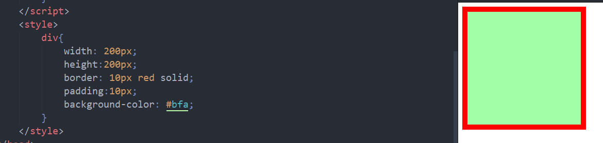
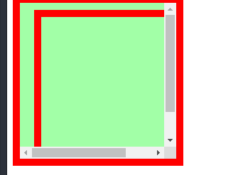

# DOM

# DOM介绍

DOM的含义:Document Object Model,文档对象模型

用于修改网页中的各个内容

- 文档:网页,一个html文档
- 对象:将网页中的每一个标签都转换为一个对象/节点
- 模型:其实就是一棵用于管理标签对象之间的关系的树(DOM树)
- 节点:网页中的标签(html,body,div...text)

常用节点

- 文档节点 （Document），代表整个网页,html文档对象/document
- 元素节点（Element），代表网页中的标签/html标签/body/div/span/text
- 属性节点（Attribute），代表标签中的属性/在文本节点中的属性,value,class,id(都可以直接获取)
- 文本节点（Text），代表网页中的文本内容

节点

定义:html中的各种元素标签,属性,文本均为节点

```js
<p id="myp">一个p标签</p>
```


节点的属性

|          | nodeName  | nodeType | nodeValue         |
| -------- | --------- | -------- | ----------------- |
| 文档节点 | #document | 9        | null              |
| 元素节点 | 标签名    | 1        | null              |
| 属性节点 | 属性名    | 2        | 属性值            |
| 文本节点 | #text     | 3        | 文本内容innerText |

DOM树


例子:

```html
<html>
	<head>
		<title>Sample Page</title>
	</head>
	<body>
		<p>Hello World!</p>
	</body>
</html>
```


> document是html网页文档的唯一DOM对象
>
> ​	可以通过document获取所有的元素节点
>
> html元素为根元素节点

# 事件介绍 

 事件指的是用户和浏览器之间的交互行为。比如：点击按钮、关闭窗口、鼠标移动。。。 
 我们可以为事件来绑定回调函数来响应事件。 

**绑定事件的方式：** 
1.可以在标签的事件属性中设置相应的JS代码 
例子  

```html
<button onclick="alert("讨厌,你点我干嘛");">按钮</button>  
```

为按钮绑定一个单击事件,当事件触发时执行js代码或者绑定的函数

标签属性的JS事件代码产生耦合,使用script的绑定事件函数为回调函数,由系统调用

2.可以通过为对象的指定事件属性设置回调函数的形式来处理事件 
	例子：  

```html
<button id="btn">按钮</button>  
<script>  
    var btn = document.getElementById("btn"); 
	//为按钮绑定一个单击响应函数
    btn.onclick = function(){  
  		alert("你还点...");
    }; 
</script>  
```

**文档的加载** 
浏览器在加载一个页面时，是按照自上向下的顺序加载的，加载一行执行一行。 
如果将js代码编写到页面的上边，当js代码执行时，页面中的DOM对象(html的body标签中的代码)还没有加载, DOM对象树也没有建立
此时将会无法正常获取到DOM对象，导致DOM操作失败。

解决方式一： 
	可以将js代码编写到body的下边 

```javascript  
<body>  
		<button id="btn">按钮</button>  
  
		<script>  
			var btn = document.getElementById("btn");  
			btn.onclick = function(){  
		  
			};  
	</script>  
</body>  
```

 **解决方式二：一般的写法** 
	 将js代码编写到`window.onload = function(){}`中 
	 `window.onload`对应的回调函数会在整个页面加载完毕以后才执行， 
	 所以可以确保代码执行时，DOM对象已经加载完毕了		  

```html
<script>  
    window.onload = function(){  
        var btn = document.getElementById("btn");  
        btn.onclick = function(){  
        };  
    };  
</script>	    
```

例子

```js
window.onload = function(){
        
        /*
         * 点击超链接以后，删除一个员工的信息
         */
        
        //获取所有额超链接
        var allA = document.getElementsByTagName("a");
        
        //为每个超链接都绑定一个单击响应函数
        for(var i=0 ; i < allA.length ; i++){
            /*
             * for循环会在页面加载完成之后立即执行，
             *  而响应函数会在超链接被点击时才执行
             * 当响应函数执行时，for循环早已执行完毕
             */
            
            alert("for循环正在执行"+i);
            
            allA[i].onclick = function(){
                
                alert("响应函数正在执行"+i);
                //i=3;
                //alert(allA[i]); undefined
                //alert(allA[i]==this); false
                
                return false;
            };
            
        }
}
```


文档加载例子

> for循环会在页面加载完成之后立即执行，进行,每一个超链接的事件绑定
>     而响应函数会在超链接被点击时才执行
>     当响应函数执行时，for循环早已执行完毕

# DOM查询

在网页中浏览器已经为我们提供了document对象， 
它代表的是整个网页，它是window对象的属性，也是一个html文档唯一的文档节点,可以在页面中直接使用。 

## document查询

获取元素节点

```js
 根据元素的id属性查询一个元素节点对象:返回一个节点
	 document.getElementById("id属性值");  
 根据元素的name属性值查询一组元素节点对象:返回一个节点数组(表单项,name对应一个value,主要是在后端获取使用)
	 document.getElementsByName("name属性值");  
 根据标签名来查询一组元素节点对象:返回一个节点数组(p,div,span,li)
	 document.getElementsByTagName("标签名");  
```

总的来说就是按id,标签名,name查询节点,多用,没有什么细节问题

getElementByID

```html
<ul id="ul1">
	<li></li>
	<li></li>
</ul>
```

```js
var ul=document.getElementById("ul1");
var li=ul.getElementsByTagName("li");
```

## 获取元素节点的子节点

通过具体的元素节点调用

只有一个方法,其他都是通过属性获取的

```js
元素.getElementByTagName()
//获取当前节点指定标签名的的后代节点
```

属性:**childNodes**

```
 获取当前元素的所有子节点.只获取子级节点,不获取更深的节点
 会获取到空白的文本子节点
```

>  注意：在IE8及以下的浏览器中，不会将空白文本当成子节点, 
>  所以该属性在IE8中会返回4个子元素而其他浏览器是9个

```html
<!DOCTYPE html>
<html>
	<head>
		<meta charset="utf-8">
		<title></title>
		<script>
			window.onload=function(){
				var city=document.getElementById("city");
				var nodes=city.childNodes;
				console.log(nodes.length);//9
				for(let i=0;i<nodes.length;i++)
					document.write(nodes[i].nodeType+nodes[i].nodeName+nodes[i].nodeValue+"<br/>");
				/*
					9
					3#text
					1LInull//bj
					3#text
					1LInull//sh
					3#text
					1LInull//gz
					3#text
					1LInull//sz 
					3#text
					为什么是9个?4个
				childNodes获取包括文本节点在内的所有子节点,只获取一级的子节点,不获取后代节点,第二级及之后的子节点都不获取
				存在5个空的换行,这几个DOM标签间的空白换行也被解析为一个文本标签,尽管不太合理,但是JS是这么设计的
				*/
			}
		</script>
	</head>
	<body>
		<ul id="city">
			<li>北京</li>
			<li>上海</li>
			<li>广州</li>
			<li>深圳</li>
		</ul>
		
		<p id="myp">一个文本标签</p>
	</body>
</html>
```

属性:**children**

```css
元素.children
 获取当前元素的所有子元素,
 注意,子元素=子元素节点,不回包括子文本节点
```

在上面的例子中,如果使用children,则返回四个li节点

属性:**`firstChild`.`lastChild`**

```js
元素.firstChild  
 获取当前元素的第一个子节点，会获取到空白的文本子节点
元素.lastChild  
 获取当前元素的最后一个子节点,也会获取到空白的文本子节点
```

```js
				var city=document.getElementById("city");
				var node=city.firstChild;
				console.log(node.nodeName);//#text
```

属性:`firstElementChild`

```less
firstElementChild获取当前元素的第一个子元素  
firstElementChild不支持IE8及以下的浏览器，  
	如果需要兼容他们尽量不要使用  
```

同样的,还存在`lastElementChild`

用于获取当前元素的最后一个子元素

属性:**parentNode**

```css
元素.parentNode  
 获取当前元素的父元素(不会获取到其他奇怪的东西) 
```

属性:**previousSibling**

```js
元素.previousSibling  
 获取当前元素的前一个兄弟节点(会获取到空白的文本节点)
```

还拿上面的例子说明

```html
	<body>
		<ul id="city">
			<li>北京</li>
			<li>上海</li>
			<li>广州</li>
			<li>深圳</li>
		</ul>
		
		<p id="myp">一个文本标签</p>
	</body>
```

```js
				var city=document.getElementById("city");
				var node=city.previousSibling;
				console.log(node);
                /*
                node:
                #text
				data: "\n\t\t",说明是一段换行和缩进的空白文本节点
                */
```

属性:**previousElementSibling**

```
元素.previousElementSibling
获取前一个兄弟元素，IE8及以下不支持  
```

```css
				var city=document.getElementById("city");
				var node=city.previousElementSibling;
				console.log(node);//null
```

属性:**nextSibling**

```less
元素.nextSibling  
 获取当前元素的后一个兄弟节点(会获取空白的文本节点)
```

属性:**innerHTML和innerText**

两个属性作用类似，都可以获取到标签内部的内容， 
不同是innerHTML会获取到html标签，而innerText会自动去除标签 
如果使用这两个属性来设置标签内部的内容时，没有任何区别

获取标签中的内容:

1) 使用nodeValue获取:

```
<h1>h1中的文本内容</h1>  
```

想要获取h1内部的文本内容

```js
				var h1=document.getElementsByTagName("h1")[0];
				console.log(p.nodeValue);
				//元素节点的nodeValue是null,输出null
				//我们可以通过获取p的第一个文本节点来获取其nodeValue,文本节点的nodeValue为文本内容
				var text=document.getElementsByTagName("h1")[0].firstChild;
				console.log(text.nodeValue);
```

2) 使用innerText获取

```js
				var h1=document.getElementsByTagName("h1")[0];
				console.log(h1.innerText);
				//输出h1中的文本内容
```

## document对象的属性和方法

**document.all** 

 获取页面中的所有元素，相当于`document.getElementsByTagName("*");  `

获取元素,不获取文本节点(不常用)

**document.documentElement** 

```
 获取页面中html根元素  
```

**document.body** 

```
 获取页面中的body元素  
```

**document.getElementsByClassName()** 

```js
 根据元素的class属性值查询一组元素节点对象 
 支持:这个方法不支持IE8及以下的浏览器  
```

**document.querySelector()** 

```
 根据CSS选择器去页面中查询一个元素 
 如果匹配到的元素有多个，则它会返回查询到的第一个元素	  
```

**document.querySelectorAll()** 

```
 根据CSS选择器去页面中查询一组元素  
 会将匹配到所有元素封装到一个数组中返回，即使只匹配到一个  
```

测试:

```js
				var ul=document.querySelector("ul");
				console.log(ul);
				var li=document.querySelectorAll("ul>li");
				console.log(li);
```

输出:


# DOM修改

**document.createElement("TagName")** 

```
可以用于创建一个元素节点对象， 
它需要一个标签名作为参数，将会根据该标签名创建元素节点对象， 
并将创建好的对象作为返回值返回 
```

例子

```
document.createElement("p")
```

**document.createTextNode("textContent")** 

```
可以根据文本内容创建一个文本节点对象
```

例子

```
document.createTextNode("This is textNode.")
```

**父节点.appendChild(子节点)** 
向父节点的尾部添加指定的子节点 

```html
	<body>
		<ul id="city">
			<li>北京</li>
			<li>上海</li>
			<li>广州</li>
			<li>深圳</li>
		</ul>
	</body>
```

```js
				var ul=document.querySelector("ul");
				console.log(ul);
				var li=document.createElement("li");
				li.innerText="南通";
				ul.appendChild(li);
```


**父节点.insertBefore(新节点,旧节点)** 
将一个新的节点插入到旧节点的前边 

```js
				var ul=document.querySelector("ul");
				console.log(ul);
				var li_insert=document.createElement("li");
				li_insert.innerText="南通";
				
				var liIndex=ul.children[3];//深圳
				//将南通插入到深圳前面
				ul.insertBefore(li_insert,liIndex);
```

**父节点.replaceChild(新节点,旧节点)** 
使用一个新的节点去替换旧节点 

```js
				var ul=document.querySelector("ul");
				console.log(ul);
				var li_insert=document.createElement("li");
				li_insert.innerText="南通";
				
				var liIndex=ul.children[3];//深圳
				//将南通替换深圳
				ul.replaceChild(li_insert,liIndex);
```

**父节点.removeChild(子节点)** 
删除指定的子节点 
推荐方式：**子节点.parentNode.removeChild(子节点)** 

> 删除子节点可以不用特意获取父节点来删除,自身删除

> **以上方法，在底层就是改变了相应元素（标签）的innerHTML的值。**  
>
> 其实说白了就是改变html代码

# DOM操作CSS

## 读取和修改内联样式  

使用style属性来操作元素的内联样式 

读取内联样式:

```
语法：元素.style.样式名 
```

```
	元素.style.width 
	元素.style.height 
	注意：**如果样式名中带有-，则需要将样式名修改为驼峰命名法将-去掉，然后后的字母改大写** 
	比如：background-color > backgroundColor 
	border-width > borderWidth  
```

```html
<div id="div1" style="width:200px;height:200px;background-color: #bfa;"></div>
```

```js
			window.onload=function(){
				var div=document.getElementById("div1");
				div.onclick=function(){
					div.style.width="100px";
                    div.style.backgroundColor="black";
				}
			}
```

修改内联样式:

```
语法：元素.style.样式名 = 样式值 
```

通过style修改和读取的样式都是内联样式，由于内联样式的优先级比较高， 
所以我们通过JS来修改的样式，往往会立即生效， 
但是如果样式中设置了`!important`，则内联样式将不会生效。  (一般也不设置)

> 但是如果想要读取head的样式表或者外联样式表都不行
>
> 只能获取写在标签中的内联样式

## 获取元素样式

①获取当前(正在显示)的样式

```js
元素.currentStyle.样式名
```

读取当前元素正在显示的样式,如果当前元素没有设置,则获取其默认值

> 兼容性:只有IE支持,比较涝

②getComputedStyle(arg1,arg2)

window对象的方法，可以返回一个对象，这个对象中保存着当前元素生效样式

```
window.getComputedStyle(arg1,arg2);
getComputedStyle(arg1,arg2);
```

参数列

```
1.要获取样式的元素 
2.可以传递一个伪元素，一般传null(":hover",":after")
```

返回

```js
该方法返回一个封装了当前css元素对应的样式map
//获取width属性
getComputedStyle(arg1,arg2).width;
getComputedStyle(arg1,arg2)["width"];
//获取的属性的值都是经过计算的
//获取的属没有经过设置,不会获取默认值,而是会获取一个真实的经过计算的值
```

 通过该方法读取到样式都是只读的不能修改

> 兼容性:
>
> IE9+,和其他的所有浏览器

③兼容:组合写一个函数进行兼容

```js
/*  
* 定义一个函数，用来获取指定元素的当前的样式  
* 参数：  
* 		obj 要获取样式的元素  
* 		name 要获取的样式名  
*/  
function getStyle(obj , name){  
//一个机制
//对象.属性不存在，不会报错，返回undefined(但是属性找不到不会报错)
//如果直接寻找对象，（当前作用域到全局作用域）找不到会报错(对象找不到报错) 
    if(window.getComputedStyle){
        //直接在全局作用域中找,找不到不报错
        //返回一个undefined,转换为false
        //正常浏览器的方式，具有getComputedStyle()方法  
        return getComputedStyle(obj , null)[name];  
    }else{  
        //IE8的方式，没有getComputedStyle()方法  
        return obj.currentStyle[name];  
    }  
    //return window.getComputedStyle?getComputedStyle(obj , null)[name]:obj.currentStyle[name];			  
}  
```

或者写成

```js
function getStyle(obj , name){  
	return window.getComputedStyle?getComputedStyle(obj , null)[name]:obj.currentStyle[name];
}
```

## 其他样式属性

注意：以下样式都是只读的,未指明偏移量都是相对于当前窗口左上角



```
clientHeight 
元素的可见高度，包括元素的内容区和内边距的高度

clientWidth 
 元素的可见宽度，包括元素的内容区和内边距的宽度 

offsetHeight 
 整个元素的高度，包括内容区、内边距、边框

offfsetWidth 
 整个元素的宽度，包括内容区、内边距、边框
```

```js
			window.onload=function(){
				var div=document.getElementsByTagName("div")[0];
				console.log(div.clientHeight);//220px
				console.log(div.clientWidth);//220px
				console.log(div.clientTop);//10px
				console.log(div.offsetHeight);//240px=200+20+20
				console.log(div.offsetWidth);//240px=200+20+20	
			}
```

**offsetParent** 

返回元素的偏移容器

当前元素的定位父元素 
离他最近的开启了定位的<u>祖先元素</u>，如果所有的元素都没有开启定位，则返回body

```
		<div id="box1">
			<div id="box2"></div>
		</div>
		==========================
		div{
				width: 200px;
				height:200px;
				border: 10px red solid;
				padding:10px;
				background-color: #bfa;
			}
			#box1{
				position: relative;
				overflow: hidden;
			}
			#box2{
				position: absolute;
				top:10px;
				left:20px;
			}
		==========================
```

```js
		window.onload=function(){
			var div=document.getElementById("box2");
			console.log(div.offsetParent.id);//box1
		}
```

**offsetLeft&offsetTop**

当前元素和定位父元素之间的偏移量 
offsetLeft水平偏移量 
offsetTop垂直偏移量

借用上面的例子

```js
			window.onload=function(){
				var div=document.getElementById("box2");
				console.log(div.offsetParent.id);//box1
				console.log(div.offsetLeft);//20
				console.log(div.offsetTop);//10
			}
```

**scrollHeight&scrollWidth** 
获取元素滚动区域的高度和宽度

将上面例子中box1的overflow改成scroll



```
			window.onload=function(){
				var div=document.getElementById("box1");
				console.log(div.scrollHeight);//250=200+20+20+10
				console.log(div.scrollWidth);//260=200+20+20+20
			}
```

**scrollTop&scrollLeft** 
获取元素垂直和水平滚动条滚动的距离

```html
<button id="b1">输出滚动距离</button>
```

```js
				var div=document.getElementById("box1");
				//DOM加载完后,初始滑动的距离是0
				console.log(div.clientheight);//203
				console.log("=====In window.onload=====");
				console.log(div.scrollTop);//0
				console.log(div.scrollLeft);//0
				
				var b1=document.getElementById("b1");
				b1.onclick=function(){
					console.log("=====In b1.onclick=====");
					console.log(div.scrollTop);//47
					console.log(div.scrollLeft);//57
				}
```

恒等式
$$
初始:clientHeight+scrollTop=clientHeight(scrollTop=0)
$$

$$
初始:clientWidth+scrollLeft=clientWidth(scrollLeft=0)
$$

$$
终止:clientHeight+scrollTop=scrollHeight(scrollTop=250-(220-17)=47)
$$

$$
终止:clientWidth+scrollLeft=scrollWidth(scrollLeft=260-(220-17)=57)
$$


为什么clientHeight是203? 原来的clientHeight是220

> 因为滚动条的高度被减去,滚动的高度应该是220-203=17px
>
> 同理:我们可以得到clientWidth的值=220-17=203

应用:判断滚动条是否滚动到底 

```
 垂直滚动条 
	scrollHeight -scrollTop = clientHeight
 水平滚动	 
	scrollWidth -scrollLeft = clientWidth	  
```

用户注册实例

```html
<!DOCTYPE html>
<html>
	<head>
		<meta charset="utf-8">
		<title></title>
		<script>
			window.onload=function(){
				var p=document.getElementById("content");
				p.onscroll=function(){
					// 绑定滚动事件
					var check=document.getElementsByTagName("input")[0];
					if(p.clientHeight+p.scrollTop==p.scrollHeight){
						//disabled可以设置一个元素是否禁用
						//true,禁用;false,可用
						check.disabled=false;
					}else{
						check.disabled=true;
					}
				}
				
			}
		</script>
		<style>
			#content{
				height: 500px;
				width: 200px;
				overflow: scroll;
				background-color: #bfa;
			}
		</style>
	</head>
	<body>
		<p id="content">
			JavaScript（简称“JS”） 是一种具有函数优先的轻量级，解释型或即时编译型的编程语言。虽然它是作为开发Web页面的脚本语言而出名，但是它也被用到了很多非浏览器环境中，JavaScript 基于原型编程、多范式的动态脚本语言，并且支持面向对象、命令式、声明式、函数式编程范式。 [1] 
			JavaScript在1995年由Netscape公司的Brendan Eich，在网景导航者浏览器上首次设计实现而成。因为Netscape与Sun合作，Netscape管理层希望它外观看起来像Java，因此取名为JavaScript。但实际上它的语法风格与Self及Scheme较为接近。 [2] 
			JavaScript的标准是ECMAScript 。截至 2012 年，所有浏览器都完整的支持ECMAScript 5.1，旧版本的浏览器至少支持ECMAScript 3 标准。2015年6月17日，ECMA国际组织发布了ECMAScript的第六版，该版本正式名称为 ECMAScript 2015，但通常被称为ECMAScript 6 或者ES2015。 [1] 
		</p>
		<input type="checkbox" name="checkForLogin" disabled="disabled">我已阅读
	</body>
</html>
```

