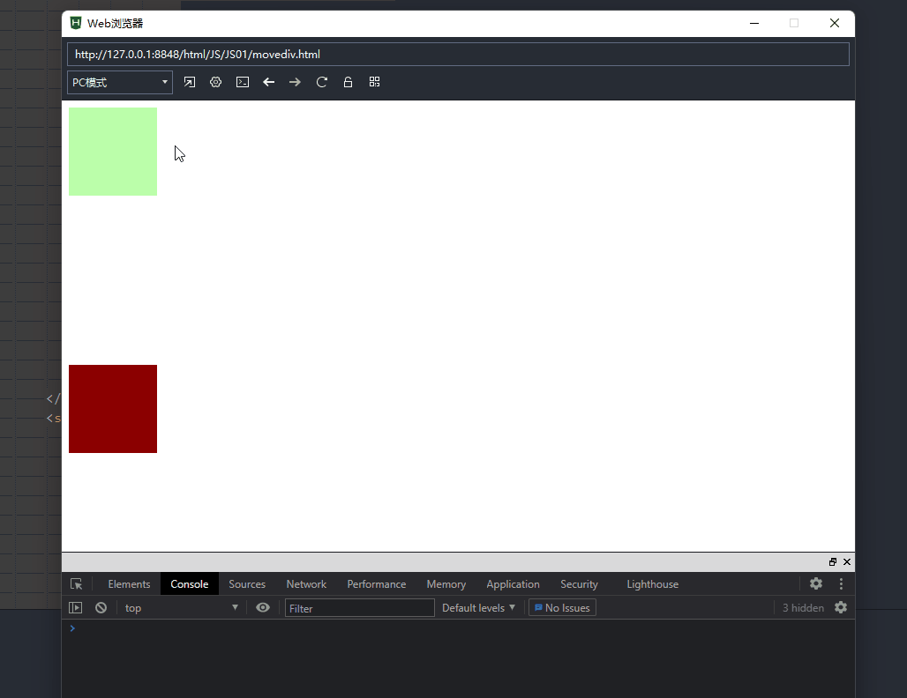

# 事件（Event）  

## 事件对象  

当响应函数被调用时，浏览器每次都会将一个事件对象作为实参传递进响应函数中，这个事件对象中封装了当前事件的相关信息，比如：鼠标的坐标，键盘的按键，鼠标的按键，滚轮的方向...

可以在响应函数中定义一个形参，来使用事件对象，但是在IE8以下浏览器中事件对象没有做完实参传递，而是作为window对象的属性保存  

例子：  

```javascript  
元素.事件 = function(event){//定义形参是为了接受,不定义也会传递实参
    event = event || window.event;  
    //mouseEvent
};  

```

> 兼容性:IE8
>
> IE8中,响应函数触发时,浏览器不传递事件对象
>
> 事件对象作为window对象的全局属性存储
>
> firefox中不将事件对象作为window对象的全局属性存储
>
> 所以需要做兼容处理

**获取到鼠标的坐标** 

clientX和clientY 
用于获取鼠标在当前的可见窗口的坐标(不可见的上方滚动区域不计算)

pageX和pageY 

可以获取鼠标相对于当前页面的坐标 

> 但是这个两个属性在IE8中不支持，所以如果需要兼容IE8，则不要使用 

```
var left = event.clientX; 
var　top = event.clientY;  
```

 应用:div跟随鼠标移动

```html
<!DOCTYPE html>
<html>
	<head>
		<meta charset="utf-8">
		<title></title>
		<script>
			window.onload=function(){
				var div=document.getElementsByTagName("div")[0];
				document.onmousemove=function(arg1){
                    //必须要加上px的后缀,否则无效
					div.style.left=arg1.pageX+"px";
					div.style.top=arg1.pageY+"px";
				}
			}
		</script>
		<style>
			div{
				width:100px;
				height: 100px;
				background-color: #bfa;
				position: absolute;
			}
		</style>
	</head>
	<body style="height: 1000px;">
		<div></div>
	</body>
</html>
```

 ## 事件的冒泡（Bubble）  

事件的冒泡指的是事件的向上(父级元素)传导，当后代元素上的事件被触发时，将会导致其祖先元素上的同类事件也会触发。 

传到document/html标签为止

> a和a的后代b都绑定了一个事件的时候,当a的后代b的事件触发,则a的事件也触发

例:冒泡

```html
	<body>
		<div style="height: 200px;width: 200px;background-color: #bfa;">
			这是一个div
			<span style="background-color: yellow;">span</span>
		</div>
	</body>
```

```html
		<script>
			window.onload=function(){
				var div=document.getElementsByTagName("div")[0];
				var span=document.getElementsByTagName("span")[0];
				
				span.onclick=function(){alert("span")};
				div.onclick=function(){alert("div")};
				document.body.onclick=function(){alert("body")};
				
			}
		</script>
```

事件的冒泡大部分情况下都是有益的

例子:有益

```html
<!DOCTYPE html>
<html>
	<head>
		<meta charset="utf-8">
		<title></title>
		<script>
			window.onload=function(){
				var div=document.getElementsByTagName("div")[1];
				document.onmousemove=function(arg1){
					div.style.left=arg1.pageX+"px";
					div.style.top=arg1.pageY+"px";
				}
			}
		</script>
		<style>
			div{
				width:100px;
				height: 100px;
				background-color: #bfa;
				position: absolute;
			}
		</style>
	</head>
	<body style="height: 1000px;">
		<div style="height:500px;width:500px;background-color: red;" ></div>
		<div></div>
	</body>
</html>
```

> 在div0中移动鼠标,div0的onmousemove将事件传递给body,这样body响应函数,让div1移动
>
> 如果不冒泡,则div1则只能在div0外面的body中移动

如果需要取消冒泡，则需要使用事件对象来取消 ,**可以将事件对象的cancelBubble设置为true，即可取消冒泡** 

例： 取消冒泡

```javascript  
元素.事件 = function(event){  
    event = event || window.event;  
    event.cancelBubble = true;  
};  
```

## 事件的委派

指将事件统一绑定给元素的共同的祖先元素，这样当后代元素上的事件触发时，会一直冒泡到祖先元素，从而通过祖先元素的响应函数来处理事件。  

事件委派是利用了冒泡，通过委派可以减少事件绑定的次数，提高程序的性能

```html
<!DOCTYPE html>
<html>
	<head>
		<meta charset="utf-8">
		<title></title>
		<script>
			window.onload=function(){
				var ul=document.getElementsByTagName("ul")[0];
				var Alla=document.querySelectorAll("ul>li>a");
				
				// 添加连接
				var add=document.getElementById("add");
				add.onclick=function(){
					var insert=document.createElement("li");
					insert.innerHTML="<a href='javascript:;'>new href</a>";
					ul.appendChild(insert);
					// 添加的链接点击后无效,因为没有绑定
					//可以将事件统一安排给ul,后代的事件触发时,会冒泡给ul处理
					//称为事件委派,事件委派的原理就是事件的向上传导
				}
				/**
				 * 只能获取已经有的链接,并为这些链接添加一个事件函数
				 */
				for(let i=0;i<Alla.length;i++){
					Alla[i].onclick=function(){
						alert("href");
					}
				}
				
				ul.onclick=function(){
					alert("ul:href");
				}
			}
		</script>
	</head>
	<body>
		<button id="add">添加一个新链接</button>
		<ul>
			<li><a href="javascript:;">href</a></li>
			<li><a href="javascript:;">href</a></li>
			<li><a href="javascript:;">href</a></li>
		</ul>
	</body>
</html>
```

我们希望，只绑定一次事件，即可应用到多个的元素上，即使元素是后添加的,我们可以尝试将其绑定给元素的共同的祖先元素

**target** : event中的target表示的触发事件的对象

```html
<!DOCTYPE html>
<html>
	<head>
		<meta charset="utf-8">
		<title></title>
		<script>
			window.onload=function(){
				var ul=document.getElementsByTagName("ul")[0];
				var Alla=document.querySelectorAll("ul>li>a");
				
				// 添加连接
				var add=document.getElementById("add");
				add.onclick=function(){
					var insert=document.createElement("li");
					insert.innerHTML="<a href='javascript:;'>new href</a>";
					ul.appendChild(insert);
					// 添加的链接点击后无效,因为没有绑定
					//可以将事件统一安排给ul,后代的事件触发时,会冒泡给ul处理
					//称为事件委派,事件委派的原理就是事件的向上传导
				}
				/**
				 * 只能获取已经有的链接,并为这些链接添加一个事件函数
				 */
				// for(let i=0;i<Alla.length;i++){
				// 	Alla[i].onclick=function(){
				// 		alert("href");
				// 	}
				// }
				
				ul.onclick=function(event){
					//this,事件给谁绑定的,则是谁(事件绑定对象)
					//event.target表示事件触发对象
					if(event.target.href)
						alert("ul:href");
					//进行判断筛选
					
				}
			}
		</script>
	</head>
	<body>
		<button id="add">添加一个新链接</button>
		<ul>
			<li><p>123</p></li>
			<li><a href="javascript:;">href</a></li>
			<li><a href="javascript:;">href</a></li>
			<li><a href="javascript:;">href</a></li>
		</ul>
	</body>
</html>
```

## 事件的绑定

**`对象.事件=函数`绑定响应函数**

只能同时为一个元素绑定一个响应函数,不能绑定多个(绑定多个时,后面的覆盖前面的)

**addEventListener()** 
通过这个方法也可以为元素绑定响应函数 

```
参数： 
	1.事件的字符串，不要on(例如，使用 "click" 来取代 "onclick"。) 
	2.回调函数，当事件触发时该函数会被调用 
	3.useCapture是否在捕获阶段触发事件，需要一个布尔值，一般都传false
		可选。布尔值，指定事件在捕获或冒泡阶段执行。
        可能值：
        true - 事件句柄在捕获阶段执行
        false- 默认。事件句柄在冒泡阶段执行
```

作用:使用addEventListener()可以同时为一个元素的相同事件同时绑定多个响应函数， 
这样当事件被触发时，响应函数将会按照函数的绑定顺序执行

> 兼容性:这个方法不支持IE8及以下的浏览器  

```javascript  
btn01.addEventListener("click",function(){  
	alert(1);  
},false);  
  
btn01.addEventListener("click",function(){  
	alert(2);  
},false);					  
```

**attachEvent()**  

> 兼容性:在IE8及以下可以使用attachEvent()来绑定事件 

```
参数： 
	1.事件的字符串，要on 
	2.回调函数  
```

这个方法也可以同时为一个事件绑定多个处理函数， 
不同的是它是后绑定的回调函数先执行，执行顺序和addEventListener()相反  

```javascript  
btn01.attachEvent("onclick",function(){
    //attachEvent()中的this，是window
	alert(1);  
});  
  
btn01.attachEvent("onclick",function(){  
	alert(2);  
});	  
//alert顺序:2,1
```

```javascript  
//定义一个函数，用来为指定元素绑定响应函数  
/*  
 * addEventListener()中的this，是绑定事件的对象  
 * attachEvent()中的this，是window  
 *  需要统一两个方法this  
 */  
/*  
 * 参数：  
 * 	obj 要绑定事件的对象  
 * 	eventStr 事件的字符串(不要on)  
 *  callback 回调函数  
 */  
function bind(obj , eventStr , callback){  
    if(obj.addEventListener){  
        //大部分浏览器兼容的方式  
        obj.addEventListener(eventStr , callback , false);  
    }else{  
        /*  
		 * this是谁由调用方式决定  
		 * callback.call(obj)  
		 */  
        //IE8及以下  
        obj.attachEvent("on"+eventStr , function(){  
            //在匿名函数中调用回调函数
            callback.call(obj);
        });   
    }  
}  
```

## 事件的传播

例子:

```html
<!DOCTYPE html>
<html>
	<head>
		<meta charset="utf-8">
		<title></title>
		<style>
			#box1{
				width: 300px;
				height: 300px;
				background-color: #bfa;
			}
			#box2{
				width: 200px;
				height: 200px;
				background-color: navajowhite;
			}
			#box3{
				width: 100px;
				height: 100px;
				background-color: darkred;
			}
		</style>
	</head>
	<body>
		<div id="box1">
			<div id="box2">
				<div id="box3"></div>
			</div>
		</div>
	</body>
</html>
```

 

添加事件

```js
			#box1{
				width: 300px;
				height: 300px;
				background-color: #bfa;
			}
			#box2{
				width: 200px;
				height: 200px;
				background-color: navajowhite;
			}
			#box3{
				width: 100px;
				height: 100px;
				background-color: darkred;
			}
```

关于事件的传播网景公司和微软公司有不同的理解 

- 微软公司认为事件应该是由内向外传播，
  - 也就是当事件触发时，应该先触发当前元素上的事件， 然后再向当前元素的祖先元素上传播，也就说事件应该在冒泡阶段执行。
  - 在box3中点击,事件从box3传播到box1(box3->box2->box1)

- 网景公司认为事件应该是由外向内传播的，
  - 也就是当前事件触发时，应该先触发当前元素的最外层的祖先元素的事件，然后在向内传播给后代元素
  - 在box3中点击,事件从box1传播到box3(box1->box2->box3)

 W3C综合了两个公司的方案，将事件传播分成了**三个阶段**

```
	1.捕获阶段 
		 在捕获阶段时从最外层的祖先元素(window)，向目标元素(触发事件的元素)进行事件的捕获，但是默认此时不会触发事件 
	2.目标阶段 
		 事件捕获到目标元素，捕获结束开始在目标元素上触发事件 
	3.冒泡阶段 
		 事件从目标元素向他的祖先元素传递，依次触发祖先元素上的事件  
```

如果希望在捕获阶段就触发事件，可以将addEventListener()的第三个参数设置为true 
一般情况下我们不会希望在捕获阶段触发事件，所以这个参数一般都是false 

```js
				box1.addEventListener("click",function(){
					alert("box1");
				},true);
				box2.addEventListener("click",function(){
					alert("box2");
				},true);
				box3.addEventListener("click",function(){
					alert("box3");
				},true);
				//在box3中点击,事件从box1传播到box3(box1->box2->box3)
```


> 兼容性:IE8及以下的浏览器中没有捕获阶段(即只有触发+冒泡)

## 常用事件

### 鼠标事件  

- onmousedown
- onmousemove
- onmouseup

应用:拖拽事件  

```html
<!DOCTYPE html>
<html>
	<head>
		<meta charset="utf-8">
		<title></title>
		<style>
			#drag{
				width: 100px;
				height: 100px;
				background-color: #bfa;
				position: absolute;
			}
			#fix{
				width: 100px;
				height: 100px;
				background-color: yellow;
				position: absolute;
				top:300px;
				left:300px;
			}
		</style>
		<script>
			window.onload=function(){
				
				
				/*  
				 * 拖拽box1元素  
				 *  - 拖拽的流程  
				 * 		1.当鼠标在被拖拽元素上按下时，开始拖拽  onmousedown  
				 * 		2.当鼠标移动时被拖拽元素跟随鼠标移动 onmousemove  
				 * 		3.当鼠标松开时，被拖拽元素固定在当前位置	onmouseup  
				 */  
				
				var drag=document.getElementById("drag");
				
				
				drag.onmousedown=function(e){
					
					/*  
					 * setCapture()  
					 *  - 将鼠标点击相关的事件捕获到自己身上,
					 * 		当鼠标点击时,捕获对象触发对象以及冒泡都是由开启捕获的
					 * 
					 * 
					 * 	- 兼容性:只有IE支持，但是在火狐中调用时不会报错，  
					 * 		而如果使用chrome调用，会报错  
					 */  
					/*if(box1.setCapture){  
									box1.setCapture();  
								}*/  
					drag.setCapture && drag.setCapture();  
					
					//在drag被按下的时候触发mousemove,
					//mousemove触发的对象时document
					
					//在点击时,div的应当偏移量已经确定
					//div的偏移量 鼠标.clentX - 元素.offsetLeft  
					//div的偏移量 鼠标.clentY - 元素.offsetTop  
					var ed_x=e.clientX-drag.offsetLeft;
					var ed_y=e.clientY-drag.offsetTop;
					
					document.onmousemove=function(e){
						var mx=e.clientX;
						var my=e.clientY;
						
						drag.style.left=(mx-ed_x)+"px";
						drag.style.top=(my-ed_y)+"px";
						
						
					}
					//原来是给drag绑定的,为什么改成document
					document.onmouseup=function(e){
						document.onmousemove=null;
						/**
						 * drag.onmouseup
						 * 当加入一个fix时,这个覆盖drag,当drag移动到fix时
						 * 触发fix的mousemove.向上传递给document
						 * 但是阻断了mouseup的向上传递,所以mouseup绑定给document
						 */
						// 此时只取消了mousemove,但是mouseup任然绑定着,所以需要取消
						document.onmouseup=null;
						//此时称这个事件为一刚如一次性事件,用于拖拽的收尾
						//up时move和up都需要取消
						
						//当鼠标松开时，取消对事件的捕获  
						drag.releaseCapture && drag.releaseCapture();  
					}
					/*  
					* 当我们拖拽一个网页中的内容时，浏览器会默认去搜索引擎中搜索内容，  
					* 	此时会导致拖拽功能的异常，这个是浏览器提供的默认行为，  
					* 	如果不希望发生这个行为，则可以通过return false来取消默认行为  
					*   
					* 但是这招对IE8不起作用  
					*/  
				   return false;
				}
			}
		</script>
	</head>
	<body>
		<span>一段文字</span>
		<div id=drag></div>
		
		<div id="fix"></div>
	</body>
</html>  
```

  

### 滚轮事件

- onwheel

```html	  
<!DOCTYPE html>
<html>
	<head>
		<meta charset="utf-8">
		<title></title>
		<style>
			div{
				width: 100px;
				height: 100px;
				background-color: #bfa;
			}
		</style>
		<script>
			window.onload=function(){
				var div=document.getElementsByTagName("div")[0];
				
				/**
				 * 鼠标滚轮滚动的事件，会在滚轮滚动时触发， 
				 * onmousewheel
				 * onwheel
				 * 
				 * 在火狐中需要使用 DOMMouseScroll 来绑定滚动事件  
				 * 注意该事件需要通过addEventListener()函数来绑定
				 */
				div.onwheel=function(e){
					// alert("滚动");
					
					/**
					 * 上滚-66
					 * 下滚66
					 * 这个值的大小无所谓
					 */
					div.innerText=e.deltaY;
					if(e.deltaY>0){
						div.style.height=(div.clientHeight+10)+"px";
					}else if(e.deltaY<0){
						div.style.height=(div.clientHeight-10)+"px";
					}
					
					
					/*  
					 * 使用addEventListener()方法绑定响应函数，取消默认行为时不能使用return false  
					 * 需要使用event来取消默认行为event.preventDefault();  
					 * 但是IE8不支持event.preventDefault();这个玩意，如果直接调用会报错  
					 */  
					// 当e的属性preventDefault存在的时候触发
					e.preventDefault && e.preventDefault();  
					
					
					/*  
					 * 当滚轮滚动时，如果浏览器有滚动条，滚动条会随之滚动，  
					 * 这是浏览器的默认行为，如果不希望发生，则可以取消默认行为  
					 */  
					return false;
				}
			}
		</script>
	</head>
	<body style="height: 2000px;">
		<div></div>
	</body>
</html>
  
```

### 键盘事件  

键盘事件： 

- onkeydown 
  按键被按下 
  - 对于onkeydown来说如果一直按着某个按键不松手，则事件会一直触发 
    当onkeydown连续触发时，第一次和第二次之间会间隔稍微长一点，其他的会非常的快，这种设计是为了**防止误操作**的发生。 

- onkeypress
  某个键盘按键被按下并松开。
- onkeyup 
   按键被松开  
  - 这个不会连续触发,是一次性的触发事件

键盘事件一般都会绑定给一些可以获取到焦点的标签或者对象

> 注意:div不能绑定键盘事件
>
> 主要是表单项和document

**事件属性:**

- keyCode([keyCode 事件属性 | 菜鸟教程 (runoob.com)](https://www.runoob.com/jsref/event-key-keycode.html))
  - 可以通过keyCode来获取按键的编码 
    通过它可以判断哪个按键被按下

- 除了keyCode，事件对象中还提供了几个属性 

```
altKey 
ctrlKey 
shiftKey 
这个三个用来判断alt ctrl 和 shift是否被按下 
如果按下则返回true，否则返回false  
```

测试

```javascript  
//console.log(event.keyCode);  
  
//判断一个y是否被按下  
//判断y和ctrl是否同时被按下  
if(event.keyCode === 89 && event.ctrlKey){  
	console.log("ctrl和y都被按下了");  
}  
```

```javascript  
input.onkeydown = function(event) {  
    event = event || window.event;  
    //数字 48 - 57  
    //使文本框中不能输入数字  
    if(event.keyCode >= 48 && event.keyCode <= 57) {  
        //在文本框中输入内容，属于onkeydown的默认行为  
        //如果在onkeydown中取消了默认行为，则输入的内容，不会出现在文本框中  
        return false;  
    }  
};  
  
```

例子:键盘控制两个div移动

```html
<!DOCTYPE html>
<html>
	<head>
		<meta charset="utf-8">
		<title></title>
		<script>
			window.onload=function(){
				var move=document.getElementById("move");
				var move2=document.getElementById("move2");
				// console.log(move.offsetTop);
				move.onclick=function(){
					console.log("onclick-move");
					document.onkeydown=function(e){
						console.log(e.keyCode);
						//right39 left37 up38 down40
						if(e.keyCode===39){
							move.style.left=(move.offsetLeft+1)+"px";
						}else if(e.keyCode===37){
							if(move.offsetLeft-1>=0)
								move.style.left=(move.offsetLeft-1)+"px";
						}else if(e.keyCode===38){
							if(move.offsetTop-1>=0)
							move.style.top=(move.offsetTop-1)+"px";
						}else if(e.keyCode===40){
							move.style.top=(move.offsetTop+1)+"px";
						}
					}
					// document.onkeydown=null;
				}
				move2.onclick=function(){
					console.log("onclick-move2");
					// document.onkeydown=null;
					document.onkeydown=function(e){
						
						console.log(e.keyCode);
						//right39 left37 up38 down40
						if(e.keyCode===39){
							move2.style.left=(move2.offsetLeft+1)+"px";
						}else if(e.keyCode===37){
							if(move2.offsetLeft-1>=0)
								move2.style.left=(move2.offsetLeft-1)+"px";
						}else if(e.keyCode===38){
							if(move2.offsetTop-1>=0)
							move2.style.top=(move2.offsetTop-1)+"px";
						}else if(e.keyCode===40){
							move2.style.top=(move2.offsetTop+1)+"px";
						}
					}
					// document.onkeydown=null;
				}
				
				// document.onkeydown=null;
			}
		</script>
		<style>
			#move{
				width: 100px;
				height: 100px;
				background-color: #bfa;
				position: absolute;
			}
			#move2{
				width: 100px;
				height: 100px;
				background-color: darkred;
				position: absolute;
				top:300px;
			}
		</style>
	</head>
	<body>
		<div id="move"></div>
		<div id="move2"></div>
	</body>
</html>
```

