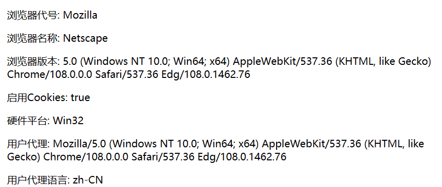

# BOM

浏览器对象模型(browser object model)  

BOM可以使我们通过JS来操作浏览器 
在BOM中为我们提供了一组对象，用来完成对浏览器的操作 

**BOM对象**  

- Window 
  代表的是整个浏览器的窗口，同时window也是网页中的全局对象  
- Navigator 
  代表的当前浏览器的信息，通过该对象可以来识别不同的浏览器  
- Location 
  代表当前浏览器的地址栏信息，通过Location可以获取地址栏信息，或者操作浏览器跳转页面  
- History 
  代表浏览器的历史记录，可以通过该对象来操作浏览器的历史记录 
   	由于隐私原因，该对象不能获取到具体的历史记录，只能操作浏览器向前或向后翻页 
   	而且该操作只在当次访问时有效  
- Screen 
  代表用户的屏幕的信息，通过该对象可以获取到用户的显示器的相关的信息  

> 使用:这些BOM对象在浏览器中都是作为window对象的属性保存的， 
> 可以通过window对象来使用，也可以直接使用  

## Navigator

 代表的当前浏览器的信息，通过该对象可以来识别不同的浏览器 
 由于历史原因，Navigator对象中的大部分属性都已经不能帮助我们识别浏览器了 

一般我们只会使用userAgent来判断浏览器的信息， 
userAgent是一个字符串，这个字符串中包含有用来描述浏览器信息的内容， 
不同的浏览器会有不同的userAgent  

```
Mozilla/5.0 (Windows NT 6.2; WOW64) AppleWebKit/537.36 (KHTML, like Gecko) Chrome/90.0.4430.212 Safari/537.36 HBuilderX
```

```less
火狐的userAgent 
Mozilla5.0 (Windows NT 6.1; WOW64; rv:50.0) Gecko20100101 Firefox50.0  
//firefox

Chrome的userAgent 
Mozilla5.0 (Windows NT 6.1; Win64; x64) AppleWebKit537.36 (KHTML, like Gecko) Chrome52.0.2743.82 Safari537.36  
//Chrome

IE8 
Mozilla4.0 (compatible; MSIE 8.0; Windows NT 6.1; WOW64; Trident7.0; SLCC2; .NET CLR 2.0.50727; .NET CLR 3.5.30729; .NET CLR 3.0.30729; Media Center PC 6.0; .NET4.0C; .NET4.0E)  
//msie

IE9 
Mozilla5.0 (compatible; MSIE 9.0; Windows NT 6.1; WOW64; Trident7.0; SLCC2; .NET CLR 2.0.50727; .NET CLR 3.5.30729; .NET CLR 3.0.30729; Media Center PC 6.0; .NET4.0C; .NET4.0E)  

IE10 
Mozilla5.0 (compatible; MSIE 10.0; Windows NT 6.1; WOW64; Trident7.0; SLCC2; .NET CLR 2.0.50727; .NET CLR 3.5.30729; .NET CLR 3.0.30729; Media Center PC 6.0; .NET4.0C; .NET4.0E)  

IE11 
Mozilla5.0 (Windows NT 6.1; WOW64; Trident7.0; SLCC2; .NET CLR 2.0.50727; .NET CLR 3.5.30729; .NET CLR 3.0.30729; Media Center PC 6.0; .NET4.0C; .NET4.0E; rv:11.0) like Gecko 
```

```html
<script>
txt = "<p>浏览器代号: " + navigator.appCodeName + "</p>";
txt+= "<p>浏览器名称: " + navigator.appName + "</p>";
txt+= "<p>浏览器版本: " + navigator.appVersion + "</p>";
txt+= "<p>启用Cookies: " + navigator.cookieEnabled + "</p>";
txt+= "<p>硬件平台: " + navigator.platform + "</p>";
txt+= "<p>用户代理: " + navigator.userAgent + "</p>";
txt+= "<p>用户代理语言: " + navigator.language + "</p>";
document.getElementById("example").innerHTML=txt;
</script>
```



> 由于历史原因,navigator对象中的许多属性已经没有用了
>
> appName:IE10-都是ms,其他浏览器都是Netscape;用于判断浏览器是否是IE并选择兼容
>
> 但是一般使用userAgent来判断浏览器信息

 在IE11中已经将微软和IE相关的标识都已经去除了，所以我们基本已经不能通过UserAgent来识别一个浏览器是否是IE了 

> 例子:通过`userAgent`判断浏览器

```javascript  
alert(navigator.appName);  
  
var ua = navigator.userAgent;  
  
console.log(ua);  
  
if(/firefox/i.test(ua)){  
	alert("你是火狐！！！");  
}else if(/chrome/i.test(ua)){  
	alert("你是Chrome");  
}else if(/msie/i.test(ua)){  
	alert("你是IE浏览器~~~");  
}else if("ActiveXObject" in window){  
    //通过属性进行判断
    /**
	 *通过一些IE11中特有的对象判断,比如ActiveXObject(一个构造函数),只有IE中有
     */
	alert("你是IE11，枪毙了你~~~");  
}  
```

## History

 对象可以用来**操作浏览器向前或向后翻页**	

属性:  

- length 
  属性，可以获取到当成访问的链接数量  

方法:

- back() 
  可以用来回退到上一个页面，作用和浏览器的回退按钮一样	  
- forward() 
  可以跳转下一个页面，作用和浏览器的前进按钮一样	  
- go() 
  可以用来跳转到指定的页面 
  它需要一个整数作为参数 

  ```
   	1:表示向前跳转一个页面 相当于forward() 
   	2:表示向前跳转两个页面 
   	-1:表示向后跳转一个页面 
   	-2:表示向后跳转两个页面  
  ```

## Location

该对象中**封装了浏览器的地址栏的信息**

**打印location**

如果直接打印location，则可以获取到地址栏的信息（当前页面的完整路径）

```
alert(location);  
```

**修改location**

如果直接将location属性修改为一个完整的路径，或相对路径  

则我们页面会自动跳转到该路径，并且会生成相应的历史记录  

```js
location = "https://www.baidu.com";//绝对路径 
location = "01.BOM.html";//相对路径 
```

**assign()** 
用来跳转到其他的页面，作用和直接修改location一样

```js
location.assign(URL)
```

**reload()** 
用于重新加载当前页面，作用和刷新按钮一样 
如果在方法中传递一个true，作为参数，则会强制清空缓存刷新页面 

```
location.reload(true);	 
```

**replace()** 
可以使用一个新的页面替换当前页面，调用完毕也会跳转页面 
不会生成历史记录，不能使用回退按钮回退

例子:点击button后,替换页面

```html
<html>
<head>
<script type="text/javascript">
function replaceDoc()
  {
  window.location.replace("http://www.w3school.com.cn")
  }
</script>
</head>
<body>

<input type="button" value="Replace document" onclick="replaceDoc()" />

</body>
</html>
```

## window  

**setInterval()** 
 定时调用 
 可以将一个函数，每隔一段时间执行一次 

```
 参数： 
	1.回调函数，该函数会每隔一段时间被调用一次 
	2.每次调用间隔的时间，单位是毫秒  

 返回值： 
	返回一个Number类型的数据 
	这个数字用来作为定时器的唯一标识 
```

**clearInterval()可以用来关闭一个定时器** 
方法中需要一个定时器的标识作为参数，这样将关闭标识对应的定时器   

```
可以接收任意参数， 
	如果参数是一个有效的定时器的标识，则停止对应的定时器 
	如果参数不是一个有效的标识，则什么也不做  
```

**例子:倒计时60s&显示当前时间**

```html
	<body>
		<div id="demo"></div>
		<div id="demo_count60">60</div>
	</body>
```

```html
		<script>
			function myTimer() {
			    var d = new Date();
			    var t = d.toLocaleTimeString();
			    document.getElementById("demo").innerHTML = t;
			}
			
			function myStopFunction() {
			    //关闭定时器
			    clearInterval(myVar);
			}
			
			window.onload=function(){
				// 每隔一秒获取一次时间
				var myVar = setInterval(function(){ myTimer(); }, 1000);
				//倒计时60秒
				var myVar=setInterval(function(){
					var count60=document.getElementById("demo_count60");
					var c=Number(count60.innerText)-1;
					if(c>=0){
						count60.innerText=c;
					}else{
						clearInterval(myVar1);
					}
				},1000);
			}
		</script>
```


**延时调用**  

**setTimeout**  

延时调用一个函数不马上执行，而是**隔一段时间以后在执行，而且只会执行一次** 
延时调用和定时调用的区别，定时调用会执行多次，而延时调用只会执行一次 
延时调用和定时调用实际上是可以互相代替的，在开发中可以根据自己需要去选择  

```js
var timer = setTimeout(function(){  
	console.log(num++);  
},3000);  

//使用clearTimeout()来关闭一个延时调用  
clearTimeout(timer);  
```

