# #说明

>本笔记为`尚硅谷Web前端Ajax教程初学者零基础入门到精通全套完整版`的学习笔记
>
>该课程主要讲述原生AJAX的写法 以及 市场上常用的对于原生ajax封装的插件简单使用
>
>此部分知识为学习axios预备知识,预备知识链:ajax --> [promise](https://gitee.com/hongjilin/hongs-study-notes/tree/master/%E7%BC%96%E7%A8%8B_%E5%89%8D%E7%AB%AF%E5%BC%80%E5%8F%91%E5%AD%A6%E4%B9%A0%E7%AC%94%E8%AE%B0/Promise%E5%AD%A6%E4%B9%A0%E7%AC%94%E8%AE%B0) --> [axios](https://gitee.com/hongjilin/hongs-study-notes/tree/master/%E7%BC%96%E7%A8%8B_%E5%89%8D%E7%AB%AF%E5%BC%80%E5%8F%91%E5%AD%A6%E4%B9%A0%E7%AC%94%E8%AE%B0/Ajax%E3%80%81Axios%E5%AD%A6%E4%B9%A0%E7%AC%94%E8%AE%B0) --> [react](https://gitee.com/hongjilin/hongs-study-notes/tree/master/%E7%BC%96%E7%A8%8B_%E5%89%8D%E7%AB%AF%E5%BC%80%E5%8F%91%E5%AD%A6%E4%B9%A0%E7%AC%94%E8%AE%B0/React%E7%AC%94%E8%AE%B0)/[vue](https://gitee.com/hongjilin/hongs-study-notes/tree/master/%E7%BC%96%E7%A8%8B_%E5%89%8D%E7%AB%AF%E5%BC%80%E5%8F%91%E5%AD%A6%E4%B9%A0%E7%AC%94%E8%AE%B0/Vue%E7%AC%94%E8%AE%B0%E6%95%B4%E5%90%88)
>
>仅供本人`洪`学习使用
>
>本人笔记地址分享:[`全部笔记`](https://gitee.com/hongjilin/hongs-study-notes)、[`ajax笔记`](https://gitee.com/hongjilin/hongs-study-notes/blob/master/%E7%BC%96%E7%A8%8B_%E5%89%8D%E7%AB%AF%E5%BC%80%E5%8F%91%E5%AD%A6%E4%B9%A0%E7%AC%94%E8%AE%B0/Ajax%E3%80%81Axios%E5%AD%A6%E4%B9%A0%E7%AC%94%E8%AE%B0/Ajax%E5%AD%A6%E4%B9%A0%E7%AC%94%E8%AE%B0.md)
>
>​												记录时间: 2021-3-10当日学习完成

# #目录

>[TOC]

# 一、Ajax简介

> AJAX 简介 AJAX 全称为 Asynchronous JavaScript And XML，就是异步的 JS 和 XML。
>
> 通过 AJAX 可以在浏览器中向服务器发送异步请求，最大的优势：`无刷新获取数据`。
>
> AJAX 不是新的编程语言，而是一种将现有的标准组合在一起使用的新方式。

## 1、XML简介

>1. XML 可扩展标记语言。
>
>2. XML 被设计用来传输和存储数据。 
>
>3. XML 和 HTML 类似，不同的是 HTML 中都是预定义标签，而 XML 中没有预定义标签， 全都是自定义标签，用来表示一些数据。

>比如说我有一个学生数据：
>name = "孙悟空" ; age = 18 ; gender = "男" ;

```xml
用 XML 表示：
<student>
<name>孙悟空</name>
<age>18</age>
<gender>男</gender>
</student>
```

>现在已经被 JSON 取代了。

```JSON
{"name":"孙悟空","age":18,"gender":"男"}
```

## 2、Ajax的特点

### Ⅰ-AJAX 的优点

>1) 可以无需刷新页面而与服务器端进行通信。 
>
>2) 允许你根据用户事件来更新部分页面内容。

### Ⅱ-Ajax的缺点

> 1) 没有浏览历史，不能回退
>
> 2) 存在跨域问题(同源)
>
> 3) SEO 不友好

## 3、HTTP简介

>HTTP（hypertext transport protocol）协议『超文本传输协议』，协议详细规定了浏览器和万维网服务器之间互相通信的规则、约定,、规则

### Ⅰ-请求报文

>`重点是格式与参数`
>
>```js
>行   POST /s?ie=utf-8 HTTP/1.1 
>
>头   Host: atguigu.com
>​    Cookie: name=guigu
>​    Content-type: application/x-www-form-urlencoded
>​    User-Agent: chrome 83
>空行
>体   username=admin&password=admin
>```
>
>几个组成部分
>
>请求行(请求类型,地址,版本)
>
>请求头(!格式)
>
>空行(必须要有)
>
>请求体(GET请求,体为空;POST请求,体可以不为空)

### Ⅱ-响应报文

>```html
>行   HTTP/1.1 200 OK
>
>头   Content-Type: text/html;charset=utf-8
>​    Content-length: 2048
>​    Content-encoding: gzip
>空行  
>体   <html>
>​      <head>
>​      </head>
>​      <body>
>​        <h1>尚硅谷</h1>
>​      </body>
>​    </html>
>```
>
>响应行(HTTP版本+响应码+对应响应码的状态字符串)
>
>响应头:描述响应体
>
>空行(必须要有)
>
>响应体:浏览器返回的内容(一般是HTML的内容,或者一些返回的字符串)

### Ⅲ-Chrome网络控制台查看通信报文

>1、Network  --> Hearders  请求头
>
>2、Network  --> Response 响应体:通常返回的是html

GET请求会解析请求参数

POST请求会解析请求体

### Ⅳ-nodejs安装和express安装

```cmd
//cmd
node -v
//输出:v18.12.1(v+版本号),安装成功
```

在vscode中

```cmd
//初始化包管理
npm init --yes
//安装express
npm i express
```

### Ⅴexpress使用

撰写如下代码,放入`express.js`中

```js
//1. 引入express
const express = require('express');

//2. 创建应用对象
const app = express();

//3. 创建路由规则
// request 是对请求报文的封装
// response 是对响应报文的封装
app.get('/', (request, response) => {
    //设置响应
    response.send('HELLO EXPRESS');
});

//4. 监听端口启动服务
app.listen(8000, () => {
    console.log("服务已经启动, 8000 端口监听中....");
});
```

```cmd
node express.js
```

访问`127.0.0.1:8000`,返回

响应头: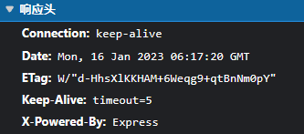响应体:

# 二、原生Ajax

### 案例准备:`server.js`

```js
//1. 引入express
const express = require('express');

//2. 创建应用对象
const app = express();

//3. 创建路由规则
// request 是对请求报文的封装
// response 是对响应报文的封装
//访问127.0.0.1:8000/server时的get请求由下面的函数处理
app.get('/server', (request, response) => {
    //设置响应头,允许跨域
    response.setHeader('Access-Control-Allow-Origin', '*');
    //设置响应
    response.send('HELLO AJAX');
});

//4. 监听端口启动服务
app.listen(8000, () => {
    console.log("服务已经启动, 8000 端口监听中....");
});
```

```js
node server.js
//在这之前需要先暂停占用本服务所需端口的服务
```

> 1、XMLHttpRequest，AJAX 的所有操作都是通过该对象进行的。
>
> 2、当你前端想设置自定义的请求头时,需要如此后端设置响应头
>
> ```js
> //表示接收任意类型的请求							
> app.all('/server', (request, response) => { //响应头 允许跨域     运行自定义响应头
>  response.setHeader('Access-Control-Allow-Origin', '*'); response.setHeader('Access-Control-Allow-Headers', '*');}
> ```
>
> 3、`ajax请求状态`:xhr.readyState
> 	0：请求未初始化，还没有调用 open()。
>
> ​	1：请求已经建立，但是还没有发送，还没有调用 send()。
>
> ​	2：请求已发送，正在处理中（通常现在可以从响应中获取内容头）。
>
> ​	3：请求在处理中；通常响应中已有部分数据可用了，没有全部完成。
>
> ​	4：响应已完成；您可以获取并使用服务器的响应了

### 〇-Ajax的使用

>使用步骤:
>
>```js
>1) 创建 XMLHttpRequest 对象
>var xhr = new XMLHttpRequest();
>2) 设置请求信息
>xhr.open(method, url);
>//xhr.open('GET','127.0.0.1:8000/server');
>//method:请求方法
>//url:发送地址
>//可以设置请求头，一般不设置
>xhr.setRequestHeader('Content-Type', 'application/x-www-form-urlencoded');
>3) 发送请求
>xhr.send()
>//xhr.send(body) //get 请求不传 body 参数，只有 post 请求使用
>4) 接收响应
>//xhr.responseXML 接收 xml 格式的响应数据
>//xhr.responseText 接收文本格式的响应数据
>xhr.onreadystatechange = function (){
>   /**
>   绑定一个onreadystatechange事件
>   readyState:见上面的第三条
>   一共有五个值:正常执行触发四次
>   但是只需要处理响应完成时
>   */
>   if(xhr.readyState == 4 ){
>       //判断响应状态码:在xhr.status==200时可以正确获取
>       //2开头的状态码都是成功
>       if(xhr.status>=200&&xhr.status<300)
>       {
>           //处理结果:
>           var text = xhr.responseText;
>       	console.log(text);
>       }
>	}
>}
>```

### Ⅰ-Get方式

```js
    //绑定事件
    btn.onclick = function () {
      //1. 创建对象
      const xhr = new XMLHttpRequest();
      //2. 初始化 设置请求方法和 url
      xhr.open('GET', 'http://127.0.0.1:8000/server?a=100&b=200&c=300');
        //AJAX带上请求
      //3. 发送
      xhr.send();
      //4. 事件绑定 处理服务端返回的结果
      // on  when 当....时候
      // readystate 是 xhr 对象中的属性, 表示状态 0 1 2 3 4
      // change  改变
      xhr.onreadystatechange = function () {
        //判断 (服务端返回了所有的结果)
        if (xhr.readyState === 4) {
          //判断响应状态码 200  404  403 401 500
          // 2xx 成功
          if (xhr.status >= 200 && xhr.status < 300) {
            //处理结果  行 头 空行 体
            //响应 
            // console.log(xhr.status);//状态码
            // console.log(xhr.statusText);//状态字符串
            // console.log(xhr.getAllResponseHeaders());//所有响应头
            // console.log(xhr.response);//响应体
            //设置 result 的文本
            result.innerHTML = xhr.response;
          } else {}
        }
      }
    }
```

- console输出: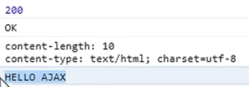

- 响应头: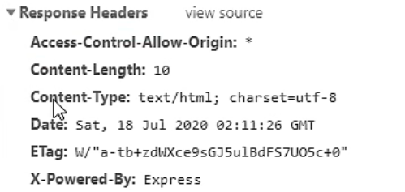

- 请求头: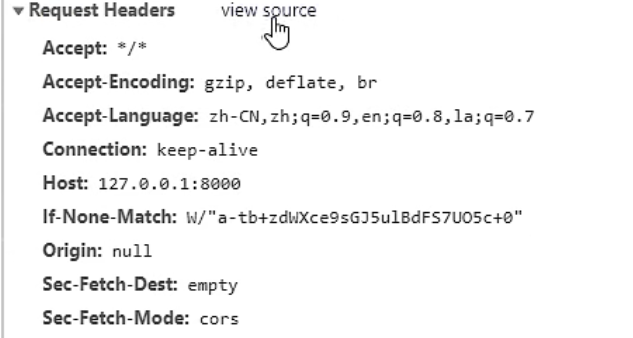

- 响应体Response:

- 点击发送请求,在div中输出: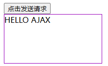

### Ⅱ-Post方式

```js
     //绑定事件
        result.addEventListener("mouseover", function(){
            //1. 创建对象
            const xhr = new XMLHttpRequest();
            //2. 初始化 设置类型与 URL
            xhr.open('POST', 'http://127.0.0.1:8000/server');
            //设置请求头
            //arg1:属性名,arg2:属性值
            xhr.setRequestHeader('Content-Type','application/x-www-form-urlencoded');
            //自定义请求头
            xhr.setRequestHeader('name','atguigu');
            //3. 发送
            //post请求体在send方法中设置
            //设置任意类型任意格式数据,交给服务器端处理(服务端需要有对应的处理方式,一般是写一种特定格式)
            xhr.send('a=100&b=200&c=300');
            // xhr.send('a:100&b:200&c:300');
            // xhr.send('1233211234567');
            //4. 事件绑定
            xhr.onreadystatechange = function(){
                //判断
                if(xhr.readyState === 4){
                    if(xhr.status >= 200 && xhr.status < 300){
                        //处理服务端返回的结果
                        result.innerHTML = xhr.response;
                    }
                }
            }
        });
```

在`server.js`中添加如下代码,用于接收post的请求

```js
app.post('/server', (request, response) => {
    //设置响应头,允许跨域
    response.setHeader('Access-Control-Allow-Origin', '*');
    //设置响应
    response.send('HELLO AJAX POST');
});
```

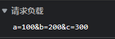

**添加自定义请求头**`{name:atguigu}`,浏览器报错(默认只允许请求头里的属性名是预定义的)

```js
app.all('/server', (request, response) => {
    //设置响应头,允许跨域
    response.setHeader('Access-Control-Allow-Origin', '*');
    //接收所有类型的头信息
    response.setHeader("Access-Control-Allow-Headers", "*")
    //设置响应
    response.send('HELLO AJAX POST');
});
```

发送自定义请求头的时候.还会发送一个Method为OPTIONS的报文

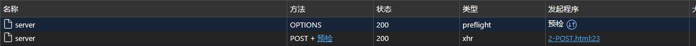

其请求头发送检验信息给服务器端,服务器端检查是否接收`Access-Control-Allow-Headers`为`name`的值,验证为接收,则允许发送自定义的属性值

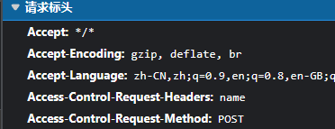

### 服务端响应JSON数据

> 一般的前后端的数据交换以json格式进行交换

后端发送JSON格式的对象

```js
app.all('/server', (request, response) => {
    //设置响应头,允许跨域
    response.setHeader('Access-Control-Allow-Origin', '*');
    //接收所有类型的头信息
    response.setHeader("Access-Control-Allow-Headers", "*")

    var obj = {
        name: "wff",
        password: "123456"
    }

    //设置响应
    response.send(JSON.stringify(obj));
});
```

前端接收JSON格式对象

自动转换:

>```
>xhr.responseType = 'json';
>```

手动转换:

不设置`xhr.responseType = 'json';`,利用`JSON.parse()`将json字符串转换为一个对象

代码示例:

```js
//json字符串
{"name":"wff","password":"123456"}
//JSON.parse('{"name":"wff","password":"123456"}')
var obj=>{name: 'wff', password: '123456'}
```

```js
		//自动
		result.addEventListener("click", function () {
                const xhr = new XMLHttpRequest();
                //add:设置响应体数据的类型
                xhr.responseType = 'json';
                xhr.open('POST', 'http://127.0.0.1:8000/server')
                xhr.setRequestHeader('name', 'atguigu')
                xhr.send("a=100&b=200&c=300")
                xhr.onreadystatechange = function () {
                    if (xhr.readyState === 4) {
                        if (xhr.status >= 200 && xhr.status < 300) {
                            //自动转换
                            //响应体接收到的数据xhr.response为对象格式
                            result.innerHTML = xhr.response;

                        }
                    }
                }
            })
		//手动
		result.addEventListener("click", function () {
                const xhr = new XMLHttpRequest();
                xhr.open('POST', 'http://127.0.0.1:8000/server')
                xhr.setRequestHeader('name', 'atguigu')
                xhr.send("a=100&b=200&c=300")
                xhr.onreadystatechange = function () {
                    if (xhr.readyState === 4) {
                        if (xhr.status >= 200 && xhr.status < 300) {
                            var obj = JSON.parse(xhr.response);
                            result.innerHTML = obj.name + "<br/>" + obj.password;
                        }
                    }
                }
            })
```

### nodemon

> 用于进行服务端的重新启动
>
> 当服务端代码`server.js`重新启动时，nodemon会负责重新启动运行代码

安装：

```js
npm install -g nodemon
```

使用nodemon启动服务

```
nodemon server.js
```

### Ⅲ-解决ie缓存问题

>问题：在一些浏览器中(IE),由于`缓存机制`的存在，(Chrome和Edge...都不会有这个问题)
>ajax 只会发送的第一次请求，剩余多次同样的请求不会再发送给浏览器而是直接加载缓存中的数据(走缓存)。
>
>此时会造成ajax的请求数据不具有时效性
>
>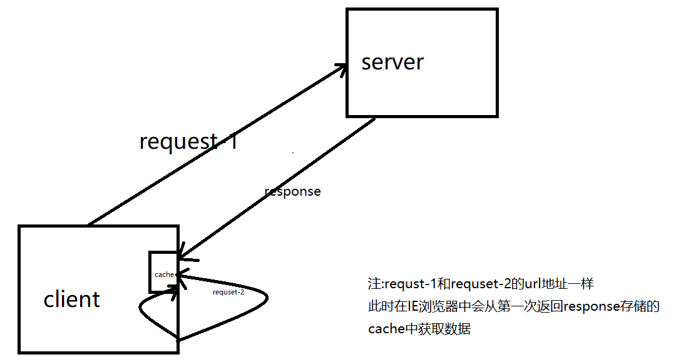
>
>解决方式：浏览器的缓存是根据 url地址来记录的，所以我们只需要修改 url 地址(使每次的url不同,添加一个时间参数) 即可避免缓存问题 
>
>```js
>xhr.open("get","/testAJAX?t="+Date.now());
>//此时IE会将其与之前的请求解析为不同的两次请求,此时不会再有之前的缓存问题
>```
>
>

### Ⅳ-请求超时与网络异常

> 当你的请求时间过长,或者无网络时,进行的相应处理

在服务器端设置超时

```js
app.all('/timeout', (request, response) => {
    //设置响应头,允许跨域
    response.setHeader('Access-Control-Allow-Origin', '*');

    setTimeout(() => {
        //设置响应体
        response.send('Hello Timeout');
    }, 3000);
})
```

在前端设置

```js
            result.addEventListener("click", function () {
                console.log("click")
                //不加延时控制的时候,点击后3秒显示Hello Timeout
                const xhr = new XMLHttpRequest();
                //超时2s设置
                xhr.timeout = 2000
                // 如果2s仍然没有结果返回,则取消请求

                // 超时回调
                xhr.ontimeout = function () {
                    alert("请求超时")
                }
                //网络异常
                xhr.onerror = function () {
                    alert("网络异常")
                    // 在控制台中将网络设置为离线
                }

                xhr.open('POST', 'http://127.0.0.1:8000/timeout')

                xhr.send("a=100&b=200&c=300")
                xhr.onreadystatechange = function () {
                    if (xhr.readyState === 4) {
                        if (xhr.status >= 200 && xhr.status < 300) {
                            result.innerHTML = xhr.response;
                        }
                    }
                }
            })
```

### Ⅴ-取消请求

> 在请求发出去后`但是未响应完成`时可以进行取消请求操作
>
> - 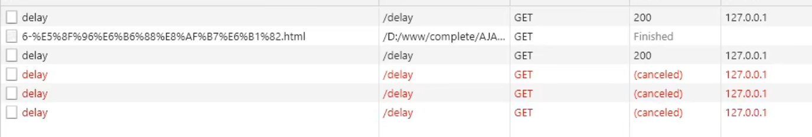

```html
        <button>发送请求</button>
		<button>取消请求</button>
		<script>
		const btns = document.querySelectorAll('button');
        let x = null;
        btns[0].onclick = function(){
            x = new XMLHttpRequest();
            x.open("GET",'http://127.0.0.1:8000/delay');
            //在服务端延时3s返回数据完成前取消请求
            x.send();
        }
        // abort
        btns[1].onclick = function(){
            x.abort();
        }
		</script>
```

### Ⅵ-重复请求问题

> 利用之前Ⅴ中取消请求知识点,当我点击时判断之前请求是否在发送中,如果是,则取消之前发送的请求,创建一个新的

```js
	let isSending=false;//表示变量,含义:是否正在发送ajax请求;作用:用于互斥发送请求
	let x=null;
	btns[0].onclick = function(){
            //判断标识变量
            if(isSending) x.abort();// 如果正在发送, 则取消该请求, 创建一个新的请求
            x = new XMLHttpRequest();
            //修改 标识变量的值
            isSending = true;
            x.open("GET",'http://127.0.0.1:8000/delay');
            x.send();
            x.onreadystatechange = function(){
                if(x.readyState === 4){
                    //修改标识变量
                    isSending = false;
                }
            }
        }
```

# 三、常见三种Ajax请求方式

## 1、jQuery发送AJAX请求

> jQuery有三种发送请求方法:
>
> 当你只是简单的请求数据,可以直接使用前两种方式请求,当你需要设置的东西较多的时候,可以使用`$.ajax()`方法

### Ⅰ-$.get()

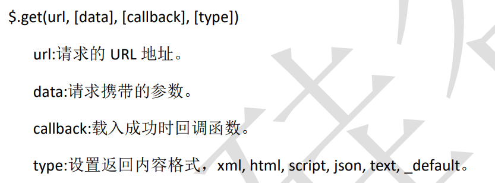

```js
  $('button').eq(0).click(function(){
            $.get('http://127.0.0.1:8000/jquery-server',
                  {a:100, b:200}, 
                  function(data){
                	console.log(data);
            	},'json');
        });
```

### Ⅱ-$.post()

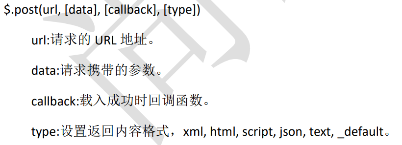

```js
  $('button').eq(1).click(function(){
            $.post('http://127.0.0.1:8000/jquery-server', {a:100, b:200}, function(data){
                console.log(data);
            });
        });
```

### 指定ajax设置的返回格式内容

ajax会根据type对传递过来的对象进行格式转换

json:如果传递一个json格式字符串,将会自动转换为一个对象

如果传递一个text,则不会转换,

```js
/* 
指定text时接受一个字符串
'{"a":100,"b":200}''
指定json时接受一个对象
{a: 100, b: 200}
a: 100b: 200
[[Prototype]]: Object
*/
```

### Ⅲ-$.ajax

```js
   $('button').eq(2).click(function(){
       		//以json对象的格式进行参数的指定
            $.ajax({
                //url
                url: 'http://127.0.0.1:8000/jquery-server',
                //参数
                data: {a:100, b:200},
                //请求类型
                type: 'GET',
                //响应体结果
                dataType: 'json',
                //成功的回调
                success: function(data){
                    console.log(data);
                },
                //超时时间
                timeout: 2000,
                //失败的回调
                error: function(){
                    console.log('出错啦!!');
                },
                //头信息
                //对于自定义的请求头信息,需要修改服务端接受OPTION报文和自定义的请求头
                headers: {
                    c:300,
                    d:400
                }
            });
        });
```

> $.ajax可以控制许多需要的ajax请求参数
>
> 但是get和post请求总体上简单一点

参考文档

>[jQuery API 中文文档 | jQuery API 中文在线手册 | jquery api 下载 | jquery api chm (cuishifeng.cn)](https://jquery.cuishifeng.cn/)

## 2、Axios发送AJAX请求

通过cdn连接引入,下面这个是国外的

```html
<script src="https://cdn.jsdelivr.net/npm/axios@1.1.2/dist/axios.min.js"></script>
```

可以使用国内网站`bootcdn`的连接引入

```html
<script src="https://cdn.bootcdn.net/ajax/libs/axios/1.2.2/axios.js"></script>
```

为防止出现错误,可以加`crossorigin='anonymous'`

```html
<script crossorigin='anonymous' src="https://cdn.bootcdn.net/ajax/libs/axios/1.2.2/axios.js"></script>
```

### Ⅰ-axios.get()

> ##### axios.get(url[, config])

```js
  //配置 baseURL
    axios.defaults.baseURL = 'http://127.0.0.1:8000';

    btns[0].onclick = function () {
      //GET 请求
      axios.get('/axios-server', {
        //url 参数
        params: {
          id: 100,
          vip: 7
        },
        //请求头信息
        headers: {
          name: 'atguigu',
          age: 20
        }
      }).then(value => {
          //基于promise的回调函数
          //value为服务器传回的参数
        console.log(value);
      });
    }
```

### Ⅱ-axios.post()

> ##### axios.post(url[, data[, config]])

```js
  //配置 baseURL
    axios.defaults.baseURL = 'http://127.0.0.1:8000';  
	btns[1].onclick = function () {
        //arg1:url,arg2:请求,arg3:其他参数
      axios.post('/axios-server', {
        username: 'admin',
        password: 'admin'
      }, {
        //url 
        params: {
          id: 200,
          vip: 9
        },
        //请求头参数
        headers: {
          height: 180,
          weight: 180,
        }
      });
    }
```

### Ⅲ-axios() `常用`

> axios({})

```js
  //配置 baseURL
    axios.defaults.baseURL = 'http://127.0.0.1:8000';
	btns[2].onclick = function () {
      axios({
        //请求方法
        method: 'POST',
        //url
        url: '/axios-server',
        //url参数
        params: {
          vip: 10,
          level: 30
        },
        //头信息,此部分如果使用自定义的头信息,需要服务端进行相应修改,正常不设置
        headers: {
          a: 100,
          b: 200
        },
        //请求体参数
        data: {
          username: 'admin',
          password: 'admin'
        }
      }).then(response => {
        //响应状态码
        console.log(response.status);
        //响应状态字符串
        console.log(response.statusText);
        //响应头信息
        console.log(response.headers);
        //响应体
        console.log(response.data);
      })
    }
```

## 3、Fetch发送AJAX请求

> fecth函数,发送ajax请求,是一个全局对象,返回一个promise对象
>
> 参考网址:[fetch() - Web API 接口参考 | MDN (mozilla.org)](https://developer.mozilla.org/zh-CN/docs/Web/API/fetch)
>
> > 全局的 **`fetch()`** 方法用于发起获取资源的请求。它返回一个 promise，这个 promise 会在请求响应后被 resolve，并传回 [`Response`](https://developer.mozilla.org/zh-CN/docs/Web/API/Response) 对象。
>
> ### [参数](https://developer.mozilla.org/zh-CN/docs/Web/API/fetch#参数)
>
> - *?input*
>
>   定义要获取的资源。这可能是：一个 [`USVString`](https://developer.mozilla.org/zh-CN/docs/Web/JavaScript/Reference/Global_Objects/String) 字符串，包含要获取资源的 URL。一些浏览器会接受 `blob:` 和 `data:` 作为 schemes.一个 [`Request`](https://developer.mozilla.org/zh-CN/docs/Web/API/Request) 对象。
>
> - *init* 可选
>
>   一个配置项对象，包括所有对请求的设置。可选的参数有：
>   `method`: 请求使用的方法，如 `GET`、`POST`。
>   `headers`: 请求的头信息，形式为 [`Headers`](https://developer.mozilla.org/zh-CN/docs/Web/API/Headers) 的对象或包含 [`ByteString`](https://developer.mozilla.org/zh-CN/docs/Web/JavaScript/Reference/Global_Objects/String) 值的对象字面量。
>   `body`: 请求的 body 信息：可能是一个 [`Blob`](https://developer.mozilla.org/zh-CN/docs/Web/API/Blob)、`BufferSource`、[`FormData`](https://developer.mozilla.org/zh-CN/docs/Web/API/FormData)、[`URLSearchParams`](https://developer.mozilla.org/zh-CN/docs/Web/API/URLSearchParams) 或者 [`USVString`](https://developer.mozilla.org/zh-CN/docs/Web/JavaScript/Reference/Global_Objects/String) 对象。注意 GET 或 HEAD 方法的请求不能包含 body 信息。
>   `mode`: 请求的模式，如 `cors`、`no-cors` 或者 `same-origin`。
>   `credentials`: 请求的 credentials，如 `omit`、`same-origin` 或者 `include`。为了在当前域名内自动发送 cookie，必须提供这个选项，从 Chrome 50 开始，这个属性也可以接受 [`FederatedCredential` (en-US)](https://developer.mozilla.org/en-US/docs/Web/API/FederatedCredential) 实例或是一个 [`PasswordCredential` (en-US)](https://developer.mozilla.org/en-US/docs/Web/API/PasswordCredential) 实例。
>   `cache`: 请求的 cache 模式：`default`、 `no-store`、 `reload` 、 `no-cache`、 `force-cache` 或者 `only-if-cached`。
>   `redirect`: 可用的 redirect 模式：`follow` (自动重定向), `error` (如果产生重定向将自动终止并且抛出一个错误），或者 `manual` (手动处理重定向)。在 Chrome 中默认使用 `follow`（Chrome 47 之前的默认值是 `manual`）。
>   `referrer`: 一个 [`USVString`](https://developer.mozilla.org/zh-CN/docs/Web/JavaScript/Reference/Global_Objects/String) 可以是 `no-referrer`、`client` 或一个 URL。默认是 `client`。`referrerPolicy`: 指定了 HTTP 头部 referer 字段的值。可能为以下值之一：`no-referrer`、 `no-referrer-when-downgrade`、`origin`、`origin-when-cross-origin`、 `unsafe-url`。
>   `integrity`: 包括请求的 [subresource integrity](https://developer.mozilla.org/zh-CN/docs/Web/Security/Subresource_Integrity) 值（例如： `sha256-BpfBw7ivV8q2jLiT13fxDYAe2tJllusRSZ273h2nFSE=`）。
>
> ### [返回值](https://developer.mozilla.org/zh-CN/docs/Web/API/fetch#返回值)
>
> 一个 [`Promise`](https://developer.mozilla.org/zh-CN/docs/Web/JavaScript/Reference/Global_Objects/Promise)，resolve 时回传 [`Response`](https://developer.mozilla.org/zh-CN/docs/Web/API/Response) 对象。
>
> 
>
> 代码示例

```js
  btn.onclick = function () {
      fetch('http://127.0.0.1:8000/fetch-server?vip=10', {
        //请求方法
        method: 'POST',
        //请求头
        headers: {
          name: 'atguigu'
        },
        //请求体
        body: 'username=admin&password=admin'
      }).then(response => {
        // return response.text();
        return response.json();
      }).then(response => {
        console.log(response);
      });
    }
```

> 总结:
>
> 直接使用ajax发送请求的机会比较少
>
> 一般来说都是使用axios或者jquery发送
>
> 使用fetch发送ajax比较少见,但也有

# 四、跨域与解决

> ##### 1、什么是跨越？
>
> - 一个网页向另一个不同域名/不同协议/不同端口的网页请求资源，这就是跨域。
> - 跨域原因产生：在当前域名请求网站中，默认不允许通过ajax请求发送其他域名。(默认AJAX发送的请求是符合同源策略的)
>
> ##### 2、为什么会产生跨域请求？
>
> - 因为浏览器使用了同源策略
>
> ##### 3、什么是同源策略？
>
> - 同源策略是Netscape提出的一个著名的安全策略，现在所有支持JavaScript的浏览器都会使用这个策略。同源策略是浏览器最核心也最基本的安全功能，如果缺少同源策略，浏览器的正常功能可能受到影响。可以说web是构建在同源策略的基础之上的，浏览器只是针对同源策略的一种实现。
> - 同源： 协议、域名、端口号 必须完全相同。 `违背同源策略就是跨域`。
>
> ##### 4、为什么浏览器要使用同源策略？
>
> - 是为了保证用户的信息安全，防止恶意网站窃取数据，如果网页之间不满足同源要求，将不能:
> - - 1、共享Cookie、LocalStorage、IndexDB
> - - 2、获取DOM
> - - 3、AJAX请求不能发送
>
> ##### 5、跨域的五个解决方式:
>
> ​	1、前端使用jsonp （不推荐使用）
>
> ​	2、后台Http请求转发
>
> ​	3、后台配置同源Cors （推荐）
>
> ​	4、使用SpringCloud网关
>
> ​	5、使用nginx做转发 (推荐)
>
> 本课程提到了其中的两种:jsonP和CORS

```html
<!DOCTYPE html>
<html lang="en">
<head>
    <meta charset="UTF-8">
    <meta name="viewport" content="width=device-width, initial-scale=1.0">
    <title>首页</title>
</head>
<body>
    <h1>尚硅谷</h1>
    <button>点击获取用户数据</button>
    <script>
        const btn = document.querySelector('button');

        btn.onclick = function(){
            const x = new XMLHttpRequest();
            //这里因为是满足同源策略的, 所以 url 可以简写
            x.open("GET",'/data');
            //发送
            x.send();
            //
            x.onreadystatechange = function(){
                if(x.readyState === 4){
                    if(x.status >= 200 && x.status < 300){
                        console.log(x.response);
                    }
                }
            }
        }
    </script>
</body>
</html>
```

```js
const express = require('express');

const app = express();

app.get('/home', (request, response)=>{
    //响应一个页面
    response.sendFile(__dirname + '/index.html');
});

app.get('/data', (request, response)=>{
    response.send('用户数据');
});

app.listen(9000, ()=>{
    console.log("服务已经启动...");
});
```

## 1、jsonP

>1)JSONP 是什么?
>
>​	JSONP(JSON with Padding)，是一个非官方的跨域解决方案，纯粹凭借程序员的聪明 才智开发出来，只支持 get 请求。
>
>2)JSONP 怎么工作的？
>
>​	在网页有一些标签天生具有跨域能力，比如：img link iframe script。 JSONP 就是利用 script 标签的跨域能力来发送请求的。

### 原理

```html
    <div id="result"></div>
    <script>
        //处理数据
        function handle(data) {
            //获取 result 元素
            const result = document.getElementById('result');
            result.innerHTML = data.name;
        }
    </script>
    <!-- <script src="http://127.0.0.1:5500/%E8%AF%BE%E5%A0%82/%E4%BB%A3%E7%A0%81/7-%E8%B7%A8%E5%9F%9F/2-JSONP/js/app.js"></script> -->
    <script src="http://127.0.0.1:8000/jsonp-server"></script>
```

> 使用script标签去访问`http://127.0.0.1:8000/jsonp-server`期望得到一段js代码
>
> 如果直接返回数据,则浏览器接受,但是不能正常引入
>
> 所以需要从服务端返回一段js代码

```js
//app.js
const data = {
    name: '尚硅谷atguigu'
};

handle(data);
```

```js
//jsonp服务
app.all('/jsonp-server',(request, response) => {
    // response.send('console.log("hello jsonp")');
    const data = {
        name: '尚硅谷atguigu'
    };
    //将数据转化为字符串
    let str = JSON.stringify(data);
    //返回结果
    //等于是返回了一个调用语句回去，这个调用语句里放了数据
    //所以才需要使用字符串拼接
    response.end(`handle(${str})`);
});
```

### Ⅰ-jsonP的使用

原生的跨域jsonp

```html
<body>
    用户名: <input type="text" id="username">
    <p></p>
    <script>
        //获取 input 元素
        const input = document.querySelector('input');
        const p = document.querySelector('p');
        
        //声明 handle 函数
        function handle(data){
            input.style.border = "solid 1px #f00";
            //修改 p 标签的提示文本
            p.innerHTML = data.msg;
        }

        //绑定事件
        input.onblur = function(){
            //获取用户的输入值
            let username = this.value;
            //向服务器端发送请求 检测用户名是否存在
            //1. 创建 script 标签
            const script = document.createElement('script');
            //2. 设置标签的 src 属性
            script.src = 'http://127.0.0.1:8000/check-username';
            //3. 将 script 插入到文档中
            document.body.appendChild(script);
        }
    </script>
</body>
```

`server.js`

```js
//用户名检测是否存在
app.all('/check-username',(request, response) => {
    // response.send('console.log("hello jsonp")');
    const data = {
        exist: 1,
        msg: '用户名已经存在'
    };
    //将数据转化为字符串
    let str = JSON.stringify(data);
    //返回结果
    response.end(`handle(${str})`);
});
```

例二:

```js
   // 1. 动态的创建一个 script 标签------------------------------------------------------------
    var script = document.createElement("script");
	//2. 设置 script 的 src， 设置回调函数
    script.src = "http://localhost:3000/testAJAX?callback=abc";
    function abc(data) {
      alert(data.name);
    };
   // 3. 将 script 添加到 body 的最后
    document.body.appendChild(script);

   // 4. 服务器中路由的处理------------------------------------------------------
    router.get("/testAJAX", function (req, res) {
      console.log("收到请求");
      var callback = req.query.callback;
      var obj = {
        ame: "孙悟空",
        age: 18
      }
      res.send(callback + "(" + JSON.stringify(obj) + ")");
    });
```

### Ⅱ-jQuery发送jsonP请求

```html
    <button>点击发送 jsonp 请求</button>
    <div id="result">

    </div>
    <script>
        $('button').eq(0).click(function(){
			//使用getJSON发送jsonp请求
            $.getJSON('http://127.0.0.1:8000/jquery-jsonp-server?callback=?', function(data){
                $('#result').html(`
                    名称: ${data.name}<br>
                    校区: ${data.city}
                `)
            });
        });
    </script>
```

```js
app.all('/jquery-jsonp-server',(request, response) => {
    // response.send('console.log("hello jsonp")');
    const data = {
        name:'尚硅谷',
        city: ['北京','上海','深圳']
    };
    //将数据转化为字符串
    let str = JSON.stringify(data);
    //接收 callback 参数
    let cb = request.query.callback;

    //返回结果
    response.end(`${cb}(${str})`);
});
```


### Ⅲ-我自己开发封装的jsonP插件

>1、代价:需要前后端联动
>2、精髓:自动的由插件生成方法名,并在当前的页面动态的生成函数,然后再生成的函数里头调用用户预留的回调函数
>3、插件：自动化的去模拟基于script去实现跨域请求的过程（对用户来说是黑盒子）
>4、参数拼接：url已经是带参的。和不带参的
>5、id优化 额可以添加一个容器来管理id

> 1、前端调用测试封装好的jsonP代码

```js
//测试调用函数
    let test=function () {
        jsonP.req({
            url:"http://localhost:3000/jsonpx",
            data:{
                a:"111"
            },
            callback:function (result) {
                alert("成功"+result)
            }
        })
    }
```

> 2、服务端测试代码

```js
router.get('/jsonpx', async function (req, resp, next) {
    let callback=req.query.callback;
    let data=req.query.a;
    if (!data){
        resp.send(`${callback}('洪jl:我是服务端代码')`)
    }
    resp.send(`${callback}('洪jl:我是服务端代码`+data+`')`)
})
```

> 3、封装原生代码

```js
<script>
    /**author:@hongjilin
     * 1.声明一个jsonP插件对象
     * 作用：隔开作用域
     */
    let jsonP = {};

    /**
     *2.在插件对象中创建两个名字备用符数组
     */
    jsonP.char = {
        Number: '0123456789',
        Letter: 'qwertyuiopasdfghjklzxcvbnmQWERTYUIOPASDFGHJKLZXCVBNM'
    }
    /**
     * 通过随机数抽取备用字符数组库拼凑函数id
     * @param charLen
     * @param numLen
     */
    jsonP.newFunId = function (charLen, numLen) {
        let id = '';
        for (let i = 0; i < charLen; i++) {
            id += this.char.Letter.charAt(Math.random() * 52)
        }
        for (let j = 0; j < numLen; j++) {
            id += Math.floor(Math.random() * 10);
        }
        return id;
    }
    /**
     * 拼接路径
     * @param url
     * @param key
     * @param value
     */
    jsonP.jointUrl = function (url, key, value) {
        if (url && key && value) {
            let sign = "&"
            //如果是第一次
            if (url.indexOf('?') == -1) {
                sign = '?'
            }

            url += sign + key + "=" + value
        }
        return url;
    }
    /**
     封装err属性方便
     */
    jsonP.err = function (msg) {
        console.error(msg)
    }

    /**
     * 发送请求函数
     * @param options
     */
    jsonP.req = function (options) {
        let jsonId={};
        //1.生成方法名
        jsonId.funId = this.newFunId(4,8);
        let Userurl = options.url;
        let Userdata = options.data;
        if (!options) {
            this.err("输入不能空")
            return;
        } else if (!Userurl) {
            this.err("url不能空")
            return;
        } else if (!Userdata) {
            //如果没有data,初始化
            Userdata = {};
        }
        //将函数名赋值给userdata的回调函数属性中
        Userdata.callback = jsonId.funId;
        for (let key in Userdata) {
            Userurl = this.jointUrl(Userurl, key, Userdata[key])
        }
        let script = document.createElement('script');
        script.setAttribute("id" , jsonId.funId);
        script.setAttribute("src" , Userurl);
        //动态生成函数
        let callback=function (result) {
            console.log("xxxxxxx")
            //业务逻辑回调
            if (options.callback){
                try {
                    options.callback(result)
                }catch (e) {
                    this.err(e.message)
                }
            }
            //善后
            let tmp=document.getElementById(jsonId.funId)
            tmp.parentNode.removeChild(tmp);
            eval(jsonId.funId+'=null')
        }
        eval("window."+jsonId.funId+"=function(result){ callback(result) }")
        document.head.appendChild(script)

    }
</script>
```

## 2、CORS

>1、[CORS文档链接](https://developer.mozilla.org/zh-CN/docs/Web/HTTP/CORS)
>
>2、CORS是什么?
>
>​	CORS（Cross-Origin Resource Sharing），跨域资源共享。CORS 是官方的跨域解决方 案，它的特点是不需要在客户端做任何特殊的操作，完全在服务器中进行处理，支持 get 和 post 请求。跨域资源共享标准新增了一组 HTTP 首部字段，允许服务器声明哪些 源站通过浏览器有权限访问哪些资源
>
>3、CORS是怎么工作的?
>
>​	CORS 是通过设置一个响应头来告诉浏览器，该请求允许跨域，浏览器收到该响应 以后就会对响应放行。

### Ⅰ-代码示例

```js
app.all('/cors-server', (request, response) => {
  //设置响应头
    //响应首部中可以携带一个 Access-Control-Allow-Origin 字段
  response.setHeader("Access-Control-Allow-Origin", "*");
    //Access-Control-Allow-Headers 首部字段用于预检请求的响应。其指明了实际请求中允许携带的首部字
    
  response.setHeader("Access-Control-Allow-Headers", '*');
    //Access-Control-Allow-Methods 首部字段用于预检请求的响应。其指明了实际请求所允许使用的 HTTP
    
  response.setHeader("Access-Control-Allow-Method", '*');
  // response.setHeader("Access-Control-Allow-Origin", "http://127.0.0.1:5500");
  response.send('hello CORS');
});
```

### Ⅱ-[HTTP 响应首部字段](https://developer.mozilla.org/zh-CN/docs/Web/HTTP/CORS#http_响应首部字段)

> 本节列出了规范所定义的响应首部字段。上一小节中，我们已经看到了这些首部字段在实际场景中是如何工作的。

#### 1、[Access-Control-Allow-Origin](https://developer.mozilla.org/zh-CN/docs/Web/HTTP/CORS#access-control-allow-origin)

>响应首部中可以携带一个 [`Access-Control-Allow-Origin`](https://developer.mozilla.org/zh-CN/docs/Web/HTTP/Headers/Access-Control-Allow-Origin) 字段，其语法如下:
>
>```js
>Access-Control-Allow-Origin: <origin> | *
>```
>
>其中，origin 参数的值指定了允许访问该资源的外域 URI。对于不需要携带身份凭证的请求，服务器可以指定该字段的值为通配符，表示允许来自所有域的请求。
>
>例如，下面的字段值将允许来自 http://mozilla.com 的请求：
>
>```js
>Access-Control-Allow-Origin: http://mozilla.com
>```
>
>如果服务端指定了具体的域名而非“*”，那么响应首部中的 Vary 字段的值必须包含 Origin。这将告诉客户端：服务器对不同的源站返回不同的内容。

#### 2、[Access-Control-Expose-Headers](https://developer.mozilla.org/zh-CN/docs/Web/HTTP/CORS#access-control-expose-headers)

>译者注：在跨源访问时，XMLHttpRequest对象的getResponseHeader()方法只能拿到一些最基本的响应头，Cache-Control、Content-Language、Content-Type、Expires、Last-Modified、Pragma，如果要访问其他头，则需要服务器设置本响应头。
>
>[`Access-Control-Expose-Headers`](https://developer.mozilla.org/zh-CN/docs/Web/HTTP/Headers/Access-Control-Expose-Headers) 头让服务器把允许浏览器访问的头放入白名单，例如：
>
>```js
>Access-Control-Expose-Headers: X-My-Custom-Header, X-Another-Custom-Header
>```
>
>这样浏览器就能够通过getResponseHeader访问`X-My-Custom-Header`和 `X-Another-Custom-Header` 响应头了。

#### 3、[Access-Control-Max-Age](https://developer.mozilla.org/zh-CN/docs/Web/HTTP/CORS#access-control-max-age)

>[`Access-Control-Max-Age`](https://developer.mozilla.org/zh-CN/docs/Web/HTTP/Headers/Access-Control-Max-Age) 头指定了preflight请求的结果能够被缓存多久，请参考本文在前面提到的preflight例子。
>
>```js
>Access-Control-Max-Age: <delta-seconds>
>```
>
>`delta-seconds` 参数表示preflight请求的结果在多少秒内有效。

#### 4、[Access-Control-Allow-Credentials](https://developer.mozilla.org/zh-CN/docs/Web/HTTP/CORS#access-control-allow-credentials)

>[`Access-Control-Allow-Credentials`](https://developer.mozilla.org/zh-CN/docs/Web/HTTP/Headers/Access-Control-Allow-Credentials) 头指定了当浏览器的`credentials`设置为true时是否允许浏览器读取response的内容。当用在对preflight预检测请求的响应中时，它指定了实际的请求是否可以使用`credentials`。请注意：简单 GET 请求不会被预检；如果对此类请求的响应中不包含该字段，这个响应将被忽略掉，并且浏览器也不会将相应内容返回给网页。
>
>```js
>Access-Control-Allow-Credentials: true
>```

#### 5、[Access-Control-Allow-Methods](https://developer.mozilla.org/zh-CN/docs/Web/HTTP/CORS#access-control-allow-methods)

>[`Access-Control-Allow-Methods`](https://developer.mozilla.org/zh-CN/docs/Web/HTTP/Headers/Access-Control-Allow-Methods) 首部字段用于预检请求的响应。其指明了实际请求所允许使用的 HTTP 方法。
>
>```js
>Access-Control-Allow-Methods: <method>[, <method>]*
>```

#### 6、[Access-Control-Allow-Headers](https://developer.mozilla.org/zh-CN/docs/Web/HTTP/CORS#access-control-allow-headers)

>[`Access-Control-Allow-Headers`](https://developer.mozilla.org/zh-CN/docs/Web/HTTP/Headers/Access-Control-Allow-Headers) 首部字段用于预检请求的响应。其指明了实际请求中允许携带的首部字段。
>
>允许加入自定义的请求头
>
>```js
>Access-Control-Allow-Headers: <field-name>[, <field-name>]*
>```

### Ⅲ-[HTTP 请求首部字段](https://developer.mozilla.org/zh-CN/docs/Web/HTTP/CORS#http_请求首部字段)

> 本节列出了可用于发起跨源请求的首部字段。请注意，这些首部字段无须手动设置。 当开发者使用 XMLHttpRequest 对象发起跨源请求时，它们已经被设置就绪。

#### 1、[Origin](https://developer.mozilla.org/zh-CN/docs/Web/HTTP/CORS#origin)

>[`Origin`](https://developer.mozilla.org/zh-CN/docs/Web/HTTP/Headers/Origin) 首部字段表明预检请求或实际请求的源站。
>
>```js
>Origin: <origin>
>```
>
>origin 参数的值为源站 URI。它不包含任何路径信息，只是服务器名称。
>
>**Note:** 有时候将该字段的值设置为空字符串是有用的，例如，当源站是一个 data URL 时。
>
>注意，在所有访问控制请求（Access control request）中，[`Origin`](https://developer.mozilla.org/zh-CN/docs/Web/HTTP/Headers/Origin) 首部字段**总是**被发送

#### 2、[Access-Control-Request-Method](https://developer.mozilla.org/zh-CN/docs/Web/HTTP/CORS#access-control-request-method)

>[`Access-Control-Request-Method`](https://developer.mozilla.org/zh-CN/docs/Web/HTTP/Headers/Access-Control-Request-Method) 首部字段用于预检请求。其作用是，将实际请求所使用的 HTTP 方法告诉服务器。
>
>```js
>Access-Control-Request-Method: <method>
>```

#### 3、[Access-Control-Request-Headers](https://developer.mozilla.org/zh-CN/docs/Web/HTTP/CORS#access-control-request-headers)

>[`Access-Control-Request-Headers`](https://developer.mozilla.org/zh-CN/docs/Web/HTTP/Headers/Access-Control-Request-Headers) 首部字段用于预检请求。其作用是，将实际请求所携带的首部字段告诉服务器。
>
>```js
>Access-Control-Request-Headers: <field-name>[, <field-name>]*
>```


# 五、服务端代码示例

> 配合以上前端代码的服务端代码

```js
//1. 引入express
const express = require('express');

//2. 创建应用对象
const app = express();

//3. 创建路由规则
// request 是对请求报文的封装
// response 是对响应报文的封装
app.get('/server', (request, response) => {
  //设置响应头  设置允许跨域
  response.setHeader('Access-Control-Allow-Origin', '*');
  //设置响应体
  response.send('HELLO AJAX - 2');
});

//可以接收任意类型的请求 
app.all('/server', (request, response) => {
  //设置响应头  设置允许跨域
  response.setHeader('Access-Control-Allow-Origin', '*');
  //响应头
  response.setHeader('Access-Control-Allow-Headers', '*');
  //设置响应体
  response.send('HELLO AJAX POST');
});

//JSON 响应
app.all('/json-server', (request, response) => {
  //设置响应头  设置允许跨域
  response.setHeader('Access-Control-Allow-Origin', '*');
  //响应头
  response.setHeader('Access-Control-Allow-Headers', '*');
  //响应一个数据
  const data = {
    name: 'atguigu'
  };
  //对对象进行字符串转换
  let str = JSON.stringify(data);
  //设置响应体
  response.send(str);
});

//针对 IE 缓存
app.get('/ie', (request, response) => {
  //设置响应头  设置允许跨域
  response.setHeader('Access-Control-Allow-Origin', '*');
  //设置响应体
  response.send('HELLO IE - 5');
});

//延时响应
app.all('/delay', (request, response) => {
  //设置响应头  设置允许跨域
  response.setHeader('Access-Control-Allow-Origin', '*');
  response.setHeader('Access-Control-Allow-Headers', '*');
  setTimeout(() => {
    //设置响应体
    response.send('延时响应');
  }, 1000)
});

//jQuery 服务
app.all('/jquery-server', (request, response) => {
  //设置响应头  设置允许跨域
  response.setHeader('Access-Control-Allow-Origin', '*');
  response.setHeader('Access-Control-Allow-Headers', '*');
  // response.send('Hello jQuery AJAX');
  const data = {
    name: '尚硅谷'
  };
  response.send(JSON.stringify(data));
});

//axios 服务
app.all('/axios-server', (request, response) => {
  //设置响应头  设置允许跨域
  response.setHeader('Access-Control-Allow-Origin', '*');
  response.setHeader('Access-Control-Allow-Headers', '*');
  // response.send('Hello jQuery AJAX');
  const data = {
    name: '尚硅谷'
  };
  response.send(JSON.stringify(data));
});

//fetch 服务
app.all('/fetch-server', (request, response) => {
  //设置响应头  设置允许跨域
  response.setHeader('Access-Control-Allow-Origin', '*');
  response.setHeader('Access-Control-Allow-Headers', '*');
  // response.send('Hello jQuery AJAX');
  const data = {
    name: '尚硅谷'
  };
  response.send(JSON.stringify(data));
});

//jsonp服务
app.all('/jsonp-server', (request, response) => {
  // response.send('console.log("hello jsonp")');
  const data = {
    name: '尚硅谷atguigu'
  };
  //将数据转化为字符串
  let str = JSON.stringify(data);
  //返回结果
  response.end(`handle(${str})`);
});

//用户名检测是否存在
app.all('/check-username', (request, response) => {
  // response.send('console.log("hello jsonp")');
  const data = {
    exist: 1,
    msg: '用户名已经存在'
  };
  //将数据转化为字符串
  let str = JSON.stringify(data);
  //返回结果
  response.end(`handle(${str})`);
});

//
app.all('/jquery-jsonp-server', (request, response) => {
  // response.send('console.log("hello jsonp")');
  const data = {
    name: '尚硅谷',
    city: ['北京', '上海', '深圳']
  };
  //将数据转化为字符串
  let str = JSON.stringify(data);
  //接收 callback 参数
  let cb = request.query.callback;

  //返回结果
  response.end(`${cb}(${str})`);
});

app.all('/cors-server', (request, response) => {
  //设置响应头
  response.setHeader("Access-Control-Allow-Origin", "*");
  response.setHeader("Access-Control-Allow-Headers", '*');
  response.setHeader("Access-Control-Allow-Method", '*');
  // response.setHeader("Access-Control-Allow-Origin", "http://127.0.0.1:5500");
  response.send('hello CORS');
});

//4. 监听端口启动服务
app.listen(8000, () => {
  console.log("服务已经启动, 8000 端口监听中....");
});
```

