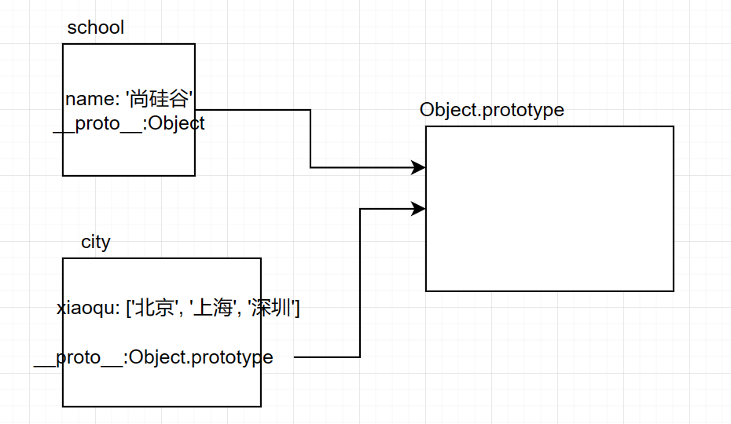
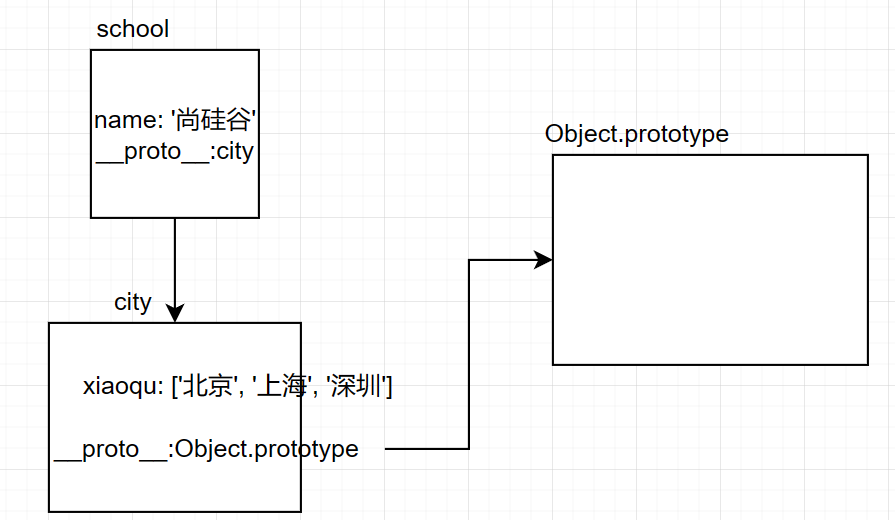
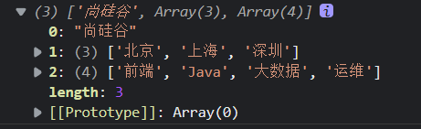
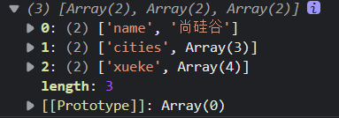
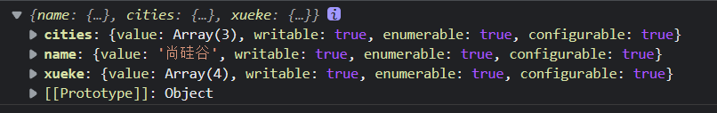
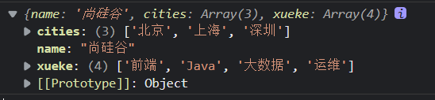
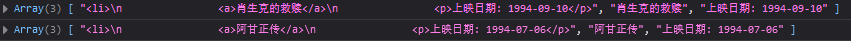
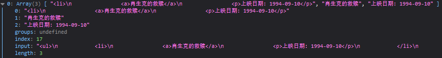

[4. 字符串的扩展 - 模板字符串 - 《阮一峰 ECMAScript 6 (ES6) 标准入门教程 第三版》 - 书栈网 · BookStack](https://www.bookstack.cn/read/es6-3rd/spilt.5.docs-string.md)

## 模板字符串

声明方法

```js
`字符串`
```

- 内容中可以直接出现换行符
- 使用`${varname}`符号进行变量拼接

```js
let str = `<ul>
			<li>RHF</li>
			<li>RHF</li>
		   </ul>`；
//相当于不换行的<ul>/n/t/t/t<li>RHF</li>/n/t/t/t<li>RHF</li>/n/t/t/t</ul>
```

```js
let lovest = 'RHF';
let out = `${lovest}是最帅的`;
console.log(out)  //RHF是最帅的
```

## 对象的简化写法

ES6允许在大括号里面，直接写入变量和函数，作为对象的属性和方法,这样的书写更加简洁

```js
		let name="卫宫"
		
		const fate={
			//属性简写为外部的变量
			name,
			// 函数简写为:函数名(){...}
			talk(){
				console.log("talk...");
			}
		}
		console.log(fate)
		//{name: "卫宫", talk: ƒ}
```

## 箭头函数

ES6 允许使用「箭头」（=>）定义函数。
声明一个函数

```
()=>{}
```

`()`中放参数,`{}`中放函数体代码

特性:
1. this 是静态的. this 始终指向函数声明时所在作用域下的 this 的值
    使用call和apply指定this也不行
2. 使用箭头定义函数后,这个函数对象不能作为构造函数使用
    否则会报错
3. 不能使用 arguments 变量
4. 箭头函数的简写
    1)省略`()`,当只有一个形参时
    2)省略`{}`,当代码体只有一条语句时,同时其执行结果作为函数返回值

```js
        声明一个函数
        let fn = function(){

        }
        let fn = (a,b) => {
            return a + b;
        }
        调用函数
        let result = fn(1, 2);
        console.log(result);//3
```

静态this验证:

```js
		function getName() {
            console.log(this.name);
        }
        let getName2 = () => {
            console.log(this.name);
        }

        //设置 window 对象的 name 属性
        window.name = '尚硅谷';
        const school = {
            name: "ATGUIGU"
        }

        //直接调用
        // getName();//尚硅谷
        // getName2();//尚硅谷

        //call 方法调用
        // getName.call(school);//ATGUIGU
        // getName2.call(school);//尚硅谷
```

不能作为构造实例化对象的验证

```js
		let Person = (name, age) => {
            this.name = name;
            this.age = age;
        }
        let me = new Person('xiao',30);
        console.log(me);
        //报错:Uncaught TypeError: Person is not a constructor
```

不能使用 arguments 变量

```js
        // let fn = () => {
        //     console.log(arguments);
        // }
        // fn(1,2,3);
```

简写:

```js
        //()简写
		 let add = n => {
             return n + n;
         }
         console.log(add(9));
```

```js
		//()和{}简写
		let pow = n => n * n;
		//n作为参数,n*n为返回值
        console.log(pow(8));//64
```

```js
		//反例
		let func=(a)=>console.log(a);
		let result=func("123")
		//console.log作为一条输出语句,没有返回值
		//所以result为undefined
		console.log(result)//undefined
```

### 应用

例1:延时两秒变色,而延时是全局对象setTimeout的方法,this对象是window(通过箭头函数传入当前div的this参数)

```css
			#ad{
				width:200px;
				height:200px;
				background-color: #bfa;
			}
```

```js
			// 点击后两秒变色
			// $(function(){
			// 	var ad=$("#ad")[0];
			// 	ad.addEventListener("click",function(){
			// 		setTimeout(function(){
			// 			console.log(this)//window
			// 			//setTimeout是全局的方法,window.setTimeout
			// 			//如果要使用之前的this?可以使用箭头函数
			// 		},2000)
			// 	})
			// })
			$(function(){
				var ad=$("#ad")[0];
				ad.addEventListener("click",function(){
					setTimeout(()=>{
						// console.log(this)//div#ad
						this.style.backgroundColor='pink'
					},2000);
				})
			})
```

例2:

```js
		//需求-2  从数组中返回偶数的元素
        const arr = [1,6,9,10,100,25];
        // const result = arr.filter(function(item){
        //     if(item % 2 === 0){
        //         return true;
        //     }else{
        //         return false;
        //     }
        // });
        
        const result = arr.filter(item => item % 2 === 0);

        console.log(result);

        // 箭头函数适合与 this 无关的回调. 定时器, 数组的方法回调
        // 箭头函数不适合与 this 有关的回调.  事件回调, 对象的方法

```

## 函数参数初始值&参数解构

ES6 允许给函数参数赋值初始值

形参初始值具有默认值的参数, 一般位置要靠后(潜规则)

```js
        function add(a, c = 10, b) {
                //add(1,2)=NaN
                //(a,b,c=10)时add(1,2)result=13
                return a + b + c;
            }
```

参数解构

```js
function connect({ host = "127.0.0.1", username, password, port }) {
            console.log(host)
            console.log(username)
            console.log(password)
            console.log(port)
        }
        connect({
            host: 'atguigu.com',
            username: 'root',
            password: 'root',
            port: 3306
        })
```

> *对象解构*:*host有一个解构默认值*,当且仅当hsot右侧匹配为undefined时,赋值host为其默认值`127.0.0.1`

## rest参数

ES6 引入 rest 参数，用于获取函数的实参，用来代替 arguments

ES6 引入 rest 参数（形式为`...变量名`），用于获取函数的多余参数，这样就不需要使用`arguments`对象了。rest 参数搭配的变量是一个数组，该变量将多余的参数放入数组中

- ES5 获取实参的方式arguments

  - ```js
    function date(){
                console.log(arguments);
            }
            date('白芷','阿娇','思慧');
            /* 
            Arguments(3) ["白芷", "阿娇", "思慧", 
                callee: ƒ, Symbol(Symbol.iterator): ƒ]
            */
    ```
- ES6 获取实参的方式rest

  - ```js
    		function date(...args){
                console.log(args);// filter some every map 
            }
            date('阿娇','柏芝','思慧');
      		//(3) ["阿娇", "柏芝", "思慧"]
      		//args原型对象是Array数组
    ```
- rest 参数必须要放到参数最后,接收所有没有匹配的值(如果不是最后一个会报错)

  - ```js
            function fn(a,b,...args){
                console.log(a);//1
                console.log(b);//2
                console.log(args);//[3,4,5,6]
            }
            fn(1,2,3,4,5,6);
    ```

> ## 关于arguments和rest的对比
>
> ```js
> // arguments变量的写法
> function sortNumbers() {
>   return Array.prototype.slice.call(arguments).sort();
> }
> // rest参数的写法
> const sortNumbers = (...numbers) => numbers.sort();
> ```
>
> `arguments`对象不是数组，而是一个类似数组的对象。所以为了使用数组的方法，必须使用`Array.prototype.slice.call`先将其转为数组。
> rest 参数就不存在这个问题，它就是一个真正的数组，数组特有的方法都可以使用。
>
> ## 函数的`length`属性，不包括 rest 参数
>
> ```js
> (function(a) {}).length  // 1
> (function(...a) {}).length  // 0
> (function(a, ...b) {}).length  // 1
> ```
>
> ## rest参数是显示设置的,可以应用于箭头函数
>
> ```js
> ((...rest)=>{console.log(rest)})();
> ```
>
> 

## 扩展运算符

`...`*扩展运算符能将『数组』转换为逗号分隔的『参数序列』*

```js
const tfboys = ['易烊千玺','王源','王俊凯'];
...tfboys//'易烊千玺','王源','王俊凯'
```

> ## 应用:
>
> ### *1. 数组的合并*
>
> ```js
> const tfboys=['易烊千玺','王源','王俊凯'];
> const ace=['艾斯','路飞','萨博'];
> //合并
> tfboys.concat(ace)
> //使用...合并
> [...tfboys,...ace]
> ```
>
> ### *2.数组的克隆*
>
> ```js
> 		const ace=['艾斯','路飞','萨博'];
> 		let aceCopy=[...ace];
> 		aceCopy[0]='波特卡斯·D·艾斯'
> 		console.log(aceCopy[0]===ace[0])//false
> ```
>
> 这个克隆是直接赋值,另外开辟一段内存空间放置这个对象而不是同时引用一个对象,不同于下面这段代码
>
> ```js
> 		const ace=['艾斯','路飞','萨博'];
> 		let aceCopy=ace;
> 		aceCopy[0]='波特卡斯·D·艾斯'
> 		console.log(aceCopy[0]===ace[0])//true
> ```
>
> ### *3. 将伪数组转为真正的数组*
>
> ```js
>         const divs = document.querySelectorAll('div');
>         const divArr = [...divs];
>         console.log(divArr);// arguments
> ```
>
> 

### es9扩展运算符可以作用到对象上

>```js
>        Rest 参数与 spread 扩展运算符在 ES6 中已经引入，不过 ES6 中只针对于数组，
>        在 ES9 中为对象提供了像数组一样的 rest 参数和扩展运算符
>```
>
>rest参数
>
>> rest参数接收其余的对象,组织为一个内置对象
>
>```js
>		//rest 参数
>        function connect({host, port, ...user}){
>            console.log(host);
>            console.log(port);
>            console.log(user);
>            //{"username": "root","password": "root","type": "master"}
>        }
>
>        connect({
>            host: '127.0.0.1',
>            port: 3306,
>            username: 'root',//user
>            password: 'root',//user
>            type: 'master'//user
>        });
>```
>
>扩展运算符作用于参数
>
>> 基本使用
>>
>> ```js
>> const emiya={
>> 	name:"wzgs",
>> 	age:16,
>> 	gender:"male"
>> }
>> ...emiya//name:"wzgs",age:16,gender:"male"
>> //但是...对象不能输出,只能用于参数或者对象合并中
>> ```
>>
>> 对象合并
>>
>> ```js
>> 		const skillOne = {
>>             q: '天音波'
>>         }
>>         const skillTwo = {
>>             w: '金钟罩'
>>         }
>> 
>>         const skillThree = {
>>             e: '天雷破'
>>         }
>>         const skillFour = {
>>             r: '猛龙摆尾'
>>         }
>>         const mangseng = {...skillOne, ...skillTwo, ...skillThree, ...skillFour};
>> 
>>         console.log(mangseng)
>>         /* {"q": "天音波","w": "金钟罩","e": "天雷破","r": "猛龙摆尾"} */
>>         console.log(...mangseng)//error
>> ```
>
>为什么不能对使用扩展运算符的对象输出?
>
>```js
>        const p = [1, 2, 3, 4]
>        console.log(...p)//1 2 3 4
>        const obj = { 1: "arg1", 2: "arg2" }
>        console.log(...obj)
>		//抛出一个运行时错误
>        //Unchecked runtime.lastError:
>        // Could not establish connection. Receiving end does not exist.
>```
>
>

## 数值扩展

> ## Number.EPSILON
>
> js提供的最小精度
>
> ```js
>         //0. Number.EPSILON 是 JavaScript 表示的最小精度
>         //EPSILON 属性的值接近于 2.2204460492503130808472633361816E-16
> 		//用于浮点数的判断
>         function equal(a, b){
>             if(Math.abs(a-b) < Number.EPSILON){
>                 return true;
>             }else{
>                 return false;
>             }
>         }
>         console.log(0.1 + 0.2 === 0.3);//直接比较不精确 false
>         console.log(equal(0.1 + 0.2, 0.3))//使用一个最小精度比较 true
> ```
>
> ## Number初始化扩展-多进制
>
> - 0x=16进制
> - 0o=8进制(同时0打头的非0字面量,是8进制;比如010=>8)
> - 0b=2进制
> - 不加前缀:10进制
>
> ```js
>         let b = 0b1010;
>         let o = 0o777;
>         let d = 100;
>         let x = 0xff;
>         console.log(x);
> ```
>
> ## Number.isFinite  
>
> 检测一个数值是否为有限数
>
> ```js
>         console.log(Number.isFinite(100));//true
>         console.log(Number.isFinite(100/0));//false
>         console.log(Number.isFinite(Infinity));//false
> ```
>
> ## Number.isNaN 
>
> 检测一个数值是否为 NaN
>
> ```js
> console.log(Number.isNaN(123)); 
> ```
>
> ## Number.parseInt Number.parseFloat
>
> 字符串转整数,前缀带字母的不能转换后缀可以
>
> `/\d+\w*/`
>
> ```js
>          console.log(Number.parseInt('5211314love'));//5211314
>          console.log(Number.parseFloat('3.1415926神奇'));//3.1415926
> ```
>
> ## Number.isInteger
>
> 判断一个数是否为整数
>
> ```js
>           console.log(Number.isInteger(5));
>          console.log(Number.isInteger(2.5));
> ```
>
> ## Math.trunc 
>
> 将数字的小数部分抹掉  
>
> ```
>     console.log(Math.trunc(3.5));//3
> ```
>
> ## Math.sign 
>
> 判断一个数到底为正数 负数 还是零
>
> ```js
>                  console.log(Math.sign(100));//1
>                  console.log(Math.sign(0));//0
>                  console.log(Math.sign(-20000));//-1
> ```
>
> 

## 对象扩展

### 方法

> ## Object.is(arg1,arg2)
>
> - 基本同`===`,但是可以比较NaN(使用`===`比较NaN只会返回false)
>
> ```js
>         console.log(Object.is(120, 120));// ===
>         console.log(Object.is(NaN, NaN));//true
>         console.log(NaN === NaN);//false,与自身比较也是false
>         //可以比较NaN
> ```
>
> ## Object.assign(arg1,arg2)
>
> 对象的合并
>
> - arg1:被覆盖的对象
> - arg2:需要覆盖的值 
> - config2与config1有重名属性时,config2的覆盖config的
> - 没有重名属性时,两个属性共存
>
> ```js
>        const config1 = {
>             host: 'localhost',
>             port: 3306,
>             name: 'root',
>             pass: 'root',
>             test: 'test'
>         };
>         const config2 = {
>             host: 'http://atguigu.com',
>             port: 33060,
>             name: 'atguigu.com',
>             pass: 'iloveyou',
>             test2: 'test2'
>         }
>         console.log(Object.assign(config1, config2));
> /*
> 			host: 'http://atguigu.com',
>             port: 33060,
>             name: 'atguigu.com',
>             pass: 'iloveyou',
>             test2: 'test2',
>             test:'test'
> 
> */
> ```
>
> ##  Object.setPrototypeOf(arg1,arg2)
>
> 设置原型对象 
>
> arg1的原型对象为agr2
>
> ```js
> const school = {
>     name: '尚硅谷'
> }
> const cities = {
>     xiaoqu: ['北京', '上海', '深圳']
> }
> ```
>
> 
>
> 设置原型对象
>
> ```js
> Object.setPrototypeOf(school, cities);
> //school.__proto__=cities
> ```
>
> 
>
> ##  Object.getPrototypeof(arg1)
>
> 获取原型对象
>
> 获取arg1的原型对象
>
> ```js
> console.log(Object.getPrototypeOf(school));//city
> ```
>
> 

```js
        //声明对象
        const school = {
            name: "尚硅谷",
            cities: ['北京', '上海', '深圳'],
            xueke: ['前端', 'Java', '大数据', '运维']
        };
```

### 其他方法

>**获取对象所有键**
>
>```js
>        console.log(Object.keys(school));
>```
>
>`(3) ['name', 'cities', 'xueke']`
>
>**获取对象所有的值**
>
>```js
>console.log(Object.values(school));
>```
>
>
>
>***entries方法返回一个给定对象自身可遍历属性 [key,value] 的数组***
>
>```js
>console.log(Object.entries(school));
>```
>
>
>
>
>
>这个key-value数组可以用来创建一个map对象
>
>```js
>        //entries方法返回一个给定对象自身可遍历属性 [key,value] 的数组
>        console.log(Object.entries(school));
>
>        //创建 Map
>        const m = new Map(Object.entries(school));
>        console.log(m.get('cities'));//['北京', '上海', '深圳']
>```
>
>**获取对象属性的描述**
>
>```js
>        //对象属性的描述-对象
>        // console.log(Object.getOwnPropertyDescriptors(school));
>```
>
>
>
>可以用来深拷贝一个对象,连同属性一起
>
>```js
>	const obj=Object.create(Object.prototype,Object.getOwnPropertyDescriptors(school))
>```
>
>
>
>**创建对象**
>
>```js
>        //arg1:原型对象;arg2:描述对象
>        const obj = Object.create(null, {
>            name: {
>                //设置值
>                value: '尚硅谷',
>                //属性特性
>                writable: true,
>                configurable: true,
>                enumerable: true
>            }
>        });
>```
>
>## ES10新增方法
>
>**Object.fromEntries()**
>
>参数:二维数组/map
>
>作用:创建对象
>
>①以二维数组(二维数组是一个键值对形式,二维数组中一维数组第一个为键,后面的是value)
>
>```js
>        //二维数组
>        const result = Object.fromEntries([
>            ['name', '尚硅谷'],
>            ['xueke', 'Java,大数据,前端,云计算']
>        ]);
>        console.log(result)
>        /*
>        Object{
>            name:'尚硅谷',
>            xueke:'Java,大数据,前端,云计算'
>        }
>        */
>```
>
>②以map为参数
>
>```js
>        //Map
>        const m = new Map();
>        m.set('name','ATGUIGU');
>        const result = Object.fromEntries(m);
>/*
>Object{
>	name:'ATGUIGU'
>}
>*/
>```
>
>③与Object.entries的联系
>
>```js
>        //Object.entries ES8
>        //根据对象返回一个key-value的二维数组
>        const arr = Object.entries({
>            name: "尚硅谷"
>        })
>        console.log(arr);//Array [ (2) […] ]
>		//[['name','尚硅谷']]
>
>        //将key-value的二维数组转换为一个对象
>        const obj = Object.fromEntries(arr);
>        console.log(obj);//Object { name: "尚硅谷" }
>```
>
>


## ES6模块化

模块化是指将一个大的程序文件，拆分成许多小的文件，然后将小文件组合起来。

**模块化的好处**

模块化的优势有以下几点：
1) 防止命名冲突
2) 代码复用
3) 高维护性

**模块化规范产品**

ES6 之前的模块化规范有：
1) CommonJS => NodeJS、Browserify
2) AMD => requireJS
3) CMD => seaJS

### ES6 模块化语法

模块功能主要由两个命令构成：export 和 import。

- export 命令用于规定模块的对外接口
- import 命令用于输入其他模块提供的功能

> 代码示例
>
> 
>
> 模块化JS
>
> ```js
> //分别暴露
> export let name='卫宫士郎';
> export function say(){
> 	console.log('我要成为正义的伙伴')
> }
> ```
>
> 在script中引入模块
>
> ```html
> 		<script type="module">
>                //引入js模块内容
> 			   import * as m1 from "./m1.js";
> 			   console.log(m1.name)
> 		</script>
> ```
>
> 

### ES6模块暴露语法

> ## 分别暴露
>
> ```js
> //分别暴露
> export let school = '尚硅谷';
> 
> export function teach() {
>     console.log("我们可以教给你开发技能");
> }
> //引入 m1.js 模块内容
> // import * as m1 from "./src/js/m1.js";
> //使用
> //m1.school
> //m1.teach()
> ```
>
> ## 统一暴露
>
> ```js
> //统一暴露
> let school = '尚硅谷';
> 
> function findJob() {
>     console.log("我们可以帮助你找工作!!");
> }
> 
> //使用花括号统一暴露
> export { school, findJob };
> //暴露的属性作为导入模块的属性.可以通过模块直接调用
> 
> //导入同前面
> // //引入 m2.js 模块内容
> // import * as m2 from "./src/js/m2.js";
> //m2.school
> //m2.findJob()
> ```
>
> ## 默认暴露
>
> ```js
> //默认暴露
> //默认暴露只能有一个,不能有多个默认暴露
> //后面直接加需要暴露的数据
> export default {
>     school: 'ATGUIGU',
>     change: function () {
>         console.log("我们可以改变你!!");
>     }
> }
> 
> // export default "卫宫士郎"
> // export default 1
> 
> // //引入 m3.js
> // import * as m3 from "./src/js/m3.js";
> 
> //导入模块后,实际上是导入到模块的default中
> //如果是基本数据类型的值,则default就等于这些值
> //如果是对象,则相当于是default为一个引用
> ```
>
> 

### ES6模块导入

注意:导入的路径一定要是`./`或者`../`或者`/`开头的

>## 通用导入方式
>
>一股脑全部导入
>
>```js
>        //1. 通用的导入方式(导入所有,放在as后面的对象中)
>        //引入 m1.js 模块内容
>        import * as m1 from "./src/js/m1.js";
>
>        // //引入 m2.js 模块内容
>        import * as m2 from "./src/js/m2.js";
>
>        // //引入 m3.js
>        import * as m3 from "./src/js/m3.js";
>        //m3.default.change()...m3.default.school
>```
>
>## 解构赋值形式
>
>```js
>        //2. 解构赋值形式
>        // 对于分别暴露
>        import { school, teach } from "./src/js/m1.js";
>        //对于统一暴露,如果有相同名字的变量,则报错
>        //可以使用as附一个别名
>        import { school as guigu, findJob } from "./src/js/m2.js";
>        //对于默认暴露,必须在解构赋值时给default重命名后引用
>        import { default as m3 } from "./src/js/m3.js";
>```
>
>## *简便形式  针对默认暴露*
>
>```js
>        //3. 简便形式  针对默认暴露
>        // import m3 from "./src/js/m3.js";//不带*与{}
>        // console.log(m3);
>```
>
>这种形式只导入默认暴露的属性
>
>
>
>如果一个js文件中同时有分别暴露和默认暴露
>
>```js
>//m1.js
>//分别暴露
>export let school = '尚硅谷';
>
>export function teach() {
>    console.log("我们可以教给你开发技能");
>	}
>//默认暴露
>export default "卫宫士郎"
>```
>
>```js
>			   import m1def from "./m1.js";
>			   // Relative references must start with either "/", "./", or "../".
>			   console.log(m1def)//ok "卫宫士郎"
>			   //对于同时又默认暴露和分别暴露的模块,使用上述语法只导入默认暴露的属性
>```
>
>同时引入分别暴露和默认暴露
>
>```js
>               //引入js模块内容
>			   import {school,teach,default as dd} from "./m1.js";
>			   console.log(school,teach,dd);
>```
>
>> 输出:
>>
>> ```js
>> 尚硅谷 ƒ teach() {
>>     console.log("我们可以教给你开发技能");
>> 	} 卫宫士郎
>> ```

### 标签导入

外置js文件

```js
//入口文件app.js

//模块引入
import * as m1 from "./m1.js";
import * as m2 from "./m2.js";
import * as m3 from "./m3.js";
```

html标签

```js
<script src="./src/js/app.js" type="module"></script>
```

### babel添加对ES6的支持

babel可以将es6的js文件转换为es5的语法,并引用

```js
    <!-- 
        初始化npm
        cmd:npm init --yes
        1. 安装工具 
            babel-cli(babel命令行) 
            babel-preset-env(预设工具,转换es6) 
            browserify(打包webpack) 
            cmd:npm i babel-cli babel-preset-env browserify -D
            -D开放依赖
        局部安装使用npx命令.全局可以直接使用babel 
        2. 编译 
            cmd:npx babel src/js -d dist/js --presets=babel-preset-env
            -d dist/js:编译后输出到dist/js的文件夹下面,没有就创建
            --presets=babel-preset-env:设置一个预设参数
            查看转换前后的文件:将之前的转换为符合es5语法的js文件
        3. 打包 npx browserify dist/js/app.js -o dist/bundle.js
            -o dist/bundle.js:输出至此文件夹
            转换后的文件直接引入也会出错(require不识别)
            此时已经打包好,可以直接引入
     -->
    <script src="dist/bundle.js"></script>
```

### 导入npm包

```js
//es6模块化引入npm包
//1.安装npm包jquery:npm i jquery
//2.导入npm包
//修改背景颜色为粉色
import $ from 'jquery';// const $ = require("jquery");
$('body').css('background', 'pink');
```

## 数组扩展

ES7特性

### Array.prototype.includes

Includes 方法用来检测数组中是否包含某个元素，返回布尔类型值

本质上任然是一种语法糖,是通过`Array.prototype.indexof(arg)`实现的

```js
        //本质上还是一种语法糖
        // includes存在true,不存在false   indexOf存在下标,不存在-1
        const mingzhu = ['西游记','红楼梦','三国演义','水浒传'];
        //判断
         console.log(mingzhu.includes('西游记'));//true
         console.log(mingzhu.includes('金瓶梅'));//false
```

## 运算扩展

`**`幂运算

```js
        // **
        console.log(2 ** 10);// 幂运算
        console.log(Math.pow(2, 10));
```

## 正则扩展

### 捕获分组

```js
        //声明一个字符串
        let str = '<a href="http://www.atguigu.com">尚硅谷</a>';

        //提取 url 与 『标签文本』
        // 使用()捕获
        const reg = /<a href="(.*)">(.*)<\/a>/;

        //执行
        const result = reg.exec(str);

        console.log(result);
        捕获元素
        // console.log(result[1]);
        // console.log(result[2]);
```

为分组命名

```js
        let str = '<a href="http://www.atguigu.com">尚硅谷</a>';
        //分组命名
        //加入(?<name>reg),result多出groups属性(group对象)
        //访问命名分组obj.groups.name
        const reg = /<a href="(?<url>.*)">(?<text>.*)<\/a>/;

        const result = reg.exec(str);

        console.log(result.groups.url);

        console.log(result.groups.text);
```

### 断言

几种断言的方法罗列

https://www.codejiaonang.com/#/course/regex_chapter2/2/0

```js
        // //声明字符串
        let str = 'JS5211314你知道么555啦啦啦';
        // //正向先行断言
        // const reg = /\d+(?=啦)/;
        // // 后边是啦的数字获取555

        //反向先行断言
        // const reg = /\d+(?!啦)/;
        //右边不是啦的数字
        // const result = reg.exec(str);//result[0]:5211314

        // // 反向后行断言
        // const reg = /(?<=么)\d+/;
        // //前边是么的数字
        // const result = reg.exec(str);
        console.log(result);//555
```

### dotAll模式

> `.`元字符,表示除换行符之外的任意单个字符
>
> `/./s`加上s修饰符时:`.`可以匹配所有字符

贪婪模式详解:

https://blog.csdn.net/qq_43199318/article/details/102476127

https://blog.csdn.net/qq_40279964/article/details/82958680

```js
        //非贪婪匹配
        let reg = /.*?\s(\d+)\sworld/;
        let res = reg.exec("hello 1234567 world");
        console.log(res[1])//1234567
```

dotAll模式

```js
        //dot  .  元字符  除换行符以外的任意单个字符
        let str = `
        <ul>
            <li>
                <a>肖生克的救赎</a>
                <p>上映日期: 1994-09-10</p>
            </li>
            <li>
                <a>阿甘正传</a>
                <p>上映日期: 1994-07-06</p>
            </li>
        </ul>`;
        //声明正则
        // const reg = /<li>\s+<a>(.*?)<\/a>\s+<p>(.*?)<\/p>/;
        const reg = /<li>.*?<a>(.*?)<\/a>.*?<p>(.*?)<\/p>/gs;
        //执行匹配
        // const result = reg.exec(str);

        let result;
        let data = [];
        while(result = reg.exec(str)){
            data.push({title: result[1], time: result[2]});
        }
        //输出结果
        console.log(data);
```

## 字符串方法扩展

### 实例方法trimStart&trimEnd

- 参数:没有参数
- 作用:去除字符串的空格键,除了空格键，这两个方法对字符串头部（或尾部）的 tab 键、换行符等不可见的空白符号也有效

- 同时浏览器部署`trimLeft`和`trimRight`两个方法可以起到相同的效果

```
        // trim
        let str = '   iloveyou   ';

        console.log(str);
        console.log(str.trimStart());//删除左侧空格
        //"iloveyou   "
        console.log(str.trimEnd());//删除右侧空格
        //"   iloveyou"
```

### String.prototype.matchAll()

`matchAll()`方法返回一个正则表达式在当前字符串的所有匹配

- 调用:字符串实例
- 参数:一个正则表达式
- 返回:一个遍历器

```js
        let str = `<ul>
            <li>
                <a>肖生克的救赎</a>
                <p>上映日期: 1994-09-10</p>
            </li>
            <li>
                <a>阿甘正传</a>
                <p>上映日期: 1994-07-06</p>
            </li>
        </ul>`;

        //声明正则
        const reg = /<li>.*?<a>(].*?)<\/a>.*?<p>(.*?)<\/p>/sg

        //调用方法
        const result = str.matchAll(reg);
```



这个数组对象的构成

- 

```js
        // console.log(result)
        // for (let v of result) {
        //     console.log(v);
        // }
        const arr = [...result];

        console.log(arr);
```


## 数组方法扩展

### 实例方法Array.prototype.map

- 参数:回调函数(遍历函数,对每个数组的成员进行处理)
  - 参数列`(当前数组成员,[当前成员下标,[原数组]])`
- 返回使用map方法

```js
        const arr = [1, 2, 3, 4];
        console.log(arr.map(item => item * 2));
        // Array(4)[2, 4, 6, 8]
```

### 实例方法flat&flatMap

[flat&flatMap参考](https://www.bookstack.cn/read/es6-3rd/spilt.9.docs-array.md)

> ## flat方法
>
> - 作用:将数组中的多维数组拉平的函数
> - 参数不指定时默认1,拉平内层函数的一维数组
>   - 指定多少拉平多少层
>   - 指定`Infinity`默认会拉平无论多少维数组为一维数组
> - 原理:将嵌套的数组元素去除添加在原位置
>
> 拉平演示
>
> ```js
> [1,2,[3,4]].flat()//[1,2,3,4]
> [[[1]],[[2]],[[3]]].flat(1)//[[1],[2],[3]]
> [[[1]],[[2]],[[3]]].flat(2)//[1,2,3]
> ```
>
> 一维拉平
>
> ```js
> [[[1]],[[2]],[[3]]].flat(Infinity);//[1,2,3]
> ```
>
> 

> ## flatMap方法
>
> - 作用:为每个数组成员执行遍历函数,返回一个数组后对这个数组执行一维数组元素的拉平(即flat(1))
> - 参数1:遍历函数
>   - `(当前数组成员,[当前成员下标,[原数组]])`
> - 参数2:回调函数中的this的指定(这个参数应该是指定给箭头函数用的)
>
> 
>
> ```js
>     // 相当于 [[2, 4], [3, 6], [4, 8]].flat()
>     [2, 3, 4].flatMap((x) => [x, x * 2])
>     // [2, 4, 3, 6, 4, 8]
> ```
>
> 通过flatMap遍历函数的返回值实现数组的扩充
>
> `[[2,4],[3,6], [4,8]]`
>
> 将此数组拉平实现数组的扩展
>
> `[2, 4, 3, 6, 4, 8]`

## class扩展

### 私有属性

```js
#fieldName
```

```js
        class Person {
            //公有属性
            name;
            //私有属性
            #age;
            #weight;
            //构造方法
            constructor(name, age, weight) {
                this.name = name;
                this.#age = age;
                this.#weight = weight;
            }

            intro() {
                console.log(this.name);
                console.log(this.#age);
                console.log(this.#weight);
            }
        }

        //实例化
        const girl = new Person('晓红', 18, '45kg');
        girl.intro();

        // console.log(girl.name);
        // console.log(girl.#age);//不能访问
        // console.log(girl.#weight);//不能访问
```

## 可选链操作符

```
?.
```

- 用于多层级对象属性的获取

```js
        // ?.
        function main(config){
            // const dbHost = config && config.db && config.db.host;
            //相当于上面的多层逻辑判断
            //?判断前面的属性是否存在
            const dbHost = config?.db?.host;

            console.log(dbHost);
        }

        main({
            db: {
                host:'192.168.1.100',
                username: 'root'
            },
            cache: {
                host: '192.168.1.200',
                username:'admin'
            }
        })
```

## 动态import

es11中引动态import

按需加载,懒加载,在需要用到某个库时再加载(而不是一开始就全部引入)

`import(url)`

- 参数:导入地址
- 返回:一个promise对象
  - promiseValue:import导入的模块对象
- 使用时再导入,提高网页加载效率]

> 导入模块
>
> ```js
> export function hello(){
>     alert('Hello');
> }
> ```
>
> 按需加载
>
> ```js
> // import * as m1 from "./hello.js";
> //获取元素
> const btn = document.getElementById('btn');
> 
> btn.onclick = function(){
>     import('./hello.js').then(module => {
>         module.hello();
>     });
> }
> ```
>
> 

## 大整数BigInt类型

```js
        //大整形:字面量整数后面加一个n
        //作用:进行大整数运算
        // let n = 521n;
        // console.log(n, typeof(n));//521 "bigInt"

        //BigInt函数
        //参数必须是一个整数,不能是浮点数
        // let n = 123;
        // console.log(BigInt(n));//123n
        // console.log(BigInt(1.2));//error

        //大数值运算
        let max = Number.MAX_SAFE_INTEGER;
        console.log(max);
        console.log(max + 1);
        console.log(max + 2);
        /*
        9007199254740991
        9007199254740992
        9007199254740992//错误
        */

        // BigInt不能和普通整数运算,只能BigInt内部运算
        console.log(BigInt(max))
        console.log(BigInt(max) + BigInt(1))
        console.log(BigInt(max) + BigInt(2))
        /*
        9007199254740991n
        9007199254740992n
        9007199254740993n
        */
```

## globalThis

```html
    <script>
        console.log(globalThis);//window
        //NodeJs,浏览器内都指向全局对象
        //通用的一种全局对象的写法,可以忽略环境直接写globalThis
    </script>
```

```js
//7-globalThis.js
console.log(globalThis);
/*
node .\7-globalThis.js   
    NodeJs中指向全局对象
    Object [global] {
    }
*/
```

