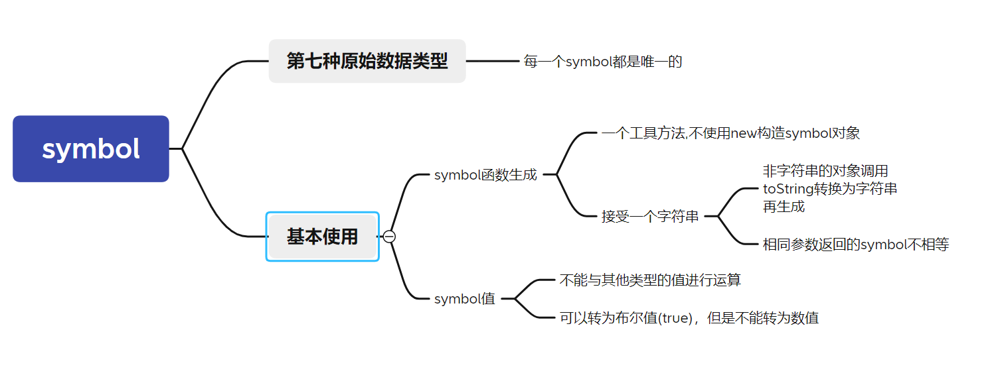
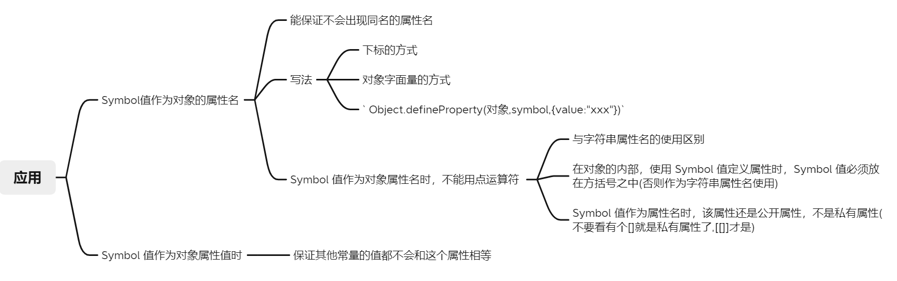

# symbol

## 引入原因

ES5 的对象属性名都是字符串，这容易造成属性名的冲突。比如，你使用了一个他人提供的对象，但又想为这个对象添加新的方法（mixin 模式），新方法的名字就有可能与现有方法产生冲突。如果有一种机制，保证每个属性的名字都是独一无二的就好了，这样就从根本上防止属性名的冲突。这就是 ES6 引入`Symbol`的原因。

ES6 引入了一种新的原始数据类型`Symbol`，表示独一无二的值。它是 JavaScript 语言的第七种数据类型，前六种是：`undefined`、`null`、布尔值（Boolean）、字符串（String）、数值（Number）、对象（Object）。



## 基本使用

> Symbol 值通过`Symbol`函数生成。这就是说，对象的属性名现在可以有两种类型，一种是原来就有的字符串，另一种就是新增的 Symbol 类型。凡是属性名属于 Symbol 类型，就都是独一无二的，可以保证不会与其他属性名产生冲突。
>
> ```js
> let s = Symbol();
> typeof s
> // "symbol"
> //上面代码中，变量s就是一个独一无二的值。typeof运算符的结果，表明变量s是 Symbol 数据类型，而不是字符串之类的其他类型。
> ```
>
> - 注意，`Symbol`函数前不能使用`new`命令，否则会报错。这是因为生成的 Symbol 是一个原始类型的值，不是对象。也就是说，由于 Symbol 值不是对象，所以不能添加属性。基本上，它是一种类似于字符串的数据类型。
>
> `Symbol`函数可以接受一个字符串作为参数，**表示对 Symbol 实例的描述**，主要是为了在控制台显示，或者转为字符串时，比较容易区分。
>
> ```js
> let s1 = Symbol('foo');
> let s2 = Symbol('bar');
> s1 // Symbol(foo)
> s2 // Symbol(bar)
> s1.toString() // "Symbol(foo)"
> s2.toString() // "Symbol(bar)"
> /*
> 上面代码中，s1和s2是两个 Symbol 值。如果不加参数，它们在控制台的输出都是Symbol()，不利于区分。有了参数以后，就等于为它们加上了描述，输出的时候就能够分清，到底是哪一个值。
> ```
>
> - 其他参数:如果 Symbol 的参数是一个对象，就会调用该对象的`toString`方法，将其转为字符串，然后才生成一个 Symbol 值。
>
>   ```js
>   const obj = {
>     toString() {
>       return 'abc';
>     }
>   };
>   const sym = Symbol(obj);
>   sym // Symbol(abc)
>   ```
>
> `Symbol`函数的参数只是表示对当前 Symbol 值的描述，因此相同参数的`Symbol`函数的返回值是不相等的。
>
> 即每一个symbol值都对应一个唯一的symbol,即使参数一样,但是symbol变量却不一样
>
> ```js
> // 没有参数的情况
> let s1 = Symbol();
> let s2 = Symbol();
> s1 === s2 // false
> // 有参数的情况
> let s1 = Symbol('foo');
> let s2 = Symbol('foo');
> s1 === s2 // false
> /*
> 上面代码中，s1和s2都是Symbol函数的返回值，而且参数相同，但是它们是不相等的。
> ```
>
> `Symbol` 值不能与其他类型的值进行运算，会报错。
>
> - ```js
>   let sym = Symbol('My symbol');
>   "your symbol is " + sym
>   // TypeError: can't convert symbol to string
>   `your symbol is ${sym}`
>   // TypeError: can't convert symbol to string
>   ```
>
> `Symbol `值也可以转为布尔值(true)，但是不能转为数值
>
> ```js
> let sym = Symbol();
> Boolean(sym) // true
> !sym  // false
> if (sym) {
>   // ...
> }
> Number(sym) // TypeError
> sym + 2 // TypeError
> ```
>
> 

## Symbol.prototype.description

`description`:symbol的内置属性,可以用于访问其描述信息

> symbol实例访问描述比较麻烦,需要转换为字符串
>
> ```js
> const sym = Symbol('foo');
> String(sym) // "Symbol(foo)"
> sym.toString() // "Symbol(foo)"
> ```
>
> 上面的用法不是很方便。[ES2019](https://github.com/tc39/proposal-Symbol-description) 提供了一个实例属性`description`，直接返回 Symbol 的描述。
>
> ```js
> const sym = Symbol('foo');
> sym.description // "foo"
> ```
>
> 

## 应用



> ## symbol值作为对象的属性名
>
> 作用:
> 由于每一个 Symbol 值都是不相等的，这意味着 Symbol 值可以作为标识符，用于对象的属性名，就能保证不会出现同名的属性。这对于一个对象由多个模块构成的情况非常有用，能防止某一个键被不小心改写或覆盖。
>
> 
>
> 写法代码示例:
>
> ```js
> let mySymbol = Symbol();
> // 第一种写法:外部方括号结构
> let a = {};
> a[mySymbol] = 'Hello!';
> // 第二种写法:内部方括号结构
> let a = {
>   [mySymbol]: 'Hello!'
> };
> // 第三种写法:Object.defineProperty
> let a = {};
> Object.defineProperty(a, mySymbol, { value: 'Hello!' });
> // 以上写法都得到同样结果
> a[mySymbol] // "Hello!"
> ```
>
>
> 注意:
>
> symbol作为属性名不能使用`.`,也不能使用`[]`加字符串表示symbol
>
> 要作为属性名使用直接`obj[symbol类型实例]`
>
> > 字符串作为属性名使用时(`obj{str:'string attribute'}`)
> >
> > - `obj.str`
> > - `obj['str']`
>
> ```js
> 		const sym=Symbol()
> 		const a={}
> 		//symbol作为属性名
> 		a[sym]="hello symbol"
> 		console.log(a.sym)//undefined
> 		//根据字符串查找,没有
> 		console.log(a[sym])//hello
> 		console.log(a['sym'])//undefined
> 		//根据字符串查找
> 		
> 		//字符串作为属性名
> 		a.sym1="hello string"
> 		console.log(a.sym1)//hello string
> 		console.log(a[sym1])//sym1 is not defined
> 		console.log(a['sym1'])//hello string
> 		
> ```
>
> 同理，在对象的内部，使用 Symbol 值定义属性时，Symbol 值必须放在方括号之中。
>
> (否则作为字符串属性名使用)
>
>
> Symbol 值作为属性名时，该属性还是公开属性，不是私有属性(不要看有个[]就是私有属性了,[[]]才是)
>
> 
>
> ## Symbol 值作为对象属性值时
>
> 可以保证其他常量的值都不会和这个属性相等,非常适合switch语句选择或者一些需要互不相同唯一属性值的对象中
>
> ```js
> const weekday{
> 	sum:Symbol()
> 	mon:Symbol()
> 	...
> }
> ```
>
> 

## 属性名的遍历

Symbol 作为属性名遍历对象时

- 不会出现在`for...in`、`for...of`循环中，

- 也不会被`Object.keys()`、`Object.getOwnPropertyNames()`、`JSON.stringify()`返回。

- `Object.getOwnPropertySymbols()`方法，可以获取指定对象的所有 Symbol 属性名。该方法返回一个数组，成员是当前对象的所有用作属性名的 Symbol 值。

  - ```js
    const obj = {};
    let a = Symbol('a');
    let b = Symbol('b');
    obj[a] = 'Hello';
    obj[b] = 'World';
    const objectSymbols = Object.getOwnPropertySymbols(obj);
    objectSymbols
    // [Symbol(a), Symbol(b)]
    ```

**通过反射**:另一个新的 API，`Reflect.ownKeys()`方法可以返回所有类型的键名，包括常规键名和 Symbol 键名。

```js
let obj = {
  [Symbol('my_key')]: 1,
  enum: 2,
  nonEnum: 3
};
Reflect.ownKeys(obj)
//  ["enum", "nonEnum", Symbol(my_key)]
```

由于以 Symbol 值作为键名，不会被常规方法遍历得到。我们可以利用这个特性，为对象定义一些非私有的、但又希望只用于内部的方法。

```js
let size = Symbol('size');
class Collection {
  constructor() {
    this[size] = 0;
  }
  add(item) {
    this[this[size]] = item;
    this[size]++;
  }
  static sizeOf(instance) {
    return instance[size];
  }
}
let x = new Collection();
Collection.sizeOf(x) // 0
x.add('foo');
Collection.sizeOf(x) // 1
Object.keys(x) // ['0']
Object.getOwnPropertyNames(x) // ['0']
Object.getOwnPropertySymbols(x) // [Symbol(size)]
```

上面代码中，对象`x`的`size`属性是一个 Symbol 值，所以`Object.keys(x)`、`Object.getOwnPropertyNames(x)`都无法获取它。这就造成了一种非私有的内部方法的效果。

## Symbol方法

`Symbol.for()`

接受一个字符串作为参数，然后搜索有没有以该参数作为名称的 Symbol 值。

- 如果有，就返回这个 Symbol 值，
- 否则就新建一个以该字符串为名称的 Symbol 值，并将其**注册到全局**。

作用:复用一个symbol值

```js
let s1 = Symbol.for('foo');
let s2 = Symbol.for('foo');
s1 === s2 // true
```

`Symbol.keyFor()`

解绑一个字符串,返回一个已登记的 Symbol 类型值的`key`。

- 有,返回
- 没有,即没有登记,返回undefined

## 内置的 Symbol 值

- 内置的 Symbol 值
  - [Symbol.hasInstance](https://www.bookstack.cn/read/es6-3rd/spilt.8.docs-symbol.md#ghvup1)
  - [Symbol.isConcatSpreadable](https://www.bookstack.cn/read/es6-3rd/spilt.8.docs-symbol.md#awgmzl)
  - [Symbol.species](https://www.bookstack.cn/read/es6-3rd/spilt.8.docs-symbol.md#uybm4)
  - [Symbol.match](https://www.bookstack.cn/read/es6-3rd/spilt.8.docs-symbol.md#6qpurb)
  - [Symbol.replace](https://www.bookstack.cn/read/es6-3rd/spilt.8.docs-symbol.md#2b0yvg)
  - [Symbol.search](https://www.bookstack.cn/read/es6-3rd/spilt.8.docs-symbol.md#fc9gcw)
  - [Symbol.split](https://www.bookstack.cn/read/es6-3rd/spilt.8.docs-symbol.md#4w2ejh)
  - [Symbol.iterator](https://www.bookstack.cn/read/es6-3rd/spilt.8.docs-symbol.md#1qwdz2)
  - [Symbol.toPrimitive](https://www.bookstack.cn/read/es6-3rd/spilt.8.docs-symbol.md#a10j0d)
  - [Symbol.toStringTag](https://www.bookstack.cn/read/es6-3rd/spilt.8.docs-symbol.md#9dwp7y)
  - [Symbol.unscopables](https://www.bookstack.cn/read/es6-3rd/spilt.8.docs-symbol.md#3lk1al)

除了定义自己使用的 Symbol 值以外，ES6 还提供了 11 个内置的 Symbol 值，指向语言内部使用的方法

### Symbol.hasInstance

对象的`Symbol.hasInstance`属性，指向一个内部方法。当其他对象使用`instanceof`运算符，判断是否为该对象的实例时，会调用这个方法。比如，`foo instanceof new Foo()`在语言内部，实际调用的是`Foo[Symbol.hasInstance](foo)`。

```js
class MyClass {
  [Symbol.hasInstance](foo) {
    return foo instanceof Array;
  }
}
[1, 2, 3] instanceof new MyClass() // true
//调用new MyClass()[Symbol.hasInstance]([1,2,3])
//[1,2,3] instanceof Array
```

> 代码示例
>
> ```js
> class Even {
>   static [Symbol.hasInstance](obj) {
>     return Number(obj) % 2 === 0;
>   }
> }
> // 等同于
> const Even = {
>   [Symbol.hasInstance](obj) {
>     return Number(obj) % 2 === 0;
>   }
> };
> 1 instanceof Even // false
> 2 instanceof Even // true
> 12345 instanceof Even // false
> ```
>
> 
