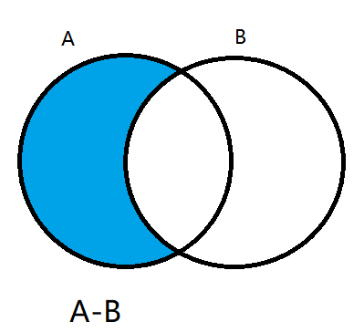

# 迭代器

遍历器（Iterator）就是一种机制。它是一种接口，为各种不同的数据结构提供统一的访问机制。任何数据结构只要部署 Iterator 接口，就可以完成遍历操作。

1) ES6 创造了一种新的遍历命令 for...of 循环，Iterator 接口主要供 for...of 消费
2. 原生具备 iterator 接口的数据(可用 for of 遍历)

  > iterator接口是什么?
  >
  > 其实就是类中的`[Symbol.iterator]`方法,其返回值是该对象的默认遍历器
  >
  > 遍历器内有next方法,返回值是value和done
  >
  > - value是对应遍历的值
  > - done为false时代表遍历未完成,为true时代表遍历完成

  ```js
  a) Array
  b) Arguments
  c) Set
  d) Map
  e) String
  f) TypedArray
  g) NodeList
  ```
3. 工作原理

  ```js
  a) 创建一个指针对象，指向当前数据结构的起始位置
  b) 第一次调用对象的 next 方法，指针自动指向数据结构的第一个成员
  c) 接下来不断调用 next 方法，指针一直往后移动，直到指向最后一个成员
  d) 每调用 next 方法返回一个包含 value 和 done 属性的对象
  ```

  注: 需要自定义遍历数据的时候，要想到迭代器。

```js
			var arr=[1,2,3];
			let ite=arr[Symbol.iterator]();
			let item;
			do{
				if(item!=undefined)
					console.log(item.value+item.done)
				item=ite.next();
			}while(!item.done)
            //1,2,3
```

## 自定义遍历对象的方法

```js
1.在对象中设置[Symbol.iterator]方法
	方法返回一个对象,其中有一个next方法
	next方法遍历对象中的数据,在遍历结束的时候返回{value:undefined,done:true}
```

>`next`方法返回一个对象，表示当前数据成员的信息。这个对象具有`value`和`done`两个属性，`value`属性返回当前位置的成员，`done`属性是一个布尔值，表示遍历是否结束，即是否还有必要再一次调用`next`方法。
>
>
>总之，调用指针对象的`next`方法，就可以遍历事先给定的数据结构。
>
>对于遍历器对象来说，`done: false`和`value: undefined`属性都是可以省略的//是默认的

例1:不省略的形式

```js
			//声明一个对象
			const banji = {
				name: "终极一班",
				stus: [
					'xiaoming',
					'xiaoning',
					'xiaotian',
					'knight'
				],
				[Symbol.iterator]() {
					//索引变量
					let index = 0;
					//引用当前对象的this
					let _this = this;
					return {
						/**
						 * 返回一个函数对象next方法
						 * next方法返回下一个遍历的对象
						 * 对象的格式是{value:xxx,done:false/true}
						 * value为undefined,done为true时,遍历结束
						 */
						next: function() {
                            //沿着作用域链查找_this,就是在上面定义的
							if (index < _this.stus.length) {
								const result = {
									value: _this.stus[index],
									done: false
								};
								//下标自增
								index++;
								//返回结果
							return result;
							} else {
								return {
									value: undefined,
									done: true
								};
							}
						}
					};
				}
			}

			//遍历这个对象 
			for (let v of banji) {
				console.log(v);
			}
```

例2:省略的形式

```js
			//声明一个对象
			const obj={
				name:'john',
				age:23,
				[Symbol.iterator](){
					let _this=this
					let count=2
					return{
						next:function(){
							if(count==2){
								count--;
								return {value:_this.name}
							}else if(count==1){
								count--;
								return {value:_this.age}
							}else{
								count--;
								return {done:true}
							}
							
						}
					}
				}
			}
			//遍历这个对象
			for(let i of obj){
				console.log(i)
			}
```

## 默认 Iterator 接口

Iterator 接口的目的，就是为所有数据结构，提供了一种统一的访问机制，即`for...of`循环（详见下文）。当使用`for...of`循环遍历某种数据结构时，该循环会自动去寻找 Iterator 接口。

一种数据结构只要部署了 Iterator 接口，我们就称这种数据结构是“可遍历的”（iterable）。

ES6 规定，默认的 Iterator 接口部署在数据结构的`Symbol.iterator`属性，或者说，一个数据结构只要具有`Symbol.iterator`属性，就可以认为是“可遍历的”（iterable）。`Symbol.iterator`属性本身是一个函数，就是当前数据结构默认的遍历器生成函数。执行这个函数，就会返回一个遍历器。至于属性名`Symbol.iterator`，它是一个表达式，返回`Symbol`对象的`iterator`属性，这是一个预定义好的、类型为 Symbol 的特殊值，所以要放在方括号内。

ES6 的有些数据结构原生具备 Iterator 接口（比如数组），即不用任何处理，就可以被`for...of`循环遍历。原因在于，这些数据结构原生部署了`Symbol.iterator`属性（详见下文），另外一些数据结构没有（比如对象,这给了我们自定义对象遍历接口的机会）。

**凡是部署了`Symbol.iterator`属性的数据结构，就称为部署了遍历器接口。**调用这个接口，就会返回一个遍历器对象。

遍历器对象中有next函数,通过next函数返回遍历的对象

**for...of遍历的本质**

```
不断调用next,直到next指向一个done为true的对象
```

> 举例说明:
>
> ```js
> let arr = ['a', 'b', 'c'];
> for(let i of arr){
> 	console.log(i);//a,b,c
> }
> ```
>
> 本质
>
> ```js
> let arr = ['a', 'b', 'c'];
> let iter = arr[Symbol.iterator]();
> let item=iter.next();
> do{
>   	if(item.done==true)break;
>     console.log(item.value)
>     item=iter.next()
> }while(item.done!=true)//a,b,c
> ```
>
> 

**原生具备 Iterator 接口的数据结构如下。**

```js
Array
Map
Set
String
TypedArray
函数的 arguments 对象
NodeList 对象
```

对于原生部署 Iterator 接口的数据结构，不用自己写遍历器生成函数，`for...of`循环会自动遍历它们。
除此之外，其他数据结构（主要是对象）的 Iterator 接口，都需要自己在`Symbol.iterator`属性上面部署，这样才会被`for...of`循环遍历。

> ## 对象没有部署遍历接口的原因
>
> 对象（Object）之所以没有默认部署 Iterator 接口，是因为对象的哪个属性先遍历，哪个属性后遍历是不确定的，需要开发者手动指定。本质上，遍历器是一种线性处理，对于任何非线性的数据结构，部署遍历器接口，就等于部署一种线性转换。不过，严格地说，对象部署遍历器接口并不是很必要，因为这时对象实际上被当作 Map 结构使用，ES5 没有 Map 结构，而 ES6 原生提供了。
>
> 
>
> ## 对象部署遍历接口
>
> 一个对象如果要具备可被`for...of`循环调用的 Iterator 接口，就必须在`Symbol.iterator`的属性上部署遍历器生成方法（原型链上的对象具有该方法也可）。
>
>
> 例子:一个类部署 Iterator 接口的写法。`Symbol.iterator`属性对应一个函数，执行后返回当前对象的遍历器对象
>
> ```js
> class RangeIterator {
>   constructor(start, stop) {
>     this.value = start;
>     this.stop = stop;
>   }
>   [Symbol.iterator]() { return this; }
>   next() {
>     var value = this.value;
>     if (value < this.stop) {
>       this.value++;
>       return {done: false, value: value};
>     }
>     return {done: true, value: undefined};
>   }
> }
> function range(start, stop) {
>   return new RangeIterator(start, stop);
> }
> for (var value of range(0, 3)) {
>   console.log(value); // 0, 1, 2
> }
> ```
>
> 例子:通过遍历器实现指针结构
>
> ```js
> function Obj(value) {
>   this.value = value;
>   this.next = null;
> }
> Obj.prototype[Symbol.iterator] = function() {
>   var iterator = { next: next };
>   var current = this;
>   function next() {
>       //next方法,并且返回当前值,指针下移
>     if (current) {
>       var value = current.value;
>       current = current.next;
>       return { done: false, value: value };
>     } else {
>       return { done: true };
>     }
>   }
>   return iterator;
> }
> var one = new Obj(1);
> var two = new Obj(2);
> var three = new Obj(3);
> one.next = two;
> two.next = three;
> for (var i of one){
>   console.log(i); // 1, 2, 3
> }
> ```
>
> 

**Iterator接口定义错误**

如果`Symbol.iterator`方法对应的不是遍历器生成函数（即会返回一个遍历器对象），解释引擎将会报错。

```
var obj = {};
obj[Symbol.iterator] = () => 1;
[...obj] // TypeError: [] is not a function
```

上面代码中，变量`obj`的`Symbol.iterator`方法对应的不是遍历器生成函数，因此报错。

**for...of原理**

在有了遍历器接口后可以使用`for...of`的形式遍历,原理类似于

>```js
>var $iterator = ITERABLE[Symbol.iterator]();
>var $result = $iterator.next();
>while (!$result.done) {
>  var x = $result.value;
>  // ...
>  $result = $iterator.next();
>}
>```
>
>

# 生成器

- 生成器其实就是一个特殊的函数
- 用于异步编程(纯回调函数:node,ajax,mongodb)

## 定义

```js
function *gen(){
	console.log(1);
}
console.log(gen)
```

## 使用

```js
			function *gen(){
				console.log(1)
			}
			var genret=gen()
			console.log(genret)
			/**
			 * gen()生成器方法返回一个迭代器对象
			 * gneret的原型链中有next方法
			 * 通过调用next方法可以调用语句
			 */
			genret.next();//1
```

在生成器方法加入yield字段,通过yield字段分割函数,可以通过next返回字段,执行语句;

> 执行到上个yield前的语句,返回当前yield

```js
			function *gen(){
				console.log(1)
				yield 'y1';
				console.log(2)
				yield 'y2';
				console.log(3)
				yield 'y3';
				console.log(4)
			}
			var genret=gen()
			console.log(genret)
			/**
			 * 添加yield字段
			 */
			console.log(genret.next());//1{value: "y1", done: false}
			console.log(genret.next());//2{value: "y2", done: false}
			console.log(genret.next());//3{value: "y3", done: false}
			console.log(genret.next());//4{value: undefined, done: true}

			genret.next();//1
```

使用for...of输出

```js
			function *gen(){
				console.log(1)
				yield 'y1';
				console.log(2)
				yield 'y2';
				console.log(3)
				yield 'y3';
				console.log(4)
			}
			for(let i of gen()){
				console.log(i+"end")
			}
```

## 生成器函数的参数

```js
         function * gen(arg){
             //生成器函数的参数,普通的接收
            console.log(arg);
            let one = yield 111;
            console.log(one);
            let two = yield 222;
            console.log(two);
            let three = yield 333;
            console.log(three);
        }

        //执行获取迭代器对象
        let iterator = gen('AAA');
        console.log(iterator.next());
        //next方法可以传入实参
		//生成器返回的迭代器.next方法的参数:第二次传入的参数将作为前一个yield语句的返回值
		//第一次传入的参数:无效
        console.log(iterator.next('BBB'));
        console.log(iterator.next('CCC'));
        console.log(iterator.next('DDD'));
```

## 生成器函数&异步编程

异步编程:

- 文件操作
- 网络操作(ajax,request)
- 数据库操作

例1:*1s 后控制台输出 111 之后 2s后输出 222  之后3s后输出 333*

```js
        setTimeout(() => {
            console.log(111);
            setTimeout(() => {
                console.log(222);
                setTimeout(() => {
                    console.log(333);
                }, 3000);
            }, 2000);
        }, 1000);
```

> setTimeout回调函数,异步实现,当时间到了再调用回调函数
>
> 如果有多重异步实现,将会产生一个回调函数,此时函数的结构比较复杂,不利于调试和修改

改进:使用生成器函数

```js
        function one(){
            setTimeout(()=>{
                console.log(111);
                iterator.next();
            },1000)
        }

        function two(){
            setTimeout(()=>{
                console.log(222);
                iterator.next();
            },2000)
        }

        function three(){
            setTimeout(()=>{
                console.log(333);
                iterator.next();
            },3000)
        }

        function * gen(){
            yield one();
            yield two();
            yield three();
        }

        //调用生成器函数
        let iterator = gen();
        iterator.next();
```

> 另一种方式
>
> ```js
> 			function* gen() {
> 				yield (()=>{
> 					setTimeout(function(){
> 						console.log(111);
> 						iterator.next();
> 					},1000)
> 				})();
> 				yield (()=>{
> 					setTimeout(function(){
> 						console.log(222);
> 						iterator.next();
> 					},2000)
> 				})();
> 				yield (()=>{
> 					setTimeout(function(){
> 						console.log(333);
> 						iterator.next();
> 					},3000)
> 				})();
> 			}
> 			let iterator=gen();
> 			iterator.next();
> ```
>
> 

例2:模拟订单

```js
        //模拟获取后 用户数据后  订单数据后  商品数据 
        function getUsers(){
            setTimeout(()=>{
                let data = '用户数据';
                //调用 next 方法, 并且将数据传入
                iterator.next(data);
            }, 1000);
        }

        function getOrders(){
            setTimeout(()=>{
                let data = '订单数据';
                iterator.next(data);
            }, 1000)
        }

        function getGoods(){
            setTimeout(()=>{
                let data = '商品数据';
                iterator.next(data);
            }, 1000)
        }

        function * gen(){
            let users = yield getUsers();
            let orders = yield getOrders();
            let goods = yield getGoods();
        }

        //调用生成器函数
        let iterator = gen();
        iterator.next();
```

# promise编程

## 基本用法

ES6中异步编程的新方案

- 语法上是一个构造函数,用于封装异步操作获取成功或者失败的结果

  - ```
    Promise(executor){}
    //executor为函数,接收两个参数resolve, reject(函数)
    //对异步结果进行处理
    ```

  - ```js
    Promise.prototype.then();
    //传入两个回调函数,一个是成功的回调函数,另一个是失败时的回调函数
    ```

  - ```
    Promise.prototype.catch();
    ```

构造函数

```js
		//实例化 Promise 对象
        const p = new Promise(function(resolve, reject){
            /*
            promise有三个状态:初始化,成功,失败
            */
            setTimeout(function(){
                //
                // let data = '数据库中的用户数据';
                // resolve
                // resolve(data);//设置p的状态为成功

                let err = '数据读取失败';
                reject(err);//设置p的状态为失败
            }, 1000);
        });

        //调用 promise 对象的 then 方法
        p.then(function(value){
            //成功时回调,接收之前resolve()方法中传递的参数
            console.log(value);
        }, function(reason){
            //失败时回调,接收reject()方法中传递的参数
            console.error(reason);
        })
```

## promise封装读取文件

```js
//1. 引入 fs 模块
const fs = require('fs');

//2. 调用方法读取文件
// fs.readFile('./resources/为学.md', (err, data) => {
//     // 参数:err错误对象,出错为错误对象;成功为null
//     //data:读取结果

//     //如果失败, 则抛出错误
//     if (err) throw err;
//     //如果没有出错, 则输出内容
//     console.log(data.toString());
// });

// 3. 使用 Promise 封装
const p = new Promise(function (resolve, reject) {
    //读取文件也是一个异步方法
    fs.readFile("./resources/为学.md", (err, data) => {
        //判断如果失败
        if (err) reject(err);
        //如果成功
        resolve(data);
    });
});

p.then(function (value) {
    console.log(value.toString());
}, function (reason) {
    console.log("读取失败!!");
});
```

## promise封装Ajax请求

```js
       const p = new Promise((resolve, reject) => {
            //1. 创建对象
            const xhr = new XMLHttpRequest();

            //2. 初始化
            xhr.open("GET", "https://api.apiopen.top/getJoke");

            //3. 发送
            xhr.send();

            //4. 绑定事件, 处理响应结果
            xhr.onreadystatechange = function () {
                //判断
                if (xhr.readyState === 4) {
                    //判断响应状态码 200-299
                    if (xhr.status >= 200 && xhr.status < 300) {
                        //表示成功
                        resolve(xhr.response);
                    } else {
                        //如果失败
                        reject(xhr.status);
                    }
                }
            }
        })
        
        //指定回调,进行成功或者失败后的数据处理和其他的一些收尾操作
        p.then(function(value){
            console.log(value);
        }, function(reason){
            console.error(reason);
        });
```

## Promise.prototype.then方法

- 指定函数回调

- 返回值?

  - then方法的返回结果是 Promise 对象, 对象状态由回调函数的返回结果决定

  - ```js
    1.如果回调函数中返回的结果是(非promise类型的属性), 状态为成功resolved/fulfilled, 返回值为对象的成功的值;
    2.如果回调函数中返回的结果是(promise类型的属性), 状态为Promise的结果;
    3.如果回调函数中返回的结果是(抛出的错误或者其他类型), 状态为rejected,返回值为抛出错误的msg或者抛出的值;
    ```

- then方法可以链式调用,

- then方法可以省略失败/成功的回调函数,可以只写一个,根据promise对象中回调函数的结果(promise对象状态)来使用then中的回调函数

  - ```js
            //创建 promise 对象
            const p = new Promise((resolve, reject) => {
                setTimeout(() => {
                    // resolve('用户数据');//promise{fulfilled,undefined}
                    // reject('出错啦');//promise{rejected,出错啦}
                }, 1000)
            });
          
            const result = p.then(value => {
                console.log(value);
            });
          
            console.log(result)
    ```

测试:

```js
        //创建 promise 对象
        const p = new Promise((resolve, reject) => {
            setTimeout(() => {
                resolve('用户数据');
                // reject('出错啦');
            }, 1000)
        });

        //调用 then 方法  
        //then方法的返回结果是 Promise 对象, 对象状态由回调函数的返回结果决定
        /* then返回结果: */
        // 1.如果回调函数中返回的结果是(非promise类型的属性), 状态为成功resolved, 返回值为对象的成功的值;
        // 2.如果回调函数中返回的结果是(promise类型的属性), 状态为Promise的结果;

        const result = p.then(value => {
            console.log(value);
            //1. 非 promise 类型的属性
            // return 'iloveyou';
            //2. 是 promise 对象
            // return new Promise((resolve, reject) => {
            //     // resolve('ok');//promise{promisestate:'fulfilled',promiseresult:'ok'}
            //     reject('error');
            // });
            // 3. 抛出错误
            // throw new Error('出错啦!');
            // throw '出错啦!';
        }, reason => {
            console.warn(reason);
        });

        console.log(result)
        //回调函数中返回undefined(不返回)promise对象:"fulfilled"
        //返回'iloveyou'返回:promise{promisestate:'fulfilled',promiseresult:'iloveyou'}

        //链式调用
        //可以省略成功的回调函数或者失败的回调函数
        // p.then(value => {

        // }).then(value => {

        // });
```

## promise读取多个文件

```js
//引入 fs 模块
const fs = require("fs");

//回调地狱
// fs.readFile('./resources/为学.md', (err, data1)=>{
//     fs.readFile('./resources/插秧诗.md', (err, data2)=>{
//         fs.readFile('./resources/观书有感.md', (err, data3)=>{
//             let result = data1 + '\r\n' +data2  +'\r\n'+ data3;
//             console.log(result);
//         });
//     });
// });

//使用 promise 实现
const p = new Promise((resolve, reject) => {
    fs.readFile("./resources/为学.md", (err, data) => {
        resolve(data);
    });
});

//上面p-resolved时:value为data
p.then(value => {
    return new Promise((resolve, reject) => {
        fs.readFile("./resources/插秧诗.md", (err, data) => {
            resolve([value, data]);
        });
    });
    //上面resolved时:value为拼接的[value,data]即[为学,插秧诗]
}).then(value => {
    return new Promise((resolve, reject) => {
        fs.readFile("./resources/观书有感.md", (err, data) => {
            //压入
            value.push(data);
            resolve(value);
        });
    })
    //上面resolved时:value为[为学,插秧诗,观书有感]的字符串数组
}).then(value => {
    //使用join方法输出
    console.log(value.join('\r\n'));
});
```

## Promise.prototype.catch()

`Promise.prototype.catch()`方法是`.then(null, rejection)`或`.then(undefined, rejection)`的别名，用于指定发生错误时的回调函数。

其实就是then方法的缩写(也有人叫then的语法糖)

```js
getJSON('/posts.json').then(function(posts) {
  // ...
}).catch(function(error) {
  // 处理 getJSON 和 前一个回调函数运行时发生的错误
  console.log('发生错误！', error);
});
```

> 上面代码中，`getJSON()`方法返回一个 Promise 对象，如果该对象状态变为`resolved`，则会调用`then()`方法指定的回调函数；如果异步操作抛出错误，状态就会变为`rejected`，就会调用`catch()`方法指定的回调函数，处理这个错误。
> 另外，`then()`方法指定的回调函数，如果运行中抛出错误，也会被`catch()`方法捕获。

# promise详细

## Promise 的含义

Promise 是异步编程的一种解决方案，比传统的解决方案——回调函数和事件——更合理和更强大。它由社区最早提出和实现，ES6 将其写进了语言标准，统一了用法，原生提供了`Promise`对象。

所谓`Promise`，简单说就是一个容器，里面保存着某个未来才会结束的事件（通常是一个异步操作）的结果。
从语法上说，Promise 是一个对象，从它可以获取异步操作的消息。Promise 提供统一的 API，各种异步操作都可以用同样的方法进行处理。

> `Promise`对象的特点:
>
> （1）对象的状态不受外界影响。`Promise`对象代表一个异步操作，有三种状态：`pending`（进行中）、`fulfilled`（已成功）和`rejected`（已失败）。只有异步操作的结果，可以决定当前是哪一种状态，任何其他操作都无法改变这个状态。这也是`Promise`这个名字的由来，它的英语意思就是“承诺”，表示其他手段无法改变。
> 
>
> （2）一旦状态改变，就不会再变，任何时候都可以得到这个结果。`Promise`对象的状态改变，只有两种可能：从`pending`变为`fulfilled`和从`pending`变为`rejected`。只要这两种情况发生，状态就凝固了，不会再变了，会一直保持这个结果，这时就称为 resolved（已定型）。如果改变已经发生了，你再对`Promise`对象添加回调函数，也会立即得到这个结果。这与事件（Event）完全不同，事件的特点是，如果你错过了它，再去监听，是得不到结果的。
>
>
> 注意，为了行文方便，本章后面的`resolved`统一只指`fulfilled`状态，不包含`rejected`状态。

优点:

- 避免回调地狱
- promise统一的接口使控制异步更加方便

缺点:

- 无法取消`Promise`，一旦新建它就会立即执行，无法中途取消。
- 如果不设置回调函数，`Promise`内部抛出的错误，不会反应到外部。
- 当处于`pending`状态时，无法得知目前进展到哪一个阶段（刚刚开始还是即将完成）。

## **Promise.allSettled**()

`Promise.allSettled()`方法接受一组 *Promise* 实例作为参数，包装成一个新的 *Promise* 实例。只有等到所有这些参数实例都返回结果，不管是`fulfilled`还是`rejected`，包装实例才会结束。该方法由 [ES2020](https://github.com/tc39/proposal-promise-allSettled) 引入。

- 返回:新的 *Promise* 实例，一旦结束，状态总是`fulfilled`，不会变成`rejected`。

- 状态变成`fulfilled`后，*Promise* 的监听函数接收到的参数是一个数组，每个成员对应一个传入`Promise.allSettled()`的 *Promise* 实例。

  - promise的监听函数,就是then的回调函数中的参数

  - ```js
    		//声明两个promise对象
            const p1 = Promise.resolve("success")
    
            const p2 = Promise.reject("failure")
    
            //调用 allsettled 方法
            const result = Promise.allSettled([p1, p2]);
            console.log(result)
    /**
    Promise { <state>: "fulfilled", <value>: (2) […] }
    <state>: "fulfilled"
    <value>: Array [ {…}, {…} ]
        0: Object { status: "fulfilled", value: "success" }
        1: Object { status: "rejected", reason: "failure" }
        length: 2
        <prototype>: Array [
    <prototype>: Promise.prototype { … }
    ```

- 对返回值的处理

  - ```js
            // 过滤成功的请求
            const suc=result.filter(p=>p.status==='fulfilled');
    
            // 过滤失败请求,并输出原因
            const reason=result.filter(p=>p.status==='rejected')
            .map(p=>p.reason);
    ```

优势:如果我们只关心一组异步操作是否完成,而不是都成功,我们可以使用这个方法

如果我们想使用`Priomise.all()`方法的话,操作比较麻烦]

[Promise.all()](https://www.bookstack.cn/read/es6-3rd/spilt.6.docs-promise.md)

```js
    const urls = [ /* ... */ ];
    const requests = urls.map(x => fetch(x));
    try {
      await Promise.all(requests);
        //有一个rejected,则Promise.all()返回的Promsie对象是rejected,则此时await抛出错误
      console.log('所有请求都成功。');
    } catch {
      console.log('至少一个请求失败，其他请求可能还没结束。');
    }]
```

# Set

ES6 提供了新的数据结构 Set（集合）。它类似于数组，但成员的值都是唯一的，集合实现了 iterator 接口，所以可以使用『扩展运算符』和『for…of…』进
行遍历，集合的属性和方法：

```js
1) size 返回集合的元素个数
2) add 增加一个新元素，返回当前集合
3) delete 删除元素，返回 boolean 值
4) has 检测集合中是否包含某个元素，返回 boolean 值
5) clear 清空集合，返回 undefined
```

## 基本使用和API

```js
        //声明一个 set
        let s = new Set();
        //接受一个可迭代数据,一般接受一个数组,且可以自动去重
        let s2 = new Set(['大事儿', '小事儿', '好事儿', '坏事儿', '小事儿']);

        //===API
        //元素个数
        // console.log(s2.size);
        //添加新的元素
        // s2.add('喜事儿');
        //删除元素
        // s2.delete('坏事儿');
        //检测
        // console.log(s2.has('糟心事'));
        //清空
        // s2.clear();
        // console.log(s2);

        //==遍历
        for (let v of s2) {
            console.log(v);
        }
```

## 集合实践

> 数组去重
>
> ```js
> 			let arr = [1,2,3,4,5,4,3,2,1];
> 			//数组去重
> 			//利用集合性质去重,...分割参数序列,新建一个数组
> 			// console.log(...new Set(arr));//1 2 3 4 5
> 			let arr1=[...new Set(arr)];
> 			console.log(arr1)//[1,2,3,4,5]
> ```
>
> 交集
>
> ```js
> 			let arr = [1,2,3,4,5,4,3,2,1];
> 			let arr2 = [4,5,6,5,6];
> 			//交集
> 			let res=[...new Set(arr)].filter(item=>{
> 				//Array->filter方法
> 				// 筛选回调函数中返回true的元素
> 				let set=new Set(arr2)
> 				if(set.has(item))return true
> 				else return false
> 				
> 			})
> 			console.log(res)//[4,5]
> ```
>
> 并集
>
> ```js
> 			let arr = [1,2,3,4,5,4,3,2,1];
> 			let arr2 = [4,5,6,5,6];
> 			//并集
> 			let res=[...new Set([...arr,...arr2])]
> 			console.log(res)//[1,2,3,4,5,6]
> ```
>
> 差集
>
> A-B:A中有的B没有的
>
> ```js
> 			let arr = [1,2,3,4,5,4,3,2,1];//1,2,3,4,5
> 			let arr2 = [4,5,6,5,6];//4,5,6
> 			//差集
> 			//123
> 			let res=arr.filter(item=>{
> 				if(arr2.indexOf(item)==-1)return true
> 				else return false
> 			})
> 			console.log(...new Set(res))//1 2 3
> ```
>
> 

# Map

ES6 提供了 Map 数据结构。它类似于对象，也是键值对的集合。

- 但是“键”的范围不限于字符串，**各种类型的值（包括对象）都可以当作键**。
- Map 也实现了iterator 接口，所以可以使用『扩展运算符』和『for…of…』进行遍历。

Map 的属性和方法：

```
1) size 返回 Map 的元素个数
2) set 增加一个新元素，返回当前 Map
3) get 返回键名对象的键值
4) has 检测 Map 中是否包含某个元素，返回 boolean 值
5) clear 清空集合，返回 undefined
```

## 基本使用

```js
        //声明 Map
        let m = new Map();

        //添加元素
        m.set('name','尚硅谷');
        m.set('change', function(){
            console.log("我们可以改变你!!");
        });
        let key = {
            school : 'ATGUIGU'
        };
        m.set(key, ['北京','上海','深圳']);

        //size
        // console.log(m.size);

        //删除
        // m.delete('name');

        //获取
        // console.log(m.get('change'));
        // console.log(m.get(key));

        //清空
        // m.clear();

        //遍历
        for(let v of m){
            console.log(v);
        }

        // console.log(m);
```

# Class类

ES6 提供了更接近传统语言的写法，引入了 Class（类）这个概念，作为对象的模板。通过 class 关键字，可以定义类。
基本上，**ES6 的 class 可以看作只是一个语法糖**，它的绝大部分功能，ES5 都可以做到，新的 class 写法只是让对象原型的写法更加清晰、更像面向对象编程的语法而已。

> 语法糖: 这种语法对语言的功能并没有影响，但是更方便程序员使用

知识点：

```
1) class 声明类
2) constructor 定义构造函数初始化
3) extends 继承父类
4) super 调用父级构造方法
5) static 定义静态方法和属性
6) 父类方法可以重写
```

## 类的原理

> 基本上就是构造函数的那一套

```js
        //手机
        function Phone(brand, price){
            this.brand = brand;
            this.price = price;
        }

        //添加原型方法
        Phone.prototype.call = function(){
            console.log("我可以打电话!!");
        }

        //实例化对象
        let Huawei = new Phone('华为', 5999);
        Huawei.call();
        console.log(Huawei);
```

**使用类实现**

```js
        //class
        class Shouji{
            //构造方法 名字不能修改
            constructor(brand, price){
                this.brand = brand;
                this.price = price;
            }

            //方法必须使用该语法, 不能使用 ES5 的对象完整形式call:function(){}
            //即对象扩展的函数简写语法
            call(){
                console.log("我可以打电话!!");
            }
        }

        let onePlus = new Shouji("1+", 1999);
```

## 类的静态成员

类比一下java的静态属性就知道了

```js
        function Phone(){

        }
		//静态属性:只由类直接访问,不是通过实例访问,不是实例属性
        Phone.name = '手机';
        Phone.change = function(){
            console.log("我可以改变世界");
        }
        Phone.prototype.size = '5.5inch';
```

类的实现

```js
class Phone(){
	static name='手机';
	static change(){console.log("change world")}
}
```


## 类的继承

使用构造函数的实现

```js
        //手机
        function Phone(brand, price){
            this.brand = brand;
            this.price = price;
        }

        Phone.prototype.call = function(){
            console.log("我可以打电话");
        }

        //智能手机
        function SmartPhone(brand, price, color, size){
            Phone.call(this, brand, price);
            this.color = color;
            this.size = size;
        }

        //设置子级构造函数的原型
        SmartPhone.prototype = new Phone;
        SmartPhone.prototype.constructor = SmartPhone;

        //声明子类的方法
        SmartPhone.prototype.photo = function(){
            console.log("我可以拍照")
        }

        SmartPhone.prototype.playGame = function(){
            console.log("我可以玩游戏");
        }

        const chuizi = new SmartPhone('锤子',2499,'黑色','5.5inch');

        console.log(chuizi);
```

使用类实现,可以更加简洁

```js
        class Phone{
            //构造方法
            constructor(brand, price){
                this.brand = brand;
                this.price = price;
            }
            //父类的成员属性
            call(){
                console.log("我可以打电话!!");
            }
        }
	
        class SmartPhone extends Phone {
            //构造方法
            constructor(brand, price, color, size){
                //调用父类的构造方法
                super(brand, price);// Phone.call(this, brand, price)
                this.color = color;
                this.size = size;
            }

            photo(){
                console.log("拍照");
            }

            playGame(){
                console.log("玩游戏");
            }

            call(){
                console.log('我可以进行视频通话');
            }
        }

        const xiaomi = new SmartPhone('小米',799,'黑色','4.7inch');
        // console.log(xiaomi);
        xiaomi.call();
        xiaomi.photo();
        xiaomi.playGame();
```

## 重写父类的方法

```js
			class Person{
				constructor(name,age){
					this.name=name;
					this.age=age;
				}
				toString(){
					return `Person{${this.name},${this.age}}`;
				}
			}
			// let p1=new Person('wff',21);
			// console.log(p1.toString())
			class Student extends Person{
				constructor(name,age,gender){
					super(name,age);
					this.gender=gender;
				}
                //在普通方法中不能使用super
				toString(){
					return `Student{${this.name},${this.age},${this.gender}}`
				}
			}
			let s1=new Student('wff',17,'male');
			console.log(s1.toString())
```

## get和set关键字

getter和setter都需要同时设置

- 在创建对象,调用构造器的时候就需要使用对应字段的getter&setter方法
- 在创建对象之外,对他的属性获取/赋值也需要使用getter&setter
- getter&setter不能对构造函数中需要交给父类处理的属性设置

进行属性的设置

```
get FieldName(){
	return FieldName;
}
set FieldName(arg...){//atleast one arg to pass
	//
}
```

> 例子
>
> ```js
> 			class Student extends Person{
> 				constructor(name,age,gender){
> 					super(name,age);
> 					this.gender=gender;
> 				}
> 				toString(){
> 					return `Student{${this.name},${this.age},${this.gender}}`
> 				}
> 				get gender(){
> 					console.log("获取gender")
> 					// return this.class
> 				}
> 				set gender(arg){
> 					this.name=arg;
> 					console.log("设置gender为"+arg)
> 				}
> 			}
> 			let s1=new Student('wff',17,'male');
> 			console.log(s1.toString())
> ```
>
> 

