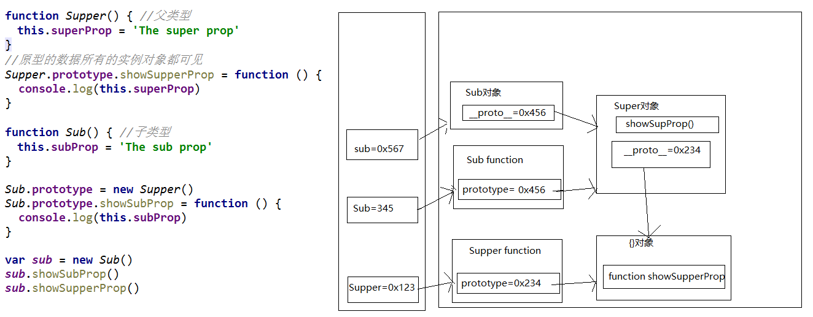
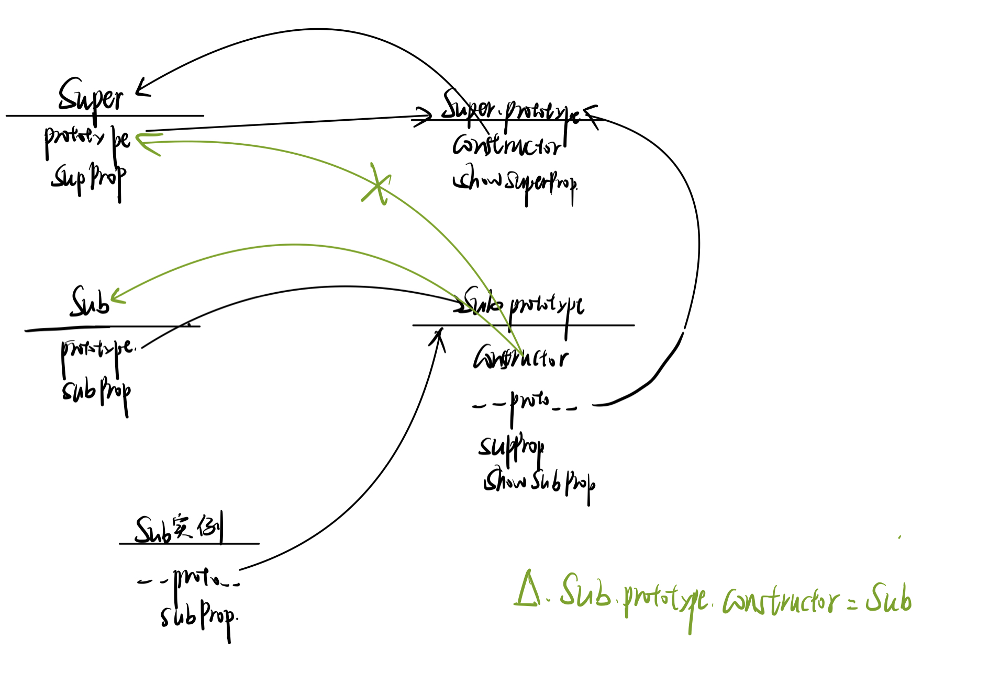

# 三、面向对象高级

>此部分要求你对前方[函数高级部分的1、原型与原型链](#1、原型与原型链)比较熟悉,如果掌握不够好理解会相对困难

## 1、对象创建模式

### Ⅰ-Object构造函数模式

>方式一: Object构造函数模式
>
> * 套路: 先创建空Object对象, 再动态添加属性/方法
> * 适用场景: 起始时不确定对象内部数据
> * 问题: 语句太多
>
>```js
>/*一个人: name:"Tom", age: 12*/
>// 先创建空Object对象
> var p = new Object()
> p = {} //此时内部数据是不确定的
> // 再动态添加属性/方法
> p.name = 'Tom'
> p.age = 12
> p.setName = function (name) {
>   this.name = name
> }
>
> //测试
> console.log(p.name, p.age)
> p.setName('Bob')
> console.log(p.name, p.age)
>```

### Ⅱ-对象字面量模式

>方式二: 对象字面量模式
>
> * 套路: 使用{}创建对象, 同时指定属性/方法
> * 适用场景: 起始时对象内部数据是确定的
> * 问题: 如果创建多个对象, 有重复代码
>
>```js
>//对象字面量模式
>var p = {
>   name: 'Tom',
>   age: 12,
>   setName: function (name) {
>     this.name = name
>   }
> }
> //测试
> console.log(p.name, p.age)
> p.setName('JACK')
> console.log(p.name, p.age)
>
> var p2 = {  //如果创建多个对象代码很重复
>   name: 'Bob',
>   age: 13,
>   setName: function (name) {
>     this.name = name
>   }
> }
>```

### Ⅲ-工厂模式

>方式三: 工厂模式
>
> * 套路: 通过工厂函数动态创建对象并返回
> * 适用场景: 需要创建多个对象
> * 问题: `对象没有一个具体的类型`, 都是Object类型
>
>```js
>//返回一个对象的函数===>工厂函数
>function createPerson(name, age) { 
> var obj = {
>   name: name,
>   age: age,
>   setName: function (name) {
>     this.name = name
>   }
> }
> return obj
>}
>
>// 创建2个人
>var p1 = createPerson('Tom', 12)
>var p2 = createPerson('Bob', 13)
>
>// p1/p2是Object类型
>
>function createStudent(name, price) {
> var obj = {
>   name: name,
>   price: price
> }
> return obj
>}
>var s = createStudent('张三', 12000)
>// s也是Object
>```

### Ⅳ-自定义构造函数模式

>方式四: 自定义构造函数模式
>
> * 套路: 自定义构造函数, 通过new创建对象
> * 适用场景: 需要创建多个`类型确定`的对象,与上方工厂模式有所对比
> * 问题: 每个对象都有相同的数据, 浪费内存
>
>```js
>//定义类型
>function Person(name, age) {
> this.name = name
> this.age = age
> this.setName = function (name) {
>   this.name = name
> }
>}
>var p1 = new Person('Tom', 12)
>p1.setName('Jack')
>console.log(p1.name, p1.age)
>console.log(p1 instanceof Person)
>
>function Student (name, price) {
> this.name = name
> this.price = price
>}
>var s = new Student('Bob', 13000)
>console.log(s instanceof Student)
>
>var p2 = new Person('JACK', 23)
>console.log(p1, p2)
>```

### Ⅴ-构造函数+原型的组合模式

>方式六: 构造函数+原型的组合模式-->`最好用这个写法`
>
> * 套路: 自定义构造函数, 属性在函数中初始化, 方法添加到原型上
> * 适用场景: 需要`创建多个类型确定`的对象
> * 放在原型上可以节省空间(只需要加载一遍方法)
>
>```js
>//在构造函数中只初始化一般函数
>function Person(name, age) { 
> this.name = name
> this.age = age
>}
>Person.prototype.setName = function (name) {
> this.name = name
>}
>
>var p1 = new Person('Tom', 23)
>var p2 = new Person('Jack', 24)
>console.log(p1, p2)
>```

## 2、继承模式

### Ⅰ-原型链继承

>方式1: 原型链继承
>
>     1. 套路
>        - 定义父类型构造函数
>        - 给父类型的原型添加方法
>        - 定义子类型的构造函数
>        - 创建父类型的对象赋值给子类型的原型
>        - `将子类型原型的构造属性设置为子类型的函数对象`
>        	-->此处有疑惑的可以看本笔记[函数高级部分的1、原型与原型链](#1、原型与原型链)
>        - 给子类型原型添加方法
>        - 创建子类型的对象: 可以调用父类型的方法
>     2. 关键
>        - `子类型的原型为父类型的一个实例对象`
>
>```js
>//父类型
>function Supper() {
>	this.supProp = '父亲的原型链'
>}
>//给父类型的原型上增加一个[showSupperProp]方法,打印自身subProp
>Supper.prototype.showSupperProp = function () {
>	console.log(this.supProp)
>}
>
>//子类型
>function Sub() {
>	this.subProp = '儿子的原型链'
>}
>
>// 子类型的原型为父类型的一个实例对象
>Sub.prototype = new Supper()
>// 让子类型的原型的constructor指向子类型
>// 如果不加,其构造函数找的[`new Supper()`]时从顶层Object继承来的构造函数,指向[`Supper()`]
>//见下面我画的图,打x的地方就是原来的指向
>Sub.prototype.constructor = Sub
>
>//给子类型的原型上增加一个[showSubProp]方法,打印自身subProp
>Sub.prototype.showSubProp = function () {
>	console.log(this.subProp)
>}
>
>var sub = new Sub()
>
>sub.showSupperProp() //父亲的原型链
>sub.showSubProp() //儿子的原型链
>console.log(sub)  
>/**
>Sub {subProp: "儿子的原型链"}
>subProp: "儿子的原型链"
>__proto__: Supper
>constructor: ƒ Sub()
>showSubProp: ƒ ()
>supProp: "父亲的原型链"
>__proto__: Object
>*/
>```

#### ① 示例图

>`注意`:此图中没有体现[`constructor构造函数 `],会在下方构造函数补充处指出
>
>
>
>

#### ② 构造函数补充

>对于代码中[`Sub.prototype.constructor = Sub`]是否有疑惑?
>
>如果不加,其构造函数找的[`new Supper()`]是从顶层Object继承来的构造函数,指向[`Supper()`],虽然如果你不加这句话,大体上使用是不受影响的,但是你有一个属性指向是错误的,如果在大型项目中万一万一哪里再调用到了呢?
>
>1. 这里可以补充一下constructor 的概念：
>
>  - `constructor 我们称为构造函数，因为它指回构造函数本身`
>  - 其作用是让某个构造函数产生的 所有实例对象（比如f） 能够找到他的构造函数（比如Fun），用法就是f.constructor
>
>2. 此时实例对象里没有constructor 这个属性，于是沿着原型链往上找到Fun.prototype 里的constructor，并指向Fun 函数本身
>
>  - constructor本就存在于原型中,指向构造函数,成为子对象后，如果该原型链中的constructor在自身没有而是在父原型中找到,所以指向父类的构造函数
>
>3. 由于这里的继承是直接改了构造函数的prototype 的指向，所以在 sub的原型链中，Sub.prototype 没有constructor 属性，反而是看到了一个super 实例
>4. 这就让sub 实例的constructor 无法使用了。为了他还能用，就在那个super 实例中手动加了一个constructor 属性，且指向Sub 函数看到了一个super 实例

### Ⅱ-借用构造函数继承(假的)

>方式2: 借用构造函数继承(假的)
>
>1. 套路:
>   - 定义父类型构造函数
>   - 定义子类型构造函数
>   - 在子类型构造函数中调用父类型构造
>2. 关键:
>   - `在子类型构造函数中通用call()调用父类型构造函数`
>3. 作用:
>
>  - 能借用父类中的构造方法,但是不灵活
>
>```js
>function Person(name, age) {
> this.name = name
> this.age = age
>}
>function Student(name, age, price) {
>  //此处利用call(),将 [Student]的this传递给Person构造函数
> Person.call(this, name, age)  // 相当于: this.Person(name, age)
> /*this.name = name
> this.age = age*/
> this.price = price
>}
>
>var s = new Student('Tom', 20, 14000)
>console.log(s.name, s.age, s.price)
>```
>
>[`Person`]中的this是动态变化的,在[`Student`]中利用[`Person.call(this, name, age)`]改变了其this指向,所以可以实现此效果

### Ⅲ-组合继承

>方式3: 原型链+借用构造函数的组合继承
>
>1. 利用原型链实现对父类型对象的方法继承
>2. 利用super()借用父类型构建函数初始化相同属性
>
>```js
>function Person(name, age) {
> this.name = name
> this.age = age
>}
>Person.prototype.setName = function (name) {
> this.name = name
>}
>
>function Student(name, age, price) {
> Person.call(this, name, age)  // 为了得到属性
> this.price = price
>}
>Student.prototype = new Person() // 为了能看到父类型的方法
>Student.prototype.constructor = Student //修正constructor属性
>Student.prototype.setPrice = function (price) {
> this.price = price
>}
>
>var s = new Student('Tom', 24, 15000)
>s.setName('Bob')
>s.setPrice(16000)
>console.log(s.name, s.age, s.price)
>```

