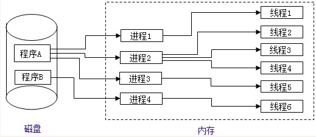
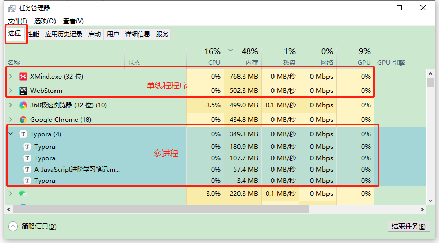
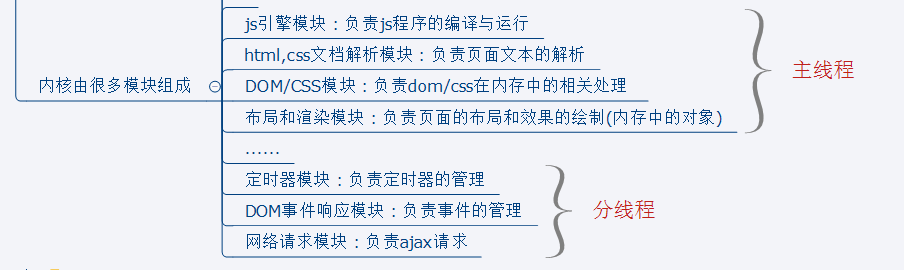
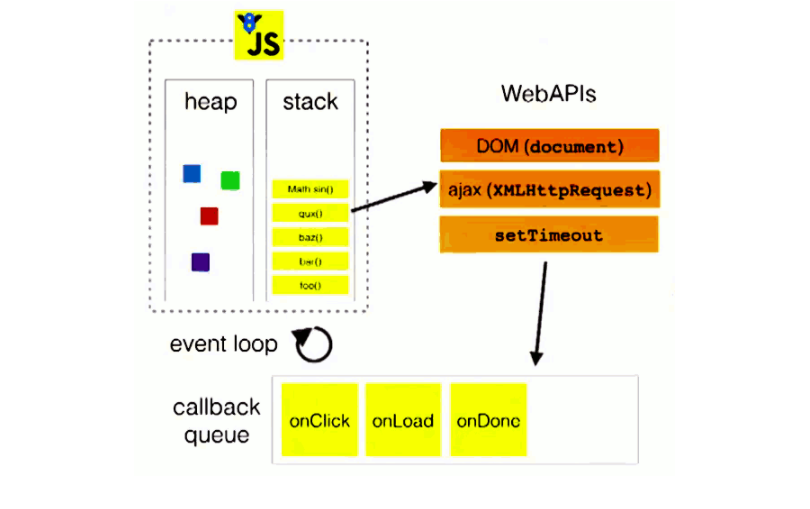
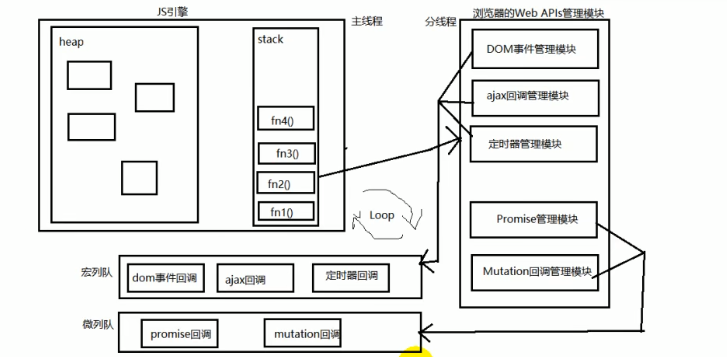

# 三、线程机制与事件机制

## 1、进程与线程

>   

### Ⅰ- 进程

>1. 程序的一次执行,它`占有一片独有的内存空间`
>2. 可以通过windows任务管理器查看进程
>
>  - 可以看出每个程序的内存空间是相互独立的
>  -  

### Ⅱ-线程

>概念:
>
>- 是进程内的一个独立执行单元
>- 是程序执行的一个完整流程
>- 是CPU的最小的调度单元

### Ⅲ-进程与线程

>1. 应用程序必须运行在某个进程的某个线程上
>2. 一个进程中至少有一个运行的线程:主线程 -->进程启动后自动创建
>3. 一个进程中也可以同时运行多个线程:此时我们会说这个程序是多线程运行的,线程之间的数据隔离,可以共用进程占用的内存
>4. 多个进程之间的数据是不能直接共享的  -->内存相互独立(隔离)
>5. `线程池(thread pool)`:保存多个线程对象的容器,实现线程对象的反复利用

### Ⅳ-引出的问题

#### ① 何为多进程与多线程?

>多进程运行: 一应用程序可以同时启动多个实例运行
>
>多线程: 在一个进程内, 同时有多个线程运行

#### ②比较单线程与多线程?

>多线程:
>
>- 优点:能有效提升CPU的利用率
>- 缺点
> - 创建多线程开销
> - 线程间切换开销
> - 死锁与状态同步问题
>
>单线程:
>
>* 优点:顺序编程简单易懂
>* 缺点:效率低

#### ③ JS是单线程还是多线程?

>`JS是单线程运行的 , 但使用H5中的 Web Workers可以多线程运行`
>
>* 只能由一个线程去操作DOM界面
>* 具体原因可看下方[3、JS是单线程的](#3、JS是单线程的)部分给出的详解

#### ④ 浏览器运行是单线程还是多线程?

>都是多线程运行的

#### ⑤ 浏览器运行是单进程还是多进程?

>有的是单进程:
>
>* firefox
>* 老版IE
>
>有的是多进程:
>
>* chrome
>* 新版IE
>
>如何查看浏览器是否是多进程运行的呢? 任务管理器-->进程

## 2、浏览器内核

>支撑浏览器运行的最核心的程序

### Ⅰ-不同浏览器的内核

>- Chrome, Safari : webkit
>- firefox : Gecko
>- IE	: Trident
>- 360,搜狗等国内浏览器: Trident + webkit

### Ⅱ-内核由什么模块组成?

>主线程
>
>1. js引擎模块 : 负责js程序的编译与运行
>2. html,css文档解析模块 : 负责页面文本的解析(拆解)
>3. dom/css模块 : 负责dom/css在内存中的相关处理
>4. 布局和渲染模块 : 负责页面的布局和效果的绘制
>5. 布局和渲染模块 : 负责页面的布局和效果的绘制
>
>分线程
>
>- 定时器模块 : 负责定时器的管理
>- 网络请求模块 : 负责服务器请求(常规/Ajax)
>- 事件响应模块 : 负责事件的管理
>
>图例
>
>

## 3、JS是单线程的

### Ⅰ-如何证明JS执行是单线程的

>* `setTimeout()的回调函数是在主线程执行的`
>* 定时器回调函数只有在运行栈中的代码全部执行完后才有可能执行
>
>```js
>// 如何证明JS执行是单线程的
>setTimeout(function () { //4. 在将[timeout 1111]弹窗关闭后,再等一秒 执行此处
>   console.log('timeout 2222')
>   alert('22222222')
> }, 2000)
> setTimeout(function () { //3. 过了一秒后 打印 timeout 1111并弹窗,此处如果不将弹窗关闭,不会继续执行上方222
>   console.log('timeout 1111')
>   alert('1111111')
> }, 1000)
> setTimeout(function () { //2. 然后打印timeout() 00000
>   console.log('timeout() 00000')
> }, 0)
> function fn() { //1. fn()
>   console.log('fn()')
> }
> fn()
>//----------------------
> console.log('alert()之前')
> alert('------') //暂停当前主线程的执行, 同时暂停计时, 点击确定后, 恢复程序执行和计时
> console.log('alert()之后')
>```
>
>流程结果:
>
>1. 先打印了[`fn()`],然后马上就打印了[`timeout() 00000`]
>2. 过了一秒后 打印 timeout 1111并弹窗,此处如果不将弹窗关闭,不会继续执行上方222
>3. 在将[timeout 1111]弹窗关闭后,`再等一秒` 执行此处
>
>  - 问:为何明明写的是2秒,却关闭上一个弹窗再过一秒就执行?
>  - 解:并不是关闭后再计算的,而是一起计算的,alert只是暂停了主线程执行

### Ⅱ-JS引擎执行代码的基本流程与代码分类

>代码分类:
>
>- 初始化代码
>- 回调代码
>
>js引擎执行代码的基本流程
>
>1. 先执行初始化代码: 包含一些特别的代码   回调函数(异步执行)[(113条消息) 前端每日一解 - setTimeout的执行顺序_settimeout执行顺序_Jackie_Snow的博客-CSDN博客](https://blog.csdn.net/Jackie_Snow/article/details/127131751)
>
> * 设置定时器
> * 绑定事件监听
> * 发送ajax请求
>
>2. 后面在某个时刻才会执行回调代码

### Ⅲ-为什么js要用单线程模式, 而不用多线程模式?

>  1. JavaScript的单线程，与它的用途有关。
>  2. 作为浏览器脚本语言，JavaScript的主要用途是与用户互动，以及操作DOM。
>  3. 这决定了它只能是单线程，否则会带来很复杂的同步问题
>     * 举个栗子:如果我们要实现更新页面上一个dom节点然后删除,用单线程是没问题的
>     * 但是如果多线程,当我删除线程先删除了dom节点,更新线程要去更新的时候就会出错

## 4、事件循环模型(Event Loop)机制

### Ⅰ-概念引出

>我们都知道，`javascript从诞生之日起就是一门单线程的非阻塞的脚本语言`。这是由其最初的用途来决定的：`与浏览器交互`。
>
>单线程意味着，javascript代码在执行的任何时候，都只有一个主线程来处理所有的任务。
>
>`非阻塞`:
>
>>而非阻塞则是当代码需要进行一项异步任务（无法立刻返回结果，需要花一定时间才能返回的任务，如I/O事件）的时候，主线程会挂起（pending）这个任务，然后在异步任务返回结果的时候再根据一定规则去执行相应的回调。
>
>`单线程是必要的`:
>
>>也是javascript这门语言的基石，原因之一在其最初也是最主要的执行环境——浏览器中，我们需要进行各种各样的dom操作。试想一下 如果javascript是多线程的，那么当两个线程同时对dom进行一项操作，例如一个向其添加事件，而另一个删除了这个dom，此时该如何处理呢？因此，为了保证不会 发生类似于这个例子中的情景，javascript选择只用一个主线程来执行代码，这样就保证了程序执行的一致性。
>
>当然，现如今人们也意识到，单线程在保证了执行顺序的同时也限制了javascript的效率，因此开发出了`web workers`技术。这项技术号称可以让javaScript成为一门多线程语言。
>
>>然而，使用web workers技术开的多线程有着诸多限制，例如：`所有新线程都受主线程的完全控制，不能独立执行`。这意味着这些“线程” 实际上应属于主线程的子线程。另外，这些子线程并没有执行I/O操作的权限，只能为主线程分担一些诸如计算等任务。所以严格来讲这些线程并没有完整的功能，也因此这项技术并非改变了javascript语言的单线程本质。
>
>可以预见，未来的javascript也会一直是一门单线程的语言。
>
>话说回来，前面提到javascript的另一个特点是“`非阻塞`”，那么javascript引擎到底是如何实现的这一点呢？
>
>>答案就是——event loop（事件循环）。
>
>**注：`虽然nodejs中的也存在与传统浏览器环境下的相似的事件循环。然而两者间却有着诸多不同，故把两者分开，单独解释`。**

### Ⅱ-浏览器环境下JS引擎的事件循环机制

#### ① 执行栈概念

>执行上下文栈详情可以看上方笔记 -->[函数高级的2、执行上下文与执行上下文栈](#2、执行上下文与执行上下文栈),此处继续进行一次概述加深理解
>
>当javascript代码执行的时候会将不同的变量存于内存中的不同位置：`堆（heap）`和`栈（stack）`中来加以区分。其中，堆里存放着一些对象。而栈中则存放着一些基础类型变量以及对象的指针。 `但是我们这里说的执行栈和上面这个栈的意义却有些不同`。
>
>`执行栈`:
>
>> 当我们调用一个方法的时候，js会生成一个与这个方法对应的执行环境（context），又叫`执行上下文`。这个执行环境中存在着这个方法的私有作用域、上层作用域的指向、方法的参数，这个作用域中定义的变量以及这个作用域的this对象。 而当一系列方法被依次调用的时候，因为js是单线程的，同一时间只能执行一个方法，于是这些方法被排队在一个单独的地方。这个地方被称为执行栈。
>
>当一个脚本第一次执行的时候，js引擎会解析这段代码，并将其中的同步代码按照执行顺序加入执行栈中，然后从头开始执行。如果当前执行的是一个方法，那么js会向执行栈中添加这个方法的执行环境，然后进入这个执行环境继续执行其中的代码。`当这个执行环境中的代码 执行完毕并返回结果后，js会退出这个执行环境并把这个执行环境销毁，回到上一个方法的执行环境`。这个过程反复进行，直到执行栈中的代码全部执行完毕。
>
>此处继续拿出栈图加深理解: 
>
>从图片可知，一个方法执行会向执行栈中加入这个方法的执行环境，在这个执行环境中还可以调用其他方法，甚至是自己，其结果不过是在执行栈中再添加一个执行环境。这个过程可以是无限进行下去的，`除非发生了栈溢出，即超过了所能使用内存的最大值`。
>
>以上的过程说的都是同步代码的执行。那么当一个异步代码（如发送ajax请求数据）执行后会如何呢？
>
>> 刚刚说过js的另一大特点是非阻塞，实现这一点的关键在于下面要说的这项机制——`事件队列（Task Queue）`。

#### ② 事件队列（Task Queue）

>JS引擎遇到一个异步事件后并不会一直等待其返回结果，而是会将这个事件挂起，继续执行执行栈中的其他任务,当一个异步事件返回结果后，js会将这个事件加入与当前执行栈不同的另一个队列，我们称之为`事件队列`。
>
>> 被放入事件队列不会立刻执行其回调，而是`等待当前执行栈中的所有任务都执行完毕， 主线程处于闲置状态时，主线程会去查找事件队列是否有任务`。如果有，那么主线程会从中取出排在第一位的事件，并把这个事件对应的回调放入执行栈中，然后执行其中的同步代码...，如此反复，`这样就形成了一个无限的循环。这就是这个过程被称为“事件循环（Event Loop）”的原因。`
>
>这里还有一张图来展示这个过程:
>
>图中的stack表示我们所说的执行栈，web apis则是代表一些异步事件，而callback queue即事件队列。
>
>以上的事件循环过程是一个宏观的表述，实际上因为异步任务之间并不相同，因此他们的执行优先级也有区别。`不同的异步任务被分为两类：微任务（micro task）和宏任务（macro task）`,此部分看下方详解

### Ⅲ-宏任务(**macro task**)与微任务(**micro task**)

> 宏任务与微任务亦属于[Ⅱ-浏览器环境下JS引擎的事件循环机制](#Ⅱ-浏览器环境下JS引擎的事件循环机制)内知识点,但本人觉得比较重要,将其提高至其知识点

#### ① 宏任务队列与微任务队列解释

>顾名思义,宏任务放至宏任务队列(`简称宏队列`)中、微任务放至微任务队列(`简称微队列`)中
>
>1. JS中用来存储待执行回调函数的队列包含2个不同特定的列队
>
>  - `宏队列`:用来保存待执行的宏任务(回调),比如:`定时器`回调/ajax回调/dom事件回调
>  - `微队列`:用来保存待执行的微任务(回调),比如:`Promise`的回调/muntation回调
>
>2. JS执行时会区别这2个队列:
>   - JS执行引擎首先必须执行所有的`初始化同步任务`代码
>   - 每次准备取出第一个`宏任务执行前`,都要将所有的`微任务`一个一个取出来执行
>
>前面我们介绍过，在一个事件循环中，异步事件返回结果后会被放到一个任务队列中。然而，根据这个异步事件的类型，这个事件实际上会被对应的宏任务队列或者微任务队列中去。并且在当前执行栈为空的时候，主线程会 查看微任务队列是否有事件存在。如果不存在，那么再去宏任务队列中取出一个事件并把对应的回到加入当前执行栈；如果存在，则会依次执行队列中事件对应的回调，直到微任务队列为空，然后去宏任务队列中取出最前面的一个事件，把对应的回调加入当前执行栈...如此反复，进入循环。
>
>我们只需记住: **`当前执行栈执行完毕时会立刻先处理所有微任务队列中的事件，然后再去宏任务队列中取出一个事件。同一次事件循环中，微任务永远在宏任务之前执行`** 
>
>换句话说:初始化同步任务>微任务>宏任务

#### ② 原理图

> 


#### ③ 由代码逆向理解宏任务与微任务

> 代码示例
>
> ```js
> setTimeout(() => { 
>    console.log('timeout callback1（）')//立即放入宏队列
>    Promise.resolve(3).then(
>      value => { 
>        console.log('Promise onResolved3()', value)//当这个宏任务执行后 立马放入微队列,所以这个微任务执行完后下个宏任务才能执行 
>      }
>    )
>  }, 0)
> 
>  setTimeout(() => { 
>    console.log('timeout callback2（）') //立即放入宏队列,
>  }, 0)
> 
>  Promise.resolve(1).then(
>    value => { 
>      console.log('Promise onResolved1()', value)//立即放入微队列
>      setTimeout(() => {
>        console.log('timeout callback3（）', value) //立即放入宏任务
>      }, 0)
>    }
>  )
> 
>  Promise.resolve(2).then(
>    value => { 
>      console.log('Promise onResolved2()', value)//立即放入微队列
>    }
>  )
> console.log('同步代码') //同步代码立即执行
> ```
>
> 结果
>
> ```js
> '同步代码',
> 'Promise onResolved1()',
> 'Promise onResolved2()',
> 'timeout callback1（）',
> 'Promise onResolved3()',
> 'timeout callback2（）',
> 'timeout callback3（）'
> ```

