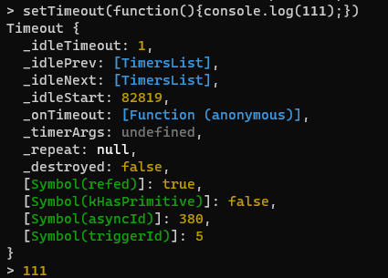
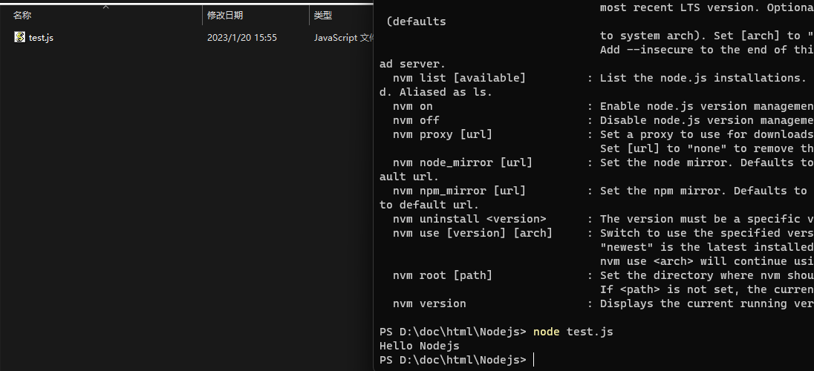

# NodeJS简介

教程:[Node.js完全指南（直播回放）李立超_哔哩哔哩_bilibili](https://www.bilibili.com/video/BV1qN4y1A7jM/?spm_id_from=333.337.search-card.all.click&vd_source=a3b7a95f2cd97322455e13ec98e4c6d4)

运行在服务器端的js,编写服务器

- 单线程服务端
- 异步处理,非阻塞
- 统一api
- 对比java(多线程,同步处理)成本小

## 安装方式

- 直接安装node

- 安装nvm(node版本管理控制)

  - ```
    nvm version
    ```

  - ```
    nvm list
    //安装的node的版本
    ```

  - ```
    nvm install 安装的版本
    ```

  - ```
    nvm node_mirror https://npmmirror.com/mirrors/node/
    //配置nvm的镜像服务器
    ```

  - ```
    nvm use 版本 - 指定要使用的node版本
    ```

    通过上面这个命令可以切换node的版本

## node使用(命令行)

**nodejs交互环境**

```
>xxx node
```

进入node环境

此时在`>`后面可以输入表达式或者js代码



退出方法:

```
>.exit
//退出node,回到盘符位置
C:\Users\twopo>
```

**node解释执行js文件**



**在vscode中解释执行**

```
ctrl+`:打开终端
输入node 文件名
解释执行
```

```
f5
选择nodejs运行,输出结果
```

**nodejs和JavaScript有什么区别**

JavaScript三剑客

```
ECMAScript（node有） DOM（node没有） BOM（node没有）
```

nodejs保留了ECMAScript的语法规范,保留一些DOM和BOM中的常用方法(其余的一些删去)

```
比如保留console.log(...)和setTimeout等方法
但是删除了alert(...)浏览器弹窗提醒等方法
```

