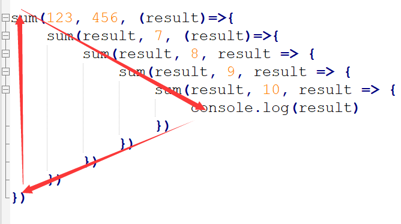
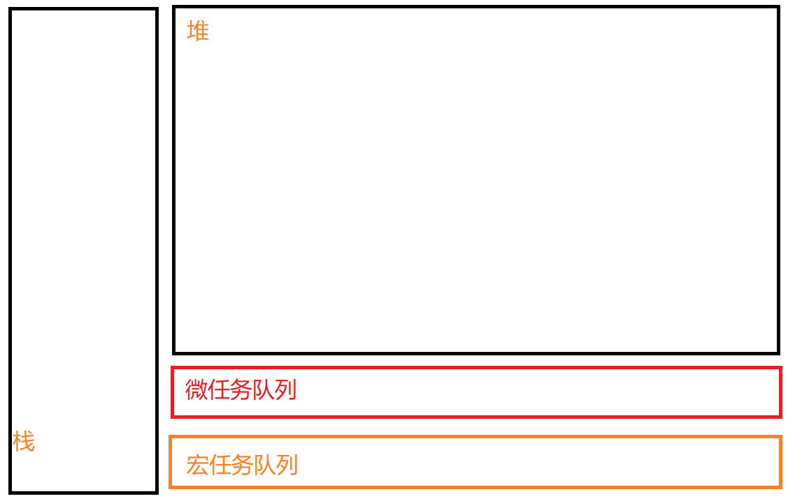

# 02异步编程&Promise

# 异步和同步

进程和线程
- 进程（厂房）
  - 程序的运行的环境
- 线程（工人）
  - 线程是实际进行运算的东西

同步
- 通常情况代码都是自上向下一行一行执行的
- 前边的代码不执行后边的代码也不会执行
- 同步的代码执行会出现阻塞的情况
- 一行代码执行慢会影响到整个程序的执行

```
1.点菜 2.厨师做菜 3.吃
//同步
吃这个动作被动作2拖慢
//多线程
点完菜后分配一个线程等待厨师做完菜
其他的线程分配执行给一些不需要等待厨师做菜的代码
等到厨师做完菜后,我们分配的通知线程通知我们吃
//如果是异步的方式?
点菜后,我们吃这个动作异步执行,等到厨师做完菜通知我们,我们在吃
我们可以先执行其他动作
```

>解决同步问题：
>- java python
>	- 通过多线程来解决
>- node.js
>	- 通过异步方式来解决

异步

- 一段代码的执行不会影响到其他的程序
- 异步的问题：
	异步的代码无法通过return来设置返回值
	
	```js
	function sum(a,b){
	    setTimeout(function(){
	        // 不能再setTimeout中返回值
	        // 调用方法接收不到
	        return a+b;
	    },1000)
	}
	
	console.log(111);
	const a=sum(1,2);
	console.log(a);
	console.log(222);
	/**
	 * 异步的问题
	 * 异步的代码无法通过return来设置返回值
	 * 不是立即返回,不能通过返回值返回(返回必须要是同步的)
	 * 111
	 * undefined:在异步函数完成前返回了结果,异步函数返回undefined给a
	 * 222
	 */
	```
	
	修改:通过回调函数返回结果
	
	```js
	function sum(a, b, cb) {
	    setTimeout(function () {
	        //异步返回值的处理?
	        //将sum的结果传递给回调函数,通过回调函数处理
	        cb(a + b);
	    }, 1000)
	}
	
	console.log(111);
	const a = sum(1, 2, sum => console.log(sum));//3
	console.log(222);
	```
- 特点：
	1.不会阻塞其他代码的执行
	2.需要通过**回调函数**来返回结果
- 基于回调函数的异步带来的问题
	1. 代码的可读性差
	2. 可调试性差
	3. 回调地狱
	   
	
	   >```js
	   >//为了处理异步函数的返回值,我们需要调用多个回调函数,比较复杂(又被称为回调函数.死亡金字塔)
	   >sum(123, 456, function (res) {
	   >    console.log(res);
	   >    sum(res, 7, function (res) {
	   >        console.log(res);
	   >        //579
	   >        //586
	   >    })
	   >})
	   >//执行顺序,从外到内
	   >```
	   >
	   >
- 解决问题：
	- 需要一个东西，可以代替回调函数来给我们返回结果
	- Promise横空出世
		- Promise是一个可以用来存储数据的对象
			Promise存储数据的方式比较特殊，
			这种特殊方式使得Promise可以用来存储异步调用的数据

# Promise

## **获取返回值的几个方法**

1.通过函数返回获取返回值(同步)
2.通过函数中的回调函数参数获取返回值(同步与异步)

- 同步调用适合使用函数返回值获取
- 异步调用必须通过调用回调函数获取返回值
- 没有考虑处理异步异常

3.promise

**问题：**

- 异步必须通过回调函数来返回结果，回调函数一多就很痛苦

### **Promise**

```
- 承诺,保证(存储一次异步操作的数据,不再修改)
- Promise可以帮助我们解决异步中的回调函数的问题
- Promise就是一个用来存储数据的容器
  它拥有着一套特殊的存取数据的方式,这个方式使得它里边可以存储异步调用的结果
- 同时也可以处理异常的情况
```

#### **构造函数**

创建Promise时，构造函数中需要一个函数作为参数(一般是箭头函数)

Promise构造函数的回调函数，它会在创建Promise时调用，调用时会有两个参数传递进去

- resolve 和 reject 是两个函数，通过这两个函数可以向Promise中存储数据
- resolve在执行正常时存储数据，reject在执行错误时存储数据(向this.PromiseState和PromiseValue写入值)
- Promise中存储的成功和失败的值是不可见的属性,可以log,但是不能直接访问
    - logPromise的时候value是undefined可能是因为Promise执行的是异步操作,log时Promise内的值还没有修改
    

```js
const promise = new Promise((resolve, reject) => {
    reject("fail");
    // throw new Error("error");
});
//当然,我们也有Promise的静态方法resolve和reject
const promise1=Promise.resolve("success");
const promise2=Promise.reject("failure");
```

优点:通过函数来向Promise中添加数据，好处就是可以用来添加异步调用的数据

#### **Promise.prototype.then()**

从Promise中读取数据
- 可以通过Promise的实例方法then来读取Promise中存储的数据
- then需要**两个回调函数**作为参数，回调函数用来获取Promise中的数据
    通过resolve存储的数据，会调用第一个函数返回，
        可以在第一个函数中编写处理数据的代码

    通过上一步reject函数存储的数据或者出现异常(抛出异常)时，会调用第二个函数返回
        可以在第二个函数中编写处理异常的代码
- then调用哪个回调函数?
    - 根据promise对象的状态是rejected还是resolved调用对应存储量数据的回调函数

```js
promise.then((result) => {
    console.log("then1\n", result);
}, (reason) => {
    console.log("then2\n", reason);
}
)
```

>注意:构造函数回调函数参数的两个参数和then中的两个回调函数参数不一样
>1.Promise构造函数的回调函数参数之参数resolve和reject是Promise创建的存储数据的函数,自动解构赋值传入
>
>
>
>2.实例对象.then方法中的两个回调函数参数使我们自己创建的,用于接收对象的promsievalue并处理的
>两个不是一共东西

#### **原理**

```js
Promise中维护了两个隐藏属性：
私有的数据,不可以直接修改
PromiseResult
    - 用来存储数据
    为什么不直接访问这个属性获取存储的数据?
        异步难的不是获取数据,而是[异步]获取数据,[异步的时机],什么时候获取数据最重要
        如果直接访问,如果人家还没有执行完/抛出异常/正在进行,则result就是undefined

PromiseState
    - 记录Promise的状态（三种状态）
        pending   （进行中,Promise创建到存储数据/抛出异常为止）
        fulfilled（完成） 通过resolve存储数据时
        rejected（拒绝，出错了） 出错了或通过reject存储数据时
    - state只能修改一次，修改以后永远不会在变
```

#### **流程**

```
	当Promise创建时，PromiseState初始值为pending，
        当通过resolve存储数据时 PromiseState 变为fulfilled（完成）
            PromiseResult变为存储的数据
        当通过reject存储数据或出错或抛出异常时 PromiseState 变为rejected（拒绝，出错了）
            PromiseResult变为存储的数据 或 异常对象(Promise{<rejected> Error: error})

    当我们通过then读取数据时，相当于为Promise设置了回调函数，
        如果PromiseState变为fulfilled，则调用then的第一个回调函数来返回数据
        如果PromiseState变为rejected，则调用then的第二个回调函数来返回数据
    注意:当我们只设置了一个回调函数时,则会报错
```

> 回调函数的执行时机:总是落后于主程序的代码(宏任务微任务)
>
> ```js
> const promise = new Promise((resolve, reject) => {
>     reject("fail");
> })
> 
> promise.then((result) => {
>     console.log("then1\n", result);
> }, (reason) => {
>     console.log("then2\n", reason);
> }
> )
> 
> console.log(111)
> ```
>
> 上述程序先输出111,再输出then2,fail

#### catch

catch() 用法和then类似，但是只需要一个回调函数作为参数

```
		catch()中的回调函数只会在Promise被拒绝时才调用
        catch() 相当于 then(null, reason => {})
        catch() 就是一个专门处理Promise异常的方法
        catch()的执行时间:写在then前面就在then前面执行,反之之后执行
```

#### finally

同样的,finally也需要一个回调函数作为参数

```
    - 无论是正常存储数据还是出现异常了，finally总会执行
    - 但是finally的回调函数中不会接收到数据
    - finally()通常用来编写一些无论成功与否都要执行的代码
```

## 异步函数

### 异步函数编写

- 直接调用异步api

  ```js
  function sum(a,b,cb){
      setTimeout(function(){
          cb(a+b);
      },1000);
  }
  sum(1,2,function(res){
      sum(3,res,function(res){
          sum(5,res,function(res){
              console.log(res);
              //回调地狱
          })
      })
  })
  ```

- 基于promise的异步处理

  ```js
  function sum(a,b){
      return new Promise((resolve,reject)=>{
          resolve(a+b);
      })
  }
  sum(1,2).then(result=>{
      console.log(result);
      //then返回promise
      return sum(3,result);
  }).then((result)=>{
      console.log(result);
      return sum(4,result);
  })
  ```

### then和catch,finally 的返回

then和catch,finally 的返回值:一个promise对象,

then (return new Promise())

- 如果什么都不不返回,默认返回一个空的Promise
- 返回一个非空的promise
- 返回字符串...,作为promise对象的result

catch

- Promise中会存储回调函数的返回值,一般就是错误信息

- ```js
  catch:处理上一个promise状态为rejected的值
  //eg1
  const promise = new Promise((resolve, reject) => {
      resolve("团结就是力量");
  })
  promise
      .then(result => "劳动最光荣")
      .catch(reason => console.log("catch:" + reason))
      .then(result => console.log("then2" + result));
  //then2劳动最光荣
  ```

- 原理:执行catch的时候,因为上一个promise状态为成功,所以catch语句中cb不执行
  then2接收的result就是then1返回的promise的值

- 后边的方法(then,catch)读取上一步的执行结果
  如果上一步的执行结果不是当前想要的结果,则跳过当前的方法(也被称呼为穿透)


finally
- finally的返回值，不会存储到新的Promise中

### 链式调用的处理机制

以promise对象的连续then为例.then对象返回新的promise对象

```js
    promise
    .then()//1
    .then()//2
    //then2处理then1返回的promise结果
    //add code
    sum(1,2).then(result=>result+3)
    .then(result=>result+4)
    .then(result=>result+5)
    .then(result=>console.log(result))
```

链式调用解决了回调地狱的问题

### catch的补充

当Promise出现异常(抛出错误)时，而整个调用链中没有出现catch，则异常会向外抛出; catch会处理上面promise中的错误
- 如果调用链中reject后有一个then处理了,则不会抛出异常
- promise内部抛出异常,但是没有catch处理,则会向外抛出
- catch内部抛出的错误本catch不处理,直接抛出,由后续的catch处理...
- 通常情况下,catch一般写在最后负责统一处理异常

### promise的then&catch穿透

```
//eg2
const promise = new Promise((resolve, reject) => {
    reject("团结不是力量");
})
promise
    .then(result => console.log("then1" + result))
    .catch(reason => console.log("catch:" + reason))
    .then(result => console.log("then2" + result));
/*
catch:团结不是力量
then2undefined
*/
```

穿透then1,执行catch和then2

## Promise的常用静态函数

**Promise.resolve()** 
创建一个立即完成的Promise

**Promise.reject()** 
创建一个立即拒绝的Promise,可以使用then的第二个回调函数读取

> 注意,这个resolve和reject是立即执行的,里面如果没有异步代码,则会和同步代码一起执行
>
> ```js
> console.log(1)
> Promise.resolve(function(){console.log(2)})
> console.log(2)
> ```
>
> 输出123

**Promise.all([...])** 
同时返回多个Promise的执行结果(放在其promiseResult中 )

- 参数:一个promise数组
- 返回:
    - 其中有一个报错，就返回错误
    - 全部成功时,才返回成功

**Promise.allSettled([...])** 
同时返回多个Promise的执行结果(无论成功或失败)

```
    {status: 'fulfilled', value: 579}
    {status: 'rejected', reason: '哈哈'}
```

- 返回值:状态成功,值为参数中的promise结果

```js
    Promise.allSettled([
        Promise.resolve("resolve1"),
        Promise.resolve("resolve2"),
        Promise.reject("reject")
    ]).then(r1 => {
        console.log("resolve:" + r1);
    }, r2 => {
        console.log("reject:" + r2);
    })
```

**Promise.race([...])** 

- 返回执行最快的Promise（不考虑对错）
- 不返回其他的Promise

```js
    Promise.race([
        Promise.resolve("resolve1"),
        Promise.resolve("resolve2"),
        Promise.reject("reject")
    ]).then(r1 => {
        console.log("resolve:" + r1);
    }, r2 => {
        console.log("reject:" + r2);
    })
    //resolve:resolve1
```

**Promise.any([...])** 

- 返回执行最快的完成的Promise(只考虑resolved的)

```js
    Promise.race([
        Promise.reject("reject"),
        Promise.resolve("resolve1"),
        Promise.resolve("resolve2"),
    ]).then(r1 => {
        console.log("resolve:" + r1);
    }, r2 => {
        console.log("reject:" + r2);
    })
    //resolve1
```

> 注意:any参数中的promise都报错时,需要catch处理

# 宏任务和微任务

在js中,代码有同步和异步之分, 异步任务的执行是落后于同步代码的, 而异步任务中的执行顺序也有先后

## **事件循环机制**

JS是单线程的，它的运行时基于事件循环机制（event loop）

- 调用栈
	- 栈:栈是一种数据结构，后进先出
	- 调用栈中，放的是要执行的代码(一般是同步代码)
- 任务队列
	- 队列
		- 队列是一种数据结构，先进先出
	- 任务队列的是将要执行的代码
	- 当调用栈中的代码执行完毕后，队列中的代码才会按照顺序依次进入到栈中执行
	- 在JS中任务队列有两种
		- 宏任务队列 （大部分代码都去宏任务队列中去排队,早期为异步函数配置的）
		- 微任务队列 （Promise的回调函数（then、catch、finally）,为Promise的回调函数配置的）
	- 整个流程
		① 执行调用栈中的代码
		② 执行微任务队列中的所有任务
		③ 执行宏任务队列中的所有任务
		微任务的执行优先级是大于宏任务的
		

##  **Promise的执行原理**


     	- Promise创建时,状态变为pending(创建时不会将构造函数的函数参数内的代码加入微任务队列)
        - then方法就相当于给Promise了回调函数
          resolve时Promise的状态从pending 变为 fulfilled时，
          then的回调函数会被放入到任务队列的微任务队列中

## **queueMicrotask()** 

- 参数:函数参数(函数,IIFE,箭头函数)
- 用来向微任务队列中添加一个任务

## **执行顺序**

1) 微任务宏任务同步代码

```
setTimeout(function () {
    console.log(1);
}, 1000)
Promise.resolve("2").then((result) => console.log(result))

console.log(3)
```

- 输出`3 2 1`
- 1加入宏任务队列, 2加入微任务队列,3执行
- 同步代码3先输出,then弹出微任务队列,输出2;最后setTimeout弹出宏任务队列,输出1

2. 微任务中的宏任务

```
setTimeout(function () {
    console.log(1);
}, 1000)

Promise.resolve("2").then((result) => console.log(result))

Promise.resolve("3").then((result) => {
    setTimeout(() => { console.log(4) }, 1000);
    console.log(result)
})

console.log(5)
```

- 输出`5 2 3 1 4`

- 1宏,2微,3then微,5执行

- 5输出;2弹出微,输出2;3then弹出,加入4进宏任务队列,其后面的log输出3;1弹出宏,输出1

- 4弹出宏,输出4

- > 总结:微任务内的宏任务也需要加入宏任务队列,其内部的其他代码加入微任务队列

```js
Promise.resolve(1).then((result)=>{
    //挂载到微任务队列中
    setTimeout((>{
        //挂载到宏任务队列中
        console.log(result);
    })
})

queueMicrotask(()=>{
    //加入micro队列中
    console.log(2)
})

//2 1
```

```js
Promise.resolve(1).then((result)=>{//t1
    Promise.resolve().then()=>{//t2
        console.log(1)
    }
})

queueMicrotask(()=>{//t3
    //加入micro队列中
    console.log(2)
})

//2 1?为什么
开始加入t1,t3
执行t1,加入t2
执行t3
执行t2
```

练习:

```js
// 阅读下列代码，并说出执行结果：

console.log(1);

setTimeout(() => console.log(2));

Promise.resolve().then(() => console.log(3));

Promise.resolve().then(() => setTimeout(() => console.log(4)));

Promise.resolve().then(() => console.log(5));

setTimeout(() => console.log(6));

console.log(7);
    // 1,7,3,5,2,4,6
    //正确答案:1,7,3,5,2,6,4
    //原因就是t4加入宏任务队列的时间晚于t6,所以4在6后面输出
```

# 手写Promise

## 第一版:

```js
const PROMISE_STATE = {
    PENDING: 0,
    FULFILLED: 1,
    REJECTED: 2
}

class MyPromise {
    #result;
    #state = PROMISE_STATE.PENDING;
    constructor(executor) {
        //私有属性#name,在类中需要使用this.#name访问
        executor(this.#resolve.bind(this), this.#reject.bind(this));
        //调用bind后生成一个以参数为this的方法并返回
    }

    #resolve(value) {
        // console.log(this);
        // console.log(value);
        if (this.#state !== 0) return;
        //promise存储数据只能调用一次,调用后修改状态,不再允许修改
        this.#result = value;
        this.#state = 1;
        //这个地方的this为undefined,是newPromise对象
        //resolve以函数形式调用
        /*
        executor(this.#resolve, this.#reject)
        解决方式1:使用箭头函数
        私有的箭头函数会存放到实例中
        箭头函数的this是定义时的所在对象,外层代码块的this
        #resolve=(value)=>{
            this//指向本次新建的promise对象
        }
        解决方式2:使用bind在给函数传入参数的时候,绑定函数的this为当前对象的this
        使用普通的函数的时候,私有函数存储到原型中
        executor(this.#resolve.bind(this), this.#reject.bind(this))
        */
    }

    #reject(value) {

    }

    then(onFulfilled, onRejected) {
        //传入两个函数
        // if (this.#state === 0) {
        //     queueMicrotask(() => {
        //         if (this.#state === 1) {
        //             //执行输出
        //             onFulfilled(this.#result);
        //         }
        //     })
        // } else 
        if (this.#state === 1) {
            onFulfilled(this.#result);
        }
    }

}

const p = new MyPromise((resolve, reject) => {
    //{}:this指向
    // console.log(globalThis === this);//false
    console.log("调用构造函数");
    resolve("孙悟空")//1
    // setTimeout(() => {
    //     resolve("孙悟空");
    // })
    //此时resolv方法内部的this就是上一级箭头函数的this,这个this是一个空对象,所以什么也不能调用

})

p.then((result) => {
    console.log("then:" + result);
})
```

## 遇到的问题

### 构造函数中传入一个回调函数的分析

根据原来的promise

```js
new Promise((resolve,reject)=>{
	//code
	resolve("xxx");/reject("xxx")
})
```

我们需要向promise中传入一个函数参数, 这个函数参数负责调用resolve和reject存储数据
这个resolve和reject是需要构造器自动传入的,而不是我们自己给赋值的
也就是说:我们需要在类构造器的代码中调用这个函数并传入resolve和reject

```js
    constructor(executor) {
        //类中函数的this,就是调用者的this
        //私有属性#name,在类中需要使用this.#name访问
        executor(this.#resolve.bind(this), this.#reject.bind(this));
        //bind->调用bind后生成一个以调用者为this的方法并返回
    }
```

### 函数参数为什么需要绑定this?

因为外层调用者定义的箭头函数的this默认指向一个定义时的空对象,所以此时进入executor中执行`resolve`则找不到这个其属性

```js
class clazz {
    #result
    constructor(executor) {
        //1:传入参数并调用
        executor(this.#resolve, this.#reject);//2调用,进入箭头函数中
    }
    #resolve(value) {
        //5this为{},找不到#result
        //报错
        this.#result = value;
    }
    #reject(value) {
        this.#result = value;
    }
}
new clazz((resolve, reject) => {
    //3,箭头函数内部this为{}
    //调用者this
    resolve("123");//4进入resolve函数
})
```

所以我们需要一个绑定好了调用者的函数方法作为参数传入,这样在调用resolve时, 调用者就不是箭头函数的this而是新建promise的this

```js
class clazz {
    #result
    constructor(executor) {
        executor(this.#resolve.bind(this), this.#reject(this));
    }
    #resolve(value) {
        this.#result = value;
    }
    #reject(value) {
        this.#result = value;
    }
}
new clazz((resolve, reject) => {
    resolve("123");
})
```

### 不绑定this我们可以定义内部箭头函数

内部箭头函数的this始终指向新建的promise,此时则不用担心调用resolve时的this是箭头函数中的this

```js
class clazz {
    #result
    constructor(executor) {
        //1:传入参数并调用
        executor(this.#resolve, this.#reject);//2调用,进入箭头函数中
    }
    #resolve=(value)=> {
        //5this为promise对象,可以得到#result
        //成功
        this.#result = value;
    }
    #reject=(value)=> {
        this.#result = value;
    }
}
new clazz((resolve, reject) => {
    //3,箭头函数内部this为{}
    //调用者this
    resolve("123");//4进入resolve函数
})
```

### 回调函数和箭头函数的this

回调函数可以由普通定义的函数和箭头函数组成

普通定义函数中的this就是调用回调函数的对象

而箭头函数中的this是定义时的所在对象

```js
//Nodejs
let func = () => {
    console.log(typeof this);
}
func();
//object {}
/**
 * NodeJs
 * 箭头函数中的this，指箭头函数位置上所在类的对象
 * 如果箭头函数定义在全局位置,则箭头函数的this指向一个空对象{}
 * JavaScript
 * 如果箭头函数定义在全局位置,则箭头函数的this指向window
 */
//es6
    <script>
        let func = () => {
            console.log(this);
        }
        func();
		//window
    </script>
```

## 第二版:

```js
/* 
    定义类的思路
        1. 先把功能都分析清楚了，在动手
        2. 写一点想一点，走一步看一步
*/

const PROMISE_STATE = {
    PENDING: 0,
    FULFILLED: 1,
    REJECTED: 2
}

class MyPromise {

    // 创建一个变量用来存储Promise的结果
    #result
    // 创建一个变量来记录Promise的状态
    #state = PROMISE_STATE.PENDING //pending 0 fulfilled 1 rejected 2

    // 创建一个变量来存储回调函数
    #callback

    constructor(executor) {
        // 接收一个 执行器 作为参数
        executor(this.#resolve.bind(this), this.#reject.bind(this)) // 调用回调函数
    }

    // 私有的resolve() 用来存储成功的数据
    #resolve(value) {
        // 禁止值被重复修改
        // 如果state不等于0，说明值已经被修改 函数直接返回
        if (this.#state !== PROMISE_STATE.PENDING) return

        this.#result = value
        this.#state = PROMISE_STATE.FULFILLED // 数据填充成功

        // 当resolve执行时，说明数据已经进来了，需要调用then的回调函数
        this.#callback && this.#callback(this.#result)
    }

    // #resolve = () => {
    //     console.log(this)
    // }

    // 私有的reject() 用来存储拒绝的数据
    #reject(reason) { }


    // 添加一个用来读取数据的then方法
    then(onFulfilled, onRejected) {
        if(this.#state === PROMISE_STATE.PENDING){
            // 进入判断说明数据还没有进入Promise，将回调函数设置为callback的值
            this.#callback = onFulfilled
        }else if (this.#state === PROMISE_STATE.FULFILLED) {
            /* 
                目前来讲，then只能读取已经存储进Promise的数据，
                    而不能读取异步存储的数据
					读数据,只能在回调函数中调用
            */
            onFulfilled(this.#result)
        }
    }
/*
问题:
- then的回调函数，应该放入到微任务队列中执行，而不是直接调用
	- 是不彻底的异步,需要实现异步
- 后then覆盖前then的读取(在promise创建的时候,使用了异步函数
	- 错误的then
*/

}

const mp = new MyPromise((resolve, reject) => {
    setTimeout(() => {
        resolve("孙悟空")
    }, 1000)
})

mp.then((result) => {
    console.log("读取数据", result)
})


```

## 第三版

```js
/* 
    定义类的思路
        1. 先把功能都分析清楚了，在动手
        2. 写一点想一点，走一步看一步
*/

const PROMISE_STATE = {
    PENDING: 0,
    FULFILLED: 1,
    REJECTED: 2
}

class MyPromise {

    // 创建一个变量用来存储Promise的结果
    #result
    // 创建一个变量来记录Promise的状态
    #state = PROMISE_STATE.PENDING //pending 0 fulfilled 1 rejected 2

    // 创建一个变量来存储回调函数
    // 由于回调函数可能有多个，所以我们使用数组来存储回调函数
    #callbacks = []

    constructor(executor) {
        // 接收一个 执行器 作为参数
        executor(this.#resolve.bind(this), this.#reject.bind(this)) // 调用回调函数
    }

    // 私有的resolve() 用来存储成功的数据
    #resolve(value) {
        // 禁止值被重复修改
        // 如果state不等于0，说明值已经被修改 函数直接返回
        if (this.#state !== PROMISE_STATE.PENDING) return

        this.#result = value
        this.#state = PROMISE_STATE.FULFILLED // 数据填充成功

        // 当resolve执行时，说明数据已经进来了，需要调用then的回调函数
        queueMicrotask(() => {
            // 调用callbacks中的所有函数
            this.#callbacks.forEach(cb => {
                cb()
            })
        })
    }

    // #resolve = () => {
    //     console.log(this)
    // }

    // 私有的reject() 用来存储拒绝的数据
    #reject(reason) { }


    // 添加一个用来读取数据的then方法
    then(onFulfilled, onRejected) {
        if (this.#state === PROMISE_STATE.PENDING) {
            // 进入判断说明数据还没有进入Promise，将回调函数设置为callback的值
            // this.#callback = onFulfilled,为避免后then覆盖前then的读取,使用队列结构
            this.#callbacks.push(() => {
				//为什么不直接push onFulfilled(),而是使用箭头函数封装
				//因为直接传onFulfilled(),不能传入一个函数调用,我们需要异步过来的this.#result的几个不同的值
                onFulfilled(this.#result)
            })
        } else if (this.#state === PROMISE_STATE.FULFILLED) {
            /* 
                目前来讲，then只能读取已经存储进Promise的数据，
                    而不能读取异步存储的数据
            */
            // onFulfilled(this.#result)

            /* 
                then的回调函数，应该放入到微任务队列中执行，而不是直接调用
            */
            queueMicrotask(() => {
                onFulfilled(this.#result)
            })
        }
    }


}

const mp = new MyPromise((resolve, reject) => {
    setTimeout(() => {
        resolve("孙悟空")
    }, 1000)
})

mp.then((result) => {
    console.log("读取数据1", result)
})

mp.then((result) => {
    console.log("读取数据2", result)
})

mp.then((result) => {
    console.log("读取数据3", result)
})

// const p = Promise.resolve('孙悟空')

// p.then(r => console.log("第一次读", r))
// p.then(r => console.log("第二次读", r))
```

## 第四版

```js
/* 
    定义类的思路
        1. 先把功能都分析清楚了，在动手
        2. 写一点想一点，走一步看一步
*/

const PROMISE_STATE = {
    PENDING: 0,
    FULFILLED: 1,
    REJECTED: 2
}

class MyPromise {

    // 创建一个变量用来存储Promise的结果
    #result
    // 创建一个变量来记录Promise的状态
    #state = PROMISE_STATE.PENDING //pending 0 fulfilled 1 rejected 2

    // 创建一个变量来存储回调函数
    // 由于回调函数可能有多个，所以我们使用数组来存储回调函数
    #callbacks = []

    constructor(executor) {
        // 接收一个 执行器 作为参数
        executor(this.#resolve.bind(this), this.#reject.bind(this)) // 调用回调函数
    }

    // 私有的resolve() 用来存储成功的数据
    #resolve(value) {
        // 禁止值被重复修改
        // 如果state不等于0，说明值已经被修改 函数直接返回
        if (this.#state !== PROMISE_STATE.PENDING) return

        this.#result = value
        this.#state = PROMISE_STATE.FULFILLED // 数据填充成功

        // 当resolve执行时，说明数据已经进来了，需要调用then的回调函数
        queueMicrotask(() => {
            // 调用callbacks中的所有函数
            this.#callbacks.forEach(cb => {
                cb()
            })
        })
    }

    // #resolve = () => {
    //     console.log(this)
    // }

    // 私有的reject() 用来存储拒绝的数据
    #reject(reason) { }


    // 添加一个用来读取数据的then方法
    then(onFulfilled, onRejected) {

        /* 
            谁将成为then返回的新Promise中的数据？？？
                then中回调函数的返回值，会成为新的Promise中的数据
        */

        return new MyPromise((resolve, reject) => {
            if (this.#state === PROMISE_STATE.PENDING) {
                // 进入判断说明数据还没有进入Promise，将回调函数设置为callback的值
                // this.#callback = onFulfilled
                this.#callbacks.push(() => {
                    resolve(onFulfilled(this.#result))
                    
                })
            } else if (this.#state === PROMISE_STATE.FULFILLED) {
                /* 
                    目前来讲，then只能读取已经存储进Promise的数据，
                        而不能读取异步存储的数据
                */
                // onFulfilled(this.#result)

                /* 
                    then的回调函数，应该放入到微任务队列中执行，而不是直接调用
                */
                queueMicrotask(() => {
                    resolve(onFulfilled(this.#result))
                })
            }

        })
    }


}

const mp = new MyPromise((resolve, reject) => {
    setTimeout(() => {
        resolve("孙悟空")
    }, 1000)
})

mp.then((result) => {
    console.log("读取数据1", result)
    return "猪八戒"
}).then(r => {
    console.log("读取数据2", r)
    return "沙和尚"
}).then(r => {
    console.log("读取数据3", r)
})


// const p = Promise.resolve('孙悟空')

// p.then(r => console.log("第一次读", r))
// p.then(r => console.log("第二次读", r))
```

# async&await

通过async快速创建异步函数

通过async可以来创建一个异步函数
    异步函数的返回值会自动封装到一个Promise中返回

在async声明的异步函数中可以使用await关键字来调用异步函数

```js
async function fn1() {
    return 2;
}
//相当于在then中调用异步函数,
fn1().then((result) => {
    console.log(result);//2
    //读取promise_resolve时的result
})
```

当我们通过await去调用异步函数时，它会暂停代码的运行
直到异步代码执行有结果时，才会将结果返回
await可以获取异步代码的执行结果并返回(比如promise的result)

await阻塞了什么?阻塞了函数内部后面的代码
    注意 await只能用于 async声明的异步函数中，或es模块的顶级作用域(是什么?)中
    await阻塞的异步函数内部的代码，不会影响外部代码(相当于把async函数挂起至队列)

通过await调用异步代码时，需要通过try-catch来处理异常

```js
function sum(a, b) {
    return new Promise(resolve => {
        setTimeout(() => {
            resolve(a + b)
        }, 2000);
    })
}

async function fn3() {
    // sum(123, 456)
    //     .then(r => sum(r, 8))
    //     .then(r => sum(r, 9))
    //     .then(r => console.log(r))


    try {
        let result = await sum(123, 456)
        result = await sum(result, 8)
        result = await sum(result, 9)
        console.log(result)
    } catch (e) {
        console.log("出错了~~")
    }

}
```

如果async声明的函数中没有写await，那么它里边就会依次执行
也不会加入微任务队列

```js
async function fn() {
    console.log(2);
    console.log(3);
    console.log(4);
}
console.log(1);
fn();
console.log(5);
//输出:12345

function fn5(){
    return new Promise(resolve => {
        console.log(1)
        console.log(2)
        console.log(3)
        resolve()
    })
} 
//fn等价于fn5,输出也是12345
```

当我们使用await调用函数后，
当前函数后边的所有代码会在await当前函数执行完毕后，被放入到微任务队里中
[就相当于将await后面的代码放到一个promise的then语句中]

> await行的代码不受影响,该怎么执行怎么执行

```js
//code
async function fn() {
    console.log(2);
    await console.log(3);
    console.log(4);
}
console.log(1);

fn();

console.log(5);
//12534?
//12354
//3正常执行,4进入微任务队列,从3后开始挂载到微任务队列中

//上面的fn相当于
function fn(){
    return new Promise(resolve=>{
        console.log(1);
        console.log(2)
    }).then(r=>{
        console.log(3)
    })
}
```

```js
//eg2
async function fn() {
    console.log(1);
    await console.log(2);
    await console.log(3);
    console.log(4)
}
相当于
function fn(){
    return new Promise(resolve=>{
        console.log(1);
        console.log(2);
    }).then(r=>{
        console.log(3)
    }).then(r=>{
        console.log(4)
    })
}
```

问题就是,await作用于同步代码中,此时执行的也是同步顺序(本行立即执行),而其之后的代码是异步加入微任务队列的
如果await作用于异步代码,异步按照异步的机制执行

```js
function sum(a, b) {
    return new Promise(resolve => {
        setTimeout(()  => {
            resolve(a + b)
        }, 2000);
    })
}

console.log(1);
async function fn() {
    sum(0, 2).then(result => { console.log(result) });
    let result = await sum(0, 3);
    console.log(result);
}
fn();

console.log(4);
//1,4,2,3
```

**await可以使用的地方**

es模块的顶级作用域[顶级模块作用域]
不是nodejs代码的顶级作用域,只能是模块

```html
<script type="module">
    await console.log(123)
</script>
```

声明模块,await在模块中使用
await.mjs nodejs中创建模块的文件名
    await console.log(123)

在nodejs文件中,使用非模块的await
使用立即执行的箭头异步函数

```js
;(async () => {
    await console.log("哈哈")
})()
//IIFE需要加一个分号与前面区别,以便编译器给他们自动加分号区别
```

总结:async&await
- 本质上是promise的语法糖,同时也是Promise的替代写法
- 可以使用同步方式写异步代码,更加清楚
