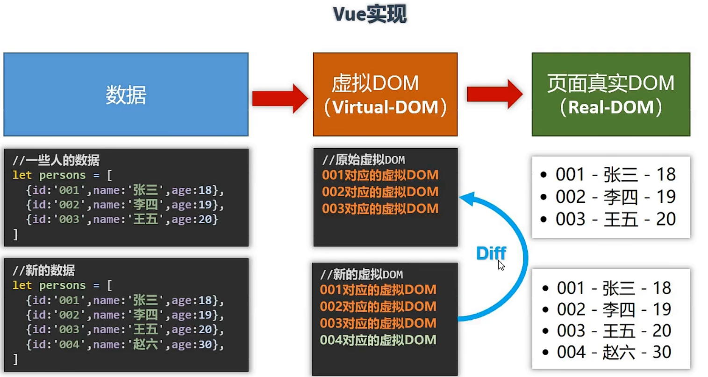
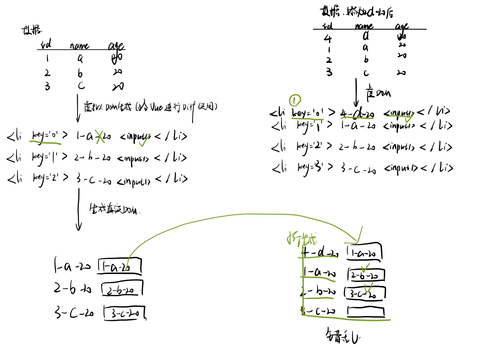
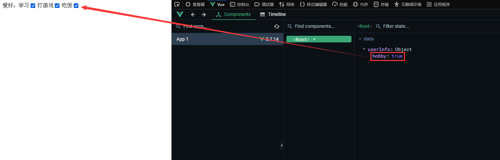

# vue

一个用于开发用户界面的渐进式js轻量框架(集成了angular和react的优点)

## 特点

组件化<sup>1</sup>

声明式编码<sup>2</sup>

虚拟dom+diff算法<sup>3</sup>

<hr/>

1. 组件化

模块化界面, 一个`.vue`文件统合了`html,css,js`

2. 声明式编码

区别于命令式编码

> 

3. 虚拟dom+diff算法,提高dom节点的复用率

> 
>
> 虚拟dom节点存放在内存中, 适合用来快速的进行diff比较, 相同的保留, 不同的进行局部更新
>
> 但是如果使用js的话, 会直接替换所有的real-dom节点为新的real-dom

# Vue安装

使用script标签引入<sup>[2]</sup>

vue同jq一样有两个版本, 一个是开发版本：体积比较大，包含许多警告和提示信息(300+kb);另一个是生产版本，去除警告提示(30+kb), 我们在开发时选择开发版本<sup>[1]</sup>，在上线至服务器的时候就选择生产版本。同样的，我们在引入vue后拥有一个函数对象`Vue`，我们可以使用Vue进行函数调用(构造函数)或者属性配置。

<hr>

[1]开发版本使用的时候会有一个productionTip在console中显示,我们一般将其关闭

```js
Vue.config.productionTip = false;
//关闭使用开发版本的生产提示
```

[2]我们可以选择下载或者使用cdn加速链接

```html
<script src="https://cdn.jsdelivr.net/npm/vue@2.7.14/dist/vue.js"></script>
<!--这是开发版本的-->
```

<hr>

# Hello Vue

## 基本步骤

创建一个Vue实例<sup>[1]</sup>，绑定Vue容器<sup>[2]</sup>, 在Vue容器中使用Vue插值语法实现Hello Vue的显示<sup>[3]</sup>

[1]Vue实例,使用Vue构造函数new出来的Vue实例对象

```js
        new Vue({//配置对象,同axios和ajax,不需要使用变量接收,只需要绑定容器即可调用
            el: '#root',
            //el用于指定当前Vue实例为哪个容器服务，值通常为css选择器字符串
            //也可以是一个dom查询出来的dom对象

            data: {
                //data中用于存储数据，数据供el所指定的容器去使用，值我们暂时先写成一个对象
                //后面会写成函数
                name: 'Vue'

            }
        })
```

[2]Vue容器,也被称呼为Vue模板

```html
    <div id="root">
        <h1>hello,{{name}}</h1>
    </div>
```

[3]Vue的工作流程

**Vue实例:**

1. Vue实例首先根据el属性接收Vue模板
2. 解析Vue模板中的插值语法并在data属性中查找是否存在这个值,有则替换并生成新的Vue模板
3. 更具原来的Vue模板将新生成的放回[挂载]原位置

略去了使用dom修改值的操作

**Vue容器:**

1. 为Vue提供模板,使用Vue语法,为Vue解析后的生成模板提供定位

容器里的代码被称为【Vue模板】

两者的关系:

1. Vue实例和容器是一一对应^[1]^的
2. 真实开发中只有一个Vue实例，并且会配合着组件^[2]^一起使用

> [1] 1对1
>
> 解释:
>
> 1. 去一对多:如果存在两个id为root的容器绑定同一个实例, 则只有前一个root容器的vue语法可以生效
>    
>
> 2. 去多对一:如果存在同一个id为root的容器绑定两个Vue实例, 则只有前一个vue实例绑定的属性可以生效
>    
>
> 所以说, vue实例和容器是1对1的
>
> 
>
> [2]配合组件使用
>
> 通俗的说,组件就是vue实例的手下, 用于组合管理容器需要的vue值

<hr>

## 插值语法

`{{xxx}}`中的xxx要写js表达式，且xxx可以自动读取到data中的所有属性。一旦data中的数据发生改变，那么页面中用到该数据的地方也会自动更新。可以使用VueDevTool查看data中的属性。

```js
注意区分：js表达式 和 js代码(语句)
1.表达式：一个表达式会产生一个值，可以放在任何一个需要值的地方：
(1). a
(2). a+b
(3). demo(1)
(4). x === y ? 'a' : 'b'

2.js代码(语句)
(1). if(){}
(2). for(){}
```

举一个例子：

```html
		<div id="demo">
			<h1>Hello，{{name.toUpperCase()}}，{{address}}</h1>
            <!--调用函数也返回一个值,此处返回name的大写WORLD-->
		</div>
		<script>
			new Vue({
                el:"#demo",
                data:{
                    name:"world",
                    address:"!"
                }
            })
		</script>
```

> 

# 模板语法

Vue模板语法包括两大类


**1**. 插值语法
功能：用于解析标签体内容
写法：`{{xxx}}`，`xxx `是 js 表达式，可以直接读取到 data 中的所有区域

**2**. 指令语法 
功能：用于解析标签（包括：标签属性、<u>标签体</u>内容、绑定事件…）
举例：``<a v-bind:href="xxx">``或简写为`<a :href="xxx">`，`xxx` 同样要写 js 表达式，可以直接读取到 data 中的所有属性
备注：Vue中有很多的指令，且形式都是` v-xxx`，此处只是拿`v-bind`举例^[1]^

[1] `v-bind`,将`""`属性值部分的内容当成表达式执行,可以绑定任意属性执行(包括自定义属性),`v-bind:`简写为`:`

```html
<a v-bind:href="tencent.url.toUpperCase()" :x="tencent.name">点我去看{{ tencent.name }}1</a>
```

x为自定义属性

```html
<!DOCTYPE html>
<html>
  <head>
    <meta charset="UTF-8" />
    <title>模板语法</title>
    <!-- 引入Vue -->
    <script type="text/javascript" src="../js/vue.js"></script>
  </head>
  <body>

    <div id="root">
      <h2>插值语法</h2>
      <h4>你好，{{ name }}</h4>
      <hr />
      <h2>指令语法</h2>
      <a v-bind:href="tencent.url.toUpperCase()" x="hello">点我去看{{ tencent.name }}1</a>
      <a :href="tencent.url" x="hello">点我去看{{ tencent.name }}2</a>
    </div>
  </body>

  <script type="text/javascript">
    Vue.config.productionTip = false //阻止 vue 在启动时生成生产提示。

    new Vue({
      el: '#root',
      data: {
        name: 'jack',
        tencent: {
          name: '开端',
            <!--通过新建一个对象来区分不同的name-->
          url: 'https://v.qq.com/x/cover/mzc00200mp8vo9b/n0041aa087e.html',
        }
      }
    })
  </script>
</html>
```

# 数据绑定

Vue中有2种数据绑定的方式

a. 单向绑定v-bind数据只能从 data 流向页面^[1]^
b. 双向绑定v-model数据不仅能从 data 流向页面，还可以从页面流向 data^[2]^

[1]
也就是只能从Vue中的data流向html,但是不能从html流向Vue中

[2]
双向绑定只能绑定在`ContentEditable`的元素上
a. 双向绑定一般都应用在表单类元素上，如 `<input><select><textarea>`等
b. v-model:value可以简写为v-model，因为v-model默认收集的就是value值

```html
<!DOCTYPE html>
<html>
  <head>
    <meta charset="UTF-8" />
    <title>数据绑定</title>
    <!-- 引入Vue -->
    <script type="text/javascript" src="../js/vue.js"></script>
  </head>
  <body>
    
    <div id="root">
      <!-- 普通写法 -->
      <!-- 单向数据绑定：<input type="text" v-bind:value="name"><br/> -->
			<!-- 双向数据绑定：<input type="text" v-model:value="name"><br/> -->

      <!-- 简写 -->
      单向数据绑定：<input type="text" :value="name"><br/>
      双向数据绑定：<input type="text" v-model="name"><br/>

      <!-- 如下代码是错误的，因为 v-model 只能应用在表单类元素（输入类元素）上 ,h2是不可被编辑的-->
      <!-- <h2 v-model:x="name">你好啊</h2> -->
    </div>
    
      <script type="text/javascript">
    Vue.config.productionTip = false // 阻止 vue 在启动时生成生产提示。

    new Vue({
      el: '#root',
      data: {
        name: 'cess'
      }
    })
  </script>
  </body>
</html>
```

# el 与 data 的两种写法

el有2种写法
a.创建Vue实例对象的时候配置el属性
b.先创建Vue实例，随后再通过vm.$mount('#root')指定el的值<sup>[1]</sup>

data有2种写法
a对象式：`data： { }`
b函数式：`data() { return { } }`
如何选择：目前哪种写法都可以，以后到组件时，data必须使用函数<sup>[2]</sup>，否则会报错<sup>[3]</sup>

[1]$mount,原型对象上的方法
mount:挂载,将vue实例挂载到vue容器上

```js
vueobj.$mount("#root");
```

优点:更加灵活(可以自由指定配置el属性绑定vue容器的时间)

```js
setTimeout(()=>{
	vueobj.$mount("#root");
},1000)
```

总结:

```js
// el的两种写法
 const v = new Vue({
 	//el:'#root', // 第一种写法
 	data: {
 		name:'cess'
 	}
 })
 v.$mount('#root') // 第二种写法
```

[2]一个重要的原则
由Vue管理的函数，一定不要写箭头函数，否则 this 就不再是Vue实例了

`data:()=>{console.log(this);//定义时的this就是外层的window},箭头函数的this向上一级作用域中查找`

函数式的data写法

```js
new Vue(){
	el:"#root",
	//data:{name:"Emiya"}
	data(){//ES6中的函数式简写
		console.log(this);//Vue对象
		retrun{
			name:"Emiya"
		}
	}
}
```

# MVVM 模型


MVVM模型<sup>[1]</sup>
● M：模型 Model，data中的数据<sup>[2]</sup>
● V：视图 View，模板代码
● VM：视图模型 ViewModel，Vue实例

[1]
流动关系:数据通过绑定从model流向view, 而view输入框中的数据通过DOM监听也可以流向model

[2]
data中的数据通过数据代理流向model

观察发现
●data-Model中所有的属性，最后都出现在了vm身上,成为vm实例的属性,因此可以在`{{}}`中直接使用
●vm身上所有的属性 及Vue原型身上所有的属性，在 Vue模板中都可以直接使用

```html
    <div id="root">
        <h2>名称：{{ name }}</h2>
        <h2>战队：{{ rank }}</h2>
        <h2>测试：{{ $options }}</h2>
    </div>

    <script>
        Vue.config.productionTip = false
        new Vue({
            el: '#root',
            data: { 
                name: 'uzi',
                rank: 'RNG'
            }
        })
    </script>
```

# Vue 中的数据代理

## Object.defineproperty方法

```js
let number = 18
let person = {
  name: '张三',
  sex: '男',
  //在字面量写法中设置的键值对可以被修改删除遍历
}

Object.defineProperty(person, 'age', {
  //属性配置项
  // value:18,
  // enumerable:true,		// 控制属性是否可以枚举，默认值是false
  // writable:true,			// 控制属性是否可以被修改，默认值是false
  // configurable:true	// 控制属性是否可以被删除，默认值是false

  // 当有人读取person的age属性时，get函数(getter)就会被调用，且返回值就是age的值
  get() {
      //设置后在console中需要invoke property getter调用这个函数来获取age属性
      //age:(...)
      //点击...时获取
    console.log('有人读取age属性了')
    return number
  },

  // 当有人修改person的age属性时，set函数(setter)就会被调用，且会收到修改的具体值
  set(value) {
    console.log('有人修改了age属性，且值是', value)
    number = value
  }

})
//遍历person的键名
// console.log(Object.keys(person))
console.log(person)//点击age的时候,输出`有人读取age属性了`

//借助defineproperty()这个方法中的配置项让number和value产生关联
```

## 数据代理

通过使用`Object.defineProperty()`来让一个对象代理对另一个对象中属性的操作（读/写）

```js
//通过obj2代理x操作obj的x
let obj = { x: 100 }
let obj2 = { y: 200 }

Object.defineProperty(obj2, 'x', {
  get() {
    return obj.x
  },
  set(value) {
    obj.x = value
  }
})
```

下面通过一个实例来说明

```js
new Vue({
	el:"xxx",
	data:{
		name:"emiya"
	}
})
```

需求就是:我们需要验证`vm.name`<sup>[2]</sup>代理了`vm._data`<sup>[1]</sup>的`name`属性

> 
>
> 验证两个东西:
>
> 1. getter,我们是从`vm._data`中获取属性的;当`vm._data`中的属性变化,则`vm.name`变化
> 2. setter,修改`vm.name`后,`vm._data.name`属性变化,同时页面中用到name的地方也发生修改
>
> vm.name相当于代理了vm._data.name
>
> ```js
> object.defineProperty(vm,"name",{
> 	//相关配置项enumerable,value
> 	set(value){
> 		vm._data.value=value;
> 	}
> 	get(){
> 		return vm._data.value; 
> 	}
> })
> ```
>
> 

> [1]vm._data属性(被代理者)
>
> 1. `vm._data===vm实例new时配置项中的data属性`
>    但是配置项中的data属性我们不可能直接看到,所以我们将其存储在vm的`_data`中
>
>    ```js
>    let data={
>    		name:"emiya"
>    }
>    const vm=new Vue({
>    	el:"xxx",
>    	data:data
>    });
>    vm._data===data//true
>    ```
>
> 2. `vm._data`中不止name这一个属性, 要实现`修改vm._data中的被代理属性就可以修改页面中的变量`,我们需要对data进行一个封装(数据拦截和监测)
>
>    
>
> 3. vue实例在new的时候将config中的data属性交给vue实例中的`_data`属性
>    同时使用data对象中的键值对在vue实例中建立一个代理`_data`中键值对的对象,从而可以进行方便的访问
>
>    ```html
>    //不代理
>    <div id="root">
>        <h1>
>            {{_data.name}}
>        </h1>
>    </div>
>    //使用代理时可以直接访问name
>    <div id="root">
>        <h1>
>            {{name}}
>        </h1>
>    </div>
>    //Vue实例
>    <script>
>    new Vue({
>        el:"#data",
>        data:{
>            name:"Emiya"
>        }
>    });
>    </script>
>    ```
>
> [2]vm.name(代理者)
>
> 
>
> ​		从某个角度看,代理者内部不一定需要value,它只需要存在getter和setter方法并且配置好可枚举,可修改,可删除这些属性即可。他只需要实现代理, 而不需要一些其他的内容。
>
> 
>
> 

# 事件处理

## 事件的基本用法

1. 使用v-on:xxx或@xxx绑定事件，其中 xxx 是事件名

2. 事件的回调需要配置在methods对象中，最终会在vm上(成为vm的属性)

3. methods中配置的函数，不要用箭头函数，否则 this 就不是vm了

4. methods中配置的函数，都是被 Vue所管理的函数，this 的指向是vm或组件实例对象

5. @click="demo"和@click="demo($event)"效果一致，但后者可以传参<sup>[1]</sup>

[1]`$event`
$event:占位符,解析时扫描到这个占位符就将event参数传入
随便放在函数的什么地方

```js
method:{
	showInfo(a,b,c,event){
		console.log(this);
	}
}
//引入
<button @click="showInfo(1,2,3,$event)"></button>
/*
事件触发函数的写法
不传参时可以不写(),即@click="showInfo",可以默认接受一个event
但是需要传参的时候必须写(),传入自己需要的参数,如果要传入event则需要再加一个$event占位
*/
```

> 需要注意的
>
> Method中的方法showInfo放到vm中成为其属性,不需要数据代理
> 如果将showInfo写在data中,虽然也可以照常绑定事件,但是需要为这个函数做数据代理和数据劫持,添加vue负担

```html
    <div id="root">
      <h2>欢迎来看{{name}}的笔记</h2>
      <!-- <button v-on:click="showInfo">点我提示信息</button> -->
      <button @click="showInfo1">点我提示信息1（不传参）</button>
      <button @click="showInfo2($event,66)">点我提示信息2（传参）</button>
    </div>

    <script type="text/javascript">
      Vue.config.productionTip = false //阻止 vue 在启动时生成生产提示。

      const vm = new Vue({
        el: '#root',
        data: {
          name: 'cess',
        },
        methods: {
          showInfo1(event) {
            console.log(event.target.innerText)
            // console.log(this) // 此处的this是vm
            alert('同学你好！')
          },
          showInfo2(event, number) {
            console.log(event, number)
            console.log(event.target.innerText)
            // console.log(this) // 此处的this是vm
            alert('同学你好！！')
          }
        }
      })
    </script>
```

## Vue中的事件修饰符

`@xxx.事件修饰符1.事件修饰符2="func"`

1.prevent	阻止默认事件（常用）
2.stop		阻止事件冒泡（常用）
3.once		事件只触发一次（常用）
4.capture	使用事件的捕获模式, 在捕获阶段处理事件,(从外向内捕获并处理事件)
5.self		只有event.target是当前操作的元素时才触发事件<sup>[1]</sup>
6.passive	事件的默认行为立即执行，无需等待事件回调执行完毕<sup>[2]</sup>

修饰符可以连续写，比如可以这么用：`@click.prevent.stop="showInfo"`

```html
<!DOCTYPE html>
<html>
  <head>
    <meta charset="UTF-8" />
    <title>事件修饰符</title>
    <!-- 引入Vue -->
    <script type="text/javascript" src="../js/vue.js"></script>
    <style>
      * {margin-top: 20px;}
      .demo1 {height: 50px;background-color: skyblue;}
      .box1 {padding: 5px;background-color: skyblue;}
      .box2 {padding: 5px;background-color: white;}
      .list {width: 200px;height: 200px;background-color: skyblue;overflow: auto;}
      li {height: 100px;}
    </style>
  </head>
  <body>

    <div id="root">
      <h2>欢迎来到{{ name }}学习</h2>
      <!-- 阻止默认事件（常用） -->
      <a href="http://www.atguigu.com" @click.prevent="showInfo">点我提示信息</a>

      <!-- 阻止事件冒泡（常用） -->
      <div class="demo1" @click="showInfo">
        <button @click.stop="showInfo">点我提示信息</button>
        <!-- 修饰符可以连续写 -->
        <!-- <a href="http://www.qq.com" @click.prevent.stop="showInfo">点我提示</a> -->
      </div>

      <!-- 事件只触发一次（常用） -->
      <button @click.once="showInfo">点我提示信息</button>

      <!-- 使用事件的捕获模式 -->
      <div class="box1" @click.capture="showMsg(1)">
        div1
        <div class="box2" @click="showMsg(2)">
          div2
        </div>
      </div>

      <!-- 只有event.target是当前操作的元素时才触发事件； -->
      <div class="demo1" @click.self="showInfo">
        <button @click="showInfo">点我提示信息</button>
      </div>

      <!-- 事件的默认行为立即执行，无需等待事件回调执行完毕； -->
      <!-- scroll是滚动条滚动，passsive没有影响 -->
      <!-- wheel是鼠标滚轮滚动，passive有影响 -->
      <ul @wheel.passive="demo" class="list">
        <li>1</li>
        <li>2</li>
        <li>3</li>
        <li>4</li>
      </ul>
    </div>

    <script type="text/javascript">
      Vue.config.productionTip = false

      new Vue({
        el: '#root',
        data: {
          name: '尚硅谷'
        },
        methods: {
          showInfo(e) {
            alert('同学你好！')
            // console.log(e.target)
          },
          showMsg(msg) {
            console.log(msg)
          },
          demo() {
            for (let i = 0; i < 100000; i++) {
              console.log('#')
            }
            console.log('累坏了')
          }
        }
      })
    </script>
  </body>
</html>
```

[1]self阻止冒泡
点击内层容器的时候,事件冒泡到outer,但是因为有事件修饰符self过滤,所以此时事件不触发

```html
 <div id="outer" @click.self="showMsg" style="background-color: aqua; height: 200px;">
        <button id="inner" @click="showMsg">点击</button>
    </div>
    <script>
        new Vue({
            el: "#outer",
            methods: {
                showMsg(event) {
                    console.log(event.target)
                }
            }
        })
    </script>
```

[2]passive解释

以`@wheel`和`@scroll`两个事件为例
一个是鼠标滚轮移动,一个滚动条滚动;滚轮移动一次触发一次事件,滚动条滚动则会触发事件(次数不确定)
区别:滚动条到边际时,如果绑定的是滚轮事件,则依旧会触发,但是滚动条事件不会再触发

```html
<style>
      .list {width: 200px;height: 200px;background-color: skyblue;overflow: auto;}
      li {height: 100px;}
</style>

<ul @wheel.passive="demo" class="list">
        <li>1</li>
        <li>2</li>
        <li>3</li>
        <li>4</li>
</ul>

<script>
	  new Vue({
        el: '#root',
        data: {
          name: '尚硅谷'
        },
        methods: {
          demo() {
            for (let i = 0; i < 100000; i++) {
              console.log('#')
            }
            console.log('累坏了')
          }
        }
      })	
</script>
```

[1-1]事件的回调函数

就是wheel事件绑定的函数,事件触发时调用回调函数

[1-2]事件的默认行为

比如wheel事件的默认行为就是在触发完事件的回调函数后执行滚动条的滚动

@wheel="demo"的执行顺序


绑定passive事件修饰符时可以先执行默认行为再执行事件回调函数


> 注意:
>
> 1. 滚动条事件一般是先执行默认行为再执行回调函数的
> 2. passive修饰符用的不多,也不是所有的事件都是像wheel事件一样先执行回调再默认行为的,我们一般用它进行一些移动端(Ios/Android)的适配

## 键盘事件keyBordEvent

基本的两个
keydown:键按下时
keyup:键按下抬起时

后面可以添加按键修饰符,绑定Vue中常用的按键别名
回车`enter`^[1]^
删除`delete`捕获“删除”和“退格”键
退出`esc`
空格`space`
换行`tab`:特殊，必须配合keydown去使用^[2]^
上`up`
下`down`
左`left`
右`right`

> [1]enter
>
> enter是keyCode为13的按键别名,他的原名其实是Enter,只不过换了一个形式
>
> ```js
> @keyup.enter=""
> @keyup.Enter=""
> ```
>
> [2]tab
>
> tab键本身的功能:切换焦点
>
> `@keyup.tab="func"`,键按下焦点切换,键抬起时焦点切换,此时不在原来的元素上触发keyup事件
>
> `@keydown.tab="func"`,键按下,焦点切换的同时回调,
>
> 如果想要阻止tab键的默认行为可以使用`@keydown.tab.prevent="func"`

Vue未提供别名的按键，可以使用按键原始的key值^[3]^去绑定，但注意要转为kebab-case（多单词小写^[4]^短横线写法）

> [3~4]原始key值和kebab-case
>
> ```js
> new Vue({
> 	methods:{
> 		func(e){
> 			console.log(e.key,e.keyCode);
> 			//原始key值 		kebab-case
> 			//CapsLock 	20 => caps-lock
> 			//Enter		13 => enter
> 		}
> 	}
> })
> @keyup.caps-lock="func"
> //@keyup.y
> ```
>
> 

系统修饰键（用法特殊）`ctrl` `alt` `shift` `meta`（meta就是win键）
a. 配合keyup使用：按下修饰键的同时，再按下其他键，随后释放其他键，事件才被触发^[1]^
	指定 ctr+y 使用` @keyup.ctr.y`,连续指定修饰符
b. 配合keydown使用：正常触发事件

> [1]系统修饰键有自己的默认行为
>
> 所以我们需要有不同的抬起行为
>
> 比如`@keyup.ctrl`按下`ctrl+y`抬起`y`,此时其回调函数才执行

使用keyCode去指定具体的按键（不推荐）

> 在MDN中@KeyBoardEvent.keyCode的这种绑定事件的方式不再被推荐
>
> ```js
> @keyup.13<=>@keyup.enter
> ```

Vue.config.keyCodes.自定义键名 = 键码，可以去定制按键别名(也不推荐)

> 比如:
>
> ```js
> Vue.config.keyCodes.hvie=13;
> @keyup.huiche<=>@keyup.enter
> ```

# 计算属性

引入:实现一个姓名输入框和即时显示的功能


姓和名作为两个值和vue内部双向绑定,同时姓名使用**插值语法**引用姓和名两个属性
当我们修改姓/名的时候,如果`_data`中的内容修改,则此时页面中引用这些属性的地方也自动更新
如果我们需要在插值语法中写更多的函数处理属性的时候,插值语法就会变得比较臃肿

```html
    <div id="root">
        姓<input type="text" v-model="name.first"><br>
        名<input type="text" v-model="name.last"><br>
        姓名:{{name.first}}-{{name.last}} <br>
        <!-- 截取三位姓并反转 -->
        姓名:{{name.first.slice(0,3)}}-{{name.last}} <br>
    </div>
    <script>
        Vue.config.productionTip = false;
        new Vue({
            el: '#root',
            data: {
                name: {
                    first: "白",
                    last: "小纯"
                }
            }
        })
    </script>
```

在**插值语法**中调用函数进行数据的处理

- 优点:解决了上面的数据处理问题

- 缺点
  - 没有缓存机制,相同的数据如果获取多次同样会调用多次函数
  - vue调试的时候devtools内部看不到`methods`

```html
    <div id="root">
        姓<input type="text" v-model="name.first"><br>
        名<input type="text" v-model="name.last"><br>
        姓名:<span>{{fname()}}</span> <br>
    </div>
    <script>
        Vue.config.productionTip = false;
        new Vue({
            el: '#root',
            data: {
                name: {
                    first: "白",
                    last: "小纯"
                }
            },
            methods: {
                fname() {
                    //同为vue实例的属性
                    return this.name.first.slice(0, 3) + '-' + this.name.last;
                }
            }
        })
    </script>
```

使用计算属性

定义: 计算属性<sup>[2]</sup>是使用已有的属性<sup>[1]</sup>加工为新的属性(要用的属性不存在，需要通过已有属性计算得来)
原理: 底层借助了`Objcet.defineproperty()`方法提供的`getter`和`setter`
基本格式:

```js
computed:{
	fullName:{
        get(){
			//code to compute existed attr
        },
        set(){
            //addcode to change existed attr
        }
    }
}
```

- get中的this指向Vue实例, 需要访问属性时使用this(如果不使用this,当前作用域的函数执行上下文中没有属性,则会去全局上下文中找,最终找不到报错)
  - fullName读取时,调用get方法,get返回值作为fullName的值
  - 从形式上,fullName代理了vm内部的数据属性
  - 如果多次调用get方法,且此时依赖的数据没有变化,则此时第一次调用后的数据进入缓存,之后调用get从缓存中找
  - 如果依赖的数据变化,则此时所有依赖者都会重新引用,而计算属性重新调用get方法获取新的值
  - get函数什么时候执行？
    a. 初次读取时会执行一次
    b. 当依赖的数据发生改变时会被再次调用

- set方法接收一个value,通过这个value修改`_data`中的属性(也就是get中依赖的属性值)
  - 修改fullName的时候,会修改依赖的属性值
  - 依赖的属性值修改,则页面中引用它的内容也会自动修改

[1]已有属性

就是vm内部的属性, 不能引用外部的属性, 否则修改外部的属性时页面上的姓名不会即时显示

[2]计算属性

计算属性区别于普通属性, 不包含在`_data`中, 而是在计算后直接丢给vm实例作为一个vm属性的

所以我们可以直接通过插值语法访问它, 比如`{{fullName}}`

优势：与methods实现相比，内部有缓存机制（复用），效率更高，调试方便 

> a.计算属性最终会出现在vm上，直接读取使用即可
> b. 如果计算属性要被修改，那必须写set函数去响应修改，且set中要引起计算时依赖的数据发生改变
> c. 如果计算属性确定不考虑修改，可以使用计算属性的简写形式<sup>[1]</sup>
>
>
> [1]简写形式的计算属性
>
> ```js
>     computed: {
>       //完整写法
>       // fullName: {
>       // 	get() {
>       // 		console.log('get被调用了')
>       // 		return this.firstName + '-' + this.lastName
>       // 	},
>       // 	set(value) {
>       // 		console.log('set', value)
>       // 		const arr = value.split('-')
>       // 		this.firstName = arr[0]
>       // 		this.lastName = arr[1]
>       // 	}
>       // }
> 
>       // 简写
>       fullName() {
>         //默认就是get方法,不考虑修改的set方法
>         console.log('get被调用了')
>         return this.firstName + '-' + this.lastName
>       }
>     }
> ```
>
> 

```html
    <div id="root">
        姓<input type="text" v-model="name.first"><br>
        名<input type="text" v-model="name.last"><br>
        姓名:<span>{{fullName}}</span> <br>
    </div>
    <script>
        Vue.config.productionTip = false;
        new Vue({
            el: '#root',
            data: {
                name: {
                    first: "白",
                    last: "小纯"
                }
            },
            computed: {
                fullName: {
                    get() {
                        return this.name.first + "-" + this.name.last;
                    },
                    set(value) {
                        let arr = value.split("-");
                        this.name.first = arr[0];
                        this.name.last = arr[1];
                    }
                }
            }
        })
    </script>
```

# 监听属性(侦听属性)

一个天气案例, 使用按键修改显示的天气, 显示部分使用计算属性

```html
    <div id="root">
        <h3>今天天气很{{info}}</h3>
        <!-- 绑定事件的时候：@xxx="yyy" yyy可以写一些简单的语句 -->
        <!-- 
            yyy内部写的代码引用的对象只在vm实例和它的原型链上查找,找不到就报错,不会沿着作用域链查找 
            需要使用alert console的时候还是写在methods内
        -->
        <!-- <button @click="isHot=!isHot">切换天气</button> -->
        <button @click="changeWeather">切换天气</button>
    </div>

    <script type="text/javascript">
        Vue.config.productionTip = false
        const vm = new Vue({
            el: '#root',
            data: {
                isHot: true,
            },
            computed: {
                info() {
                    // true热,false冷
                    return this.isHot ? '炎热' : '凉爽'
                }
            },
            methods: {
                changeWeather() {
                    this.isHot = !this.isHot
                }
            }
        })

        new Vue({
            computed: {

            }
        })
    </script>
```

> 在上面的情况下,点击按钮的同时vue的devtools也会有isHot和info的显示
>
> 但是如果我们去掉插值语法内的计算属性,此时页面上没有引用isHot的内容,只有一个changeWeather修改isHot时,点击按钮的同时Vue_Devtools不会有任何isHost和info的显示
>
> ```html
>     <div id="root">
>         <h3>今天天气很一班</h3>
>         <button @click="changeWeather">切换天气</button>
>     </div>
> 
> ```
>
> 

## 使用监听属性

watch监视属性:配置需要监听的属性
1 当被监视的属性变化时，回调函数自动调用，进行相关操作
2 监视的属性必须存在，才能进行监视，既可以监视data，也可以监视计算属性(作用域:普通属性,计算属性)
3 配置项属性immediate:false，改为 true，则初始化时调用一次 handler(newValue,oldValue)
4 监视有两种写法
	a 创建Vue时传入watch: {}配置
	b 通过vm.$watch()监视<sup>[3]</sup>

写法

```js
watch:{
	isHot:{//配置需要监视的属性,可以是计算属性info
		immediate:true,//[2]
		handler(newValue,oldValue){//[1]
			console.log("isHot改变",newValue,oldValue);
		}
	}
}
```

> [1] handler

- 当监视属性isHot改变时调用
- 参数,自动传入监视属性的新旧值(我们可以用它们计算差值或者其他操作)

> [2] immediate

immediate参数,值可以是true或者false

- true,在newVue初始化的时候,调用一次handler
- false,不调用

> [3]另一种写法

```js
vm.$watch("xxx",{...})
```

传入两个参数,一个是字符串代表的Vue内属性,另一个是配置对象

简评:适合后续添加一些需要监视的属性,而Vue内配置的写法适合初始的时候就需要监视的属性

```js
const vm=new Vue{
	data:{
		isHot:true
	}
}
vm.$watch("isHot",{
	immediate:true,
    handler(newValue,oldValue){
    	console.log("isHot改变",newValue,oldValue);
    }
})
```

## 深度监听多层级对象

对于一个多层级对象

```js
//<button @click="numbers.a++"></button>

numbers:{
	a:1,
	b:1
}
watch:{
    numbers:{
        handler(){console.log("numbers改变")}
    }
}
```

单纯的使用监听,在a和b改变的时候,其内部的监听函数也不调用<sup>[1]</sup>;为此我们可以使用一个监听属性的配置属性

```js
deep:true,
```

- 深度监视,无论这个对象有多少层,只要里面有数据修改就会调用handler

> [1]

首先要明确我们的监听函数监听的是什么

- 对于普通变量,他们的值改变,也就是他们在堆内存中的地址改变,所以此时监听的是内存地址改变
- 对于一个对象,我们监听的也是她的内存地址,一般来说对象的内存地址是固定的,所以此时的handler不调用,但是地址中的变动无法确定

Vue可以检测到多层级对象数据的变动
但是Vue提供的watch默认只监测一层,也就是变量的数据变动,针对复杂的对象监听我们需要开启deep

默认不开启监听是为了提高页面的运行效率

> [2]单纯监听一个多层级对象的单个属性

```js
watch:{
	"numbers.a":{
		handler:{
			...
		}
	}
}
```

## 监听属性简写

如果监视属性除了handler没有其他配置项(即不配置deep监听对象,不设置immediate立即调用)的话，可以进行简写

```html
<title>天气案例_监视属性_简写</title>
<script type="text/javascript" src="../js/vue.js"></script>

<div id="root">
  <h3>今天天气很{{ info }}</h3>
  <button @click="changeWeather">切换天气</button>
</div>

<script type="text/javascript">
  Vue.config.productionTip = false
  const vm = new Vue({
    el: '#root',
    data: {isHot: true,},
    computed: {info() {return this.isHot ? '炎热' : '凉爽'}},
    methods: {changeWeather() {this.isHot = !this.isHot}},
    watch: {
      // 正常写法
      // isHot: {
      // 	// immediate:true, //初始化时让handler调用一下
      // 	// deep:true,	//深度监视
      // 	handler(newValue, oldValue) {
      // 		console.log('isHot被修改了', newValue, oldValue)
      // 	}
      // },

      //简写
      isHot(newValue, oldValue) {
          //Vue
        console.log('isHot被修改了', newValue, oldValue, this)
      }
    }
  })

  //正常写法
  // vm.$watch('isHot', {
  // 	immediate: true, //初始化时让handler调用一下
  // 	deep: true,//深度监视
  // 	handler(newValue, oldValue) {
  // 		console.log('isHot被修改了', newValue, oldValue)
  // 	}
  // })

  //简写
   vm.$watch('isHot', function(newValue, oldValue) {
       //Vue
   	console.log('isHot被修改了', newValue, oldValue, this)
   })
    //不允许写成箭头函数,this指向window
  // vm.$watch('isHot', (newValue, oldValue) => {
  // 	console.log('isHot被修改了', newValue, oldValue, this)
  // })
</script>
```

## 监听&计算

> 对于一个姓名案例使用计算和监听属性使用
>
> ```html
>     <div id="root">
>         姓<input type="text" v-model="name.first"><br>
>         名<input type="text" v-model="name.last"><br>
>         姓名:<span>{{fullName}}</span> <br>
>     </div>
> ```
>
> 计算
>
> ```js
> new Vue({
>     el:'#root', 
>     data:{ 
>         firstName:'张',
>         lastName:'三'
>     },
>     computed:{
>     	fullName(){
> 		    return this.firstName + '-' + this.lastName
>     	}
>     }
> })
> ```
>
> 监听
>
> ```html
>     <script>
>         new Vue({
>             el: "#root",
>             data: {
>                 name: {
>                     first: "白",
>                     last: "小纯"
>                 },
>                 fullName: "白-小纯"
>             },
>             watch: {
>                 "name.first"(val) {//newValue,newfirst
>                     this.fullName = val + '-' + this.name.last;
>                 },
>                 "name.last"(val) {//newlast
>                     this.fullName = this.name.first + '-' + this.name.last;
>                 }
>             }
>         })
>     </script>
> ```
>
> > 对于这个姓名案例:使用计算属性好得多
>
> 新的需求: 在first变化时,fullName延迟一秒钟变化
> 
>
> 计算属性中不能开启异步任务
>
> ```js
> new Vue({
>     el:'#root', 
>     data:{ 
>         firstName:'张',
>         lastName:'三'
>     },
>     computed:{
>     	fullName(){
>             setTimeout(() => {
>                             console.log("异步函数延时")
>             }, 1000);
>             //加入延时队列,在fullName做出改变后在执行延时
> 		    return this.firstName + '-' + this.lastName;
>             /**
>             setTimeout(() => {
>                 return this.firstName + '-' + this.lastName;
>             }, 1000);
>             //返回值是作为箭头函数的返回值
>             **/
>     	}
>     }
> })
> ```
>
> 监听
>
> ```html
>     <script>
>         new Vue({
>             el: "#root",
>             data: {
>                 name: {
>                     first: "白",
>                     last: "小纯"
>                 },
>                 fullName: "白-小纯"
>             },
>             watch: {
>                 "name.first"(val) {//newValue,newfirst
>                     setTimeout(()=>{
>                         //这个宏任务是由js引擎调用的,如果写成普通函数,则此时this=window
>                         this.fullName = val + '-' + this.name.last;
>                         //在监听属性中可以开启异步任务来修改值
>                     },1000)
>                 },
>                 "name.last"(val) {//newlast
>                     this.fullName = this.name.first + '-' + this.name.last;
>                 }
>             }
>         })
>     </script>
> ```
>
> 

computed和watch之间的区别

- computed能完成的功能，watch都可以完成
- watch能完成的功能，computed不一定能完成，例如watch可以进行异步操作

- 但是有些功能使用计算属性更方便

> watch>computed

关于函数的写法-两个重要的小原则

- 所有被Vue管理的函数，最好写成普通函数，这样 this 的指向才是vm或组件实例对象
- 所有不被Vue所管理的函数（定时器的回调函数、ajax 的回调函数等、Promise 的回调函数），最好写成箭头函数，这样 this 的指向才是vm或组件实例对象

# 绑定样式

## class样式绑定

class样式
写法：`:class="xxx"`，`xxx `可以是字符串、数组、对象

字符串写法适用于：类名不确定，要动态获取 
数组写法适用于：要绑定多个样式，个数不确定，名字也不确定 
对象写法适用于：要绑定多个样式，个数确定，名字也确定，但不确定用不用 

```html
    <style>
        .basic {
        //基本属性,都是具备的
            width: 300px;
            height: 50px;
            border: 1px solid black;
        }
        .happy {}
        .sad {}
        .normal {}
        .atguigu1 {}
        .atguigu2 {}
        .atguigu3 {}
    </style>

    <div id="root">
        <!-- 不变的属性写在class中,需要变化的写在`:class中` -->
        <!-- 绑定class样式--字符串写法，适用于：样式的类名不确定，需要动态指定 -->
        <div class="basic" :class="mood" @click="changeMood">{{name}}</div><br /><br />

        <!-- 绑定class样式--数组写法，适用于：要绑定的样式个数不确定、名字也不确定 -->
        <!-- 依次推出第一个vm.classArr.shift,推入一个class属性vm.classArr.push('atguigu1') -->
        <!-- 可以自定义确定class应用的个数和名字 -->
        <div class="basic" :class="classArr">{{name}}</div><br /><br />

        <!-- 绑定class样式--对象写法，适用于：要绑定的样式个数确定、名字也确定，但要动态决定用不用 -->
        <!-- 对象中写键值对,键为class样式,值是bool,true使用,false不使用 -->
        <div class="basic" :class="classObj">{{name}}</div><br /><br />

    </div>

    <script type="text/javascript">
        Vue.config.productionTip = false

        const vm = new Vue({
            el: '#root',
            data: {
                name: '尚硅谷',
                mood: 'normal',
                classArr: ['atguigu1', 'atguigu2', 'atguigu3'],
                classObj: {
                    atguigu1: false,
                    atguigu2: false,
                },
            },
            methods: {
                changeMood() {
                    const arr = ['happy', 'sad', 'normal']
                    const index = Math.floor(Math.random() * 3)
                    this.mood = arr[index]
                }
            },
        })
    </script>
```

## style样式绑定

可以使用`:style`vue内联样式标签属性,绑定对象或者数组<sup>[1]</sup>

> [1] 绑定对象或者数组

绑定对象:`:style="{fontSize: xxx}"`其中 xxx 是动态值,存储在vue属性中
绑定数组:`:style="[a,b]"`其中a、b是样式对象,存储在在vue属性中

```html
   <div id="root">
        <!-- 绑定style样式--对象写法 -->
        <div class="basic" :style="styleObj">{{name}}</div><br /><br />

        <!-- 绑定style样式--数组写法 -->
        <div class="basic" :style="styleArr">{{name}}</div>
        <!-- 
            用的比较少
         <div class="basic" style="font-size: 40px; color: blue; background-color: gray;">尚硅谷</div>
         -->
    </div>

    <script type="text/javascript">
        Vue.config.productionTip = false

        const vm = new Vue({
            el: '#root',
            data: {
                styleObj: {
                    fontSize: '40px',//修改时可以使用styleObj.fontSize='20px'
                    color: 'red',
                },
                styleObj2: {
                    backgroundColor: 'orange'
                },
                styleArr: [
                    {
                        fontSize: '40px',
                        color: 'blue',
                    },
                    {
                        backgroundColor: 'gray'
                    }
                    // :style绑定这个数组时,将其中对象的所有键值对化为css样式应用到style上
                ]
            }
        })
    </script>
```

# 条件渲染

## v-if

标签属性,写法 跟 if else 语法类似

```
v-if="表达式"
v-else-if="表达式"
v-else

//表达式
//表达式的值应该是一个bool值
//false时完全去掉这个标签,true时正常显示

//v-else
//v-else后面不加条件,前面的if,else-if条件判断均无效时显示v-else的标签
```

适用于：切换频率较低的场景，因为不展示的DOM元素直接被移除(false的v-if系标签直接从DOM树移除,不能再次通过DOM获取)
注意：
`v-if`可以和`v-else-if`,`v-else`一起使用，但要求结构不能被打断<sup>[1]</sup>
如果需要使用多个v-if判断同一个条件,又不想在外面多包一个div结构,可以使用template<sup>[2]</sup>

```html
<title>条件渲染</title>
<script type="text/javascript" src="../js/vue.js"></script>

<div id="root">
  <h2>当前的n值是:{{ n }}</h2>
  <button @click="n++">点我n+1</button>

  <!-- 使用v-show做条件渲染 -->
  <!-- <h2 v-show="false">欢迎来到{{name}}</h2> -->
  <!-- <h2 v-show="1 === 1">欢迎来到{{name}}</h2> -->

  <!-- 使用v-if做条件渲染 -->
  <!-- <h2 v-if="false">欢迎来到{{name}}</h2> -->
  <!-- <h2 v-if="1 === 1">欢迎来到{{name}}</h2> -->

  <!-- v-else和v-else-if -->
  <!-- <div v-show="n === 1">Angular</div> -->
  <!-- <div v-show="n === 2">React</div> -->
  <!-- <div v-show="n === 3">Vue</div> -->

  <!-- <div v-if="n === 1">Angular</div> -->
  <!-- <div v-else-if="n === 2">React</div> -->
  <!-- <div v-else-if="n === 3">Vue</div> -->
  <!-- <div v-else>哈哈</div> -->


  <!-- v-if与template的配合使用 -->
  <template v-if="n === 1">
    <h3>你好</h3>
    <h3>尚硅谷</h3>
    <h3>北京</h3>
  </template>

</div>

<script type="text/javascript">
  Vue.config.productionTip = false
  const vm = new Vue({
    el:'#root',
    data:{
      name:'尚硅谷',
      n:0
    }
  })
</script>
```

> [1]v-if结构不能被打断

加入v-else-if和v-else前面没有v-if修饰的标签,则他们也会报错并不予显示

> [2]template配合v-if

template不会破坏和影响原本的v-if结构，页面html中不会有此标签
但是需要注意的是template不能配合v-show使用

```html
  <template v-if="n === 1">
    <h3>你好</h3>
    <h3>尚硅谷</h3>
    <h3>北京</h3>
  </template>
  <!--n===1时渲染结构如下,不会有template包裹在外面,template的作用仅仅只是统一v-if的盘算显示
    <h3>你好</h3>
    <h3>尚硅谷</h3>
    <h3>北京</h3>
  -->
```

## v-show

标签属性,写法：`v-show="表达式"`
表达式的值为bool值,`true`显示,`false`时隐藏

适用于：切换频率较高的场景
特点：不展示的DOM元素未被移除，仅仅是使用样式隐藏掉`display: none`(仍然可以使用DOM查询到)

备注：使用v-if的时，元素可能无法获取到，而使用v-show一定可以获取到

# 列表渲染

## v-for

标签属性

用于展示列数据
原理:使用v-for遍历的数据有几个就生成几个v-for修饰的标签<sup>[1]</sup>,同时我们还需要为生成的标签打上一个标识<sup>[2]</sup>,在标签内部可以使用`{{}}`来访问遍历的数据<sup>**[3]**</sup>

写法:

```js
//items为数组时
//遍历数据,item为items中的对象
v-for="item in items"
//遍历两个,index为数组下标
v-for="(item,index) in items"
//注1:item和index可以任意命名
//注2:在标签内使用{{item}}就可以访问

//items为对象时
v-for="(value,key) in items"
//特别的,不是key-value的形式而是value-key的形式

//items为string时
v-for="(char,index) in items"
//char为string的单个字符,index是遍历的char在string中的下标位置

//items指定为遍历次数,一个Number时
v-for="(number,index) in Number"
//number从1开始计数,index从0开始计数
```

遍历的数据为数组和对象时比较常用,其他的不算常用

> [2]打上`:key`标识

```html
<li v-for="(item,index) in items" :key="index"></li>
<li v-for="(value,key) in items" :key="key"></li>
```

这个标识内写的是一个js表达式,查找的来源是`当前的遍历属性=>vue实例的普通属性=>vue实例的计算属性`

> [3]`v-for`标签内的`{{}}`查找

`{{}}`内属性的查找来源是`当前的遍历属性=>vue实例的普通属性=>vue实例的计算属性`

## `:key`

负责给虚拟节点(VNode)打上标识<sup>[1]</sup>,并使用Diff算法进行进dom节点的复用<sup>[2]</sup>

> [1]给虚拟节点打上标识

虚拟节点:v-for根据数据渲染出的中间节点,给这个节点打上key标识,之后依据它生成真实DOM节点


> [2]节点复用Diff算法

1 虚拟DOM中key的作用：
key是虚拟DOM中对象的标识，当数据发生变化时，Vue会根据新数据生成新的虚拟DOM，随后Vue进行新虚拟DOM与旧虚拟DOM的差异比较，比较规则如下

2 对比规则
a 旧虚拟DOM中找到了与新虚拟DOM相同的key
	ⅰ若虚拟DOM中内容没变, 直接使用之前的真实DOM
	ⅱ若虚拟DOM中内容变了, 则生成新的真实DOM，随后替换掉页面中之前的真实DOM
b 旧虚拟DOM中未找到与新虚拟DOM相同的key
		创建新的真实DOM，随后渲染到到页面

3 用index作为key可能会引发的问题
	a 若对数据进行逆序添加、逆序删除等破坏顺序操作，会产生没有必要的真实DOM更新 ==> 界面效果没问题，但效率低
	b 若结构中还包含输入类的DOM：会产生错误DOM更新 ==> 界面有问题

4开发中如何选择key？
	a 最好使用每条数据的唯一标识作为key，比如 id、手机号、身份证号、学号等唯一值
	b 如果不存在对数据的逆序添加、逆序删除等破坏顺序的操作，仅用于渲染列表，使用index作为key是没有问题的

> [2.1] 一个有逆序添加和输入类DOM的例子

需求:对使用v-for渲染的列表逆序添加一个老刘,使用默认index为他们的`:key`作为Diff的依据

```html
    <div id="root">
        <ul>
            <!-- key打上特定的标识 -->
            <li v-for="(p,index) in persons" :key="index">{{p.id}}-{{p.name}}-{{p.age}}
                <input type="text">
            </li>
            <button @click="addLiu">点击添加老刘</button>
        </ul>
    </div>
    <script>
        new Vue({
            el:"#root",
            data:{
                persons:[
                    {id:1,name:"张三",age:20},
                    {id:2,name:"李四",age:20},
                    {id:3,name:"王五",age:20}
                ]
            },
            methods: {
                addLiu(){
                    this.persons.unshift({id:4,name:'老刘',age:20});
                }
            },
        })
    </script>
```

流程:

- 比较虚拟DOM的第一行,key匹配,文本节点不匹配(创建文本节点),input匹配(复用旧input元素,残留上次的输入)
- 第二行,key匹配,文本节点不匹配(创建文本节点),input匹配(复用旧input元素,残留上次的输入)
- 第三行,key匹配,文本节点不匹配(创建文本节点),input匹配(复用旧input元素,残留上次的输入)
- 第四行,没有key匹配,创建两个DOM节点

复用3,新建5,而且有页面残留输入问题. 我们希望的是复用上面的3行,新建一行,但是因为Diff对比出现错误



> [2.2] `:key`值的选择

```
(item,index) in items
:key=index时容易有逆序添加和输入DOM残留问题
如果:key有一个唯一标识时则不会有这个问题,比如上面例子的问题就可以使用:key=p.id解决
如果:key不指定,则默认就是index,容易产生问题,所以能指定还是指定
一般来说数据的唯一标识都会由后端从服务器的数据库中传回
```

## 列表过滤

使用vue的监听和计算属性实现列表过滤


```html
<title>列表过滤</title>
<script type="text/javascript" src="../js/vue.js"></script>

<div id="root">
  <h2>人员列表</h2>
  <input type="text" placeholder="请输入名字" v-model="keyWord">
  <ul>
    <li v-for="(p,index) of filPersons" :key="p.id">
      {{ p.name }}-{{ p.age }}-{{ p.sex }}
    </li>
  </ul>
</div>

<script type="text/javascript">
  Vue.config.productionTip = false
  // 用 watch 实现
  // #region 开始折叠
  /* new Vue({
			el: '#root',
			data: {
				keyWord: '',
				persons: [
					{ id: '001', name: '马冬梅', age: 19, sex: '女' },
					{ id: '002', name: '周冬雨', age: 20, sex: '女' },
					{ id: '003', name: '周杰伦', age: 21, sex: '男' },
					{ id: '004', name: '温兆伦', age: 22, sex: '男' }
				],
				filPersons: []
			},
			watch: {
				keyWord: {
					immediate: true,
					handler(val) {
						this.filPersons = this.persons.filter((p) => {
							return p.name.indexOf(val) !== -1
						})
					}
				}
			}
		}) */
  //#endregion 折叠完毕
    
    //"abc".indexOf("")=>0,abc串包含空字符串且空字符串位置是0

  // 用 computed 实现
  new Vue({
    el: '#root',
    data: {
      keyWord: '',
      persons: [
        { id: '001', name: '马冬梅', age: 19, sex: '女' },
        { id: '002', name: '周冬雨', age: 20, sex: '女' },
        { id: '003', name: '周杰伦', age: 21, sex: '男' },
        { id: '004', name: '温兆伦', age: 22, sex: '男' }
      ]
    },
    computed: {
      filPersons() {
        return this.persons.filter((p) => {
          return p.name.indexOf(this.keyWord) !== -1
        })
      }
    }
  }) 
</script>
```

## 列表排序


```html
<title>列表排序</title>
<script type="text/javascript" src="../js/vue.js"></script>

<div id="root">
  <h2>人员列表</h2>
  <input type="text" placeholder="请输入名字" v-model="keyWord">
  <button @click="sortType = 2">年龄升序</button>
  <button @click="sortType = 1">年龄降序</button>
  <button @click="sortType = 0">原顺序</button>
  <ul>
    <li v-for="(p,index) of filPersons" :key="p.id">
      {{p.name}}-{{p.age}}-{{p.sex}}
      <input type="text">
    </li>
  </ul>
</div>

<script type="text/javascript">
  Vue.config.productionTip = false
  new Vue({
    el: '#root',
    data: {
      keyWord: '',
      sortType: 0, // 0原顺序 1降序 2升序
      persons: [
        { id: '001', name: '马冬梅', age: 30, sex: '女' },
        { id: '002', name: '周冬雨', age: 31, sex: '女' },
        { id: '003', name: '周杰伦', age: 18, sex: '男' },
        { id: '004', name: '温兆伦', age: 19, sex: '男' }
      ]
    },
    computed: {
      filPersons() {
        //先过滤,在升降原序排列
        const arr = this.persons.filter((p) => {
          return p.name.indexOf(this.keyWord) !== -1
        })
        //判断一下是否需要排序
        if (this.sortType) {
          arr.sort((p1, p2) => {
            return this.sortType === 1 ? p2.age - p1.age : p1.age - p2.age
          })
        }
        return arr
      }
    }
  })
</script>
```

# Vue监测

## 一个更新问题

```html
<body>
    <div id="root">
        <h2>人员列表</h2>
        <button @click="changerow1">修改马冬梅</button>
        <ul>
            <li v-for="(p,index) of persons" :key="p.id">
            {{p.name}}-{{p.age}}-{{p.sex}}
            </li>
        </ul>
    </div>

<script type="text/javascript">
  Vue.config.productionTip = false
  const vm=new Vue({
    el: '#root',
    data: {
      persons: [
        { id: '001', name: '马冬梅', age: 30, sex: '女' },
        { id: '002', name: '周冬雨', age: 31, sex: '女' },
        { id: '003', name: '周杰伦', age: 18, sex: '男' },
        { id: '004', name: '温兆伦', age: 19, sex: '男' }
      ]
    },
    methods: {
        changerow1(){
            // this.persons[0].name="马老师";//ok
            this.persons[0]={ id: '001', name: '马老师', age: 30, sex: '女' }//vue没有检测到
            //先点vuedev,再点击按钮修改,此时vuedev中仍显示马冬梅,信息没有修改
       //先点按钮修改,再点vuedev,此时vuedev显示马老师,已经修改,但是vue没有监测到,同时此时界面列表中的马冬梅也没有修改
        }
    },
  })
</script>
```

## Vue监测对象

vue对于配置对象中的data处理<sup>[2]</sup>

1. 加工data中的"k-v",做响应式<sup>[1]</sup>的数据代理

2. 将加工得到的data赋值给vm._data

> [1]响应式

`reactiveSetter(newValue)&reactiveGetter`

当调用`vm._data`中的数据修改或者调用时,将会调用响应式代理函数,此时重新解析模板,生成虚拟DOM.Diff对比,更新页面

> [2]data处理


注:我们可以看到,其实`vm._data`其实是一个`Observer`对象,这个对象对这些属性做代理(defineProperty)并且get和set方法都是响应式函数=>然后将这些属性代理到vm上

> 一个简单的Observer编写

```js
let data = {
  name: '尚硅谷',
  address: '北京',
}

function Observer(obj) {
  // 汇总对象中所有的属性形成一个数组
  const keys = Object.keys(obj)
  // 遍历
  keys.forEach((k) => {
    Object.defineProperty(this, k, {
      get() {
        return obj[k]
      },
      set(val) {
        console.log(`${k}被改了，我要去解析模板，生成虚拟DOM.....我要开始忙了`)
        obj[k] = val
      }
    })
  })
}

// 创建一个监视的实例对象，用于监视data中属性的变化
const obs = new Observer(data)
console.log(obs)

// 准备一个vm实例对象
let vm = {}
vm._data = data = obs
```

> 不足之处:

1. 修改data中的属性麻烦,需要使用`vm._data.name='黑马'`,在vue原生实现中做好数据代理可以使用`vm.name='adress'`
2. vue监测的属性允许多级递归监视,但现在我们的实现中只有一层对象的监视(只能监测一层数据。如果 data 中有对象，对象中还有属性，数组中还有对象, 就监测不到。)

## Vue.set

`Vue.set( target, propertyName/index, value )`

作用:向响应式对象添加一个响应式属性,相似的还有实例对象上的方法`vm.$set(target, propertyName/index, value )`

- **参数**：

  - `{Object | Array} target`
  - `{string | number} propertyName/index`
  - `{any} value`

- **返回值**：设置的值。

- **用法**：

  向响应式对象中添加一个 property，并确保这个新 property 同样是响应式的，且触发视图更新。
  它必须用于向响应式对象上添加新 property，因为 Vue 无法探测普通的新增 property (比如 `this.myObject.newProperty = 'hi'`)

  > 注意对象不能是 Vue 实例(vm)，或者 Vue 实例的根数据对象(vm._data)。
  >
  > ```js
  > Vue.set(vm,"leader","a handsome man")//error,vm自身不是响应式对象
  > Vue.set(vm._data,"leader","a handsome man")//error,data不是响应式对象
  > ```
  >
  > 

需求:向数据中添加一个响应式属性sex,并在页面中实时响应

```html
<div id="root">
    <h3 v-if="student.sex">性别：{{student.sex}}</h3>
    <button @click.once="addSex">追加性别</button>
</div>
<script>
	Vue.config.productionTip = false;
    const vm = new Vue({
            el: '#root',
            data: {
                student: {}
            },
            methods: {
                addSex() {
                    // Vue.set(this.student,'sex','男')
                    //vm.$set(this.student,'sex','男')
                    this.$set(this.student, 'sex', '男')
                }
            }
        })
</script>
```

> 问题:如果我们直接添加sex,则页面不会有响应
>
> ```js
> addSex() {
>             this._data.student.sex="男"
> }
> ```
>
> 
>
> 添加sex后,界面上没有变化,事实情况就是添加的不是响应式数据而是普通数据,vue没有做更新页面的动作
>
> 
>
> 使用`vm.$set(this.student,"sex","男")`后添加了响应式属性
>
> 

## Vue监测数组

需求:对vue的_data中的数组元素进行响应式添改

```html
    <div id="root">
        <h3>爱好：</h3>
        <ul>
            <li v-for="(h,index) in student.hobby" :key="index">{{ h }} </li>
        </ul>
        <button @click="changeH1">点击修改爱好</button>
    </div>
    <script>
        Vue.config.productionTip = false

        const vm = new Vue({
            el: '#root',
            data: {
                student: {
                    hobby: ['抽烟', '喝酒', '烫头'],
                }
            },
            methods: {
                changeH1() {
                    this.student.hobby[0] = '唱'; //不奏效
                    // this.student.hobby.splice(0, 1, '唱');
                }
            }
        })
    </script>
```

> 为什么直接使用下标的方式修改不奏效?

因为下标的这种方式在vue中并没有被维护成一个响应式属性,所以我们通过他修改页面不会响应


Vue设计的时候重写<sup>[1]</sup>了下面七种数组方法来实现响应式修改,同时我们也可以使用set方法<sup>[2]</sup>来向数组中添加响应式数据

```
push()
pop()
unshift()
shift()
splice()
sort()
reverse()
```

> [1]重写

重写原理:

1. 调用原数组方法
2. 完成响应式,重新解析模板,生成虚拟DOM.Diff对比,更新页面

也就是说这个重写的由Vue管理的方法是包装了原数组方法并添加响应式的一个结构

```js
 				changeH1() {
                    // this.student.hobby[0] = '唱'; //不奏效
                    this.student.hobby.splice(0, 1, '唱');//ok
                }
```


> [2]使用set方法

向数组这个响应式属性中添加响应式数据

```js
                changeH1() {
                    // this.student.hobby[0] = '唱'; //不奏效
                    // this.student.hobby.splice(0, 1, '唱');//ok
                    this.$set(this.student.hobby, 0, '唱');//ok
                }
```


可以看到效果和使用Vue重写的数组方法一样

## 小练习

> 

```html
<title>总结数据监视</title>
<style>button {margin-top: 10px;}</style>
<script type="text/javascript" src="../js/vue.js"></script>

<div id="root">
  <h1>学生信息</h1>
  <button @click="student.age++">年龄+1岁</button> <br />
  <button @click="addSex">添加性别属性，默认值：男</button> <br />
  <button @click="student.sex = '未知' ">修改性别</button> <br />
  <button @click="addFriend">在列表首位添加一个朋友</button> <br />
  <button @click="updateFirstFriendName">修改第一个朋友的名字为：张三</button> <br />
  <button @click="addHobby">添加一个爱好</button> <br />
  <button @click="updateHobby">修改第一个爱好为：开车</button> <br />
  <button @click="removeSmoke">过滤掉爱好中的抽烟</button> <br />
  <h3>姓名：{{ student.name }}</h3>
  <h3>年龄：{{ student.age }}</h3>
  <h3 v-if="student.sex">性别：{{student.sex}}</h3>
  <h3>爱好：</h3>
  <ul>
    <li v-for="(h,index) in student.hobby" :key="index">{{ h }} </li>
  </ul>
  <h3>朋友们：</h3>
  <ul>
    <li v-for="(f,index) in student.friends" :key="index">{{ f.name }}--{{ f.age }}</li>
  </ul>
</div>

<script type="text/javascript">
  Vue.config.productionTip = false

  const vm = new Vue({
    el: '#root',
    data: {
      student: {
        name: 'tom',
        age: 18,
        hobby: ['抽烟', '喝酒', '烫头'],
        friends: [
          { name: 'jerry', age: 35 },
          { name: 'tony', age: 36 }
        ]
      }
    },
    methods: {
      addSex() {
        // Vue.set(this.student,'sex','男')
        this.$set(this.student, 'sex', '男')
      },
      addFriend() {
        this.student.friends.unshift({ name: 'jack', age: 70 })
      },
      updateFirstFriendName() {
        this.student.friends[0].name = '张三'
      },
      addHobby() {
        this.student.hobby.push('学习')
      },
      updateHobby() {
        // this.student.hobby.splice(0,1,'开车')
        // Vue.set(this.student.hobby,0,'开车')
        this.$set(this.student.hobby, 0, '开车')
      },
      removeSmoke() {
        this.student.hobby = this.student.hobby.filter((h) => {
          return h !== '抽烟'
        })
      }
    }
  })
```

# 收集表单元素

主要是围绕v-model的一些小细节

| 表单元素                     | v-model         | 其他                                                         |
| ---------------------------- | --------------- | ------------------------------------------------------------ |
| input:text                   | 直接绑定Vue属性 |                                                              |
| input:password               | 直接绑定Vue属性 |                                                              |
| input:number                 | 直接绑定Vue属性 |                                                              |
| input:radio<sup>[2]</sup>    | 绑定Vue属性     | 需要配置value,收集的Vue属性值就是单个value<br>不配置value时收集的Vue属性值就是null |
| input:checkbox<sup>[1]</sup> | 绑定Vue属性     | 配置value,v-model配置的属性初始值为一个数组                  |
| select                       | 直接绑定Vue属性 |                                                              |
| textarea                     | 直接绑定Vue属性 |                                                              |

> [1]checkbox多选框

1. 没有配置value属性<sup>[1.1]</sup>
   那么收集的是checked属性（勾选true or 未勾选false，是布尔值）

2. 配置了value属性

v-model绑定的初始值会影响到收集的数据

- v-model的初始值是非数组，那么收集的就是checked（勾选 or 未勾选，是布尔值）<sup>[1.2]</sup>
- v-model的初始值是数组，那么收集的就是value组成的数组<sup>[1.3]</sup>

配置一组checkbox的要求

1. 一组checkbox的v-model绑定通一个vue属性
2. 配置每个checkbox的value值
3. v-model绑定的vue属性的初始值需要是一个数组

```html
    <div id="root">
        爱好：
        学习<input type="checkbox" v-model="userInfo.hobby" value="study">
        打游戏<input type="checkbox" v-model="userInfo.hobby" value="game">
        吃饭<input type="checkbox" v-model="userInfo.hobby" value="eat">
    </div>
    <script>
        new Vue({
            el: "#root",
            data: {
                userInfo: {
                    hobby: ["study"]//默认选择学习这个复选框
                }
            }
        })
    </script>
```

> [1.1~1.2] 

两种情况

1. 没有配置value属性
2. 配置value属性,但是value属性的初始值类型不是数组而是一个字符串

勾选一个就全部勾选,收集到的值就是true,
取消勾选全部取消,收集到的值就是false

```html
<!--v-model的初始值是非数组,则此时收集checked,
	同时勾选一个就全部勾选,收集到的值就是true,取消勾选全部取消为false-->
	<div id="root">
        爱好：
        学习<input type="checkbox" v-model="userInfo.hobby" value="study">
        打游戏<input type="checkbox" v-model="userInfo.hobby" value="game">
        吃饭<input type="checkbox" v-model="userInfo.hobby" value="eat">
    </div>
<!--没有配置value属性
	<div id="root">
        爱好：
        学习<input type="checkbox" v-model="userInfo.hobby">
        打游戏<input type="checkbox" v-model="userInfo.hobby">
        吃饭<input type="checkbox" v-model="userInfo.hobby">
    </div>
-->
    <script>
        new Vue({
            el: "#root",
            data: {
                userInfo: {
                    hobby: ''
                }
            }
        })
    </script>
```



> [2]radio单选框

```html
    <div id="root">
        <!--不配置value-->
        性别：
        男<input type="radio" name="sex" v-model="userInfo.sex">
        女<input type="radio" name="sex" v-model="userInfo.sex"> <br /><br />
    </div>
<!--配置value
	<div id="root">
        性别：
        男<input type="radio" name="sex" v-model="userInfo.sex" value="male">
        女<input type="radio" name="sex" v-model="userInfo.sex" value="female"> <br /><br />
    </div>	
-->
    <script>
        new Vue({
            el: "#root",
            data: {
                userInfo: {
                    sex: ""
                }
            }
        })
    </script>
```

- 不配置value收集的就是null值
  - 

- 配置value后收集value字符串
  - 

总结:

```html
    <div id="root">
        <!-- 点击提交后表单先回调,再执行默认动作跳转，使用prevent阻止（也可以给button绑定阻止)  -->
        <form @submit.prevent="demo">
            <!--@submit.prevent="demo"-->
            <!-- 
                v-model的三个修饰符
                a.lazy 失去焦点后再收集数据(不实时收集,只在失去焦点后收集,提高效率)
                b.number输入字符串转为有效的数字
                c.trim 输入首尾空格过滤
             -->
            <!-- 输入框返回的值默认都是字符串 -->
            账号：<input type="text" v-model.trim="userInfo.account"> <br /><br />
            密码：<input type="password" v-model="userInfo.password"> <br /><br />
            <!-- type=number只允许输入数字,不允许字母和其他字符 -->
            年龄：<input type="number" v-model.number="userInfo.age"> <br /><br />

            <!-- 单选框radio,默认女 -->
            性别：
            男<input type="radio" name="sex" v-model="userInfo.sex" value="male">
            女<input type="radio" name="sex" v-model="userInfo.sex" value="female"> <br /><br />
            <!-- 
                checkbox
            多选框,默认值是hobby属性中的内容,hobby=[],则此时没有默认
            
            若<input type="checkbox" />
                没有配置value属性，那么收集的是checked属性（勾选true or 未勾选false，是布尔值）
                如果几个多选项vmodel都是同一个vue属性,则勾选一个全部勾选
            
            配置了value属性
                v-model绑定的初始值会影响到收集的数据
                v-model的初始值是非数组，那么收集的就是checked（勾选 or 未勾选，是布尔值）
                v-model的初始值是数组，那么收集的就是value组成的数组

            一组checkbox的要求:
            -->
            爱好：
            学习<input type="checkbox" v-model="userInfo.hobby" value="study">
            打游戏<input type="checkbox" v-model="userInfo.hobby" value="game">
            吃饭<input type="checkbox" v-model="userInfo.hobby" value="eat">
            <br /><br />
            所属校区
            <!-- 
                option下拉框
                默认选中:userInfo.city="beijing"时默认就是选择了北京
             -->
            <select v-model="userInfo.city">
                <option value="">请选择校区</option>
                <option value="beijing">北京</option>
                <option value="shanghai">上海</option>
                <option value="shenzhen">深圳</option>
                <option value="wuhan">成都</option>
            </select>
            <br /><br />
            其他信息：
            <textarea v-model.lazy="userInfo.other"></textarea> <br /><br />
            <!-- 不配置value,收集check, -->
            <input type="checkbox" v-model="userInfo.agree">阅读并接受
            <a href="https://www.yuque.com/cessstudy">《用户协议》</a>
            <button>提交</button><!-- @click.prevent="demo" -->
        </form>
    </div>

    <script type="text/javascript">
        Vue.config.productionTip = false

        new Vue({
            el: '#root',
            data: {
                userInfo: {
                    account: '',
                    password: '',
                    age: 18,
                    sex: 'female', //指定单选框的默认值
                    hobby: [],
                    city: 'beijing',
                    other: '',
                    agree: ''
                }
            },
            methods: {
                demo() {
                    console.log(JSON.stringify(this.userInfo))
                }
            }
        })
    </script>
```

# 过滤器

```html
<body>
    <!-- 
			过滤器：
				定义：对要显示的数据进行特定格式化后再显示（适用于一些简单逻辑的处理）。
                        比较复杂的使用计算和方法属性
				语法：
						1.注册过滤器：Vue.filter(name,callback) 或 new Vue{filters:{}}
						2.使用过滤器：{{ xxx | 过滤器名}}  或  v-bind:属性 = "xxx | 过滤器名"
                        但是不能在v-model中使用
                        "xxx|filter"本质上其实就是filter(xxx)
				备注：
						1.过滤器也可以接收额外参数、多个过滤器也可以串联
						2.并没有改变原本的数据, 是产生新的对应的数据
                需求:   将时间戳转换为特点格式的时间并显示
		-->
    <div id="root">
        <h2>时间</h2>
        <h3>时间戳:{{time}}</h3>
        <h3>转换时间:{{fmtTime}}</h3>
        <!-- 
            不传参
            过滤器使用,vue捕获插值语法内容后将time作为第一个参数传递给timeFormatter1 
            自动调用timeFormatter1(即使不写`()`调用)
            timeFormatter1的返回值作为插值括号的值返回显示
        -->
        <h3>过滤器转换时间:{{time|timeFormatter1}}</h3>
        <!-- 
            传递参数
            vue捕获插值语法内容后将time作为第一个参数传递给timeFormatter2
            timeFormatter2的参数`YYYY-MM-DD`作为第二个参数传递
            vue调用timeFormatter2(time,`YYYY-MM-DD`)将其返回值作为插值括号的值返回显示
         -->
        <h3>过滤器传递格式转换时间:{{time|timeFormatter2(`YYYY-MM-DD`)}}</h3>
        <!-- 
            多个过滤器
            vue捕获插值语法内容后将time作为第一个参数传递给timeFormatter2
            timeFormatter2的参数`YYYY-MM-DD`作为第二个参数传递
            vue调用timeFormatter2(time,`YYYY-MM-DD`)将其返回值传递给mySlice作为其第一参数
            vue调用myslice(value)将其返回值作为插值括号的值返回显示
         -->
        <h3>多过滤器转换时间:{{time|timeFormatter2(`YYYY-MM-DD`)|mySlice}}</h3>

    </div>
    <div id="root2">
        <!-- 全局过滤器 -->
        <!-- 
			Q:为什么要有全局过滤器?
			A:因为vue是组件化的,当一个页面有多个组件时就有复用同一个组件的需求,所以需要一个全局过滤器
            当在vue实例和全局都找不到这个过滤器时抛出Vue warn
            Failed to resolve filter: mySliceGlobal
         -->
        <h2>保留四位:{{time|mySliceGlobal}}</h2>

        <!--过滤器使用:1.插值语法使用 2.v-bind使用(罕见)-->
        <h3 :x="msg | mySliceGlobal">尚硅谷</h3>
        <!-- x="你好,尚" -->
    </div>
    <script>
        Vue.config.productionTip = false;
        Vue.filter("mySliceGlobal", function (value) {
            return value.slice(0, 4);
        });
        new Vue({
            el: "#root",
            data: {
                time: 1626750147900, //时间戳
            },
            // computed计算属性实现
            //#region 
            computed: {
                fmtTime() {
                    return dayjs(this.time).format('YYYY-MM-DD HH:mm:ss');
                }
            },
            //#endregion
            //method方法实现
            //#region 
            methods: {
                getFmtTime() {
                    return dayjs(this.time).format('YYYY-MM-DD HH:mm:ss');
                }
            },
            //#endregion
            //局部过滤器:只能在一个vue实例中使用
            filters: { //过滤器本质上是一个函数,也是负责的对数据加工
                //不传参版本
                timeFormatter1(value) { //默认传递一个参数
                    return dayjs(value).format('YYYY-MM-DD HH:mm:ss');
                },
                //传参版本
                timeFormatter2(value, str) {
                    //传递的第二个参数是显示传递的格式,而第一个是过滤器自动传递的前一个值
                    return dayjs(value).format(str);
                },
                //传参不传参合订本
                //如果想要复用timeFormatter1&timeFormatter2可以写成如下形式
                timeFormatter2(value, str = 'YYYY-MM-DD HH:mm:ss') {
                    //指定一个格式的默认值
                    return dayjs(value).format(str);
                },
                // 多个过滤器.myslice切割前四位显示
                mySlice(value) {
                    return value.slice(0, 4);
                }
            }
        });
        new Vue({
            el: "#root2",
            data: {
                msg: "你好,尚硅谷",
                time: "2023/1/30"
            }
        })
    </script>
</body>
```

# 内置指令

之前学过的指令： 

```
v-bind	单向绑定解析表达式，可简写为:
v-model	双向数据绑定
v-for		遍历数组 / 对象 / 字符串
v-on		绑定事件监听，可简写为@
v-show	条件渲染 (动态控制节点是否展示)
v-if		条件渲染（动态控制节点是否存存在）
v-else-if	条件渲染（动态控制节点是否存存在）
v-else	条件渲染（动态控制节点是否存存在）
```

## v-text

作用：向其所在的节点中渲染纯文本内容(即使替换的属性有html结构)

与插值语法的区别：v-text会替换掉节点中的内容，{{xxx}}则不会，更灵活

```html
    <div id="root">
        <div>你好，{{name}}</div>
        <!-- 对于一个标签文本,插值语法当做纯文本解析 -->
        <div>你好，{{str}}</div>
        <!-- 直接替换标签内的aoidayo为name值尚硅谷 -->
        <div v-text="name">aoidayo</div>
        <!-- 对于一个标签文本,v-text当做纯文本解析 -->
        <div v-text="str"></div>
    </div>

    <script type="text/javascript">
        Vue.config.productionTip = false
        new Vue({
            el: '#root',
            data: {
                name: '尚硅谷',
                str: '<h3>你好啊！</h3>'
            }
        })
    </script>
```

## v-html

作用：向指定节点中渲染包含html结构的内容 

与插值语法的区别： 
	ⅰv-html会替换掉节点中所有的内容，{{xxx}}则不会
	ⅱv-html可以识别html结构,渲染结构

严重注意v-html有安全性问题
	ⅰ在网站上动态渲染任意html是非常危险的，容易导致 XSS 攻击
	ⅱ一定要在可信的内容上使用v-html，永远不要用在用户提交的内容上

原因:不是v-html有问题,而是我们渲染的东西可能有问题,可能会有人通过js代码获取cookie并发送(但是如今的HttpOnly已经解决了这个问题)

```html
<title>v-html指令</title>
<script type="text/javascript" src="../js/vue.js"></script>

<div id="root">
  <div>你好，{{ name }}</div>
  <div v-html="str"></div>
  <div v-html="str2"></div>
</div>

<script type="text/javascript">
  Vue.config.productionTip = FontFaceSetLoadEvent
  new Vue({
    el:'#root',
    data:{
      name:'cess',
      str:'<h3>你好啊！</h3>',
      str2:'<a href=javascript:location.href="http://www.baidu.com?"+document.cookie>兄弟我找到你想要的资源了，快来！</a>',
    }
  })
</script>
```

## v-cloak

cloak:遮盖,披风

内部指令（没有值）

a 本质是一个特殊属性，Vue实例创建完毕并接管容器后，会删掉v-cloak属性
b 使用css配合v-cloak可以解决网速慢<sup>[1]</sup>时页面展示出`{{xxx}}`的页面渲染不完全等问题

> [1]网速慢

一般体现是引入js慢,没有加载出来而导致的JS阻塞

JS阻塞:当引入JS外部标签时没有引入成功,界面将会陷入阻塞,后面的html代码不执行,等待js引入成功再执行

```html
//案例1
// 够延迟5秒收到vue.js
<script type="text/javascript" src="http://localhost:8080/resource/5s/vue.js"></script>
//引入后,模板放入页面,同时vue代码执行接管容器重新解析,渲染页面
<div id="root">
  <h2 v-cloak>{{ name }}</h2>
</div>

<script type="text/javascript">
  console.log(1)
  Vue.config.productionTip = false
  new Vue({
    el:'#root',
    data:{name:'尚硅谷'}
  })
</script>

//案例2
//模板放入页面显示{{name}}
<div id="root">
  <h2 v-cloak>{{ name }}</h2>
</div>
// 够延迟5秒收到vue.js
<script type="text/javascript" src="http://localhost:8080/resource/5s/vue.js"></script>
//此时vue代码接管容器重新解析,渲染页面,页面显示尚硅谷
<script type="text/javascript">
  console.log(1)
  Vue.config.productionTip = false
  new Vue({
    el:'#root',
    data:{name:'尚硅谷'}
  })
</script>
```

> 配合css属性选择器实现加载效果

- 未加载时,即有cloak属性时,css样式为display:none

- 加载完成时,cloak删除,此时完整显示

```html
<title>v-cloak指令</title>

<style>
  [v-cloak] {
    display:none;
  }
</style>

<div id="root">
  <h2 v-cloak>{{ name }}</h2>
</div>

// 够延迟5秒收到vue.js
<script type="text/javascript" src="http://localhost:8080/resource/5s/vue.js"></script>

<script type="text/javascript">
  console.log(1)
  Vue.config.productionTip = false
  new Vue({
    el:'#root',
    data:{name:'尚硅谷'}
  })
</script>
```

## v-once

`v-once`所在节点在初次动态渲染后，就视为静态内容了 

以后数据的改变不会引起v-once所在结构的更新，可以用于优化性能


```html
<title>v-once指令</title>
<script type="text/javascript" src="../js/vue.js"></script>

<div id="root">
  <h2 v-once>初始化的n值是: {{n}}</h2>
  <h2>当前的n值是: {{n}}</h2>
  <button @click="n++">点我n+1</button>
</div>

<script type="text/javascript">
  Vue.config.productionTip = false
  new Vue({ el: '#root', data: {n:1} })
</script>
```

## v-pre

1. 跳过v-pre所在节点的编译过程

2. 可利用它跳过：没有使用指令语法、没有使用插值语法的节点，会加快编译

```html
<title>v-pre指令</title>
<script type="text/javascript" src="../js/vue.js"></script>

<div id="root">
  <h2 v-pre>Vue其实很简单</h2>
  <h2 >当前的n值是:{{n}}</h2>
  <button @click="n++">点我n+1</button>
</div>

<script type="text/javascript">
  Vue.config.productionTip = false
  new Vue({ el:'#root', data:{n:1} })
</script>
```

# 自定义指令

vue指令的初始定义:用于解析标签（包括：标签属性、标签体内容、绑定事件…）

vue指令:封装DOM操作的指令

而自定义vue指令中的DOM操作需要自己编写

## 函数式指令

指令在`directives`中配置

对于一些简单的需求可以直接配置成函数,注意返回值其实没什么用,主要还是原生的DOM操作

```js
directives:{
    //使用指令函数式,绑定的格式是v-func
	func(element,binding){
		/*
        指令:解析页面
        函数式,传递两个参数(element,binding)
            element:指令绑定的真实DOM
            binding:元素与指令绑定的一些参数,value和expression...
        !!调用指令函数的时间:
            1. 指令与元素成功绑定时
            2. 指令所在的模板被重新解析时调用
        */
	}
}
```

需求1:定义个v-big指令， 和v-text功能 类似，但会把绑定 的数值放大10倍。

```html
    <div id="root">
        <h2>{{ name }}</h2>
        <h2>当前的n值是：<span v-text="n"></span> </h2>
        <h2>放大10倍后的n值是：<span v-big="n"></span> </h2>
        <button @click="n++">点我n+1</button>
    </div>
    <script>
        new Vue({
            el: "#root",
            data: {
                n: 1,
            },
            directives: {
                /*
                指令:解析页面
                函数式,传递两个参数(element,binding)
                    element:指令绑定的真实DOM
                    binding:绑定相关信息,元素与指令绑定的一些参数,value和expression...

                调用指令函数的时间:
                    1. 指令与元素成功绑定时
                    2. 指令所在的模板被重新解析时调用
                */
                big(element, binding) {
                    //操作DOM
                    element.innerText = binding.value * 10;
                }
            }
        })
    </script>
```

## 对象式指令

> 1. 一个问题

需求2:定义一个v-fbind指令，和v-bind功能类似，但可以让其所绑定的input元素默认获取焦点。

```html
<!-- 原生js实现-->
	<body>
		<button id="btn">点我创建一个输入框</button>
		
		<script type="text/javascript" >
			const btn = document.getElementById('btn')
			btn.onclick = ()=>{
				const input = document.createElement('input')
				//可以写在放入页面前
				input.className = 'demo'
				input.value = 99
				input.onclick = ()=>{alert(1)}
				
				document.body.appendChild(input)
				
				//写在加入页面后
				input.focus()
				// input.parentElement.style.backgroundColor = 'skyblue'
				//input元素的父元素获取不到,是null
				console.log(input.parentElement)
				
			}
		</script>
	</body>
```

`input.focus()`必须在元素加入页面后在调用,否则无效

我们使用函数指令配置

```html
<body>
    <div id="root">
        <button @click="n++">点我n+1</button>
        <input type="text" v-fbind="n">
    </div>
    <script>
        new Vue({
            el: "#root",
            data: {
                n: 1,
            },
            directives: {
                fbind(element, binding) {
                    element.value = binding.value;
                    element.focus();
                    /* 问题:成功绑定时不获取焦点,n改变时获取焦点 */
                }

            }
        })
    </script>
</body>
```

> 1.1 为什么会产生这个问题?

vue模板是经过vue解析后在放入页面中的

`<input v-fbind="n">`

vue指令和元素绑定成功时:

1. 模板此时还没有放入页面,元素和指令的绑定其实是在内存中
2. 进行函数式指令定义的DOM操作(此时由于元素还没有加入,使用focus无效)
3. 将解析完的容器放入页面

**这就是为什么初始时获取不到input焦点的原因**

**至于为什么再次点击n++就会获取**,原因如下:
指令绑定元素所在的模板被重新解析,也就是n++引起的页面重新解析

1. 函数式指令定义的DOM操作(此时由于元素已经加入页面,使用focus有效)
2. 将解析完的容器放入页面

> 1.2 如何解决这个问题

使用对象式指令

函数式指令其实是对象式指令的青春版,阉割掉了在指令所在元素插入页面时调用的这个功能

```js
directives:{
	fbind:{
		bind(){},
		inserted(){},
		update(){}
	}
}
```

vue在特定的时间自动调用对象时指令的指定函数,这几个玩意儿又被称为钩子

| 函数                       | 作用                             |
| -------------------------- | -------------------------------- |
| bind(element, binding)     | 指令与元素成功绑定时调用         |
| inserted(element, binding) | 指令所在元素被插入页面时调用     |
| update(element, binding)   | 指令所在模板结构被重新解析时调用 |

element就是DOM元素，

binding就是要绑定的对象指令，它包含以下属性：`name` `value` `oldValue` `expression` `arg` `modifiers`

函数式其实就是集成了bind和update的函数(因为bind和update的函数体常常内容相近)

> 问题解决

```js
                fbind: {
                    bind(element, binding) {
                        //可以简写为e,b
                        element.value = binding.value;
                    },
                    inserted(element, binding) {
                        element.focus();
                    },
                    update(element, binding) {
                        element.value = binding.value;
                    }
                }
```

## 其他问题

> 指令的命名

- 指令定义时不加v-，但使用时要加v-
- 指令名如果是多个单词，要使用kebab-case命名方式，不要用camelCase命名  

[1]kebab-case

小写短横杠形式,比如big-number

[2]驼峰形式

bigNumber

**定义时的写法**

```js
directives:{
	//多个单词
	"big-numbers"(element,binding){}
		/*
		其实原本是这么写的
		"big-numbers":function(element,binding){}
		简写后才是
		"big-numbers"(element,binding){}
		*/
}
```

> 指令回调函数的this

因为回调函数不是由vue管理的,而是由js引擎自动调用的,所以this是window

> 局部指令和全局指令

- 局部指令:只能在定义的vue实例管理的组件内部使用
- 全局指令:可以在多个组件内使用

定义:

```js
Vue.directive(指令名,配置对象) 或 Vue.directive(指令名,回调函数)
```

实现:

```js
		//定义全局指令
		/* 对象式
			Vue.directive('fbind',{
			//指令与元素成功绑定时（一上来）
			bind(element,binding){
				element.value = binding.value
			},
			//指令所在元素被插入页面时
			inserted(element,binding){
				element.focus()
			},
			//指令所在的模板被重新解析时
			update(element,binding){
				element.value = binding.value
			}
		}) */
		//函数式
		Vue.directive('big',function(element,binding){
				console.log('big',this) //注意此处的this是window
					// console.log('big')
				element.innerText = binding.value * 10
			}
		)
		Vue.directive('big',(element,binding)=>{
            	//函数式或者对象式都可以写成箭头函数,反正都是由window管理的
				console.log('big',this) //注意此处的this是window
					// console.log('big')
				element.innerText = binding.value * 10
			}
		)
```

# 生命周期

## 引入

需求:做一个动画,将显示的文字逐渐渐变至消失再立即显示,周而复始循环

生命周期：
            1.又名：生命周期**回调函数**、生命周期函数、生命周期**钩子**。
            2.是什么：Vue在关键时刻帮我们调用的一些特殊名称的函数。
            3.生命周期函数的名字不可更改，但函数的具体内容是程序员根据需求编写的。
            4.生命周期函数中的this指向是vm 或 组件实例对象。

```html
	<body>
		<!-- 
            
		-->
		<!-- 准备好一个容器-->
		<div id="root">
			<h2 v-if="a">你好啊</h2>
            <!--js表达式可以写成一个对象,当css属性和值重名时可以只写属性名 -->
			<h2 :style="{opacity}">欢迎学习Vue</h2>
		</div>
	</body>

	<script type="text/javascript">
		Vue.config.productionTip = false ;
		
		 new Vue({
			el:'#root',
			data:{
				a:false,
				opacity:1
			},
			methods: {
				//如果写在方法中则会不断调用,出现指数级的调用
			},
			//Vue完成模板的解析并把初始的真实DOM元素放入页面后（挂载完毕）调用mounted
			mounted(){
				console.log('mounted',this)
				setInterval(() => {
					this.opacity -= 0.01
					if(this.opacity <= 0) this.opacity = 1
				},16)
			},
            //关闭定时器?
		})

		//通过外部的定时器实现（不推荐）,vue与外部代码分离
		/* setInterval(() => {
			vm.opacity -= 0.01
			if(vm.opacity <= 0) vm.opacity = 1
		},16) */
	</script>
```

## 挂载之前


一个样例用于说明生命周期

```html
    <div id="root">
        <span>root{{n}}</span>
        <button @click="add">点击n+1</button>
    </div>
    <script>
        new Vue({
            el: "#root",
            data: { n: "1"},
            methods: {
                add() {this.n++;}
            },
        })
    </script>
```

8个4对钩子,还有3个钩子以后讲

> init1:数据代理

即`data{n:1}`还没有由`_data和vm.n`代理,`_data和vm.n`也没有生成

> hook:beforeCreate

before创建,创建什么?创建**数据代理和数据检测**等

此时页面是原始DOM页面,我们可以在此处打断点观察


```js
			beforeCreate() {
                /* 
                Init1:数据代理未开始
                执行此函数时:vue实例内部没有n和_data
                */
                console.log("beforeCreate");
                console.log(this); //vm
                debugger;
                //在此处打上断点
                // debugger;
            },
```

> init2:数据代理完成

此时`data{n:1}`已经由`_data和vm.n`代理,`_data和vm.n`已经生成

> option:template

就是需要渲染的vue模板

- 值:一个html字符串(只能拥有一个根标签,同时这个组件根标签不允许是`template`)
- 作用:将el绑定的div标签整个替换为template的值

```js
template:
//case1
`<div>codes</div>`//ok
//case2
`<template>codes</template>`//error
```

没有template时:将**el的outerhtml**作为一个template

> el's outerhtml


也就是说outerhtml包含div#root这个标签在内的整个标签体

意思就是`<div id='root' :x='n'></div>`中的n就会被解析

> template总结

- 配置temeplate时,以template值为模板
- 不配置时默认是绑定的el标签

```html
    <div id="root">
        <span>root{{n}}</span>
        <button @click="add">点击n+1</button>
    </div>
    <script>
        new Vue({
            el: "#root",
            data: {
                n: "1"
            },
            template:
            `<div>
                    <span>template{{n}}</span>
                    <button @click="add">点击n+1</button>
            </div>`,
            methods: {
                add() {
                    this.n++;
                }
            }
        })
    </script>
```

> hook:beforeMount

- 和create的区别:已经创建了VNode,但是没有放入页面

- DOM操作最终不奏效
  >为什么,操作DOM初始时是有效的, 但是操作的是还没有插入vue渲染的页面
  >
  >boforeMount之后是将真实DOM插入, 即使之前操作了DOM,但是此时插入真实DOM会将之前的DOM操作覆盖,所以说DOM操作最终不奏效
  >
  >```js
  >beforeMount(){
  >	document.getElementsByTagName("span")[0].innerHtml=123;
  >    //初始奏效,之后一个步骤拿经过虚拟DOM转换的真实DOM覆盖原始DOM,导致DOM操作无效
  >}
  >```
  >
  >换句话说,在真实DOM插入页面之前的任意一个钩子里面写的DOM操作都是最终不奏效的
  >
  >```js
  >			beforeCreate() {
  >                console.log("beforeCreate");
  >                document.getElementsByTagName("span")[0].innerHTML = '123'
  >                //奏效
  >                debugger;
  >            },
  >            //但是最终被替换
  >```
  >
  >

在下一个钩子调用前,页面都是原始的DOM显示

> vm.$el

1. 将真实DOM存储在`vm.$el`内部
2. 插入真实DOM入页面

可以在mounted钩子里面输出

`vm.$el`的作用:方便diff算法对比分析复用

> hook:mounted

此时将初始的真实DOM挂载至页面

DOM操作均是有效的,但是尽量避免自己去操作DOM

之后的数据更新不会调用经过这个钩子

## 更新流程

//be to add

## 销毁流程

调用`vm.$destory`销毁

>[vm.$destroy()](https://v2.cn.vuejs.org/v2/api/#vm-destroy)

- **用法**：

  完全销毁一个实例。清理它与其它实例的连接，解绑它的全部指令及**自定义事件**<sup>[1]</sup>监听器。

  触发 `beforeDestroy` 和 `destroyed` 的钩子。

销毁后由vm渲染的页面任然存在,但是此时无法使用绑定的事件,vue-dev,监视器等等

> [1]自定义事件监听器

什么叫自定义事件监听器?

先说原生事件监听器,比如click事件使用vue的方式绑定就是`<button @click="add">点我n+1</button>`

但是vue底层时使用js绑定的`button[0].onclick=add`,所以即使vm销毁,但是原生事件监听器仍然存在

> hook:beforeDestory

如果在这个钩子里面对data中的数据修改,虽然能修改成功, 但是不能触发更新流程对页面进行diff更新

> 环节:销毁监视器,子组件,自定义事件监听器

添加监视器

```js
			watch:{
				n(){
					console.log('n变了')
				}
			},
```

在这个环节执行后,n监视器不再生效,也不会输出

> 关于销毁Vue实例

a 销毁后借助Vue开发者工具看不到任何信息
b 销毁后自定义事件会失效，但原生DOM事件依然有效
c 一般不会在beforeDestroy操作数据，因为即便操作数据，也不会再触发更新流程了

## 总结

常用的生命周期钩子
a. mounted发送ajax请求、启动定时器、绑定自定义事件、订阅消息等初始化操作 
b. beforeDestroy清除定时器、解绑自定义事件、取消订阅消息等收尾工作 

定时器演示-需求:在引入案例的动画上加入点击后固定透明度的效果,固定后不能再改变

```html
	<body>
		<div id="root">
			<h2 :style="{opacity}">欢迎学习Vue</h2>
			<button @click="opacity = 1">透明度设置为1</button>
			<button @click="stop">点我停止变换</button>
		</div>
	</body>

	<script type="text/javascript">
		Vue.config.productionTip = false //阻止 vue 在启动时生成生产提示。

		 new Vue({
			el:'#root',
			data:{
				opacity:1
			},
			methods: {
				stop(){
					this.$destroy()
                    //触发下面的两个钩子
				}
			},
			//Vue完成模板的解析并把初始的真实DOM元素放入页面后（挂载完毕）调用mounted
			mounted(){
				console.log('mounted',this)
				this.timer = setInterval(() => {
					console.log('setInterval')
					this.opacity -= 0.01
					if(this.opacity <= 0) this.opacity = 1
				},16)
			},
			beforeDestroy() {
                //不管vm是以什么方式销毁(自杀或者他杀),都会经过这个钩子关闭定时器
				clearInterval(this.timer)
				console.log('vm即将驾鹤西游了')
			},
		})

	</script>
```

