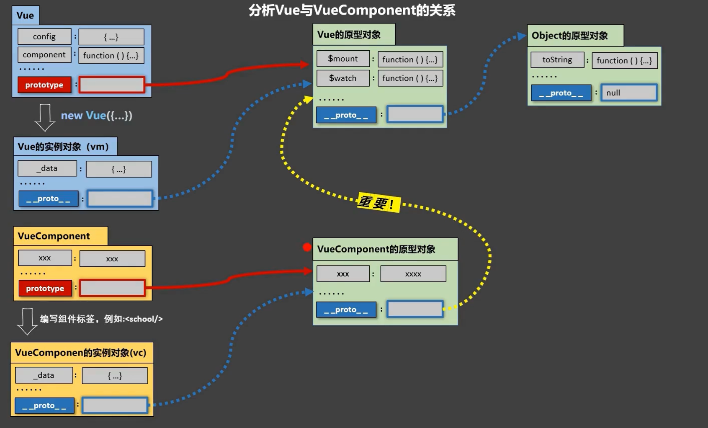

# 模块与组件


代码复用率不高,可以复用,但是复用结构很恶心


js模块(比如jq)
a 理解：向外提供特定功能的 js 程序，一般就是一个 js 文件
b 为什么：js 文件很多很复杂
c 作用：复用、简化 js 的编写，提高 js 运行效率

组件
a 定义：用来实现局部功能的代码和资源的集合（html/css/js/image…）
b 为什么：一个界面的功能很复杂
c 作用：复用编码，简化项目编码，提高运行效率

模块化
当应用中的 js 都以模块来编写的，那这个应用就是一个模块化的应用

组件化
当应用中的功能都是多组件的方式来编写的，那这个应用就是一个组件化的应用

# 非单文件组件

非单文件组件：一个文件中包含有 n 个组件(html文件)
单文件组件：一个文件中只包含有 1 个组件(vue文件)


> Vue中使用组件的三大步骤：

​    一、定义组件(创建组件)
​    二、注册组件
​    三、使用组件(写组件标签)

> 一、定义组件

使用`Vue.extend(options)`创建，其中`options`和n`ew Vue(options)`时传入的那个options几乎一样，但也有点区别:

区别如下：

1. el不要写，为什么？ 
   	最终所有的组件都要经过一个vm的管理，由vm中的el决定服务哪个容器。
   el不写,写什么?
   	写template配置组件结构,组件最重要的结构就是html结构,可以没有css和js,但是必须要有html

2. data必须写成函数式，为什么？ 
   	避免组件被复用时，数据存在引用关系,从而导致不同引用时修改的连带效应。

```js
//data对象式
data:{n:1};
let x=y=data;
x.n=2;//此时y.n=2

//data函数式
data(){retrun{n:1}};
x=data();y=data();
x.n=2;//但是此时y.n=1
```

```js
	const school = Vue.extend({
        //组件的基本:html结构
        template: `
				<div class="demo">
					<h2>学校名称：{{schoolName}}</h2>
					<h2>学校地址：{{address}}</h2>
					<button @click="showName">点我提示学校名</button>	
				</div>
			`,
        // el:'#root', 
        //组件定义时，一定不要写el配置项，因为最终所有的组件都要被一个vm管理，由vm决定服务于哪个容器。
        data() {
            //data配置为一个函数,返回一个对象(前面提过函数式)
            return {
                schoolName: '尚硅谷',
                address: '北京昌平'
            }
        },
        //配置交互函数
        methods: {
            showName() {
                alert(this.schoolName)
            }
        },
    })
```

> 二、如何注册组件？

1. 局部注册：靠new Vue的时候传入components选项
2. 全局注册：靠Vue.component('组件名',组件)

区别:局部注册的组件只能在对应的vm容器中使用,其他vue实例不能使用;全局注册的组件可以在任意vue实例管理的容器中使用

> 三、编写组件标签

```html
<school></school>
```


```html
<!DOCTYPE html>
<html>

<head>
    <meta charset="UTF-8" />
    <title>基本使用</title>
    <script type="text/javascript" src="../../vue.js"></script>
</head>

<body>
    <!-- ement语法 -->
    <!-- 准备好一个容器-->
    <div id="root">
        <hello></hello>
        <hr>
        <h1>{{msg}}</h1>
        <hr>
        <!-- 第三步：编写组件标签 -->
        <!-- 组件的使用,组件标签 -->
        <school></school>
        <hr>
        <!-- 第三步：编写组件标签 -->
        <student></student>
    </div>

    <div id="root2">
        <hello></hello>
    </div>
</body>

<script type="text/javascript">
    Vue.config.productionTip = false

    //第一步：创建school组件
    const school = Vue.extend({
        //组件的基本:html结构
        template: `
				<div class="demo">
					<h2>学校名称：{{schoolName}}</h2>
					<h2>学校地址：{{address}}</h2>
					<button @click="showName">点我提示学校名</button>	
				</div>
			`,
        // el:'#root', 
        //组件定义时，一定不要写el配置项，因为最终所有的组件都要被一个vm管理，由vm决定服务于哪个容器。
        data() {
            //data配置为一个函数,返回一个对象(前面提过函数式)
            return {
                schoolName: '尚硅谷',
                address: '北京昌平'
            }
        },
        //配置交互函数
        methods: {
            showName() {
                alert(this.schoolName)
            }
        },
    })

    //第一步：创建student组件
    const student = Vue.extend({
        template: `
				<div>
					<h2>学生姓名：{{studentName}}</h2>
					<h2>学生年龄：{{age}}</h2>
				</div>
			`,
        data() {
            return {
                studentName: '张三',
                age: 18
            }
        }
    })

    //第一步：创建hello组件
    const hello = Vue.extend({
        template: `
				<div>	
					<h2>你好啊！{{name}}</h2>
				</div>
			`,
        data() {
            return {
                name: 'Tom'
            }
        }
    })

    //第二步：全局注册hello组件
    Vue.component('hello', hello)

    //创建vm
    new Vue({
        el: '#root',
        data: {
            msg: 'Hello Component'
        },
        //第二步：注册组件（局部注册school&student）
        components: { //组件
            //配置内容,k:v,若kv同名则可以简写为k
            /* school:school,student:student */
            school,
            student
        }
    })

    //在vm中使用全局组件
    new Vue({
        el: '#root2',
    })
</script>

</html>
```

## 组件注意事项

关于组件名

> 一个单词组成

第一种写法（首字母小写）：school
第二种写法（首字母大写）：School

```js
component:{School:school}
<School></school>
//注册和使用时的名称必须呼应
//但是VueDev中显示都是大写形式,VueDev中的显示都是依据组件创建时的name配置项
const shcool=Vue.extend({name:"atguigu"...});
//VueDev中显示为Atguigu
```

> 多个单词组成

第一种写法（kebab-case 命名）：my-school(VueDev中显示为MySchool)
第二种写法（CamelCase 命名）：MySchool（需要Vue脚手架支持,否则渲染错误不显示）

> 注意

组件名尽可能回避HTML中已有的元素名称，例如：h2、H2都不行
可以使用name配置项指定组件在开发者工具中呈现的名字

> 关于组件标签的写法 

第一种写法：`<school></school>`
第二种写法：`<school/>`（需要Vue脚手架支持）
备注：不使用脚手架时，连续写多个自闭合`<school/>`会导致后续组件不能渲染,只显示一个

> 简写

一个简写方式：`const school = Vue.extend(options)`可简写为`const school = options`，因为父组件components引入的时候会自动创建

```html
<body>
    <!-- 准备好一个容器-->
    <div id="root">
        <h1>{{msg}}</h1>
        <school></school>
    </div>
</body>

<script type="text/javascript">
    Vue.config.productionTip = false

    //定义组件
    const s = Vue.extend({
        name: 'atguigu', //第三方经常使用
        template: `
				<div>
					<h2>学校名称：{{name}}</h2>	
					<h2>学校地址：{{address}}</h2>	
				</div>
			`,
        data() {
            return {
                name: '尚硅谷',
                address: '北京'
            }
        }
    });

    /*  
        有一个判断逻辑,即使简写,也会执行Vue.extend()
        如果注册组件的地方判断s1是一个对象,就会帮他执行Vue.extend();如果是组件则直接使用
        const s1 = {
            name: 'atguigu', //第三方经常使用
            template: `
    				<div>
    					<h2>学校名称：{{name}}</h2>	
    					<h2>学校地址：{{address}}</h2>	
    				</div>
    			`,
            data() {
                return {
                    name: '尚硅谷',
                    address: '北京'
                }
            }
        } 
    */

    new Vue({
        el: '#root',
        data: {
            msg: '欢迎学习Vue!'
        },
        components: {
            school: s
        }
    })
</script>

</html>
```

## 组件的嵌套


```html
    <div id="root">
        <app></app>
    </div>
    <script>
        Vue.config.productionTip = false //阻止 vue 在启动时生成生产提示。
        //创建省份
        const province = Vue.extend({
            name: 'province',
            template: `<h3>{{name}}</h3>`,
            data() {
                return {
                    name: 'jiangsu'
                }
            },
        });
        //创建国家,注册省份,国家嵌套省份
        const country = Vue.extend({
            name: 'country',
            template: `
        <div>
            <h1>{{name}}</h1>
            <province></province>
        </div>
        `,
            data() {
                return {
                    name: 'china'
                }
            },
            components: {
                province
            }
        })
        //创建与country平级的组件
        const hello = Vue.extend({
            name: 'hello',
            template: `<div><i>{{str}}</i></div>`,
            data() {
                return {
                    str: `Welcome to jiangsu in china!`
                }
            },
        })
        //Vue管理app组件,app组件统一管理所有的其他组件
        //注册hello和国家
        const app = Vue.extend({
            name: 'app',
            template: `
        <div>
            <hello></hello>
            <country></country>
        </div>
        `,
            components: {
                country,
                hello
            }
        })
        //注册app,统一管理
        new Vue({
            template: `<app></app>`,
            //使用template替换el的outerhtml
            el: "#root",
            components: {
                app
            }
        })
    </script>
```

## VueComponent

1.school组件本质是一个名为VueComponent的构造函数，且不是程序员定义的，是Vue.extend生成的。

```js
    console.log(school)
    //school为一个vc函数
    function VueComponent(options) {
        this._init(options);
    };
    //源码
    var Sub = function VueComponent(options) {
        this._init(options);
    };
```

2.我们只需要写`<school/>`或`<school></school>`，Vue解析时会帮我们创建school组件的实例对象，
    即Vue帮我们执行的：`new VueComponent(options)`。
    写几次调用几次,不写不调用

3.特别注意：每次调用Vue.extend，返回的都是一个全新的VueComponent！！！！

```js
		创建一个hello组件验证
            // console.log('@',school)
            // console.log('#',hello)
        验证1:console.log(hello===school)//true
        验证2:school.a=99,console.log(school.a,hello.a)//99,undefined
        原理:
        Vue.extend = function (extendOptions) {
            //...
            var Sub = function VueComponent(options) {
                this._init(options);
            };
            每次调用extend函数都会返回一个即时定义的VueComponent,
            所以school和hello是两个不同的组件
            //...
            return Sub
        }
```

4.关于this指向：
(1).组件配置中：
	data函数、methods中的函数、watch中的函数、computed中的函数 它们的this均是【VueComponent实例对象】。

(2).new Vue(options)配置中：
	data函数、methods中的函数、watch中的函数、computed中的函数 它们的this均是【Vue实例对象,vm】。

```js
    //定义school组件
    const school = Vue.extend({
        name: 'school',
        template: `
				<div>
					<h2>学校名称：{{name}}</h2>	
					<h2>学校地址：{{address}}</h2>	
					<button @click="showName">点我提示学校名</button>
				</div>
			`,
        data() {
            return {
                name: '尚硅谷',
                address: '北京'
            }
        },
        methods: {
            showName() {
                console.log('showName', this)//VueComponent{...},data中的name在VueComponent对象中
            }
        },
    })
```

5.VueComponent的实例对象，以后简称vc（也可称之为：组件实例对象）。
Vue的实例对象，以后简称vm。

6.vm管理vc,vc管理子vc

```html
<body>
    <div id="root">
        <school></school>
        <hello></hello>
    </div>
</body>

<script type="text/javascript">
    Vue.config.productionTip = false

    //定义school组件
    const school = Vue.extend({
        name: 'school',
        template: `
				<div>
					<h2>学校名称：{{name}}</h2>	
					<h2>学校地址：{{address}}</h2>	
					<button @click="showName">点我提示学校名</button>
				</div>
			`,
        data() {
            return {
                name: '尚硅谷',
                address: '北京'
            }
        },
        methods: {
            showName() {
                console.log('showName', this)
            }
        },
    })

    const test = Vue.extend({
        template: `<span>atguigu</span>`
    })

    //定义hello组件
    const hello = Vue.extend({
        template: `
				<div>
					<h2>{{msg}}</h2>
					<test></test>	
				</div>
			`,
        data() {
            return {
                msg: '你好啊！'
            }
        },
        components: {
            //hello组件管理子组件test
            test
        }
    })


    //创建vm
    const vm = new Vue({
        el: '#root',
        components: {
            //vm管理其他vc,vm.$children数组中显示两个vc(school,vc)
            //vc管理子vc,不管理则是一个空数组,管理则vc.$children内部有子vc(hello内部有test)
            school,
            hello
        }
    })
</script>

```

## vc&vm联系和区别

组件是可复用的 Vue 实例，且带有一个名字。因为组件是可复用的 Vue 实例，所以它们与 `new Vue` 接收相同的选项，例如 `data`、`computed`、`watch`、`methods` 以及生命周期钩子等。仅有的例外是像 `el` 这样根实例特有的选项。

- vm通过el指定管理的容器，而vc需要依赖vm。

- vm中的data可以写成对象式，而vc因为需要复用所以data只能写成函数式

## Vc&Vm继承关系

```js
VueComponent.prototype.__proto__=Vue.prototype
```



> VueComponent

VueComponent获取:`Vue.extend({...})`

VueComponent实例对象，必须通过编写组件标签实例化

> 总结

vc其实就是一个微型的vm，只是el和data的配置不同。

# 单文件组件

`.vue`文件需要使用,创建的是一个个组件，需要暴露出去

- webpack工作流
- Vue官方脚手架

## 基本使用

`School.vue`

```vue
<!--School.vue-->
<!--组件的结构  -->
<template>
  <div id="data1">
    <!-- template不奏效,是innerHtml -->
    <h1>学校:{{ name }}</h1>
    <h2>地址:{{ address }}</h2>
    <button @click="showName">点击显示学校</button>
  </div>
</template>

<style>
/* 组件的样式 */
.data1 {
  background-color: #bfa;
}
</style>

<script>
// 组件交互的相关代码（数据，方法）
export default {
  //一般是默认暴露,可以使用import ... from ...直接引入
  name: "School", //vue文件命名和模块保持一致
  data() {
    return {
      name: "cumt",
      address: "中国徐州",
    };
  },
  methods: {
    showName() {
      return this.name;
    },
  },
};
</script>
```

`Student.vue`

```vue
<!--Student.vue-->
<!--组件的结构  -->
<template>
  <div id="data1">
    <!-- template不奏效,是innerHtml -->
    <h1>名字:{{ name }}</h1>
    <h2>学号:{{ sid }}</h2>
    <button @click="showName">点击显示姓名</button>
  </div>
</template>

<style>
/* 组件的样式 */
.data1 {
  background-color: #204963bb;
}
</style>

<script>
// 组件交互的相关代码（数据，方法）
export default {
  //一般是默认暴露,可以使用import ... from ...直接引入
  name: "School", //vue文件命名和模块保持一致
  data() {
    return {
      name: "wff",
      sid: "12203247",
    };
  },
  methods: {
    showName() {
      return this.name;
    },
  },
};
</script>
```

`App.vue`统一管理其他的vue组件

```html
<!--<+回车,vue文件模板-->
<template>
  <div>
    <School></School>
    <Student></Student>
  </div>
</template>

<script>
// 引入组件
import School from "./School.vue";
import Student from "./Student.vue";
export default {
  name: "App",
  components: {
    // 注册组件
    School,
    Student,
  },
};
// 注意:在vue文件中创建的都是组件,不可能创建vm
</script>

<style>
</style>
```

`main.js`入口文件,创建vm

```js
import App from "./App.vue"
// 入口文件
new Vue({
    el:"#data",
    template:`<div><App></App></div>`,
    components:{
        App
    }
})
```

`index.html`引入vue并引入`main.js`

```html
<body>
    <div id="root"></div>
    <script src="../../vue.js"></script>
    <script src="./main.js"></script>
</body>
```

此时直接打开`index.html`,不会显示,因为在没有脚手架的情况下,浏览器不能解析ES6语法中的导入vue文件
