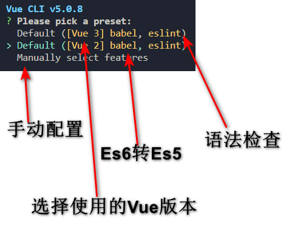
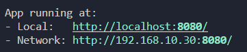
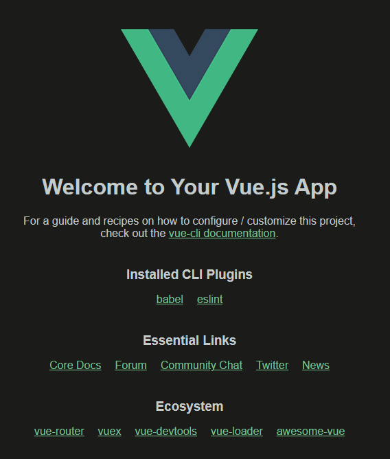
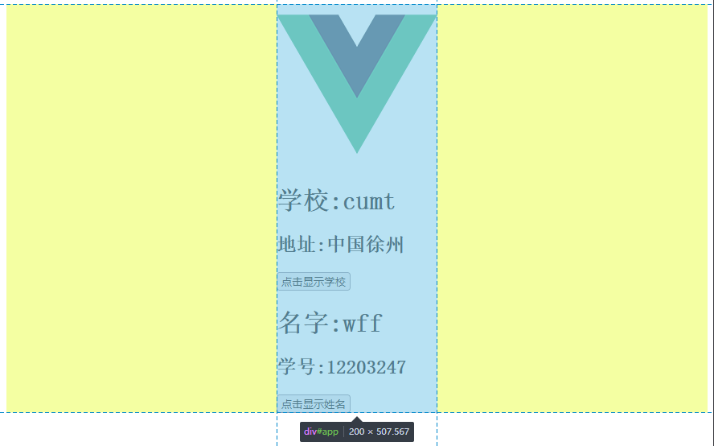

# Vue CLI 初始化脚手架

Command-Line Interface 命令行接口,我们在vue中称之为脚手架

## 初始化脚手架 

> 说明 

1. Vue脚手架是Vue官方提供的标准化开发工具（开发平台）

2. 最新的版本是 4.x, 脚手架向下兼容

3. 文档 [Vue CLI](https://cli.vuejs.org/zh/)

> 具体安装步骤 

1. 如果下载缓慢请配置npm淘宝镜像`npm config set registry http://registry.npm.taobao.org`

2. (仅指第一次安装)全局安装 `@vue/cli npm install -g @vue/cli`

Vue脚手架隐藏了所有webpack相关的配置，若想查看具体的webpack配置，请执行`vue inspect > output.js`

> 使用

1. 切换到创建项目的目录，使用命令创建项目

   ```bash
   vue create my-project
   ```

2. 选择使用vue的版本
   

3. 启动项目`npm run serve`

   ```bash
    $ cd vue-test
    $ npm run serve
   ```

   
   访问
   

4. 打包项目`npm run build`
	build:将vue文件转换为html+css+js文件
5. 暂停项目` Ctrl+C`

## 脚手架文件结构

```js
.文件目录
├── node_modules 
├── public
│   ├── favicon.ico: 页签图标
│   └── index.html: 主页面
├── src
│   ├── assets: 存放静态资源,图片视频等
│   │   └── logo.png
│   │── component: 存放组件
│   │   └── HelloWorld.vue//School.vue&Student.vue
│   │── App.vue: 汇总所有组件
│   └── main.js: 入口文件//index.html引这个文件执行vm创建
├── .gitignore: git版本管制忽略的配置
├── babel.config.js: babel的配置文件
├── package.json: 应用包配置文件 
├── README.md: 应用描述文件
└── package-lock.json: 包版本控制文件
└──vue.config.js:vue配置文件
```

`vue.copnfig.js`

```js
const { defineConfig } = require('@vue/cli-service')
module.exports = defineConfig({
  transpileDependencies: true,//babel配置项
  //语法检查配置项为lintOnSave,默认开启true
})
```

`src/main.js`

```js
/* 
	Vue-Cli配置入口文件名为main.js
	该文件是整个项目的入口文件
*/
//引入Vue.从node_modules中引入
import Vue from 'vue'
//引入App组件，它是所有组件的父组件
import App from './App.vue'
//关闭vue的生产提示
Vue.config.productionTip = false

/* 
	关于不同版本的Vue：
	
		1.vue.js与vue.runtime.xxx.js的区别：
				(1).vue.js是完整版的Vue，包含：核心功能+模板解析器。
				(2).vue.runtime.xxx.js是运行版的Vue，只包含：核心功能；没有模板解析器。

		2.因为vue.runtime.xxx.js没有模板解析器，所以不能使用template配置项，需要使用
			render函数接收到的createElement函数去指定具体内容。
*/

//创建Vue实例对象---vm
new Vue({
	el:'#app',
	//render函数完成了这个功能：将App组件放入容器中
  render: h => h(App),
	// render:q=> q('h1','你好啊')

	// template:`<h1>你好啊</h1>`,
	// components:{App},
})
//.$mount("#app")
```

`src/App.vue`

```vue
<template>
	<div>
		
		<School></School>
		<Student></Student>
	</div>
</template>

<script>
	//引入组件
	import School from './components/School'
	import Student from './components/Student'

	export default {
		name:'App',
		components:{
			School,
			Student
		}
	}
</script>

```

`public/index.html`

```html
<!DOCTYPE html>
<html lang="">
    <head>
        <meta charset="UTF-8">
      
        <!-- 针对IE浏览器的特殊配置，含义是让IE浏览器以最高渲染级别渲染页面 -->
        <meta http-equiv="X-UA-Compatible" content="IE=edge">
      
        <!-- 开启移动端的理想端口 -->
        <meta name="viewport" content="width=device-width, initial-scale=1.0">
      
        <!-- 配置页签图标 <%= BASE_URL %>是public所在路径，使用绝对路径 -->
        <!--代表public文件夹-->
        <link rel="icon" href="<%= BASE_URL %>favicon.ico">
      
        <!-- 配置网页标题,package.json中的name"vue-test" -->
        <title><%= htmlWebpackPlugin.options.title %></title>
    </head>
    <body>
      
      	<!-- 当浏览器不支持js时，noscript中的元素就会被渲染 -->
      	<noscript>
      		<strong>We're sorry but <%= htmlWebpackPlugin.options.title %> doesn't work properly without JavaScript enabled. Please enable it to continue.</strong>
    		</noscript>
          
        <!-- 容器 -->
        <div id="app"></div>
    </body>
</html>
```

> 一个问题

`error Component name "School" should always be multi-word vue/multi-word-component-names`

组件名应该使用`CamelCase/kebab-case`这种多单词形式, 语法检查时要求组件名不能是单个单词，因此单个单词如 School 也会报错

解决方法1:改`School.vue`为`SchoolVc.vue`

解决方法2:在`vue.config.js`的文件下去关闭语法检查

```js
const { defineConfig } = require('@vue/cli-service')
//commonjs语法
module.exports = defineConfig({
  transpileDependencies: true,
  lintOnSave: false
})
```

[问题参考](https://letter.gx.cn/)

> 引入我们之前写的两个组件


