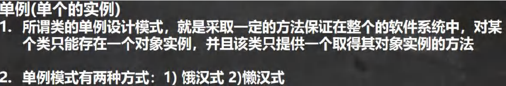
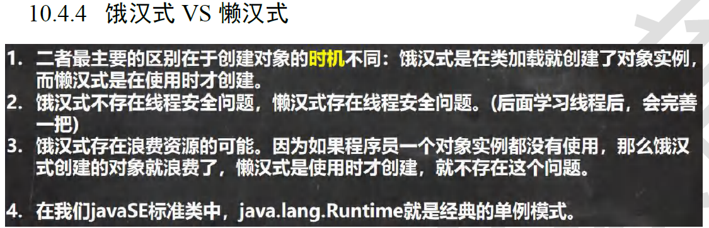

# 工厂模式

## 简易工厂模式

工厂类用于创建对象，创建对象的细节对外屏蔽，对外提供一个方法用于获取对象实例


```java
interface Car{
    void drive();
}
class DieselCar implements Car{ //具体类
    @Override
    public void drive() {System.out.println("in DieselCar class");}
}
class PetrolCar implements Car{//具体类
    @Override
    public void drive() {System.out.println("in PetrolCar class");}
}
class ElectricCar implements Car{//具体类
    @Override
    public void drive() {System.out.println("in ElectricCar class");}
}
enum CarType{DieselCar,PetrolCar,ElectricCar} //产品类型

class CarFactory{ //工厂类
    //静态方法获取实例类型
    public static Car getInstance(CarType ct) { //生成产品，向上转型
        if (ct!=null)
            switch(ct) {
                case DieselCar:return new DieselCar();
                case PetrolCar:return new PetrolCar();
                case ElectricCar:return new ElectricCar();
                default:return null;
            }
        return null;
    }
}

class useFactory{  //用户类
    public static void main(String arg[]) {
        Car c1=CarFactory.getInstance(CarType.ElectricCar);
        Car c2=CarFactory.getInstance(CarType.DieselCar);
        c1.drive();
        c2.drive();
    }
}
```

## 核心工厂模式

核心工厂类可以是抽象类或者接口，提供一个方法（仅给出具体工厂类必须实现的create方法），不负责具体的创建

具体创建有核心工厂类的实现类来实现


```java
class product{
    void show(){
        System.out.println("product");
    }
}
class concreteProduct1 extends product{
    @Override
    void show() {
        System.out.println("concreteProduct1");
    }
}
class concreteProduct2 extends product{
    @Override
    void show() {
        System.out.println("concreteProduct2");
    }
}
interface factory{//核心工厂类
    public product getProduct();
}
class c1Factory implements factory{
    @Override
    public product getProduct() {
        return new concreteProduct1();
    }
}
class c2Factory implements factory{
    @Override
    public product getProduct() {
        return new concreteProduct2();
    }
}
class gcmsffTest{
    public static void main(String[] args) {
        factory f1=new c1Factory();
        f1.getProduct().show();//concreteProduct1
        f1=new c2Factory();
        f1.getProduct().show();//concreteProduct2
    }
}
```

# 单例模式



## 懒汉式

**步骤**

1. 仍然将构造器私有化

2. 提供一个类静态实例，但是不实例化

       3. 提供一个public的static方法，可以返回一個实例化对象
          - 懒汉式，只有当用戶使用getInstance時，才创建静态实例对象
          - 后面再次调用時，会返回上次创建的对象

```java
class girlfriend{
    private static girlfriend gf;
    //懒汉式的静态实例默认不初始化
    //getInstance第一次调用时初始化,之后直接返回第一次调用时的
    public static girlfriend getInstance(){
        if(gf==null){
            gf=new girlfriend();
        }
        return gf;
    }
    private girfriend(){
        //私有化构造器
    }
}
```

## 饿汉式

1. 将构造器私有化//防止调用
2. 提供一个类静态实例，这个静态实例需要调用构造器初始化
3. 提供一个公共的static方法，返回静态的实例对象

```java
class girlfriend{
    private static girlfriend gf=new girlfriend();
    //饿汉式的静态实例默认需要初始化
    public static girlfriend getInstance(){
        return gf;
    }
    private girfriend(){
        //私有化构造器
    }
}
```

