# Java 语言概述

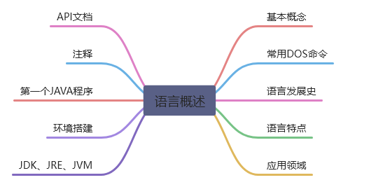

## 软件开发介绍

软件开发软件，即一系列按照特定顺序组织的计算机数据和指令的集合。

软件有系统软件和应用软件之分。

人机交互方式(GUI&CLI)

- 图形化界面 (Graphical User Interface GUI) 这种方式简单直观，使用者易于接受，容易上手操作。

- 命令行方式 (Command Line InterfaceCLI)：脚手架
  - 需要有一个控制台，输入特定的指令，让计算机完成一些操作。较为麻烦，需要记录住一些命令。

### 常用DOS命令

> Win+R，一起按下，输入 cmd，可以打开 dos 界面。

windows中的路径`c:\users\aoi`

```
dir : 列出当前目录下的文件以及文件夹
md: 创建目录(makedirectory)
rd : 删除目录(removedirectory)
cd: 进入指定目录
cd.. : 退回到上一级目录
cd \: 退回到根目录
del : 删除文件
exit : 退出 dos 命令行
```

补充：`echo javase>1.doc`输出重定向至文件中

**dir**

查看当前目录是有什么内容 

```bash
dir d:\\
```

> 常用快捷键

← →：移动光标
↑↓：调阅历史操作命令
Delete 和 Backspace：删除字符
注意：在输入 dos 命令时，要是用英文输入，所有标点符号都是英文。

### 语言发展史

JAVA之父 詹姆斯·高斯林
95年SUN公司推出Java
09年Oracle收购SUN公司

是 SUN(Stanford University Network，斯坦福大学网络公司 ) 1995 年推出的一门高级编程语言。
是一种面向 Internet 的编程语言。Java 一开始富有吸引力是因为 Java 程序可以在 Web 浏览器中运行。这些 Java 程序被称为 Java 小程序（applet）。applet 使用现代的图形用户界面与 Web 用户进行交互。applet 内嵌在 HTML
代码中。
随着 Java 技术在 web 方面的不断成熟，已经成为 Web 应用程序的首选开发语言。后台开发：Java、PHP、Python、Go、Node.js

>1991 年 Green 项目，开发语言最初命名为 Oak ( 橡树 )
>1994 年开发组意识到 Oak 非常适合于互联网
>1996 年发布 JDK 1.0，约 8.3 万个网页应用 Java 技术来制作
>1997 年发布 JDK 1.1，JavaOne 会议召开，创当时全球同类会议规模之最
>1998 年发布 JDK 1.2，同年发布企业平台 J2EE
>1999 年 Java 分成 J2SE、J2EE 和 J2ME，JSP/Servlet 技术诞生
>2004 年发布里程碑式版本：JDK 1.5，为突出此版本的重要性，更名为 JDK 5.0
>2005 年 J2SE -> JavaSE，J2EE -> JavaEE，J2ME -> JavaME
>2009 年 Oracle 公司收购 SUN，交易价格 74 亿美元
>2011 年发布 JDK 7.0
>**2014 年发布 JDK 8.0**，是继 JDK 5.0 以来变化最大的版本
>2017 年发布 JDK 9.0，最大限度实现模块化
>2018 年 3 月发布 JDK 10.0，版本号也称为 18.3
>2018 年 9 月发布 JDK 11.0，版本号也称为 18.9
>2019 年 3 月 20 日 Java SE 12 发布。Java 12 是短期支持版本。
>2019 年 9 月 23 日 Java SE 13 发布，此版本中添加了“文本块”，文本块是一个多行字符串文字，避免对大多数转义序列的需要，以可预测的方式自动格式化字符串，并在需要时让开发人员控制格式。

### Java 技术体系平台

1. JavaSE(Java Standard Edition) 标准版

	支持面向桌面级应用（如 Windows 下的应用程序）的 Java 平台，提供了完整的 Java 核心 API，此版本以前称为 J2SE

2. JavaEE(Java Enterprise Edition) 企业版

```
是为开发企业环境下的应用程序提供的一套解决方案。该技术体系中包含的技术如 :Servlet 、Jsp 等，主要针对于 Web 应用程序开发。版本以前称为J2EE
```

3. Java ME(Java Micro Edition) 小型版

```
支持 Java 程序运行在移动终端（手机、PDA）上的平台，对 Java API有所精简，并加入了针对移动终端的支持，此版本以前称为 J2ME。
```

4. Java Card

```
支持一些 Java 小程序（Applets）运行在小内存设备（如智能卡）上的平台。
```

### Java特性

- c++语法迁移
- 强类型
  - 类,接口,继承
  - 类之间的单继承，但支持接口之间的多继承，
  - 并支持类与接口之间的实现机制（关键字为 implements）
- 分布式
  - 网络应用(接口javanet)
  - 网络应用相关库(URL、URLConnection、Socket、ServerSocket 等)
  - Java 的 RMI（远程方法激活）机制也是开发分布式应用的重要手段。
- 健壮性
  - 强类型机制、异常处理、垃圾的自动收集
  - 丢弃指针(但是依然会有`java.lang.NullPointerException`)
- 安全性
  - 安全防范机制（类ClassLoader），如分配不同的名字空间以防替代本地的同名类、字节代码检查。

### Java 两种核心机制

1、Java 虚拟机 (Java VirtalMachine-JVM)

Java 虚拟机机制屏蔽了底层运行平台的差别，实现了“一次编译，到处运行”。

- JVM 是一个虚拟的计算机，具有指令集并使用不同的存储区域。负责执行指令，管理数据、内存、寄存器。

- 对于不同的平台，有不同的虚拟机。
  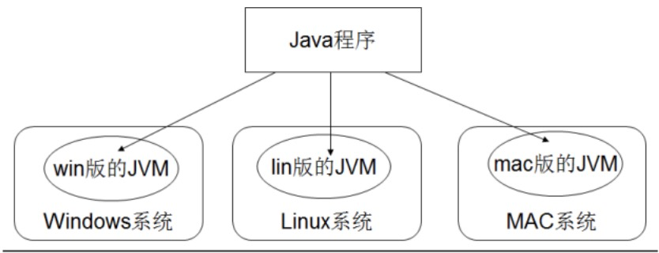

- 只有某平台提供了对应的 java 虚拟机，java 程序才可在此平台运行。

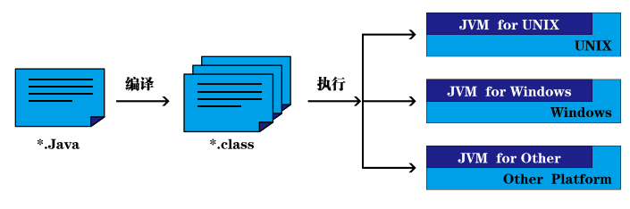

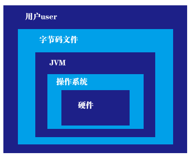

### JDK、JRE、JVM

JDK(JavaDevelopmwntKit)

- java开发工具包
- 包含：JRE+工具包[jav, javc,javdoc,javp 等]
- JDK 是提供给 Jav 开发人员使用的，其中包含了 jav 的开发工具，也包括了 JRE。所以安装了 JDK，就不用在单独安装 JRE 了。

JRE(JavaRunningEnvironment)

- JAVA运行环境
- 包含：JVM+Jav 的核心类库[类]
- 包括 Jav 虚拟机(JVM Jav Virtual Machine)和 Jav 程序所需的核心类库等，如果想要运行一个开发好的 Java 程序，计算机中只需要安装 JRE 即可。

JVM(JavaVirtualMachine)

- java 虚拟机

- 执行class文件时，根据不同操作系统，解释成不同平台下的可执行文件，再去执行，所以说jvm真正让java实现跨平台性

JDK、JRE 和 JVM 的包含关系
1) JDK = JRE + 开发工具集（例如 Javc,jav 编译工具等)
2) JRE = JVM + Jav SE 标准类库（jav 核心类库）
3) 如果只想运行开发好的 .clas 文件 只需要 JRE

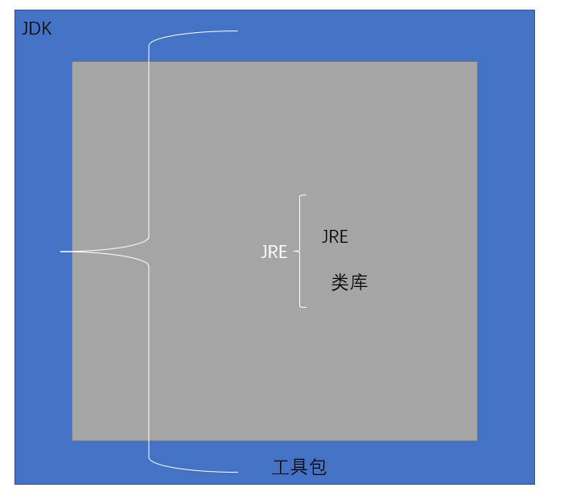

### 环境搭建

```
1. 下载并安装JDK
注意：安装目录下不要有中文或空格
JDK下的目录结构
	bin 工具包
	src 源码包
	jre
	lib类库
2.配置环境变量...
```

配置环境变量 path

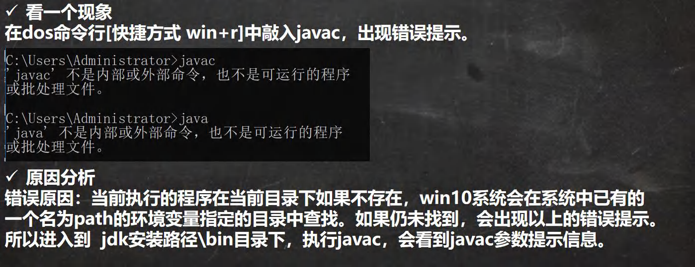

> 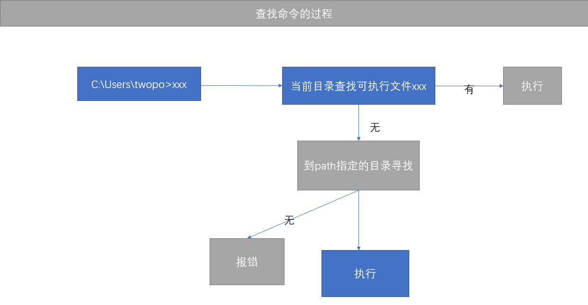
>
> 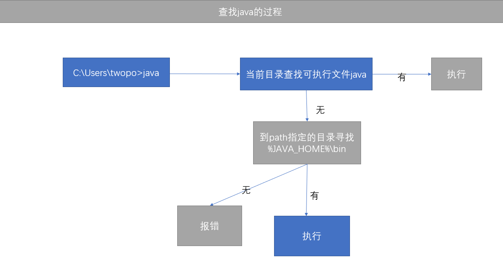

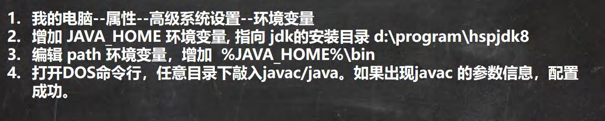

> 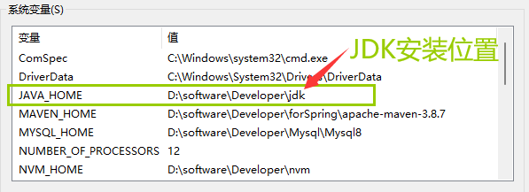
>
> > 系统变量>path
>
> 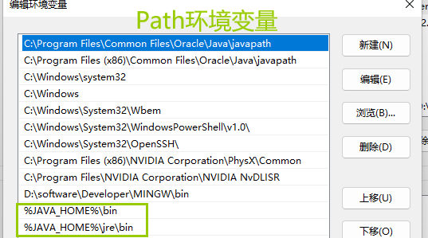

**生成JRE**

在JDK8以后,JRE就模块化内置在JDK中,每个系统中的JRE不一样,此时不再提供一个同一的JRE

可以使用一个指令在JDK安装环境中生成JRE

```bash
jlink --module-path jmods --add-modules java.desktop --output jre
```

输入`java -version`

输出下述信息则为成功

```bash
java version "17.0.5" 2022-10-18 LTS
Java(TM) SE Runtime Environment (build 17.0.5+9-LTS-191)
Java HotSpot(TM) 64-Bit Server VM (build 17.0.5+9-LTS-191, mixed mode, sharing)
```

# Hello World!

```java
class Hello {
	public static void main(String[] args) {
		System.out.println("Hello World!");
	}
}
```

## 主方法是程序的入口

`public static void main(String[] args) { }`

>public：公共的，在任意位置可见
>static：静态的，不需要实例
>void：方法执行完成不需要返回值
>main：方法名
>String[]：表示可以给main方法传递参数，而且可以传一个字符串数组的参数
>args：形参名，在main()中如果要使用外界传的字符串数组的参数值，可以通过args取出

## 命令行开发步骤

>1. 编辑：编写Java代码
>
>- 保存成：.java源文件
>
>2. 编译：转成字节码文件
>
>- `javac Hello.java`
>- 得到的结果是：一个或多个的.class字节码文件(可运行的文件)
>
>3. 运行：运行字节码文件
>
>- `java Hello`
>- 得到main方法执行的结果
>
>
>
>
>
>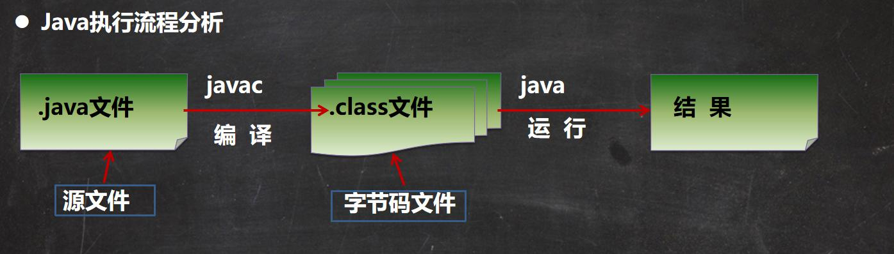
>
>
>执行
>
>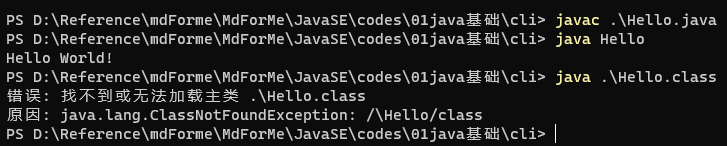

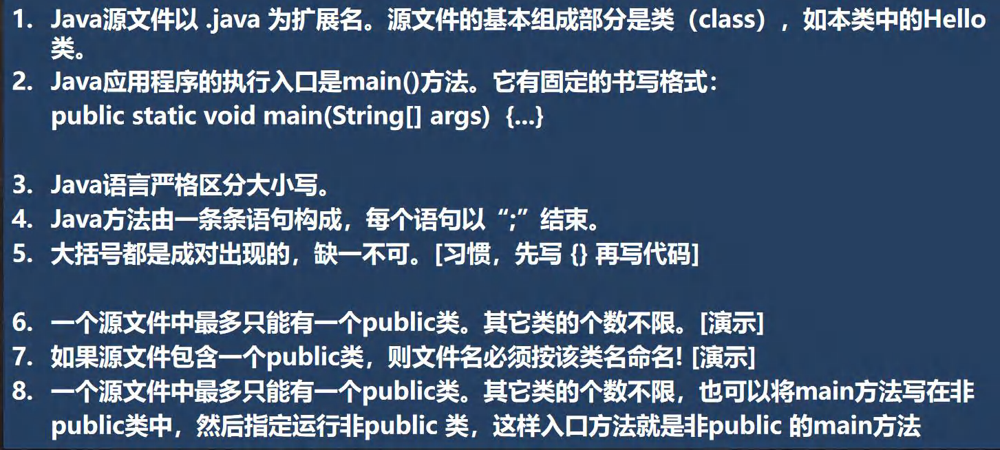

## 注释

* 用于注解说明解释程序的文字就是注释。

* Java中的注释类型：

  * 单行注释

    *   **格式：`//注释文字`**

  * 多行注释

    *   格式：`/* 注释文字*/`
    *   **注：对于单行和多行注释，被注释的文字，不会被JVM（java虚拟机）解释执行。** 
        **多行注释里面不允许有多行注释嵌**

  * **文档注释(java特有)**

    * **格式**：

      ```java
      /**
       * @author  指定java程序的作者**
       * @version  指定源文件的版本**
       */
      ```

      **注释内容可以被JDK提供的工具javadoc所解析，生成一套以网页文件形式体现的该程序的说明文档。**

      

    * 应用实例

      ```bash
      javadoc -d 文件夹名 -author -version xxx.java
      //-d 输出文件存放地址
      //xxx.java生成文档的java文件
      ```

    * 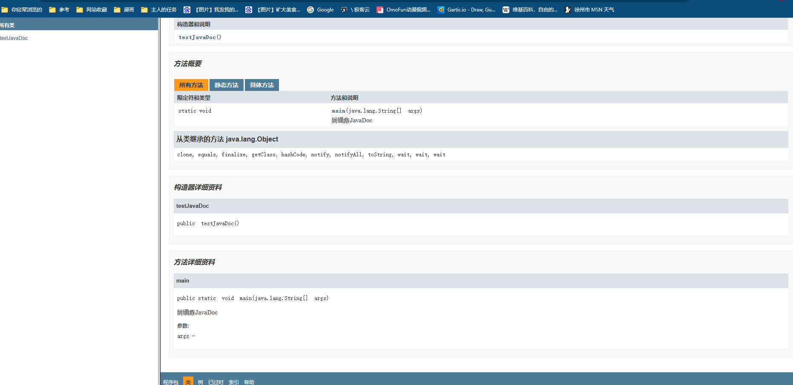

* **提高了代码的阅读性；调试程序的重要方法。**

* 注释是一个程序员必须要具有的良好编程习惯。

* 将自己的思想通过注释先整理出来，再用代码去体现。

## Java 转义字符

```java
在控制台，输入 tab 键，可以实现命令补全
\t ：一个制表位，实现对齐的功能
\n ：换行符
\\ ：一个\
\" :一个"
\' ：一个' 
\r :一个回车 System.out.printl("韩顺平教育\r 北京");
```

