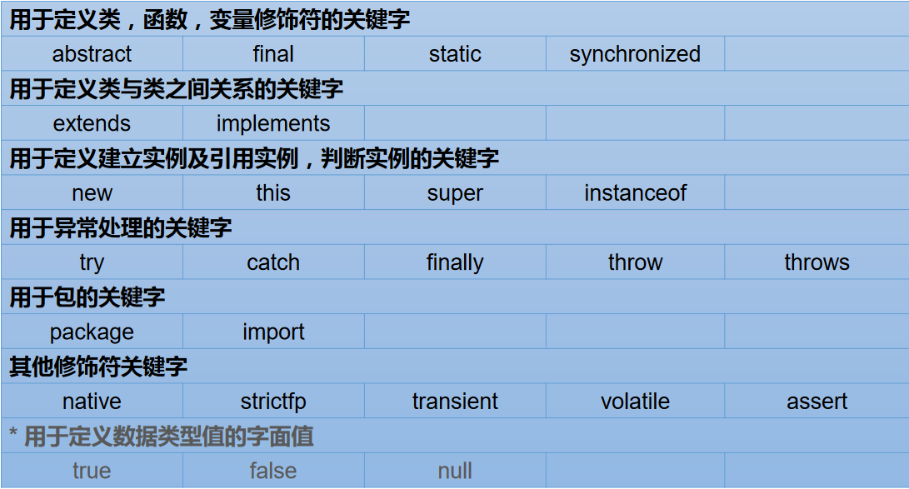
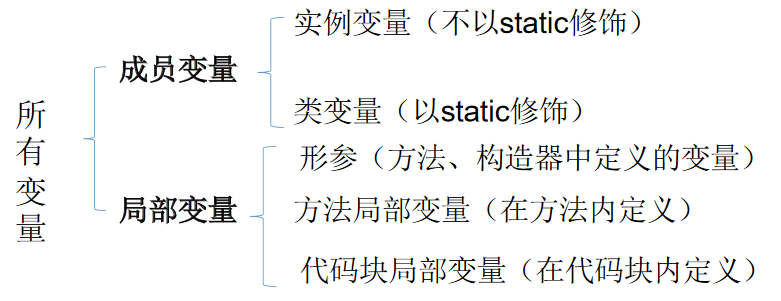

# 关键字与保留字

> 1、关键字(keyword)的定义和特点

*   定义：被 Java 语言赋予了特殊含义，用做专门用途的字符串（单词）
*   特点：关键字中所有字母都为小写




> 2、保留字(reserved word)

Java 保留字：现有 Java 版本尚未使用，但以后版本可能会作为关键字使用。自己命名标识符时要避免使用这些保留字`goto、const`。

# 标识符

## 概念

*   Java 对各种变量、方法和类等要素命名时使用的字符序列称为标识符
*   技巧：凡是自己可以起名字的地方都叫标识符。

## 定义合法标识符规则【重要】

1.  由 26 个英文字母大小写，0-9，\_或$ 组成
2.  数字不可以开头。
3.  标识符不能包含空格。
4.  不可以使用关键字和保留字，但能包含关键字和保留字。
5.  Java 中严格区分大小写，长度无限制。

## Java 中的名称命名规范

> 1、Java 中的名称命名规范：

*   **包名**：多单词组成时**所有字母都小写**：xxxyyyzzz
*   **类名**、接口名：多单词组成时，所有单词的首字母大写：XxxYyyZzz
*   **变量名**、方法名：多单词组成时，**第一个单词首字母小写，第二个单词开始每个单词首字母大写：xxxYyyZzz**
*   **常量名**：**所有字母都大写。多单词时每个单词用下划线连接：XXX\_YYY\_ZZZ**

> 2、注意点

*   注意 1：在起名字时，为了提高阅读性，要尽量有意义，“见名知意”。
*   注意 2：java 采用 unicode 字符集，因此标识符也可以使用汉字声明，但是不建议使用。
*   更多细节详见《代码整洁之道》

# 变量

> 1、变量的概念：

*   内存中的一个存储区域；
*   该区域的数据可以在同一类型范围内不断变化；
*   变量是程序中最基本的存储单元。包含**变量类型、变量名和存储的值。**(三兄弟:类型-名称-值)

> 2、变量的作用：

*   用于在内存中保存数据。

## 变量的声明与使用

> 注意

*   Java 中每个变量必须先声明，后使用；(没有变量提升机制)
*   使用变量名来访问这块区域的数据；
*   变量的作用域：其定义所在的一对`{ }`内；
    *   变量只有在其作用域内才有效；
    *   同一个作用域内，不能定义重名的变量；


> 声明变量

*   语法：`<数据类型> <变量名称>`
*   例如：int var;

> 变量的赋值

*   语法：`<变量名称> = <值>`
*   例如：var = 10;

> 声明和赋值变量

*   语法：`<数据类型><变量名>= <初始化值>`
*   例如：`int var = 10`

> 补充：变量的分类-按声明的位置的不同

* 在方法体外，类体内声明的变量称为**成员变量**。

* 在方法体内部声明的变量称为**局部变量**。  
  

* 说白了,类变量就是类静态变量

* 形参作为方法中的参数,也是成为方法中的局部变量

  ```java
  void test(String arg){
  	//相当于此处声明并赋值了String arg="xxx"
  }
  ```

注意：二者在初始化值方面的异同:

*   同：都有生命周期
*   异：
    *   局部变量除形参外，需显式初始化。
    *   成员变量是寄生在对象实例上的，可以不赋初值，有一个默认值
        *   int,double,float=0,char=0
        *   String等对象默认初始化为null

不显式初始化则无法使用，以避免空指针异常

> 什么叫做变量的初始化?

在jvm内部开辟出一块变量的存储空间

一般来说，java中初始化都需要在声明的同时为它赋值，以避免空指针异常

也就是说：声明一个变量并为其赋值==变量初始化

# 数据类型


## **==基本数据类型==**

## 整形


```java
        //Java 的整型常量（具体值）默认为 int 型，声明 long 型常量须后加‘l’或‘L’
        int n1 = 1;//4 个字节
        //int n2 = 1L;//对不对?不对
        long n3 = 1L;//对
        System.out.println();
```


> 关于long变量的声明

```java
long lvar=123L;//显示指明将一个long类型的字面量`123L`赋值给lvar
long lvar=123;//把一个int类型的字面值赋值给了long型变量，这个int类型字面值会自动转型到long
```

- 如果int字面量超过其能表示的范围而不加L声明为long字面量,则会报错

  - ```java
    long lvar=452367894586235;//报错
    long lvar=452367894586235L;//ok
    ```

> int底层:补码


```java
        int a=0b01000000000011;//jdk7+支持0b写法
        byte b=(byte)a;
        System.out.println(a);//4099
        System.out.println(b);//3
```

## 浮点类型

带小数的数：3.1415926

*   与整数类型类似，Java 浮点类型也有固定的表数范围和字段长度，不受具体操作系统的影响。
*   浮点型常量有两种表示形式：
    *   十进制数形式：如：5.12 512.0f .512 (必须有小数点）
    *   科学计数法形式:如：5.12e2 512E2 100E-2
        *   e可以大写可以小写
        *   $5.12e2=5.12*100$
        *   $512E-2=5.12/(10*10)$
*   float:单精度，尾数可以精确到7位有效数字。很多情况下，精度很难满足需求。
*   double:双精度，精度是float的两倍。通常采用此类型。
*   **Java 的浮点型常量默认为double型，声明float型常量，须后加‘f’或‘F’。**

一般使用double声明浮点数

| 类型         | 占用存储空间 | 表数范围                |
| ------------ | ------------ | ----------------------- |
| 单精度float  | 4字节        | \-3.403E38 ~ 3.403E38   |
| 双精度double | 8字节        | \-1.798E308 ~ 1.798E308 |

```java
		//2. 浮点型：float(4字节) \ double(8字节)
		//① 浮点型，表示带小数点的数值
		//② float表示数值的范围比long还大

		double d1 = 12.3;
		System.out.println(d1 +1);
		
		//定义float类型变量时，变量要以"f" 或"F"结尾
		float f1 = 12.3F;
		System.out.println(f1);

		//② 通常，定义浮点型变量时，使用double变量
```

> 浮点数字面量

`12.3`是一个double类型的字面量，如果将其直接赋值给float将会报错

```java
flaot f1=12.3;//编译error:float盛不下double这么大容量的类型
float f1=12.3f;//ok
```

`12.3`f是一个float类型的字面量，将其直接赋值给float没问题啊

> 使用注意:浮点数的比较

两个数的差值的绝对值，在某个精度范围类判断

```java
    /**
     * 比较两个浮点数,差值绝对值小于某个特定的精度,则视为相等
     * @param d1
     * @param d2
     * @return 值绝对值小于某个特定的精度返回true,否则false
     */
    static boolean doubleEqual(double d1,double d2){
        if(Math.abs(d1-d2)<1e-10)return true;
        else return false;
    }
```

## 字符类型：char

*   char 型数据用来表示通常意义上“字符”(2字节)
*   Java中的所有字符都使用Unicode编码，故一个字符可以存储一个字母，一个汉字，或其他书面语的一个字符。
    *   unicode基本容纳了所有的文字字符
    *   unicode兼容ascii
    *   一个char字符也是一个unicode编码值

*   字符型变量的三种表现形式：
    *   字符常量是用单引号(`‘ ’`)括起来的单个字符。例如：`char c1 = ‘a’; char c2 = ‘中’; char c3 = ‘9’;`
    *   Java中还允许使用转义字符‘\\’来将其后的字符转变为特殊字符型常量。例如：char c3 = ‘\\n’; //’\\n’表示换行符
    *   直接使用Unicode值来表示字符型常量：‘\\uXXXX’。其中，XXXX代表一个十六进制整数。如：\\u000a 表示\\n。
*   char类型是可以进行运算的。因为它都对应有Unicode码。

```java
class VariableTest1{
	public static void main(String[] args) {
		//3. 字符型：char(1字符=2字节)
		//① 定义char型变量，通常使用一对'' 
		char c1 = 'a';
		//编译不通过
		//c1 = 'AB';//error
		System.out.println(c1);

		char c2 = '1';
		char c3 = '中';
		char c4 = '&';

		//② 表示方式：1.声明一个字符；2.转义字符；3.直接使用Unicode值来表示字符型常量
		char c5 = '\n';	//换行符
		c5 = '\t';	//制表符
		System.out.print("hello" + c5);
		System.out.println("world");

		char c6 = '\u0123';System.out.println(c6);//ģ
		
		char c7 = '\u0043';System.out.println(c7);//C
	}
}
```

> 了解：ASCII 码

*   在计算机内部，所有数据都使用二进制表示。每一个二进制位（bit）有0 和1 两种状态，因此8个二进制位就可以组合出256 种状态，这被称为一个字节（byte）。一个字节一共可以用来表示256 种不同的状态，每一个状态对应一个符号，就是256 个符号，从0000000 到11111111。
*   ASCII码：上个世纪60年代，美国制定了一套字符编码，对英语字符与二进制位之间的关系，做了统一规定。这被称为ASCII码。ASCII码一共规定了128个字符的编码，比如空格“SPACE”是32（二进制00100000），大写的字母A是65（二进制01000001）。这128个符号（包括32个不能打印出来的控制符号），只占用了一个字节的后面7位，最前面的1位统一规定为0。
*   缺点：
    *   不能表示所有字符。
    *   相同的编码表示的字符不一样：比如，130在法语编码中代表了é，在希伯来语编码中却代表了字母Gimel(ג)。

> 了解：Unicode 编码

*   乱码：世界上存在着多种编码方式，同一个二进制数字可以被解释成不同的符号。因此，要想打开一个文本文件，就必须知道它的编码方式，否则用错误的编码方式解读，就会出现乱码。
*   Unicode：一种编码，将世界上所有的符号都纳入其中。每一个符号都给予一个独一无二的编码，使用Unicode 没有乱码的问题。
*   Unicode 的缺点：Unicode 只规定了符号的二进制代码，却没有规定这个二进制代码应该如何存储：无法区别Unicode 和ASCII：计算机无法区分三个字节表示一个符号还是分别表示三个符号。另外，我们知道，英文字母只用一个字节表示就够了，如果unicode统一规定，每个符号用三个或四个字节表示，那么每个英文字母前都必然有二到三个字节是0，这对于存储空间来说是极大的浪费。

> 了解：UTF-8

*   UTF-8 是在互联网上使用最广的一种Unicode 的实现方式。
*   UTF-8 是一种变长的编码方式。它可以使用1-6 个字节表示一个符号，根据不同的符号而变化字节长度。
*   UTF-8的编码规则：
    *   对于单字节的UTF-8编码，该字节的最高位为0，其余7位用来对字符进行编码（等同于ASCII码）。
    *   对于多字节的UTF-8编码，如果编码包含n 个字节，那么第一个字节的前n位为1，第一个字节的第n+1 位为0，该字节的剩余各位用来对字符进行编码。在第一个字节之后的所有的字节，都是最高两位为"10"，其余6位用来对字符进行编码。

## 布尔类型：boolean

*   boolean 类型用来判断逻辑条件，一般用于程序流程控制：
    *   if条件控制语句；
    *   while循环控制语句；
    *   do-while循环控制语句；
    *   for循环控制语句；
*   boolean类型数据只允许取值true和false，无null。
    *   **不可以使用0或非0 的整数替代false和true**，这点和C语言不同。
    *   Java虚拟机中没有任何供boolean值专用的字节码指令，Java语言表达所操作的boolean值，在编译之后都使用java虚拟机中的int数据类型来代替：true用1表示，false用0表示。———《java虚拟机规范8版》

```java
class VariableTest1{
	public static void main(String[] args) {
		//4. 布尔型：boolean
		//① 只能取两个值之一：true 、false
		//② 常常在条件判断、循环结构中使用
		boolean bb1 = true;
		System.out.println(bb1);

		boolean isMarried = true;
		if(isMarried){//true
			System.out.println("禁止入内！");
		}else{
			System.out.println("可以参观！");
		}
	}
}
```

## 基本数据类型转换

*   自动类型转换：容量小的类型自动转换为容量大的数据类型。数据类型按容量大小排序为：  
    
*   有多种类型的数据混合运算时，系统首先自动将所有数据转换成容量最大的那种数据类型，然后再进行计算。
*   **byte,short,char之间不会相互转换，他们三者在计算时首先转换为int类型**。
    *   自身运算也是转换为int
*   **boolean类型不能与其它数据类型运算**。
*   **当把任何基本数据类型的值和字符串(String)进行连接运算时(+)，基本数据类型的值将自动转化为字符串(String)类型**。

> 测试代码

```java
/*
基本数据类型之间的运算规则：

前提：这里讨论只是7中基本数据类型变量的运算。不包含boolean类型的。
1. 自动类型提升：
	当容量小的数据类型的变量和容量大的数据类型的变量做运算时，结果自动提升为容量大的数据类型。
	char、byte、short-->int-->long-->float-->double

	特别的：当byte、char、short三种类型的变量做运算时，结果为int类型

2. 强制类型转换：
	说明：此时容量大小指的是，表示数的范围的大和小。比如：float容量要大于long的容量
*/
class VariableTest2{
	public static void main(String[] args) {
		//byte+int->int
		byte b1 = 2;
		int i1 = 129;
		//编译不通过
//		byte b2 = b1 + i1;//结果提升为int类型
		int i2 = b1 + i1;
		long l1 = b1 + i1;//int类型可以被long接收
		System.out.println(i2);
		System.out.println(l1);
		//byte+int->int,被float接收
		float f = b1 + i1;
		System.out.println(f);
		//***************特别的**************************
		char c1 = 'a';	//97
		int i3 = 10;
        //char+int->int
		int i4 = c1 + i3;
		System.out.println(i4);

		short s2 = 10;
        //String+char->String字符串拼接
		//编译错误
//		char c3 = c1 + s2;
		
		byte b2 = 10;
        //当byte、char、short三种类型的变量做运算时，结果为int类型
//		char c3 = c1 + b2;	//编译不通过//char+byte->int
//		short s3 = b2 + s2;	//编译不通过//byte+String->String
//		short s4 = b1 + b2;	//编译不通过//byte+byte->int
        //!!byte和byte运算,结果是int
        //同理:char、short和自身类型运算,结果int
	}
}
```

> 关于字面量和类型

```java
class VariableTest4{
	public static void main(String[] args){
		//1. 编码情况
		long l = 123456;
		System.out.println(l);
		//编译失败：过大的整数
		//long l1 = 452367894586235;
		long l1 = 452367894586235L;

		//**************************
		//编译失败
//		float f1 = 12.3;
		float f1=12.3f;//ok
		//2. 编码情况2:
		//整型变量，默认类型为int型
		//浮点型变量，默认类型为double型
		byte b = 12;//强制类型转换byte b=(byte)12
	//	byte b1 = b + 1;	//编译失败:int类型
	//	float f1 = b + 12.3;	//编译失败
	}
}
```

## 强制类型转换

自动类型转换的逆过程，将容量大的数据类型转换为容量小的数据类型。使用时要加上强制转换符 ( )，但可能造成精度降低或溢出,格外要注意。

```java
(类型)(Expression)
(类型)operand//operand操作数
```

- 数据容量从大到小转换时使用

  ```java
  int i=(int)1.9;//i=1
  byte b=(byte)100;//b=100
  ```

- 强转符`(类型)`作用域:最近的操作数

  - 可以使用`()`来提升操作数的优先级

- char,byte,short注意点

  - 可以保存int字面量,但是不能保存int变量(运算临时变量)

  - 只能通过强制转换符保存

  - ```java
    //可以保存int字面量,
    char c1=100;//ok
    
    //不能保存int变量(运算临时变量)
    int i=100;
    char c2=i;//报错
    char c3=i+1;//报错
    
    //通过强制转换符保存
    char c4=(char)i;//ok
    ```

## ==引用数据类型==

## 字符串类型：String

* **String不是基本数据类型，属于引用数据类型**

* 使用方式与基本数据类型一致。例如：String str= “abcd”;

* 一个字符串可以串接另一个字符串，也可以直接串接其他类型的数据。例如：

  ```java
  		String s1 = "Good Moon!";
  		System.out.println(s1);
  
  		String s2 = "a";
  		String s3 = "";
  //有空字符串,但是没有空字符
  //		char c = '';	//编译不通过
  		
  		//*******************************
  		int number = 1001;
  		String numberStr = "学号:";
  		String info = numberStr + number;	//连接运算 "学号:1001"
  		boolean b1 = true;
  		String info1 = info + true;//"学号:1001true"
  		System.out.println(info1);
  ```

* ```java
  String str1 = 4; //判断对错：no
  String str2 = 3.5f + “”; //判断str2对错：yes
  System.out.println(str2); //输出：”3.5”
  System.out.println(3+4+“Hello!”); //输出：7Hello!先运算3+4,再类型提升为String参与运算
  System.out.println(“Hello!”+3+4); //输出：Hello!34
  System.out.println(‘a’+1+“Hello!”); //输出：98Hello!
  System.out.println(“Hello”+‘a’+1); //输出：Helloa1
  ```

> 应用

基本数据类型转换为String

`基本数据类型变量+""`应用自动类型提升,转换为String

String类型转换为基本类型

- 调用基本类型包装类(`Integer,Double,Boolean`)的parseXXX方法

- ```java
          /*
          public static int parseInt(String s)
          将int格式的字符串转换为有符号的十进制整数,字符串中的字符必须都是十进制数字，
              但第一个字符可以是ASCII减号'-' ('\u002D')表示负值，或者ASCII加号'+' ('\u002B')表示正数。
          返回结果整数值，就像将参数和基数10作为参数提供给parseInt(String, int)方法一样
          参数:s,一个int格式的字符串,
          抛出:NumberFormatException – if the string does not contain a parsable integer.
          */
        
          int i = Integer.parseInt("123");//123
          int i = Integer.parseInt("px");//如果parse基本类型("")中字符串错误,将抛出数字格式异常
          double v = Double.parseDouble("123.12f");//ok
  ```

# [java方法不支持设置参数默认值]

# 直接量

直接量（literal value，也被直译为字面值）是指在程序中通过源代码直接给出的值，

- 例如在int a=5;这行代码中，为变量a所分配的初始值5就是一个直接量

## 直接量类型

并不是所有的数据类型都可以指定直接量，能指定直接量的通常只有三种类型：基本类型、字符串类型和null类型。具体而言，Java支持如下8种类型的直接量。

➢ int类型的直接量：在程序中直接给出的整型数值，可分为二进制、十进制、八进制和十六进制4种，其中二进制需要以0B或
0b开头，八进制需要以0开头，十六进制需要以0x或0X开头。例如123、012（对应十进制的10）、0x12（对应十进制的18）等。
➢ long类型的直接量：在整型数值后添加l或L后就变成了long类型的直接量。例如3L、0x12L（对应十进制的18L）。
➢ float类型的直接量：在一个浮点数后添加f或F就变成了float类型的直接量，这个浮点数可以是标准小数形式，也可以是科学计数法形式。例如5.34F、3.14E5f。
➢ double类型的直接量：直接给出一个标准小数形式或者科学计数法形式的浮点数就是double类型的直接量。例如5.34、3.14E5。
➢ boolean类型的直接量：这个类型的直接量只有true和false。
➢ char类型的直接量：char类型的直接量有三种形式，分别是用单引号括起来的字符、转义字符和Unicode值表示的字符。例
如'a'、'\n'和'\u0061'。
➢ String类型的直接量：一个用双引号括起来的字符序列就是String类型的直接量。
➢ null类型的直接量：这个类型的直接量只有一个值，即null。

在上面的8种类型的直接量中，null类型是一种特殊类型，它只有一个值：null，而且这个直接量可以赋给任何引用类型的变量，用以表示这个引用类型变量中保存的地址为空，即还未指向任何有效对象。

## 注意

直接量可以直接赋值给对应类型的变量,同时对于可以自动转换的类型,可以从图中左类型向右类型赋值;如果是从右向左则需要强制类型转换

String类型的直接量不能赋给其他类型的变量，
null类型的直接量可以直接赋给任何引用类型的变量，包括String类型。
boolean类型的直接量只能赋给boolean类型的变量，不能赋给其他任何类型的变量。

> 关于String类型的直接量

关于字符串直接量有一点需要指出，当程序第一次使用某个字符串直接量时，Java会使用常量池<sup>[1]</sup>（constant pool）来缓存该字符串直接量，如果程序后面的部分需要用到该字符串直接量时，Java会直接使用常量池中的字符串直接量。

由于String类是一个**典型的不可变类**，因此String对象创建出来就不可能被改变，因此无须担心共享String对象会导致混乱。关
于不可变类的概念参考本书第6章。

代码测试

```java
var a="hello";
var b="hello";
var c="he"+"llo";
a==b==c//true,引用的是同一个对象
```

Java确保每个字符串常量只有一个,不会产生多个副本。
例子中的a和b中的"hello"都是字符串常量，它们在编译期就被确定了，所以a`==`b返回true；
而"he"和"llo"也都是字符串常量，当一个字符串由多个字符串常量连接而成时，**它本身也是字符串常量**，c同样在编译期就被解析为一个字符串常量，所以c也是常量池中"hello"的引用。因此，程序输出a`==`b返回true，b`==`c也返回true。


[1]常量池

常量池指的是在编译期被确定，并被保存在已编译的.class文件中的一些数据。它包括关于类、方法、接口中的常量，也包括字符串直接量。

[2]不可变类

# 运算符

> 运算符是一种特殊的符号，用以表示数据的运算、赋值和比较等。

*   算术运算符
*   赋值运算符
*   比较运算符（关系运算符）
*   逻辑运算符
*   位运算符
*   三元运算符

## 算术运算符


自增运算符:

- 单目运算符
  - 只能操作一个操作数
  - 这个操作数只能是变量,不能是常量,字面量,或者表达式
- 作用:
  - a++:先将a放入表达式运算,再+1
  - ++a:先将a+1,再放入表达式运算

代码示例:

```java
        int a=10;
        a+=(a++)+(++a);//32
//        a=a+a+(a+1)+1=32
```

测试:

```java
/*
运算符之一：算术运算符
+ - * / % (前)++ (后)++ (前)-- (后)-- 

*/
class Day3Test{
	public static void main(String[] args) {

		//除法
		int num1 = 12;
		int num2 = 5;
		int resule1 = num1 / num2;
		System.out.println(resule1);	//2

		int result2 = num1 / num2 * num2;
		System.out.println(result2);

		double result3 = num1 / num2;
		System.out.println(result3);	//2.0

		double result4 = num1 / num2 + 0.0;	//2.0
		double result5 = num1 / (num2 + 0.0);	//2.4
		double result6 = (double)num1 / num2;	//2.4
		double result7 = (double)(num1 / num2);	//2.0
		System.out.println(result5);
		System.out.println(result6);

		// %：取余运算
		//结果的符号与被模数的符号相同
		int m1 = 12;
		int n1 = 5;
		System.out.println("m1 % n1 = " + m1 % n1);

		int m2 = -12;
		int n2 = 5;
		System.out.println("m2 % n2 = " + m2 % n2);

		int m3 = 12;
		int n3 = -5;
		System.out.println("m3 % n3 = " + m3 % n3);

		int m4 = -12;
		int n4 = -5;
		System.out.println("m4 % n4 = " + m4 % n4);

		//(前)++ : 先自增1，后运算
		//(后)++ ：先运算，后自增1
		int a1 = 10;
		int b1 = ++a1;
		System.out.println("a1 = " + a1 + ",b1 = " + b1);

        int a2 = 10;
		int b2 = a2++;
		System.out.println("a2 = " + a2 + ",b2 = " + b2);

		int a3 = 10;
		a3++;	//a3++;
		int b3 = a3;

		//注意点：
		short s1 = 10;
		//s1 = s1 + 1;	//编译失败
//		s1 = (short)(s1 + 1);	//正确的
		s1++;	//自增1不会改变本身变量的数据类型
		System.out.println(s1);

		//问题：
		byte bb1 = 127;
		bb1++;
		System.out.println("bb1 = " + bb1);

		//(前)-- :先自减1，后运算
		//(后)-- ：先运算，后自减1

		int a4 = 10;
		int b4 = a4--;	//int b4 = --a4;
		System.out.println("a4 = " + a4 + ",b4 = " + b4);
	}
}

```

> 算术运算符的注意问题

*   如果对负数取模，可以把模数负号忽略不记，如：5%-2=1。但被模数是负数则不可忽略。此外，取模运算的结果不一定总是整数。
*   对于除号“/”，它的整数除和小数除是有区别的：整数之间做除法时，只保留整数部分而舍弃小数部分。
    例如：`int x=3510;x=x/1000*1000;` x的结果是3000
    例如：`double x=3510;x=x/1000*1000;` x的结果是3510
*   “+”除字符串相加功能外，还能把非字符串转换成字符串.例如：`System.out.println(“5+5=”+5+5); `//打印结果是:`5+5=55 `

```java
/*
练习：随意给出一个三位数的整数，打印显是它的个位数，十位数，百位数的值。
格式如下：
数字xxx的情况如下：
个位数：
十位数：
百位数：

例如：
数字153的情况如下：
个位数：3
十位数：5
百位数：1

*/
class AriExer{
	public static void main(String[] args){
		int num = 187;
		System.out.println("百位数：" + num/100);
		System.out.println("十位数：" + num%100/10);//去百位
		System.out.println("个位数：" + num%10);
	}
}

```

一个通用的输出位数的方法,循环


```java
    static void printWei(int dec){
        int x=dec%10;dec/=10;
        System.out.println(x);
        while(dec!=0){
            x=dec%10;
            dec/=10;
            System.out.println(x);
        }
    }
```

## 赋值运算符

*   符号：`=`
    *   当“=”两侧数据类型不一致时，可以使用自动类型转换或使用强制类型转换原则进行处理。
    *   支持连续赋值。
*   扩展赋值运算符：`+=, -=, *=, /=, %=`

```java
/*
运算符之二：赋值运算符
+= -= *= /= 

*/
class SetValueTest{
	public static void main(String[] args) {
		//赋值符号：=
		int i1 = 10;
		int j1 = 10;

		int i2,j2;
		//连续赋值
		i2 = j2 = 10;

		int i3 = 10,j3 = 20;

		//***********************
		int num1 = 10;
		num1 += 2;	//num1 = num1 + 2;
		System.out.println(num1);	//12
		
		int num2 = 12;
		num2 %= 5;	//num2 = num2 % 5;
		System.out.println(num2);

		short s1 = 10;
		//s1 = s1 + 2;	//编译失败
		s1 += 2;	//结论：不会改变变量本身的数据类型
		System.out.println(s1);

		//开发中，如果希望变量实现+2的操作，有几种方法？？？(int num = 10)
		//方式一：num = num + 2;
		//方式二：num += 2;(推荐)

		//开发中，如果希望变量实现+1的操作，有几种方法？？？(int num = 10)
		//方式一：num = num + 1;
		//方式二：num += 1;
		//方式三：num++;(推荐)
	}
}
```

**小练习**

```java
class MkFan{
	public static void main(String[] args) {
		//练习1：
		int i = 1;
		i *= 0.1;//0.1->int->0
		System.out.println(i);//0
		i++;
		System.out.println(i);//1

		//练习2：
		int m = 2;
		int n1 = 3;
		n1 *= m++; 
		System.out.println("m=" + m);	//3
		System.out.println("n1=" + n1);	//6

		//练习3：
		int n = 10;
		n += (n++) + (++n);
        //n=n+(n++)+(++n)
        //10+10+11+1=32
		System.out.println(n);	//32
	}
}
```

## 比较运算符


*   比较运算符的结果都是`boolean`型，也就是要么是true，要么是false。
*   比较运算符“`==`”不能误写成“=” 。

```java
/*
运算符之三：比较运算符
==  !=  > < >= <= instanceof

结论：
1.比较运算符的结果是boolean类型
2.区分 == 和 = 

*/
class CompareTest{
	public static void main(String[] args){
		int i = 10;
		int j = 20;
		System.out.println(i==j);	//false
		System.out.println(i = j);	//20

		boolean b1 = true;
		boolean b2 = false;
		System.out.println(b2 == b1);	//false
		System.out.println(b2 = b1);	//true
	}
}

```

## 逻辑运算符

*   `&`—逻辑与(不短路与)
*   `|`—逻辑或(不短路或)
*   `！`—逻辑(单目操作符)
*   `&&` —短路与
*   `||`—短路或
*   `^` —逻辑异或


*   逻辑运算符用于连接布尔型表达式，在Java中不可以写成3<x<6，应该写成x>3 & x<6 。
*   “`&`”和“`&&`”的区别：
    *   单`&`时，左边无论真假，右边都进行运算；
    *   双`&`时，如果左边为真，右边参与运算，如果左边为假，那么右边不参与运算。
*   “`|`”和“`||`”的区别同理，`||`表示：当左边为真，右边不参与运算。
*   异或(`^`)与或( `|` )的不同之处是：当左右都为true时，结果为false。理解：异或，追求的是“异”!


> **练习**

```java
/*
运算符之四：逻辑运算符
& && | || ！ ^

说明：
1. 逻辑与运算符操作的都是boolean类型的变量

*/
class LogicTest{
	public static void main(String[] args){
		//区分& 与 &&
		//相同点1：& 与 && 的运算结果都相同
		//相同点2：当符号左边是true时，二者都会执行符号右边的运算
		//不同点：当符号左边是false时，&继续执行符号
		//开发中，推荐使用&&
		boolean b1 = false;
		int num1 = 10;
		if(b1 & (num1++ > 0)){
			System.out.println("我现在在南京");
		}else{
			System.out.println("我现在在北京");
		}
		System.out.println("num1 = " + num1);

		boolean b2 = false;
		int num2 = 10;
		if(b2 && (num2++ > 0)){
			System.out.println("我现在在南京");
		}else{
			System.out.println("我现在在北京");
		}
		System.out.println("num2 = " + num2);

		//区分：| 与 ||
		//相同点1：| 与 || 的运算结果都相同
		//相同点2：当符号左边是false时，二者都会执行符号右边的运算
		//不同点3：当符号左边是true时，|继续执行符号右边的运算，而||不再执行符号右边的运算
		//开发中，推荐使用||
		boolean b3 = true;
		int num3 = 10;
		if(b3 | (num3++ > 0)){
			System.out.println("我现在在南京");
		}else{
			System.out.println("我现在在北京");
		}
		System.out.println("num3 = " + num3);

		boolean b4 = true;
		int num4 = 10;
		if(b4 || (num4++ > 0)){
			System.out.println("我现在在南京");
		}else{
			System.out.println("我现在在北京");
		}
		System.out.println("num4 = " + num4);
	}
}
```

```java
class LogoinTest{
	public static void main(String[] args){
		boolean x = true;
		boolean y = false;
		short z = 42;
		//if(y == true)
		if((z++==42)&&(y=true))z++;
		if((x=false)||(++z==45)) z++;
		System.out.println("z=" + z);	//46
	}
}
```

## 位运算符

> 1、位运算是直接对整数的二进制进行的运算


➢ &：按位与。当两位同时为1时才返回1。
➢ |：按位或。只要有一位为1即可返回1。
➢ ～：按位非。单目运算符，将操作数的每个位（包括符号位）全部取反。
➢ ^：按位异或。当两位相同时返回0，不同时返回1。
➢ <<：左移运算符。
➢ >>：右移运算符。
➢ >>>：无符号右移运算符

注意,**没有无符号左位移**

作用: 一般都是对整数类型使用

运算规则


> 基本使用


> 2、**位移运算符的使用**

加快`*2/2`的运算速度

$x<<n=x*2^{n}$

$x>>n=x/2^{n}$

```java
/*
运算符之五：位运算符(了解)

结论：
1.位运算符操作的都是整型的数据变量
2.<< : 在一定范围内，每向左移一位，相当于 * 2
  >> : 在一定范围内，每向右移一位，相当于 / 2

面试题：最高效的计算2 * 8 ？	2 << 3 或 8 << 1
*/
class BitTest{
	public static void main(String[] args){
		int i = 21;
//		i = -21;
		System.out.println("i << 2 :" + (i << 2));
		System.out.println("i << 3 :" + (i << 3));
		System.out.println("i << 20 :" + (i << 20));
		System.out.println("i << 27 :" + (i << 27));
		int m = 12;
		int n = 5;
		System.out.println("m & n :" + (m & n));
		System.out.println("m & n :" + (m | n));
		System.out.println("m & n :" + (m ^ n));
	}
}
```

> 按位异或交换两个变量

- 只适合整形变量


```java
class BitTest{
	public static void main(String[] args){
		//练习：交换两个变量的值
		int num1 = 10;
		int num2 = 20;

		//方式一：
	//	int tent = num1;
	//	num1 = num2;
	//	num2 = tent;

		//方式二：
		//好处：不用定义临时变量
		//弊端：①相加可能超出存储范围 ② 有局限性：只适用于数值类型
//		num1 = num1 + num2;
//		num2 = num1 - num2;
//		num1 = num1 - num2;

		//方式三：使用位运算
		num1 = num1 ^ num2;
		num2 = num1 ^ num2;
		num1 = num1 ^ num2;

		System.out.println("num1 = " + num1 + ",num2 = " + num2);
	}
}
```

三元运算符
---------------------------------------------------------------------


- 替换简单的if-else
- 可以嵌套

```java
/*
运算符之六：三元运算符
1.结构：(条件表达式)？表达式1 : 表达式2
2. 说明
① 条件表达式的结果为boolean类型
② 根据条件表达式真或假，决定执行表达式1，还是表达式2.
  如果表达式为true,则执行表达式1
  如果表达式为false,则执行表达式2
③ 表达式1 和表达式2要求是一致的。
④ 三元运算符是可以嵌套的
3. 凡是可以使用三元运算的地方，都是可以改写if-else。
   反之，则不一定成立！！！
*/
class SanTest{
	public static void main(String[] args) {
		//获取两个整数的最大值
		int m = 12;
		int n = 5;
		int max = (m > n)? m : n;
		System.out.println(max);

		double num = (m > n) ? 2 : 1.0;
		//(m > n) ? 2 : "n大";	//编译错误

		//****************************************
		String str = (m > n) ? "m大" : ((m == n)? "m和n相等" : "n大");
		System.out.println(str);

		//****************************************
		//获取三个数中的最大值
		int n1 = 12;
		int n2 = 30;
		int n3 = -43;
		//三个数比两次
		int max1 = (n1 > n2) ? n1 : n2;
		int max2 = (max1 > n3) ? max1 : n3;
		System.out.println("三个数中的最大值是：" + max2);

		//此方法：pass
		int max3 = (((n1 > n2)? n1 : n2) > n3) ?((n1 > n2) ? n1 : n2) : n3;
		System.out.println("三个数中的最大值是：" + max3);

		//改写成if-else
		if(m > n){
			System.out.println(m);
		}else{
			System.out.println(n);
		}
	}
}

```

运算符的优先级
----------------------------------------------------------------------

*   运算符有不同的优先级，所谓优先级就是表达式运算中的运算顺序。如右表，上一行运算符总优先于下一行。
*   只有单目运算符、三元运算符、赋值运算符是从右向左运算的。

运算符有不同的优先级，所谓优先级就是在表达式运算中的运算顺序。表3.4列出了包括分隔符在内的所有运算符的优先级顺序，上一行中的运算符总是优先于下一行的


在 表 3.4 中 还 提 到 了 两 个 类 型 相 关 的 运 算 符 instanceof 和（type），这两个运算符与类、继承有关，此处不作介绍，在第5章将有更详细的介绍。

总结:

- 表达式不能太复杂,复杂就分步,有些数据还可以复用
- 使用`()`来控制表达式优先级和执行顺序

## instanceof关键字

```java
a instanceof A
```

- 类型检查:在运行时判断对象a是否是类A/接口A/类A子类的实例

- 返回

  - 是,true
  - 否,false

- a必须是对象(null用instanceof跟任何类型比较时都是false)

- a类类型必须与A类在同一个继承树(前后辈关系)上

  - ```java
            String a=new String("123");
            if(a instanceof Object){
    //            if (a instanceof Double)//error
            }
    ```

- 安全性检查:检查某个对象的类类型是否是我们期望的

