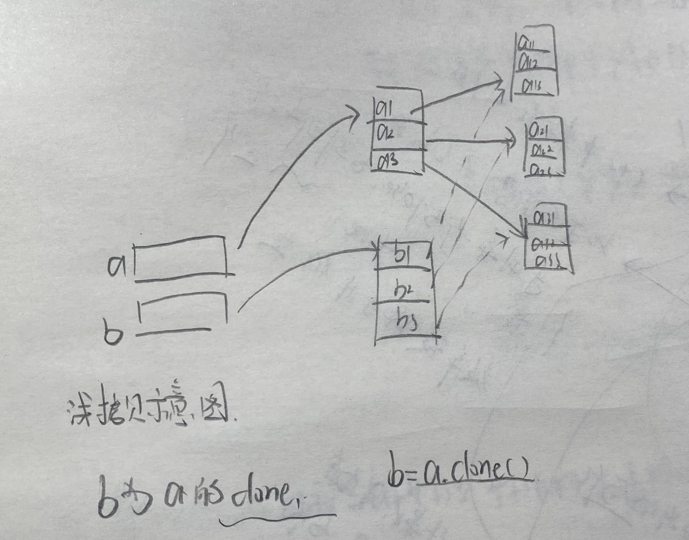

# 顺序结构

最质朴的结构,程序从上至下逐行执行,没有跳转

# 分支结构

if语句和switch语句，其中if语句使用布尔表达式或布尔值作为分支条件来进行分支控制；而switch语句则用于对多个整型值进行匹配，从而实现分支控制。

## if条件语句

```java
if(logicExpression){
	statement
    //statement只有一句时可以省略{}代码块(条件执行体,除非遇到break,continue或者retrun等关键字或者异常)
}else if(...){
	statement
}else{
	statement
}
```

> 关于else(elseif&else)

- else包含前面的取反条件


## switch条件语句

一个控制表达式和多case组成

```java
switch(expression){//一个控制表达式
    case condition1:{//case
      statement;
      break;
    }
    case condition2:{
      statement;
      break;
    }
    case condition3:{
      statement;
      break;
    }
    default:{//隐含条件:前面的case全部不满足($!case1&&!case2&&!case2$)
        statement
    }
}
```

- expression
  - switch语句后面的控制表达式的数据类型只能是byte、short、char、int四种整数类型，枚举类型和java.lang.String类型
    （从Java 7才允许），不能是boolean类型。
  - 从Java 7开始增强了switch语句的功能，允许switch语句的控制表 达 式 是 java.lang.String 类 型 的 变 量 或 表 达 式 — 只 能是java.lang.String类型，不能是StringBuffer或StringBuilder这两种字符串类型。

- 执行流程
  - 这种分支语句的执行是先对expression求值，然后依次匹配condition1、condition2、…、conditionN等值，遇到匹配的值即执行对应的执行体；如果所有case标签后的值都不与expression表达式的值相等，则执行default标签后的代码块。

- 关于`break`

  - 

  - Java 11编译器做了一些改进，如果开发者忘记了case块后面的break语句，Java 11编译器会生成警告：“[fallthrough]可能无法实现case”。这个警告以前需要为javac指定-X：fallthrough选项才能显示出来。
  - 如果省略了case后代码块的break;，将引入一个陷阱==switch穿透case和default==

# 循环结构

循环语句可以在满足循环条件的情况下，反复执行某一段代码，这段被重复执行的代码被称为循环体。当反复执行这个循环体时，需要在合适的时候把循环条件改为假，从而结束循环，否则循环将一直执行下去，形成死循环。循环语句可能包含如下4个部分。

➢ 初始化语句（init_statement）：一条或多条语句，这些语句用于完成一些初始化工作，初始化语句在循环开始之前执行。

➢ 循环条件（test_expression）：这是一个boolean表达式，这个表达式能决定是否执行循环体。

➢ 循环体（body_statement）：这个部分是循环的主体，如果循环条件允许，这个代码块将被重复执行。如果这个代码块只有
一行语句，则这个代码块的花括号是可以省略的。

➢ 迭代语句（iteration_statement）：这个部分在一次循环体执行结束后，对循环条件求值之前执行，通常用于**控制循环条件中的变量**，使得循环在合适的时候结束。

上面4个部分只是一般性的分类，并不是每个循环中都非常清晰地分出了这4个部分。

## while

```java
[init_statement]
while([test_expression]){
	[body_statement];
	[iteration_statement];//变量迭代
}
```

## do while

先执行循环体,再执行条件测试

```java
[init_statement];
do{
	[body_statement];
	[iteration_statement];//变量迭代
}while([test_expresiion])
```

## for

```java
for([init_statement];[test_expression];[iteration_statement]){
	[body_statement];
}
```

> **for语句执行**

1. 先执行循环的初始化语句init_statement，初始化语句只在循环开始前执行一次。

2. 每次执行循环体之前，先计算test_expression循环条件的值，

  1) 如果循环条件返回true，则执行循环体，循环体执行结束后执行循环迭代语句。
  2) 如果循环条件返回false，则不执行循环体，退出for循环。

  因此，对于for循环而言，**循环条件总比循环体要多执行一次**，因为最后一次执行循环条件返回false，将不再执行循环体。

3. 循环体和循环迭代语句分开

  1. 因此即使在执行循环体时遇到continue语句结束本次循环，循环迭代语句也一样会得到执行。

> **for&continue**

continue:

- 跳过循环体中的后续代码
- 不能跳过循环迭代语句，相当于跳转到循环迭代语句处

> for语句

注意for`()`中的三个部分都是语句,也都可以省略

一个死循环

```java
for(;;){
	...
}
//相当于
while(true){
	...
}
```

```java
init-statement
while(test-expression){
	statement;
	iteration-statement;
}
//相当于下面的for循环
init-statement
for(;test-expression;){
	statement;
	iteration-statement;
}
```

执行顺序


# 控制循环

提供了continue和break来控制循环结构。除此之外，return可以结束整个方法，当然也就结束了一次循环

## break

- 结束所在的循环

- 也可以结束外层循环

  - 在break所在循环的外层循环之前加上标签`xxx:`

  - 使用`break:xxx;`可以结束外层循环

  - ```java
            outer:
            for(int i=0;i<10;i++){
                for(int j=0;j<10;j++){
                    System.out.printf("%s:%d,%s:%d\n","i",i,"j",j);
                    if(j==1)break outer;//结束外层循环
                }
            }
    /**
    输出:
    i:0,j:0
    i:0,j:1
    **/
    ```

  - 如果`break tag;`用于结束`break`语句所在的一层循环则没有任何意义,因为break的默认作用就是结束本层循环

## continue

continue忽略本次循环剩下语句，但是不能结束循环

- 如果continue放在循环体的最后一行，则这个continue没有意义

关于`continue:tag`

- 跳过标签所标识的循环体的剩下语句，执行循环迭代
- continue后的标签也必须是一个有效标签，即这个标签通常应该放在continue所在循环的外层循环之前定义。

```java
        outer:
        for(int i=0;i<5;i++){
            for(int j=0;j<3;j++){
                System.out.printf("%s:%d,%s:%d\n","i",i,"j",j);
                if(j==1)continue outer;//结束外层循环
                /**
                 * i:0,j:0
                 * i:0,j:1->continue
                 * i:1,j:0
                 * i:1,j:1->continue
                 * i:2,j:0
                 * i:2,j:1->continue
                 * i:3,j:0
                 * i:3,j:1->continue
                 * i:4,j:0
                 * i:4,j:1->continue,执行循环迭代i++后i=5,进行条件测试为false退出
                 */
            }
        }
```

## return

结束一个方法（隐含的可以结束所在的内层和外层循环）

```java
void test(){
	for(){//循环outer
        for(){//循环inner
            retrun;//结束所在的方法,同时结束outer&inner
        }
	}
}
```

# 数组基本

引用类型

- 存储同一种类型(基本类型或者引用类型)的数据
- 初始化完成时,数组长度固定,在内存中的空间固定,除非gc回收,否则不再改变

## 定义数组

```
type[] arr;
```

定义了一个引用变量arr,此时它还没有指向任何内存空间

## 初始化

java中的变量需要初始化后才能使用

什么是初始化?

​		为变量分配内存空间并为其赋值;
​		在数组中体现为为数组开辟内存空间并未数组中的每个元素赋值;

可以只开辟内存空间不给初值吗?

- 不可以,开辟了内存空间其实就为数组元素赋值了(这个初值来自系统自动分配或者程序指定)

- ```java
          //基本类型
          int[]a=new int[5];
          System.out.println(a[0]);//0
          boolean[]a1=new boolean[5];
          System.out.println(a1[0]);//false
          char[]a2=new char[5];
          System.out.println(a2[0]==0);//ascii码:0
          //引用类型的初值都是null
          String[]b=new String[5];
          System.out.println(b[0]);//null
  ```

数组的初始化有如下两种方式。

➢ 静态初始化：初始化时由程序员显式指定每个数组元素的初始值，由系统决定数组长度。

➢ 动态初始化：初始化时程序员只指定数组长度，由系统为数组元素分配初始值。

### 静态初始化

```java
type1[] arr;//定义
arr =new type2[]{e1,e2,e3,...}//初始化,type1可以是type2或者type2的父类
//长度由系统自动推断
arr ={e1,e2,e3,...}//简写
//一般在定义的同时完成初始化
int[] arr=new int[]{1,2,3}
```

### 动态初始化

```java
type1[] arr;//定义
arr =new tyep2[length];//初始化,type1可以是type2或者type2的父类
//元素的值由系统自动指定
```

> 元素的初始化值

执行动态初始化时，程序员只需指定数组的长度，即为每个数组元素指定所需的内存空间，系统将负责为这些数组元素分配初始值。指定初始值时，系统按如下规则分配初始值。
➢ 数组元素的类型是基本类型中的整数类型（byte、short、int和long），则数组元素的值是0。

➢ 数 组 元 素 的 类 型 是 基 本 类 型 中 的 浮 点 类 型 （ float 、double），则数组元素的值是0.0。

➢ 数组元素的类型是基本类型中的字符类型（char），则数组元素的值是'\u0000'。

➢ 数组元素的类型是基本类型中的布尔类型（boolean），则数组元素的值是false。

➢ 数组元素的类型是引用类型（类、接口和数组），则数组元素的值是null。

> 注意:不要同时使用静态初始化和动态初始化，也就是说，不要在进行数组初始化时，既指定数组的长度，也为每个数组元素分配初始值。

```java
int[] arr=new int[5]{1,2,3,4,5};//错误
int[] arr=new int[]{1,2,3,4,5};//静态初始化
int[] arr=new int[5];//动态初始化
```

## var自动类型推断:推断数组

> 版本要求:java10+

- 需要同时完成初始化
  - 可以是静态初始化和动态初始化
  - 不能是简化的静态初始化

```java
var arr1=new String[]{"1","2"};
var arr2=new String[2];
//下面是错误的写法
var arr3={"1","2"};//编译器无法推断arr3的数组元素类型
```

## 数组使用

数组属性:`length`

数组下标:`0~length-1`

索引访问

```java
arr[index]
//index<0||index>length-1时编译不报错,运行时抛出异常
```

## foreach循环

> 版本:java5+

自动遍历数组&集合

- 不需要数组长度和索引访问
- 遍历元素自动遍历数组或者集合的元素

```java
for(type variableName:array|collection){
    //type可以写var或者数组或集合元素的类型
	//variableName自动迭代访问其中的元素
}
```

> 关于variableName

当使用foreach来迭代访问数组元素时，foreach中的循环变量相当于一个临时变量，系统会把数组元素的值依次赋给这个临时变量，而这个临时变量并不是数组元素，它只是保存了数组元素的值。因此，如果希望改变数组元素的值，则不能使用这种foreach循环。

使用foreach循环迭代数组元素时，并**不能改变数组元素的值**，因此不要对foreach的循环变量进行赋值。

对foreach的循环变量赋值时,原数组的元素不发生改变

```java
        var arr=new String[]{"1","2","3"};
        for (var e:
             arr) {
            //e只是一个临时变量,修改e不会修改数组内部的元素
            e="4";
            System.out.println(e);
        }
        System.out.println(arr[0]);//"1"
```

# 数组深入

数组是一种引用数据类型，数组引用变量只是一个引用，数组元素和数组变量在内存里是分开存放的。

## 内存中的数组

实际的数组对象被存储在堆（heap）内存中；如果引用该数组对象的数组引用变量是一个局部变量，那么它被存储在栈（stack）内存中。数组在内存中的存储示意图如图4.2所示。


> 为什么有栈内存和堆内存之分？

当一个方法执行时，每个方法都会建立自己的内存栈，在这个方法内定义的变量将会逐个放入这块栈内存里，随着方法的执行结束，这个方法的内存栈也将自然销毁。因此，所有在方法中定义的局部变量都是放在栈内存中的；

在程序中创建一个对象时，这个对象将被保存到运行时数据区中，以便反复利用（因为对象的创建成本通常较大），这个运行时数据区就是堆内存。堆内存中的对象不会随方法的结束而销毁，即使方法结束后，这个对象还可能被另一个引用变量所引用（在方法的参数传递时很常见），则这个对象依然不会被销毁。

只有当一个对象没有任何引用变量引用它时，系统的垃圾回收器才会在合适的时候回收它。

同样的,如果堆内存中数组不再有任何引用变量指向自己，则这个数组将成为垃圾，该数组所占的内存将会被系统的垃圾回收器回收。因此，为了让垃圾回收器回收一个数组所占的内存空间，可以将该数组变量赋为null，也就切断了数组引用变量和实际数组之间的引用关系，实际的数组也就成了垃圾。


## 数组的赋值机制


## 深拷贝&浅拷贝

深拷贝:值拷贝,值传递,假设a拷b,修改a中内容则不会影响b中内容

浅拷贝:引用拷贝,引用传递,同上,改a的同时会改动b

```java
int[] a={1,2,3};
int[] b=a;//浅拷贝
int[] c=Arrarys.copyOf(a,a.length);//深拷贝
```

1、什么叫Java浅拷贝？

浅拷贝是按位拷贝对象，它会创建一个新对象，这个对象有着原始对象属性值的一份精确拷贝。如果属性是基本类型，拷贝的就是基本类型的值；如果属性是内存地址（引用类型），拷贝的就是内存地址 ，因此如果其中一个对象改变了这个地址，就会影响到另一个对象。

2、什么叫Java深拷贝？

深拷贝复制变量值，对于引用数据，则递归至基本类型后，再复制。深拷贝后的对象与原来的对象是完全隔离的，互不影响，对一个对象的修改并不会影响另一个对象。深拷贝相比于浅拷贝速度较慢并且花销较大。

```java
    static void TestArrayCopy(){
        //数组元素为基本类型时
        int[] a={1,2,3};
        int[] b=a.clone();//一维深拷贝
        b[0]=2;
        System.out.println(a[0]+" "+b[0]);

        //数组元素为引用类型时
        int[][] a1={{1,2,3},{4,5,6},{7,8,9}};
        int[][] b1=a1.clone();
        b1[0][0]=2;
        System.out.println(a1[0][0]);//2
        b1[1]=a;
        System.out.println(a1[1][1]+" "+b1[1][1]);//浅拷贝,只拷贝第一层
    }
```



二维数组深拷贝

```java
        int[][]a2={{1,2,3},{4,5,6},{7,8,9}};
        int[][]b2=new int[a2.length][];
        for(int i=0;i<a2.length;i++)b2[i]=a2[i].clone();//O(n^2)
```

## Java没有多维数组

Java中虽然有多维数组的语法,但是从实现上说只有一维数组

```java
int[][] a=new int[row][col];
```

- row必须指定,col可以不写

  ```java
  int[][]a=new int[4][];
  int[][][]a=new int[4][][];
  int[][][]...[]a=new int[4][][]...[];//多维
  ```

为什么?a首先要在堆中开辟一块空间放入一个一维数组,如果连数组长度都不知道则不可能在堆中开辟内存空间。而一维数组中的元素可以指向null也可以指向一块一维数组


> 静态初始化二维数组

可以使用静态初始化方式来初始化二维数组。使用静态初始化方式来初始化二维数组时，二维数组的每个数组元素都是一维数组，
因此必须指定多个一维数组作为二维数组的初始化值

```java
        /*静态初始化二维数组*/
        String[][]str1=new String[][]{
                //String[2][3],由系统自动推断各维长度
                //为每个一维数组指定一个初始化数组
                new String[3],//动态初始化
                new String[]{"hello","world"}
        };
        /*简化的静态初始化语法*/
        String[][] str2={
            new String[3],//动态初始化
            new String[]{"hello","world"}
        };
```

## 数组工具类：Arrays

Java提供的Arrays类里包含的一些static修饰的方法可以直接操作数组，这个Arrays类里包含了如下几个static修饰的方法（static修饰的方法可以直接通过类名调用）。

**二分**

➢` int binarySearch(type[] a, type key)`：使用二分法查询key元素值在a数组中出现的索引；如果a数组不包含key元素值，则返回负数。调用该方法时要求数组中元素已经按**升序排列**，这样才能得到正确结果。

➢` int binarySearch(type[] a, int fromIndex, int toIndex,type key)`：这个方法与前一个方法类似，但它只搜索a数组中fromIndex到toIndex索引的元素。调用该方法时要求数组中元素已经按升序排列，这样才能得到正确结果。

$[fromIndex,toIndex)$

**拷贝**

➢ `type[] copyOf(type[] original, int length)`：这个方法将会把original数组复制成一个新数组，其中length是新数组的长度。如果length小于original数组的长度，则新数组就是原数组的前面length个元素；如果length大于original数组的长度，则新数组的前面元素就是原数组的所有元素，后面补0（数值类型）、false（布尔类型）或者null（引用类型）。

➢ `type[] copyOfRange(type[] original, int from, int to)`：这个方法与前面方法相似，但这个方法只复制original数
组的from索引到to索引的元素。

**比较**

➢ `boolean equals(type[] a, type[] a2)`：如果a数组和a2数组的长度相等，而且a数组和a2数组的数组元素也一一相同，该方法将返回true。

**填充**

➢ `void fill(type[] a, type val)`：该方法将会把a数组的所有元素都赋值为val。
➢` void fill(type[] a, int fromIndex, int toIndex, type val)`：该方法与前一个方法的作用相同，区别只是该方法仅仅将a数组的fromIndex到toIndex索引的数组元素赋值为val。

$[fromIndex,toIndex)$

**排序**

➢ `void sort(type[] a)`：该方法对a数组的数组元素进行排序。
➢` void sort(type[] a, int fromIndex, int toIndex)`：该方法与前一个方法相似 ，区别是该方法仅仅对fromIndex 到
toIndex索引的元素进行排序。$[fromIndex,toIndex)$

**输出(常用)**

➢ `String toString(type[] a)`：该方法将一个数组转换成一个字符串。该方法按顺序把多个数组元素连缀在一起，多个数组元素使用英文逗号（,）和空格隔开。

> 方法测试

```java
    /**
     * 测试Arrays工具类的方法
     */
    @Test
    public void testArrays(){
        int[] a=new int[]{1,2,3,4};
        int[] b=new int[]{1,2,3,4};
        System.out.println(a==b);//false,不指向同一个对象
        System.out.println(Arrays.equals(a,b));//true
        //拷贝
        int[] c=Arrays.copyOf(a,a.length+2);//[1,2,3,4,0,0]
        System.out.println(Arrays.equals(a,c));//false
        //填充
        Arrays.fill(c,c.length-2,c.length-1,-1);
        //[4,5)填充
        System.out.println(Arrays.toString(c));//[1, 2, 3, 4, -1, 0]
        //排序
        Arrays.sort(c,0,c.length);
        System.out.println(Arrays.toString(c));//[-1, 0, 1, 2, 3, 4]
        //二分查找
        System.out.println(Arrays.binarySearch(c,0));//1
    }
```

**关于比较:**

在 System 类 里 也 包 含 了 一 个 `static void arraycopy(Object src, int srcPos, Object dest, int destPos,int length)`方法，该方法可以将src数组里的元素值赋给dest数组的元素，其中srcPos指定从src数组的第几个元素开始赋值，length参数指定将src数组的多少个元素值赋给dest数组的元素。

**Java8新增方法**

Java 8增强了Arrays类的功能，为Arrays类增加了一些工具方法，这些工具方法可以充分利用多CPU并行的能力来提高设值、排序的性能。下面是Java 8为Arrays类增加的工具方法。

➢ void parallelPrefix(xxx[] array, XxxBinaryOperatorop)：该方法使用op参数指定的计算公式计算得到的结果作为新的数组元素。op计算公式包括left、right两个形参，其中left代表新数组中前一个索引处的元素，right代表array数组中当前索引处的元素。新数组的第一个元素无须计算，直接等于array数组的第一个元素。
➢ void parallelPrefix(xxx[] array, int fromIndex, inttoIndex, XxxBinaryOperator op)：该方法与上一个方法相似，区别是该方法仅重新计算fromIndex到toIndex索引的元素。

➢ void setAll(xxx[] array, IntToXxxFunction generator)：该方法使用指定的生成器（generator）为所有数组元素设置值，该生成器控制数组元素的值的生成算法。
➢ void parallelSetAll(xxx[] array, IntToXxxFunctiongenerator)：该方法的功能与上一个方法相同，只是该方法增加了并行能力，可以利用多CPU并行来提高性能。

➢ void parallelSort(xxx[] a)：该方法的功能与Arrays类以前就有的sort()方法相似，只是该方法增加了并行能力，可以利用多CPU并行来提高性能。
➢ void parallelSort(xxx[] a, int fromIndex, int toIndex)：该方法与上一个方法相似，区别是该方法仅对fromIndex到toIndex索引的元素进行排序。
➢ Spliterator.OfXxx spliterator(xxx[] array)：将该数组的所有元素转换成对应的Spliterator对象。
➢ Spliterator.OfXxx spliterator(xxx[] array, int startInclusive, int endExclusive)：该方法与上一个方法相似，区别是该方法仅转换startInclusive到endExclusive索引的元素。
➢ XxxStream stream(xxx[] array) ： 该 方 法 将 数 组 转 换 为Stream，Stream是Java 8新增的流式编程的API。
➢ XxxStream stream(xxx[] array, int startInclusive, int endExclusive)：该方法与上一个方法相似，区别是该方法仅fromIndex到toIndex索引的元素转换为Stream。

> 使用:参考疯狂Java4.6.6