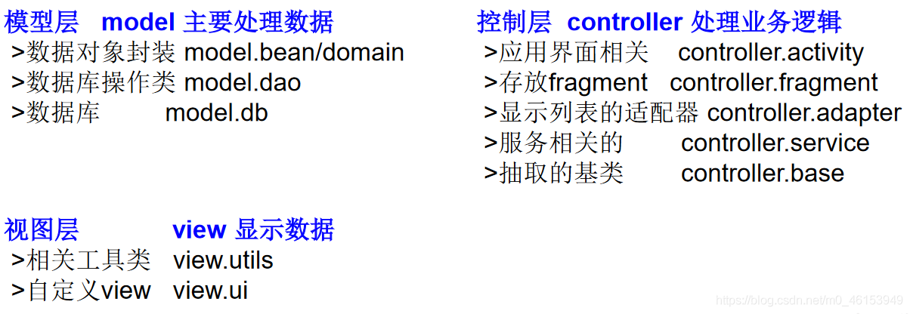
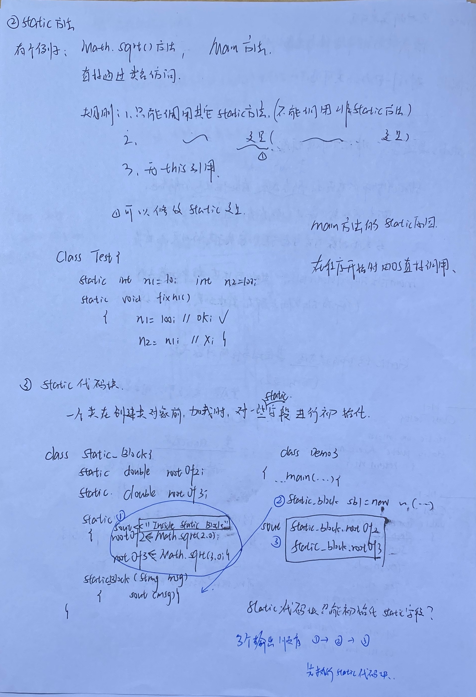
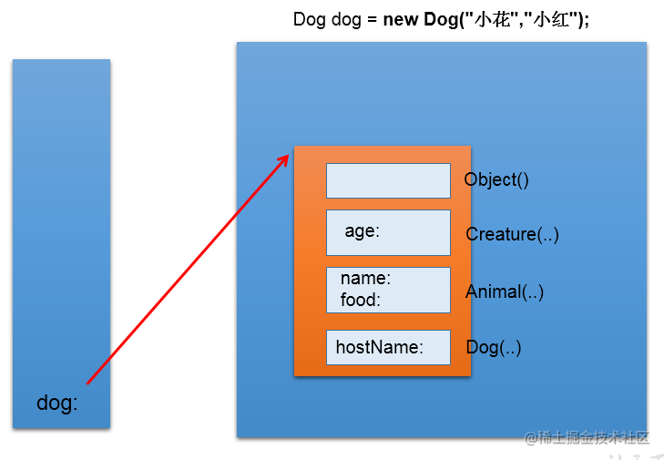

面向过程与面向对象
========================================================================

何谓“面向对象”的编程思想？ 
首先解释一下“思想”。 
先问你个问题：你想做个怎样的人？ 
可能你会回答：我想做个好人，孝敬父母，尊重长辈，关爱亲朋… 
你看，这就是思想。这是你做人的思想，或者说，是你做人的原则。做人有做人的原则，编程也有编程的原则。这些编程的原则呢，就是编程思想。

> 面向过程(POP) 与面向对象(OOP)

*   面向对象：Object Oriented Programming
*   面向过程：Procedure Oriented Programming

```java
/*
 * 一、学习面向对象内容的三条主线
 * 1.Java 类及类的成员：属性、方法、构造器、代码块、内部类
 * 2.面向对象的三大特征：封装、继承、多态性、(抽象性)
 * 3.其它关键字：this、super、static、final、abstract、interface、package、import 等
 * 
 * 二、人把大象装进冰箱
 * 1.面向过程:强调的是功能行为，以函数为最小单位，考虑怎么做。
 * 
 * ① 打开冰箱
 * ② 把大象装进冰箱
 * ③ 把冰箱门关住 
 * 
 * 2.面向对象:强调具备了功能的对象，以类/对象为最小单位，考虑谁来做。
 * 人{
 * 		打开(冰箱){
 * 			冰箱.开门();
 * 		}操作(大象){
 * 			大象.进入(冰箱);
 * 		}关闭(冰箱){
 * 			 冰箱.关门();     
 * 		}
 * }
 * 
 * 冰箱{
 * 		开门(){
 * 		}  
 * 		关门(){
 * 		}
 * }
 * 
 * 大象{
 * 		进入(冰箱){
 * 		}
 * }
 */

```

> 面向对象的思想概述

*   程序员从面向过程的执行者转化成了面向对象的指挥者
*   面向对象分析方法分析问题的思路和步骤：
    *   根据问题需要，选择问题所针对的现实世界中的实体。
    *   从实体中寻找解决问题相关的属性和功能，这些属性和功能就形成了概念世界中的类。
    *   把抽象的实体用计算机语言进行描述，形成计算机世界中类的定义。即借助某种程序语言，把类构造成计算机能够识别和处理的数据结构。
    *   将类实例化成计算机世界中的对象。对象是计算机世界中解决问题的最终工具。

# JVM内存管理


# 类加载


# 类和对象

Java是面向对象的程序设计语言，类是面向对象的重要内容，可以把类当成一种自定义类型，可以使用类来定义变量，这种类型的变量统称为引用变量。也就是说，所有类是引用类型，所有对象时引用对象。


```java
/* 
 * 三、面向对象的两个要素：
 * 类:对一类事物的描述，是抽象的、概念上的定义
 * 对象:是实际存在的该类事物的每个个体，因而也称为实例(instance)。
 * 可以理解为：类= 抽象概念的人；对象= 实实在在的某个人
 * 面向对象程序设计的重点是类的设计；
 * 设计类，其实就是设计类的成员。
 */
```

类的成员:

1. 属性/字段
2. 成员方法(特别的有toString和equal)
3. 构造器
4. 析构器(Java有自动GC,一般不写析构器)
5. 代码块

# 定义类

```java
[修饰符] class 类名{
	0~n个构造器;
	0~n个成员变量;
	0~n个方法;
}
```

**修饰符**可以是public、final、abstract，或者完全省略这三个修饰符，

**类名**只要是一个合法的标识符即可，但这仅仅满足的是Java的语法要求；如果从程序的可读性方面来看，Java类名必须是由一个或多个有意义的单词连缀而成的，每个单词首字母大写，其他字母全部小写，单词与单词之间不要使用任何分隔符。
$CamelCase$

类里各成员之间的定义顺序没有任何影响，各成员之间可以相互调用

## static修饰符

static修饰方法,成员变量；static成员表示属于类；所以static方法成员变量又被称呼为类方法，类变量
非static成员表示属于类的实例

**使用**

static修饰的成员不能访问没有static修饰的成员，静态方法只能访问静态属性

通过类可以直接调用其中的static成员

```java
Class.staticField;
Class.staticMethod();
```

类的实例可以直接访问static成员，但是一般不使用

```java
classobj.staticField;
classobj.staticMethod();
```

**关于翻译**

static被翻译为静态，所以static方法成员变量又被称呼为静态方法，静态变量

虽然绝大部分资料都喜欢把static称为静态，但实际上这种说法很模糊，完全无法说明static的真正作用。

static的真正作用就是用于区分成员变量、方法、内部类、初始化块（本书后面会介绍后两种成员）这四种成员到底**属于类本身还是属于实例**。在类中定义的成员，static相当于一个标志，有static修饰的成员属于类本身，没有static修饰的成员属于该类的实例。

**补充**

<a href="#static">点击跳转到static成员内存分配</a>

## 成员变量

```
[修饰符] 类型 成员变量名 [= 默认值]
```

➢ 修饰符：修饰符可以省略，也可以是public、protected、private、static、final，其中public、protected、private三个最多只能出现其中之一，可以与static、final组合起来修饰成员变量。

➢ 类型：类型可以是Java语言允许的任何数据类型，包括基本类型和现在介绍的引用类型。

➢ 成员变量名：成员变量名只要是一个合法的标识符即可，但这只是从语法角度来说的；如果从程序可读性角度来看，使用小驼峰<sup>(成员变量名应该由一个或多个有意义的单词连缀而成，第一个单词首字母小写，后面每个单词首字母大写，其他字母全部小写，单词与单词之间不要使用任何分隔符。)</sup>成员变量用于描述类或对象包含的状态数据，因此成员变量名建议使用英文名词。

➢ 默认值：定义成员变量还可以指定一个可选的默认值。

>成员变量由英文单词field意译而来，早期有些书籍将成员变量称为属性。但实际上在Java世界里属性（由property翻译而来）指的是一组setter方法和getter方法。比如说某个类有age属性，意味着该类包含setAge()和getAge()两个方法。另外，也有些资料、书籍将field翻译为字段、域。
>同样的,js中也是认为一个field指的是一组getter&setter方法

> 成员变量(属性)和局部变量比较

 1.相同点:

​    1.1 定义变量的格式:数据类型 变量名 = 变量值

​    1.2 先声明，后使用

​    1.3 变量都有其对应的作用域

2. 不同点

   - 在类中声明的位置不同

     - 属性:直接定义在类的一对{}内
     - 局部变量:声明在方法内、方法形参、构造器形参、构造器内部的变量

   - 关于权限修饰符的不同

     - 属性:可以在声明属性时，指明其权限，使用权限修饰符。常用的权限修饰符:private、public、缺省、protected(目前声明属性时，都使用缺省即可。)
     - 局部变量:不可以使用权限修饰符

   - 默认初始化值的情况

     - 属性:类的属性，根据其类型，都有默认初始化值。

       ```
       整型(byte、short、int、long):0
       浮点型(float、double):0.0
       字符型(char):0(或‘\u0000’)
       布尔型(boolean):false
       ==============
       引用数据类型(类、数组、接口):null
       ```

     - 局部变量:没有默认初始化值

       - 意味着:在调用局部变量之前，一定要显式赋值
       - 作为方法的形参时,需要在调用时传入实参\

   - 在内存中加载的位置，亦各不相同

     - 属性:加载到堆空间中(非 static)
     - 局部变量:加载到栈空间

```java
public class UserTest {
	public static void main(String[] args) {
		User u1 = new User();
		System.out.println(u1.name);
		System.out.println(u1.age);
		System.out.println(u1.isMale);
		
		u1.talk("俄语");
	}
}
class User{
	//属性(或成员变量)
	String name;	//不加 private 即为缺省
	public int age;	//不加 public 即为缺省
	boolean isMale;
	
	public void talk(String language){//language:形参，也是局部变量
		System.out.println("我们使用" + language + "进行交流。");
	}
	
	public void eat(){
		String food = "石头饼";	//石头饼:局部变量
		System.out.println("北方人喜欢吃:" + food);
	}
}
```


> 字段的默认初始化和显示初始化

- 默认初始化: 即不给他赋值,基本类型默认初始化为0,引用类型为null

- 显示初始化: 在类中(无论是在定义时还是在代码块中)给字段赋值

顺序:先默认初始化,然后再显示初始化,对于一个将要显示初始化的字段也先进行默认初始化

> 小练习:分析类加载过程


## 定义方法

```java
[修饰符] 方法返回值类型 方法名(形参列表){
	...
}
```

对定义方法语法格式的详细说明如下。

➢ 修饰符：修饰符可以省略，也可以是public、protected、private 、 static 、 final 、 abstract ， 其 中 public 、protected、private三个最多只能出现其中之一(不写时即为缺省)；abstract和final最多只能出现其中之一，它们可以与static组合起来修饰方法。

➢ 方法返回值类型：返回值类型可以是Java语言允许的任何数据类型，包括基本类型和引用类型；如果声明了方法返回值类型，则方法体内必须有一个有效的return语句，该语句返回一个变量或一个表达式，这个变量或者表达式的类型必须与此处声明的类型匹配。除此之外，如果一个方法没有返回值，则必须使用void来声明没有返回值(当然也可以视同`retrun;`结束方法)。

➢ 方法名：方法名的命名规则与成员变量的命名规则基本相同，但由于方法用于描述该类或该类的实例的行为特征或功能实现，因此通常建议方法名以英文动词开头。

➢ 形参列表：形参列表用于定义该方法可以接受的参数，形参列表由零组到多组“参数类型 形参名”组合而成，多组参数之间以英文逗号（,）隔开，形参类型和形参名之间以英文空格隔开。一旦在定义方法时指定了形参列表，则调用该方法时必须传入对应的参数值——谁调用方法，谁负责为形参赋值。

方法体中程序的执行顺序也是从上至下顺序执行

```java
public class CustomerTest {
	public static void main(String[] args) {
		
		Customer cust1 = new Customer();
		
		cust1.eat();
		
		//测试形参是否需要设置的问题
//		int[] arr = new int[]{3,4,5,2,5};
//		cust1.sort();
		
		cust1.sleep(8);
		
	}
}
//客户类
class Customer{
	
	//属性
	String name;
	int age;
	boolean isMale;
	
	//方法
	public void eat(){
		System.out.println("客户吃饭");
		return;
		//return后不可以声明表达式
//		System.out.println("hello");
	}
	
	public void sleep(int hour){
		System.out.println("休息了" + hour + "个小时");
		
		eat();
//		sleep(10);
	}
	
	public String getName(){
		
		if(age > 18){
			return name;
			
		}else{
			return "Tom";
		}
	}
	
	public String getNation(String nation){
		String info = "我的国籍是：" + nation;
		return info;
	}
	
	//体会形参是否需要设置的问题
//	public void sort(int[] arr){
//		
//	}
//	public void sort(){
//		int[] arr = new int[]{3,4,5,2,5,63,2,5};
//		//。。。。
//	}
	
	public void info(){
		//错误的
//		public void swim(){
//			
//		}
		
	}
}
```

> 万物皆对象

1. 在Java语言范畴中，我们都将功能、结构等封装到类中，通过类的实例化，来调用具体的功能结构。
   - Scanner,String等
   - 文件:File,输入输出流,Exception...
   - 网络资源：URL
2. 涉及到Java语言与前端html、后端的数据库交互时，前后端的结构在Java层面交互时，都体现为类、对象。

## 构造器

```
[修饰符] 构造器名(形参列){
	...
}
```

对定义构造器语法格式的详细说明如下。

➢ 修饰符：修饰符可以省略(要暴露出去的使用public,私有的使用private)，也可以是public、protected、private其中之一。

➢ 构造器名：构造器名必须和类名相同。

➢ 形参列表：和定义方法形参列表的格式完全相同。

> 默认构造器

构造器是一个类创建对象的根本途径，如果一个类没有构造器，这个类通常无法创建实例。因此，Java语言提供了一个功能：如果程序员没有为一个类编写构造器，则系统会为该类提供一个默认的构造器。一旦程序员为一个类提供了构造器，系统将不再为该类提供构造器。

> 注意:构造器没有返回类型

值得指出的是，构造器既不能定义返回值类型，也不能使用void声明构造器没有返回值。

如果为构造器定义了返回值类型，或使用void声明构造器没有返回值，编译时不会出错，但Java会把这个所谓的构造器当成方法来处理——它就不再是构造器。

**隐式返回值**

实际上，类的构造器是有返回值的，**当使用new关键字来调用构造器时，构造器返回该类的实例**，可以把这个类的实例当成构造器的返回值，因此构造器的返回值类型总是当前类，无须定义返回值类型。但必须注意：不要在构造器里显式使用return来返回当前类的对象，因为构造器的返回值是隐式的。

> 关于调用

使用new关键字

```java
new Person();
```

- 可以调用公有的构造器
- 不可以调用类中的私有构造器，只有类内部才可以调用

## 定义一个类

```java
public class Person {
    String name;
    int age;
    boolean isMale;

    public Person() {
    }

    public Person(String name, int age) {
        this.name = name;
        this.age = age;
    }
    
    public Person(String name, int age, boolean isMale) {
        this.name = name;
        this.age = age;
        this.isMale = isMale;
    }
    
    public static printInfo(){
        sout("Person:{name,age}");
	}
    
    @Override
    public String toString() {
        return "Person{" +
                "name='" + name + '\'' +
                ", age=" + age +
                ", isMale=" + isMale +
                '}';
    }
}
```

# 对象

## 对象的创建和使用

- 定义变量,创建对象

  - ```java
    Person p//定义引用变量
    new Person();//创建对象,在内存中开辟一块空间存储对象
    Person p=new Person();//定义变量的同时创建变量
    ```

- 访问属性(成员变量和成员方法)

  - 对象.成员(适用于static&非static)
  - 类.成员(只能是static)


*   堆（Heap），此内存区域的唯一目的就是存放对象实例，几乎所有的对象实例都在这里分配内存。这一点在 Java 虚拟机规范中的描述是：所有的对象实例以及数组都要在堆上分配。
*   通常所说的栈（Stack），是指虚拟机栈。虚拟机栈用于存储局部变量等。局部变量表存放了编译期可知长度的各种基本数据类型（boolean、byte、char、short、int、float、long、double）、对象引用变量（reference 类型，它不等同于对象本身，是对象在堆内存的首地址）。方法执行完，自动释放。
*   方法区（MethodArea），用于存储已被虚拟机加载的类信息、常量、静态变量、即时编译器编译后的代码等数据。

> 例1:

```java
Person p1= new Person();
p1.name = "Tom";
p1.isMale = true;

Person p2 = new Person();
sysout(p2.name);//null

Person p3 = p1;
p3.age = 10;
```


> 例2

```java
Person p1= new Person();
p1.name = "wff";
p1.age = 23;

Person p2 = new Person();
p2.age = 10;
```


## 关于引用变量和对象


引用变量相当于c中的指针(事实上就是c中的指针)指向该堆内存里的对象，对象的成员变量数据实际存放在堆内存里

引用变量可以在栈或者堆中。

从这个角度来看，引用变量与C语言里的指针很像，它们都是存储一个地址值，通过这个地址来引用到实际对象。实际上，Java里的引用就是C里的指针，只是**Java语言把这个指针封装起来，避免开发者进行烦琐的指针操作**。

堆中的对象只能由引用变量间接引用，不能直接访问。

如果堆中的对象没有引用变量引用（p=null），则会被java视作没有人引用的垃圾，过段时间被回收。

## 对象数组的内存解析

```java
/*引用类型的变量，只可能存储量两类值：null或地址值（含变量类型）*/
Student[] stus= newStudent[5];

stus[0] = new Student();
sysout(stus[0].state);//1

sysout(stus[1]);//null
sysout(stus[1].number);//异常,空指针异常
//nullPointerException

stus[1] = new Student();
sysout(stus[1].number);//0

class Student{
  int number;//学号
  int state = 1;//年级
  int score;//成绩
}
```


## 匿名对象的使用

1. 理解:我们创建的对象，没有显示的赋值给一个变量名。即为匿名对象。

2. 特征：匿名对象只能调用一次。
   之后因为没有引用变量指向,我们无法获取,同时也会被GC回收

3. ```
   new Class();
   ```

代码示例:

```java
//使用
sout(new Person("张娜英",23,false).toString())
```

## 对象的浅拷贝和深拷贝

```java
        Person p1 = new Person("wff", 23);
        Person p2=p1;//浅拷贝,通过p2修改属性时p1也修改

        //深拷贝
        Person p3=p1.makeCopy();//new一个对象返回
```

1. 浅拷贝：引用传递，修改p2的同时也会修改p1
2. 深拷贝：完全的复制，p3和p2是两个不同的对象

## String的内存分配

- new出一个String时,其引用指向堆,new出来的实例存放在堆中
- 直接通过常量字符串赋值,其引用直接指向永久代的常量池中

```java
String s1=new String("abc");
String s2="abc";
String s3=new String("abc");
```


# 方法

## 方法的重载(overload)

定义:在同一个类中，允许存在一个以上的同名方法，只要它们的参数个数或者参数类型不同即可。

- “两同一不同”:同一个类、相同方法名；参数列表不同：参数个数不同，参数类型不同
- 与方法的返回值类型、权限修饰符、形参变量名、方法体都无关。
- 例子：Arrays类中重载的sort() / binarySearch()
- 如何调用重载的某个方法：`方法名(重载特定的参数列)`

> 代码示例

```java
public class OverLoadTest {
	
	public static void main(String[] args) {
		OverLoadTest test = new OverLoadTest();
		test.getSum(1, 2);	//调用的第一个，输出1
	}

	//如下的四个方法构成了重载
	public void getSum(int i,int j){
		System.out.println("1");
	}
	public void getSum(double d1,double d2){//改变参数类型
		System.out.println("2");
	}
	public void getSum(String s,int i){//改变参数类型
		System.out.println("3");
	}
	
	public void getSum(int i,String s){//改变参数排列
		
	}
	
	//以下3个是错误的重载
//	public int getSum(int i,int j){//改变返回值类型
//		return 0;
//	}
	
//	public void getSum(int m,int n){//改变参数名
//		
//	}
	
//	private void getSum(int i,int j){//改变修饰符
//		
//	}
}
```

> 例子

```java
1.判断：与void show(int a,char b,double c){}构成重载的有：
    
a)void show(int x,char y,double z){} // no
b)int show(int a,double c,char b){} // yes
c) void show(int a,double c,char b){} // yes
d) boolean show(int c,char b){} // yes
e) void show(double c){} // yes 
f) double show(int x,char y,double z){} // no
g) void shows(){} // no,方法名不同
```

## 可变个数形参

JavaSE 5.0 中提供了Varargs(variable number of arguments)机制，允许`直接定义能和多个实参相匹配的形参`。从而，可以用一种更简单的方式，来传递个数可变的实参。

- 格式:`type...args`
- 当调用可变个数形参的方法时，传入的参数的个数可以是：0个，1个，2个...
- 关于重载
  - 可变个数形参的方法与本类中方法名相同，形参不同的方法之间构成重载
  - 可变个数形参的方法与本类中方法名相同，形参类型也相同的数组之间不构成重载。即二者不可共存。
- 可变个数形参在方法中的形参中,必须声明在末尾
- 可变个数形参在方法中的形参中，最多只能声明一个可变形参

```java
public class MethodArgs {

	public static void main(String[] args) {
		MethodArgs test = new MethodArgs();
		test.show(12);
		// test.show("hell0");
		// test.show("hello","world");
		// test.show();

		test.show(new String[] { "AA", "BB", "CC" });
	}

	public void show(int i) {

	}

	public void show(String s){
	 	System.out.println("show(String)");
	}
    public void show(String s1,String s2){
        System.out.println("show(String s1,String s2)"+s1+" "+s2);
    }
    //可变形参方法与上面的方法构成重载,
    //调用person.obj("123")时优先调用public void show(String s)
    //调用person.obj("123","321")时优先调用public void show(String s1,String s2)
    //此时可变形参方法担任的是0个参数或者3+参数时的情况
	public void show(String... strs) {
        //相当于形参定义为String[]strs
		System.out.println("show(String ...strs)");

		for (int i = 0; i < strs.length; i++) {
			System.out.println(strs[i]);
		}
	}
	
    //'show(String[])' is already defined in 'xxx'
	// 此方法与上一方法不可共存:形参之间相同
	// public void show(String[] strs){
	//
	// }

    //可变形参放在参数列后面
	public void show(int i, String... strs) {

	}

	//The variable argument type String of the method show must be the last parameter
//	public void show(String... strs,int i,) {
//
//	}
}
```

## 方法参数的值传递机制(重点！！！)

- 如果变量是基本数据类型，此时赋值的是变量所保存的数据值。
- 如果变量是引用数据类型，此时赋值的是变量所保存的数据的地址值。


```java
    public static void main(String[] args) {
        int m=1,n=10;
        swap(m,n);//方法1:10 1
        System.out.print(m+" "+n+'\n');
        
        String str1="1",str2="10";
        swap(str1,str2);//方法2:10 1
        System.out.print(str1+" "+str2);
    }

    /*基本类型交换*/
    public static void swap(int m,int n){
        int temp=m;
        m=n;
        n=temp;
        System.out.println("方法1:"+m+" "+n);
    }
    /*引用类型交换*/
    public static void swap(String m,String n){
        String temp=m;
        m=n;
        n=temp;
        System.out.println("方法2:"+m+" "+n);
    }
```


## 方法的调用机制


递归调用方法


# 特性1：封装与隐藏

1、封装性的引入与体现

- 为什么需要封装？封装的作用和含义？ 
  我要用洗衣机，只需要按一下开关和洗涤模式就可以了。有必要了解洗衣机内部的结构吗？有必要碰电动机吗？ 
  我要开车，…

- 当我们创建一个类的对象以后，我们可以通过"对象.属性"的方式，对对象的属性进行赋值。这里，赋值操作要受到属性的数据类型和存储范围的制约。但除此之外，没有其他制约条件。

- 但是，实际问题中，我们往往需要给属性赋值加入额外限制条件。这个条件就不能在属性声明时体现，我们只能通过方法进行条件的添加。比如说，我们需要避免用户再使用“对象.属性”的方式对属性进行赋值。则需要将属性声明为私有的(private)

- 此时，针对于属性就体现了封装性。

2、我们程序设计追求“高内聚，低耦合”。

- 高内聚：类的内部数据操作细节自己完成，不允许外部干涉； 
- 低耦合：仅对外暴露少量的方法用于使用。

3、隐藏对象内部的复杂性，只对外公开简单的接口。

- 便于外界调用，从而提高系统的可扩展性、可维护性。通俗的说，**把该隐藏的隐藏起来，该暴露的暴露出来。这就是封装性的设计思想。**

> **封装性实现**：

我们将类的属性私有化(private),同时,提供公共的(public)方法来获取(getXxx)和设置(setXxx)

拓展：封装性的体现：① 如上 ② 单例模式 ③ 不对外暴露的私有方法

```java
public class Person {
    private String name;//private隐藏name和age属性
    private int age;

    public Person() {
    }

    public Person(String name, int age) {
        this.name = name;
        this.age = age;
    }
	//向外暴露getter&setter方法用于访问私有属性
    public String getName() {
        return name;
    }

    public void setName(String name) {
        this.name = name;
    }

    public int getAge() {
        return age;
    }

    public void setAge(int age) {
        this.age = age;
    }
}
```

## 四种权限修饰符

Java 权限修饰符`public、protected、default(缺省)、private` 置于类的成员定义前，用来限定对象对该类成员的访问权限。


**对于 class 的权限修饰只可以用 public 和 default(缺省)。**

*   public 类可以在任意地方被访问。
*   default 类只可以被同一个包内部的类访问。

**4 种权限都可以用来修饰类的内部结构：属性、方法、构造器、内部类**

总结封装性：Java 提供了 4 中权限修饰符来修饰类及类的内部结构，体现类及类的内部结构的可见性的方法。

# 构造器(构造方法)

在new一个对象时由系统自动调用构造器,在创建完对象后负责字段的初始化工作

Java提供一个默认的无参构造器,当我们自定义一个构造器时,将自动覆盖原先的默认无参构造器;

常常我们会对这个构造器进行重载

## 属性赋值的过程

```java
/*
 * 总结:属性赋值的先后顺序
 * 
 * ① 默认初始化值
 * ② 显式初始化
 * ③ 构造器中赋值
 * ④ 通过"对象.方法" 或 “对象.属性”的方式，赋值
 * 
 * 以上操作的先后顺序:① - ② - ③ - ④
 * 
 */
public class UserTest {

	public static void main(String[] args) {
		User u = new User();
		
		System.out.println(u.age);
		
		User u1 = new User(2);
		
		u1.setAge(3);
		
		System.out.println(u1.age);
	}
}
class User{
	String name;
	int age = 1;
	
	public User(){
		
	}
	
	public User(int a){
		age = a;
	}
	
	public void setAge(int a){
		age = a;
	}
}
```

> 分析属性赋值的过程

```java
User u1=new User(2);
u1.setAge(3);
```

1. `name和age`默认初始化为`null,0`
2. `age`显式初始化`1`
3. 构造器初始化`age`为2
4. u1调用方法赋值`age`为3

## java私有构造器

Java私有构造器：使用private关键字声明的构造函数。

由于类的构造函数是私有的，所以此类**不能被实例化**，同时也**不能被继承**。

《Effective Java》第三条：用私有构造器或者枚举强化Singleton属性。所谓Singleton属性是指仅仅被实例化一次的类。第四条：通过私有构造器强化不可实例化的能力。在Java中实现Singleton有两种方式：

```java
public class Elvis {
   public static final Elvis INSTANCE =  new Elvis();
   private Elvis() {}
}
```

```java
public class Elvis {
   private static final Elvis INSTANCE =  new` Elvis();
   private Elvis() {}
   public static Elvis getInstance() {  return INSTANCE;}
}
```

方法一：私有构造函数只能被调用一次，用来实例化公有的静态final域Elvis.INSTANCE，一旦Elvis被实例化，只会存在一个Elvis实例（享有特权的客户端可以借助AccessibleObject.setAccessible方法通过反射机制调用私有构造器）；

方法二：使用静态方法getInstance返回对同一个对象的引用，永远不会创建其他Evlis实例；

为什么需要私有构造器，如果类不能被实例化该怎么使用这个类的方法？

私有构造器的存在可以让某些类**不能被实例化和子类化**，这些类通常是一些工具类，例如java.lang.Math等，访问这些类的方法我们可以定义**公有的静态方法**来实现，如A.method()

```java
public class A {
   private A() {}
   public static void method() {}       
}
```

java.lang.Math中私有构造器的使用，可以看到Math类被定义为final的，使用了private的构造函数，它的方法都是static的，所以调用其方法只需要Math.sin(x)即可;

## JavaBean

```java
/*
 * JavaBean 是一种 Java 语言写成的可重用组件。
 * 所谓 javaBean，是指符合如下标准的 Java 类：
 * 		> 类是公共的
 * 		> 有一个无参的公共的构造器
 * 		> 有属性，且有对应的 get、set 方法
 * 
 */
public class Customer {
	
	private int id;
	private String name;

	public Customer(){
		
	}
	
	public void setId(int i){
		id = i;
	}
	
	public int getId(){
		return id;
	}
	
	public void setName(String n){
		name = n;
	}
	
	public String getName(){
		return name;
	}
}
```

## UML 类图


* `+表示 public 类型，-表示 private 类型，#表示 protected 类型`

* 方法的写法: `方法的类型(+、-) 方法名(参数名：参数类型)：返回值类型`

  * ```uml
    +getBalance():double
    ```

# 代码块


# this

## this 调用属性、方法、构造器

```java
/*
 * this 关键字的使用
 * 1.this 用来修饰、调用：属性、方法、构造器
 * 
 * 2.this 修饰属性和方法:
 * 		this 理解为：当前对象,或当前正在创建的对象。
 * 	 
 *  2.1 在类的方法中，我们可以使用"this.属性"或"this.方法"的方式，调用当前对象属性和方法。
 *  	通常情况下，我们都选择省略“this.”。特殊情况下，如果方法的形参和类的属性同名，我们必须显式
 *  	的使用"this.变量"的方式，表明此变量是属性，而非形参。
 * 
 *  2.2 在类的构造器中，我们可以使用"this.属性"或"this.方法"的方式，调用正在创建的对象属性和方法。
 *  	但是，通常情况下，我们都选择省略“this.”。特殊情况下，如果构造器的形参和类的属性同名，我们必须显式
 *  	的使用"this.变量"的方式，表明此变量是属性，而非形参。
 *  
 *  3.this 调用构造器:this调用类内部的其他构造器来完成属性的初始化
 *  	① 我们可以在类的构造器中，显式的使用"this(形参列表)"的方式，调用本类中重载的其他的构造器！
 *  	② 构造器中不能通过"this(形参列表)"的方式调用自己。
 *  	③ 如果一个类中声明了n个构造器，则最多有n -1个构造器中使用了"this(形参列表)"。//不能互相调用
 *  	④ "this(形参列表)"必须声明在类的构造器的首行！
 *  	⑤ 在类的一个构造器中，最多只能声明一个"this(形参列表)"。
 */
public class PersonTest {

	public static void main(String[] args) {
		Person p1 = new Person();
		
		p1.setAge(1);
		System.out.println(p1.getAge());
		
		p1.eat();
		System.out.println();
		
		Person p2 = new Person("jerry" ,20);
		System.out.println(p2.getAge());
	}
}
class Person{
	
	private String name;
	private int age;
	
	public Person(){
		this.eat();
		String info = "Person 初始化时，需要考虑如下的 1,2,3,4...(共 40 行代码)";
		System.out.println(info);
	}
	
	public Person(String name){
		this();
		this.name = name;
	}
	
	public Person(int age){
		this();
		this.age = age;
	}
	
	public Person(String name,int age){
		this(age);	//调用构造器的一种方式
		this.name = name;
//		this.age = age;
	}
	
	public void setNmea(String name){
		this.name = name;
	}
	
	public String getName(){
		return this.name;
	}
	
	public void setAge(int age){
		this.age = age;
	}
	
	public int getAge(){
		return this.age;
	}
	
	public void eat(){
		System.out.println("人吃饭");
		this.study();
	}
	
	public void study(){
		System.out.println("学习");
	}
}
```

## this 练习


```java
public class Boy {
    private String name;
    private int age;

    @Override
    public String toString() {
        return "Boy{" +
                "name='" + name + '\'' +
                ", age=" + age +
                '}';
    }

    public void marry(Girl girl){
        System.out.println(toString()+" married with "+girl);
    }

    void shout(){
        System.out.println("shout");
    }
    public String getName() {
        return name;
    }

    public void setName(String name) {
        this.name = name;
    }

    public int getAge() {
        return age;
    }

    public void setAge(int age) {
        this.age = age;
    }
}
class Girl{
    private String name;
    private int age;
    public void marry(Boy boy){
        System.out.println(toString()+" married with "+boy);
    }

    public void compare(Girl girl){
        System.out.println(toString()+" compared with "+girl);
    }
    @Override
    public String toString() {
        return "Girl{" +
                "name='" + name + '\'' +
                ", age=" + age +
                '}';
    }

    public String getName() {
        return name;
    }

    public void setName(String name) {
        this.name = name;
    }
}
```

# package、import 的使用

## package

```java
/*
 * 一、package 关键字的使用
 * 1.为了更好的实现项目中类的管理，提供包的概念
 * 2.使用 package 声明类或接口所属的包，声明在源文件的首行
 * 3.包，属于标识符，遵循标识符的命名规则、规范"见名知意"
 * 4.每“.”一次,就代表一层文件目录。
 * 
 * 补充:同一个包下，不能命名同名接口或同名类
 *     不同包下，可以命名同名的接口、类。
 *
 */
public class PackageImportTest {

}
```

> **JDK 中主要的包介绍**

```java
1.java.lang----包含一些 Java 语言的核心类，如 String、Math、Integer、System 和 Thread，提供常用功能
2.java.net----包含执行与网络相关的操作的类和接口。
3.java.io----包含能提供多种输入/输出功能的类。
4.java.util----包含一些实用工具类，如定义系统特性、接口的集合框架类、使用与日期日历相关的函数。
5.java.text----包含了一些 java 格式化相关的类
6.java.sql----包含了 java 进行 JDBC 数据库编程的相关类/接口
7.java.awt----包含了构成抽象窗口工具集（abstractwindowtoolkits）的多个类，这些类被用来构建和管理应用程序的图形用户界面(GUI)。B/S  C/S
```

## MVC 设计模式

MVC 是常用的设计模式之一，将整个程序分为三个层次：**视图模型层，控制器层，数据模型层**。这种将程序输入输出、数据处理，以及数据的展示分离开来的设计模式使程序结构变的灵活而且清晰，同时也描述了程序各个对象间的通信方式，降低了程序的耦合性。

 


## import

```java
import java.util.*;
//导入包下面的所有结构
import account2.Bank;
import static java.lang.System.out;//导入某个静态成员
import static java.lang.Math.*;//全部导入
/*
导入静态:用于导入指定类的某个静态成员变量、方法或全部的静态成员变量、方法
 out是java.lang.System类的静态成员变量，代表标准输出
 PI是java.lang.Math类的静态成员变量，表示π常量
	out.println(PI);
 直接调用Math类的sqrt静态方法，返回256的正平方根
	out.println(sqrt(256));
*/

/*
 * 二、import关键字的使用
 * import:导入
 * 1.在源文件中显式的使用import结构导入指定包下的类、接口
 * 2.声明在包的声明和类的声明之间
 * 3.如果需要导入多个结构，则并列写出即可
 * 4.可以使用"xxx.*"的方式,表示可以导入xxx包下的所有结构。
 * 5.如果导入的类或接口是java.lang包下的，或者是当前包下的，则可以省略此import语句。
 * 6.如果在代码中使用不同包下的同名的类。那么就需要使用类的全类名的方式指明调用的是哪个类。
 * 7.如果已经导入java.a包下的类。那么如果需要使用a包的子包下的类的话，仍然需要导入。
 * 8.import static组合的使用：调用指定类或接口下的静态的属性或方法.
 * 9.如果要导入当前类所在包下面的子包的类,则需要import全类名
 */
public class PackageImportTest {

	public static void main(String[] args) {
		String info = Arrays.toString(new int[]{1,2,3});
		
		Bank bank = new Bank();
		
		ArrayList list = new ArrayList();
		HashMap map = new HashMap();
		
		Scanner s = null;	
		
		System.out.println("hello");
		
		UserTest us = new UserTest();
		
	}
}
```

# 特性2:继承


```java
/*
 * 面向对象的特征二:继承性
 * 
 * 为什么要有继承？
 * 		多个类中存在相同属性和行为时，将这些内容抽取到单独一个类中，
 * 		那么多个类无需再定义这些属性和行为，只要继承那个类即可。
 *  * 一、继承性的好处
 * ① 减少了代码的冗余，提高了代码的复用性；
 * ② 便于功能的扩展；
 * ③ 为之后多态性的使用，提供了前提。
 * 
 * 二、继承性的格式
 * 	class A extends B{}
 *  A:子类、派生类、subclass
 *  B:父类、超类、基类、superclass
 *  
 *  2.1 体现：一旦子类 A 继承父类以后，子类 A 中就获取了父类 B 中声明的结构：属性、方法
 * 		特别的，父类中声明为 private 的属性或方法，子类继承父类以后，仍然认为获取了父类中私有的结构。
 * 		只有因为封装性的影响，使得子类不能直接调用父类的结构而已。
 *  2.2 子类继承父类以后，还可以声明自己特有的属性或方法，实现功能的拓展。
 *  	子类和父类的关系：不同于子集与集合的关系。
 *  	extends:延展、扩展
 * 
 */
```

> 

```java
public class testPerson {
    public static void main(String[] args) {
        Sub sub=new Sub();
//        System.out.println(((Base)sub).count);//需要使用getter
        sub.printBaseCount();
    }

}
class Base{
    private int count=10;
    int getCount(){
        return count;
    }
}
class Sub extends Base{
    //Sub继承Base的private属性count,但是不能直接访问,可以通过getter方法访问
    void printBaseCount(){
//        System.out.println(count);//error
        System.out.println(getCount());//10
    }
}
```

## 关于继承

Java 中关于继承性的规定：

- 一个类可以被多个类继承
- 子类直接继承的父类，称为：直接父类。间接继承的父类，称为，间接父类。
  - Java 中**类的单继承性**：一个类只能有一个直接父类
- 子父类是相对的概念。
  - 子类继承父类后，就获取了直接父类以及所有间接父类中声明的属性和方法

如果我们没有显式的声明一个类的父类的话，则此类继承于 java.lang.Object 类。所有的 java 类(除 java.long.Object 类之外)都直接或间接地继承于 java.lang.Object 类;这意味着，所有的 java 类具有 java.lang.Object 类声明的功能。

## 修饰符

### 访问修饰符


默认也就是不写修饰符

### 非访问修饰符static

<div id="static">




</div>

## 静态属性的内存分配


## 继承时的内存分配


默认调用,也就是说不写,但是也会有super()的隐式过程

## super方法


```java
/*
 * super关键字的使用
 * 1.super理解为:父类的
 * 2.super可以用来调用:属性、方法、构造器 
 * 
 * 3.super的使用
 * 		3.1 我们可以在子类的方法或构造器中，通过"super.属性"或"super.方法"的方式，显式的调用
 * 	父类中声明的属性或方法。但是，通常情况下，我们习惯去省略这个"super."
 * 		3.2 特殊情况:当子类和父类中定义了同名的属性时，我们要想在子类中调用父类中声明的属性，则必须显式的 
 *  使用"super.属性"的方式，表明调用的是父类中声明的属性。
 *  	3.3 特殊情况:当子类重写了父类中的方法后，我们想在子类的方法中调用父类中被重写的方法时，必须显式的
 *  使用"super.方法"的方式，表明调用的是父类中被重写的方法。
 * 
 * 4.super调用构造器
 * 	  4.1  我们可以在子类的构造器中显式的使用"super(形参列表)"的方式,调用父类中声明的指定的构造器
 * 	  4.2 "super(形参列表)"的使用，必须声明在子类构造器的首行！
 *    4.3 我们在类的构造器中，针对于"this(形参列表)"或"super(形参列表)"只能二选一，不能同时出现。
 *    4.4 在构造器的首行，既没有显式的声明"this(形参列表)"或"super(形参列表)",则默认的调用的是父类中的空参构造器。super()
 *    4.5 在类的多个构造器中，至少有一个类的构造器使用了"super(形参列表)",调用父类中的构造器。
 *  
 */
```

> 代码示例

```java
class Base{
    private int count=10;
    public void printInfo(){
        System.out.println("Base...");
    }
    public void baseSp1(){
        //base中特有的公有方法
        System.out.println("baseSp1...");
    }
    private void baseSp2(){
        //base中特有的私有方法
        System.out.println("baseSp2...");
    }
}
class Sub extends Base{
    @Override
    public void printInfo() {
//        super.printInfo();
        System.out.println("Sub...");
    }

    @Test
    public void testSuper(){
        //子父类中未重写的方法，用"this."或"super."调用都可以
        baseSp1();//base公有方法
        //super.baseSp1();this.baseSp1();baseSp1();
        //super不能访问父类的私有成员

        //调用sub内重写方法
        printInfo();
        //调用父类的被重写方法
        super.printInfo();

    }

}
```

## 子类对象实例化的全过程

1. 从结果上看:

子类继承父类以后，就获取了父类中声明的属性或方法。创建子类的对象时，在堆空间中，就会加载所有父类中声明的属性。

2. 从过程上看:

当我们通过子类的构造器创建子类对象时,我们一定会直接或间接的调用其父类构造器，直到调用了java.lang.Object类中空参的构造器为止。正因为加载过所有的父类结构，所以才可以看到内存中有父类中的结构，子类对象可以考虑进行调用。


明确:虽然创建子类对象时，调用了父类的构造器，但自始至终就创建过一个对象，即为new的子类对象。



## 子类访问父类

子类访问父类属性的方法


子类可以访问继承的父类的那些属性public，protected

但是private是只有本类可见,子类也访问不了

```java
package Object;

public class Student extends Person{
    Student(){
        super();
    }
    Student(int age,String name){
        super(age,name);
    }
    void accessTest(){
//        super.hobby; //no
        /*
        private的属性和方法子类不能访问
         */
        System.out.println(super.age+super.name);//ok
    }
}
```

## override|overwrite重写

override: 否决，凌驾于

重写,又叫做覆盖,是子类覆盖父类的方法


重写的规定：

```
方法的声明：权限修饰符 返回值类型 方法名(形参列表){
	//方法体
}
```

约定俗称:子类中的叫重写的方法，父类中的叫被重写的方法。

- ① 子类重写的方法的方法名和形参列表必须和父类被重写的方法的方法名、形参列表相同; 
- ② 子类重写的方法使用的访问权限不能小于父类被重写的方法的访问权限,
  - 特殊情况: 子类不能重写父类中声明为private权限的方法;
- ③ 返回值类型:
  - 父类被重写的方法的返回值类型是void,则子类重写的方法的返回值类型只能是void;
  - 父类被重写的方法的返回值类型是A类型，则子类重写的方法的返回值类型可以是A类或A类的子类;
  - 父类被重写的方法的返回值类型如果是基本数据类型(比如:double)，则子类重写的方法的返回值类型必须是相同的基本数据类型(必须是:double)。
- ④ 子类方法抛出的异常不能大于父类被重写的方法抛出的异常;

>注意：

子类与父类中同名同参数的方法必须同时声明为非static的(即为重写)，或者同时声明为static的（不是重写）。

因为static方法是属于类的，子类无法覆盖父类的方法。

> 例子:Student继承Person

```java
package Object;

public class Person {
    int age;
    String name;
    Person(int a,String nn){
        this.age=a;
        this.name=nn;
    }
    Person(){
        ;
    }
    Person(Person p1){
        this.age=p1.age;
        this.name=p1.name;
    }
    void print(){
         System.out.println(this.age+this.name);
    }
    public static Person copyPerson(Person p1){
        Person cp=new Person(p1);
        return cp;
    }

    public static Person copyPerson(int a,String n){
        /*
        同上面的方法为重载
         */
        Person cp=new Person(a,n);
        return cp;
    }
    private String hobby;
}
```

```java
package Object;

public class Student extends Person{
    String Sid;//student id学生学号
    Student(){
        super();
    }
    Student(int age,String name){
        super(age,name);
    }
    void accessTest(){
//        super.hobby; //no
        /*
        private的属性和方法子类不能访问
         */
        System.out.println(super.age+super.name);//ok
    }
    @Override
    void print(){
        System.out.println(this.age+this.name+this.Sid);
    }
}
```

# Object重写方法

##  java.lang.Object类的理解

是Java中所有类的父类，类似于二叉树中的根节点，定义了一些通用的方法。

1. 如果我们没显式的声明一个类的父类的话，则此类继承于java.lang.Object类
2. 所的java类（除java.lang.Object类之外都直接或间接的继承于java.lang.Object类
3. 意味着，所的java类具有java.lang.Object类声明的功能。
4. java.lang.Object类中定义的一些方法

| 方法名                             | 类型     | 描述           |
| ---------------------------------- | -------- | -------------- |
| public Object()                    | 构造方法 | 构造器         |
| public boolean equals( Object obj) | 普通方法 | 对象比较       |
| public int hashCode()              | 普通方法 | 获取Hash码     |
| public String toString()           | 普通方法 | 对象打印时调用 |

## java.lang.Object类的说明：

1. Object类是所Java类的根父类
2. 如果在类的声明中未使用extends关键字指明其父类，则默认父类为java.lang.Object类
3. Object类中的功能(属性、方法)就具通用性。

- 属性：无

- 方法：equals() / toString() / getClass() /hashCode() / clone() / finalize()

  wait() 、 notify()、notifyAll()

1. Object类只声明了一个空参的构造器
2. 数组也作为 Object类的子类出现，可以调用 Object类中声明的方法

## equals()方法

- 是一个方法，而非运算符
- 只能适用于引用数据类型

```java
public boolean equals(Object obj) {
	        return (this == obj);
}
```

**使用说明**：

- Object类中定义的equals()和==的作用是相同的：比较两个对象的地址值是否相同.即两个引用是否指向同一个对象实体
- 像==String、Date、File、包装类==等都重写了Object类中的equals()方法。==重写==以后，比较的不是两个引用的地址是否相同，而是==比较两个对象的"实体内容"是否相同==。
- 通常情况下，我们自定义的类如果使用equals()的话，也通常是比较两个对象的"实体内容"是否相同。那么，我们就需要对Object类中的equals()进行重写.
- 重写的原则：比较两个对象的实体内容是否相同.

```java
class User{
	String name;
	int age;
	//重写其equals()方法
	public boolean equals(Object obj){
		if(obj == this){//判断形参和比较对象的引用地址是否相同，相同直接返回true
			return true;
		}
		if(obj instanceof User){
			User u = (User)obj;
			return this.age == u.age && this.name.equals(u.name);
		}
		return false;
	}
}
```

**自动生成的:**，自动生成快捷键alt+insert选择自动生成hashCode和equals方法


**回顾 == 运算符的使用：**

== ：运算符

1. 可以使用在基本数据类型变量和引用数据类型变量中

2. 如果比较的是基本数据类型变量：

   比较两个变量保存的数据是否相等。（不一定类型要相同）

3. 如果比较的是引用数据类型变量：

   比较两个对象的地址值是否相同,即两个引用是否指向同一个对象实体

**使用说明**

- == 符号使用时，必须保证符号左右两边的变量类型一致。
- 基本数据类型用==，引用数据类型用equals

## toString()方法

**toString()的使用:**

1. 当我们输出一个对象的引用时，实际上就是调用当前对象的toString()方法

2. Object类中toString()的定义：

   ```java
   public String toString() {
           return getClass().getName() + "@" + Integer.toHexString(hashCode());
   }
   ```

3. 像String、Date、File、包装类等都重写了Object类中的toString()方法。使得在调用对象的toString()时，返回"实体内容"信息。
4. 自定义类也可以重写toString()方法，当调用此方法时，返回对象的"实体内容"

**重写toString()**

```java
	//自动实现
	@Override
	public String toString() {
		return "Customer [name=" + name + ", age=" + age + "]";
	}
```

# 特性3:多态


不存在属性的多态,属性只看编译时类型,是早绑定

> 对象的多态前提:

① 类的继承关系

② 方法的重写

③ 父类引用子类

**子类继承父类，子类覆盖父类，父类指向子类**

对象的多态性:只适用于方法(编译看左边,运行看右边的运行时类型)，不适用于属性(编译和运行都看左边)

## 多态是编译时行为还是运行时行为？

多态是运行时行为：因为程序只能在程序运行的时候才能决定调用哪个对象的方法

> 1. 方法多态

> 1.1 “*重载广泛意义上是一种多态,不过是一种特殊的多态,是编译时决定的静态多态*"。

**重载是一个类的行为的多态性的体现**

重载，是指允许存在多个同名方法，而这些方法的参数不同。编译器根据方法不同的参数表，对同名方法的名称做修饰。对于编译器而言，这些同名方法就成了不同的方法。它们的调用地址在编译期就绑定了。

Java的重载是可以包括父类和子类的，即子类可以重载父类的同名不同参数的方法。所以：对于重载而言，在方法调用之前， 编译器就已经确定了所要调用的方法，这称为“早绑定”或“静态绑定”；

严格意义上不是

> 1.2 重写是一种严格的父类与子类之间方法的多态

**重写是父类与子类之间多态性的体现**

> 2. 对象多态

对象多态是使用方法重写实现的

- 子类调用重写的方法
- 指向子类的父类调用重写的方法

只有等到方法调用的那一刻，解释运行器才会确定所要调用的具体方法，这称为“晚绑定”或“动态绑定”。

引用一句Bruce Eckel的话：“不要犯傻，如果它不是晚绑定，它就不是多态。”

## 多态的向上转型upCasting

最常见：通常是父类引用变量接收子类引用变量


```java
public class test {
    public static void main(String[] args) {
        Animal animal=new Cat();//编译类型Ani...,实际运行类型cat
        animal.eat();// 输出的是运行类型的eat输出
        //animal.catchMouse();//编译不通过
    }
}
public class Animal {
    String name="动物";
    int age;
    void eat(){
        System.out.println("Animal::吃喝拉撒睡");
        System.out.println("Animal::吃喝拉撒睡");
    }
}
class Cat extends Animal{
    void catchMouse(){
        System.out.println("Cat::抓老鼠");
    }
    void eat(){
        System.out.println("Cat::吃喝拉撒睡");
    }
}
```

## 多态的向下转型downCasting

向下转型：其实是符合规则的强制转换，范围一样的才运行强制转换

将`编译类型是父类实际运行类型是子类`的父类引用强制转换为子类引用

### 为什么使用向下转型：

有了对象的多态性以后，内存中实际上是加载了子类特有的属性和方法的，但是由于变量声明为父类类型，导致编译时，只能调用父类中声明的属性和方法。子类特有的属性和方法不能调用。如何才能调用子类特的属性和方法？使用向下转型。

### 如何实现向下转型:

使用强制类型转换符：()

```java
Person p = new Man();

Man m1=（Man）p2；//向下转型
```

## 使用时的注意点：

① 使用强转时，可能出现ClassCastException的异常。

② 为了避免在向下转型时出现ClassCastException的异常，我们在向下转型之前，先进行instanceof的判断，一旦返回true，就进行向下转型。如果返回false，不进行向下转型。

③ 只有对象A是B的子类实例化对象或者在下层的子类，才能向下转型

#### instanceof的使用：

① a instanceof A:==判断对象a==是否是==类A的实例==。如果是，返回true；如果不是，返回false。

② 如果 a instanceof A返回true,则 a instanceof B也返回true.其中，类B是类A的父类。

③ 要求a所属的类与类A必须是子类和父类的关系，否则编译错误。

```java
p instanceif Man//左边是变量名，右边是类的类型
```


```java
Person p = new Man();
if(p instanceof Man){
	Man m=(Man)p;
}
```


```java
public class testPerson {
    public static void main(String[] args) {
        Base base=new Sub();
        Sub sub=new Sub();
        System.out.println(base.count);//10
        //属性的值看编译类型
        //编译类型Base,count=10
        System.out.println(base.getCount());//20
        //方法的调用看运行类型Sub,输出20
        System.out.println(sub.count);//20
        //属性-编译类型Sub,count=20
        System.out.println(sub.getCount());//20
        //方法的调用看运行类型Sub,输出20
    }

}
class Base{
    int count=10;
    int getCount(){
        return count;
    }
}
class Sub extends Base{
    int count=20;
    int getCount(){
        return count;
    }
}
```

父类强转子类的要求：父类必须是子类的实例，（换句话说就是需要强转的父类必须是子类构造出来的，它本身就是子类的实现

原理：父类的实现是父类的实例，和子类没有关系，不能直接强转

> 例1

```java
package Object;

import org.junit.Test;

public class Animal {
    String name="动物";
    int age;
    void eat(){
        System.out.println("Animal::吃喝拉撒睡");
    }

    @Test
    public void TestAnimal(){
        Animal a=new Animal();
        Animal b=new Cat();
//        Cat c=(Cat) b;
        Cat c=(Cat) a;
        //java.lang.ClassCastException: Object.Animal cannot be cast to Object.Cat
        //父类强转子类要求父类必须是子类的实例,如果只是父类的实例,与子类没有关系,则不能进行强制转换
    }


}
class Cat extends Animal{
    void catchMouse(){
        System.out.println("Cat::抓老鼠");
    }
}

/**
 *父类转子类
 * 父类强转子类的要求：父类必须是子类的实例，（换句话说就是需要强转的父类必须是子类构造出来的，它本身就是子类的实现）
 * 原理：父类的实现是父类的实例，和子类没有关系，不能直接强转
 */
class TestFuToZi{
    @Test
    void TestAnimal(){
        Animal a=new Animal();
        Animal b=new Cat();//多态向上转型
//        Cat c=(Cat) b;//多态向下转型
        Cat c=(Cat) a;//错误
        //父类强转子类要求父类必须是子类的实例,如果只是父类的实例,与子类没有关系,则不能进行强制转换
    }
}
```

> 例2

```java
public class test {
    public static void main(String[] args) {
        Animal animal=new Cat();//编译类型Ani...,实际运行类型cat
        animal.eat();// 输出的是运行类型的eat输出
        //animal.catchMouse();//编译不通过
        Cat cat=(Cat)(animal);
        cat.catchMouse();//输出Cat::抓老鼠
    }
}
```

> 例3
>
> 

```java
public class testPerson {
    public static void main(String[] args) {
        Base base=new Sub();
        Sub sub=new Sub();
        System.out.println(base.count);//10
        //属性的值看编译类型
        //编译类型Base,count=10
        System.out.println(sub.count);//20
        //编译类型Sub,count=20
    }

}
class Base{
    int count=10;
}
class Sub extends Base{
    int count=20;
}
```

> 例4

```java
package Object;
public class test {
    public static void main(String[] args) {
        Animal animal=new Cat();//编译类型Ani...,实际运行类型cat
        animal.eat();// 输出的是运行类型的eat输出
        //animal.catchMouse();//编译不通过
        Cat cat=(Cat)(animal);
        cat.catchMouse();//输出Cat::抓老鼠
        System.out.println(animal.name);//尽管是向上转型的,但是其属性输出的仍然是父类的属性值,动物
        /*
        注意:
            如果父类的属性值的指向被修改,那得到的就不是原来的属性值
         */
        System.out.println(cat.name);
    }
}
```

```java
package Object;

public class Animal {
    String name="动物";
    int age;
    void eat(){
        System.out.println("Animal::吃喝拉撒睡");
    }
}
class Cat extends Animal{

    Cat(){
        name="猫";
        /*
        将继承的name属性指向"猫",即堆中的name指向常量池中的字符串
        此时,upCasting的Animal访问name属性得到的依然是"猫",而不是原来的"动物"
         */
        System.out.println("Cat::Constructor:"+super.name);
    }
    void catchMouse(){
        System.out.println("Cat::抓老鼠");
    }
    void eat(){
        System.out.println("Cat::吃喝拉撒睡");
    }
}
```

## 动态绑定


# 创建对象实例时的调用顺序


