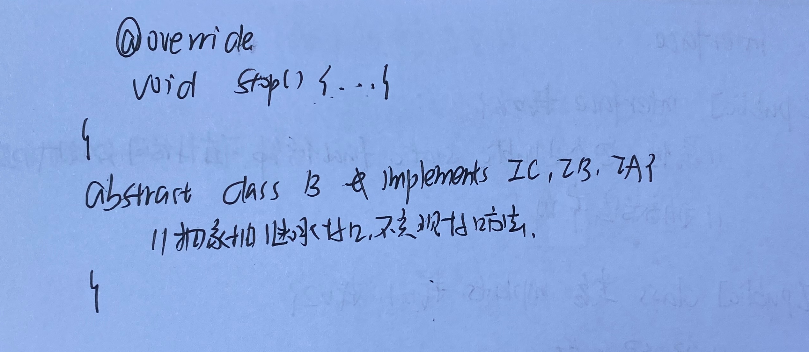
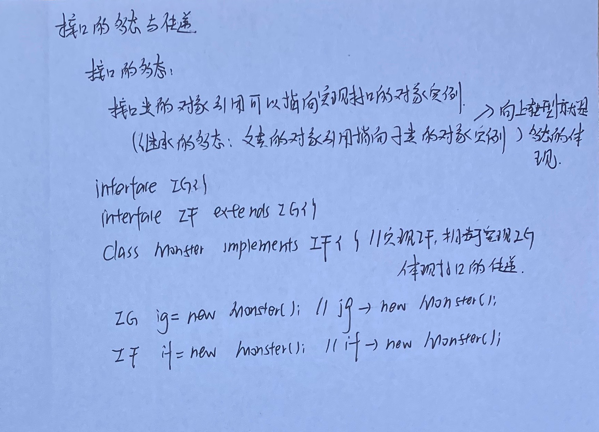

# 1. 概述

我们已经学完了抽象类，抽象类中可以有抽象方法，也可以有普通方法，构造器，成员变量等。那么什么是接口呢？**接口是更加彻底的抽象，接口中全部是抽象方法。（JDK8之前），接口同样是不能创建对象的**。

# 2. 定义格式

```java
//接口的定义格式：
修饰符 interface 接口名称{
    // 抽象方法
}

// 修饰符：public|缺省
// 接口的声明：interface
// 接口名称：首字母大写，满足“驼峰模式”
```

# 3. 接口成分的特点

 在JDK8之前，接口中的成分包含：抽象方法和常量

## 3.1 抽象方法

 注意：接口中的抽象方法默认会自动加上public abstract修饰程序员无需自己手写！！
 按照规范：以后接口中的抽象方法建议不要写上public abstract。因为没有必要啊，默认会加上。

## 3.2 常量

在接口中定义的成员变量默认会加上： public static final修饰。也就是说在接口中定义的成员变量实际上是一个常量。这里是使用public static final修饰后，变量值就不可被修改，并且是静态化的变量可以直接用接口名访问，所以也叫常量。常量必须要给初始值。常量命名规范建议字母全部大写，多个单词用下划线连接。

## 3.3 案例演示

```java
public interface InterF {
    // 抽象方法！
    //    public abstract void run();
    void run();

    //    public abstract String getName();
    String getName();

    //    public abstract int add(int a , int b);
    int add(int a , int b);


    // 它的最终写法是：
    // public static final int AGE = 12 ;
    int AGE  = 12; //常量
    String SCHOOL_NAME = "家里蹲";

}
```

# 4. 基本实现

## 4.1 实现接口的概述

类与接口的关系为实现关系，即**类实现接口**，该类可以称为接口的实现类，也可以称为接口的子类。实现的动作类似继承，格式相仿，只是关键字不同，实现使用 ` implements`关键字。

## 4.2 实现接口的格式

```java
/**接口的实现：
    在Java中接口是被实现的，实现接口的类称为实现类。
    实现类的格式:
 */
[修饰符] class 类名 implements 接口1,接口2,接口3...{

}
```

从上面格式可以看出，接口是可以被多实现的。

## 4.3 类实现接口的要求和意义

1. 必须重写实现的全部接口中所有抽象方法。
2. 如果一个类实现了接口，但是没有重写完全部接口的全部抽象方法，这个类也必须定义成抽象类。
3. **意义：接口体现的是一种规范，接口对实现类是一种强制性的约束，要么全部完成接口申明的功能，要么自己也定义成抽象类。这正是一种强制性的规范。**

## 4.4 类与接口的基本案例

假如我们定义一个运动员的**接口**（规范），代码如下：

```java
/**
   接口：接口体现的是规范。
 * */
public interface SportMan {
    void run(); // 抽象方法，跑步。
    void law(); // 抽象方法，遵守法律。
    String compittion(String project);  // 抽象方法，比赛。
}
```

接下来定义一个乒乓球运动员类，实现接口，实现接口的**实现类**代码如下：

```java
/**
 * 接口的实现：
 *    在Java中接口是被实现的，实现接口的类称为实现类。
 *    实现类的格式:
 *      [修饰符] class 类名 implements 接口1,接口2,接口3...{
 *
 *
 *      }
 * */
public class PingPongMan  implements SportMan {
    @Override
    public void run() {
        System.out.println("乒乓球运动员稍微跑一下！！");
    }

    @Override
    public void law() {
        System.out.println("乒乓球运动员守法！");
    }

    @Override
    public String compittion(String project) {
        return "参加"+project+"得金牌！";
    }
}
```

**测试代码**：

```java
public class TestMain {
    public static void main(String[] args) {
        // 创建实现类对象。
        PingPongMan zjk = new PingPongMan();
        zjk.run();
        zjk.law();
        System.out.println(zjk.compittion("全球乒乓球比赛"));

    }
}
```

## 4.5 类与接口的多实现案例

**类与接口之间的关系是多实现的，一个类可以同时实现多个接口。**

首先我们先定义两个接口，代码如下：

```java
/** 法律规范：接口*/
public interface Law {
    void rule();
}

/** 这一个运动员的规范：接口*/
public interface SportMan {
    void run();
}
```

然后定义一个实现类：

```java
/**
 * Java中接口是可以被多实现的：
 *    一个类可以实现多个接口: Law ,SportMan
 *
 * */
public class JumpMan implements Law ,SportMan {
    @Override
    public void rule() {
        System.out.println("遵纪守法");
    }

    @Override
    public void run() {
        System.out.println("训练跑步！");
    }
}
```

从上面可以看出类与接口之间是可以多实现的，我们可以理解成实现多个规范，这是合理的。

# 5.接口与接口的多继承

Java中，接口与接口之间是可以多继承的：也就是一个接口可以同时继承多个接口。大家一定要注意：

**类与接口是实现关系**

**接口与接口是继承关系**

接口继承接口就是把其他接口的抽象方法与本接口进行了合并。

案例演示：

```java
public interface Abc {
    void go();
    void test();
}

/** 法律规范：接口*/
public interface Law {
    void rule();
    void test();
}

 *
 *  总结：
 *     接口与类之间是多实现的。
 *     接口与接口之间是多继承的。
 * */
public interface SportMan extends Law , Abc {
    void run();
}
```

# 6. JDK8之后接口的新增方法

从JDK 8开始之后，接口不再纯洁了，接口中不再只是抽象方法，接口还可以有**默认方法**（也就是实例方法），和**静态方法**了，还包含了私有实例方法和私有静态方法。

## 6.1 默认方法和静态方法

**默认方法：使用 `default` 修饰，不可省略，供子类调用或者子类重写。**

**静态方法：使用 `static` 修饰，供接口直接调用。**

代码如下：

```java
public interface InterFaceName {
    public default void method() {
        // 执行语句
    }
    public static void method2() {
        // 执行语句    
    }
}
```

## 6.2 私有方法和私有静态方法

私有方法：使用 `private` 修饰，供接口中的默认方法或者静态方法调用。

代码如下：

```java
public interface InterFaceName {
    private void method() {
        // 执行语句
    }
}
```

## 6.3 新增方法的使用

**默认方法和静态方法以及私有方法和私有静态方法**，**遵循面向对象的继承关系使用原则，实现类依然可以访问接口的非私有方法，对于接口中的非私有静态方法，可以直接通过接口名进行访问。**

重写默认方法注意（了解）:

* 子接口重写默认方法时，default关键字可以保留。

* 实现类重写默认方法时，default关键字不可以保留。

# 7. 实现多个接口的注意事项

## 7.1 多个接口的同名静态方法

如果实现了多个接口，多个接口中存在同名的静态方法并不会冲突，原因是只能通过各自接口名访问静态方法。

```java
public interface A {
  public static void test(){

  }
}

 interface B {
    public static void test(){

    }
}

class C implements  A , B{
    public static void main(String[] args) {
        A.test();
        B.test();
       // C.test(); // 编译出错
    }
}
```

## 7.2 优先级的问题

当一个类，既继承一个父类，又实现若干个接口时，父类中的成员方法与接口中的默认方法重名，子类就近选择执行父类的成员方法。代码如下：

定义接口：

```java
interface A {
    public default void methodA(){
        System.out.println("AAAAAAAAAAAA");
    }
}
```

定义父类：

```java
class D {
    public void methodA(){
        System.out.println("DDDDDDDDDDDD");
    }
}
```

定义子类：

```java
class C extends D implements A {
  	// 未重写methodA方法
}
```

定义测试类：

```java
public class Test {
    public static void main(String[] args) {
        C c = new C();
        c.methodA(); 
    }
}
```

输出结果:

```
DDDDDDDDDDDD
```

# 8. 接口小结

- 接口中，无法定义成员变量，但是可以定义常量，其值不可以改变，默认使用public static final修饰。
- 接口中的方法全是抽象方法，默认会自动加上public abstract修饰
- JDK 8开始，接口不再纯洁，支持静态方法，默认方法，私有方法。
- 接口中，没有构造器，**不能创建对象**。
- 类与接口是多实现的
- 接口与接口是多继承的
- 接口体现的规范。