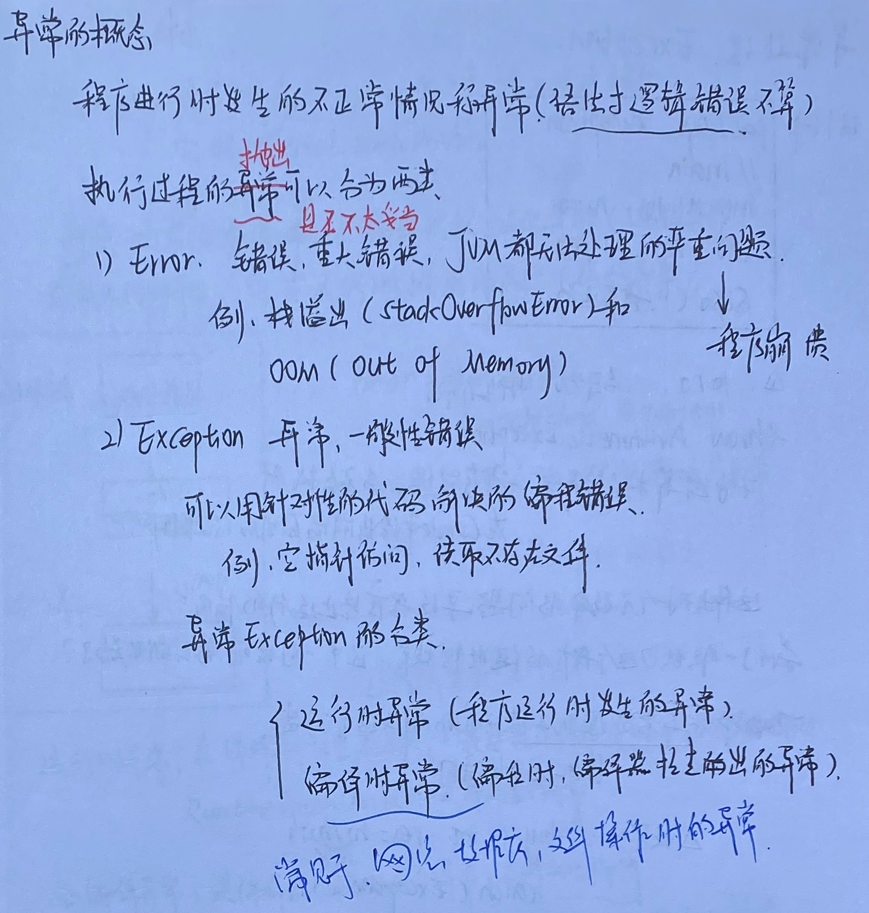
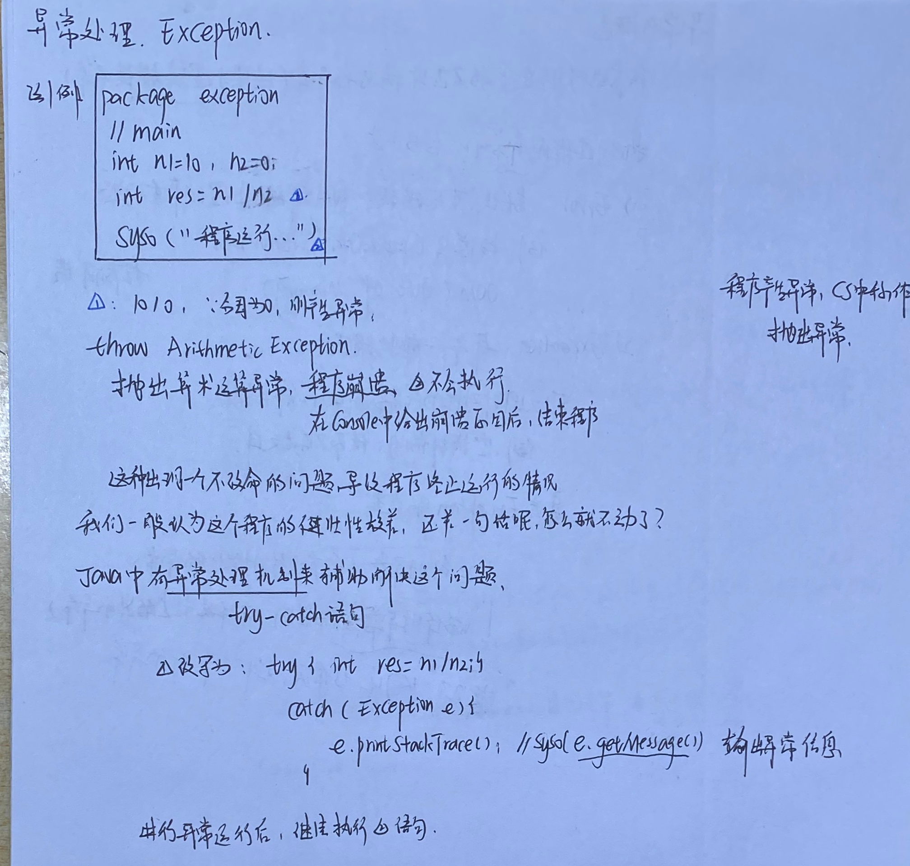
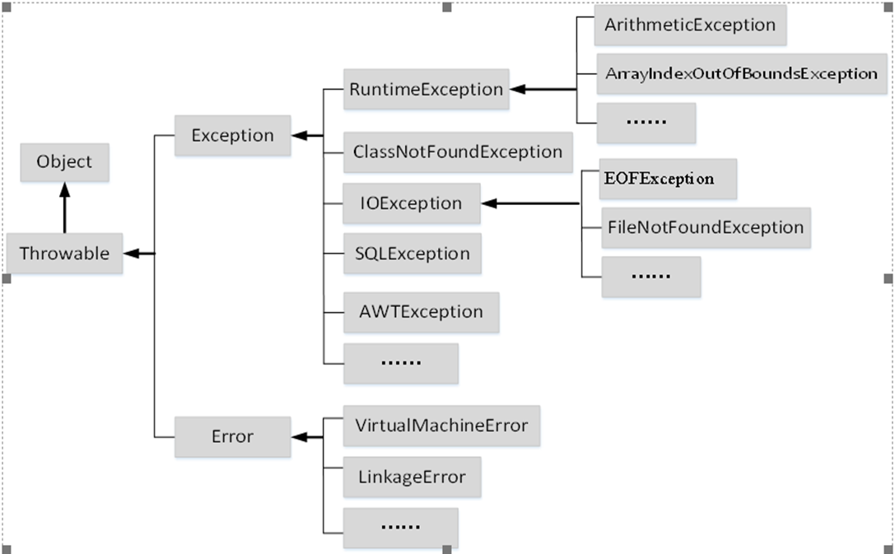
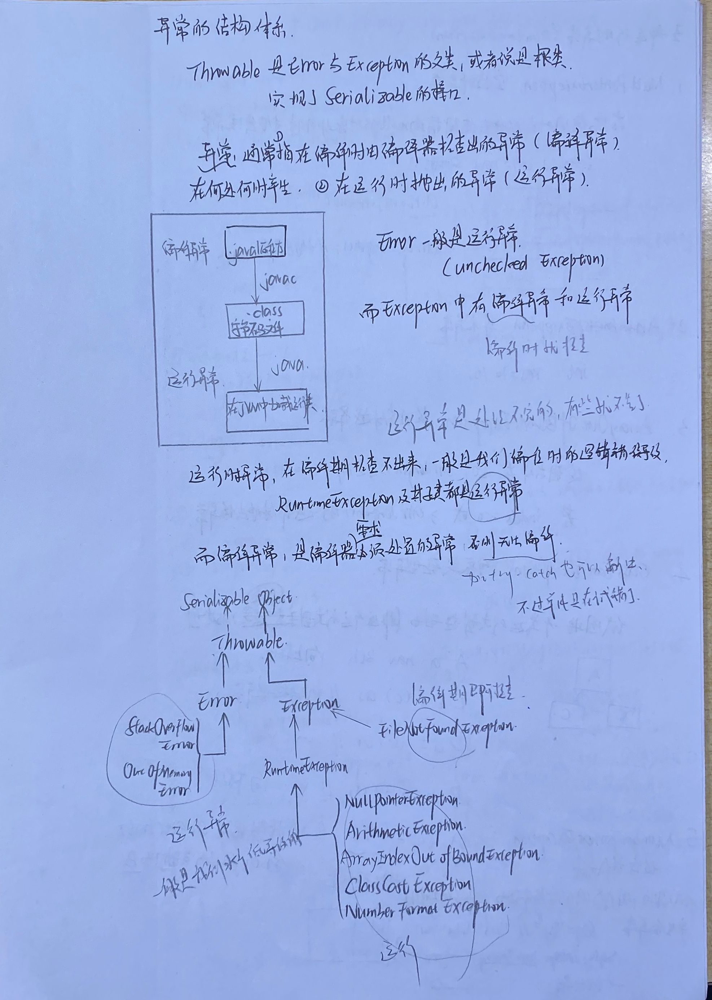
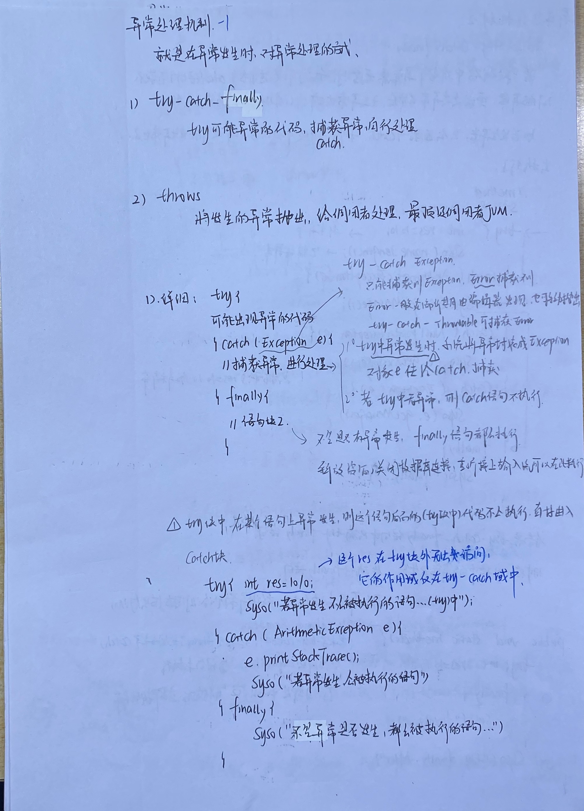

# 概念

程序出现的错误分为编译错误和运行错误两种。
1. 编译错误
因为所编写的程序存在语法问题，编译系统能直接检测出来。

2. 运行错误
程序在运行的时候才会出现的错误。除了因算法逻辑错误导致的，其他运行错误还分为两大类。
（1）致命性的错误，如Java 虚拟机产生错误、内存耗尽，系统硬件故障、动态链接失败等。这类错误应用程序无法处理。

​	  （2）一般性的（非致命性）错误，是因编程错误或偶尔的外在因素导致的一般性问题，如：除数为零、数组越界、负数开平方，网络连接中断、读取不存在的文件等，通过某种处理后，程序还能继续运行。一般所说的异常（Exception）都是指这类错误。



## 异常处理

没有异常处理的程序健壮性是差的



## 异常的结构体系



（1）运行时异常（Runtime Exception）：
由Java解释器抛出这些异常，并为他们提供默认的捕获处理代码。Java不要求捕获这类异常，当然应用程序也可以自己捕获处理运行时异常。也称为非受检查异常（unchecked Exception）。
（2）	受检查异常（Checked Exception）：
程序必须强制对这类可能发生的异常进行处理，否则编译不能通过。



## 五种RuntimeException


### ClassCastException

抛出表示代码试图将（一个运行类型的对象）强转为（不是这个运行类型的运行类型）

（将一个不是指向子类的父类强转为子类。）

例如，下面的代码生成一个ClassCastException:

```java
String str=(String) new Object();//将一个父类强转为子类。
Integer i=(Integer) new String("123");//将（一个运行类型的对象）强转为（不是这个运行类型的运行类型）
```

正确的强转:指向子类的父类强转为子类

```java
Object o=new String("123");
String s1=(String)o;
```

### NumberFormatException

试图使用一个不合规的数字字符串形式

```java
String str="1px";
sout(Integer.parseInt(str));//抛出运行时异常NumberFormatException
```

# 异常处理机制

异常发生时对异常的处理方法:

- try-catch-finally
- throws

## try-catch

1. try

   - 发生异常时，将跳过try块中异常点后面的语句，且异常处理需要更多的时间和资源。因此，应当仔细分析代码，尽量缩减try代码块。

2. catch

   - catch语句可以有零个或多个

   - 设计捕获异常代码要注意其顺序，按照从“特殊到一般”的顺序来设计。将子类的catch块放在前面，父类的catch块放在后面。

   - 从java7开始，多个异常可以写在一个catch 中，它们之间用竖线`|`隔开，例如：

     ```java
     try{
           ……
     } catch( 异常类A |异常类B |异常类 C  e) {
     … }
     ```

     但需要注意，用“|”操作符合并的异常不要出现互为父子的关系。

     ```java
             Scanner sc=new Scanner(System.in);
             while(true) {
                 try{
                     int age = sc.nextInt();//如果不符合数字格式也会抛出异常
                     if (!(age >= 18 && age <= 120)) {
                         throw new AgeException(age + "");
                     } else {
                         System.out.println("输入成功");
                     }
                 }catch (AgeException e) {
                     //不符合年龄要求,重新输入
                     e.printStackTrace();
                     System.out.println("重新输入[18-120]区间的年龄");
     //                break;
                 } catch (InputMismatchException|IllegalStateException e){
                     e.printStackTrace();
                     //不符合数字格式,退出
                     System.out.println("不符合数字格式,退出");
                     break;
                 }
             }
             sc.close();
     ```

3. finally

   - finally语句是可选项。如果有该语句，无论是否捕获或处理异常，即使try或者catch块中包含break或return语句，finally块里的语句也会被执行。
   - finally语句一般用来在最后做一些资源回收工作，比如在try语句中打开了文件流，可以在finally中确保文件被有效关闭。




> 异常获取信息的方法


```java
class MessageException {
    public static void main(String[] args) {
        try {
            double a = area(-1);
            System.out.println("圆的面积是：" + a);
        } catch (IllegalArgumentException e) {


            System.out.println("1、" + e.toString());
            //java.lang.IllegalArgumentException: radius<0!
            System.out.println("2、" + e.getMessage());
            //radius<0!
            System.out.println("3、use printStackTrace");
            e.printStackTrace();
            /**
             * java.lang.IllegalArgumentException: radius<0!
             * 	at org.example.chap5.MessageException.area(testSc.java:68)
             * 	at org.example.chap5.MessageException.main(testSc.java:45)
             */
            System.out.println("4、Trace Info ");

            StackTraceElement[] tElem = e.getStackTrace();
            for (StackTraceElement st : tElem) {
                System.out.printf("%s (%s:%d)\n", st.getMethodName(), st.getClassName(), st.getLineNumber());
            }
            /**
             * getMethodName:出错方法名
             * getClassName:出错的全类名
             * getLineNumber:出错的行数
             * area (org.example.chap5.MessageException:68)
             * main (org.example.chap5.MessageException:45)
             */
        }
    }

    public static double area(int r) {
        if (r < 0)
            throw new IllegalArgumentException("radius<0!");
        else return 3.14 * r * r;
    }
}
```

### try-catch-finally执行顺序


## 带资源的try

Java7之后，为了简化资源清理工作，允许在try关键字后声明并初始化资源，当try语句执行结束，系统会自动调用资源的close()方法关闭这些资源，不需要再显式地用finally关闭。其基本用法如下所示：

```
try（类型名1 资源变量1= 表达式1;  类型名2  资源变量2=表达式2; …）{
	//使用资源，不需要考虑关闭资源res
}
```

注意：可以被自动关闭的资源有一个前提，这个资源的类已经实现了`java.lang.AutoCloseable`接口，这个接口有一个方法：`void close()`。

```java
public class resourceTry2 {
    public static void main(String arg[]){
	int d;
	try(Scanner sc=new Scanner(System.in)){//自动关闭资源,更加简洁的代码
		d=sc.nextInt();
		System.out.println(25/d);
	}catch(InputMismatchException  e1){   
		e1.printStackTrace();
		
      }catch(NoSuchElementException e2){
		e2.printStackTrace();
	}catch(ArithmeticExceptione3){
		e3.printStackTrace();}
	}
}
```

## throws&throw

### 抛出异常

1、抛出异常
检测到错误的程序可以创建一个合适的异常对象并抛出它，这就称为抛出一个异常。

Java中有两种方法抛出异常。
（1）Java运行时环境自动抛出异常：系统定义的Runtime Exception类及其子类和Error都可以由系统自动抛出。

（2）语句throw抛出异常：用户程序想在一定条件下显式抛出异常，这必须借助于throw语句抛出。Java用throw语句抛出异常。throw语句的格式如下：

```java
	throw 异常对象;
```

2、throws声明异常

定义方法时，如果方法可能出现异常，但该方法不想或不能自己捕获处理这种异常，那就必须在声明方法时用throws声明可能发生的异常。throws语句的格式如下：

```
返回类型 方法名（[参数列表]） throws 异常类1, 异常类2...
{ … //方法体}
```

注意： 对于不受检查异常（Runtime Exception和Error），Java不要求在方法头中显示声明，但是，其它异常就一定要在方法头中显示声明。


编译时异常:`FileNotFoundException`编译时就需要抛出进行提前处理的异常(系统为我们指定的需要抛出的)

运行时异常:在编译时不需要处理,因为它的抛出是在运行时抛出的(我们自己编写程序时产逻辑错误可能抛出的)


# 自定义异常类型

一般，我们自定义的异常是继承RuntimeException，将这个异常做成运行异常

```java
class CustomException extends RuntimeException{
	public CustomException(String mes){
		super(mes);//mes：为用户提供信息
	}
}
```

Exception中的一些方法

```java
public Exception()
public Exception(String s):
该参数一般表示该异常对应的错误的描述。 
public String toString():
返回描述当前异常对象信息的字符串。
public String getMessage():
返回描述当前异常对象信息的详细信息。
public void printStackTrace():
打印当前异常对象使用栈的轨迹。
```

测试

```java
    public static void main(String[] args) {
        try{
            throw new CustomException("自定义异常类型");
        }catch(Exception e){
            System.out.println(e.getMessage());
            //获取构造时传递的mes字符串:输出自定义异常类型
            //e.printStackTrace();
            /*
            org.example.chap5.CustomException: 自定义异常类型
	            at org.example.chap5.exceptionTest.main(exceptionTest.java:9)
            */
            //一般我们使用printStackTrace
        }

    }
```

> 例子:接受年龄,如果年龄在18~120之外,抛出一个自定义的年龄异常

```java
public class testSc {
    public static void main(String[] args) {

        Scanner sc=new Scanner(System.in);
        while(true) {
            try{
                int age = sc.nextInt();//如果不符合数字格式也会抛出异常
                if (!(age >= 18 && age <= 120)) {
                    throw new AgeException(age + "");
                } else {
                    System.out.println("输入成功");
                }
            }catch (AgeException e) {
                //不符合年龄要求,重新输入
                e.printStackTrace();
                System.out.println("重新输入[18-120]区间的年龄");
//                break;
            } catch (Exception e){
                e.printStackTrace();
                //不符合数字格式,退出
                System.out.println("不符合数字格式,退出");
                break;
            }
        }
        sc.close();


    }

}
class AgeException extends RuntimeException{

    public AgeException(String mes){
        super(mes+"is out of 18-120");
    }
}
```

[Java中Scanner类的close()方法所引发的错误NoSuchElementException](https://blog.csdn.net/daiidai/article/details/80716312)