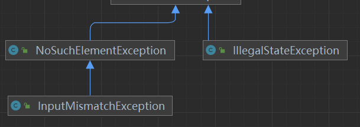

# Scanner

与用户交互，执行输入流获取操作

1、构造一个Scanner 类的对象，并且与标准输入流Sytem.in关联。

```java
Scanner s = new Scanner (System.in) //创建了一个Scanner对象，Scanner为类名，s为对象名。
```

2、使用Scanner类相关的方法从System.in输入流中获取数据

## 常用方法

- int nextInt():从输入流扫描的整形变量

  - 读取完后光标放在本行
  - 每次可以只输入一个数字，回车确认，一个数字只能被一个nextInt读取。
  - 也可以输入一组数字，例如：“78 484 44”，每个数字之间用空格（一个或多个空格）隔开，可被多个nextInt()读取，空格及回车不会被读取。

- double nextDouble():

  - InputMismatchException:输入数据不符合浮点数表达，则抛出该异常

  - NoSuchElementException：如果没有输入数据，则抛出该异常

    IllegalStateException ：如果scanner关闭，抛出该异常

- String next():获取有效字符串,直到遇到的第一个空格就会结束读取。

  - 比如，输入hello world.最终的输出结果为hello。

- String nextLine():扫描到一行内容(当前行，光标所在行的内容，包括空格、回车)并作为一个字符串而被获取到

## sc.close()方法&NoSuchElementException

关闭Scanner，以及Scanner内的System.in标准输入流

因为Scanner实例需要封装system.in，关闭Scanner的同时也将System.in关闭，下次new Scanner时传入的System.in是关闭的,会导致在使用sc调用方法从关闭的输入流中读取数据的时候抛出`NoSuchElementException`

> NoSuchElementException是InputMismatchException的父类

