视频:575-617

# File类

## 初始

> File类的理解

- File类的一个对象，代表一个文件或一个文件目录(俗称：文件夹)。
  文件和文件路径的抽象表示形式，与平台无关。(*抽象的文件或者文件目录*)
- File类声明在 `java.io` 包下
- File类中涉及到关于文件或文件目录的创建、删除、重命名、修改时间、文件大小等方法，
  **并未涉及到写入或读取文件内容的操作**。如果需要读取或写入文件内容，必须使用**IO流**来完成。(不涉及对文件内容的操作)
- 想要在 Java 程序中表示一个真实存在的文件或目录，那么必须有一个 File 对象，
  但是 Java程序中的一个 File 对象，可能不对应一个真实存在的文件或目录。
- 后续 File 类的对象常会作为参数传递到流的构造器中，指明读取或写入的"终点"。

>构造器

| 构造器                                   | 描述                                                     |
| ---------------------------------------- | -------------------------------------------------------- |
| File(String filePath)                    | 以filePath为路径创建File对象，可以是绝对路径或者相对路径 |
| File(String parentPath,String childPath) | 以parentPath为父路径，childPath为子路径创建File对象。    |
| File(File parentFile,String childPath)   | 根据一个父File对象和子文件路径创建File对象               |

```java
    @Test
    public void fileTest(){
        File file1 = new File("hello.txt");//main相对于module
        File file2 = new File("D:\\Novel\\hello.txt");//
        File file3=new File(new File("D:\\"),"Novel");//文件夹
        //file.toString输出构造得到的绝对或者相对路径
        System.out.println(file1);//hello.txt
        System.out.println(file2);//D:\Novel\hello.txt
        System.out.println(file3);//D:\Novel
    }
```

> 绝对路径和相对路径

- 相对路径：相较于某个路径下，指明的路径。
- 绝对路径：包含盘符在内的文件或文件目录的路径。

**说明**：

- IDEA中：
  - 如果使用JUnit中的单元测试方法测试，相对路径即为当前Module下。
  - 如果使用main()测试，相对路径即为当前的Project下。
- Eclipse中：
  - 不管使用单元测试方法还是使用main()测试，相对路径都是当前的Project下

> 路径分隔符

windows和DOS系统默认使用 `\` 来表示

UNIX和URL使用 `/` 来表示

因为java字符串中`\`是转义字符,所以路径需要使用`\`转义

```
//windows
D:\Novel\hello.txt
//java字符串使用\转义\
D:\\Novel\\hello.txt
//如果是UNix,/直接就可以使用
D:/Novel/hello.txt
```

Java程序支持跨平台运行，因此路径分隔符要慎用。

为了解决这个隐患，File类提供了一个常量： `public static final String separator`。根据操作系统，动态的提供分隔符。

```java
//windows和DOS系统
File file1 = new File("E:\\io\\test.txt");
//UNIX和URL
File file = new File("E:/io/test.txt");
//java提供的常量
File file = new File("E:"+File.separator+"io"+File.separator+"test.txt");
```

## 常用方法

```js
    /**
     * 内存层面的方法调用,不需要有真实的文件存在
     * public String getAbsolutePath()：获取绝对路径
     * public String getPath() ：获取路径
     返回抽象路径,相对路径返回相对,绝对返回绝对
     * public String getName() ：获取名称
     * public String getParent()：获取上层文件目录路径。若无，返回null
     如果实例代表的抽象路径中没有父级目录,则返回null
     * public long length() ：获取文件长度（即：字节数）。不能获取目录的长度。不存在文件时默认返回0
     * public long lastModified() ：获取最后一次的修改时间，毫秒值.不存在文件时默认返回0
     *
     * 如下的两个方法适用于文件目录：
     * 文件目录必须真实存在才会返回非空数组,否则返回null
     * public String[] list() ：获取指定目录下的一级目录中的所有文件或者文件目录的名称数组
     文件会输出后缀
     * public File[] listFiles() ：获取指定目录下的一级目录中的所有文件或者文件目录的File数组
     */
```

```java
    @Test
    public void test2(){
        File file = new File("hello.txt");
        File file2 = new File("F:\\java\\Work2\\JavaSenior\\day08\\num.txt");
        //测试文件目录
        File file3 = new File("F:\\java\\Work2\\JavaSenior\\day08\\num");
        //file测试
        //相对路径
        System.out.println(file.getAbsolutePath());//D:\doc\Java\JavaSE\Hello.txt
        System.out.println(file.getPath());//Hello.txt
        System.out.println(file.getName());//Hello.txt
        System.out.println(file.getParent());//null
        System.out.println(file.length());//0->存入文件后更新为12B
        System.out.println(new Date(file.lastModified()));//Thu Jan 01 08:00:00 CST 1970->Fri Feb 03 10:33:29 CST 2023

        System.out.println();
        //绝对路径
        System.out.println(file2.getAbsolutePath());//F:\java\Work2\JavaSenior\day08\num.txt
        System.out.println(file2.getPath());//F:\java\Work2\JavaSenior\day08\num.txt
        System.out.println(file2.getName());//num.txt
        System.out.println(file2.getParent());//F:\java\Work2\JavaSenior\day08
        System.out.println(file2.length());//0
        System.out.println(file2.lastModified());//0

        System.out.println();
        //文件目录测试
        System.out.println(file3.getAbsolutePath());//F:\java\Work2\JavaSenior\day08\num
        System.out.println(file3.getPath());//F:\java\Work2\JavaSenior\day08\num
        System.out.println(file3.getName());//num
        System.out.println(file3.getParent());//F:\java\Work2\JavaSenior\day08
        System.out.println(file3.length());//0,目录的长度默认返回0
        System.out.println(file3.lastModified());//0

    }
```

文件目录的方法使用

```java
    @Test
    public void test3(){
        //文件需存在
        File file = new File("D:\\Novel");

        String[] list = file.list();
//        System.out.println(list);//null
        for(String s : list){
            System.out.println(s);
        }

        System.out.println();

        File[] files = file.listFiles();
        for(File f : files){
            System.out.println(f);
        }
    }
```

> renameTo

```
public boolean renameTo(File dest):把文件重命名为指定的文件路径
比如：file1.renameTo(file2)为例：
要想保证返回true,需要file1在硬盘中是存在的，且file2不能在硬盘中存在(file2仅仅只是一个虚拟路径)。
操作后file1移动到file2所在的目录中
```

通过重命名我们也可以实现文件的剪切移动重命名

```java
    @Test
    public void test4(){

        File file1 = new File("hello.txt");
        File file2 = new File("D:\\Novel\\hello.txt");
        boolean renameTo = file1.renameTo(file2);//true
        //当前module中的hello.txt移动到Novel中,重命名为hello.txt
//        boolean renameTo = file2.renameTo(file1);//false
        System.out.println(renameTo);
    }
```

当前文件夹内重命名

```java
    @Test
    public void test4(){

        File file1 = new File("hello.txt");
        File file2 = new File("rename.txt");
        boolean renameTo = file1.renameTo(file2);//true
        //当前module中的hello.txt重命名为rename.txt
        System.out.println(renameTo);
    }
```

> File对象创建时的赋值

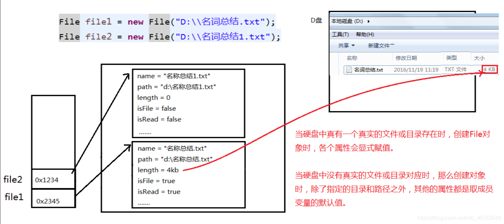

file1,初始时被存在的file赋值;file2是一个内存中的file,不真实存在

其中的属性我们可以通过getter&setter或者is或者直接`实例.属性`访问

下面的方法如果要返回true,则实例必须是一个真实存在的文件目录或者文件

```js
    /**
     * 下面的方法如果要返回true,则实例必须是一个真实存在的文件目录或者文件,否则全部返回false
     
     * public boolean isDirectory()：判断是否是文件目录
     * 当且仅当此抽象路径名表示的文件存在且 是一个目录时，返回 true；否则返回 false
     
     * public boolean isFile() ：判断是否是文件
     * 当且仅当此抽象路径名表示的文件存在且 是一个标准文件时，返回 true；否则返回 false
     
     * public boolean exists() ：判断是否存在
     * 当且仅当此抽象路径名表示的文件或目录存在时，返回 true；否则,不存在只是逻辑上的文件或者目录返回 false
     
     * public boolean canRead() ：判断是否可读,测试应用程序是否可以读取此抽象路径名表示的文件
     * 当且仅当此抽象路径名指定的文件存在且 可被应用程序读取时，返回 true；否则返回 false
     
     * public boolean canWrite() ：判断是否可写,测试应用程序是否可以修改此抽象路径名表示的文件。
     * 当且仅当文件系统实际包含此抽象路径名表示的文件且 允许应用程序对该文件进行写入时，返回 true；否则返回 false
     
     * public boolean isHidden() ：判断是否隐藏
     */
```

常用:isDirectory/File,exists;
需要读取的时候先用exists先测试再读取<sup>[1]</sup>

代码演示

```java
    public void test5(){
        File file1 = new File("hello.txt");
//        file1 = new File("hello1.txt");

        System.out.println(file1.isDirectory());
        System.out.println(file1.isFile());
        System.out.println(file1.exists());
        System.out.println(file1.canRead());
        System.out.println(file1.canWrite());
        System.out.println(file1.isHidden());

        System.out.println();
        //文件目录
        File file2 = new File("D:\\Novel");
//        file2 = new File("D:\\book1");
        System.out.println(file2.isDirectory());
        System.out.println(file2.isFile());
        System.out.println(file2.exists());
        System.out.println(file2.canRead());
        System.out.println(file2.canWrite());
        System.out.println(file2.isHidden());
    }
```

> File创建/删除真实文件/目录的方法

```js
    /**
     * 创建硬盘中对应的文件或文件目录
     * public boolean createNewFile() ：创建文件。若文件存在，则不创建，返回false
     
     * public boolean mkdir() ：
     	创建文件目录。如果此文件目录存在，就不创建了。如果此文件目录的上层目录不存在，也不创建。
     * 只能在已有的文件目录中创建文件目录
     
     * public boolean mkdirs() ：创建文件目录。如果此文件目录存在，就不创建了。如果上层文件目录不存在，一并创建
     * 递归创建
     
     *
     *删除磁盘中的文件或文件目录
     * public boolean delete()：删除文件或者文件夹
     *     删除注意事项：Java中的删除不走回收站。
     *     目录:内部有子目录,false
     *     如果要删除目录,则这个目录内部不能有目录或者文件
     */
```

代码示例

```java
    @Test
    public void test6() throws IOException {
        File file1 = new File("hi.txt");
        if(!file1.exists()){
            //文件的创建
            file1.createNewFile();
            System.out.println("创建成功");
        }else{//文件存在
            //文件删除
            file1.delete();
            System.out.println("删除成功");
        }
    }

    @Test
    public void test7(){
        //文件目录的创建
        File file1 = new File("d:\\io\\io1\\io3");

        boolean mkdir = file1.mkdir();
        if(mkdir){//false
            System.out.println("创建成功1");
        }

        File file2 = new File("d:\\io\\io1\\io4");

        boolean mkdir1 = file2.mkdirs();
        if(mkdir1){//true
            System.out.println("创建成功2");
        }
		//文件目录的删除
        //要想删除成功，io4文件目录下不能有子目录或文件
        File file3 = new File("D:\\io\\io1\\io4");
        file3 = new File("D:\\io\\io1");
        System.out.println(file3.delete());
    }
```

## 练习

>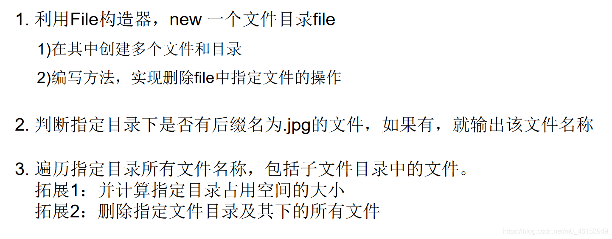

> 练习1

在Novel文件目录内部创建如下所示目录和文件

```bash
+---Dir
|   +---dir1
|   +---dir2
|   \---file1.txt
```

代码

```java
    @Test
    public void test1() {
        File Dir = new File("D:\\Novel\\Dir");
        if(!Dir.exists()){
            Dir.mkdirs();
        }
        //创建文件和目录
        try {
            (new File(Dir,"dir1")).mkdir();
            (new File(Dir,"dir2")).mkdir();
            (new File(Dir,"file1.txt")).createNewFile();
        } catch (IOException e) {
            throw new RuntimeException(e);
        }
        //删除指定文件
        delFile(Dir,(new File(Dir,"file1.txt")));
    }
    public void delFile(File parent,File child){
        child.delete();
    }
```

> 练习2

判断指定目录下面是否有后缀为jpg的文件

```java
    @Test
    public void test2(){
        File Dir = new File("D:\\Novel\\Dir");
        String[] list = Dir.list();
        for (String fileName:list) {
            if (fileName.matches(".*?\\.jpg"))//fileName.endsWith(".jpg")
                System.out.println(fileName);//1.jpg
        }
    }
```

```java
   /**
     * File类提供了两个文件过滤器方法
     * public String[] list(FilenameFilter filter)
     * public File[] listFiles(FileFilter filter)
     * FilenameFilter&FileFilter都需要实现一个accept方法用于过滤
     */
    @Test
    public void testFilter(){
        File Dir = new File("D:\\Novel\\Dir");
        String[] list = Dir.list(new FilenameFilter() {
            public boolean accept(File dir, String name) {
                //dir测试的File对象,name:File对象.getName
//                System.out.println(dir);
                return name.endsWith(".jpg");
            }
        });
        for (String filename:list) System.out.println(filename);

    }
```

>遍历指定目录所有文件名称，包括子文件目录中的文件。

建立如下所示的文件结构

```
Dir
	1.jpg
    1.jpg.txt
    dir1
        file2.txt
        file3.txt
        file4.txt
    dir2
        dir2_1
            file5.txt
```

对Dir进行遍历,输出文件名

```java
    //递归的方式
	public void printSub(File dir,int level){
        File[] files = dir.listFiles();
        for(File file :files){
            if(file.isDirectory()){
                for (int i=0;i<level;i++) System.out.printf("\t");
                System.out.printf(file.getName()+'\n');
                printSub(file,level+1);
            }else if (file.isFile()){
                for (int i=0;i<level;i++) System.out.printf("\t");
                System.out.printf(file.getName()+'\n');
            }
        }
    }
```

遍历顺序就是文件夹的深度优先删除顺序

> 拓展1：并计算指定目录占用空间的大小


```java
    public int getDirLength(File dir){
        //getDirLength(Dir)
       if(dir.isDirectory()){
           int size=0;
           File[] files = dir.listFiles();
           for (File file:files){
               //递归计算
               //目录递归计算
               if(file.isDirectory())size+=getDirLength(file);
               //文件直接拿length
               else size+=file.length();
           }
        return size;
       }
       return (int)dir.length();
    }
```

> 拓展2：删除指定文件目录及其下的所有文件

逻辑上和之前的计算目录大小差不多


```java
    public boolean deleteDir(File dir){
        if(dir.isDirectory()){
            File[] files = dir.listFiles();
            for (File file:files){
                //目录递归删除
                if(file.isDirectory())deleteDir(file);
                //文件直接删除
                else file.delete();
            }
        }
        dir.delete();
        return true;
    }
```

> 关于类的学习

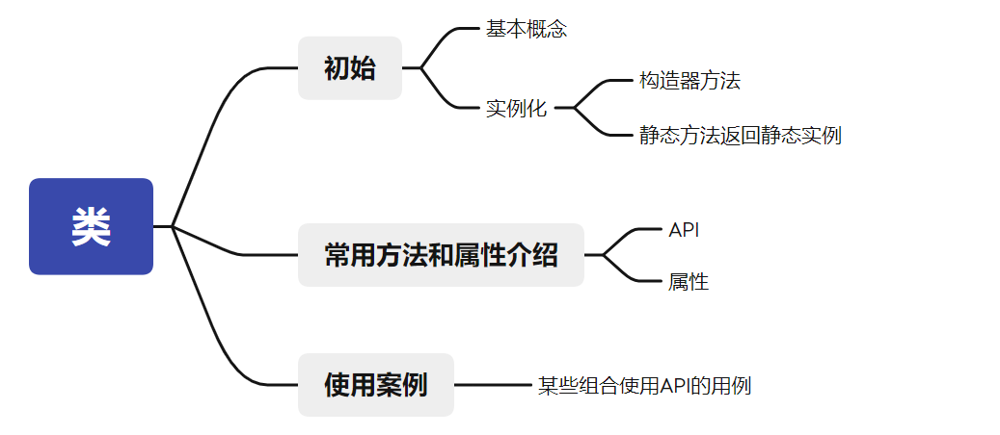

# IO流（4个）

## 初始

> 介绍

- IO 是 Input/Output 的缩写，I/O 技术是非常实用的技术，用于处理设备之间的数据传输。如读/写文件，网络通讯等。
- Java程序中，对于数据的输入输出操作以 “流(stream)” 的方式进行。
- `Java.IO` 包下提供了各种“流”类和接口，用以获取不同种类的数据，并通过标准的方法输入或输出数据。

内存磁盘之间的IO,网络主机之间的IO

## 分类

> 流的分类

**操作数据单位：字节流、字符流**
数据单位Byte/Char,字节(0101二进制,占1B),字符char2B

- 对于文本文件(`.txt,.java,.c,.cpp`)，使用字符流处理
- 对于非文本文件(`.jpg,.mp3,.mp4,.avi,.doc,.ppt,...`)，使用字节流处理

**数据的流向：输入流、输出流**
站在内存/程序的角度上

- 输入 input:读取外部数据（磁盘、光盘等存储设备的数据）到程序（内存）中。
- 输出 output:将程序（内存）数据输出到磁盘、光盘等存储设备中。

**流的角色：节点流、处理流**

节点流：直接从数据源或目的地读写数据。


处理流：不直接连接到数据源或目的地，而是“连接”在已存在的流（节点流或处理流）之上，通过对数据的处理为程序提供更为强大的读写功能。


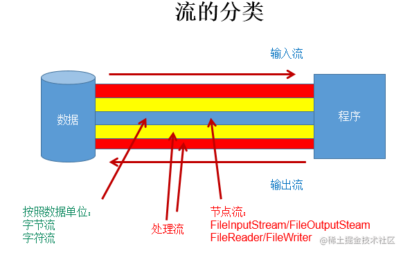

## 流的体系


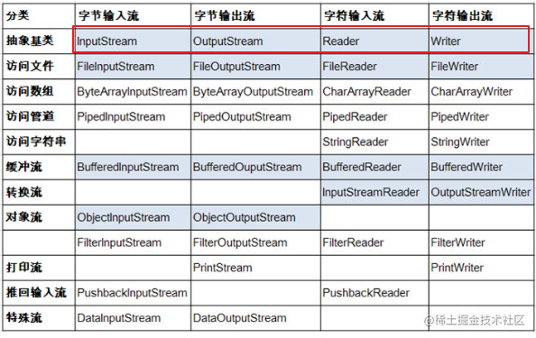

红框为抽象基类，蓝框为常用IO流


| 抽象基类 | 字节流       | 字符流 |
| -------- | ------------ | ------ |
| 输入流   | InputStream  | Reader |
| 输出流   | OutputStream | Writer |

- 说明：Java的lO流共涉及40多个类，实际上非常规则，都是从如下4个抽象基类派生的。
- 由这四个类派生出来的子类名称都是以其父类名作为子类名后缀。

## 常用的几个IO流结构

| 抽象基类    | 节点流（或文件流,作用在文件上的）              | 缓冲流（处理流的一种,作用域节点流中）                        |
| ----------- | ---------------------------------------------- | ------------------------------------------------------------ |
| InputStream | `FileInputStream (read(byte[] buffer))`        | `BufferedInputStream (read(byte[] buffer))`                  |
| OutputSteam | `FileOutputStream (write(byte[] buffer,0,len)` | `BufferedOutputStream (write(byte[] buffer,0,len)` / `flush()` |
| Reader      | `FileReader (read(char[] cbuf))`               | `BufferedReader (read(char[] cbuf)` / `readLine()`           |
| Writer      | `FileWriter (write(char[] cbuf,0,len)`         | `BufferedWriter (write(char[] cbuf,0,len)` / `flush()`       |

## 输入、输出的标准化过程

输入过程
① 创建File类的对象，指明读取的数据的来源。（要求此文件一定要存在）
② 创建相应的输入流，将File类的对象作为参数，传入流的构造器中
③ 具体的读入过程：
    创建相应的byte[] 或 char[]。
④ 关闭流资源
说明：程序中出现的异常需要使用try-catch-finally处理。

4.2 输出过程
① 创建File类的对象，指明写出的数据的位置。（不要求此文件一定要存在）
② 创建相应的输出流，将File类的对象作为参数，传入流的构造器中
③ 具体的写出过程：
    write(char[]/byte[] buffer,0,len)
④ 关闭流资源
说明：程序中出现的异常需要使用try-catch-finally处理。

# 节点流（4个）

## FileReader

输入字符流,读入内存

1. 新建File,指明操作文件
2. 实例化流
3. 读入文件至内存
4. 关闭流(这一步最好在try-catch-finally的finally中写)

> [2]构造器

```
FileReader(File file)
//这个file必须要存在,否则报错
```

> 读入文件

```
public int read()
功能:
	读取一个字符
参数:
    无
返回:
	流没有结束,返回一个字符转int值
	结束,返回-1
异常:IO错误发生,IOException
------------------------------------
public int read(char[] cbuf)
功能:
    cbuf长度为0,不读取字符,返回0
    cbuf传入,长度不为0,读取至少一个字符入cbuf
参数:
	buf-目标缓存数组
返回:
	读取的字符数
异常:IOException
	当有流正在输入或者发生错误的时候
```

> 异常处理

对于流这一物理连接,gc无法自动释放,所以需要我们手动关闭。

如果我们throws异常，则此时fr没有关闭；但是如果在finally中处理就可以处理fr

> 关闭流

```java
fr.close();
```

> 代码示例

```java
/**
 * 一、流的分类：
 * 1.操作数据单位：字节流、字符流
 * 2.数据的流向：输入流、输出流
 * 3.流的角色：节点流、处理流
 */
public class FileReaderWriterTest {
    public static void main(String[] args) {
        File file = new File("hello.txt");//相较于当前工程
        System.out.println(file.getAbsolutePath());

        File file1 = new File("day09\\hello.txt");
        System.out.println(file1.getAbsolutePath());
    }

    /**
     * 将day09下的hello.txt文件内容读入程序中，并输出到控制台
     *
     * 说明点：
     *     1. read()的理解：返回读入的一个字符。如果达到文件末尾，返回-1
     *     2. 异常的处理：为了保证流资源一定可以执行关闭操作。需要使用try-catch-finally处理
     *     3. 读入的文件一定要存在，否则就会报FileNotFoundException。
     *
     */
    @Test
    public void test(){
        FileReader fr = null;
        try {
            //实例化File对象，指明要操作的文件
            File file = new File("hello.txt");//相较于当前的Module
            //2.提供具体的流
            fr = new FileReader(file);

            //3.数据的读入过程
            //read():返回读入的一个字符。如果达到文件末尾，返回-1.
            //方式一：
//        int data = fr.read();
//        while(data != -1){
//            System.out.print((char) data);
//            data = fr.read();
//        }

            //方式二：语法上针对于方式一的修改
            int data;
            while((data = fr.read()) != -1){
                System.out.print((char) data);
            }
        } catch (IOException e) {
            e.printStackTrace();
        }finally {
            //4.流的关闭操作
//            try {
//                if(fr != null)
//                    fr.close();
//            } catch (IOException e) {
//                e.printStackTrace();
//            }

            //或
            if(fr != null){
                try {
                    fr.close();
                } catch (IOException e) {
                    e.printStackTrace();
                }
            }

        }
    }
}
```

改进读入

```java
FileReader fr = null;
try {// 异常的处理：为了保证流资源一定可以执行关闭操作。需要使用try-catch-finally处理
  // 1.实例化File类的对象，指明要操作的文件
  File file = new File("hello.txt");
  // 2.FileReader流的实例化
  fr = new FileReader(file);// 读入的文件一定要存在，否则就会报FileNotFoundException。
  // 3.读入的操作
  // read(char[] cbuf):返回每次读入cbuf数组中的字符的个数。如果达到文件末尾，返回-1
  char[] cbuf = new char[5];
  int len;
  while ((len = fr.read(cbuf)) != -1) {
    // 方式一：错误的写法
    // for (int i = 0; i < cbuf.length; i++) {
    //只输出读取的字符,所以用len
    //   System.out.print(cbuf[i]);
    // }
    // 正确的写法
    for (int i = 0; i < len; i++) {
      System.out.print(cbuf[i]);
    }
    // 方式二：错误的写法,对应着方式一的错误的写法
    // String str = new String(cbuf);
    // System.out.print(str);
    // 正确的写法
    String str = new String(cbuf, 0, len);
    System.out.print(str);
  }
} catch (IOException e) {
    e.printStackTrace();
} finally {
  if (fr != null) {
    try {
      fr.close();// 4.资源的关闭
    } catch (IOException e) {
      e.printStackTrace();
    }
  }
}
```

## FileWriter

数据以char为单位写出至磁盘,写入文件

1. 创建流对象，建立数据存放文件
   - `FileWriter fw = new FileWriter(new File("Test.txt"));`
2. 调用流对象的写入方法，将数据写入流
   - `fw.write("atguigu-songhongkang");`
3. 关闭流资源，并将流中的数据清空到文件中。
   - `fw.close();`

> 实例化

```java
FileWriter(File file, boolean append)
```

- 功能:构造器
- 参数
  - file:文件对象
  - append:是否追加

> 写入方法

```java
public void write(char[] cbuf, int off, int len)
```

- 功能:向f文件中写入字符数组的一部分
- 参数
  - cbuf:字符数组
  - off:数组起始写入位置
  - len:写入字符的个数
- 返回:无

> 代码示例

```java

public class FileReaderWriterTest {

    /**
     * 从内存中写出数据到硬盘的文件里。
     *
     * 说明：
     * 1.输出操作，对应的File可以不存在的。并不会报异常
     * 2.
     *   File对应的硬盘中的文件如果不存在，在输出的过程中，会自动创建此文件。
     *   File对应的硬盘中的文件如果存在：参数2append,append为false不追加而是覆盖,true是追加
     *       如果流使用的构造器是：FileWriter(file,false) / FileWriter(file):对原有文件的覆盖
     *       如果流使用的构造器是：FileWriter(file,true):不会对原有文件覆盖，而是在原有文件基础上追加内容
     */
    @Test
    public void test3(){        
        FileWriter fw = null;
        try {
            //1.提供File类的对象，指明写出到的文件
            File file = new File("hello1.txt");

            //2.提供FileWriter的对象，用于数据的写出
            fw = new FileWriter(file,false);

            //3.写出的操作
            fw.write("I have a dream!\n");
            fw.write("you need to have a dream!");
        } catch (IOException e) {
            e.printStackTrace();
        } finally {
            //4.流资源的关闭
            if(fw != null){

                try {
                    fw.close();
                } catch (IOException e) {
                    e.printStackTrace();
                }
            }
        }
    }
}
```

### 文本的复制

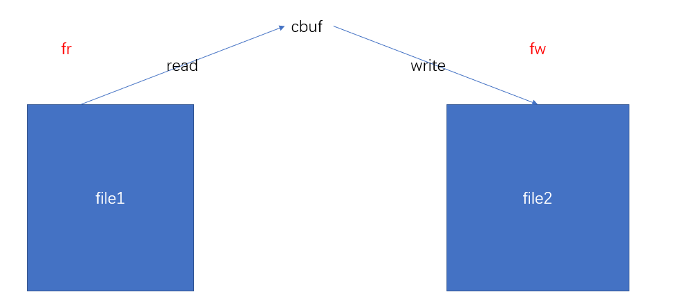

cbuf作为中转站处理fr读取的内容发送到fw中

```java
    @Test
    public void test4() {
        FileReader fr = null;
        FileWriter fw = null;
        try {
            //1.创建File类的对象，指明读入和写出的文件
            File srcFile = new File("hello1.txt");
            File srcFile2 = new File("hello2..txt");

            //不能使用字符流来处理图片等字节数据
//            File srcFile = new File("爱情与友情.jpg");
//            File srcFile2 = new File("爱情与友情1.jpg");
            //可以正常读取和写入,但是写入之后的文件不是一个可以识别的图片

            //2.创建输入流和输出流的对象
            fr = new FileReader(srcFile);
            fw = new FileWriter(srcFile2);

            //3.数据的读入和写出操作
            char[] cbuf = new char[5];
            int len;//记录每次读入到cbuf数组中的字符的个数
            while((len = fr.read(cbuf)) != -1){
                //每次读取5个字符进入cbuf
                //每次写出len个字符.write的结果最终是覆盖file
                //如果fr为append:true,则write的结果是追加
                fw.write(cbuf,0,len);
            }
        } catch (IOException e) {
            e.printStackTrace();
        } finally {
            //4.关闭流资源
            //方式二：分别关闭
            try {
                if(fw != null)
                    fw.close();
            } catch (IOException e) {
                e.printStackTrace();
            }

            try {
                if(fr != null)
                    fr.close();
            } catch (IOException e) {
                e.printStackTrace();
            }
        }
    }
```

## FileInputStream

- 实例化

  - ```java
    new FileInputStream(file)
    ```

- 读取file内容数组

  - ```java
    fis.read(cbuf)
    ```

- 关闭流

  - ```java
    fis.close()
    ```

> 构造器

```java
FileInputStream(File file)
FileInputStream(String filePath)//上面的简写
```

> read方法

```java
public int read();
public int read(byte[] b);
public int read(byte[] b, int off, int len);
```

> 使用FileInputStream不能读取文本文件的测试

```java
     /**
     * 测试FileInputStream和FileOutputStream的使用
     *
     * 结论：
     *    1. 对于文本文件(.txt,.java,.c,.cpp)，使用字符流处理
     *    2. 对于非文本文件(.jpg,.mp3,.mp4,.avi,.doc,.ppt,...)，使用字节流处理
     */
	//使用字节流FileInputStream处理文本文件，可能出现乱码。
    @Test
    public void testFileInputStream(){
        //使用字节流FileInputStream处理文本文件，可能出现乱码。
        FileInputStream fis = null;
        try {
            //1.造文件
            File file = new File("hello.txt");

            //2.造流
            fis = new FileInputStream(file);

            //3.读数据
            byte[] buffer = new byte[5];
            int len;//记录每次读取的字节的个数
            while((len = fis.read(buffer)) != -1){
                String str = new String(buffer,0,len);
                System.out.print(str);
            }
        } catch (IOException e) {
            e.printStackTrace();
        }finally {
            if(fis != null) {
                //4.关闭资源
                try {
                    fis.close();
                } catch (IOException e) {
                    e.printStackTrace();
                }
            }
        }
    }
```

hello.txt内容包含中文字符时出现乱码

为什么?

- 字母数字,占1B,可以用字节流读取
- 中文字符,占3B,只有fis读取的时候将一个中文字符完整读取到buffer中才能完整读取

## FileOutputStream

使用同`FileWriter`,输出字节流

数据以byte为单位写出至磁盘

1. 创建流对象，建立数据存放文件
   - `FileOutputStream fos = new FileOutputStream(new File("Test.txt"));`
2. 调用流对象的写入方法，将数据写入流
   - `fos.write("atguigu-songhongkang");`
3. 关闭流资源，并将流中的数据清空到文件中。
   - `fos.close();`

> 构造器

```java
FileOutputStream(File)
```

> 常用方法

```java
void write(byte[]b,int off,intlen)
```

- 写入一部分b数组到fos到fos指定文件
- 参数
  - b:数据
  - off:写入数据的起始位置
  - len:写入数据的字节数

使用基本同FileWriter中的write,但是其中的char数组因为我们用的是字节流的缘故换成字节数组byte

所以我们赋值图片的时候需要使用byte数组作为中介,byte数组一般移动视频时使用1024B=2^10B=1KB`byte[1024]`

```java
    /**
     * 实现对图片的复制操作
     */
    @Test
    public void testFileInputOutputStream()  {
        FileInputStream fis = null;
        FileOutputStream fos = null;
        try {
            //1.造文件
            File srcFile = new File("爱情与友情.jpg");
            File destFile = new File("爱情与友情2.jpg");

            //2.造流
            fis = new FileInputStream(srcFile);
            fos = new FileOutputStream(destFile);

            //3.复制的过程
            byte[] buffer = new byte[5];
            int len;
            //4.读数据
            while((len = fis.read(buffer)) != -1){
                fos.write(buffer,0,len);
            }
            System.out.println("复制成功");
        } catch (IOException e) {
            e.printStackTrace();
        } finally {
            //close fis&fos
        }

    }
```

### 非文本文件复制

> 要求

```java
copyFile(String srcPath,String destPath)
```

> 测试

```java
    @Test
    public void testCopyFile(){

        long start = System.currentTimeMillis();

//        String srcPath = "C:\\Users\\29433\\Desktop\\164.avi";
//        String destPath = "C:\\Users\\29433\\Desktop\\164.avi";

        String srcPath = "hello.txt";
        String destPath = "hello3.txt";
        //复制文本文件可以,直接剪切给hello3,字节流搬运数据,而不是逐个转换查看所以不出现乱码

        copyFile(srcPath,destPath);

        long end = System.currentTimeMillis();

        System.out.println("复制操作花费的时间为：" + (end - start));//1
    }
```

> 方法编写

```java
    //指定路径下文件的复制
    public void copyFile(String srcPath,String destPath){
        FileInputStream fis = null;
        FileOutputStream fos = null;
        try {
            //File
            File srcFile = new File(srcPath);
            File destFile = new File(destPath);

            //流
            fis = new FileInputStream(srcFile);
            fos = new FileOutputStream(destFile);

            //复制的过程
            //读写准备
            byte[] buffer = new byte[1024];
            int len;
            //读写
            while((len = fis.read(buffer)) != -1){
                fos.write(buffer,0,len);
            }

        } catch (IOException e) {
            e.printStackTrace();
        } finally {
           //关闭fos&fis
        }
    }
```

> 总结

- 文本文件可以使用字节流复制
- 非文本文件不可以使用字符流复制(为什么?)


# 缓冲流（4个）

## 初始

> 概念

为了提高数据读写的速度，Java API提供了带缓冲功能的流类，在使用这些流类时，会创建一个内部缓冲区数组，缺省使用8192个字节(8Kb)的缓冲区。

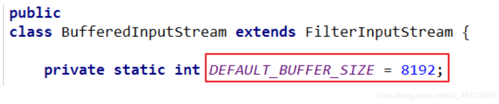

缓冲流要“套接”在相应的节点流之上，根据数据操作单位可以把缓冲流分为：

- BufferedInputStream和BufferedOutputStream
- BufferedReader和BufferedWriter

相当于多了一个高速缓存,所以速度更快

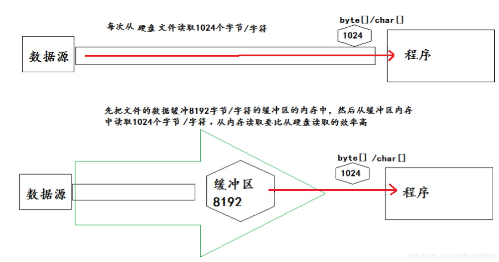

**缓冲流的读写**

- 当读取数据时，数据按块读入缓冲区，其后的读操作则从缓冲区读入程序

- 当写数据时，数据先写入缓冲区，其后的写操作按块写入文件


flush方法是输出流的方法,清空缓存区,自动调用,我们一般不需要手动调用

如果是带缓冲区的流对象的 `close()` 方法，不但会关闭流，还会在关闭流之前刷新缓冲区，关闭后不能再写出。

## BufferedInputStream

缓冲流是一种处理流,需要作用于节点流上,所以它的实例化需要节点流

- 节点流作用文件`new File("xxx")`
- 流
  - 节点流使用File创建`new FileInputStream(fileObj)`
  - 缓冲流使用上面的节点流构造`new BufferedInputStream(fis)`
- 读操作
- 先关外层处理流，再关闭内层节点流（Java设置关闭外层流的同时关闭内层流）

### 构造器

```java
BufferedInputStream(InputStream in)
```

- 参数可以是节点流,也可以是处理流
- 都可以加快读取速度

### 常用方法

> ```java
> int read()
> ```

- 读取一个字节,返回其int值(`0000,0000-0fff,ffff`)
- 末尾返回-1

>```java
>public int read(byte[] b);
>```

- 尽可能多的读取字符,存入b中

- 返回读取字符的个数

- 使用

  - ```
    int len;byte[]b=new byte[1024];
    while((len=br.read(b))!=-1){
    	...
    }
    ```

>```java
>public int read(byte[] b, int off, int len);
>```

- 读取字节, 从b的off位置开始存储len个
- 不常用

## BufferedOutputStream

缓冲输出流, 一般也是需要作用于处理流或者节点流

### 构造器

```java
BufferedOutputStream(OutputStream out)
```

- 参数
  - out:节点流或者处理流

### 常用方法

> void bos.write(byte[]b)

- 向O流写处字节数组byte
- 不常用

> void bos.write(byte[]b,int off,int len)

- 向指定的字节数组(off)开始写出len个字节到O流
- 返回
  - b:数据
  - off:写入开始位置
  - len:写入字节数

## BufferedReader

char-input-处理流

### 构造器

```
BufferedReader(WReader w)
```

- 参数
  - w:一个char-input流(处理流或者节点流)

### 常用方法

> ```java
> String readLine() throws IOException
> ```

- 读取一行文本,不包括行终止符
- 返回:一行文本,如果是行末尾则返回null

- 特别的,如果输入的一行没有文本,则返回空字符串`""`

> ```java
> public int read() throws IOException
> ```

- 读取一个字符,并返回其编码
- 行尾则返回-1

>```java
>public int read(char cbuf[]) throws IOException
>```

- 尽可能多的读取字符,存入cbuf中
- 返回读取的字符数

>```java
>public int read(char cbuf[], int off, int len) throws IOException
>```

- 读取len个字符存入cbuf的off位置

- 返回读取的字符个数

- 使用

  - 准备len和cbuf读取

  - ```java
    int len;char[]cbuf=new char[1024];
    while((len=br.read(cbuf))!=-1){
    	sout(new String(cbuf,0,len));
    }
    ```

## BufferedWirter

char-output-处理流

### 构造器

```
BufferedWirter(Writer w)
```

- 参数
  - w:一个char-output流(处理流或者节点流)

### 常用方法

> void bw.write(char[]cbuf)

- 向O流写处字符数组cbuf
- 不常用

> void bw.write(char[]cbuf,int off,int len)

- 向指定的字符数组(off)开始写出len个字节到O流
- 返回
  - b:数据
  - off:写入开始位置
  - len:写入字符数


```java
/**
 * 处理流之一：缓冲流的使用
 *
 *  1.缓冲流：
 *  BufferedInputStream
 *  BufferedOutputStream
 *  BufferedReader
 *  BufferedWriter
 */
public class BufferedTest {

    /**
     * 实现非文本文件的复制
     */
    @Test
    public void BufferedStreamTest(){
        BufferedInputStream bis = null;
        BufferedOutputStream bos = null;

        try {
            //1.造文件
            File srcFile = new File("爱情与友情.jpg");
            File destFile = new File("爱情与友情3.jpg");
            //2.造流
            //2.1 造节点流
            FileInputStream fis = new FileInputStream((srcFile));
            FileOutputStream fos = new FileOutputStream(destFile);
            //2.2 造缓冲流
            bis = new BufferedInputStream(fis);
            bos = new BufferedOutputStream(fos);

            //3.复制的细节：读取、写入
            byte[] buffer = new byte[10];
            int len;
            while((len = bis.read(buffer)) != -1){
                bos.write(buffer,0,len);
//                bos.flush();//刷新缓冲区
            }
        } catch (IOException e) {
            e.printStackTrace();
        } finally {
            //4.资源关闭
            //要求：先关闭外层的流，再关闭内层的流
            if(bos != null){
                try {
                    bos.close();
                } catch (IOException e) {
                    e.printStackTrace();
                }

            }
            if(bis != null){
                try {
                    bis.close();
                } catch (IOException e) {
                    e.printStackTrace();
                }
            }
            //说明：关闭外层流的同时，内层流也会自动的进行关闭。关于内层流的关闭，我们可以省略.
//        fos.close();
//        fis.close();
        }
    }
}

```

> 

> 字符流使用

```java
public class BufferedTest {
  /**
     * 使用BufferedReader和BufferedWriter实现文本文件的复制
     */
    @Test
    public void test4(){
        BufferedReader br = null;
        BufferedWriter bw = null;
        try {
            //创建文件和相应的流
            br = new BufferedReader(new FileReader(new File("dbcp.txt")));
            bw = new BufferedWriter(new FileWriter(new File("dbcp1.txt")));

            //读写操作
            //方式一：使用char[]数组
//            char[] cbuf = new char[1024];
//            int len;
//            while((len = br.read(cbuf)) != -1){
//                bw.write(cbuf,0,len);
//    //            bw.flush();
//            }

            //方式二：使用String
            String data;
            while((data = br.readLine()) != null){//读取不包含换行符的一行,末尾返回null
                //方法一：
//                bw.write(data + "\n");//data中不包含换行符
                //方法二：
                bw.write(data);//data中不包含换行符
                bw.newLine();//提供换行的操作,写入一个更加通用的换行
            }

        } catch (IOException e) {
            e.printStackTrace();
        } finally {
            //关闭资源
            if(bw != null){

                try {
                    bw.close();
                } catch (IOException e) {
                    e.printStackTrace();
                }
            }
            if(br != null){
                try {
                    br.close();
                } catch (IOException e) {
                    e.printStackTrace();
                }
            }
        }
    }
}
```

## 练习

> 实现图片加密操作

**加密操作**

- 将图片文件通过字节流读取到程序中
- 将图片的字节流逐一进行 `^` 操作
- 将处理后的图片字节流输出

```java
//图片的加密
@Test
public void test1() {

    FileInputStream fis = null;
    FileOutputStream fos = null;
    try {
        fis = new FileInputStream("test.jpg");
        fos = new FileOutputStream("testSecret.jpg");

        byte[] buffer = new byte[20];
        int len;
        while ((len = fis.read(buffer)) != -1) {

            for (int i = 0; i < len; i++) {
                buffer[i] = (byte) (buffer[i] ^ 5);
            }

            fos.write(buffer, 0, len);
        }
    } catch (IOException e) {
        e.printStackTrace();
    } finally {
        ...
    }
}
```

加密后的文件和源文件大小一样

**解密操作**

- 将加密后图片文件通过字节流读取到程序中
- 将图片的字节流逐一进行 `^` 操作（原理：`A^B^B = A`）
- 将处理后的图片字节流输出

```java
//图片的解密
@Test
public void test2() {

    FileInputStream fis = null;
    FileOutputStream fos = null;
    try {
        fis = new FileInputStream("testSecret.jpg");
        fos = new FileOutputStream("test4.jpg");

        byte[] buffer = new byte[20];
        int len;
        while ((len = fis.read(buffer)) != -1) {
          
            for (int i = 0; i < len; i++) {
                buffer[i] = (byte) (buffer[i] ^ 5);
            }

            fos.write(buffer, 0, len);
        }
    } catch (IOException e) {
        e.printStackTrace();
    } finally {
        ...
    }
}
```

加密解密可逆,可以写成一个函数复用

```java
//encryptDecode
encryptDecode(srcFile,destFile){
    FileInputStream fis = null;
    FileOutputStream fos = null;
    try {
        fis = new FileInputStream(srcFile);
        fos = new FileOutputStream(destFile);

        byte[] buffer = new byte[20];
        int len;
        while ((len = fis.read(buffer)) != -1) {
          
            for (int i = 0; i < len; i++) {
                buffer[i] = (byte) (buffer[i] ^ 5);
            }

            fos.write(buffer, 0, len);
        }
    } catch (IOException e) {
        e.printStackTrace();
    } finally {
        ...
    }
}
```

> 统计文本中每一个字符出现次数

实现思路：

1. 遍历文本每一个字符
2. 字符出现的次数存在Map中
3. 把map中的数据写入文件

```java
@Test
public void testWordCount() {
    FileReader fr = null;
    BufferedWriter bw = null;
    try {
        //1.创建Map集合
        Map<Character, Integer> map = new HashMap<Character, Integer>();

        //2.遍历每一个字符,每一个字符出现的次数放到map中
        fr = new FileReader("dbcp.txt");
        int c = 0;
        while ((c = fr.read()) != -1) {
            //int 还原 char
            char ch = (char) c;
            // 判断char是否在map中第一次出现
            if (map.get(ch) == null) {
                map.put(ch, 1);
            } else {
                map.put(ch, map.get(ch) + 1);
            }
        }

        //3.把map中数据存在文件count.txt
        //3.1 创建Writer
        bw = new BufferedWriter(new FileWriter("wordcount.txt"));

        //3.2 遍历map,再写入数据
        Set<Map.Entry<Character, Integer>> entrySet = map.entrySet();
        for (Map.Entry<Character, Integer> entry : entrySet) {
            switch (entry.getKey()) {
                case ' ':
                    bw.write("空格=" + entry.getValue());
                    break;
                case '\t'://\t表示tab 键字符
                    bw.write("tab键=" + entry.getValue());
                    break;
                case '\r'://
                    bw.write("回车=" + entry.getValue());
                    break;
                case '\n'://
                    bw.write("换行=" + entry.getValue());
                    break;
                //特殊字符,上面
                //下面普通可打印字符
                default:
                    bw.write(entry.getKey() + "=" + entry.getValue());
                    break;
            }
            bw.newLine();
        }
    } catch (IOException e) {
        e.printStackTrace();
    } finally {
        //4.关流
        ...
    }
}

```

# 转换流（2个）

## 初始

> 1. 概念

| char流,处理流      | 作用                   |
| ------------------ | ---------------------- |
| InputStreamReader  | byte输入流转char输入流 |
| OutputStreamReader | char输出流转byte输出流 |

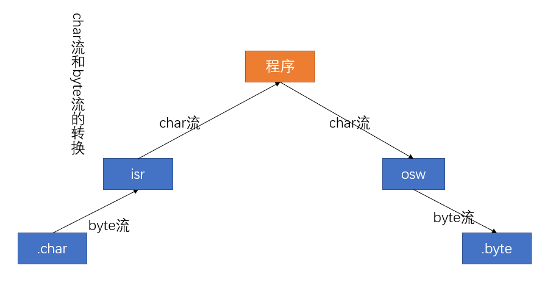

- 字节流中的数据都是字符时，转成字符流操作更高效。
- 很多时候我们使用转换流来处理文件乱码问题。实现编码和解码的功能。

> 1.1 编码解码

编码: 从看的懂的编码成以一般方式看不懂的, char->byte(osr)

解码: byte->char(isr)

> 1.2 字符集

解码和编码都需要字符集

1. isr将byte转char时需要依据char文件原本的charset
2. osr将char转byte时也一样

> 1.3 InputStreamReader

构造器

```java
InputStreamReader(InputStream in)
//编码相关,默认编码是IDEA的配置中给定的
InputStreamReader(InputStream in, String charsetName)
InputStreamReader(InputStream in, Charset cs)
InputStreamReader(InputStream in, CharsetDecoder dec)
```

> 1.3.1 代码用例:将一个char文件使用byte流读取,封装为char流读到内存中

```java
    /**
     * 将一个char文件使用byte流读取,封装为char流读到内存中
     */
    @Test
    public void test1() throws Exception {
        FileInputStream fis = new FileInputStream("hello.txt");
//        InputStreamReader isr = new InputStreamReader(fis,"utf-8");//a will eternal 一念永恒
        InputStreamReader isr = new InputStreamReader(fis,"gbk");//a will eternal 涓�蹇垫案鎭�

        int len;
        char[] buf=new char[20];
        while((len=isr.read(buf))!=-1){
            String str = new String(buf,0,len);
            System.out.print(str);
        }
        isr.close();

    }
```

> 1.3.2 综合使用InputStreamReader和OutputStreamWriter

OutputStreamWriter使用编码将char流转换为封装的byte流

实现如下图所示的,将utf-8编码的文件通过isr和osw转写为gbk编码的文件

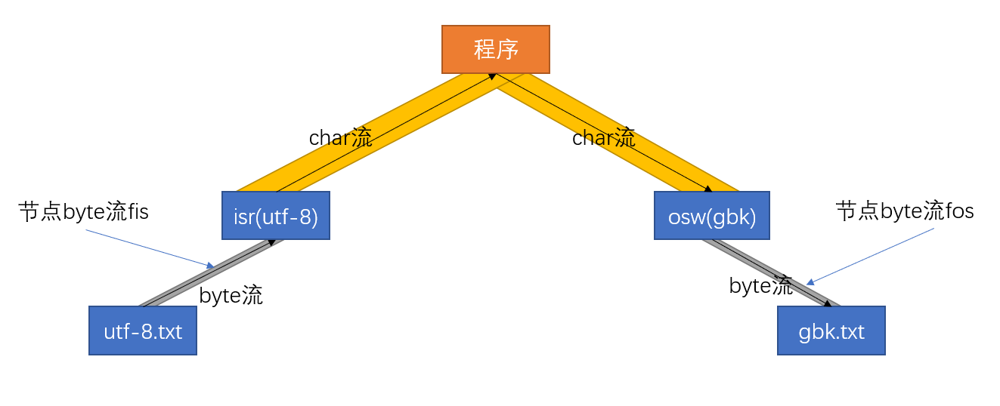

```java
    @Test
    public void test2() throws Exception {
        FileInputStream fis = new FileInputStream("hello.txt");//byte流读
        FileOutputStream fos = new FileOutputStream("hello_gbk.txt");//byte流写入
//        InputStreamReader isr = new InputStreamReader(fis,"utf-8");//a will eternal 一念永恒
        InputStreamReader isr = new InputStreamReader(fis,"utf-8");//a will eternal 涓�蹇垫案鎭�
        OutputStreamWriter osw = new OutputStreamWriter(fos,"gbk");//a will eternal 涓�蹇垫案鎭�

        int len;
        char[] buf=new char[20];
        while((len=isr.read(buf))!=-1){
            osw.write(buf,0,len);
        }
        isr.close();
        osw.close();
    }
```

- 以utf-8格式打开gbk文件,出现乱码`a will eternal 涓�蹇垫案鎭�`
- 以gbk格式打开则无问题,`a will eternal 一念永恒`

> 1.4 OutputStreamWriter

```
实现将字符的输出流按指定字符集转换为字节的输出流。
需要和OutputStream“套接”。
```

构造器

```java
public OutputStreamWriter(OutputStream out)
public OutputSreamWriter(OutputStream out,String charsetName)//指定字符集
```

> 常见的编码表

- ASCII：美国标准信息交换码。用一个字节的7位可以表示。
- ISO8859-1：拉丁码表。欧洲码表用一个字节的8位表示。
- GB2312：中国的中文编码表。最多两个字节编码所有字符
- GBK：中国的中文编码表升级，融合了更多的中文文字符号。最多两个字节编码
- Unicode：国际标准码，融合了目前人类使用的所字符。为每个字符分配唯一的字符码。所有的文字都用两个字节来表示。
- UTF-8：变长的编码方式，可用1-4个字节来表示一个字符。

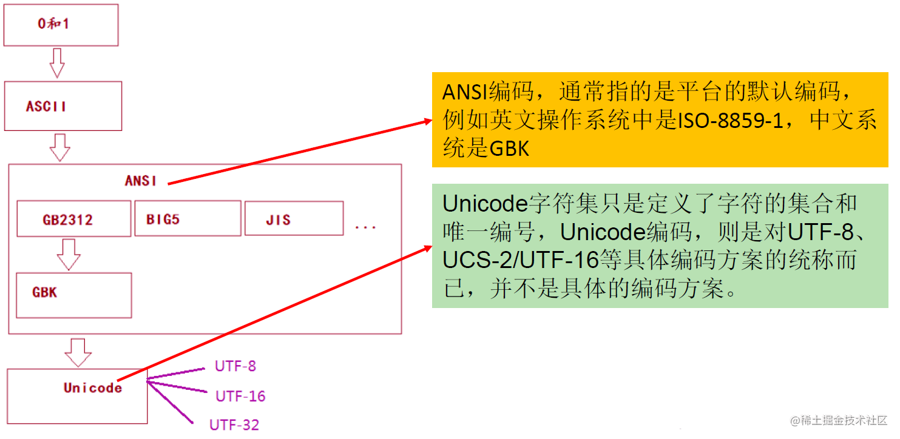

**编码的向上兼容**

- gbk向上兼容ascii

**UTF-Unicode说明：**

- 面向传输的众多UTF(UCS Transfer Format)标准出现了，顾名思义，UTF-8就是每次8个位传输数据，而UTF-16就是每次16个位。这是为传输而设计的编码，并使编码无国界，这样就可以显示全世界上所有文化的字符了。
- Unicode只是定义了一个庞大的、全球通用的字符集，并为每个字符规定了唯确定的编号，具体存储成什么样的字节流，取决于字符编码方案。推荐的Unicode编码是UTF-8和UTF-16。

> 编码的设计问题

1. gbk如何兼容ascii

用最高位是1或0表示两个字节和一个字节

2. unicode与utf

Unicode不完美，这里就有三个问题，
一个是，我们已经知道，英文字母只用一个字节表示就够了，
第二个问题是如何才能区别Unicode和ASCII？计算机怎么知道两个字节表示一个符号，而不是分别表示两个符号呢？
第三个，如果和GBK等双字节编码方式一样，用最高位是1或0表示两个字节和一个字节，就少了很多值无法用于表示字符，不够表示所有字符。
Unicode在很长一段时间内无法推广，直到互联网的出现。

面向传输的众多 UTF（UCS Transfer Format）标准出现了，顾名思义，UTF-8就是每次8个位传输数据，而UTF-16就是每次16个位。这是为传输而设计的编码，并使编码无国界，这样就可以显示全世界上所有文化的字符了。

Unicode只是定义了一个庞大的、全球通用的字符集，并为每个字符规定了唯一确定的编号，具体存储成什么样的字节流，取决于字符编码方案。推荐的Unicode编码是UTF-8和UTF-16。


> 转换流的编码应用

可以将字符按指定编码格式存储(o流指定存储为相应byte)
可以对文本数据按指定编码格式来解读(utf-8文本使用I流指定utf-8读取,gbk文本使用I流指定gbk读取)

指定编码表的动作由构造器完成

对后面学习的启示

客户端/浏览器端    <---->  后台(java,GO,Python,Node.js,php)   <----> 数据库

要求前前后后使用的字符集都要统一：UTF-8.

# 标准IO(了解)2''

## 初始

> 1. 概念

**基本**

`System.in`:标准的输入流，默认从键盘输入(类型InputStream)

`System.out`:标准的输出流，默认从控制台输出(类型PrintStream，其是OutputStream的子类)

System.in和System.out分别代表了系统标准的输入和输出设备

默认输入设备是：键盘，输出设备是：显示器

**主要方法**

`System` 类的 `setIn(InputStream is)` 方式重新指定输入的流

`System` 类的 `setOut(PrintStream ps)` 方式重新指定输出的流。

重定向：通过System类的setIn，setOut方法对默认设备进行改变

## System.in

InputStream(byte输入流),“标准”输入流。这个流已经打开并准备提供输入数据。通常，此流对应于键盘输入或主机环境或用户指定的其他输入源。

**使用**

1. (读取文本文件,需要编码): 
   1. System.in重定向至fis,
   2. 封装为转换流`isr`编码
   3. 再由转换流封装为缓冲流`br`
2. (读取非文本文件):直接封装为缓冲流(为什么?)

**常用方法**

`System` 类的 `setIn(InputStream is)` 方式重新指定输入的流

- 默认是键盘
- 一般用不到, 除非是文件输入流

是InputStream,一个抽象基类, 所以不能使用read等方法

针对System.in的使用都是用`setIn`重定向它到指定的fos

## 练习

> System.in练习: 使用System.in读取一个文本文件

读取文本使用char流, SystemIn重定向fis, 再封装为转换流(char)进行解码读取

- `new InputStreamReader(System.in)`
- 调用`int read(char[]buf)`方法读取

```java
    /**
     * 测试打印流输出
     */
    @Test
    public void testPs() throws Exception {
        //设置文件为System.in输入
        System.setIn(new FileInputStream("hello_gbk.txt"));
        //转换流,对文件字节转码
        InputStreamReader isr = new InputStreamReader(System.in,"gbk");
        //读取前配置
        char[]buf=new char[5];
        int len;
        while((len=isr.read(buf))!=-1){
            System.out.print(new String(buf,0,len));
        }
        //关闭流
        isr.close();
    }
```

> System.in练习: 默认键盘输入读取

一个问题:单元测试JUnit中不能使用控制台输入的解决办法

在IDEA中点击`help->Edit Custom Vm Options`，
在最后一行加入：（最后记得重启idea）`  -Deditable.java.test.console=true`

```java
    /**
     * 测试标准流指定键盘输入内存
     */
    @Test
    public void testPs() throws Exception {
        //设置默认System.in输入
        //转换流,对文件字节转码
        InputStreamReader isr = new InputStreamReader(System.in);
        BufferedReader br = new BufferedReader(isr);
        //读取键盘输入的一行,以exit为终止
        System.out.println("输入:");//输入提示
        while(true){
            String line=br.readLine();
            if("exit".equalsIgnoreCase(line))break;
            System.out.println(line);
        }
        //关闭流
        br.close();
    }
```

> 应用:
> 从键盘输入字符串，要求将读取到的整行字符串转成大写输出。
> 然后继续进行输入操作，直至当输入“e”或者“exit”时，退出程序。

```java
/**
 * 其他流的使用
 * 1.标准的输入、输出流
 * 2.打印流
 * 3.数据流
 */
public class OtherStreamTest {

    /**
     * 1.标准的输入、输出流
     *   1.1
     *     System.in:标准的输入流，默认从键盘输入
     *     System.out:标准的输出流，默认从控制台输出
     *   1.2
     *     System类的setIn(InputStream is) / setOut(PrintStream ps)方式重新指定输入和输出的流。
     *
     *   1.3练习：
     *     从键盘输入字符串，要求将读取到的整行字符串转成大写输出。然后继续进行输入操作，
     *     直至当输入“e”或者“exit”时，退出程序。
     *
     *   方法一：使用Scanner实现，调用next()返回一个字符串
     *   方法二：使用System.in实现。System.in  --->  转换流 ---> BufferedReader的readLine()
     */
    @Test
    public void test(){
        BufferedReader br = null;
        try {
            InputStreamReader isr = new InputStreamReader(System.in);
            br = new BufferedReader(isr);

            while (true) {
                System.out.println("请输入字符串：");
                String data = br.readLine();
                if ("e".equalsIgnoreCase(data) || "exit".equalsIgnoreCase(data)) {//防止空指针异常
                    System.out.println("程序结束");
                    break;
                }

                String upperCase = data.toUpperCase();
                System.out.println(upperCase);

            }
        } catch (IOException e) {
            e.printStackTrace();
        } finally {
            ...
        }
    }
}
```

总结:将标准IO-byte流作为参数封装为转换流,再由转换char流封装为缓冲char流

> 封装一个包含readInt, double, float, boolean, short, byte的类

```java
public class MyInput {
    // Read a string from the keyboard
    public static String readString() {
        BufferedReader br = new BufferedReader(new InputStreamReader(System.in));

        // Declare and initialize the string
        String string = "";

        // Get the string from the keyboard
        try {
            string = br.readLine();

        } catch (IOException ex) {
            System.out.println(ex);
        }

        // Return the string obtained from the keyboard
        return string;
    }

    // Read an int value from the keyboard
    public static int readInt() {
        return Integer.parseInt(readString());
    }

    // Read a double value from the keyboard
    public static double readDouble() {
        return Double.parseDouble(readString());
    }

    // Read a byte value from the keyboard
    public static double readByte() {
        return Byte.parseByte(readString());
    }

    // Read a short value from the keyboard
    public static double readShort() {
        return Short.parseShort(readString());
    }

    // Read a long value from the keyboard
    public static double readLong() {
        return Long.parseLong(readString());
    }

    // Read a float value from the keyboard
    public static double readFloat() {
        return Float.parseFloat(readString());
    }
}

```

## System.out

### 基本概念

PrintStream,默认输出设备是控制台，所以一般我们可以使用`System.out.println`来输出

### 常用方法

> System.SetOut(OutputStream)

- outputstream,可以指定为节点流和各种处理流

- 作用:重定向System.out由PrintStream至参数

  - 例1

    ```java
    //节点流
    fos("1.txt")
    System.SetOut(fos);
    System.out.println("一念永恒");//写入1.txt,而不是在console上显示
    //处理流
    bos(fos("1.txt"))
    System.SetOut(fos);
    System.out.println("一念永恒");//写入1.txt,而不是在console上显示
    ```

# 打印流(了解)2''

## 初始

> 1. 两个类

打印流就是O流,O流里面有charO和byteO流

- 实现将基本数据类型的数据格式转化为字符串输出
- 打印流：PrintStream(byte)和PrintWriter(char)
  - 提供了一系列重载的print()和println()方法，用于多种数据类型的输出
  - PrintStream和PrintWriter的输出不会抛出IOException异常
  - PrintStream和PrintWriter有自动flush功能

## PrintStream

OutputStream的子类,byte流

- 输出不会抛出IOException异常
- 有自动flush功能, 需要自己设置
- **System.out就是打印流的实例**
- 应用限制
  - PrintStream 打印的所有字符都使用平台的默认字符编码转换为字节。
    在需要写入字符而不是写入字节的情况下，应该使用PrintWriter 类。
  - 对于文本文件,使用ps和pw都可以
  - 对于非文本文件,则只能使用ps

**构造器**

```

PrintStream(OutputStream out, boolean autoFlush)//打印流,有指定的输出流和刷新
//这个输出流一般指定为节点流FileOutputStream

```

**autoflush**

- 设置自动刷新模式(写入换行符或字节 '\n' 时都会刷新输出缓冲区,将缓冲区中的内容输出,不保留)
- true设置
- false取消

> 1.1.1 printStream常用方法

有一系列的print和println方法

```
print(char,int,String,...)
println(char,int,String,...)
```

## 练习

> 使用PrintStream输出文本文件

- 使用PrintStream封装fos
- 调用write/print/println方法写出

```java
    /**
     * 文本文件使用PrintStream写入
     * @throws Exception
     */
    @Test
    public void printToFile1() throws Exception {
        PrintStream ps = new PrintStream(new FileOutputStream("hello_ps.txt"));
        /*以utf-8格式将打印的字符转换为字节输出至hello_ps.txt*/
        ps.println("a will eternal一念永恒 outputByPrintStream");
        ps.close();
    }
    /**
     * 文本文件使用PrintWriter写入
     * @throws Exception
     */
    @Test
    public void printToFile2() throws Exception {
        PrintWriter pw = new PrintWriter(new FileWriter("hello_pw.txt"));
        pw.println("a will eternal一念永恒 outputByPrintWriter");
        pw.close();
    }
```

> 使用PrintStream输出非文本文件

- 先使用System.in封装fis,再使用缓冲流封装System.in, read一个图片

  - ```java
    //使用System.in封装fis:调用setIn方法
    System.setIn(new FileInputStream());
    //使用缓冲流封装System.in,提高读取速度
    new BufferedStream(System.in)
    ```

- 再使用PrintStream封装fos,write写出图片

```java
    /**
     * PrintStream输出非文本文件
     */
    @Test
    public void printToJpg() throws Exception {
        //1.1使用System.in读取,设置输入流为fis,指定文件为xido.jpg
        System.setIn(new FileInputStream("xido.jpg"));
        //1.2.封装缓冲流
        BufferedInputStream bis = new BufferedInputStream(System.in);

        //2.1构造打印流,以fos节点流构造,向xido_ps.jpg输出
        PrintStream xidoPs = new PrintStream(new FileOutputStream("xido_ps.jpg"));

        //1.3读取
        int len;byte[]b=new byte[1024];
        while((len=bis.read(b))!=-1){
            //2.2写入
            xidoPs.write(b,0,len);
        }
        //1.4&2.3 关闭流
        bis.close();
        xidoPs.close();

    }
```

> 使用System.out代替write向文件输出

设置标准输出流设备为打印流,此时可以使用`System.out`来输出重定向至文件

```java
System.setOut(new PrintStream(fos, true))
```

 此时调用`System.out`中的`print/println`方法就可以输出内容至fos指定的文件

下面是代码:

```java
    /**
     * 2. 打印流：PrintStream 和PrintWriter
     *  2.1 提供了一系列重载的print() 和 println()
     *  2.2 练习：
     */
    @Test
    public void test2(){
        PrintStream ps = null;
        try {
            FileOutputStream fos = new FileOutputStream(new File("D:\\IO\\text.txt"));
            // 创建打印输出流,设置为自动刷新模式(写入换行符或字节 '\n' 时都会刷新输出缓冲区)
            ps = new PrintStream(fos, true);
            if (ps != null) {// 把标准输出流(控制台输出)改成文件
                System.setOut(ps);
            }
            //System.setOut(new PrintStream(fos, true))

            for (int i = 0; i <= 255; i++) { // 输出ASCII字符
                System.out.print((char) i);
                if (i % 50 == 0) { // 每50个数据一行
                    System.out.println(); // 换行
                }
            }

        } catch (FileNotFoundException e) {
            e.printStackTrace();
        } finally {
            if (ps != null) {
                ps.close();
            }
        }
    }
```


## printWriter

*抽象基类:Writer,charOutput*

适合输出文本文件, 提供了一系列重载的print()和println()方法，用于多种数据类型的输出

- 作用于writer

  - ```
    //构造器
    new PrintWriter(new FileWriter(new File))
    ```

- 写操作

  - ```
    pw.write();
    pw.print();
    pw.println();
    ```

  - SystemOut重定向为pw

    ```java
    System.setOut(pw);
    System.out.println(...)
    ```

- 关闭流

  - ```
    pw.close();
    ```

# 数据流(了解)2''

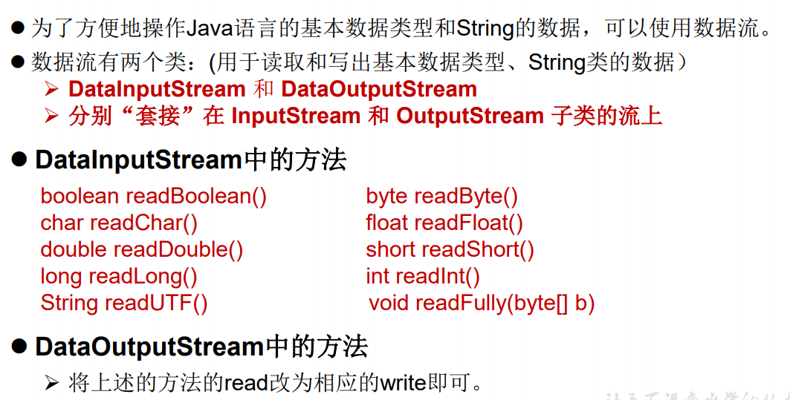

代码示例:

```java
    /**
     * 将内存中的字符串、基本数据类型的变量写出到文件中。
     */
    @Test
    public void test3(){
        //1.造对象、造流
        DataOutputStream dos = null;
        try {
            dos = new DataOutputStream(new FileOutputStream("data.txt"));
            //数据输出
            dos.writeUTF("Bruce");
            dos.flush();//刷新操作，将内存的数据写入到文件
            dos.writeInt(23);
            dos.flush();
            dos.writeBoolean(true);
            dos.flush();
        } catch (IOException e) {
            e.printStackTrace();
        } finally {
            //3.关闭流
            if (dos != null){
                try {
                    dos.close();
                } catch (IOException e) {
                    e.printStackTrace();
                }
            }
        }
    }
    /**
     * 将文件中存储的基本数据类型变量和字符串读取到内存中，保存在变量中。
     * 注意点：读取不同类型的数据的顺序要与当初写入文件时，保存的数据的顺序一致！
     */
    @Test
    public void test4(){
        DataInputStream dis = null;
        try {
            //1.造对象、造流
            dis = new DataInputStream(new FileInputStream("data.txt"));
            //2.从文件读入数据
            String name = dis.readUTF();
            int age = dis.readInt();
            boolean isMale = dis.readBoolean();

            System.out.println("name:"+name);
            System.out.println("age:"+age);
            System.out.println("isMale:"+isMale);
        } catch (IOException e) {
            e.printStackTrace();
        } finally {
            //3.关闭流
            if (dis != null){

                try {
                    dis.close();
                } catch (IOException e) {
                    e.printStackTrace();
                }
            }
        }
    }
```

> 总结

数据流操作基本数据类型和String，用于持久化数据。
但是不能读取修改对象，以对象流为补充。

# [RandomAccessFile]

该对象不是流体系中的一员，其封装了字节流，同时还封装了一个缓冲区（字符数组），通过内部的指针来操作字符数组中的数据。该对象特点：

1、该对象只能操作文件，所以构造函数接受两种数据类型的参数：

· 字符串文件路径

· File对象

2、该对象既可以对文件进行读操作，也能进行写操作，在进行对象实例化时可指定操作模式（r , rw）。

注意：**该对象在实例化时，如果要操作的文件不存在，会自动创建；如果文件存在，写数据未指定位置，会从头开始写，即覆盖原有的内容。**可以用于多线程下载或多个线程同时写数据到文件。

# 对象流

- Object-Input?Output-Stream

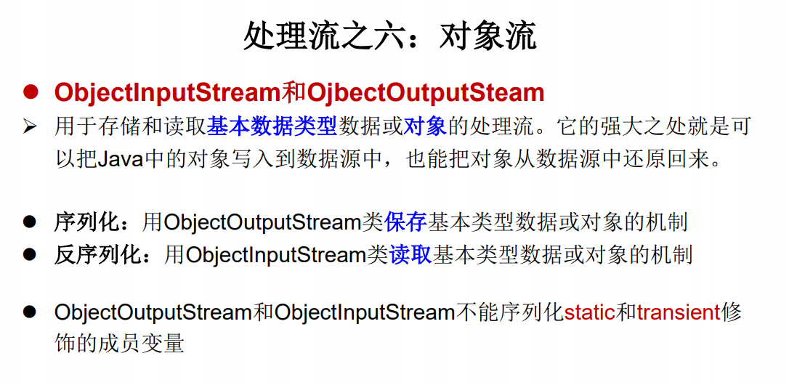

## 对象序列化(重点)

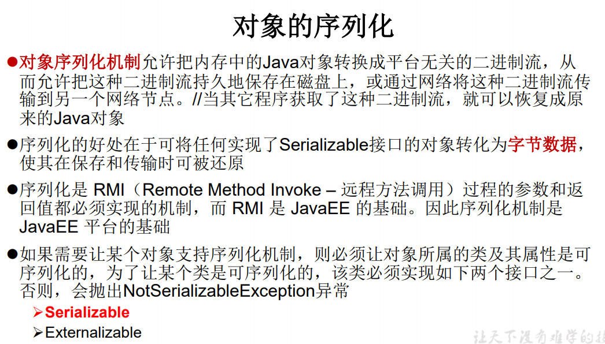

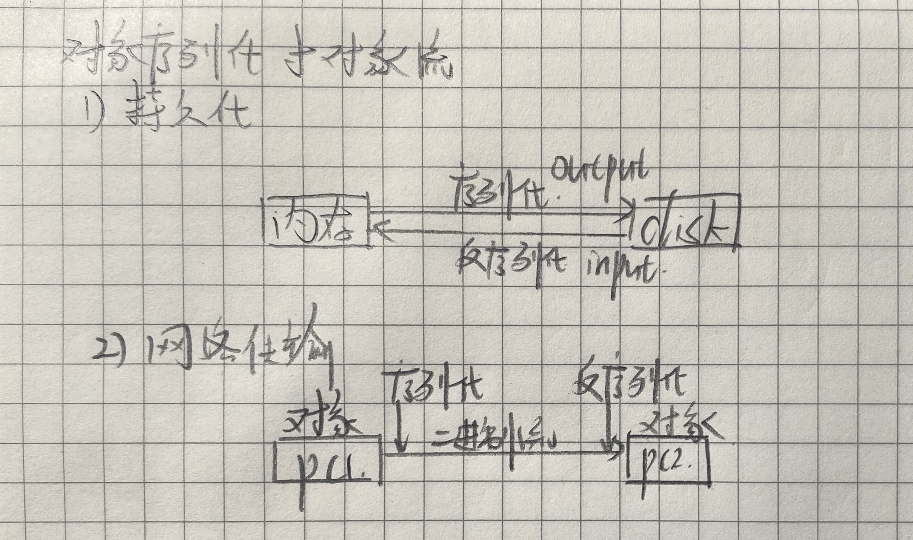

### 使用

1. 对象流： 
   ObjectInputStream 和 ObjectOutputStream

2. 作用：
   ObjectOutputStream:内存中的对象--->存储中的文件、通过网络传输出去：序列化过程
   ObjectInputStream:存储中的文件、通过网络接收过来 --->内存中的对象：反序列化过程

3. 对象的序列化机制：
   对象序列化机制允许把内存中的Java对象转换成平台无关的二进制流，从而允许把这种二进制流持久地保存在磁盘
   上，或通过网络将这种二进制流传输到另一个网络节点。
   //当其它程序获取了这种二进制流，就可以恢复成原来的Java对象

4. 可序列化的类的要求
   - 需要实现接口：Serializable
   - 当前类提供一个全局常量：serialVersionUID
   - 除了当前Person类需要实现Serializable接口之外，还必须保证其内部所属性也必须是可序列化的。（默认情况下，基本数据类型可序列化）

补充：ObjectOutputStream和ObjectInputStream不能序列化static和transient修饰的成员变量

> 对于已经实现了序列化接口的类

```java
    /**
     * 对象序列化:将对象从内存持久化到磁盘中
     */
    @Test
    public void testObjectOutput() throws Exception {
        ObjectOutputStream oos = new ObjectOutputStream(new FileOutputStream("object.dat"));
        /*常用方法:writeObject*/
        oos.writeObject(new String("我爱你青松气质"));
        /*public final class String implements java.io.Serializable*/
        oos.close();
    }
    /**
     * 对象反序列化:将二进制流从磁盘读取为内存中的对象
     */
    @Test
    public void testObjectInput() throws Exception {
        ObjectInputStream ois = new ObjectInputStream(new FileInputStream("object.dat"));
        /*常用方法:readObject*/
        System.out.println((String)(ois.readObject()));
        ois.close();
    }
```

> 自定义可序列化对象

1. 实现可序列化接口
2. 定义一个静态常量serialVersionUID

```java
public class Person implements Serializable {
    //Serializable是一个可序列化接口,内部没有需要实现的方法,所以又被称为标识接口
    //只要实现了这个序列化接口,就可以序列化
    private static final long serialVersionUID = -3252910085448863011L;
    //序列版本号,用于区分在01流传输后需要转化的对象,是序列二进制流之间区分的依据
    String name;
    int age;

    public Person() {
    }

    public Person(String name, int age) {
        this.name = name;
        this.age = age;
    }

    public String getName() {
        return name;
    }

    public void setName(String name) {
        this.name = name;
    }

    public int getAge() {
        return age;
    }

    public void setAge(int age) {
        this.age = age;
    }
}
```

一般来说,自定义对象实现序列化接口后可以转换为json格式的字符串传输,而不是通过对象流传输

> [2] 不能序列化static和transient属性

不能持久化公有的属性

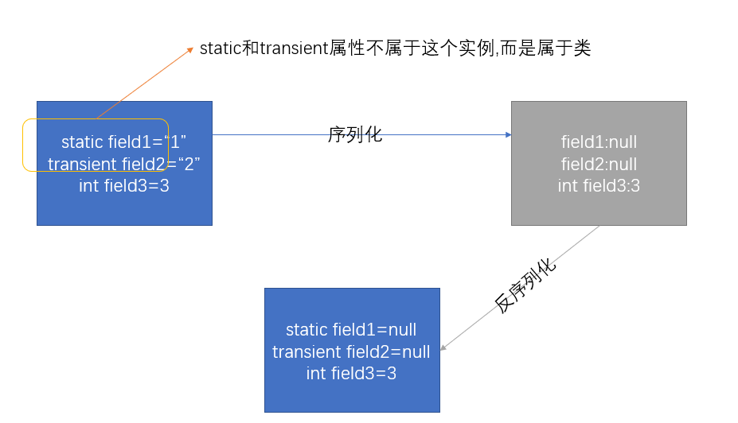

### serialVersionUID

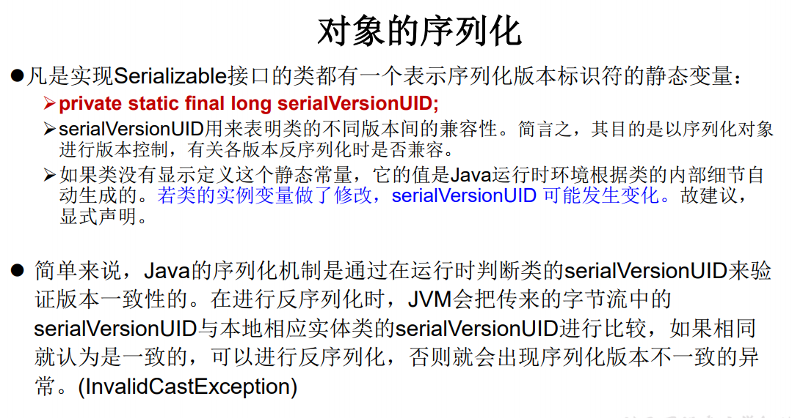

> [1] 不指定时,类定义修改,UID也修改

则此时序列化出去的数据再反序列化的时候，JVM找不到这个对象UID所标识的类，导致反序列化错误。

# RandomAccessFile流

继承关系

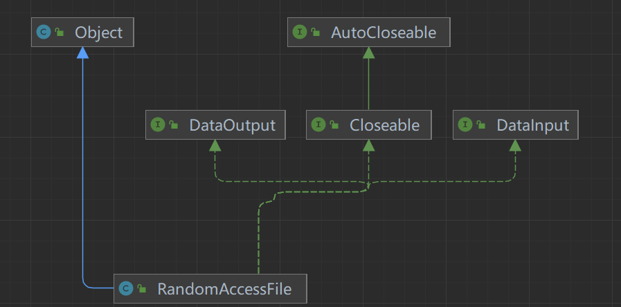

- RandomAccessFile直接继承于java.lang.Object类，实现了DataInput和DataOutput**接口**
- 可以存取文件，RandomAccessFile既可以作为一个输入流，又可以作为一个输出流
- 是Object的直接子类

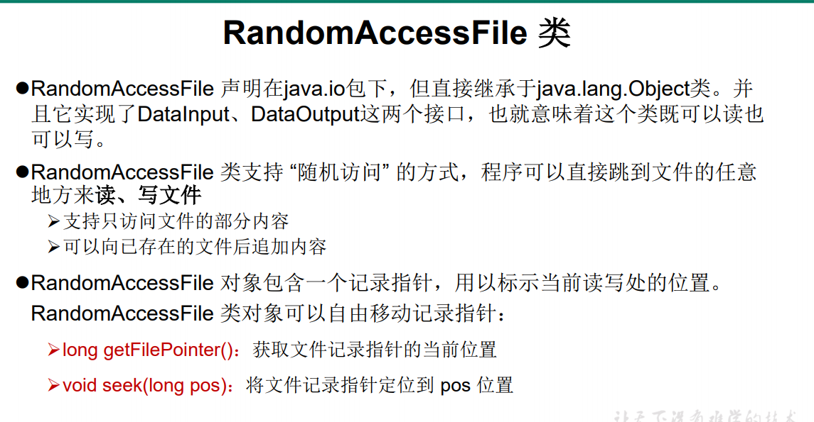

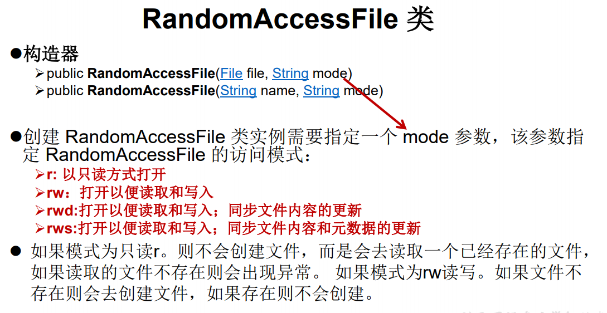

- JDK 1.6上面写的每次write数据时，"rw"模式，数据不会立即写到硬盘中; 而"rwd"，数据会被立即写入硬盘。
- 如果写数据过程发生异常，"rwd"模式中已被write的数据被保存到硬盘,而"rw则全部丢失。

基本使用: 使用RandomAccessFile读写文件

```java
@Test
public void test1() {

    RandomAccessFile raf1 = null;
    RandomAccessFile raf2 = null;
    try {
        //1.
        raf1 = new RandomAccessFile(new File("爱情与友情.jpg"),"r");//输入
        raf2 = new RandomAccessFile(new File("爱情与友情1.jpg"),"rw");//输入输出流
        //2.
        byte[] buffer = new byte[1024];
        int len;
        //读取
        while((len = raf1.read(buffer)) != -1){
            raf2.write(buffer,0,len);//写入
        }
    } catch (IOException e) {
        e.printStackTrace();
    } finally {
        //3.关闭流
    }
}
```

如果`RandomAccessFile`作为输出流时，写出到的文件如果不存在，则在执行过程中自动创建。
如果写出到的文件存在，则会对原文件内容进行覆盖。（默认情况下，从头覆盖）

```
abcdefghijk---write("xyz".getbytes())-->xyzdefghijk
```

- 测试

  ```java
      @Test
      public void testRandomOut() throws Exception {
          //原文件:a will eternal 一念永恒
          RandomAccessFile rw = new RandomAccessFile("hello.txt", "rw");
          rw.write("耳根".getBytes());
          //修改后:耳根 eternal 一念永恒
          //一个中文字符3B,耳根占6B,替换a will
          rw.close();
      }
  ```

## 常用方法

> write(...)

以覆盖的方法写入

> seek(int pos)

将文件记录指针定位到 pos 位置

> long getFilePointer()：获取文件记录指针的当前位置

## 实现文件任意位置插入

思路如上

```java
/*
可以通过相关的操作，实现RandomAccessFile“插入”数据的效果。seek(int pos)
使用RandomAccessFile实现数据的插入效果
 */
@Test
public void test3() throws IOException {

    RandomAccessFile raf1 = new RandomAccessFile("hello.txt","rw");

    raf1.seek(3);//将指针调到角标为3的位置
    //保存指针3后面的所数据到StringBuilder中
    StringBuilder builder = new StringBuilder((int) new File("hello.txt").length());
    byte[] buffer = new byte[20];
    int len;
    while((len = raf1.read(buffer)) != -1){
        builder.append(new String(buffer,0,len)) ;
    }
    //调回指针，写入“xyz”
    raf1.seek(3);
    raf1.write("xyz".getBytes());

    //将StringBuilder中的数据写入到文件中
    raf1.write(builder.toString().getBytes());

    raf1.close();

    //思考：将StringBuilder替换为ByteArrayOutputStream
}
```

> 思考：将StringBuilder替换为ByteArrayOutputStream

```java
    @Test
    public void test() throws Exception {
        RandomAccessFile rw = new RandomAccessFile("insert.txt", "rw");
        ByteArrayOutputStream byteArrayOutputStream = new ByteArrayOutputStream();
        rw.seek(3);//AI如
        int len=0;byte[] b=new byte[10];
        while((len=rw.read(b))!=-1) {
            byteArrayOutputStream.write(b,0,len);
        }
        //重定向
        rw.seek(3);
        //插入xyz
        rw.write("xyz".getBytes());
        //插入byteArrayOutputStream内部buf的内容
        rw.write(byteArrayOutputStream.toByteArray());
        rw.close();
    }
```

## 断点续传

我们可以用RandomAccessFile这个类，来实现一个多线程断点下载的功能，用过下载工具的朋友们都知道，下载前都会建立两个临时文件，一个是与被下载文件大小相同的空文件，另一个是记录文件指针的位置文件，每次暂停的时候，都会保存上一次的指针，然后断点下载的时候，会继续从上一次的地方下载，从而实现断点下载或上传的功能，有兴趣的朋友们可以自己实现下。

# NIO

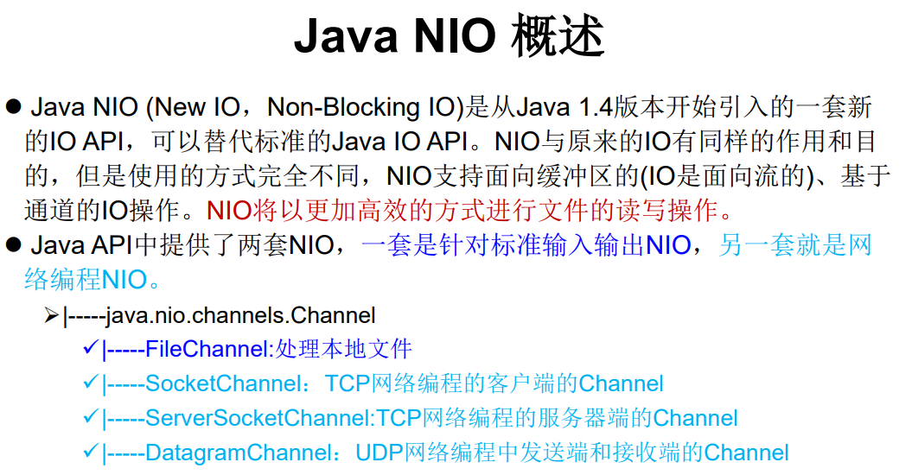

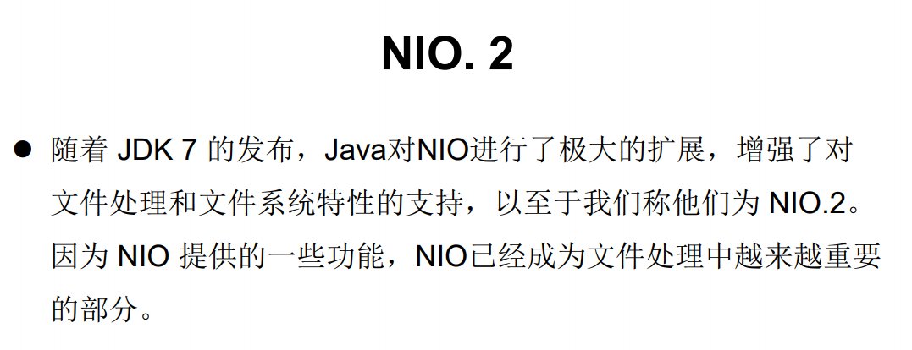

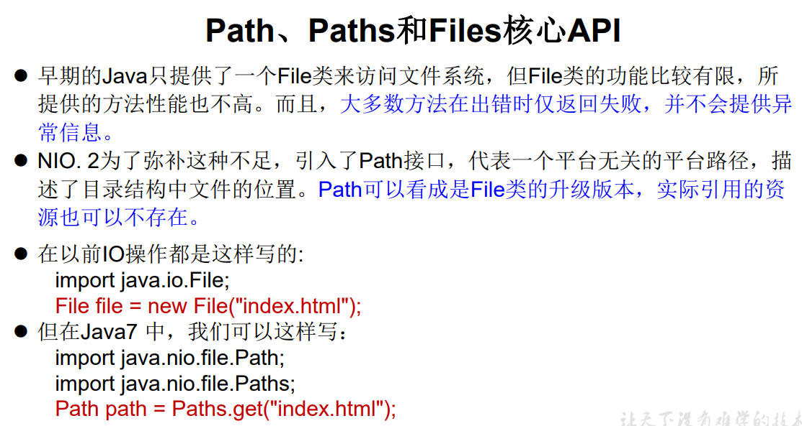

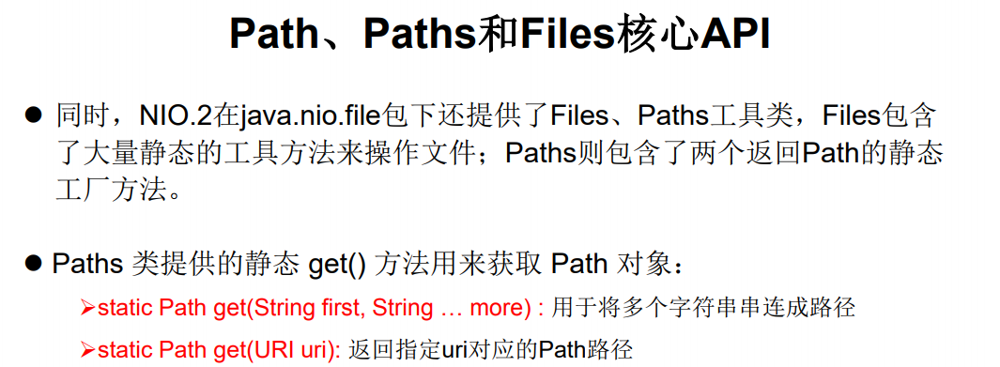

> Path接口, File的替换

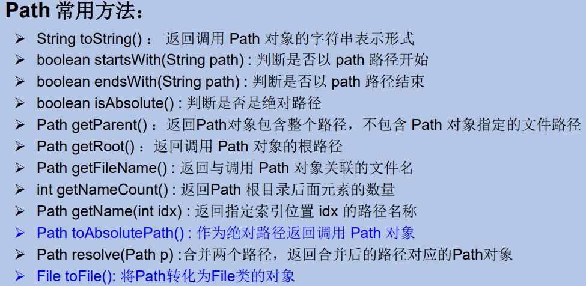

```java
/**
 * 1. jdk 7.0 时，引入了 Path、Paths、Files三个类。
 * 2.此三个类声明在：java.nio.file包下。
 * 3.Path可以看做是java.io.File类的升级版本。也可以表示文件或文件目录，与平台无关
 * <p>
 * 4.如何实例化Path:使用Paths.
 * static Path get(String first, String … more) : 用于将多个字符串串连成路径
 * static Path get(URI uri): 返回指定uri对应的Path路径
 *
 * @author shkstart
 * @create 2019 下午 2:44
 */
public class PathTest {

    //如何使用Paths实例化Path
    @Test
    public void test1() {
        Path path1 = Paths.get("d:\\nio\\hello.txt");//new File(String filepath)

        Path path2 = Paths.get("d:\\", "nio\\hello.txt");//new File(String parent,String filename);

        System.out.println(path1);
        System.out.println(path2);

        Path path3 = Paths.get("d:\\", "nio");
        System.out.println(path3);
    }

    //Path中的常用方法
    @Test
    public void test2() {
        Path path1 = Paths.get("d:\\", "nio\\nio1\\nio2\\hello.txt");
        Path path2 = Paths.get("hello.txt");

//		String toString() ： 返回调用 Path 对象的字符串表示形式
        System.out.println(path1);

//		boolean startsWith(String path) : 判断是否以 path 路径开始
        System.out.println(path1.startsWith("d:\\nio"));
//		boolean endsWith(String path) : 判断是否以 path 路径结束
        System.out.println(path1.endsWith("hello.txt"));
//		boolean isAbsolute() : 判断是否是绝对路径
        System.out.println(path1.isAbsolute() + "~");
        System.out.println(path2.isAbsolute() + "~");
//		Path getParent() ：返回Path对象包含整个路径，不包含 Path 对象指定的文件路径
        System.out.println(path1.getParent());
        System.out.println(path2.getParent());
//		Path getRoot() ：返回调用 Path 对象的根路径
        System.out.println(path1.getRoot());
        System.out.println(path2.getRoot());
//		Path getFileName() : 返回与调用 Path 对象关联的文件名
        System.out.println(path1.getFileName() + "~");
        System.out.println(path2.getFileName() + "~");
//		int getNameCount() : 返回Path 根目录后面元素的数量
//		Path getName(int idx) : 返回指定索引位置 idx 的路径名称
        for (int i = 0; i < path1.getNameCount(); i++) {
            System.out.println(path1.getName(i) + "*****");
        }

//		Path toAbsolutePath() : 作为绝对路径返回调用 Path 对象
        System.out.println(path1.toAbsolutePath());
        System.out.println(path2.toAbsolutePath());
//		Path resolve(Path p) :合并两个路径，返回合并后的路径对应的Path对象
        Path path3 = Paths.get("d:\\", "nio");
        Path path4 = Paths.get("nioo\\hi.txt");
        path3 = path3.resolve(path4);
        System.out.println(path3);

//		File toFile(): 将Path转化为File类的对象
        File file = path1.toFile();//Path--->File的转换

        Path newPath = file.toPath();//File--->Path的转换

    }


}
```

> Files工具类

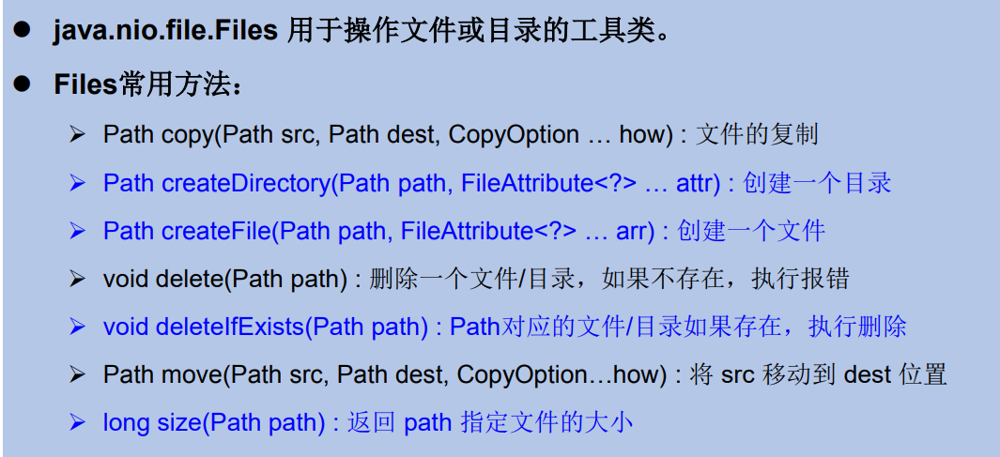

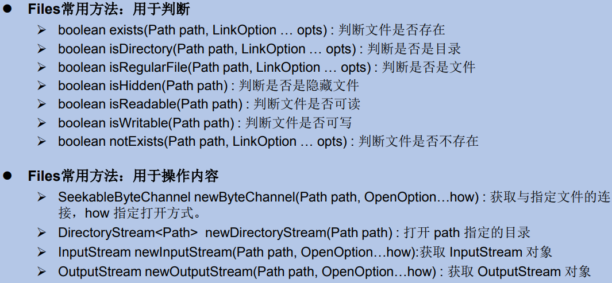

```java
/**
 * Files工具类的使用：操作文件或目录的工具类
 * @author shkstart
 * @create 2019 下午 2:44
 */
public class FilesTest {

	@Test
	public void test1() throws IOException{
		Path path1 = Paths.get("d:\\nio", "hello.txt");
		Path path2 = Paths.get("atguigu.txt");
		
//		Path copy(Path src, Path dest, CopyOption … how) : 文件的复制
		//要想复制成功，要求path1对应的物理上的文件存在。path1对应的文件没有要求。
//		Files.copy(path1, path2, StandardCopyOption.REPLACE_EXISTING);
		
//		Path createDirectory(Path path, FileAttribute<?> … attr) : 创建一个目录
		//要想执行成功，要求path对应的物理上的文件目录不存在。一旦存在，抛出异常。
		Path path3 = Paths.get("d:\\nio\\nio1");
//		Files.createDirectory(path3);
		
//		Path createFile(Path path, FileAttribute<?> … arr) : 创建一个文件
		//要想执行成功，要求path对应的物理上的文件不存在。一旦存在，抛出异常。
		Path path4 = Paths.get("d:\\nio\\hi.txt");
//		Files.createFile(path4);
		
//		void delete(Path path) : 删除一个文件/目录，如果不存在，执行报错
//		Files.delete(path4);
		
//		void deleteIfExists(Path path) : Path对应的文件/目录如果存在，执行删除.如果不存在，正常执行结束
		Files.deleteIfExists(path3);
		
//		Path move(Path src, Path dest, CopyOption…how) : 将 src 移动到 dest 位置
		//要想执行成功，src对应的物理上的文件需要存在，dest对应的文件没有要求。
//		Files.move(path1, path2, StandardCopyOption.ATOMIC_MOVE);
		
//		long size(Path path) : 返回 path 指定文件的大小
		long size = Files.size(path2);
		System.out.println(size);

	}

	@Test
	public void test2() throws IOException{
		Path path1 = Paths.get("d:\\nio", "hello.txt");
		Path path2 = Paths.get("atguigu.txt");
//		boolean exists(Path path, LinkOption … opts) : 判断文件是否存在
		System.out.println(Files.exists(path2, LinkOption.NOFOLLOW_LINKS));

//		boolean isDirectory(Path path, LinkOption … opts) : 判断是否是目录
		//不要求此path对应的物理文件存在。
		System.out.println(Files.isDirectory(path1, LinkOption.NOFOLLOW_LINKS));

//		boolean isRegularFile(Path path, LinkOption … opts) : 判断是否是文件

//		boolean isHidden(Path path) : 判断是否是隐藏文件
		//要求此path对应的物理上的文件需要存在。才可判断是否隐藏。否则，抛异常。
//		System.out.println(Files.isHidden(path1));

//		boolean isReadable(Path path) : 判断文件是否可读
		System.out.println(Files.isReadable(path1));
//		boolean isWritable(Path path) : 判断文件是否可写
		System.out.println(Files.isWritable(path1));
//		boolean notExists(Path path, LinkOption … opts) : 判断文件是否不存在
		System.out.println(Files.notExists(path1, LinkOption.NOFOLLOW_LINKS));
	}

	/**
	 * StandardOpenOption.READ:表示对应的Channel是可读的。
	 * StandardOpenOption.WRITE：表示对应的Channel是可写的。
	 * StandardOpenOption.CREATE：如果要写出的文件不存在，则创建。如果存在，忽略
	 * StandardOpenOption.CREATE_NEW：如果要写出的文件不存在，则创建。如果存在，抛异常
	 *
	 * @author shkstart 邮箱：shkstart@126.com
	 * @throws IOException
	 */
	@Test
	public void test3() throws IOException{
		Path path1 = Paths.get("d:\\nio", "hello.txt");

//		InputStream newInputStream(Path path, OpenOption…how):获取 InputStream 对象
		InputStream inputStream = Files.newInputStream(path1, StandardOpenOption.READ);

//		OutputStream newOutputStream(Path path, OpenOption…how) : 获取 OutputStream 对象
		OutputStream outputStream = Files.newOutputStream(path1, StandardOpenOption.WRITE,StandardOpenOption.CREATE);


//		SeekableByteChannel newByteChannel(Path path, OpenOption…how) : 获取与指定文件的连接，how 指定打开方式。
		SeekableByteChannel channel = Files.newByteChannel(path1, StandardOpenOption.READ,StandardOpenOption.WRITE,StandardOpenOption.CREATE);

//		DirectoryStream<Path>  newDirectoryStream(Path path) : 打开 path 指定的目录
		Path path2 = Paths.get("e:\\teach");
		DirectoryStream<Path> directoryStream = Files.newDirectoryStream(path2);
		Iterator<Path> iterator = directoryStream.iterator();
		while(iterator.hasNext()){
			System.out.println(iterator.next());
		}


	}
}
```

# 第三方jar包实现数据读写

开发的时候我们很多时候不用自己写流，而是直接去调用第三方的包

jar包其实就是给我们提供了一些源码，提供了一些额外的API，这些API不是JDK中的API
可以选中jar包后`ctrl+c`，在IDEA中点击要导入jar包的[module](https://so.csdn.net/so/search?q=module&spm=1001.2101.3001.7020)，点击右键，`new Directory`，我们习惯上把第三方的jar包命名为lib或者libs

再点击生成的lib，ctrl+v，把刚才的jar包放进来，此时jar包放到这还不能用，选中jar包，点击右键 `Add as library`，再点击OK，此时就作为API可以被使用了，它的底层还是调了基本的API

比如`FileUtils`此时就是在`apache.commons.io`包下，用的就是第三方jar包中的API
注意：dosc放的是说明文档
如果我们想复制一个文件，要求源文件必须存在，否则报异常

 - 在main方法中用相对路径是相对当前工程
 - 在单元测试中用相对路径是相对所在module
    如果想要在main方法中相对当前module, 要这样写:`“module名\\文件名”`

使用Maven引入

```xml
<dependency>
    <groupId>commons-io</groupId>
    <artifactId>commons-io</artifactId>
    <version>2.11.0</version>
</dependency>
```

文件复制

```java
    /**
     * 使用apache-io工具类来实现文件复制
     * @param args
     * @throws IOException
     */
    public static void main(String[] args) throws IOException {
        FileUtils fileUtils = new FileUtils();
        fileUtils.copyFile(new File("xido.jpg"),new File("xido_apache.jpg"));
    }
```

