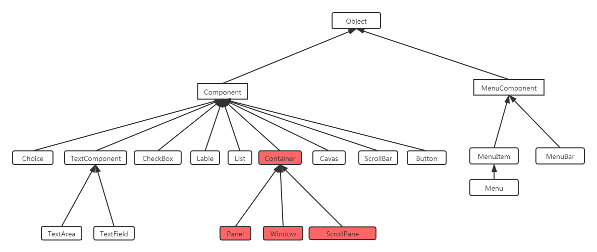
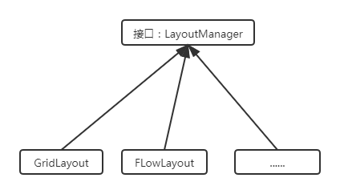
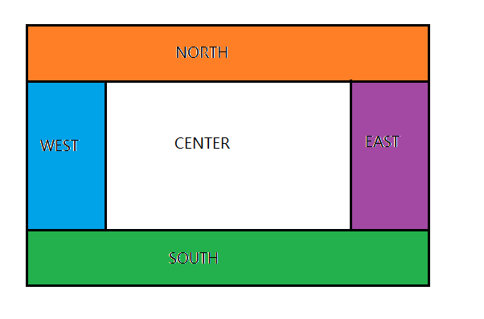
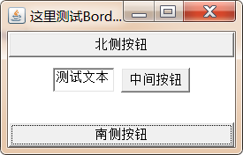
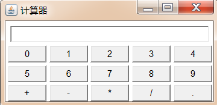
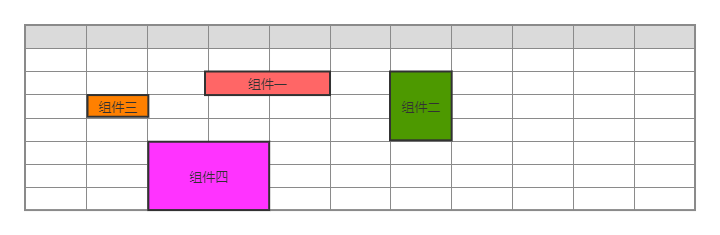
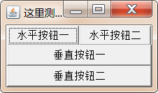

# 一. 课程概述

通常情况下，java语言一般是用来开发后台程序的，所谓的后台程序就是部署在服务器端的程序，默默的工作，用户是看不到任何界面的，所以很多情况下，学习java会感觉很枯燥。


事实上，我们使用java语言同样可以完成图形化界面程序的开发，而学习图形化界面编程相对来说就会有趣很多，因为所见即所得，也就是说，我们写的大部分代码的执行效果，是可以通过图形化界面实实在在能够看得到的。


java使用AWT和Swing相关的类可以完成图形化界面编程，其中AWT的全称是抽象窗口工具集(Abstract Window Toolkit),它是sun公司最早提供的GUI库，这个GUI库提供了一些基本功能，但这个GUI库的功能比较有限，所以后来sun公司又提供了Swing库。通过使用AWT和Swing提供的图形化界面组件库，java的图形化界面编程非常简单，程序只需要依次创建所需的图形组件，并以合适的方式将这些组件组织在一起，就可以开发出非常美观的用户界面。

本次讲解的java开发平台是jdk9，希望大家课后练习时也使用jdk9，因为不同版本的jdk提供的GUI库的效果略有不同。

# 二. AWT 编程

## 2.1 AWT简介

​     当 JDK 1.0发布时， Sun 提供了 一套基本的GUI类库，这个GUI类库希望可以在所有平台下都能运行 ， 这套基本类库被称为"抽象窗口工具集 CAbstract Window Toolkit )"，它为Java应用程序提供了基本的图形组件 。 AWT是窗口框架，它从不同平台的窗口系统中抽取出共同组件 ， 当程序运行时，将这些组件的创建和动作委托给程序所在的运行平台 。 简而言之 ，当使用 AWT 编写图形界面应用 时， 程序仅指定了界面组件的位置和行为，并未提供真正的实现，JVM调用操作系统本地的图形界面来创建和平台 一致的对等体 。

​	使用AWT创建的图形界面应用和所在的运行平台有相同的界面风格 ， 比如在 Windows 操作系统上，它就表现出 Windows 风格 ; 在 UNIX 操作系统上，它就表现出UNIX 风格 。 Sun 希望采用这种方式来实现 " Write Once, Run Anywhere " 的目标 。

## 2.2 AWT继承体系

所有和 AWT 编程相关的类都放在 java.awt 包以及它的子包中， AWT 编程中有两个基类 :Component和 MenuComponent。

- Component：代表一个能以图形化方式显示出来，并可与用户交互的对象，例如 Button 代表一个按钮，TextField 代表 一个文本框等；
- MenuComponent：则代表图形界面的菜单组件，包括 MenuBar (菜单条)、 Menultem (菜单项)等子类。



其中 Container 是一种特殊的 Component，它代表一种容器，可以盛装普通的 Component。

AWT中还有一个非常重要的接口叫LayoutManager ，如果一个容器中有多个组件，那么容器就需要使用LayoutManager来管理这些组件的布局方式。




## 2.3 Container容器

### 2.3.1 Container继承体系


- ​	Winow是可以独立存在的顶级窗口,默认使用BorderLayout管理其内部组件布局;
- ​        Panel可以容纳其他组件，但不能独立存在，它必须内嵌其他容器中使用，默认使用FlowLayout管理其内部组件布局；
- ​        ScrollPane 是 一个带滚动条的容器，它也不能独立存在，默认使用 BorderLayout 管理其内部组件布局；

### 2.3.2 常见API

Component作为基类，提供了如下常用的方法来设置组件的大小、位置、可见性等。

| 方法签名                                       | 方法功能                   |
| ---------------------------------------------- | -------------------------- |
| setLocation(int x, int y)                      | 设置组件的位置。           |
| setSize(int width, int height)                 | 设置组件的大小。           |
| setBounds(int x, int y, int width, int height) | 同时设置组件的位置、大小。 |
| setVisible(Boolean b):                         | 设置该组件的可见性。       |

Container作为容器根类，提供了如下方法来访问容器中的组件

| 方法签名                                | 方法功能                                                     |
| --------------------------------------- | ------------------------------------------------------------ |
| Component add(Component comp)           | 向容器中添加其他组件 (该组件既可以是普通组件，也可以 是容器) ， 并返回被添加的组件 。 |
| Component getComponentAt(int x, int y): | 返回指定点的组件 。                                          |
| int getComponentCount():                | 返回该容器内组件的数量 。                                    |
| Component[] getComponents():            | 返回该容器内的所有组件 。                                    |

### 2.3.3 容器演示

#### 2.3.3.1 Window

​	

```java
import java.awt.*;

public class FrameDemo {

    public static void main(String[] args) {
        //1.创建窗口对象
        Frame frame = new Frame("这是第一个窗口容器");

        //设置窗口的位置和大小
		//不设置大小默认是最小化窗口
        //屏幕左上角为原点,宽的方向x轴,高的方向y轴;默认位置是在左上角(0,0)处
        frame.setBounds(100,100,500,300);

        //设置窗口可见
        frame.setVisible(true);
    }
}
```


#### 2.3.3.2 Panel

​	)

```java
public class PanelDemo {
    public static void main(String[] args) {
        //1.创建Frame容器对象
        Frame frame = new Frame("这里在测试Panel");
        //2.创建Panel容器对象
        Panel panel = new Panel();

        //3.往Panel容器中添加组件
        panel.add(new TextField("这是一个测试文本"));
        panel.add(new Button("这是一个测试按钮"));

        //4.把Panel添加到Frame中
        frame.add(panel);

        //5.设置Frame的位置和大小
        frame.setBounds(30,30,500,300);

        //6.设置Frame可见
        frame.setVisible(true);
    }
}
```

由于IDEA默认使用utf-8进行编码，但是当前我们执行代码是是在windows系统上，而windows操作系统的默认编码是gbk，所以会乱码，如果出现了乱码，那么只需要在运行当前代码前，设置一个jvm参数  `-Dfile.encoding=gbk`即可。

[(122条消息) 解决 IDEA 使用 AWT 组件中文乱码_李晋江的博客-CSDN博客_awt乱码](https://blog.csdn.net/qq_35132089/article/details/126897022)

#### 2.3.3.3 ScrollPane

​	

```java
import java.awt.*;

public class ScrollPaneDemo {

    public static void main(String[] args) {
        //1.创建Frame窗口对象
        Frame frame = new Frame("这里测试ScrollPane");

        //2.创建ScrollPane对象，并且指定默认有滚动条
        ScrollPane scrollPane = new ScrollPane(ScrollPane.SCROLLBARS_ALWAYS);

        //3.往ScrollPane中添加组件
        scrollPane.add(new TextField("这是测试文本"));
        scrollPane.add(new Button("这是测试按钮"));

        //4.把ScrollPane添加到Frame中
        frame.add(scrollPane);

        //5.设置Frame的位置及大小
        frame.setBounds(30,30,500,300);

        //6.设置Frame可见
        frame.setVisible(true);

    }
}
```

程序明明向 ScrollPane 容器中添加了 一个文本框和一个按钮，但只能看到 一个按钮，却看不到文本框 ，这是为什么 呢?这是因为ScrollPane 使用 BorderLayout 布局管理器的缘故，而 BorderLayout 导致了该容器中只有一个组件被显示出来 。 下一节将向详细介绍布局管理器的知识 。

## 2.4 LayoutManager布局管理器

之前，我们介绍了Component中有一个方法 setBounds() 可以设置当前容器的位置和大小，但是我们需要明确一件事，如果我们手动的为组件设置位置和大小的话，就会造成程序的不通用性，例如：

```java
Label label = new Label("你好，世界");
```

创建了一个lable组件，很多情况下，我们需要让lable组件的宽高和“你好，世界”这个字符串自身的宽高一致，这种大小称为**最佳大小**。由于操作系统存在差异，例如在windows上，我们要达到这样的效果，需要把该Lable组件的宽和高分别设置为100px,20px,但是在Linux操作系统上，可能需要把Lable组件的宽和高分别设置为120px，24px，才能达到同样的效果。

如果要让我么的程序在不同的操作系统下，都有相同的使用体验，那么手动设置组件的位置和大小，无疑是一种灾难，因为有太多的组件，需要分别设置不同操作系统下的大小和位置。为了解决这个问题，Java提供了LayoutManager布局管理器，可以根据运行平台来自动调整组件大小，程序员不用再手动设置组件的大小和位置了，只需要为容器选择合适的布局管理器即可。


### 2.4.1 FlowLayout

​        在 FlowLayout 布局管理器 中，组件像水流一样向某方向流动 (排列) ，遇到障碍(边界)就折回，重头开始排列 。在默认情况下， FlowLayout 布局管理器从左向右排列所有组件，遇到边界就会折回下一行重新开始。

| 构造方法                                | 方法功能                                                     |
| --------------------------------------- | ------------------------------------------------------------ |
| FlowLayout()                            | 使用默认 的对齐方式及默认的垂直间距、水平间距创建 FlowLayout 布局管理器。 |
| FlowLayout(int align)                   | 使用指定的对齐方式及默认的垂直间距、水平间距创建 FlowLayout 布局管理器。 |
| FlowLayout(int align,int hgap,int vgap) | 使用指定的对齐方式及指定的垂直问距、水平间距创建FlowLayout 布局管理器。 |

- align

  - FlowLayout 中组件的排列方向(从左向右、从右向左、从中间向两边等) ， 该参数应该使用FlowLayout类的静态常量 : `FlowLayout. LEFT 、 FlowLayout. CENTER 、 FlowLayout. RIGHT` ，默认是左对齐。

- hgap(horizonal_gap)

  - 组件之间以及组件与容器边界之间的水平间隙

- vgap(vertical_gap)

  - 组件之间以及组件与容器边界之间的垂直间隙

  - FlowLayout 中组件中间距通过整数设置，单位是像素，默认是5个像素。

**代码演示：**

​	

```java
import java.awt.*;

public class FlowLayoutDemo {

    public static void main(String[] args) {
        //1.创建Frame对象
        Frame frame = new Frame("这里测试FlowLayout");
        //2.修改Frame容器的布局管理器为FlowLayout
        frame.setLayout(new FlowLayout(FlowLayout.LEFT,20,20));

        //3.往Frame中添加100个button
        for (int i = 0; i < 100; i++) {
            frame.add(new Button("按钮"+i));
        }

        //4.设置Frame为最佳大小
        frame.pack();
        //5.设置Frame可见
        frame.setVisible(true);
    }
}
```

> 默认是Panel和Applet的布局管理器

FlowLayout是Panel 和 Applet 的默认布局管理器。在该布局管理器中，组件在容器中按照从上到下，从左到右的顺序进行排列，行满后则换行。

### 2.4.2 BorderLayout

边框布局,划分区域

BorderLayout 将容器分为 EAST 、 SOUTH 、 WEST 、 NORTH 、 CENTER五个区域，普通组件可以被放置在这 5 个区域的任意一个中 。 BorderLayout布局 管理器的布局示意图如图所示 。



当改变使用 BorderLayout 的容器大小时， <u>NORTH 、 SOUTH 和 CENTER区域水平调整，而 EAST 、 WEST 和 CENTER 区域垂直调整?</u>。

- N,S水平调整时高不变,宽变化;垂直调整时宽高均不变
- W,E水平调整时宽高不变;垂直调整时宽不变,高变化,
- C在水平垂直调整时宽高均会变化

使用BorderLayout 有如下两个注意点:

1. 当向使用 BorderLayout 布局管理器的容器中添加组件时 ， 需要指定要添加到哪个区域中 。 如果没有指定添加到哪个区域中，则默认添加到中间区域中；
2. 如果向同一个区域中添加多个组件时 ， 后放入的组件会覆盖先放入的组件；

| 构造方法                         | 方法功能                                                     |
| -------------------------------- | ------------------------------------------------------------ |
| BorderLayout()                   | 使用默认的水平间距、垂直 间距创建 BorderLayout 布局管理器 。 |
| BorderLayout(int hgap,int vgap): | 使用指定的水平间距、垂直间距创建 BorderLayout 布局管理器。   |

**代码演示1:**

​	

```java
import java.awt.*;

public class BorderLayoutDemo1 {

    public static void main(String[] args) {
        //1.创建Frame对象
        Frame frame = new Frame("这里测试BorderLayout");
        //2.指定Frame对象的布局管理器为BorderLayout
        frame.setLayout(new BorderLayout(30,5));
        //3.往Frame指定东南西北中各添加一个按钮组件
        frame.add(new Button("东侧按钮"), BorderLayout.EAST);
        frame.add(new Button("西侧按钮"), BorderLayout.WEST);
        frame.add(new Button("南侧按钮"), BorderLayout.SOUTH);
        frame.add(new Button("北侧按钮"), BorderLayout.NORTH);
        frame.add(new Button("中间按钮"), BorderLayout.CENTER);
        //4.设置Frame为最佳大小
        frame.pack();
        //5.设置Frame可见
        frame.setVisible(true);
    }
}
```

> 如果不往某个区域中放入组件，那么该区域不会空白出来，而是会被其他区域占用

**代码演示2:**

​	

```java
import java.awt.*;

public class BorderLayoutDemo2 {

    public static void main(String[] args) {
        //1.创建Frame对象
        Frame frame = new Frame("这里测试BorderLayout");
        //2.指定Frame对象的布局管理器为BorderLayout
        frame.setLayout(new BorderLayout(30,5));
        //3.往Frame指定南，北，放入一个按钮，往中间区域放入一个Panel

        frame.add(new Button("南侧按钮"), BorderLayout.SOUTH);
        frame.add(new Button("北侧按钮"), BorderLayout.NORTH);

        Panel panel = new Panel();
        panel.add(new TextField("测试文本"));
        panel.add(new Button("中间按钮"));

        frame.add(panel, BorderLayout.CENTER);
	
        //4.设置Frame为最佳大小
        frame.pack();
        //5.设置Frame可见
        frame.setVisible(true);
    }
}
```

> 默认是Window、Frame和Dialog的布局管理器

BorderLayout是Window、Frame和Dialog的默认布局管理器，其将容器分成North、South、East、West和Center 5个区域，每个区域只能放置一个组件。使用BorderLayout时，如果容器大小发生变换，组件的相对位置不变。

### 2.4.3 GridLayout

网格布局

​        GridLayout 布局管理器将容器分割成纵横线分隔的网格 ， 每个网格所占的区域大小相同。当向使用 GridLayout 布局管理器的容器中添加组件时， 默认从左向右、 从上向下依次添加到每个网格中 。 与 FlowLayout不同的是，放置在 GridLayout 布局管理器中的各组件的大小由组件所处的区域决定(每 个组件将自动占满整个区域) 。    

| 构造方法                                        | 方法功能                                                     |
| ----------------------------------------------- | ------------------------------------------------------------ |
| GridLayout(int rows,int cols)                   | 采用指定的行数、列数，以及默认的横向间距、纵向间距将容器 分割成多个网格 |
| GridLayout(int rows,int cols,int hgap,int vgap) | 采用指定 的行数、列 数 ，以及指定的横向间距 、 纵向间距将容器分割成多个网格。 |

**案例：**

​	使用Frame+Panel，配合FlowLayout和GridLayout完成一个计算器效果。

​	


**代码：**

```java
import java.awt.*;

public class GridLayoutDemo{

    public static void main(String[] args) {

        //1.创建Frame对象，并且标题设置为计算器
        Frame frame = new Frame("计算器");

        //2.创建一个Panel对象，并且往Panel中放置一个TextField组件
        Panel p1 = new Panel();
        p1.add(new TextField(30));

        //3.把上述的Panel放入到Frame的北侧区域
        frame.add(p1,BorderLayout.NORTH);

        //4.创建一个Panel对象，并且设置其布局管理器为GridLayout
        Panel p2 = new Panel();
        p2.setLayout(new GridLayout(3,5,4,4));

        //5.往上述Panel中，放置15个按钮，内容依次是：0,1,2,3,4,5,6，7,8,9，+，-，*，/,.
        for (int i = 0; i < 10; i++) {
            p2.add(new Button(i+""));
        }
        p2.add(new Button("+"));
        p2.add(new Button("-"));
        p2.add(new Button("*"));
        p2.add(new Button("/"));
        p2.add(new Button("."));

        //6.把上述Panel添加到Frame的中间区域中
        frame.add(p2);//默认加入中间区域.相当于frame.add(p2,BorderLayout.CENTER)
        //7.设置Frame为最佳大小
        frame.pack();

        //8.设置Frame可见
        frame.setVisible(true);

    }
}
```

### 2.4.4 GridBagLayout

网格袋布局;网格包布局;栅格包控制;网格箱布局管理器

GridBagLayout 布局管理器的功能最强大 ， 但也最复杂，与 GridLayout 布局管理器不同的是， 在GridBagLayout 布局管理器中，一个组件可以跨越一个或多个网格 ， 并可以设置各网格的大小互不相同，从而增加了布局的灵活性 。 当窗口的大小发生变化时 ， GridBagLayout 布局管理器也可以准确地控制窗口各部分的拉伸 。



由于在GridBagLayout 布局中，每个组件可以占用多个网格，此时，我们往容器中添加组件的时候，就需要具体的控制每个组件占用多少个网格，java提供的GridBagConstaints类，与特定的组件绑定，可以完成具体大小和跨越性的设置。

**GridBagConstraints API:**网格袋约束

| 成员变量   | 含义                                                         |
| ---------- | ------------------------------------------------------------ |
| gridx      | 设置受该对象控制的GUI组件左上角所在网格的横向索引            |
| gridy      | 设置受该对象控制的GUI组件左上角所在网格的纵向索引            |
| gridwidth  | 设置受该对象控制的 GUI 组件横向跨越多少个网格,如果属性值为 GridBagContraints.REMAIND,则表明当前组件是横向最后一个组件，如果属性值为GridBagConstraints.RELATIVE,表明当前组件是横向倒数第二个组件。 |
| gridheight | 设置受该对象控制的 GUI 组件纵向跨越多少个网格，如果属性值为 GridBagContraints.REMAIND,则表明当前组件是纵向最后一个组件，如果属性值为GridBagConstraints.RELATIVE,表明当前组件是纵向倒数第二个组件。 |
| fill       | 当"显示区域"大于"组件"的时候,如何调整组件 ：<br/> GridBagConstraints.NONE : GUI 组件不扩大<br/> GridBagConstraints.HORIZONTAL: GUI 组件水平扩大 以 占据空白区域<br/> GridBagConstraints.VERTICAL: GUI 组件垂直扩大以占据空白区域<br/> GridBagConstraints.BOTH: GUI 组件水平 、 垂直同时扩大以占据空白区域. |
| ipadx      | 设置受该对象控制的 GUI 组件横向内部填充的大小，即 在该组件最小尺寸的基础上还需要增大多少. |
| ipady      | 设置受该对象控制的 GUI 组件纵向内部填充的大小，即 在该组件最小尺寸的基础上还需要增大多少. |
| insets     | 设置受该对象控制 的 GUI 组件的 外部填充的大小 ， 即该组件边界和显示区 域边界之间的 距离 . |
| weightx    | 设置受该对象控制 的 GUI 组件占据多余空间的水平比例， 假设某个容器 的水平线上包括三个 GUI 组件， 它们的水平增加比例分别是 1 、 2 、 3 ， 但容器宽度增加 60 像素 时，则第一个组件宽度增加 10 像素 ， 第二个组件宽度增加 20 像素，第三个组件宽度增加 30 像 素。 如 果其增 加比例为 0 ， 则 表示不会增加 。 |
| weighty    | 设置受该对象控制 的 GUI 组件占据多余空间的垂直比例           |
| anchor     | 设置受该对象控制 的 GUI 组件在其显示区域中的定位方式:<br/>GridBagConstraints .CENTER (中 间 )<br/>GridBagConstraints.NORTH (上中 ) <br/>GridBagConstraints.NORTHWEST (左上角)<br/>GridBagConstraints.NORTHEAST (右上角)<br/>GridBagConstraints.SOUTH (下中) <br/>GridBagConstraints.SOUTHEAST (右下角)<br/>GridBagConstraints.SOUTHWEST (左下角)<br/>GridBagConstraints.EAST (右中) <br/>GridBagConstraints.WEST (左中) |


**GridBagLayout使用步骤：**

```
1.创建GridBagLaout布局管理器对象，并给容器设置该布局管理器对象；

2.创建GridBagConstraints对象，并设置该对象的控制属性：

	gridx: 用于指定组件在网格中所处的横向索引；

	gridy: 用于执行组件在网格中所处的纵向索引；

	gridwidth: 用于指定组件横向跨越多少个网格；

	gridheight: 用于指定组件纵向跨越多少个网格；

3.调用GridBagLayout对象的setConstraints(Component c,GridBagConstraints gbc )方法，把即将要添加到容器中的组件c和GridBagConstraints对象关联起来；

4. 把组件添加到容器中；
```

**案例：**

​	使用Frame容器，设置GridBagLayout布局管理器，实现下图中的效果：

​	

**演示代码：**

```java
import java.awt.*;

public class GridBagLayoutDemo {

    public static void main(String[] args) {
        //1.创建Frame对象
        Frame frame = new Frame("这里是GridBagLayout测试");

        //2.创建GridBagLayout对象
        GridBagLayout gbl = new GridBagLayout();

        //3.把Frame对象的布局管理器设置为GridBagLayout
        frame.setLayout(gbl);

        //4.创建GridBagConstraints对象
        GridBagConstraints gbc = new GridBagConstraints();

        //5.创建容量为10的Button数组
        Button[] bs = new Button[10];

        //6.遍历数组，初始化每一个Button
        for (int i = 0; i < bs.length; i++) {
            bs[i] = new Button("按钮"+(i+1));
        }

        //7.设置所有的GridBagConstraints对象的fill属性为GridBagConstraints.BOTH,当有空白区域时，组件自动扩大占满空白区域
        gbc.fill=GridBagConstraints.BOTH;

        //8.设置GridBagConstraints对象的weightx设置为1,表示横向扩展比例为1
        gbc.weightx=1;//gbc属性[fill=GridBagConstraints.BOTH]

        //9.往frame中添加数组中的前3个Button
        addComponent(frame,bs[0],gbl,gbc);
        addComponent(frame,bs[1],gbl,gbc);
        addComponent(frame,bs[2],gbl,gbc);

        //10.把GridBagConstraints的gridwidth设置为GridBagConstraints.REMAINDER,则表明当前组件是横向最后一个组件
        gbc.gridwidth=GridBagConstraints.REMAINDER;//[fill=GridBagConstraints.BOTH,weightx=1]

        //11.把button数组中第四个按钮添加到frame中
        addComponent(frame,bs[3],gbl,gbc);


        //12.把GridBagConstraints的weighty设置为1，表示纵向扩展比例为1
        gbc.weighty=1;//[fill=GridBagConstraints.BOTH,weightx=1,gridwidth=GridBagConstraints.REMAINDER]
		
        //13.把button数组中第5个按钮添加到frame中
        addComponent(frame,bs[4],gbl,gbc);

        //14.把GridBagConstaints的gridheight和gridwidth设置为2，表示纵向和横向会占用两个网格
        gbc.gridheight=2;
        gbc.gridwidth=2;
        //[fill=GridBagConstraints.BOTH,weightx=1,weighty=1,gridwidth=2,gridheight=2]

        //15.把button数组中第6个按钮添加到frame中
        addComponent(frame,bs[5],gbl,gbc);

        //16.把GridBagConstaints的gridheight和gridwidth设置为1，表示纵向会占用1个网格
        gbc.gridwidth=1;
        gbc.gridheight=1;
        //[fill=GridBagConstraints.BOTH,weightx=1,weighty=1,gridwidth=1,gridheight=1]
        //17.把button数组中第7个按钮添加到frame中
        addComponent(frame,bs[6],gbl,gbc);

        //18.把GridBagConstraints的gridwidth设置为GridBagConstraints.REMAINDER,则表明当前组件是横向最后一个组件
        gbc.gridwidth=GridBagConstraints.REMAINDER;
		/*[fill=GridBagConstraints.BOTH,weightx=1,weighty=1,gridwidth=GridBagConstraints.REMAINDER,gridheight=1]
		*/
        //19.把button数组中第8个按钮添加到frame中
        addComponent(frame,bs[7],gbl,gbc);

        //20.把GridBagConstaints的gridwidth设置为1，表示纵向会占用1个网格
        gbc.gridwidth=1;
		//[fill=GridBagConstraints.BOTH,weightx=1,weighty=1,gridwidth=1,gridheight=1]
        //21.把button数组中第9、10个按钮添加到frame中
        addComponent(frame,bs[8],gbl,gbc);
        addComponent(frame,bs[9],gbl,gbc);

        //22.设置frame为最佳大小
        frame.pack();

        //23.设置frame可见
        frame.setVisible(true);
    }

    public static void addComponent(Container container,Component c,GridBagLayout gridBagLayout,GridBagConstraints gridBagConstraints){
        gridBagLayout.setConstraints(c,gridBagConstraints);
        container.add(c);
    }
}
```

> 虽然强大,但是在之后的Swing中有更好的容器用于实现这个功能

### 2.4.5 CardLayout

CardLayout 布局管理器以时间而非空间来管理它里面的组件，它将加入容器的所有组件看成一叠卡片（每个卡片其实就是一个组件），每次只有最上面的那个 Component 才可见。就好像一副扑克牌，它们叠在一起，每次只有最上面的一张扑克牌才可见.

| 方法名称                          | 方法功能                                                     |
| --------------------------------- | ------------------------------------------------------------ |
| CardLayout()                      | 创建默认的 CardLayout 布局管理器。                           |
| CardLayout(int hgap,int vgap)     | 通过指定卡片与容器左右边界的间距 C hgap) 、上下边界 Cvgap) 的间距来创建 CardLayout 布局管理器. |
| first(Container target)           | 显示target 容器中的第一张卡片.                               |
| last(Container target)            | 显示target 容器中的最后一张卡片.                             |
| previous(Container target)        | 显示target 容器中的前一张卡片.                               |
| next(Container target)            | 显示target 容器中的后一张卡片.                               |
| show(Container taget,String name) | 显 示 target 容器中指定名字的卡片.                           |

**案例：**

​	使用Frame和Panel以及CardLayout完成下图中的效果，点击底部的按钮，切换卡片

​	

​	

**演示代码：**

```java
import java.awt.*;
import java.awt.event.ActionEvent;
import java.awt.event.ActionListener;

public class CardLayoutDemo {

    public static void main(String[] args) {
        //1.创建Frame对象
        Frame frame = new Frame("这里测试CardLayout");

        //2.创建一个String数组，存储不同卡片的名字
        String[] names = {"第一张","第二张","第三张","第四张","第五张"};

        //3.创建一个Panel容器p1，并设置其布局管理器为CardLayout,用来存放多张卡片
        CardLayout cardLayout = new CardLayout();
        Panel p1 = new Panel();
        p1.setLayout(cardLayout);

        //4.往p1中存储5个Button按钮，名字从String数组中取
        for (int i = 0; i < 5; i++) {
            p1.add(names[i],new Button(names[i]));
        }

        //5.创建一个Panel容器p2,用来存储5个按钮，完成卡片的切换
        Panel p2 = new Panel();

        //6.创建5个按钮，并给按钮设置监听器
        ActionListener listener = new ActionListener() {
            @Override
            public void actionPerformed(ActionEvent e) {
                String command = e.getActionCommand();
                switch (command){
                    case "上一张":
                        cardLayout.previous(p1);
                        break;
                    case "下一张":
                        cardLayout.next(p1);
                        break;
                    case "第一张":
                        cardLayout.first(p1);
                        break;
                    case "最后一张":
                        cardLayout.last(p1);
                        break;
                    case "第三张":
                        cardLayout.show(p1,"第三张");
                        break;
                }
            }
        };

        Button b1 = new Button("上一张");
        Button b2 = new Button("下一张");
        Button b3 = new Button("第一张");
        Button b4 = new Button("最后一张");
        Button b5 = new Button("第三张");
        b1.addActionListener(listener);
        b2.addActionListener(listener);
        b3.addActionListener(listener);
        b4.addActionListener(listener);
        b5.addActionListener(listener);

        //7.把5个按钮添加到p2中
        p2.add(b1);
        p2.add(b2);
        p2.add(b3);
        p2.add(b4);
        p2.add(b5);


        //8.把p1添加到frame的中间区域
        frame.add(p1);


        //9.把p2添加到frame的底部区域
        frame.add(p2,BorderLayout.SOUTH);

        //10设置frame最佳大小并可见
        frame.pack();
        frame.setVisible(true);
    }
}
```

### 2.4.6 BoxLayout

为了简化开发，Swing 引入了 一个新的布局管理器 : BoxLayout 。 BoxLayout 可以在垂直和 水平两个方向上摆放 GUI 组件， BoxLayout 提供了如下一个简单的构造器:

| 方法名称                              | 方法功能                                                     |
| ------------------------------------- | ------------------------------------------------------------ |
| BoxLayout(Container target, int axis) | 指定创建基于 target 容器的 BoxLayout 布局管理器，该布局管理器里的组件按 axis 方向排列。其中 axis 有 BoxLayout.X_AXIS( 横向)和 BoxLayout.Y _AXIS (纵向〉两个方向。 |

**案例1：**

​	使用Frame和BoxLayout完成下图效果：


**演示代码1：**

```java
import javax.swing.*;
import java.awt.*;

public class BoxLayoutDemo1 {

    public static void main(String[] args) {

        //1.创建Frame对象
        Frame frame = new Frame("这里测试BoxLayout");
        //2.创建BoxLayout布局管理器，并指定容器为上面的frame对象，指定组件排列方向为纵向
        BoxLayout boxLayout = new BoxLayout(frame, BoxLayout.Y_AXIS);
        frame.setLayout(boxLayout);

        //3.往frame对象中添加两个按钮
        frame.add(new Button("按钮1"));
        frame.add(new Button("按钮2"));


        //4.设置frame最佳大小，并可见
        frame.pack();
        frame.setVisible(true);
    }
}
```


在java.swing包中，提供了一个新的容器Box，该容器的默认布局管理器就是BoxLayout,大多数情况下，使用Box容器去容纳多个GUI组件，然后再把Box容器作为一个组件，添加到其他的容器中，从而形成整体窗口布局。

| 方法名称                         | 方法功能                           |
| -------------------------------- | ---------------------------------- |
| static Box createHorizontalBox() | 创建一个水平排列组件的 Box 容器 。 |
| static Box createVerticalBox()   | 创建一个垂直排列组件的 Box 容器 。 |

**案例2：**

​	使用Frame和Box，完成下图效果：

​	

**演示代码2：**

```java
import javax.swing.*;
import java.awt.*;

public class BoxLayoutDemo2 {

    public static void main(String[] args) {

        //1.创建Frame对象
        Frame frame = new Frame("这里测试BoxLayout");

        //2.创建一个横向的Box,并添加两个按钮
        Box hBox = Box.createHorizontalBox();
        hBox.add(new Button("水平按钮一"));
        hBox.add(new Button("水平按钮二"));

        //3.创建一个纵向的Box，并添加两个按钮
        Box vBox = Box.createVerticalBox();
        vBox.add(new Button("垂直按钮一"));
        vBox.add(new Button("垂直按钮二"));

        //4.把box容器添加到frame容器中
        frame.add(hBox,BorderLayout.NORTH);
        frame.add(vBox);


        //5.设置frame最佳大小并可见

        frame.pack();
        frame.setVisible(true);

    }
}
```

通过之前的两个BoxLayout演示，我们会发现，被它管理的容器中的组件之间是没有间隔的，不是特别的美观，但之前学习的几种布局，组件之间都会有一些间距，那使用BoxLayout如何给组件设置间距呢？

其实很简单，我们只需要在原有的组件需要间隔的地方，添加间隔即可，而每个间隔可以是一个组件，只不过该组件没有内容，仅仅起到一种分隔的作用。


Box类中，提供了5个方便的静态方法来生成这些间隔组件：

- glue:胶水,可以开合

- strut:用于指定宽度

| 方法名称                                          | 方法功能                                                     |
| ------------------------------------------------- | ------------------------------------------------------------ |
| static Component createHorizontalGlue()           | 创建一条水平 Glue (可在两个方向上同时拉伸的间距)             |
| static Component createVerticalGlue()             | 创建一条垂直 Glue (可在两个方向上同时拉伸的间距）            |
| static Component createHorizontalStrut(int width) | 创建一条指定宽度(宽度固定了，不能拉伸)的水平Strut (可在垂直方向上拉伸的间距) |
| static Component createVerticalStrut(int height)  | 创建一条指定高度(高度固定了，不能拉伸)的垂直Strut (可在水平方向上拉伸的间距) |

**案例3：**

使用Frame和Box，完成下图效果：


**演示代码3：**

```java
import javax.swing.*;
import java.awt.*;

public class BoxLayoutDemo3 {

    public static void main(String[] args) {
        //1.创建Frame对象
        Frame frame = new Frame("这里测试BoxLayout");

        //2.创建一个横向的Box,并添加两个按钮
        Box hBox = Box.createHorizontalBox();
        hBox.add(new Button("水平按钮一"));
        hBox.add(Box.createHorizontalGlue());//两个方向都可以拉伸的间隔
        hBox.add(new Button("水平按钮二"));
        hBox.add(Box.createHorizontalStrut(10));//水平间隔固定，垂直间方向可以拉伸
        hBox.add(new Button("水平按钮3"));


        //3.创建一个纵向的Box，并添加两个按钮
        Box vBox = Box.createVerticalBox();
        vBox.add(new Button("垂直按钮一"));
        vBox.add(Box.createVerticalGlue());//两个方向都可以拉伸的间隔
        vBox.add(new Button("垂直按钮二"));
        vBox.add(Box.createVerticalStrut(10));//垂直间隔固定，水平方向可以拉伸
        vBox.add(new Button("垂直按钮三"));


        //4.把box容器添加到frame容器中
        frame.add(hBox, BorderLayout.NORTH);
        frame.add(vBox);


        //5.设置frame最佳大小并可见

        frame.pack();
        frame.setVisible(true);
    }
}
```

## 2.5 AWT中常用组件

### 2.5.1 基本组件

| 组件名        | 功能                                                         |
| ------------- | ------------------------------------------------------------ |
| Button        | Button                                                       |
| Canvas        | 用于绘图的画布                                               |
| Checkbox      | 复选框组件（也可当做单选框组件使用）                         |
| CheckboxGroup | 用于将多个Checkbox 组件组合成一组， 一组 Checkbox 组件将只有一个可以 被选中 ， 即全部变成单选框组件 |
| Choice        | 下拉选择框                                                   |
| Frame         | 窗口 ， 在 GUI 程序里通过该类创建窗口                        |
| Label         | 标签类，用于放置提示性文本                                   |
| List          | JU表框组件，可以添加多项条目                                 |
| Panel         | 不能单独存在基本容器类，必须放到其他容器中                   |
| Scrollbar     | 滑动条组件。如果需要用户输入位于某个范围的值 ， 就可以使用滑动条组件 ，比如调 色板中设置 RGB 的三个值所用的滑动条。当创建一个滑动条时，必须指定它的方向、初始值、 滑块的大小、最小值和最大值。 |
| ScrollPane    | 带水平及垂直滚动条的容器组件                                 |
| TextArea      | 多行文本域                                                   |
| TextField     | 单行文本框                                                   |

这些 AWT 组件的用法比较简单，可以查阅 API 文档来获取它们各自的构方法、成员方法等详细信息。

**案例：** 

​	实现下图效果：

​	

**演示代码：**

```java
import javax.swing.*;
import java.awt.*;

public class BasicComponentDemo {
    Frame frame = new Frame("这里测试基本组件");

    //定义一个按钮
    Button ok = new Button("确认");

    //定义一个复选框组
    CheckboxGroup cbg = new CheckboxGroup();
    //定义一个单选框，初始处于被选中状态,并添加到cbg组中
    Checkbox male = new Checkbox("男", cbg, true);

    //定义一个单选框，初始处于未被选中状态,并添加到cbg组中
    Checkbox female = new Checkbox("女", cbg, false);

    //定义一个复选框，初始处于未被选中状态
    Checkbox married = new Checkbox("是否已婚？", false);

    //定义一个下拉选择框
    Choice colorChooser = new Choice();

    //定义一个列表选择框
    List colorList = new List(6, true);

    //定义一个5行，20列的多行文本域
    TextArea ta = new TextArea(5, 20);

    //定义一个50列的单行文本域
    TextField tf = new TextField(50);

    public void init() {
        //往下拉选择框中添加内容
        colorChooser.add("红色");
        colorChooser.add("绿色");
        colorChooser.add("蓝色");

        //往列表选择框中添加内容
        colorList.add("红色");
        colorList.add("绿色");
        colorList.add("蓝色");

        //创建一个装载按钮和文本框的Panel容器
        Panel bottom = new Panel();
        bottom.add(tf);
        bottom.add(ok);

        //把bottom添加到Frame的底部
        frame.add(bottom,BorderLayout.SOUTH);

        //创建一个Panel容器，装载下拉选择框，单选框和复选框
        Panel checkPanel = new Panel();
        checkPanel.add(colorChooser);
        checkPanel.add(male);
        checkPanel.add(female);
        checkPanel.add(married);

        //创建一个垂直排列的Box容器，装载 多行文本域和checkPanel
        Box topLeft = Box.createVerticalBox();
        topLeft.add(ta);
        topLeft.add(checkPanel);

        //创建一个水平排列的Box容器，装载topLeft和列表选择框
        Box top = Box.createHorizontalBox();
        top.add(topLeft);
        top.add(colorList);

        //将top添加到frame的中间区域
        frame.add(top);


        //设置frame最佳大小并可见
        frame.pack();
        frame.setVisible(true);
    }

    public static void main(String[] args) {

        new BasicComponentDemo().init();

    }
}

```

### 2.5.2 对话框Dialog

#### 2.5.2.1 Dialog

Dialog 是 Window 类的子类，是 一个容器类，属于特殊组件 。 对话框是可以独立存在的顶级窗口， 因此用法与普通窗口的用法几乎完全一样，但是使用对话框需要注意下面两点：

- 对话框通常依赖于其他窗口，就是通常需要有一个父窗口；
- 对话框有非模式(non-modal)和模式(modal)两种，当某个模式对话框被打开后，该模式对话框总是位于它的父窗口之上，在模式对话框被关闭之前，父窗口无法获得焦点。

| 方法名称                                         | 方法功能                                                     |
| ------------------------------------------------ | ------------------------------------------------------------ |
| Dialog(Frame owner, String title, boolean modal) | 创建一个对话框对象：<br/>owner:当前对话框的父窗口<br/>title:当前对话框的标题<br/>modal：当前对话框是否是模式对话框，true/false |

**案例1：**

​	通过Frame、Button、Dialog实现下图效果:

​	


**演示代码1：**

```java
import java.awt.event.ActionEvent;
import java.awt.event.ActionListener;

public class DialogDemo1 {

    public static void main(String[] args) {

        Frame frame = new Frame("这里测试Dialog");

        Dialog d1 = new Dialog(frame, "模式对话框", true);
        Dialog d2 = new Dialog(frame, "非模式对话框", false);

        Button b1 = new Button("打开模式对话框");
        Button b2 = new Button("打开非模式对话框");

        //设置对话框的大小和位置
        d1.setBounds(20,30,300,400);
        d2.setBounds(20,30,300,400);

        //给b1和b2绑定监听事件
        b1.addActionListener(new ActionListener() {
            @Override
            public void actionPerformed(ActionEvent e) {
                d1.setVisible(true);
            }
        });
        b2.addActionListener(new ActionListener() {
            @Override
            public void actionPerformed(ActionEvent e) {
                d2.setVisible(true);
            }
        });

        //把按钮添加到frame中
        frame.add(b1);
        frame.add(b2,BorderLayout.SOUTH);

        //设置frame最佳大小并可见
        frame.pack();
        frame.setVisible(true);

    }
}
```

在Dialog对话框中，可以根据需求，自定义内容

**案例：**

​	点击按钮，弹出一个模式对话框，其内容如下:

​	

**演示代码：**

```java
public class DialogDemo2 {

    public static void main(String[] args) {

        Frame frame = new Frame("这里测试Dialog");

        Dialog d1 = new Dialog(frame, "模式对话框", true);

        //往对话框中添加内容
        Box vBox = Box.createVerticalBox();

        vBox.add(new TextField(15));
        vBox.add(new JButton("确认"));
        d1.add(vBox);

        Button b1 = new Button("打开模式对话框");

        //设置对话框的大小和位置
        d1.setBounds(20,30,200,100);


        //给b1绑定监听事件
        b1.addActionListener(new ActionListener() {
            @Override
            public void actionPerformed(ActionEvent e) {
                d1.setVisible(true);
            }
        });


        //把按钮添加到frame中
        frame.add(b1);

        //设置frame最佳大小并可见
        frame.pack();
        frame.setVisible(true);

    }
}
```


#### 2.5.2.1 FileDialog

Dialog 类还有 一个子类 : FileDialog ，它代表一个文件对话框，用于打开或者保存 文件,需要注意的是FileDialog无法指定模态或者非模态，这是因为 FileDialog 依赖于运行平台的实现，如果运行平台的文件对话框是模态的，那么 FileDialog 也是模态的;否则就是非模态的 。

| 方法名称                                         | 方法功能                                                     |
| ------------------------------------------------ | ------------------------------------------------------------ |
| FileDialog(Frame parent, String title, int mode) | 创建一个文件对话框：<br/>parent:指定父窗口<br/>title:对话框标题<br/>mode:文件对话框类型，如果指定为FileDialog.load，用于打开文件，如果指定为FileDialog.SAVE,用于保存文件 |
| String getDirectory()                            | 获取被打开或保存文件的绝对路径                               |
| String getFile()                                 | 获取被打开或保存文件的文件名                                 |

**案例2：**

​	使用 Frame、Button和FileDialog完成下图效果：

​	


**演示代码2：**

```java
import java.awt.*;
import java.awt.event.ActionEvent;
import java.awt.event.ActionListener;

public class FileDialogTest {

    public static void main(String[] args) {

        Frame frame = new Frame("这里测试FileDialog");

        FileDialog d1 = new FileDialog(frame, "选择需要加载的文件", FileDialog.LOAD);
        FileDialog d2 = new FileDialog(frame, "选择需要保存的文件", FileDialog.SAVE);

        Button b1 = new Button("打开文件");
        Button b2 = new Button("保存文件");

        //给按钮添加事件
        b1.addActionListener(new ActionListener() {
            @Override
            public void actionPerformed(ActionEvent e) {
                d1.setVisible(true);
                //打印用户选择的文件路径和名称
                System.out.println("用户选择的文件路径:"+d1.getDirectory());
                System.out.println("用户选择的文件名称:"+d1.getFile());
            }
        });

        System.out.println("-------------------------------");
        b2.addActionListener(new ActionListener() {
            @Override
            public void actionPerformed(ActionEvent e) {
                d2.setVisible(true);
                //打印用户选择的文件路径和名称
                System.out.println("用户选择的文件路径:"+d2.getDirectory());
                System.out.println("用户选择的文件名称:"+d2.getFile());
            }
        });

        //添加按钮到frame中

        frame.add(b1);
        frame.add(b2,BorderLayout.SOUTH);

        //设置frame最佳大小并可见
        frame.pack();
        frame.setVisible(true);
    }
}
```

## 2.6 事件处理

前面介绍了如何放置各种组件，从而得到了丰富多彩的图形界面，但这些界面还不能响应用户的任何操作。比如单击前面所有窗口右上角的“X”按钮，但窗口依然不会关闭。因为在 AWT 编程中 ，所有用户的操作，都必须都需要经过一套事件处理机制来完成，而 Frame 和组件本身并没有事件处理能力 。

### 2.6.1 GUI事件处理机制

**定义：**

​	当在某个组件上发生某些操作的时候，会自动的触发一段代码的执行。

在GUI事件处理机制中涉及到4个重要的概念需要理解：

**事件源(Event Source)**：操作发生的场所，通常指某个组件，例如按钮、窗口等；
**事件（Event）**：在事件源上发生的操作可以叫做事件，GUI会把事件都封装到一个Event对象中，如果需要知道该事件的详细信息，就可以通过Event对象来获取。
**事件监听器(Event Listener)**:当在某个事件源上发生了某个事件，事件监听器就可以对这个事件进行处理。

**注册监听**：把某个事件监听器(A)通过某个事件(B)绑定到某个事件源(C)上，当在事件源C上发生了事件B之后，那么事件监听器A的代码就会自动执行。


**使用步骤：**

1.创建事件源组件对象；

2.自定义类，实现XxxListener接口，重写方法；

3.创建事件监听器对象(自定义类对象)

4.调用事件源组件对象的addXxxListener方法完成注册监听

**案例：**

​	完成下图效果，点击确定按钮，在单行文本域内显示 hello world:

​	

​	

**演示代码：**

```java
public class EventDemo1 {
    Frame  frame = new Frame("这里测试事件处理");

    //事件源
    Button button = new Button("确定");

    TextField tf = new TextField(30);
    public void init(){
        //注册监听
        button.addActionListener(new MyActionListener());

        //添加组件到frame中
        frame.add(tf);
        frame.add(button,BorderLayout.SOUTH);

        //设置frame最佳大小并可见
        frame.pack();
        frame.setVisible(true);
    }

    //自定义事件监听器类
    private  class MyActionListener implements ActionListener{

        @Override
        public void actionPerformed(ActionEvent e) {

            System.out.println("用户点击了确定按钮");
            tf.setText("hello world");
        }
    }
    
    public static void main(String[] args) {
        new EventDemo1().init();
    }
}
```

### 2.6.2 GUI中常见事件和事件监听器

事件监听器必须实现事件监听器接口， AWT 提供了大量的事件监听器接口用于实现不同类型的事件监听器，用于监听不同类型的事件 。 AWT 中提供了丰富的事件类，用于封装不同组件上所发生的特定操作， AWT 的事件类都是 AWTEvent 类的子类 ， AWTEvent是 EventObject 的子类。

#### 2.6.2.1 事件

AWT把事件分为了两大类：

​	1.低级事件：这类事件是基于某个特定动作的事件。比如进入、点击、拖放等动作的鼠标事件，再比如得到焦点和失去焦点等焦点事件。

| 事件           | 触发时机                                                     |
| -------------- | ------------------------------------------------------------ |
| ComponentEvent | 组件事件 ， 当 组件尺寸发生变化、位置发生移动、显示/隐藏状态发生改变时触发该事件。 |
| ContainerEvent | 容器事件 ， 当容器里发生添加组件、删除组件时触发该事件 。    |
| WindowEvent    | 窗口事件， 当窗 口状态发生改变 ( 如打开、关闭、最大化、最 小化)时触发该事件 。 |
| FocusEvent     | 焦点事件 ， 当组件得到焦点或失去焦点 时触发该事件 。         |
| KeyEvent       | 键盘事件 ， 当按键被按下、松开、单击时触发该事件。           |
| MouseEvent     | 鼠标事件，当进行单击、按下、松开、移动鼠标等动作 时触发该事件。 |
| PaintEvent     | 组件绘制事件 ， 该事件是一个特殊的事件类型 ， 当 GUI 组件调 用 update/paint 方法 来呈现自身时触发该事件，该事件并非专用于事件处理模型 。 |

​	2.高级事件：这类事件并不会基于某个特定动作，而是根据功能含义定义的事件。

| 事件           | 触发时机                                                     |
| -------------- | ------------------------------------------------------------ |
| ActionEvent    | 动作事件 ，当按钮、菜单项被单击，在 TextField 中按 Enter 键时触发 |
| AjustmentEvent | 调节事件，在滑动条上移动滑块以调节数值时触发该事件。         |
| ltemEvent      | 选项事件，当用户选中某项， 或取消选中某项时触发该事件 。     |
| TextEvent      | 文本事件， 当文本框、文本域里的文本发生改变时触发该事件。    |

#### 2.6.2 事件监听器

不同的事件需要使用不同的监听器监听，不同的监听器需要实现不同的监听器接口， 当指定事件发生后 ， 事件监听器就会调用所包含的事件处理器(实例方法)来处理事件 。

| 事件类别        | 描述信息                 | 监听器接口名        |
| --------------- | ------------------------ | ------------------- |
| ActionEvent     | 激活组件                 | ActionListener      |
| ItemEvent       | 选择了某些项目           | ItemListener        |
| MouseEvent      | 鼠标移动                 | MouseMotionListener |
| MouseEvent      | 鼠标点击等               | MouseListener       |
| KeyEvent        | 键盘输入                 | KeyListener         |
| FocusEvent      | 组件收到或失去焦点       | FocusListener       |
| AdjustmentEvent | 移动了滚动条等组件       | AdjustmentListener  |
| ComponentEvent  | 对象移动缩放显示隐藏等   | ComponentListener   |
| **WindowEvent** | **窗口收到窗口级事件**   | **WindowListener**  |
| ContainerEvent  | 容器中增加删除了组件     | ContainerListener   |
| TextEvent       | 文本字段或文本区发生改变 | TextListener        |

### 2.6.3 案例

**案例一：**

​	通过ContainerListener监听Frame容器添加组件；

​	通过TextListener监听TextFiled内容变化；

​	通过ItemListener监听Choice条目选中状态变化；

​	

**演示代码一:**

```java
import java.awt.*;
import java.awt.event.ContainerAdapter;
import java.awt.event.ContainerEvent;
import java.awt.event.TextEvent;
import java.awt.event.TextListener;

public class ListenerDemo1 {

    public static void main(String[] args) {
        Frame frame = new Frame("这里测试监听器");

        //创建一个单行文本域
        TextField tf = new TextField(30);

        //给文本域添加TextListener，监听内容的变化
        tf.addTextListener(new TextListener() {
            @Override
            public void textValueChanged(TextEvent e) {
                System.out.println("当前内容："+tf.getText());;
            }
        });


        //给frame注册ContainerListener监听器，监听容器中组件的添加
        frame.addContainerListener(new ContainerAdapter() {
            @Override
            public void componentAdded(ContainerEvent e) {
                Component child = e.getChild();
                System.out.println("容器中添加了新组件："+child);
            }
        });


        //添加tf到frame
        frame.add(tf);

        //设置frame最佳大小并可见
        frame.pack();
        frame.setVisible(true);
    }
}
```


**案例2：**

​	给Frame设置WindowListner，监听用户点击 X 的动作，如果用户点击X，则关闭当前窗口


**演示代码2：**

```java
import java.awt.*;
import java.awt.event.WindowAdapter;
import java.awt.event.WindowEvent;

public class ListenerDemo2 {

    public static void main(String[] args) {

        Frame frame = new Frame("这里测试WindowListener");


        frame.addWindowListener(new WindowAdapter() {
            //适配器模式,空实现WindowListener,此时可以选择自己需要重写的办法
            //如果选择windowListener,需要实现一堆方法
            @Override
            public void windowClosing(WindowEvent e) {//在窗口关闭时
                //退出JVM
                System.exit(0);
            }
        });

        frame.setBounds(200,200,500,300);

        frame.setVisible(true);
    }
}
```

## 2.7 菜单组件

​	前面讲解了如果构建GUI界面，其实就是把一些GUI的组件，按照一定的布局放入到容器中展示就可以了。在实际开发中，除了主界面，还有一类比较重要的内容就是菜单相关组件，可以通过菜单相关组件很方便的使用特定的功能，在AWT中，菜单相关组件的使用和之前学习的组件是一模一样的，只需要把菜单条、菜单、菜单项组合到一起，按照一定的布局，放入到容器中即可。


**下表中给出常见的菜单相关组件：**

| 菜单组件名称     | 功能                                                         |
| ---------------- | ------------------------------------------------------------ |
| MenuBar          | 菜单条 ， 菜单的容器 。                                      |
| Menu             | 菜单组件 ， 菜单项的容器 。 它也是Menultem的子类 ，所以可作为菜单项使用 |
| PopupMenu        | 上下文菜单组件(右键菜单组件)                                 |
| Menultem         | 菜单项组件 。                                                |
| CheckboxMenuItem | 复选框菜单项组件                                             |

**下图是常见菜单相关组件集成体系图：**

​	

**菜单相关组件使用：**

1.准备菜单项组件，这些组件可以是MenuItem及其子类对象

2.准备菜单组件Menu或者PopupMenu(右击弹出子菜单)，把第一步中准备好的菜单项组件添加进来；

3.准备菜单条组件MenuBar，把第二步中准备好的菜单组件Menu添加进来；

4.把第三步中准备好的菜单条组件添加到窗口对象中显示。


**小技巧：**

1.如果要在某个菜单的菜单项之间添加分割线，那么只需要调用Menu的add（new MenuItem(-)）即可。

2.如果要给某个菜单项关联快捷键功能，那么只需要在创建菜单项对象时设置即可，例如给菜单项关联 ctrl+shif+/ 快捷键，只需要：`new MenuItem("菜单项名字",new MenuShortcut(KeyEvent.VK_Q,true)`;

**案例1：**

​	使用awt中常用菜单组件，完成下图效果

​	


**演示代码1：**

```java
import java.awt.*;
import java.awt.event.ActionEvent;
import java.awt.event.ActionListener;

public class SimpleMenu {
    //创建窗口
    private Frame frame = new Frame("这里测试菜单相关组件");
    //创建菜单条组件
    private MenuBar menuBar = new MenuBar();
    //创建文件菜单组件
    private Menu fileMenu = new Menu("文件");
    //创建编辑菜单组件
    private Menu editMenu = new Menu("编辑");
    
    //创建新建菜单项
    private MenuItem newItem = new MenuItem("新建");
    //创建保存菜单项
    private MenuItem saveItem = new MenuItem("保存");
    //创建退出菜单项
    private MenuItem exitItem = new MenuItem("退出");

    //创建自动换行选择框菜单项
    private CheckboxMenuItem autoWrap = new CheckboxMenuItem("自动换行");
    //创建复制菜单项
    private MenuItem copyItem = new MenuItem("复制");
    //创建粘贴菜单项
    private MenuItem pasteItem = new MenuItem("粘贴");

    //创建格式菜单
    private Menu formatMenu = new Menu("格式");

    //创建注释菜单项
    private MenuItem commentItem = new MenuItem("注释");
    //创建取消注释菜单项
    private MenuItem cancelItem = new MenuItem("取消注释");

    //创建一个文本域
    private TextArea ta = new TextArea(6, 40);

    public void init(){


        //定义菜单事件监听器
        ActionListener listener = new ActionListener() {
            @Override
            public void actionPerformed(ActionEvent e) {
                String command = e.getActionCommand();
                ta.append("单击“"+command+"”菜单\n");
                if (command.equals("退出")){
                    System.exit(0);
                }
            }
        };

        //为注释菜单项和退出菜单项注册监听器
        commentItem.addActionListener(listener);
        exitItem.addActionListener(listener);

        //为文件菜单fileMenu添加菜单项
        fileMenu.add(newItem);
        fileMenu.add(saveItem);
        fileMenu.add(exitItem);

        //为编辑菜单editMenu添加菜单项
        editMenu.add(autoWrap);
        editMenu.add(copyItem);
        editMenu.add(pasteItem);

        //为格式化菜单formatMenu添加菜单项
        formatMenu.add(commentItem);
        formatMenu.add(cancelItem);

        //将格式化菜单添加到编辑菜单中，作为二级菜单
        editMenu.add(new MenuItem("-"));
        editMenu.add(formatMenu);


        //将文件菜单和编辑菜单添加到菜单条中
        menuBar.add(fileMenu);
        menuBar.add(editMenu);


        //把菜单条设置到frame窗口上
        frame.setMenuBar(menuBar);

        //把文本域添加到frame中
        frame.add(ta);

        //设置frame最佳大小并可见
        frame.pack();
        frame.setVisible(true);
    }


    public static void main(String[] args) {
        new SimpleMenu().init();
    }
}

```

**案例2：**

​	通过PopupMenu实现下图效果：

​	

**实现思路：**

1.创建PopupMenu菜单组件；

2.创建多个MenuItem菜单项，并添加到PopupMenu中；

3.将PopupMenu添加到目标组件中；

4.为需要右击出现PopubMenu菜单的组件，注册鼠标监听事件，当监听到用户释放右键时，弹出菜单。


**演示代码2：**

```java
import java.awt.*;
import java.awt.event.MouseAdapter;
import java.awt.event.MouseEvent;

public class PopupMenuTest {

    private Frame frame = new Frame("这里测试PopupMenu");

    //创建PopubMenu菜单
    private PopupMenu popupMenu = new PopupMenu();

    //创建菜单条

    private MenuItem commentItem = new MenuItem("注释");
    private MenuItem cancelItem = new MenuItem("取消注释");
    private MenuItem copyItem = new MenuItem("复制");
    private MenuItem pasteItem = new MenuItem("保存");


    //创建一个文本域
    private TextArea ta = new TextArea("我爱中华！！！", 6, 40);

    //创建一个Panel
    private  Panel panel = new Panel();

    public void init(){

        //把菜单项添加到PopupMenu中
        popupMenu.add(commentItem);
        popupMenu.add(cancelItem);
        popupMenu.add(copyItem);
        popupMenu.add(pasteItem);

        //设置panel大小
        panel.setPreferredSize(new Dimension(300,100));

        //把PopupMenu添加到panel中
        panel.add(popupMenu);

        //为panel注册鼠标事件
        panel.addMouseListener(new MouseAdapter() {
            @Override
            public void mouseReleased(MouseEvent e) {
                boolean flag = e.isPopupTrigger();
                //判断当前鼠标操作是不是触发PopupMenu的操作
                if (flag){
                    //让PopupMenu显示在panel上，并且跟随鼠标事件发生的地方显示
                    popupMenu.show(panel,e.getX(),e.getY());
                }
            }
        });

        //把ta添加到frame中间区域中

        frame.add(ta);

        //把panel添加到frame底部
        frame.add(panel,BorderLayout.SOUTH);

        //设置frame最佳大小，并可视；
        frame.pack();
        frame.setVisible(true);

    }

    public static void main(String[] args) {
        new PopupMenuTest().init();
    }

}
```


## 2.8 绘图

​	很多程序如各种小游戏都需要在窗口中绘制各种图形，除此之外，即使在开发JavaEE项目时， 有 时候也必须"动态"地向客户 端生成各种图形、图表，比如 图形验证码、统计图等，这都需要利用AWT的绘图功能。

### 2.8.1 组件绘图原理

​	之前我们已经学习过很多组件，例如Button、Frame、Checkbox等等，不同的组件，展示出来的图形都不一样，其实这些组件展示出来的图形，其本质就是用AWT的绘图来完成的。

​	在AWT中，真正提供绘图功能的是Graphics对象，那么Component组件和Graphics对象存在什么关系，才能让Component绘制自身图形呢？在Component类中，提供了下列三个方法来完成组件图形的绘制与刷新：

​	paint(Graphics g):绘制组件的外观；

​	update(Graphics g):内部调用paint方法，刷新组件外观；

​	repaint():调用update方法，刷新组件外观；

​	

​	一般情况下，update和paint方法是由AWT系统负责调用，如果程序要希望系统重新绘制组件，可以调用repaint方法完成。

### 2.8.2 Graphics类的使用

​	实际生活中如果需要画图，首先我们得准备一张纸，然后在拿一支画笔，配和一些颜色，就可以在纸上画出来各种各样的图形，例如圆圈、矩形等等。

​	

程序中绘图也一样，也需要画布，画笔，颜料等等。AWT中提供了Canvas类充当画布，提供了Graphics类来充当画笔，通过调用Graphics对象的setColor()方法可以给画笔设置颜色。

**画图的步骤：**

1.自定义类，继承Canvas类，重写paint(Graphics g)方法完成画图；

2.在paint方法内部，真正开始画图之前调用Graphics对象的setColor()、setFont()等方法设置画笔的颜色、字体等属性；

3.调用Graphics画笔的drawXxx()方法开始画图。


其实画图的核心就在于使用Graphics画笔在Canvas画布上画出什么颜色、什么样式的图形，所以核心在画笔上，下表中列出了Graphics类中常用的一些方法：

| 方法名称           | 方法功能               |
| ------------------ | ---------------------- |
| setColor(Color c)  | 设置颜色               |
| setFont(Font font) | 设置字体               |
| drawLine()         | 绘制直线               |
| drawRect()         | 绘制矩形               |
| drawRoundRect()    | 绘制圆角矩形           |
| drawOval()         | 绘制椭圆形             |
| drawPolygon()      | 绘制多边形             |
| drawArc()          | 绘制圆弧               |
| drawPolyline()     | 绘制折线               |
| fillRect()         | 填充矩形区域           |
| fillRoundRect()    | 填充圆角矩形区域       |
| fillOval()         | 填充椭圆区域           |
| fillPolygon()      | 填充多边形区域         |
| fillArc()          | 填充圆弧对应的扇形区域 |
| drawImage()        | 绘制位图               |

**案例：**

​	使用AWT绘图API，完成下图效果

​	

**演示代码：**

```java
import java.awt.*;
import java.awt.event.ActionEvent;
import java.awt.event.ActionListener;
import java.util.Random;

public class SimpleDraw {

    private final String RECT_SHAPE="rect";
    private final String OVAL_SHAPE="oval";

    private Frame frame = new Frame("这里测试绘图");

    private Button drawRectBtn = new Button("绘制矩形");
    private Button drawOvalBtn = new Button("绘制椭圆");

    //用来保存当前用户需要绘制什么样的图形
    private String shape="";

    private MyCanvas drawArea = new MyCanvas();


    public void init(){

        //为按钮添加点击事件
        drawRectBtn.addActionListener(new ActionListener() {
            @Override
            public void actionPerformed(ActionEvent e) {
                shape = RECT_SHAPE;
                drawArea.repaint();
            }
        });

        drawOvalBtn.addActionListener(new ActionListener() {
            @Override
            public void actionPerformed(ActionEvent e) {
                shape = OVAL_SHAPE;
                drawArea.repaint();
            }
        });

        //定义一个Panel，装载两个按钮
        Panel p = new Panel();
        p.add(drawRectBtn);
        p.add(drawOvalBtn);

        //把panel添加到frame底部
        frame.add(p,BorderLayout.SOUTH);
        
        //设置画布的大小
        drawArea.setPreferredSize(new Dimension(300,200));
        //把画布添加到frame中

        frame.add(drawArea);

        frame.pack();
        frame.setVisible(true);


    }

    public static void main(String[] args) {
        new SimpleDraw().init();
    }


    //1.自定义类，继承Canvas类，重写paint方法

    private class MyCanvas extends Canvas{
        @Override
        public void paint(Graphics g) {
            Random r = new Random();

            if (shape.equals(RECT_SHAPE)){
                //绘制矩形
                g.setColor(Color.BLACK);
                g.drawRect(r.nextInt(200),r.nextInt(100),40,60);
            }

            if(shape.equals(OVAL_SHAPE)){
                //绘制椭圆
                g.setColor(Color.RED);
                g.drawOval(r.nextInt(200),r.nextInt(100),60,40);
            }

        }
    }
}
```

​	简化代码

```java
public class graphicTest {
    String choice="";
    private class MyCanvas extends Canvas{
        //画布类,
        @Override
        public void paint(Graphics g) {
            if (choice.equals("rect")){
                g.setColor(Color.red);
                g.drawRect(10,10,200,100);
            }else if (choice.equals("oval")){
                g.setColor(Color.black);
                g.drawOval(10,10,200,100);
            }
        }
    }
    private Frame frame=new Frame("绘画");
    private Panel panelForBtn=new Panel();
    private Button rectBtn=new Button("绘制矩形");
    private Button ovalBtn=new Button("绘制椭圆");
    private MyCanvas canvas=new MyCanvas();
    void init(){
        rectBtn.addActionListener(new ActionListener() {
            @Override
            public void actionPerformed(ActionEvent e) {
                choice="rect";
                canvas.repaint();
            }
        });
        ovalBtn.addActionListener(new ActionListener() {
            @Override
            public void actionPerformed(ActionEvent e) {
                choice="oval";
                canvas.repaint();
            }
        });

        panelForBtn.add(rectBtn);
        panelForBtn.add(ovalBtn);

        frame.add(panelForBtn,BorderLayout.NORTH);
        frame.add(canvas);

        frame.pack();
        frame.setVisible(true);
    }

    public static void main(String[] args) {
        new graphicTest().init();
    }

}
```

​	Java也可用于开发一些动画。所谓动画，就是间隔一定的时间(通常小于0 . 1秒 )重新绘制新的图像，两次绘制的图像之间差异较小，肉眼看起来就成了所谓的动画 。

​	为了实现间隔一定的时间就重新调用组件的 repaint()方法，**可以借助于 Swing 提供的Timer类，Timer类是一个定时器**， 它有如下一个构造器 ：
`Timer(int delay, ActionListener listener)`: 每间隔 delay 毫秒，系统自动触发 ActionListener 监听器里的事件处理器方法，在方法内部我们就可以调用组件的repaint方法，完成组件重绘。


**案例2：**

​	使用AWT画图技术及Timer定时器，完成下图中弹球小游戏。

​	 

**演示代码2：**

```java
import javax.swing.*;
import java.awt.*;
import java.awt.event.*;

public class PinBall {

    //桌面宽度
    private final int TABLE_WIDTH = 300;
    //桌面高度
    private final int TABLE_HEIGHT = 400;


    //球拍的高度和宽度
    private final int RACKET_WIDTH = 60;
    private final int RACKET_HEIGHT = 20;

    //小球的大小
    private final int BALL_SIZE = 16;

    //定义小球纵向运行速度
    private int ySpeed = 10;
    //小球横向运行速度
    private int xSpeed = 5;

    //定义小球的初始坐标
    private int ballX = 120;
    private int ballY = 20;

    //定义球拍的初始坐标，x坐标会发生变化，y坐标不会发生变化
    private int rackeX = 120;
    private final int RACKET_Y = 340;

    //声明定时器
    private Timer timer;

    //定义游戏结束的标记
    private boolean isLose = false;

    //声明一个桌面
    private MyCanvas tableArea = new MyCanvas();

    //创建窗口对象
    private Frame frame = new Frame("弹球游戏");

    public void init(){
        //设置桌面区域的最佳大小
        tableArea.setPreferredSize(new Dimension(TABLE_WIDTH,TABLE_HEIGHT));
        //把桌面添加到frame中
        frame.add(tableArea);

        //定义键盘监听器
        KeyListener keyListener = new KeyAdapter(){

            //监听键盘 ←  → 按下操作，当指定的键按下时，球拍的水平坐标分别会增加或者减少
            @Override
            public void keyPressed(KeyEvent e) {
                int keyCode = e.getKeyCode();
                if (keyCode==KeyEvent.VK_LEFT){//←
                    //没有到左边界，可以继续向左移动
                    if (rackeX>0){
                        rackeX-=10;
                    }
                }

                if (keyCode==KeyEvent.VK_RIGHT){//→
                    //没有到右边界，可以继续向右移动
                    if (rackeX<TABLE_WIDTH-RACKET_WIDTH){
                        rackeX+=10;
                    }
                }
            }
        };

        //为窗口和tableArea分别添加键盘事件
        frame.addKeyListener(keyListener);
        tableArea.addKeyListener(keyListener);

        //定义ActionListener，用来监听小球的变化情况
        ActionListener timerTask = new ActionListener() {
            @Override
            public void actionPerformed(ActionEvent e) {
                //小球碰到左右边框
                if (ballX<=0 || ballX>=TABLE_WIDTH-BALL_SIZE){
                    xSpeed=-xSpeed;
                }
                //小球的高度超出了球拍的位置，且横向不在球拍范围内，则游戏结束
                if (ballY > RACKET_Y && (ballX<rackeX || ballX>rackeX+RACKET_WIDTH)){
                    //结束定时器
                    timer.stop();
                    //把游戏结束的标记设置为true
                    isLose = true;
                    //重绘界面
                    tableArea.repaint();

                }
                //如果小球横向在球拍范围内，且到达球拍位置或者到达顶端位置，则小球反弹
                if (ballY<=0 || (ballY>=RACKET_Y-BALL_SIZE && ballX>=rackeX && ballX<=rackeX+RACKET_WIDTH)){
                    ySpeed=-ySpeed;
                }

                //更新小球的坐标
                ballX+=xSpeed;
                ballY+=ySpeed;

                //重绘桌面
                tableArea.repaint();
            }
        };

        //设置定时器，定时任务就是timerTask
        timer = new Timer(100,timerTask);
        timer.start();

        //设置frame最佳大小，并可视

        frame.pack();
        frame.setVisible(true);


    }

    public static void main(String[] args) {
        new PinBall().init();
    }

    private class MyCanvas extends Canvas{

        //重写paint方法，实现绘图
        @Override
        public void paint(Graphics g) {
            //判断游戏是否结束
            if (isLose){//结束
                g.setColor(Color.BLUE);
                g.setFont(new Font("Times",Font.BOLD,30));
                g.drawString("游戏结束！",50,200);
            }else{//没有结束

                //设置颜色并绘制小球
                g.setColor(Color.RED);
                g.fillOval(ballX,ballY,BALL_SIZE,BALL_SIZE);

                //设置颜色并绘制球拍
                g.setColor(Color.PINK);
                g.fillRect(rackeX,RACKET_Y,RACKET_WIDTH,RACKET_HEIGHT);
            }

        }
    }
}
```

### 2.8.3 处理位图

​	如果仅仅绘制一些简单的几何图形，程序的图形效果依然比较单调 。 AWT 也允许在组件上绘制位图， Graphics 提供了 drawlmage() 方法用于绘制位图，该方法需要一个Image参数一一代表位图，通过该方法就可 以绘制出指定的位图 。

**位图使用步骤：**

1.创建Image的子类对象`BufferedImage(int width,int height,int ImageType),`创建时需要指定位图的宽高及类型属性；此时相当于在内存中生成了一张图片；

2.调用BufferedImage对象的`getGraphics()`方法获取画笔，此时就可以往内存中的这张图片上绘图了，绘图的方法和之前学习的一模一样；

3.调用组件的`drawImage()`方法，一次性的内存中的图片BufferedImage绘制到特定的组件上。

**使用位图绘制组件的好处：**

使用位图来绘制组件，相当于实现了图的缓冲区，此时绘图时没有直接把图形绘制到组件上，而是先绘制到内存中的BufferedImage上，等全部绘制完毕，再一次性的图像显示到组件上即可，这样用户的体验会好一些。

**案例：**

​	通过BufferedImage实现一个简单的手绘程序：通过鼠标可以在窗口中画图。

​	

**演示代码：**

```java
import java.awt.*;
import java.awt.event.*;
import java.awt.image.BufferedImage;

public class HandDraw {

    //定义画图区的宽高
    private final int AREA_WIDTH = 500;
    private final int AREA_HEIGHT = 400;

    //定义变量，保存上一次鼠标拖动时，鼠标的坐标
    private int preX = -1;
    private int preY = -1;

    //定义一个右键菜单，用于设置画笔的颜色
    private PopupMenu colorMenu = new PopupMenu();
    private MenuItem redItem = new MenuItem("红色");
    private MenuItem greenItem = new MenuItem("绿色");
    private MenuItem blueItem = new MenuItem("蓝色");

    //定义一个BufferedImage对象
    private BufferedImage image = new BufferedImage(AREA_WIDTH,AREA_HEIGHT,BufferedImage.TYPE_INT_RGB);
    //获取BufferedImage对象关联的画笔
    private Graphics g = image.getGraphics();

    //定义窗口对象
    private Frame frame = new Frame("简单手绘程序");

    //定义画布对象
    private Canvas drawArea =  new Canvas(){
        @Override
        public void paint(Graphics g) {
            //把位图image绘制到0,0坐标点
            g.drawImage(image,0,0,null);
        }
    };

    //定义一个Color对象，用来保存用户设置的画笔颜色,默认为黑色
    private Color forceColor = Color.BLACK;

    public void init(){
        //定义颜色菜单项单击监听器
        ActionListener menuListener = new ActionListener() {
            @Override
            public void actionPerformed(ActionEvent e) {
                String command = e.getActionCommand();
                switch (command){
                    case "红色":
                        forceColor=Color.RED;
                        break;
                    case "绿色":
                        forceColor = Color.GREEN;
                        break;
                    case "蓝色":
                        forceColor = Color.BLUE;
                        break;
                }
            }
        };

        //为三个菜单项添加点击事件
        redItem.addActionListener(menuListener);
        greenItem.addActionListener(menuListener);
        blueItem.addActionListener(menuListener);

        //把菜单项添加到右键菜单中
        colorMenu.add(redItem);
        colorMenu.add(greenItem);
        colorMenu.add(blueItem);

        //把右键菜单添加到绘图区域drawArea
        drawArea.add(colorMenu);

        //将iamge图片背景设置为白色
        g.fillRect(0,0,AREA_WIDTH,AREA_HEIGHT);

        //设置绘图区域drawArea的大小
        drawArea.setPreferredSize(new Dimension(AREA_WIDTH,AREA_HEIGHT));

        //绘图区域drawArea设置鼠标移动监听器
        drawArea.addMouseMotionListener(new MouseMotionAdapter() {
            //用于绘制图像
            @Override
            public void mouseDragged(MouseEvent e) {//按下鼠标键并拖动会触发
                //如果上次鼠标的坐标在绘图区域，才开始绘图
                if (preX>0 && preY>0){
                    //设置当前选中的画笔颜色
                    g.setColor(forceColor);
                    //绘制线条，需要有两组坐标，一组是上一次鼠标拖动鼠标时的坐标，一组是现在鼠标的坐标
                    g.drawLine(preX,preY,e.getX(),e.getY());
                }

                //更新preX和preY
                preX = e.getX();
                preY = e.getY();

                //重新绘制drawArea组件
                drawArea.repaint();

            }
        });

        drawArea.addMouseListener(new MouseAdapter() {

            //用于弹出右键菜单
            @Override
            public void mouseReleased(MouseEvent e) {//松开鼠标键会触发
                boolean popupTrigger = e.isPopupTrigger();
                if (popupTrigger){
                    //把colorMenu显示到drawArea画图区域，并跟随鼠标显示
                    colorMenu.show(drawArea,e.getX(),e.getY());
                }

                //当鼠标松开时，把preX和preY重置为-1
                preX = -1;
                preY = -1;

            }
        });

        //把drawArea添加到frame中
        frame.add(drawArea);

        //设置frame最佳大小并可见
        frame.pack();
        frame.setVisible(true);
    }
    public static void main(String[] args) {
        new HandDraw().init();
    }
}
```

### 2.8.4  ImageIO的使用

在实际生活中，很多软件都支持打开本地磁盘已经存在的图片，然后进行编辑，编辑完毕后，再重新保存到本地磁盘。如果使用AWT要完成这样的功能，那么需要使用到ImageIO这个类，可以操作本地磁盘的图片文件。

| 方法名称                                                     | 方法功能                 |
| ------------------------------------------------------------ | ------------------------ |
| static BufferedImage read(File input)                        | 读取本地磁盘图片文件     |
| static BufferedImage read(InputStream input)                 | 读取本地磁盘图片文件     |
| static boolean write(RenderedImage im, String formatName, File output) | 往本地磁盘中输出图片文件 |

**案例：**

​	编写图片查看程序,支持另存操作

​	

**演示代码：**

```java
import javax.imageio.ImageIO;
import java.awt.image.BufferedImage;
import java.io.File;

public class ReadAndSaveImage {

    private Frame frame = new Frame("图片查看器");

    private BufferedImage image;

    private class MyCanvas  extends Canvas{

        @Override
        public void paint(Graphics g) {
            if (image!=null){
                g.drawImage(image,0,0,image.getWidth(),image.getHeight(),null);
            }
        }
    }

    private MyCanvas imageComponent = new MyCanvas();

    public void init() throws Exception{

        //设置菜单项
        MenuBar mb = new MenuBar();
        Menu menu = new Menu("文件");
        MenuItem openItem = new MenuItem("打开");
        MenuItem saveItem = new MenuItem("另存为");

        openItem.addActionListener(e -> {
            //弹出对话框，选择本地图片
            FileDialog oDialog = new FileDialog(frame);
            oDialog.setVisible(true);
            //读取用户选择的图片
            String dir = oDialog.getDirectory();
            String file = oDialog.getFile();
            try {
                image = ImageIO.read(new File(dir,file));

                imageComponent.repaint();

            } catch (IOException e1) {
                e1.printStackTrace();
            }

        });


        saveItem.addActionListener(e -> {
            //弹出对话框，另存为
            FileDialog sDialog = new FileDialog(frame,"保存图片",FileDialog.SAVE);
            sDialog.setVisible(true);
            String dir = sDialog.getDirectory();
            String file = sDialog.getFile();

            try {
                ImageIO.write(image,"JPEG",new File(dir,file));
            } catch (IOException e1) {
                e1.printStackTrace();
            }
        });

        mb.add(menu);
        menu.add(openItem);
        menu.add(saveItem);

        frame.setMenuBar(mb);
        frame.add(imageComponent);

        frame.setBounds(200,200,800,600);

        frame.setVisible(true);

        frame.addWindowListener(new WindowAdapter() {
            @Override
            public void windowClosing(WindowEvent e) {
                System.exit(0);
            }
        });
    }


    public static void main(String[] args) throws Exception {
        new ReadAndSaveImage().init();
    }
}
```

### 2.8.5 五子棋

接下来，我们使用之前学习的绘图技术，做一个五子棋的游戏。

​	

**演示代码：**

```java
import javax.imageio.ImageIO;
import javax.swing.*;
import java.awt.*;
import java.awt.event.*;
import java.awt.image.BufferedImage;
import java.io.File;

public class Gobang {

    //定义三个BufferedImage，分别代表棋盘图、黑子图、白子图
    private BufferedImage table;
    private BufferedImage black;
    private BufferedImage white;

    //定义一个BufferedImage，代表当鼠标移动时将要下子的选择框
    private BufferedImage selected;

    //定义棋盘的宽高，这里的定义尺寸和给定的board.jpg图片的尺寸一致因为棋盘背景是通过图片加载的
    private final int TABLE_WIDTH = 535;
    private final int TABLE_HEIGHT = 536;

    //定义棋盘中，每行和每列可下子的数目，这个数目跟给定的board.jpg中的数目是一致的，都为15
    private final int  BOARD_SIZE = 15;

    //定义每个棋子所占棋盘总宽度的大小比率；每个棋子所占宽度 535/15=35
    private final int RATE = TABLE_WIDTH/BOARD_SIZE;

    //定义棋盘有效区域与背景图坐标之间的偏移值，x坐标右移5个像素，y坐标下移6个像素
    private final int X_OFFSET = 5;
    private final int Y_OFFSET = 6;


    /*

        定义一个二维数组充当棋盘上每个位置处的棋子；
        该数组的索引与该棋子在棋盘上的坐标需要有一个对应关系：
            例如： 索引[2][3]处的棋子，对一个的真实绘制坐标应该是：

                xpos = 2*RATE+X_OFFSET=75;
                ypos = 3*RATE+Y_OFFSET=111;

     */
    private int[][] board = new int[BOARD_SIZE][BOARD_SIZE];//如果存储0，代表没有棋子，如果存储1，代表黑棋，如果存储2，代表白棋

    //定义五子棋游戏窗口
    private JFrame f = new JFrame("五子棋游戏");

    //定义五子棋游戏棋盘对应的Canvas组件
    private class ChessBoard extends JPanel{
        //重写paint方法，实现绘画
        @Override
        public void paint(Graphics g) {
            //绘制五子棋棋盘
            g.drawImage(table,0,0,null);
            //绘制选中点的红框
            if (selectX>0 && selectY>0){
                g.drawImage(selected,selectX*RATE+X_OFFSET,selectY*RATE+Y_OFFSET,null);
            }

            //遍历数组，绘制棋子
            for (int i = 0; i < BOARD_SIZE; i++) {
                for (int j = 0; j < BOARD_SIZE; j++) {
                    //绘制黑棋

                    if (board[i][j]==1){
                        g.drawImage(black,i*RATE+X_OFFSET,j*RATE+Y_OFFSET,null);
                    }

                    //绘制白棋
                    if (board[i][j]==2){
                        g.drawImage(white,i*RATE+X_OFFSET,j*RATE+Y_OFFSET,null);
                    }
                }
            }
        }
    }

    private ChessBoard chessBoard = new ChessBoard();

    //定义变量，记录当前选中的坐标点对应的boad数组中对应的棋子索引；
    private int selectX = -1;
    private int selectY = -1;

    //定义一个变量，记录当前用户选择下的是白棋还是黑棋还是清除，清除：0，黑棋：1，白棋：2；
    private int chessCategory = 1;

    //定义Panel,放置点击按钮
    Panel p = new Panel();
    private Button whiteBtn = new Button("白棋");
    private Button blackBtn = new Button("黑棋");
    private Button clearBtn = new Button("删除");

    public void updateBtnColor(Color whiteBtnColor,Color blackBtnColor,Color clearBtnColor){
        whiteBtn.setBackground(whiteBtnColor);
        blackBtn.setBackground(blackBtnColor);
        clearBtn.setBackground(clearBtnColor);
    }

    public void init() throws Exception{

        //初始化按钮的颜色
        updateBtnColor(Color.LIGHT_GRAY,Color.GREEN,Color.LIGHT_GRAY);
        whiteBtn.addActionListener(new ActionListener() {
            @Override
            public void actionPerformed(ActionEvent e) {
                chessCategory = 2;
                updateBtnColor(Color.GREEN,Color.LIGHT_GRAY,Color.LIGHT_GRAY);
            }
        });
        blackBtn.addActionListener(new ActionListener() {
            @Override
            public void actionPerformed(ActionEvent e) {
                chessCategory=1;
                updateBtnColor(Color.LIGHT_GRAY,Color.GREEN,Color.LIGHT_GRAY);
            }
        });
        clearBtn.addActionListener(new ActionListener() {
            @Override
            public void actionPerformed(ActionEvent e) {
                chessCategory=0;
                updateBtnColor(Color.LIGHT_GRAY,Color.LIGHT_GRAY,Color.GREEN);
            }
        });

        p.add(whiteBtn);
        p.add(blackBtn);
        p.add(clearBtn);
        //把Panel放入到frame底部
        f.add(p,BorderLayout.SOUTH);


        //初始化黑棋，白棋，棋盘,选中框
        table = ImageIO.read(new File("awt_demo\\board.jpg"));
        black = ImageIO.read(new File("awt_demo\\black.gif"));
        white = ImageIO.read(new File("awt_demo\\white.gif"));
        selected = ImageIO.read(new File("awt_demo\\selected.gif"));
        //初始化board数组，默认情况下，所有位置处都没有棋子
        for (int i = 0; i < BOARD_SIZE; i++) {
            for (int j = 0; j < BOARD_SIZE; j++) {
                board[i][j]=0;
            }
        }

        //设置chessBoard的最佳大小
        chessBoard.setPreferredSize(new Dimension(TABLE_WIDTH,TABLE_HEIGHT));

        //给chessBoard注册鼠标监听器
        chessBoard.addMouseListener(new MouseAdapter() {
            //鼠标单击会触发
            @Override
            public void mouseClicked(MouseEvent e) {
                //将用户鼠标的坐标，转换成棋子的坐标
                int xPos = (e.getX()-X_OFFSET)/RATE;
                int yPos = (e.getY()-Y_OFFSET)/RATE;

                board[xPos][yPos] = chessCategory;

                //重绘chessBoard
                chessBoard.repaint();
            }

            //当鼠标退出棋盘区域后，复位选中坐标,重绘chessBoard，要保证红色选中框显示正确
            @Override
            public void mouseExited(MouseEvent e) {
                selectX=-1;
                selectY=-1;
                chessBoard.repaint();
            }
        });

        //给chessBoard注册鼠标移动监听器
        chessBoard.addMouseMotionListener(new MouseMotionAdapter() {
            //当鼠标移动时，修正selectX和selectY，重绘chessBoard，要保证红色选中框显示正确
            @Override
            public void mouseMoved(MouseEvent e) {
                //将鼠标的坐标，转换成棋子的索引
                selectX = (e.getX()-X_OFFSET)/RATE;
                selectY = (e.getY()-Y_OFFSET)/RATE;
                chessBoard.repaint();
            }
        });

        //把chessBoard添加到Frame中
        f.add(chessBoard);


        //设置frame最佳大小并可见
        f.pack();
        f.setVisible(true);

    }

    public static void main(String[] args) throws Exception{
        new Gobang().init();
    }

}
```


