# 三. Swing 编程

## 3.1 Swing概述

​	前一章己经介绍过AWT和Swing 的关系 ， 因此不难知道 : 实际使用 Java 开发图形界面程序时 ，很少使用 AWT 组件，绝大部分时候都是用 Swing 组件开发的 。 Swing是由100%纯 Java实现的，不再依赖于本地平台的 GUI， 因此可以在所有平台上都保持相同的界面外观。独立于本地平台的Swing组件被称为**轻量级组件**;而依赖于本地平台的 AWT 组件被称为**重量级组件**。
​	由于 Swing 的所有组件完全采用 Java 实现，不再调用本地平台的 GUI，所以导致 Swing 图形界面的显示速度要比 AWT 图形界面的显示速度慢一些，但相对于快速发展的硬件设施而言，这种微小的速度差别无妨大碍。

**使用Swing的优势:**

 	1. Swing 组件不再依赖于本地平台的 GUI，无须采用各种平台的 GUI 交集 ，因此 Swing 提供了大量图形界面组件 ， 远远超出了 AWT 所提供的图形界面组件集。
 	2. Swing 组件不再依赖于本地平台 GUI ，因此不会产生与平台 相关的 bug 。
 	3. Swing 组件在各种平台上运行时可以保证具有相同的图形界面外观。

Swing 提供的这些优势，让 Java 图形界面程序真正实现了 " Write Once, Run Anywhere" 的 目标。


**Swing的特征：**

   	1. Swing 组件采用 MVC(Model-View-Controller， 即模型一视图一控制器)设计模式：

		模型(Model): 用于维护组件的各种状态；
	
		视图(View): 是组件的可视化表现；
		
		控制器(Controller):用于控制对于各种事件、组件做出响应 。
		
		当模型发生改变时，它会通知所有依赖它的视图，视图会根据模型数据来更新自己。Swing使用UI代理来包装视图和控制器， 还有一个模型对象来维护该组件的状态。例如，按钮JButton有一个维护其状态信息的模型ButtonModel对象 。 Swing组件的模型是自动设置的，因此一般都使用JButton，而无须关心ButtonModel对象。
	
	2. Swing在不同的平台上表现一致，并且有能力提供本地平台不支持的显示外观 。由于 Swing采用 MVC 模式来维护各组件，所以 当组件的外观被改变时，对组件的状态信息(由模型维护)没有任何影响 。因 此，Swing可以使用插拔式外观感觉 (Pluggable Look And Feel, PLAF)来控制组件外观，使得 Swing图形界面在同一个平台上运行时能拥有不同的外观，用户可以选择自己喜欢的外观 。相比之下，在 AWT 图形界面中，由于控制组件外观的对等类与具体平台相关 ，因此 AWT 组件总是具有与本地平台相同的外观 。    


## 3.2 Swing基本组件的用法

### 3.2.1 Swing组件层次

**Swing组件继承体系图：**

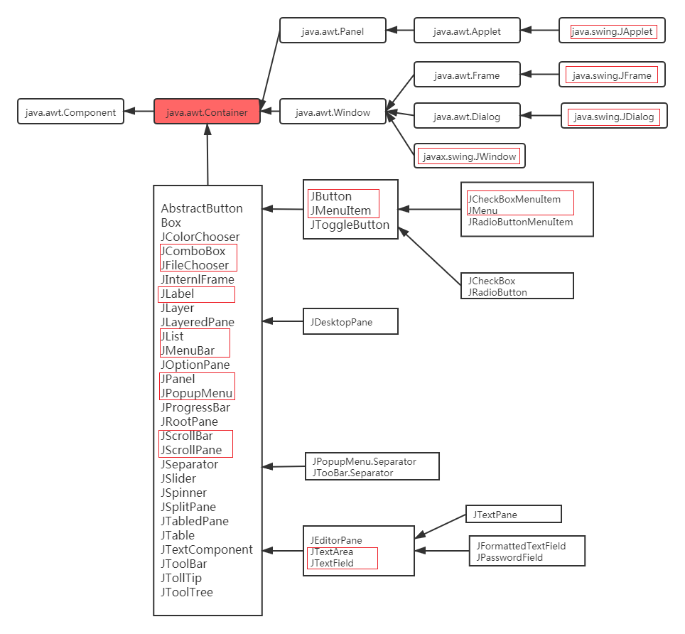

​	大部分Swing 组件都是 JComponent抽象类的直接或间接子类(并不是全部的 Swing 组件)，JComponent 类定义了所有子类组件的通用方法 ，JComponent 类是 AWT 里 java.awt. Container 类的子类 ，这也是 AWT 和 Swing 的联系之一。 绝大部分 Swing 组件类继承了 Container类，所以Swing 组件都可作为容器使用 ( JFrame继承了Frame 类)。

**Swing组件和AWT组件的对应关系：**

​	大部分情况下，只需要在AWT组件的名称前面加个J，就可以得到其对应的Swing组件名称，但有几个例外：

  		1. JComboBox: 对应于 AWT 里的 Choice 组件，但比 Choice 组件功能更丰富 。
       ​		2. JFileChooser: 对应于 AWT 里的 FileDialog 组件 。
       ​		3. JScrollBar: 对应于 AWT 里的 Scrollbar 组件，注意两个组件类名中 b 字母的大小写差别。
       ​		4. JCheckBox : 对应于 AWT 里的 Checkbox 组件， 注意两个组件类名中 b 字母的大小 写差别 。
       ​		5. JCheckBoxMenultem: 对应于 AWT 里的 CheckboxMenuItem 组件，注意两个组件类名中 b字母的大小写差别。


**Swing组件按照功能来分类：**

 	1. 顶层容器: JFrame、JApplet、JDialog 和 JWindow 。
     ​	2. 中间容器: JPanel 、 JScrollPane 、 JSplitPane 、 JToolBar 等 。
     ​	3. 特殊容器:在用户界面上具有特殊作用的中间容器，如 JIntemalFrame 、 JRootPane 、 JLayeredPane和 JDestopPane 等 。
     ​	4. 基本组件 : 实现人机交互的组件，如 JButton、 JComboBox 、 JList、 JMenu、 JSlider 等 。
     ​	5. 不可编辑信息的显示组件:向用户显示不可编辑信息的组件，如JLabel 、 JProgressBar 和 JToolTip等。
     ​	6. 可编辑信息的显示组件:向用户显示能被编辑的格式化信息的组件，如 JTable 、 JTextArea 和JTextField 等 。
     ​	7. 特殊对话框组件:可以直接产生特殊对话框的组件 ， 如 JColorChooser 和 JFileChooser 等。

### 3.2.2 AWT组件的Swing实现

​	Swing 为除 Canvas 之外的所有 AWT 组件提供了相应的实现，Swing 组件比 AWT 组件的功能更加强大。相对于 AWT 组件， Swing 组件具有如下 4 个额外的功能 :

1. 可以为 Swing 组件设置提示信息。使用 setToolTipText()方法，为组件设置对用户有帮助的提示信息 。

2. 很多 Swing 组件如按钮、标签、菜单项等，除使用文字外，还可以使用图标修饰自己。为了允许在 Swing 组件中使用图标， Swing为Icon 接口提供了 一个实现类: Imagelcon ，该实现类代表一个图像图标。

3. 支持插拔式的外观风格。每个 JComponent 对象都有一个相应的 ComponentUI 对象，为它完成所有的绘画、事件处理、决定尺寸大小等工作。 ComponentUI 对象依赖当前使用的 PLAF ， 使用 UIManager.setLookAndFeel()方法可以改变图形界面的外观风格 。
4. 支持设置边框。Swing 组件可以设置一个或多个边框。 Swing 中提供了各式各样的边框供用户边 用，也能建立组合边框或自己设计边框。 一种空白边框可以用于增大组件，同时协助布局管理器对容器中的组件进行合理的布局。    


​	每个 Swing 组件都有一个对应的UI 类，例如 JButton组件就有一个对应的 ButtonUI 类来作为UI代理 。每个 Swing组件的UI代理的类名总是将该 Swing 组件类名的 J 去掉，然后在后面添加 UI 后缀 。 UI代理类通常是一个抽象基类 ， 不同的 PLAF 会有不同的UI代理实现类 。 Swing 类库中包含了几套UI代理,分别放在不同的包下， 每套UI代理都几乎包含了所有 Swing组件的 ComponentUI实现，每套这样的实现都被称为一种PLAF 实现 。以 JButton 为例，其 UI 代理的继承层次下图：

​	  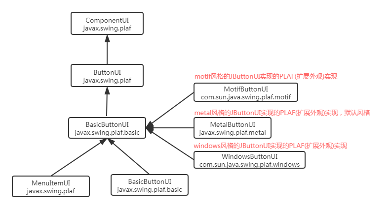

​	如果需要改变程序的外观风格， 则可以使用如下代码：

```java
//容器：
JFrame jf = new JFrame();

try {

    //设置外观风格
    UIManager.setLookAndFeel("com.sun.java.swing.plaf.windows.WindowsLookAndFeel");

    //刷新jf容器及其内部组件的外观
    SwingUtilities.updateComponentTreeUI(jf);
} catch (Exception e) {
    e.printStackTrace();
}
```


**案例：**

​	使用Swing组件，实现下图中的界面效果：

​	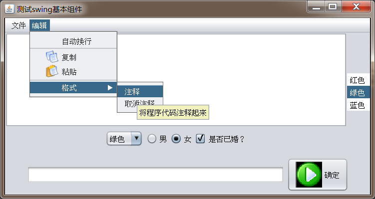

​	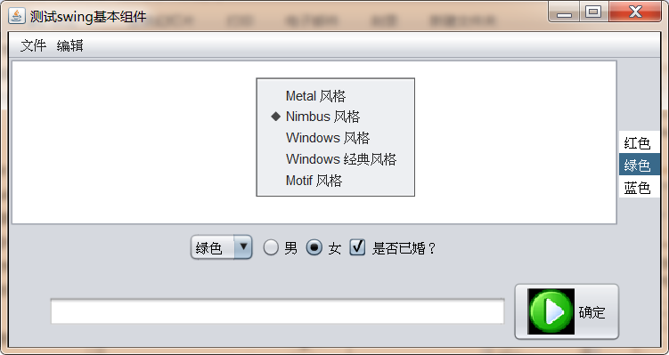

**演示代码：**

```java
import cn.itcast.swing.util.ImagePathUtil;

import javax.swing.*;
import java.awt.*;
import java.awt.event.ActionEvent;
import java.awt.event.ActionListener;
import java.awt.event.InputEvent;

public class SwingComponentDemo {


    JFrame f = new JFrame("测试swing基本组件");

    //定义一个按钮，并为其指定图标
    Icon okIcon = new ImageIcon(ImagePathUtil.getRealPath("2\\ok.png"));
    JButton ok = new JButton("确定",okIcon);

    //定义一个单选按钮，初始处于选中的状态
    JRadioButton male = new JRadioButton("男",true);
    //定义一个单选按钮，初始处于选中状态
    JRadioButton female = new JRadioButton("女",false);

    //定义一个ButtonGroup，把male和female组合起来，实现单选
    ButtonGroup bg  = new ButtonGroup();

    //定义一个复选框，初始处于没有选中状态
    JCheckBox married = new JCheckBox("是否已婚？",false);

    //定义一个数组存储颜色
    String[] colors = { "红色", "绿色 " , "蓝色 " };

    //定义一个下拉选择框，展示颜色
    JComboBox<String> colorChooser = new JComboBox<String>(colors);

    //定一个列表框，展示颜色
    JList<String> colorList = new JList<String>(colors);

    //定义一个8行20列的多行文本域
    JTextArea ta = new JTextArea(8,20);

    //定义一个40列的单行文本域
    JTextField name = new JTextField(40);

    //定义菜单条
    JMenuBar mb = new JMenuBar();

    //定义菜单
    JMenu file = new JMenu("文件");
    JMenu edit = new JMenu("编辑");

    //创建菜单项，并指定图标
    JMenuItem newItem = new JMenuItem("新建",new ImageIcon(ImagePathUtil.getRealPath("2\\new.png")));
    JMenuItem saveItem = new JMenuItem("保存",new ImageIcon(ImagePathUtil.getRealPath("2\\save.png")));
    JMenuItem exitItem = new JMenuItem("退出",new ImageIcon(ImagePathUtil.getRealPath("2\\exit.png")));

    JCheckBoxMenuItem autoWrap = new JCheckBoxMenuItem("自动换行");
    JMenuItem copyItem = new JMenuItem("复制",new ImageIcon(ImagePathUtil.getRealPath("2\\copy.png")));
    JMenuItem pasteItem = new JMenuItem("粘贴",new ImageIcon(ImagePathUtil.getRealPath("2\\paste.png")));

    //定义二级菜单，将来会添加到编辑中
    JMenu format = new JMenu("格式");
    JMenuItem commentItem = new JMenuItem("注释");
    JMenuItem cancelItem = new JMenuItem("取消注释");

    //定义一个右键菜单，用于设置程序的外观风格
    JPopupMenu pop = new JPopupMenu();

    //定义一个ButtongGroup对象，用于组合风格按钮，形成单选
    ButtonGroup flavorGroup = new ButtonGroup();

    //定义五个单选按钮菜单项，用于设置程序风格
    JRadioButtonMenuItem metalItem = new JRadioButtonMenuItem("Metal 风格",true);
    JRadioButtonMenuItem nimbusItem = new JRadioButtonMenuItem("Nimbus 风格",true);
    JRadioButtonMenuItem windowsItem = new JRadioButtonMenuItem("Windows 风格",true);
    JRadioButtonMenuItem classicItem = new JRadioButtonMenuItem("Windows 经典风格",true);
    JRadioButtonMenuItem motifItem = new JRadioButtonMenuItem("Motif 风格",true);


    //初始化界面
    public void init(){

        //------------------------组合主区域------------------------
        //创建一个装载文本框和按钮的JPanel
        JPanel bottom = new JPanel();
        bottom.add(name);
        bottom.add(ok);

        f.add(bottom, BorderLayout.SOUTH);

        //创建一个装载下拉选择框、三个JChekBox的JPanel
        JPanel checkPanel = new JPanel();
        checkPanel.add(colorChooser);
        bg.add(male);
        bg.add(female);

        checkPanel.add(male);
        checkPanel.add(female);
        checkPanel.add(married);

        //创建一个垂直排列的Box，装载checkPanel和多行文本域
        Box topLeft = Box.createVerticalBox();

        //使用JScrollPane作为普通组件的JViewPort
        JScrollPane taJsp = new JScrollPane(ta);
        topLeft.add(taJsp);
        topLeft.add(checkPanel);

        //创建一个水平排列的Box，装载topLeft和colorList
        Box top = Box.createHorizontalBox();
        top.add(topLeft);
        top.add(colorList);

        //将top Box 添加到窗口的中间
        f.add(top);

        //---------------------------组合菜单条----------------------------------------------
        //为newItem添加快捷键 ctrl+N
        newItem.setAccelerator(KeyStroke.getKeyStroke('N', InputEvent.CTRL_MASK));
        newItem.addActionListener(new ActionListener() {
            @Override
            public void actionPerformed(ActionEvent e) {
                ta.append("用户点击了“新建”菜单\n");
            }
        });


        //为file添加菜单项
        file.add(newItem);
        file.add(saveItem);
        file.add(exitItem);

        //为edit添加菜单项
        edit.add(autoWrap);
        edit.addSeparator();
        edit.add(copyItem);
        edit.add(pasteItem);
        //为commentItem添加提示信息
        commentItem.setToolTipText("将程序代码注释起来");

        //为format菜单添加菜单项
        format.add(commentItem);
        format.add(cancelItem);

        //给edit添加一个分隔符
        edit.addSeparator();

        //把format添加到edit中形成二级菜单
        edit.add(format);

        //把edit file 添加到菜单条中
        mb.add(file);
        mb.add(edit);

        //把菜单条设置给窗口
        f.setJMenuBar(mb);

        //------------------------组合右键菜单-----------------------------

        flavorGroup.add(metalItem);
        flavorGroup.add(nimbusItem);
        flavorGroup.add(windowsItem);
        flavorGroup.add(classicItem);
        flavorGroup.add(motifItem);

        //给5个风格菜单创建事件监听器
        ActionListener flavorLister = new ActionListener() {
            @Override
            public void actionPerformed(ActionEvent e) {
                String command = e.getActionCommand();
                try {
                    changeFlavor(command);
                } catch (Exception e1) {
                    e1.printStackTrace();
                }
            }
        };

        //为5个风格菜单项注册监听器
        metalItem.addActionListener(flavorLister);
        nimbusItem.addActionListener(flavorLister);
        windowsItem.addActionListener(flavorLister);
        classicItem.addActionListener(flavorLister);
        motifItem.addActionListener(flavorLister);

        pop.add(metalItem);
        pop.add(nimbusItem);
        pop.add(windowsItem);
        pop.add(classicItem);
        pop.add(motifItem);

        //调用ta组件的setComponentPopupMenu即可设置右键菜单，无需使用事件
        ta.setComponentPopupMenu(pop);

        // 设置关闭窗口时推出程序
        f.setDefaultCloseOperation(JFrame.EXIT_ON_CLOSE);

        //设置jFrame最佳大小并可见
        f.pack();
        f.setVisible(true);


    }

    //定义一个方法，用于改变界面风格
    private void changeFlavor(String command) throws Exception{
        switch (command){
            case "Metal 风格":
                UIManager.setLookAndFeel("javax.swing.plaf.metal.MetalLookAndFeel");
                break;
            case "Nimbus 风格":
                UIManager.setLookAndFeel("javax.swing.plaf.nimbus.NimbusLookAndFeel");
                break;
            case "Windows 风格":
                UIManager.setLookAndFeel("com.sun.java.swing.plaf.windows.WindowsLookAndFeel");
                break;
            case "Windows 经典风格":
                UIManager.setLookAndFeel("com.sun.java.swing.plaf.windows.WindowsClassicLookAndFeel");
                break;
            case "Motif 风格":
                UIManager.setLookAndFeel("com.sun.java.swing.plaf.motif.MotifLookAndFeel");
                break;
        }

        //更新f窗口内顶级容器以及所有组件的UI
        SwingUtilities.updateComponentTreeUI(f.getContentPane());
        //更新mb菜单条及每部所有组件UI
        SwingUtilities.updateComponentTreeUI(mb);
        //更新右键菜单及内部所有菜单项的UI
        SwingUtilities.updateComponentTreeUI(pop);
    }


    public static void main(String[] args) {
        new SwingComponentDemo().init();
    }

}

```

**注意细节：**

1.Swing菜单项指定快捷键时必须通过`组件名.setAccelerator(keyStroke.getKeyStroke("大写字母",InputEvent.CTRL_MASK))`方法来设置，其中KeyStroke代表一次击键动作，可以直接通过按键对应字母来指定该击键动作 。

2.更新JFrame的风格时，调用了` SwingUtilities.updateComponentTreeUI(f.getContentPane());`这是因为如果直接更新 JFrame 本身 ，将会导致 JFrame 也被更新， JFrame 是一个特殊的容器 ， JFrame 依然部分依赖于本地平台的图形组件 。如果强制 JFrame 更新，则有可能导致该窗口失去标题栏和边框 。 

3.给组件设置右键菜单，不需要使用监听器，只需要调用setComponentPopupMenu()方法即可，更简单。

4.关闭JFrame窗口，也无需监听器，只需要调用setDefaultCloseOperation(JFrame.EXIT_ON_CLOSE)方法即可，更简单。

5.如果需要让某个组件支持滚动条，只需要把该组件放入到JScrollPane中，然后使用JScrollPane即可。


### 3.2.3 为组件设置边框

​	很多情况下，我们常常喜欢给不同的组件设置边框，从而让界面的层次感更明显，swing中提供了Border对象来代表一个边框，下图是Border的继承体系图：

​	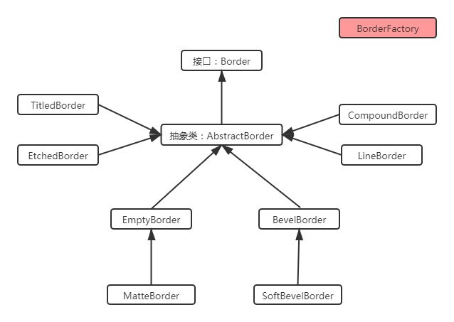

**特殊的Border：**

 	1. TitledBorder:它的作用并不是直接为其他组件添加边框，而是为其他边框设置标题，创建该类的对象时，需要传入一个其他的Border对象；
 		2. ComoundBorder:用来组合其他两个边框，创建该类的对象时，需要传入其他两个Border对象，一个作为内边框，一个座位外边框

**给组件设置边框步骤：**

 	1. 使用BorderFactory或者XxxBorder创建Border的实例对象；
 		2. 调用Swing组件的setBorder（Border b）方法为组件设置边框；

**案例：**

​	请使用Border实现下图效果：

​	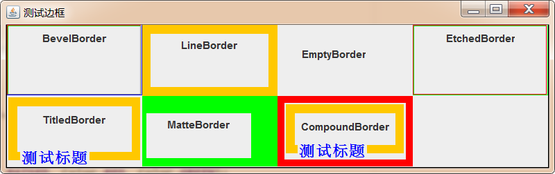

**演示代码：**

```java
import javax.swing.*;
import javax.swing.border.*;
import java.awt.*;

public class BorderTest {

    JFrame jf  = new JFrame("测试边框");

    public void init(){
        //设置Jframe为网格布局
        jf.setLayout(new GridLayout(2,4));

        //创建凸起的斜边框，分别设置四条边的颜色
        Border bb = BorderFactory.createBevelBorder(BevelBorder.RAISED,Color.RED,Color.GREEN,Color.BLUE,Color.GRAY);
        jf.add(getPanelWithBorder(bb,"BevelBorder"));


        //创建LineBorder
        Border lb = BorderFactory.createLineBorder(Color.ORANGE, 10);
        jf.add(getPanelWithBorder(lb,"LineBorder"));

        //创建EmptyBorder，会在组件的四周留白
        Border eb = BorderFactory.createEmptyBorder(20, 5, 10, 30);
        jf.add(getPanelWithBorder(eb,"EmptyBorder"));

        //创建EtchedBorder，
        Border etb = BorderFactory.createEtchedBorder(EtchedBorder.RAISED, Color.RED, Color.GREEN);
        jf.add(getPanelWithBorder(etb,"EtchedBorder"));

        //创建TitledBorder,为原有的Border添加标题
        TitledBorder tb = new TitledBorder(lb,"测试标题",TitledBorder.LEFT,TitledBorder.BOTTOM,new Font("StSong",Font.BOLD,18),Color.BLUE);
        jf.add(getPanelWithBorder(tb,"TitledBorder"));

        //直接创建MatteBorder，它是EmptyBorder的子类，EmptyBorder是留白，而MatteBorder可以给留空的区域填充颜色
        MatteBorder mb = new MatteBorder(20,5,10,30,Color.GREEN);
        jf.add(getPanelWithBorder(mb,"MatteBorder"));

        //直接创创建CompoundBorder，将两个边框组合成新边框
        CompoundBorder cb = new CompoundBorder(new LineBorder(Color.RED,8),tb);
        jf.add(getPanelWithBorder(cb,"CompoundBorder"));

        jf.setDefaultCloseOperation(JFrame.EXIT_ON_CLOSE);
        jf.pack();
        jf.setVisible(true);

    }
    public JPanel getPanelWithBorder(Border border,String borderName){
        JPanel jPanel = new JPanel();

        jPanel.add(new JLabel(borderName));

        //为panel设置边框
        jPanel.setBorder(border);

        return jPanel;
    }
    public static void main(String[] args) {
        new BorderTest().init();
    }
}
```

### 3.2.4 使用JToolBar创建工具条

Swing 提供了JToolBar类来创建工具条，并且可以往JToolBar中添加多个工具按钮。

**JToolBar  API:**

| 方法名称                                 | 方法功能                                                     |
| ---------------------------------------- | ------------------------------------------------------------ |
| JToolBar( String name , int orientation) | 创建一个名字为name，方向为orientation的工具条对象，其orientation的是取值可以是SwingConstants.HORIZONTAL或SwingConstants.VERTICAL |
| JButton add(Action a)                    | 通过Action对象为JToolBar工具条添加对应的工具按钮             |
| addSeparator( Dimension size )           | 向工具条中添加指定大小的分隔符                               |
| setFloatable( boolean b )                | 设定工具条是否可以被拖动                                     |
| setMargin(Insets m)                      | 设置工具条与工具按钮的边距                                   |
| setOrientation( int o )                  | 设置工具条的方向                                             |
| setRollover(boolean rollover)            | 设置此工具条的rollover状态                                   |

**add(Action a)方法：**

​	上述API中add(Action a)这个方法比较难理解，为什么呢，之前说过，Action接口是ActionListener的一个子接口，那么它就代表一个事件监听器，而这里add方法是在给工具条添加一个工具按钮，为什么传递的是一个事件监听器呢？

​	首先要明确的是不管是菜单条中的菜单项还是工具条中的工具按钮，最终肯定是需要点击来完成一些操作，所以JToolBar以及JMenu都提供了更加便捷的添加子组件的方法add(Action a),在这个方法的内部会做如下几件事：

   	1. 创建一个适用于该容器的组件(例如，在工具栏中创建一个工具按钮)；
   	2. 从 Action 对象中获得对应的属性来设置该组件(例如，通过 name 来设置文本，通过 lcon 来设置图标) ；
   	3. 把Action监听器注册到刚才创建的组件上；

**案例：**

​	使用JToolBar组件完成下图效果：

​	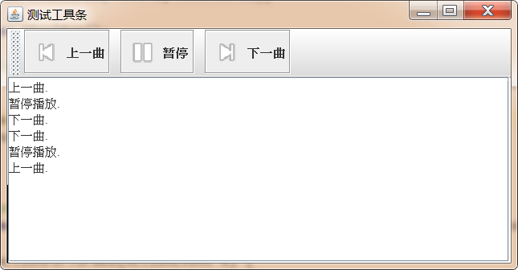

**演示代码：**

```java
import cn.itcast.swing.util.ImagePathUtil;

import javax.swing.*;
import java.awt.*;
import java.awt.event.ActionEvent;

public class JToolBarTest {

    JFrame jf = new JFrame("测试工具条");

    JTextArea jta = new JTextArea(6,35);
    //创建工具条
    JToolBar jtb = new JToolBar();

    //创建"上一曲"Action,该Action用于创建工具按钮
    Action pre = new AbstractAction("上一曲",new ImageIcon(ImagePathUtil.getRealPath("2\\pre.png"))) {
        @Override
        public void actionPerformed(ActionEvent e) {
            jta.append("上一曲.\n");
        }
    };

    //创建"暂停" Action
    Action pause = new AbstractAction("暂停",new ImageIcon(ImagePathUtil.getRealPath("2\\pause.png"))) {
        @Override
        public void actionPerformed(ActionEvent e) {
           jta.append("暂停播放.\n");
        }
    };

    // 创建"下一曲" Action
    Action next = new AbstractAction("下一曲",new ImageIcon(ImagePathUtil.getRealPath("2\\next.png"))) {
        @Override
        public void actionPerformed(ActionEvent e) {
            jta.append("下一曲.\n");
        }
    };

    public void init(){

        //给JTextArea添加滚动条
        jf.add(new JScrollPane(jta));

        //以Action的形式创建按钮，并将按钮添加到Panel中
        JButton preBtn = new JButton(pre);
        JButton pauseBtn = new JButton(pause);
        JButton nextBtn = new JButton(next);


        //往工具条中添加Action对象，该对象会转换成工具按钮
        jtb.add(preBtn);
        jtb.addSeparator();
        jtb.add(pauseBtn);
        jtb.addSeparator();
        jtb.add(nextBtn);

        //向窗口中添加工具条
        jf.add(jtb,BorderLayout.NORTH);

        jf.setDefaultCloseOperation(JFrame.EXIT_ON_CLOSE);

        jf.pack();
        jf.setVisible(true);
    }

    public static void main(String[] args) {
        new JToolBarTest().init();
    }
}
```

### 3.2.5 JColorChooser 和JFileChooser

Swing提供了JColorChooser和JFileChooser这两种对话框，可以很方便的完成颜色的选择和本地文件的选择。

#### 3.2.5.1 JColorChooser

JColorChooser 用于创建颜色选择器对话框 ， 该类的用法非常简单，只需要调用它的静态方法就可以快速生成一个颜色选择对话框：

```java
public static Color showDialog(Component component, String title,Color initialColor)
    
/*
	参数：
		componet:指定当前对话框的父组件
		title：当前对话框的名称
		initialColor：指定默认选中的颜色
		
	返回值：
		返回用户选中的颜色
*/
```

**案例：**

​	使用颜色选择器，完成下图功能：

​		点击按钮，改变文本域的背景色

​	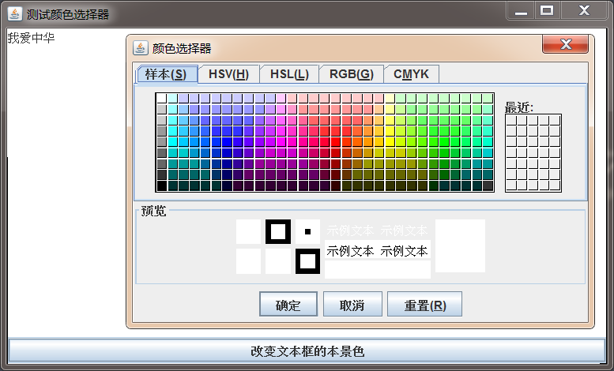

**演示代码：**

```java
import javax.swing.*;
import java.awt.*;
import java.awt.event.ActionEvent;

public class JColorChooserDemo {

    JFrame jFrame = new JFrame("测试颜色选择器");

    JTextArea jta = new JTextArea("我爱中华",6,30);

    JButton button = new JButton(new AbstractAction("改变文本框的本景色"){

        @Override
        public void actionPerformed(ActionEvent e) {

            //弹出颜色选择器
            Color result = JColorChooser.showDialog(jFrame, "颜色选择器", Color.WHITE);
            jta.setBackground(result);
        }
    });

    public void init(){
        jFrame.add(jta);

        jFrame.add(button,BorderLayout.SOUTH);

        jFrame.setDefaultCloseOperation(JFrame.EXIT_ON_CLOSE);
        jFrame.pack();
        jFrame.setVisible(true);
    }

    public static void main(String[] args) {
        new JColorChooserDemo().init();
    }

}

```

#### 3.2.5.2 JFileChooser

​	JFileChooser 的功能与AWT中的 FileDialog 基本相似，也是用于生成"打开文件"、"保存文件 "对话框。与 FileDialog 不同的是 ， JFileChooser 无须依赖于本地平台的 GUI ， 它由 100%纯 Java 实现 ， 在所有平台 上具有完全相同的行为，并可以在所有平台上具有相同的外观风格。

JFileChooser使用步骤：

1. 创建JFileChooser对象：

```java
JFileChooser chooser = new JFileChooser("D:\\a");//指定默认打开的本地磁盘路径
```

2. 调用JFileChooser的一系列可选方法，进行初始化

```java
setSelectedFile(File file)/setSelectedFiles(File[] selectedFiles):设定默认选中的文件
setMultiSelectionEnabled(boolean b)：设置是否允许多选，默认是单选
setFileSelectionMode(int mode)：设置可以选择内容，例如文件、文件夹等，默认只能选择文件
```

3. 打开文件对话框

```java
showOpenDialog(Component parent):打开文件加载对话框，并指定父组件
showSaveDialog(Component parent):打开文件保存对话框，并指定父组件
```

4. 获取用户选择的结果

```java
File getSelectedFile():获取用户选择的一个文件
File[] getSelectedFiles():获取用户选择的多个文件
```

**案例：**

​	使用JFileChooser完成下图效果：

​	


**演示代码：**

```java
import javax.imageio.ImageIO;
import javax.swing.*;
import java.awt.*;
import java.awt.event.ActionEvent;
import java.awt.image.BufferedImage;
import java.io.File;
import java.io.IOException;

public class JFileChooserDemo {

    //创建窗口对象
    JFrame jf = new JFrame("测试JFileChooser");

    //创建打开文件对话框
    JFileChooser chooser = new JFileChooser(".");

    //创建菜单条
    JMenuBar jmb = new JMenuBar();
    //创建菜单
    JMenu jMenu = new JMenu("文件");
    //创建菜单项
    JMenuItem open = new JMenuItem(new AbstractAction("打开"){

        @Override
        public void actionPerformed(ActionEvent e) {
            chooser.showOpenDialog(jf);
            File imageFile = chooser.getSelectedFile();
            try {
                image = ImageIO.read(imageFile);
                drawArea.repaint();
            } catch (IOException e1) {
                e1.printStackTrace();
            }
        }
    });

    JMenuItem save = new JMenuItem(new AbstractAction("另存为"){

        @Override
        public void actionPerformed(ActionEvent e) {
            chooser.setFileSelectionMode(JFileChooser.DIRECTORIES_ONLY);
            chooser.showSaveDialog(jf);
            File dir = chooser.getSelectedFile();
            try {
                ImageIO.write(image,"jpeg",new File(dir,"a.jpg"));
            } catch (Exception e1) {
                e1.printStackTrace();
            }
        }
    });

    //用来记录用户选择的图片
    BufferedImage image;

    //显示图片
    class MyCanvas extends JPanel{
        @Override
        public void paint(Graphics g) {
            if (image!=null){
                g.drawImage(image,0,0,null);
            }
        }
    }

    JPanel drawArea = new MyCanvas();

    public void init(){
        //设置图片显示区域大小
        drawArea.setPreferredSize(new Dimension(500,300));
        jf.add(drawArea);

        //组装并设置菜单条
        jMenu.add(open);
        jMenu.add(save);
        jmb.add(jMenu);
        jf.setJMenuBar(jmb);

        //显示jf
        jf.setDefaultCloseOperation(JFrame.EXIT_ON_CLOSE);
        jf.pack();
        jf.setVisible(true);
    }

    public static void main(String[] args) {
        new JFileChooserDemo().init();
    }    
      
}
```

### 3.2.7 使用JOptionPane

#### 3.2.7.1 基本概述

通过 JOptionPane 可以非常方便地创建一些简单的对话框， Swing 已经为这些对话框添加了相应的组件，无须程序员手动添加组件 。 JOptionPane 提供了如下 4 个方法来创建对话框 。

| 方法名称                                    | 方法功能                                                     |
| ------------------------------------------- | ------------------------------------------------------------ |
| showMessageDialog/showInternalMessageDialog | 消息对话框 ，告知用户某事己发生 ， 用户只能单击"确定"按钮 ， 类似于 JavaScript 的 alert 函数 。 |
| showConfirmDialog/showInternalConfirmDialog | 确认对话框，向用户确认某个问题，用户可以选择 yes 、 no ~ cancel 等选项 。 类似于 JavaScript 的 comfirm 函数 。该方法返回用户单击了 哪个按钮 |
| showInputDialog/showInternalInputDialog     | 输入对话框，提示要求输入某些信息，类似于 JavaScript的 prompt 函数。该方法返回用户输入的字符串 。 |
| showOptionDialog/showInternalOptionDialog   | 自定义选项对话框 ，允许使用自 定义选项 ，可以取代showConfirmDialog 所产生的对话框，只是用起来更复杂 。 |

上述方法都有都有很多重载形式，选择其中一种最全的形式，参数解释如下：

```java
showXxxDialog(Component parentComponent,
		Object message, 
		String title, 
		int optionType, 
		int messageType,
        	Icon icon,
		Object[] options, 
		Object initialValue)
--参数解释：
parentComponent：当前对话框的父组件
message：对话框上显示的信息，信息可以是字符串、组件、图片等
title：当前对话框的标题
optionType：当前对话框上显示的按钮类型：DEFAULT_OPTION、YES_NO_OPTION、YES_NO_CANCEL_OPTION、OK_CANCEL_OPTION
messageType:当前对话框的类型:ERROR_MESSAGE、INFORMATION_MESSAGE、WARNING_MESSAGE、QUESTION_MESSAGE、PLAIN_MESSAGE
icon:当前对话框左上角的图标
options:自定义下拉列表的选项
initialValue:自定义选项中的默认选中项
```


**当用户与对话框交互结束后，不同类型对话框的返回值如下：**

- showMessageDialog: 无返回值 。
- showlnputDialog: 返回用户输入或选择的字符串 。
- showConfirmDialog: 返回 一个整数代表用户选择的选项 。
- showOptionDialog : 返回 一个整数代表用户选择的选项，如果用户选择第一项，则返回 0; 如果选择第二项，则返回1……依此类推 。

**对 showConfirmDialog 所产生的对话框，有如下几个返回值：**

- YES OPTION: 用户 单击了 "是"按钮后返回 。
- NO OPTION: 用 户单击了"否"按钮后返回 。
- CANCEL OPTION: 用户单击了"取消"按钮后返回 。
- OK OPTION : 用户单击了"确定"按钮后返回 。
- CLOSED OPTION: 用户 单击了对话框右上角的 " x" 按钮后返回。

#### 3.2.7.2 四种对话框演示

**消息对话框：**

​	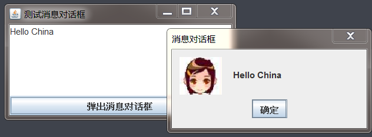

```java
import cn.itcast.swing.util.ImagePathUtil;

import javax.swing.*;
import java.awt.*;
import java.awt.event.ActionEvent;

public class MessageDialogTest {


    JFrame jf = new JFrame("测试消息对话框");

    JTextArea jta = new JTextArea(6, 30);

    JButton btn = new JButton(new AbstractAction("弹出消息对话框") {

        @Override
        public void actionPerformed(ActionEvent e) {
            //JOptionPane.showMessageDialog(jf, jta.getText(), "消息对话框", JOptionPane.ERROR_MESSAGE);
            //JOptionPane.showMessageDialog(jf, jta.getText(), "消息对话框", JOptionPane.INFORMATION_MESSAGE);
            //JOptionPane.showMessageDialog(jf, jta.getText(), "消息对话框", JOptionPane.WARNING_MESSAGE);
            //JOptionPane.showMessageDialog(jf, jta.getText(), "消息对话框", JOptionPane.QUESTION_MESSAGE);
            //JOptionPane.showMessageDialog(jf, jta.getText(), "消息对话框", JOptionPane.PLAIN_MESSAGE);
            JOptionPane.showMessageDialog(jf, jta.getText(), "消息对话框", JOptionPane.WARNING_MESSAGE, new ImageIcon(ImagePathUtil.getRealPath("2\\female.png")));

        }
    });


    public void init(){
        jf.add(jta);
        jf.add(btn, BorderLayout.SOUTH);

        jf.setDefaultCloseOperation(JFrame.EXIT_ON_CLOSE);
        jf.pack();
        jf.setVisible(true);
    }

    public static void main(String[] args) {
        new MessageDialogTest().init();
    }

}

```


**确认对话框：**

​	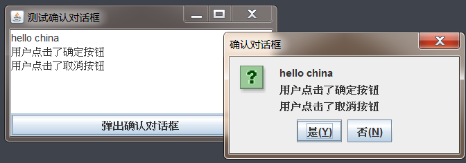

```java
import javax.swing.*;
import java.awt.*;
import java.awt.event.ActionEvent;

public class ConfirmDialogTest {


    JFrame jf = new JFrame("测试确认对话框");

    JTextArea jta = new JTextArea(6, 30);

    JButton btn = new JButton(new AbstractAction("弹出确认对话框") {

        @Override
        public void actionPerformed(ActionEvent e) {

            int result = JOptionPane.showConfirmDialog(jf, jta.getText(), "确认对话框",JOptionPane.YES_NO_OPTION, JOptionPane.QUESTION_MESSAGE);
            if (result == JOptionPane.YES_OPTION){
                jta.append("\n用户点击了确定按钮");
            }

            if (result==JOptionPane.NO_OPTION){
                jta.append("\n用户点击了取消按钮");
            }

        }
    });


    public void init(){
        jf.add(jta);
        jf.add(btn, BorderLayout.SOUTH);

        jf.setDefaultCloseOperation(JFrame.EXIT_ON_CLOSE);
        jf.pack();
        jf.setVisible(true);
    }

    public static void main(String[] args) {
        new ConfirmDialogTest().init();
    }

}
```

​	

**输入对话框：**

​	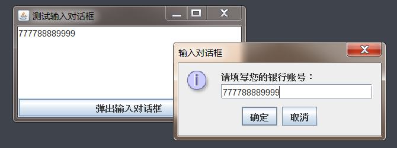

​	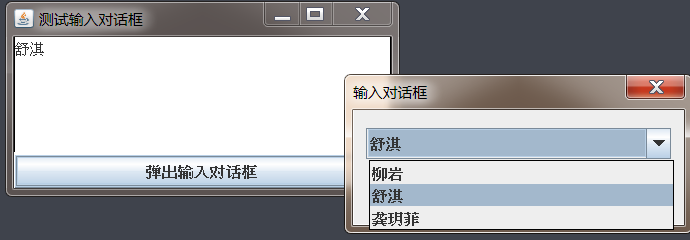

```java
import javax.swing.*;
import java.awt.*;
import java.awt.event.ActionEvent;

public class InputDialogTest {


    JFrame jf = new JFrame("测试输入对话框");

    JTextArea jta = new JTextArea(6, 30);

    JButton btn = new JButton(new AbstractAction("弹出输入对话框") {

        @Override
        public void actionPerformed(ActionEvent e) {


           /* String result = JOptionPane.showInputDialog(jf, "请填写您的银行账号：", "输入对话框", JOptionPane.INFORMATION_MESSAGE);
            if(result!=null){
                jta.append(result.toString());
            }
            */

            Object result = JOptionPane.showInputDialog(jf, "", "输入对话框", JOptionPane.DEFAULT_OPTION, null, new String[]{"柳岩", "舒淇", "龚玥菲"}, "舒淇");
            if (result!=null){
                jta.append(result.toString());
            }
        }
    });


    public void init(){
        jf.add(jta);
        jf.add(btn, BorderLayout.SOUTH);

        jf.setDefaultCloseOperation(JFrame.EXIT_ON_CLOSE);
        jf.pack();
        jf.setVisible(true);
    }

    public static void main(String[] args) {
        new InputDialogTest().init();
    }

}

```


**选项对话框：**

​	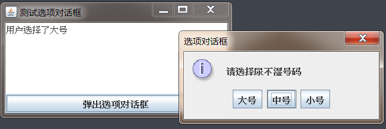


```java
import javax.swing.*;
import java.awt.*;
import java.awt.event.ActionEvent;

public class OptionDialogTest {


    JFrame jf = new JFrame("测试选项对话框");

    JTextArea jta = new JTextArea(6, 30);

    JButton btn = new JButton(new AbstractAction("弹出选项对话框") {

        @Override
        public void actionPerformed(ActionEvent e) {


            int result = JOptionPane.showOptionDialog(jf, "请选择尿不湿号码", "选项对话框",JOptionPane.DEFAULT_OPTION,JOptionPane.INFORMATION_MESSAGE,
                    null,new String[]{"大号","中号","小号"},"中号");

            switch (result){
                case 0:
                    jta.setText("用户选择了大号");
                    break;
                case 1:
                    jta.setText("用户选择了中号");
                    break;
                case 2:
                    jta.setText("用户选择了小号");
                    break;
            }
        }
    });


    public void init(){
        jf.add(jta);
        jf.add(btn, BorderLayout.SOUTH);

        jf.setDefaultCloseOperation(JFrame.EXIT_ON_CLOSE);
        jf.pack();
        jf.setVisible(true);
    }

    public static void main(String[] args) {
        new OptionDialogTest().init();
    }

}

```


## 3.3 Swing中的特殊容器

Swing提供了一些具有特殊功能的容器 ， 这些特殊容器可以用于创建一些更复杂的用户界面。

### 3.3.1 使用JSplitPane

JSplitPane 用于创建一个分割面板,它可以将 一个组件(通常是一个容器)分割成两个部分，并提供一个分割条 ， 用户可以拖动该分割条来调整两个部分的大小。

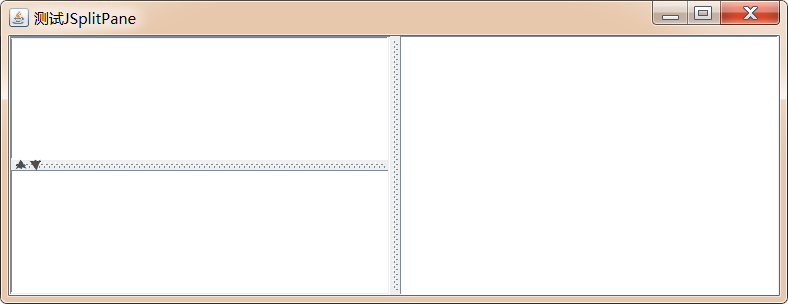


**JSplitPane使用步骤：**

1. 创建JSplitPane对象

```java
通过如下构造方法可以创建JSplitPane对象
JSplitPane(int newOrientation, Component newLeftComponent,Component newRightComponent)
    newOrientation：指定JSplitPane容器的分割方向：
    	如果值为JSplitPane.VERTICAL_SPLIT,为纵向分割；
    	如果值为JSplitPane.HORIZONTAL_SPLIT，为横向分割；
    	
    newLeftComponent：左侧或者上侧的组件；
    newRightComponent：右侧或者下侧的组件；
```

2. 设置是否开启连续布局的支持(可选)

```java
setContinuousLayout(boolean newContinuousLayout):
	默认是关闭的，如果设置为true，则打开连续布局的支持，但由于连续布局支持需要不断的重绘组件，所以效率会低一些
```

3. 设置是否支持"一触即展"的支持(可选)

```java
setOneTouchExpandable(boolean newValue):
	默认是关闭的，如果设置为true，则打开"一触即展"的支持
```

4. 其他设置

```java
setDividerLocation(double proportionalLocation):设置分隔条的位置为JSplitPane的某个百分比
setDividerLocation(int location)：通过像素值设置分隔条的位置
setDividerSize(int newSize)：通过像素值设置分隔条的大小
setLeftComponent(Component comp)/setTopComponent(Component comp)/setRightComponent(Component comp)/setBottomComponent(Component comp):设置指定位置的组件
```

**案例：**

​	使用JSplitPane实现下图效果：

​		点击右侧的图书名称，在左上方显示该图书的图片，左下方显示该图书的描述

​	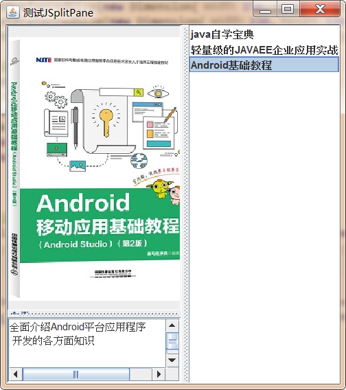

**演示代码：**

```java
public class Book {

    private String name;

    private Icon icon;

    private String desc;

    public Book(String name, Icon icon, String desc) {
        this.name = name;
        this.icon = icon;
        this.desc = desc;
    }

    public String getName() {
        return name;
    }

    public void setName(String name) {
        this.name = name;
    }

    public Icon getIcon() {
        return icon;
    }

    public void setIcon(Icon icon) {
        this.icon = icon;
    }

    public String getDesc() {
        return desc;
    }

    public void setDesc(String desc) {
        this.desc = desc;
    }

    @Override
    public String toString() {
        return name;
    }
}

import cn.itcast.swing.util.ImagePathUtil;

import javax.swing.*;
import javax.swing.event.ListSelectionEvent;
import javax.swing.event.ListSelectionListener;
import java.awt.*;

public class SplitPaneTest {

    Book[] books = {new Book("java自学宝典", new ImageIcon(ImagePathUtil.getRealPath("3\\java.png")), "国内关于 Java 编程最全面的图书 \n 看得懂 ， 学得会"),

            new Book("轻量级的JAVAEE企业应用实战", new ImageIcon(ImagePathUtil.getRealPath("3\\ee.png")), "SSM整合开发的经典图书，值的拥有"),

            new Book("Android基础教程", new ImageIcon(ImagePathUtil.getRealPath("3\\android.png")), "全面介绍Android平台应用程序\n 开发的各方面知识")

    };

    JFrame jf = new JFrame("测试JSplitPane");

    //列表展示图书
    JList<Book> bookList = new JList<>(books);

    JLabel bookCover = new JLabel();

    JTextArea bookDesc = new JTextArea();

    public void init(){

        //为三个组件设置最佳大小
        bookList.setPreferredSize(new Dimension(150,400));
        bookCover.setPreferredSize(new Dimension(220,330));
        bookDesc.setPreferredSize(new Dimension(220,70));

        //为列表添加事件监听器
        bookList.addListSelectionListener(new ListSelectionListener() {
            @Override
            public void valueChanged(ListSelectionEvent e) {
                Book book = bookList.getSelectedValue();
                bookCover.setIcon(book.getIcon());
                bookDesc.setText(book.getDesc());
            }
        });

        //创建一个垂直的分割面板
        JSplitPane left = new JSplitPane(JSplitPane.VERTICAL_SPLIT,bookCover,new JScrollPane(bookDesc));

        //打开"一触即展"特性
        left.setOneTouchExpandable(true);

        //设置分隔条的大小

        left.setDividerSize(10);
        //设置分割面板根据组件的大小调整最佳布局
        left.resetToPreferredSizes();
        
        //创建一个水平分隔面板
        JSplitPane content = new JSplitPane(JSplitPane.HORIZONTAL_SPLIT, left, bookList);
        //设置支持连续布局
        content.setContinuousLayout(true);

        jf.add(content);

        jf.setDefaultCloseOperation(JFrame.EXIT_ON_CLOSE);
        jf.pack();
        jf.setVisible(true);


    }

    public static void main(String[] args) {
        new SplitPaneTest().init();
    }

}
```


### 3.3.2 使用JTabledPane

JTabbedPane可以很方便地在窗口上放置多个标签页，每个标签页相当于获得了一个与外部容器具有相同大小的组件摆放区域。通过这种方式， 就可以在一个容器里放置更多的组件 ， 例如右击桌面上的" 我的电脑 "图标，在弹出的快捷菜单里单击"属性 " 菜单工页 ， 就可以看 到 一个"系统属性 " 对话框 ，这个对话框里包含了 若干个标签页。

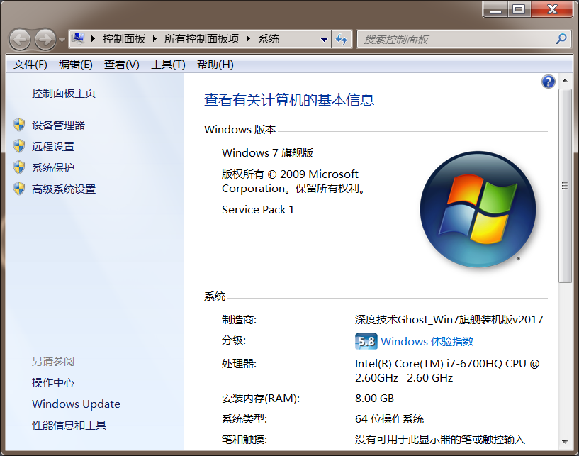

如果需要使用JTabbedPane在窗口上创建标签页 ，则可以按如下步骤进行:

1. 创建JTabbedPane对象

```java
 JTabbedPane(int tabPlacement, int tabLayoutPolicy):
	tabPlacement:
		指定标签标题的放置位置，可以选择 SwingConstants中的四个常量：TOP、LEFT、BOTTOM、RIGHT
	tabLaoutPolicy:
		指定当窗口不能容纳标签页标题时的布局策略，可以选择JTabbedPane.WRAP_TAB_LAYOUT和JTabbedPane.SCROLL_TAB_LAYOUT
```

2. 通过JTabbedPane对象堆标签进行增删改查

```java
addTab(String title, Icon icon, Component component, String tip):添加标签
	title:标签的名称
	icon:标签的图标
	component:标签对应的组件
	tip:光标放到标签上的提示
	
insertTab(String title, Icon icon, Component component, String tip, int index):插入标签页
	title:标签的名称
	icon:标签的图标
	component:标签对应的组件
	tip:光标放到标签上的提示
	index:在哪个索引处插入标签页
setComponentAt(int index, Component component):修改标签页对应的组件
	index:修改哪个索引处的标签
	component:标签对应的组件
removeTabAt(int index):
	index:删除哪个索引处的标签
```

3. 设置当前显示的标签页

```java
setSelectedIndex(int index):设置哪个索引处的标签被选中
```

4. 设置JTabbedPane的其他属性

```java
setDisabledIconAt(int index, Icon disabledIcon): 将指定位置的禁用图标设置为 icon，该图标也可以是null表示不使用禁用图标。
setEnabledAt(int index, boolean enabled): 设置指定位置的标签页是否启用。
setTitleAt(int index, String title): 设置指定位置标签页的标题为 title，该title可以是null,这表明设置该标签页的标题为空。
setToolTipTextAt(int index, String toolTipText): 设置指定位置标签页的提示文本 。
```

5. 为JTabbedPane设置监听器

```java
addChangeListener(ChangeListener l)
```

**案例：**

​	请使用JTabbedPane完成下图功能：

​	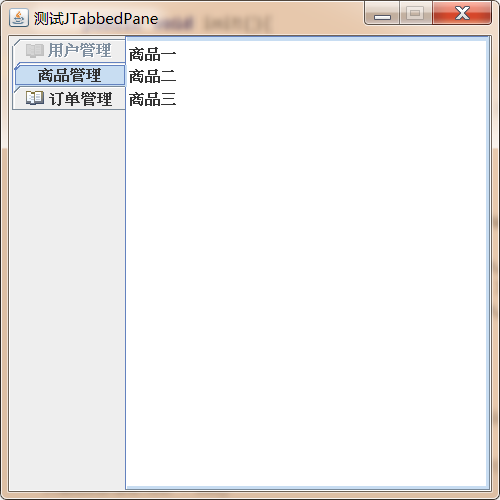

**演示代码：**

```java
import javax.swing.*;
import javax.swing.event.ChangeEvent;
import javax.swing.event.ChangeListener;

public class JTabbedPaneTest {
    JFrame jf = new JFrame("测试JTabbedPane");


    JTabbedPane tabbedPane = new JTabbedPane(SwingConstants.TOP,JTabbedPane.WRAP_TAB_LAYOUT);

    public void init(){


        //设置jf大小
        jf.setBounds(400,400,400,400);
        //设置jf大小不能变化
        jf.setResizable(false);


        ImageIcon icon = new ImageIcon(ImagePathUtil.getRealPath("3\\open.gif"));
        //添加标签
        tabbedPane.addTab("用户管理",icon,new JList<String>(new String[]{"用户一","用户二","用户三"}));
        tabbedPane.addTab("商品管理",new JList<String>(new String[]{"商品一","商品二","商品三"}));
        tabbedPane.addTab("订单管理",icon,new JList<String>(new String[]{"订单一","订单二","订单三"}));

        //设置第二个标签默认选中
        tabbedPane.setSelectedIndex(1);
        //设置第一个标签不能用
        tabbedPane.setEnabledAt(0,false);

        tabbedPane.addChangeListener(new ChangeListener() {
            @Override
            public void stateChanged(ChangeEvent e) {
                int selectedIndex = tabbedPane.getSelectedIndex();
                JOptionPane.showMessageDialog(jf,"选中了第"+(selectedIndex+1)+"个标签");
            }
        });


        jf.add(tabbedPane);
        jf.setDefaultCloseOperation(JFrame.EXIT_ON_CLOSE);
        jf.setVisible(true);

    }


    public static void main(String[] args) {
        new JTabbedPaneTest().init();
    }
}

```


### 3.3.3 使用JLayeredPane、JDesktopPane、JInternalFrame

#### 3.3.3.1 JLayeredPane

JLayeredPane是 一个代表有层 次深度的容器 ， 它允许组件在需要 时 互相重叠。当向JLayeredPane容器中添加组件时， 需要为该组件指定一个深度索引 ， 其中层次索引较高 的层里的组件位于其他层的组件之上。

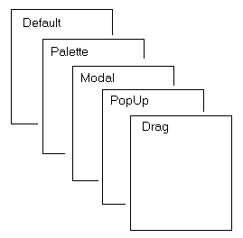

JLayeredPane 还将容器的层次深度分成几个默认层 ，程序只是将组件放入相应 的层 ，从而可以更容易地确保组件的正确重叠 ， 无须为组件指定具体的深度索引。JLayeredPane 提供了如下几个默认层：

1. DEFAULT_LAYER:大多数组件位于标准层，这是最底层；
2. PALETTE_LAYER : 调色板层位于默认层之上 。该层对于浮动工具栏和调色板很有用，因此可以位于其他组件之上 。
3. MODAL_LAYER: 该层用于显示模式对话框。它们将出现在容器中所有工具栏 、调色板或标准组件的上面 。
4. POPUP_LAYER : 该层用于显示右键菜单 ， 与对话框 、工具提示和普通组件关联的弹出式窗口将出现在对应的对话框、工具提示和普通组件之上。
5. DRAG_LAYER: 该层用于放置拖放过程中的组件(关于拖放操作请看下一节内 容) ，拖放操作中的组件位于所有组件之上 。 一旦拖放操作结束后 ， 该组件将重新分配到其所属的正常层。

**JLayeredPane 方法：**

1. moveToBack(Component c)：把当前组件c移动到所在层的所有组件的最后一个位置；
2. moveToFront(Component c)：把当前组件c移动到所在层的所有组件的第一个位置；
3. setLayer(Component c, int layer)：更改组件c所处的层；

需要注意的是，往JLayeredPane中添加组件，如果要显示，则必须手动设置该组件在容器中显示的位置以及大小。


**案例：**

​	使用JLayeredPane完成下图效果：

​	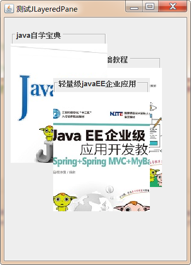

**演示代码：**

```java
import cn.itcast.swing.util.ImagePathUtil;

import javax.swing.*;
import java.awt.*;

public class JLayeredPaneTest {
    JFrame jf = new JFrame("测试JLayeredPane");
    JLayeredPane layeredPane = new JLayeredPane();

    //自定义组件，继承JPanel
    private class ContentPanel extends JPanel{

        public ContentPanel(int xPos,int yPos,String title,String ico){
            //设置边框
            setBorder(BorderFactory.createTitledBorder(BorderFactory.createEtchedBorder(),title));
            JLabel label = new JLabel(new ImageIcon(ImagePathUtil.getRealPath("3\\"+ico)));
            add(label);
            setBounds(xPos,yPos,160,220);

        }

    }

    public void init(){
        //向LayeredPane中添加三个组件，往JLayeredPane中添加组件，都必须手动的设置组件显示的位置和大小，才能显示出来

        layeredPane.add(new ContentPanel(10,20,"java自学宝典","java.png"),JLayeredPane.MODAL_LAYER);
        layeredPane.add(new ContentPanel(100,60,"Android基础教程","android.png"),JLayeredPane.DEFAULT_LAYER);
        layeredPane.add(new ContentPanel(80,100,"轻量级javaEE企业应用","ee.png"),JLayeredPane.DRAG_LAYER);

        layeredPane.setPreferredSize(new Dimension(300,400));


        jf.add(layeredPane);
        jf.pack();
        jf.setDefaultCloseOperation(JFrame.EXIT_ON_CLOSE);
        jf.setVisible(true);


    }

    public static void main(String[] args) {
        new JLayeredPaneTest().init();
    }
}
```

#### 3.3.3.2 JDesktopPane和JInternalFrame

JDesktopPane是JLayeredPane的子类，这种容器在开发中会更常用很多应用程序都需要启动多个内部窗口来显示信息（典型的比如IDEA、NotePad++），这些内部窗口都属于同一个外部窗口，当外部窗 口 最小化时， 这些内部窗口都被隐藏起来。在 Windows 环境中，这
种用户界面被称为多文档界面 C Multiple Document Interface, MDI) 。

使用 Swing 可以非常简单地创建出这种 MDI 界面 ， 通常，内部窗口有自己的标题栏、标题、图标、三个窗口按钮，并允许拖动改变内部窗口 的大小和位置，但内部窗口不能拖出外部窗口。

​	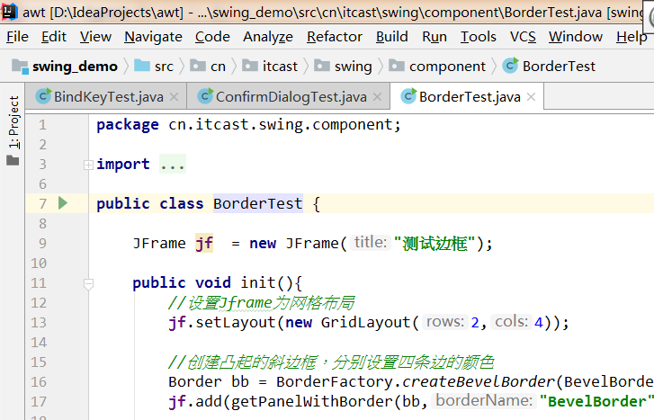

JDesktopPane 需要和 JIntemalFrame 结合使用，其中JDesktopPane 代表一 个虚拟桌面 ，而JIntemalFrame则用于创建内部窗口。使用 JDesktopPane 和 JIntemalFrame 创建内部窗口按如下步骤进行即可:

1. 创建 一 个 JDesktopPane 对象,代表虚拟桌面

```java
JDesktopPane()
```

2. 使用 JIntemalFrame 创建一个内部窗口

```java
JInternalFrame(String title, boolean resizable, boolean closable, boolean maximizable, boolean iconifiable):
	title: 内部窗口标题
	resizable:是否可改变大小
	closeble: 是否可关闭
	maximizable: 是否可最大化
	iconifiable:是否可最小化
```

3. 一旦获得了内部窗口之后，该窗口的用法和普通窗口的用法基本相似， 一样可以指定该窗口的布局管理器， 一样可以向窗口内添加组件、改变窗口图标等。
4. 将该内部窗口以合适大小、在合适位置显示出来 。与普通窗口类似的是， 该窗口默认大小是 0x0像素，位于0，0 位置(虚拟桌面的左上角处)，并且默认处于隐藏状态，程序可以通过如下代码将内部窗口显示出来:

```java
reshape(int x, int y, int width, int height):设置内部窗口的大小以及在外部窗口中的位置；
show():设置内部窗口可见
```

5. 将内部窗口添加到 JDesktopPane 容器中，再将 JDesktopPane 容器添加到其他容器中。

**案例：**

​	请使用JDesktopPane和JInternalFrame完成下图效果：

​	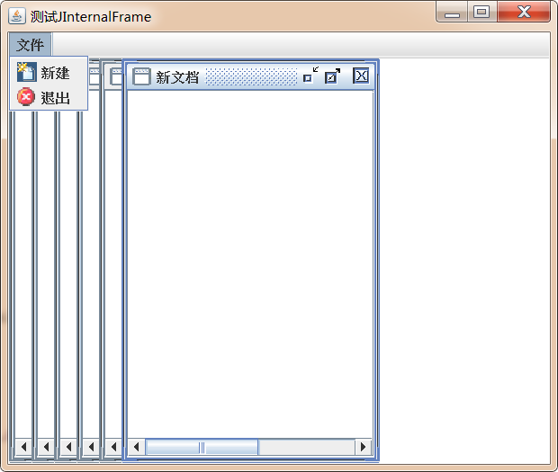

**演示代码：**

```java
import cn.itcast.swing.util.ImagePathUtil;

import javax.swing.*;
import java.awt.*;
import java.awt.event.ActionEvent;

public class JInternalFrameTest {
    final int DESKTOP_WIDTH = 480;
    final int DESKTOP_HEIGHT = 360;
    final int FRAME_DISTANCE = 20;

    //创建外部窗口
    JFrame jf = new JFrame("测试JInternalFrame");

    //创建虚拟桌面
    JDesktopPane desktop = new JDesktopPane();

    //定义内部窗口为的大小
    private int width = 230;
    private int height = DESKTOP_HEIGHT;

    //定义下一个内部窗口的横轴坐标
    private int nextFrameX = 0;

    //为外部窗口定义两个菜单
    JMenu fileMenu = new JMenu("文件");


    //定义Action，用于快捷创建菜单项和工具按钮
    Action newAction = new AbstractAction("新建",new ImageIcon(ImagePathUtil.getRealPath("3\\new.png"))) {
        @Override
        public void actionPerformed(ActionEvent e) {
            //创建内部窗口
            JInternalFrame iframe = new JInternalFrame("新文档",true,true,true,true);
            //往内部窗口中添加一个8行40列的文本框
            iframe.add(new JScrollPane(new JTextArea(8,40)));
            //将内部窗口添加到虚拟桌面中
            desktop.add(iframe);
            //设置内部窗口的原始位置
            iframe.reshape(nextFrameX,0,width,height);
            //使该窗口可见
            iframe.show();

            //计算下一个内部窗口的位置
            nextFrameX+=FRAME_DISTANCE;


            if (nextFrameX>DESKTOP_WIDTH-width){
                nextFrameX=0;
            }
        }
    };

    Action exitAction = new AbstractAction("退出",new ImageIcon(ImagePathUtil.getRealPath("3\\exit.png"))) {
        @Override
        public void actionPerformed(ActionEvent e) {
            //结束当前程序
            System.exit(0);
        }
    };


    public void init(){

        //为窗口安装菜单条
        JMenuBar menuBar = new JMenuBar();

        jf.setJMenuBar(menuBar);
        menuBar.add(fileMenu);
        fileMenu.add(newAction);
        fileMenu.add(exitAction);


        //设置虚拟桌面的最佳大小
        desktop.setPreferredSize(new Dimension(DESKTOP_WIDTH,DESKTOP_HEIGHT));

        //将虚拟桌面添加到外部窗口中
        jf.add(desktop);

        jf.pack();
        jf.setDefaultCloseOperation(JFrame.EXIT_ON_CLOSE);
        jf.setVisible(true);

    }


    public static void main(String[] args) {
        new JInternalFrameTest().init();
    }

}
```

## 3.4 JProcessBar、ProcessMonitor、BoundedRangeModel实现进度条

进度条是图形界面中广泛使用的GUI 组件，当复制一个较大的文件时，操作系统会显示一个进度条，用于标识复制操作完成的比例 : 当启动 Eclipse 等程序时， 因为需要加载较多的资源 ， 故而启动速度较慢 ， 程序也会在启动过程中显示一个进度条 ， 用以表示该软件启动完成的比例 ……

### 3.4.1 创建进度条

使用JProgressBar创建进度条的步骤：

1. 创建JProgressBar对象

```java
public JProgressBar(int orient, int min, int max):
	orint:方向
	min:最小值
	max:最大值
```

2. 设置属性

```java
setBorderPainted(boolean b):设置进度条是否有边框
setIndeterminate(boolean newValue):设置当前进度条是不是进度不确定的进度条，如果是，则将看到一个滑块在进度条中左右移动
setStringPainted(boolean b)：设置进度条是否显示当前完成的百分比
```

3. 获取和设置当前进度条的进度状态

```java
setValue(int n):设置当前进度值
double getPercentComplete():获取进度条的完成百分比
String  getStrin():返回进度字符串的当前值
```

**案例：**

​	请使用JProgressBar完成下图效果：

​	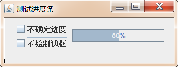

**演示代码：**

```java
import javax.swing.*;
import java.awt.*;
import java.awt.event.ActionEvent;
import java.awt.event.ActionListener;

public class JProgressTest {

    JFrame jf = new JFrame("测试进度条");
    //创建一个垂直进度条
    JProgressBar bar = new JProgressBar(JProgressBar.HORIZONTAL);

    JCheckBox indeterminate = new JCheckBox("不确定进度");
    JCheckBox noBorder = new JCheckBox("不绘制边框");

    public void init(){

        Box box = new Box(BoxLayout.Y_AXIS);
        box.add(indeterminate);
        box.add(noBorder);

        jf.setLayout(new FlowLayout());
        jf.add(box);

        //把进度条添加到jf窗口中
        jf.add(bar);

        //设置进度条的最大值和最小值
        bar.setMinimum(0);
        bar.setMaximum(100);

        //设置进度条中绘制完成百分比
        bar.setStringPainted(true);

        //根据选择决定是否绘制进度条边框
        noBorder.addActionListener(new ActionListener() {
            @Override
            public void actionPerformed(ActionEvent e) {
                boolean flag = noBorder.isSelected();
                bar.setBorderPainted(!flag);
            }
        });

        //根据选择决定是否是不确定进度条
        indeterminate.addActionListener(new ActionListener() {
            @Override
            public void actionPerformed(ActionEvent e) {
                boolean flag = indeterminate.isSelected();
                bar.setIndeterminate(flag);
                //不绘制百分比，因为之前设置了绘制百分比
                bar.setStringPainted(!flag);
            }
        });

        jf.setDefaultCloseOperation(JFrame.EXIT_ON_CLOSE);
        jf.pack();
        jf.setVisible(true);


        //通过循环不断改变进度条的完成进度
        for (int i = 0; i <= 100; i++) {
            //改变进度条的完成进度
            bar.setValue(i);

            try {
                Thread.sleep(1000);
            } catch (InterruptedException e) {
                e.printStackTrace();
            }
        }

    }

    public static void main(String[] args) {
        new JProgressTest().init();
    }
}

```

在刚才的程序中，通过for循环来不断的更新进度条的进度，这仅仅是为了演示而已，实际开发中这样的操作是没有意义的。通常情况下是不断的检测一个耗时任务的完成情况，然后才去更新进度条的进度。下面的代码通过Timer定时器和Runnable接口，对上述代码进行改进，其运行结果没有变化，知识修改到了进度条进度更新的逻辑。

```java
import javax.swing.*;
import javax.swing.event.ChangeEvent;
import javax.swing.event.ChangeListener;
import java.awt.*;
import java.awt.event.ActionEvent;
import java.awt.event.ActionListener;

public class JProgressTest2 {

    JFrame jf = new JFrame("测试进度条");
    //创建一个垂直进度条
    JProgressBar bar = new JProgressBar(JProgressBar.HORIZONTAL);

    JCheckBox indeterminate = new JCheckBox("不确定进度");
    JCheckBox noBorder = new JCheckBox("不绘制边框");

    public void init(){

        Box box = new Box(BoxLayout.Y_AXIS);
        box.add(indeterminate);
        box.add(noBorder);

        jf.setLayout(new FlowLayout());
        jf.add(box);

        //把进度条添加到jf窗口中
        jf.add(bar);

        //开启耗时任务
        SimulatedActivity simulatedActivity = new SimulatedActivity(100);
        new Thread(simulatedActivity).start();


        //设置进度条的最大值和最小值
        bar.setMinimum(0);
        bar.setMaximum(simulatedActivity.getAmount());

        //设置进度条中绘制完成百分比
        bar.setStringPainted(true);

        //根据选择决定是否绘制进度条边框
        noBorder.addActionListener(new ActionListener() {
            @Override
            public void actionPerformed(ActionEvent e) {
                boolean flag = noBorder.isSelected();
                bar.setBorderPainted(!flag);
            }
        });

        //根据选择决定是否是不确定进度条
        indeterminate.addActionListener(new ActionListener() {
            @Override
            public void actionPerformed(ActionEvent e) {
                boolean flag = indeterminate.isSelected();
                bar.setIndeterminate(flag);
                //不绘制百分比，因为之前设置了绘制百分比
                bar.setStringPainted(!flag);
            }
        });

        jf.setDefaultCloseOperation(JFrame.EXIT_ON_CLOSE);
        jf.pack();
        jf.setVisible(true);


        //通过定时器，不断的读取simulatedActivity中的current值，更新进度条的进度
        Timer timer = new Timer(300, new ActionListener() {
            @Override
            public void actionPerformed(ActionEvent e) {
                bar.setValue(simulatedActivity.getCurrent());
            }
        });
        timer.start();
        //监听进度条的变化，如果进度完成为100%，那么停止定时器
        bar.addChangeListener(new ChangeListener() {
            @Override
            public void stateChanged(ChangeEvent e) {
                if (   bar.getValue()==bar.getMaximum()){
                    timer.stop();
                }
            }
        });


    }

    public static void main(String[] args) {
        new JProgressTest2().init();
    }

    //定义一个线程任务，模拟耗时操作
    private class SimulatedActivity implements Runnable{
        //内存可见
        private volatile int current = 0;
        private int amount;

        public SimulatedActivity(int amount) {
            this.amount = amount;
        }

        public int getCurrent() {
            return current;
        }

        public void setCurrent(int current) {
            this.current = current;
        }


        public int getAmount() {
            return amount;
        }

        public void setAmount(int amount) {
            this.amount = amount;
        }

        @Override
        public void run() {
            //通过循环，不断的修改current的值，模拟任务完成量
            while(current<amount){
                try {
                    Thread.sleep(50);
                } catch (InterruptedException e) {
                    e.printStackTrace();
                }
                current++;
            }
        }
    }
}

```

之前我们学习过，其实Swing中很多组件的界面与数据都采用了MVC的设计思想：

​	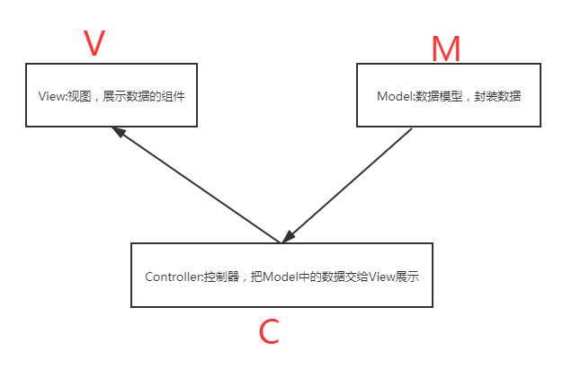

Swing 组件大都将外观显示和 内部数据分离 ， JProgressBar 也不例外， JProgressBar 组件有一个内置的用于保存其状态数据的Model对象 ， 这个对象由BoundedRangeModel对象表示，程序调用JProgressBar对象的方法完成进度百分比的设置，监听进度条的数据变化，其实都是通过它内置的BoundedRangeModel对象完成的。下面的代码是对之前代码的改进，通过BoundedRangeModel完成数据的设置，获取与监听。

```java
import javax.swing.*;
import javax.swing.event.ChangeEvent;
import javax.swing.event.ChangeListener;
import java.awt.*;
import java.awt.event.ActionEvent;
import java.awt.event.ActionListener;

public class JProgressTest3 {

    JFrame jf = new JFrame("测试进度条");
    //创建一个垂直进度条
    JProgressBar bar = new JProgressBar(JProgressBar.HORIZONTAL);

    JCheckBox indeterminate = new JCheckBox("不确定进度");
    JCheckBox noBorder = new JCheckBox("不绘制边框");

    public void init(){

        Box box = new Box(BoxLayout.Y_AXIS);
        box.add(indeterminate);
        box.add(noBorder);

        jf.setLayout(new FlowLayout());
        jf.add(box);

        //把进度条添加到jf窗口中
        jf.add(bar);

        //开启耗时任务
        SimulatedActivity simulatedActivity = new SimulatedActivity(100);
        new Thread(simulatedActivity).start();


        //设置进度条的最大值和最小值
        bar.getModel().setMinimum(0);
        bar.getModel().setMaximum(simulatedActivity.getAmount());

        //设置进度条中绘制完成百分比
        bar.setStringPainted(true);

        //根据选择决定是否绘制进度条边框
        noBorder.addActionListener(new ActionListener() {
            @Override
            public void actionPerformed(ActionEvent e) {
                boolean flag = noBorder.isSelected();
                bar.setBorderPainted(!flag);
            }
        });

        //根据选择决定是否是不确定进度条
        indeterminate.addActionListener(new ActionListener() {
            @Override
            public void actionPerformed(ActionEvent e) {
                boolean flag = indeterminate.isSelected();
                bar.setIndeterminate(flag);
                //不绘制百分比，因为之前设置了绘制百分比
                bar.setStringPainted(!flag);
            }
        });

        jf.setDefaultCloseOperation(JFrame.EXIT_ON_CLOSE);
        jf.pack();
        jf.setVisible(true);


        //通过定时器，不断的读取simulatedActivity中的current值，更新进度条的进度
        Timer timer = new Timer(300, new ActionListener() {
            @Override
            public void actionPerformed(ActionEvent e) {
                bar.getModel().setValue(simulatedActivity.getCurrent());
            }
        });
        timer.start();
        //监听进度条的变化，如果进度完成为100%，那么停止定时器
        bar.getModel().addChangeListener(new ChangeListener() {
            @Override
            public void stateChanged(ChangeEvent e) {
                if (   bar.getModel().getValue()==bar.getModel().getMaximum()){
                    timer.stop();
                }
            }
        });


    }

    public static void main(String[] args) {
        new JProgressTest3().init();
    }

    //定义一个线程任务，模拟耗时操作
    private class SimulatedActivity implements Runnable{
        //内存可见
        private volatile int current = 0;
        private int amount;

        public SimulatedActivity(int amount) {
            this.amount = amount;
        }

        public int getCurrent() {
            return current;
        }

        public void setCurrent(int current) {
            this.current = current;
        }


        public int getAmount() {
            return amount;
        }

        public void setAmount(int amount) {
            this.amount = amount;
        }

        @Override
        public void run() {
            //通过循环，不断的修改current的值，模拟任务完成量
            while(current<amount){
                try {
                    Thread.sleep(50);
                } catch (InterruptedException e) {
                    e.printStackTrace();
                }
                current++;
            }
        }
    }
}
```

### 3.4.2 创建进度对话框

ProgressMonitor的用法与JProgressBa 的用法基本相似，只是ProgressMonitor可以直接创 建一个进度对话框，它提供了下面的构造器完成对话框的创建：

```java
 public ProgressMonitor(Component parentComponent,Object message,String note, int min,int max):
	parentComponent:对话框的父组件
	message:对话框的描述信息
	note:对话框的提示信息
	min:进度条的最小值
	max:进度条的最大值
```

使用 ProgressMonitor 创建的对话框里包含的进度条是非常固定的，程序甚至不能设置该进度条是否包含边框(总是包含边框) ， 不能设置进度不确定，不能改变进度条的方向(总是水平方向) 。

**案例：**

​	使用ProgressMonitor完成下图效果：

​	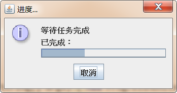


**演示代码：**

```java
import javax.swing.*;
import java.awt.event.ActionEvent;
import java.awt.event.ActionListener;

public class ProgressMonitorTest {

    Timer timer;
    public void init(){
        final SimulatedActivity simulatedActivity = new SimulatedActivity(100);
        final Thread targetThread= new Thread(simulatedActivity);
        targetThread.start();


        ProgressMonitor dialog = new ProgressMonitor(null, "等待任务完成", "已完成：", 0, simulatedActivity.getAmount());

        timer = new Timer(300, new ActionListener() {
            @Override
            public void actionPerformed(ActionEvent e) {
                dialog.setProgress(simulatedActivity.getCurrent());
                if (dialog.isCanceled()){
                    timer.stop();
                    targetThread.interrupt();
                    System.exit(0);
                }
            }
        });
        timer.start();


        System.out.println("aaa");
    }

    public static void main(String[] args) {
        new ProgressMonitorTest().init();
    }

    //定义一个线程任务，模拟耗时操作
    private class SimulatedActivity implements Runnable{
        //内存可见
        private volatile int current = 0;
        private int amount;

        public SimulatedActivity(int amount) {
            this.amount = amount;
        }

        public int getCurrent() {
            return current;
        }

        public void setCurrent(int current) {
            this.current = current;
        }


        public int getAmount() {
            return amount;
        }

        public void setAmount(int amount) {
            this.amount = amount;
        }

        @Override
        public void run() {
            //通过循环，不断的修改current的值，模拟任务完成量
            while(current<amount){
                try {
                    Thread.sleep(50);
                } catch (InterruptedException e) {
                    e.printStackTrace();
                }
                current++;
            }
        }
    }

}
```

## 3.5 JList、JComboBox实现列表框

无论从哪个角度来看， JList 和 JComboBox 都是极其相似的，它们都有一个列表框，只是 JComboBox的列表框需要 以下拉方式显示出来; JList 和 JComboBox 都可以通过调用 setRendererO方法来改变列表项的表现形式 。甚至维护这两个组件的 Model 都是相似的， JList 使用 ListModel, JComboBox 使用ComboBoxModel ，而 ComboBoxModel 是 ListModel 的子类 。

### 3.5.1 简单列表框

使用JList或JComboBox实现简单列表框的步骤：

1. 创建JList或JComboBox对象

```java
JList(final E[] listData):创建JList对象，把listData数组中的每项内容转换成一个列表项展示
JList(final Vector<? extends E> listData):创建JList对象，把listData数组中的每项内容转换成一个列表项展示
JComboBox(E[] items):
JComboBox(Vector<E> items):
```

2. 设置JList或JComboBox的外观行为

```java
---------------------------JList----------------------------------------------
addSelectionInterval(int anchor, int lead):在已经选中列表项的基础上，增加选中从anchor到lead索引范围内的所有列表项
setFixedCellHeight(int height)/setFixedCellWidth(int width):设置列表项的高度和宽度
setLayoutOrientation(int layoutOrientation)：设置列表框的布局方向
setSelectedIndex(int index)：设置默认选中项
setSelectedIndices(int[] indices)：设置默认选中的多个列表项
setSelectedValue(Object anObject,boolean shouldScroll)：设置默认选中项，并滚动到该项显示
setSelectionBackground(Color selectionBackground)：设置选中项的背景颜色
setSelectionForeground(Color selectionForeground)：设置选中项的前景色
setSelectionInterval(int anchor, int lead):设置从anchor到lead范围内的所有列表项被选中
setSelectionMode(int selectionMode)：设置选中模式，默认没有限制，也可以设置为单选或者区域选中
setVisibleRowCount(int visibleRowCount)：设置列表框的可是高度足以显示多少行列表项
---------------------------JComboBox---------------------------------------------- 
setEditable(boolean aFlag)：设置是否可以直接修改列表文本框的值，默认为不可以
setMaximumRowCount(int count)：设置列表框的可是高度足以显示多少行列表项
setSelectedIndex(int anIndex)：设置默认选中项
setSelectedItem(Object anObject)：根据列表项的值，设置默认选中项
```

3. 设置监听器，监听列表项的变化，JList通过addListSelectionListener完成，JComboBox通过addItemListener完成

**案例：**

​	使用JList和JComboBox完成下图效果：

​	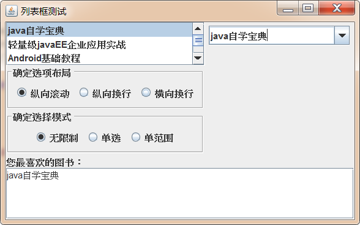

**演示代码：**

```java
import javax.swing.*;
import javax.swing.border.EtchedBorder;
import javax.swing.border.TitledBorder;
import javax.swing.event.ListSelectionEvent;
import javax.swing.event.ListSelectionListener;
import java.awt.*;
import java.awt.event.ItemEvent;
import java.awt.event.ItemListener;
import java.util.List;
import java.util.Vector;

public class ListTest {
    JFrame mainWin = new JFrame("列表框测试");
    String[] books = {"java自学宝典","轻量级javaEE企业应用实战","Android基础教程","jQuery实战教程","SpringBoot企业级开发"};

    //用一个字符串数组来创建一个JList对象
    JList<String> bookList = new JList<>(books);
    JComboBox<String> bookSelector;

    //定义 布局选择按钮 所在的面板
    JPanel layoutPanel = new JPanel();
    ButtonGroup layoutGroup = new ButtonGroup();

    //定义 选择模式按钮 所在面板
    JPanel selectModePanel = new JPanel();
    ButtonGroup selectModeGroup = new ButtonGroup();

    JTextArea favorite = new JTextArea(4,40);

    public void init(){
        //设置JList的可视高度可以同时展示3个列表项
        bookList.setVisibleRowCount(3);

        //设置Jlist默认选中第三项到第五项
        bookList.setSelectionInterval(2,4);
        addLayoutButton("纵向滚动",JList.VERTICAL);
        addLayoutButton("纵向换行",JList.VERTICAL_WRAP);
        addLayoutButton("横向换行",JList.HORIZONTAL_WRAP);

        addSelectModeButton("无限制", ListSelectionModel.MULTIPLE_INTERVAL_SELECTION);
        addSelectModeButton("单选", ListSelectionModel.SINGLE_SELECTION);
        addSelectModeButton("单范围", ListSelectionModel.SINGLE_INTERVAL_SELECTION);

        Box listBox = Box.createVerticalBox();
        //将JList组件放置到JScrollPane中，并将JScrollPane放置到box中
        listBox.add(new JScrollPane(bookList));
        listBox.add(layoutPanel);
        listBox.add(selectModePanel);

        //为JList添加事件监听器
        bookList.addListSelectionListener(new ListSelectionListener() {
            @Override
            public void valueChanged(ListSelectionEvent e) {
                List<String> selectedValuesList = bookList.getSelectedValuesList();
                favorite.setText("");
                for (String s : selectedValuesList) {
                    favorite.append(s+"\n");
                }
            }
        });


        //定义一个Vector对象
        Vector<String> bookCollection = new Vector<>();
        List<String> books = List.of("java自学宝典","轻量级javaEE企业应用实战","Android基础教程","jQuery实战教程","SpringBoot企业级开发");
        bookCollection.addAll(books);

        //创建JComboBox对象
        bookSelector = new JComboBox<>(bookCollection);

        //为JComboBox添加事件监听器
        bookSelector.addItemListener(new ItemListener() {
            @Override
            public void itemStateChanged(ItemEvent e) {
                Object selectedItem = bookSelector.getSelectedItem();
                favorite.setText(selectedItem.toString());
            }
        });

        //设置JComboBox的列表项可编辑
        bookSelector.setEditable(true);

        //设置下拉列表的可视高度最多显示4个列表项
        bookSelector.setMaximumRowCount(4);

        JPanel panel = new JPanel();
        panel.add(bookSelector);
        Box box = Box.createHorizontalBox();
        box.add(listBox);
        box.add(panel);

        JPanel favoritePanel = new JPanel();
        favoritePanel.setLayout(new BorderLayout());
        favoritePanel.add(new JScrollPane(favorite));
        favoritePanel.add(new JLabel("您最喜欢的图书："),BorderLayout.NORTH);

        mainWin.add(box);
        mainWin.add(favoritePanel,BorderLayout.SOUTH);
        mainWin.setDefaultCloseOperation(JFrame.EXIT_ON_CLOSE);
        mainWin.pack();
        mainWin.setVisible(true);

    }


    public void addLayoutButton(String label,int orientation){
        layoutPanel.setBorder(new TitledBorder(new EtchedBorder(),"确定选项布局"));

        JRadioButton button = new JRadioButton(label);

        layoutPanel.add(button);
        //默认选中第一个按钮
        if (layoutGroup.getButtonCount()==0){
            button.setSelected(true);
        }
        layoutGroup.add(button);
        button.addActionListener(e->{
            //改变列表框里列表项的布局方向
            bookList.setLayoutOrientation(orientation);
        });

    }

    public void addSelectModeButton(String label,int selectMode){
        selectModePanel.setBorder(new TitledBorder(new EtchedBorder(),"确定选择模式"));
        JRadioButton button = new JRadioButton(label);
        selectModePanel.add(button);
        if (selectModeGroup.getButtonCount()==0){
            button.setSelected(true);
        }
        selectModeGroup.add(button);
        button.addActionListener(e->{
            bookList.setSelectionMode(selectMode);
        });


    }

    public static void main(String[] args) {
        new ListTest().init();
    }
}
```

### 3.5.2 不强制存储列表项的ListModel和ComboBoxModel

与JProgressBar一样，JList和JComboBox也采用了MVC的设计模式，JList和JComboBox只负责外观的显示，而组件底层的状态数据则由对应的Model来维护。JList对应的Model是ListModel接口，JComboBox对应的Model是ComboBox接口，其代码如下：

```java
public interface ListModel<E>{

  int getSize();

  E getElementAt(int index);

  void addListDataListener(ListDataListener l);

  void removeListDataListener(ListDataListener l);
}

public interface ComboBoxModel<E> extends ListModel<E> {

  void setSelectedItem(Object anItem);

  Object getSelectedItem();
}
```

从上面接口来看，这个 ListMode l 不管 JList 里的所有列表项的存储形式，它甚至不强制存储所有的列表项，只要 ListModel的实现类提供了getSize()和 getElementAt()两个方法 ， JList 就可以根据该ListModel 对象来生成列表框 。ComboBoxModel 继承了 ListModel ，它添加了"选择项"的概念，选择项代表 JComboBox 显示区域内可见的列表项 。 

在使用JList和JComboBox时，除了可以使用jdk提供的Model实现类，程序员自己也可以根据需求，自己定义Model的实现类，实现对应的方法使用。

**案例：**

​	自定义NumberListModel和NumberComboBoxModel实现类，允许使用数值范围来创建JList和JComboBox

​	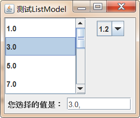

**演示代码：**

```java
import javax.swing.*;
import java.math.BigDecimal;
import java.math.RoundingMode;

public class NumberListModel extends AbstractListModel<BigDecimal> {

    protected BigDecimal start;
    protected BigDecimal end;
    protected BigDecimal step;


    public NumberListModel(double start,double end,double step) {
        this.start = new BigDecimal(start);
        this.end = new BigDecimal(end);
        this.step = new BigDecimal(step);
    }

    @Override
    public int getSize() {
        int floor = (int) Math.floor(end.subtract(start).divide(step,2, RoundingMode.HALF_DOWN).doubleValue());
        return floor+1;
    }

    @Override
    public BigDecimal getElementAt(int index) {
        return BigDecimal.valueOf(index).multiply(step).add(start).setScale(1,RoundingMode.HALF_DOWN);
    }
}


import javax.swing.*;
import java.math.BigDecimal;
import java.math.RoundingMode;

public class NumberComboBoxModel extends NumberListModel implements ComboBoxModel<BigDecimal> {
    //用于保存用户选中项的索引
    private int selectId = 0;

    public NumberComboBoxModel(double start, double end, double step) {
        super(start, end, step);
    }

    //设置选择项
    @Override
    public void setSelectedItem(Object anItem) {
        if (anItem instanceof BigDecimal){
            BigDecimal target = (BigDecimal) anItem;
            selectId = target.subtract(super.start).divide(super.step,2, RoundingMode.HALF_DOWN).intValue();
        }
    }

    //获取选中项的索引
    @Override
    public BigDecimal getSelectedItem() {
         return BigDecimal.valueOf(selectId).multiply(step).add(start).setScale(1,RoundingMode.HALF_DOWN);

    }
}


import javax.swing.*;
import javax.swing.event.ListSelectionEvent;
import javax.swing.event.ListSelectionListener;
import java.awt.*;
import java.awt.event.ItemEvent;
import java.awt.event.ItemListener;
import java.math.BigDecimal;
import java.util.List;

public class ListModelTest {
    JFrame mainWin = new JFrame("测试ListModel");

    //根据NumberListModel对象创建一个JList
    JList<BigDecimal> numScopeList = new JList<>(new NumberListModel(1,21,2));

    //根据NumberComboBoxModel对象创建一个JComboBox
    JComboBox<BigDecimal> numScopeSelector = new JComboBox<>(new NumberComboBoxModel(0.1,1.2,0.1));

    JTextField showVal = new JTextField(10);

    public void init(){
        //JList可视高度可同时显示四个列表项
        numScopeList.setVisibleRowCount(4);

        //默认选中第三项到第五项
        numScopeList.setSelectionInterval(2,4);

        //设置每个列表项具有指定高度和宽度
        numScopeList.setFixedCellHeight(30);
        numScopeList.setFixedCellWidth(90);

        //为numScopeList添加监听器
        numScopeList.addListSelectionListener(new ListSelectionListener() {
            @Override
            public void valueChanged(ListSelectionEvent e) {
                //获取用户选中的所有数字
                List<BigDecimal> selectedValuesList = numScopeList.getSelectedValuesList();
                showVal.setText("");
                for (BigDecimal bigDecimal : selectedValuesList) {
                    showVal.setText(showVal.getText()+bigDecimal.toString()+", ");
                }
            }
        });

        //设置下拉列表的可视高度可显示5个列表项
        numScopeSelector.setMaximumRowCount(5);

        Box box = Box.createHorizontalBox();
        box.add(new JScrollPane(numScopeList));

        JPanel p = new JPanel();
        p.add(numScopeSelector);
        box.add(p);

        //为numberScopeSelector添加监听器
        numScopeSelector.addItemListener(new ItemListener() {
            @Override
            public void itemStateChanged(ItemEvent e) {
                Object value = numScopeSelector.getSelectedItem();
                showVal.setText(value.toString());
            }
        });


        JPanel bottom = new JPanel();
        bottom.add(new JLabel("您选择的值是："));
        bottom.add(showVal);

        mainWin.add(box);
        mainWin.add(bottom, BorderLayout.SOUTH);
        mainWin.setDefaultCloseOperation(JFrame.EXIT_ON_CLOSE);
        mainWin.pack();
        mainWin.setVisible(true);

    }

    public static void main(String[] args) {
        new ListModelTest().init();
    }
}
```

### 3.5.3 强制存储列表项的DefaultListModel和DefaultComboBoxModel

前面只是介绍了如何创建 JList 、 JComboBox 对象， 当 调用 JList 和 JComboBox构造方法时时传入数组或 Vector 作为参数，这些数组元素或集合元素将会作为列表项。当使用JList 或 JComboBox 时 常常还需要动态地增加、删除列表项,例如JCombox提供了下列方法完成增删操作：

```java
addItem(E item):添加一个列表项
insertItemAt(E item, int index)：向指定索引处插入一个列表项
removeAllItems()：删除所有列表项
removeItem(Object anObject)：删除指定列表项
removeItemAt(int anIndex)：删除指定索引处的列表项
```

JList 并没有提供这些类似的方法。如果需要创建一个可以增加、删除列表项的 JList 对象，则应该在创建 JLi st 时显式使用 DefaultListModel作为构造参数 。因为 DefaultListModel 作为 JList 的 Model，它负责维护 JList 组件的所有列表数据，所以可以通过向 DefaultListModel 中添加、删除元素来实现向 JList 对象中增加 、删除列表项 。DefaultListModel 提供了如下几个方法来添加、删除元素:

```java
add(int index, E element): 在该 ListModel 的指定位置处插入指定元素 。
addElement(E obj): 将指定元素添加到该 ListModel 的末尾 。
insertElementAt(E obj, int index): 在该 ListModel 的指定位置处插入指定元素 。
Object remove(int index): 删除该 ListModel 中指定位置处的元素 
removeAllElements(): 删 除该 ListModel 中的所有元素，并将其的大小设置为零 。
removeElement(E obj): 删除该 ListModel 中第一个与参数匹配的元素。
removeElementAt(int index): 删除该 ListModel 中指定索引处的元素 。
removeRange(int 企omIndex ， int toIndex): 删除该 ListModel 中指定范围内的所有元素。
set(int index, E element) : 将该 ListModel 指定索引处的元素替换成指定元素。
setElementAt(E obj, int index): 将该 ListModel 指定索引处的元素替换成指定元素。
```

**案例：**

​	使用DefaultListModel完成下图效果：

​	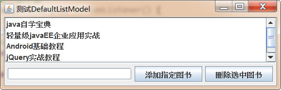

**演示代码：**

```java
import javax.swing.*;
import java.awt.*;
import java.awt.event.ActionEvent;
import java.awt.event.ActionListener;

public class DefaultListModelTest {

    JFrame mainWin = new JFrame("测试DefaultListModel");

    //定义一个JList对象
    JList<String> bookList;
    //定义一个DefaultListModel对象
    DefaultListModel<String> bookModel = new DefaultListModel<>();

    JTextField bookName = new JTextField(20);

    JButton removeBtn = new JButton("删除选中图书");
    JButton addBtn = new JButton("添加指定图书");

    public void init(){
        //向bookModel中添加元素
        bookModel.addElement("java自学宝典");
        bookModel.addElement("轻量级javaEE企业应用实战");
        bookModel.addElement("Android基础教程");
        bookModel.addElement("jQuery实战教程");
        bookModel.addElement("SpringBoot企业级开发");

        //根据DefaultListModel创建一个JList对象
        bookList = new JList<>(bookModel);
        //设置最大可视高度
        bookList.setVisibleRowCount(4);

        //设置只能单选
        bookList.setSelectionMode(ListSelectionModel.SINGLE_SELECTION);

        //为addBtn添加事件监听器
        addBtn.addActionListener(new ActionListener() {
            @Override
            public void actionPerformed(ActionEvent e) {
                //当bookName文本框内容不为空时添加列表项
                if (!bookName.getText().trim().equals("")){

                    bookModel.addElement(bookName.getText());
                }

            }
        });

        //为removeBtn添加事件监听器
        removeBtn.addActionListener(new ActionListener() {
            @Override
            public void actionPerformed(ActionEvent e) {
                int selectedIndex = bookList.getSelectedIndex();
                if (selectedIndex>=0){

                    bookModel.remove(selectedIndex);
                }
            }
        });

        JPanel p = new JPanel();
        p.add(bookName);
        p.add(addBtn);
        p.add(removeBtn);

        mainWin.add(new JScrollPane(bookList));
        mainWin.add(p, BorderLayout.SOUTH);
        mainWin.setDefaultCloseOperation(JFrame.EXIT_ON_CLOSE);
        mainWin.pack();
        mainWin.setVisible(true);

    }

    public static void main(String[] args) {
        new DefaultListModelTest().init();
    }

}

```

### 3.5.4 使用ListCellRenderer改变列表外观

前面程序中的 JList 和 JComboBox 采用的都是简单的字符串列表项， 实际上 ， JList 和 JComboBox还可以支持图标列表项，如果在创建 JList 或 JComboBox 时传入图标数组，则创建的 JList 和 JComboBox的列表项就是图标 。

如果希望列表项是更复杂 的组件，例如，希望像 QQ 程序那样每个列表项既有图标，此时需要使用ListCellRenderer接口的实现类对象，自定义每个条目组件的渲染过程：

```java
public interface ListCellRenderer<E>
{
    Component getListCellRendererComponent(
        JList<? extends E> list,//列表组件
        E value,//当前列表项的值额索引
        int index,//当前列表项d
        boolean isSelected,//当前列表项是否被选中
        boolean cellHasFocus);//当前列表项是否获取了焦点
}
```

通过JList的`setCellRenderer(ListCellRenderer<? super E> cellRenderer)`方法，把自定义的ListCellRenderer对象传递给JList，就可以按照自定义的规则绘制列表项组件了。


**案例：**

​	使用ListCellRenderer实现下图效果：

​	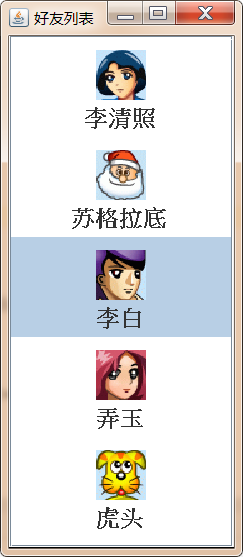

**演示代码：**

```java
import cn.itcast.swing.util.ImagePathUtil;

import javax.swing.*;
import java.awt.*;

public class ListCellRendererTest {

    private JFrame mainWin = new JFrame("好友列表");

    private String[] friends = {
            "李清照",
            "苏格拉底",
            "李白",
            "弄玉",
            "虎头"
    };

    //定义一个JList对象
    JList friendsList = new JList(friends);

    public void init() {
        //设置JList使用ImageCellRenderer作为列表项绘制器
        friendsList.setCellRenderer(new ImageCellRenderer());

        mainWin.add(new JScrollPane(friendsList));
        mainWin.setDefaultCloseOperation(JFrame.EXIT_ON_CLOSE);
        mainWin.pack();
        mainWin.setVisible(true);

    }


    public static void main(String[] args) {
        new ListCellRendererTest().init();
    }

    class ImageCellRenderer extends JPanel implements ListCellRenderer {


        private ImageIcon icon;
        private String name;
        //定义绘制单元格的背景色
        private Color background;
        //定义绘制单元格的前景色
        private Color foreground;


        @Override
        public Component getListCellRendererComponent(JList list, Object value, int index, boolean isSelected, boolean cellHasFocus) {

            icon = new ImageIcon(ImagePathUtil.getRealPath("9\\" + value + ".gif"));
            name = value.toString();
            background = isSelected ? list.getSelectionBackground() : list.getBackground();
            foreground = isSelected ? list.getSelectionForeground() : list.getForeground();

            //返回当前JPanel对象，作为列表项绘制器
            return this;
        }

        @Override
        protected void paintComponent(Graphics g) {
            int width = icon.getImage().getWidth(null);
            int height = icon.getImage().getHeight(null);

            //填充背景矩形
            g.setColor(background);
            g.fillRect(0,0,getWidth(),getHeight());

            g.setColor(foreground);
            //绘制好友头像
            g.drawImage(icon.getImage(),getWidth()/2-width/2,10,null);

            //绘制好友昵称
            g.setFont(new Font("SansSerif",Font.BOLD,18));
            g.drawString(name,getWidth()/2-name.length()*10,height+30);
        }


        @Override
        public Dimension getPreferredSize() {
            return new Dimension(60,80);
        }
    }
}
```


## 3.6 JTree、TreeModel实现树

树也是图形用户界面中使用非常广泛的 GUI 组件，例如使用 Windows 资源管理器时，将看到如下图所示的目录树:

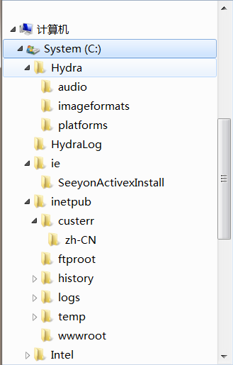


如上图所示的树，代表计算机世界里的树，它从自然界实际的树抽象而来 。 计算机世界里的树是由一系列具有严格父子关系的节点组成的，每个节点既可以是其上一级节点的子节点，也可以是其下一级节点的父节点，因此同一个节点既可以是父节点，也可以是子节点(类似于一个人，他既是他儿子的父亲，又是他父亲的儿子)。

**按照结点是否包含子结点，可以把结点分为下面两类：**

​	普通结点：包含子结点的结点；

​	叶子结点：没有子结点的结点；

**按照结点是否具有唯一的父结点，可以把结点分为下面两类：**

​	根结点：没有父结点的结点，计算机中，一棵树只能有一个根结点

​	普通结点：具有唯一父结点的结点

使用 Swing 里的 Jtree 、 TreeModel 及其相关的辅助类可以很轻松地开发出计算机世界里的树。

### 3.6.1 创建树

Swing 使用 JTree 对 象来代表一棵树，JTree 树中结点可以使用 TreePath 来标识，该对象封装了当前结点及其所有的父结点。

**当一个结点具有子结点时，该结点有两种状态：**

​	展开状态:当父结点处于展开状态时，其子结点是可见的；

​	折叠状态: 当父结点处于折叠状态时，其子结点都是不可见的 。

如果某个结点是可见的，则该结点的父结点(包括直接的、间接的父结点)都必须处于展开状态，只要有任意一个父结点处于折叠状态，该结点就是不可见的 。

**JTree常用构造方法：**

```java
JTree(TreeModel newModel):使用指定 的数据模型创建 JTree 对象，它默认显示根结点。
JTree(TreeNode root): 使用 root 作为根节 点创建 JTree 对象，它默认显示根结点 。
JTree(TreeNode root, boolean asksAllowsChildren): 使用root作为根结点创建JTree对象，它默认显示根结点。 asksAllowsChildren 参数控制怎样的结点才算叶子结点，如果该参数为 true ，则只有当程序使用 setAllowsChildren(false)显式设置某个结点不允许添加子结点时(以后也不会拥有子结点) ，该结点才会被 JTree 当成叶子结点:如果该参数为 false ，则只要某个结点当时没有子结点(不管以后是否拥有子结点) ，该结点都会被 JTree 当成叶子结点。
```

**TreeNode继承体系及使用：**

​		

在构建目录树时，可以先创建很多DefaultMutableTreeNode对象，并调用他们的add方法构建好子父级结构，最后根据根结点构建一个JTree即可。

**案例：**

​	使用JTree和TreeNode完成下图效果：

​	

**演示代码：**

```java
import javax.swing.*;
import javax.swing.tree.DefaultMutableTreeNode;

public class SimpleJTree {
    JFrame jf = new JFrame("简单树");

    JTree tree;
    DefaultMutableTreeNode root;
    DefaultMutableTreeNode guangdong;
    DefaultMutableTreeNode guangxi;
    DefaultMutableTreeNode foshan;
    DefaultMutableTreeNode shantou;
    DefaultMutableTreeNode guilin;
    DefaultMutableTreeNode nanning;

    public void init(){
        //依次创建所有结点
        root = new DefaultMutableTreeNode("中国");
        guangdong = new DefaultMutableTreeNode("广东");
        guangxi = new DefaultMutableTreeNode("广西");
        foshan = new DefaultMutableTreeNode("佛山");
        shantou = new DefaultMutableTreeNode("汕头");
        guilin = new DefaultMutableTreeNode("桂林");
        nanning = new DefaultMutableTreeNode("南宁");


        //通过add()方法建立父子层级关系
        guangdong.add(foshan);
        guangdong.add(shantou);
        guangxi.add(guilin);
        guangxi.add(nanning);
        root.add(guangdong);
        root.add(guangxi);

        //依据根结点，创建JTree
        tree = new JTree(root);

        jf.add(new JScrollPane(tree));
        jf.setDefaultCloseOperation(JFrame.EXIT_ON_CLOSE);
        jf.pack();
        jf.setVisible(true);

    }


    public static void main(String[] args) {
        new SimpleJTree().init();
    }
}
```

**JTree的其他外观设置方法：**

```java
tree.putClientProperty( "JTree.lineStyle", "None"):设置结点之间没有连接线
tree.putClientProperty("JTree.lineStyle" , "Horizontal")：设置结点之间只有水平分割线
tree.setShowsRootHandles(true)：设置根结点有"展开、折叠"图标
tree.setRootVisible(false)：隐藏根结点
```

**DefaultMutableTreeNode其他成员方法：**

```java
Enumeration breadthFirstEnumerationO/preorderEnumeration(): 按广度优先的顺序遍历以此结点为根的子树，并返回所有结点组成的枚举对象 。
Enumeration depthFirstEnumerationO/postorderEnumeration(): 按深度优先的顺序遍历以此结点为根的子树，并返回所有结点组成的枚举对象 。
DefaultMutableTreeNode getNextSibling(): 返回此结点的下一个兄弟结点 。
TreeNode getParent(): 返回此结点的父结点 。 如果此结点没有父结点，则返回null 。
TreeNode[] getPath(): 返回从根结点到达此结点的所有结点组成的数组。
DefaultMutableTreeNode getPreviousSibling(): 返回此结点的上一个兄弟结点。
TreeNode getRoot(): 返回包含此结点的树的根结点 。
TreeNode getSharedAncestor(DefaultMutableTreeNode aNode): 返回此结点和aNode最近的共同祖先 。
int getSiblingCount(): 返回此结点的兄弟结点数 。
boolean isLeaf(): 返回该结点是否是叶子结点 。
boolean isNodeAncestor(TreeNode anotherNode): 判断anotherNode是否是当前结点的祖先结点(包括父结点) 。
boolean isNodeChild(TreeNode aNode): 如果aNode是此结点的子结点，则返回true。
boolean isNodeDescendant(DefaultMutableTreeNode anotherNode): 如果 anotherNode 是此结点的后代，包括是此结点本身、此结点的子结点或此结点的子结点的后代，都将返回true 。
boolean isNodeRelated(DefaultMutableTreeNode aNode) : 当aNode和当前结点位于同一棵树中时返回 true 。
boolean isNodeSibling(TreeNode anotherNode): 返回anotherNode是否是当前结点的兄弟结点 。
boolean isRoot(): 返回当前结点是否是根结点 。
Enumeration pathFromAncestorEnumeration(TreeNode ancestor): 返回从指定祖先结点到当前结点的所有结点组成的枚举对象 。
```

### 3.6.2 拖动、编辑树结点

JTree 生成的树默认是不可编辑的，不可以添加、删除结点，也不可以改变结点数据 :如果想让某个 JTree 对象变成可编辑状态，则可以调用 JTree 的setEditable(boolean b)方法，传入 true 即可把这棵树变成可编辑的树(可以添加、删除结点，也可以改变结点数据) 。

**编辑树结点的步骤：**

1. 获取当前被选中的结点：

```java
获取当前被选中的结点，会有两种方式：
	一：
		通过JTree对象的某些方法，例如 TreePath getSelectionPath()等，得到一个TreePath对象，包含了从根结点到当前结点路径上的所有结点；
		调用TreePath对象的 Object getLastPathComponent()方法，得到当前选中结点
	二：
		调用JTree对象的 Object getLastSelectedPathComponent() 方法获取当前被选中的结点
```

1. 调用DefaultTreeModel数据模型有关增删改的一系列方法完成编辑，方法执行完后，会自动重绘JTree

**案例：**

​	使用JTree以及DefaultTreeModel、DefaultMutableTreeNode、TreePath完成下图效果：

​	

**演示代码：**

```java
import javax.swing.*;
import javax.swing.tree.*;
import java.awt.*;
import java.awt.event.MouseAdapter;
import java.awt.event.MouseEvent;
import java.awt.event.MouseListener;

public class EditTree {

    JFrame jf ;
    JTree tree;

    //JTree关联的数据模型对象
    DefaultTreeModel model;

    //定义几个初始结点
    DefaultMutableTreeNode root = new DefaultMutableTreeNode("中国");
    DefaultMutableTreeNode guangdong = new DefaultMutableTreeNode("广东");
    DefaultMutableTreeNode guangxi = new DefaultMutableTreeNode("广西");
    DefaultMutableTreeNode foshan = new DefaultMutableTreeNode("佛山");
    DefaultMutableTreeNode shantou = new DefaultMutableTreeNode("汕头");
    DefaultMutableTreeNode guilin = new DefaultMutableTreeNode("桂林");
    DefaultMutableTreeNode nanning = new DefaultMutableTreeNode("南宁");

    //定义需要被拖动的TreePath
    TreePath movePath;

    //定义按钮，完成操作
    JButton addSiblingBtn = new JButton("添加兄弟结点");
    JButton addChildBtn = new JButton("添加子结点");
    JButton deleteBtn = new JButton("删除结点");
    JButton editBtn = new JButton("编辑当前结点");

    public void init(){

        //通过add()方法建立父子层级关系
        guangdong.add(foshan);
        guangdong.add(shantou);
        guangxi.add(guilin);
        guangxi.add(nanning);
        root.add(guangdong);
        root.add(guangxi);

        jf = new JFrame("可编辑结点的树");
        tree = new JTree(root);

        //获取JTree关联的数据模型TreeModel对象
        model = (DefaultTreeModel) tree.getModel();

        //设置JTree可编辑
        tree.setEditable(true);

        //创建鼠标事件监听器
        MouseListener ml = new MouseAdapter() {

            //按下鼠标时，获得被拖动的结点
            @Override
            public void mousePressed(MouseEvent e) {
                //如果需要唯一确定某个结点，则必须通过TreePath来获取
                TreePath tp = tree.getPathForLocation(e.getX(), e.getY());
                if (tp!=null){
                    movePath = tp;
                }
            }

            //松开树表示，确定即将被拖入到的父结点
            @Override
            public void mouseReleased(MouseEvent e) {

                TreePath tp = tree.getPathForLocation(e.getX(), e.getY());
                if (tp!=null && movePath!=null){
                    //阻止向子结点拖动
                    if (movePath.isDescendant(tp) && movePath!=tp){
                        JOptionPane.showMessageDialog(jf,"目标结点是被移动结点的子结点，无法移动！","非法移动",JOptionPane.WARNING_MESSAGE);
                    }
                    //不是向子结点移动，并且鼠标按下和松开也不是同一个结点

                    if (movePath!=tp){
                        //add方法内部，先将该结点从原父结点删除，然后再把该结点添加到新结点中
                        DefaultMutableTreeNode tartParentNode = (DefaultMutableTreeNode) tp.getLastPathComponent();
                        DefaultMutableTreeNode moveNode = (DefaultMutableTreeNode) movePath.getLastPathComponent();
                        tartParentNode.add(moveNode);

                        movePath=null;
                        tree.updateUI();
                    }
                }
            }
        };

        //为JTree添加鼠标监听器
        tree.addMouseListener(ml);

        JPanel panel = new JPanel();

        addSiblingBtn.addActionListener(e -> {
            //获取选中结点
            DefaultMutableTreeNode selectedNode = (DefaultMutableTreeNode) tree.getLastSelectedPathComponent();

            //如果结点为空，则直接返回
            if (selectedNode==null){
                return;
            }

            //获取该选中结点的父结点
            DefaultMutableTreeNode parent = (DefaultMutableTreeNode) selectedNode.getParent();

            //如果父结点为空，则直接返回
            if (parent==null){
                return;
            }

            //创建一个新结点
            DefaultMutableTreeNode newNode = new DefaultMutableTreeNode("新结点");

            //获取选中结点的索引
            int selectedIndex = parent.getIndex(selectedNode);

            //在选中位置插入新结点
            model.insertNodeInto(newNode,parent,selectedIndex);

            //----------显示新结点---------------
            //获取从根结点到新结点的所有结点
            TreeNode[] pathToRoot = model.getPathToRoot(newNode);

            //使用指定的结点数组创建TreePath
            TreePath treePath = new TreePath(pathToRoot);

            //显示指定的treePath
            tree.scrollPathToVisible(treePath);


        });

        panel.add(addSiblingBtn);

        addChildBtn.addActionListener(e -> {
            //获取选中结点
            DefaultMutableTreeNode selectedNode = (DefaultMutableTreeNode) tree.getLastSelectedPathComponent();

            if (selectedNode==null){
                return ;
            }

            //创建新结点
            DefaultMutableTreeNode newNode = new DefaultMutableTreeNode("新结点");

            //model.insertNodeInto(newNode,selectedNode,selectedNode.getChildCount());使用TreeModel的方法添加，不需要手动刷新UI
            selectedNode.add(newNode);//使用TreeNode的方法添加，需要手动刷新UI

            //显示新结点

            TreeNode[] pathToRoot = model.getPathToRoot(newNode);
            TreePath treePath = new TreePath(pathToRoot);
            tree.scrollPathToVisible(treePath);

            //手动刷新UI
            tree.updateUI();

        });

        panel.add(addChildBtn);

        deleteBtn.addActionListener(e -> {

            DefaultMutableTreeNode selectedNode = (DefaultMutableTreeNode) tree.getLastSelectedPathComponent();

            if (selectedNode!=null && selectedNode.getParent()!=null){
                model.removeNodeFromParent(selectedNode);
            }

        });

        panel.add(deleteBtn);

        //实现编辑结点的监听器
        editBtn.addActionListener(e -> {

            TreePath selectionPath = tree.getSelectionPath();

            if (selectionPath!=null){
                //编辑选中结点
                tree.startEditingAtPath(selectionPath);
            }

        });

        panel.add(editBtn);

        jf.add(new JScrollPane(tree));
        jf.add(panel, BorderLayout.SOUTH);

        jf.setDefaultCloseOperation(JFrame.EXIT_ON_CLOSE);
        jf.pack();
        jf.setVisible(true);

    }

    public static void main(String[] args) {
        new EditTree().init();
    }
}

```

### 3.6.3 监听结点事件

**修改JTree的选择模式：**

JTree 专门提供了 一个 TreeSelectionModel 对象来保存该 JTree 选中状态的信息 。 也就是说，JTree组件背后隐藏了两个 model 对象 ， 其中TreeModel 用于保存该 JTree 的所有节点数据 ， 而TreeSelectionModel 用于保存该 JTree的所有选中状态的信息 。

程序可以改变 JTree 的选择模式 ， 但必须先获取该 JTree 对应的 TreeSelectionMode1 对象 ， 再调用该对象的 setSelectionMode(int mode);方法来设置该JTree的选择模式 ，其中model可以有如下3种取值：

1. TreeSelectionModel.CONTIGUOUS_TREE_SELECTION: 可 以连续选中多个 TreePath 。
2. TreeSelectionModel.DISCONTIGUOUS_TREE_SELECTION : 该选项对于选择没有任何限制 。
3. TreeSelectionModel.SINGLE_TREE_SELECTION: 每次只能选择一个 TreePath 。

**为JTree添加监听器:**

1. addTreeExpansionListener(TreeExpansionListener tel) : 添加树节点展开/折叠事件的监听器。
2. addTreeSelectionListener(TreeSelectionListener tsl) : 添加树节点选择事件的监听器。

**案例：**

​	实现下图效果：

​	

**演示代码：**

```java
import javax.swing.*;
import javax.swing.tree.DefaultMutableTreeNode;

public class SelectJTree {
    JFrame jf = new JFrame("监听树的选择事件");

    JTree tree;

    DefaultMutableTreeNode root = new DefaultMutableTreeNode("中国");
    DefaultMutableTreeNode guangdong = new DefaultMutableTreeNode("广东");
    DefaultMutableTreeNode guangxi = new DefaultMutableTreeNode("广西");
    DefaultMutableTreeNode foshan = new DefaultMutableTreeNode("佛山");
    DefaultMutableTreeNode shantou = new DefaultMutableTreeNode("汕头");
    DefaultMutableTreeNode guilin = new DefaultMutableTreeNode("桂林");
    DefaultMutableTreeNode nanning = new DefaultMutableTreeNode("南宁");

    JTextArea eventTxt = new JTextArea(5, 20);

    public void init() {

        //通过add()方法建立父子层级关系
        guangdong.add(foshan);
        guangdong.add(shantou);
        guangxi.add(guilin);
        guangxi.add(nanning);
        root.add(guangdong);
        root.add(guangxi);

        tree = new JTree(root);

        //添加监听器
        tree.addTreeSelectionListener(e -> {
            if (e.getOldLeadSelectionPath()!=null){
                eventTxt.append("原选中结点的路径："+e.getOldLeadSelectionPath().toString()+"\n");
            }

            eventTxt.append("新选中结点的路径："+e.getNewLeadSelectionPath().toString()+"\n");
        });

        tree.setShowsRootHandles(true);
        tree.setRootVisible(true);

        Box box = Box.createHorizontalBox();
        box.add(new JScrollPane(tree));
        box.add(new JScrollPane(eventTxt));

        jf.add(box);
        jf.pack();
        jf.setDefaultCloseOperation(JFrame.EXIT_ON_CLOSE);
        jf.setVisible(true);
    }

    public static void main(String[] args) {
        new SelectJTree().init();
    }
}
```

### 3.6.4 使用DefaultTreeCellRenderer改变结点外观

JTree默认的外观是比较单一的，它提供了如下几种改变结点外观的方式：

1. 使用 DefaultTreeCellRenderer 直接改变节点的外观，这种方式可 以 改变整棵树所有节点 的字体、颜色和图标 。
2. 为 JTree 指定 DefaultTreeCellRenderer 的扩展类对象作为 JTree 的节点绘制器，该绘制器负责为不同节点使用不同的字体、颜色和图标。通常使用这种方式来改变节点的外观 。
3. 为 JTree 指定一个实现 TreeCellRenderer 接口的节点绘制器，该绘制器可以为不同的节点自由绘制任意内容，这是最复杂但最灵活的节点绘制器 。

第 一种方式最简单 ， 但灵活性最差 ，因为它会改变整棵树所有节点的外观 。 在这种情况下 ， Jtree的所有节点依然使用相同的图标 ，相当于整体替换了 Jtree 中 节点的所有默认图标 。 用户指定 的节点图标未必就比 JTree 默认的图标美观 。

DefaultTreeCellRenderer 提供了如下几个方法来修改节点的外观：

```java
setBackgroundNonSelectionColor(Color newColor): 设置用于非选定节点的背景颜色 。
setBackgroundSelectionColor(Color newColor): 设置节点在选中状态下的背景颜色 。
setBorderSelectionColor(Color newColor): 设置选中状态下节点的边框颜色 。
setClosedIcon(Icon newIcon): 设置处于折叠状态下非叶子节点的图标 。
setFont(Font font) : 设置节点文本 的 字体。
setLeaflcon(Icon newIcon): 设置叶子节点的图标 。
setOpenlcon(Icon newlcon): 设置处于展开状态下非叶子节 点的图标。
setTextNonSelectionColor(Color newColor): 设置绘制非选中状态下节点文本的颜色 。
setTextSelectionColor(Color newColor): 设置绘制选中状态下节点文本的颜色 。
```

**案例：**

​	使用DefaultTreeCellRenderer完成下图效果：

​	

**演示代码：**

```java
import cn.itcast.swing.util.ImagePathUtil;

import javax.swing.*;
import javax.swing.tree.DefaultMutableTreeNode;
import javax.swing.tree.DefaultTreeCellRenderer;
import java.awt.*;

public class ChangeAllCellRender {

    JFrame jf = new JFrame("改变所有结点外观");

    JTree tree;

    DefaultMutableTreeNode root = new DefaultMutableTreeNode("中国");
    DefaultMutableTreeNode guangdong = new DefaultMutableTreeNode("广东");
    DefaultMutableTreeNode guangxi = new DefaultMutableTreeNode("广西");
    DefaultMutableTreeNode foshan = new DefaultMutableTreeNode("佛山");
    DefaultMutableTreeNode shantou = new DefaultMutableTreeNode("汕头");
    DefaultMutableTreeNode guilin = new DefaultMutableTreeNode("桂林");
    DefaultMutableTreeNode nanning = new DefaultMutableTreeNode("南宁");

    public void init(){
        //通过add()方法建立父子层级关系
        guangdong.add(foshan);
        guangdong.add(shantou);
        guangxi.add(guilin);
        guangxi.add(nanning);
        root.add(guangdong);
        root.add(guangxi);

        tree = new JTree(root);

        //创建一个DefaultTreeCellRenderer对象
        DefaultTreeCellRenderer cellRenderer = new DefaultTreeCellRenderer();
        //设置非选定结点的背景颜色
        cellRenderer.setBackgroundNonSelectionColor(new Color(220,220,220));
        //设置选中结点的背景色
        cellRenderer.setBackgroundSelectionColor(new Color(140,140,140));
        //设置选中状态下结点的边框颜色
        cellRenderer.setBorderSelectionColor(Color.BLACK);
        //设置处于折叠状态下非叶子结点的图标
        cellRenderer.setClosedIcon(new ImageIcon(ImagePathUtil.getRealPath("10\\close.gif")));
        //设置结点文本的字体
        cellRenderer.setFont(new Font("SansSerif",Font.BOLD,16));
        //设置叶子结点图标
        cellRenderer.setLeafIcon(new ImageIcon(ImagePathUtil.getRealPath("10\\leaf.png")));
        //设置处于展开状态下非叶子结点图标跑
        cellRenderer.setOpenIcon(new ImageIcon(ImagePathUtil.getRealPath("10\\open.gif")));
        //设置绘制非选中状态下结点文本颜色
        cellRenderer.setTextNonSelectionColor(new Color(255,0,0));
        //设置选中状态下结点的文本颜色
        cellRenderer.setTextSelectionColor(new Color(0,0,255));

        tree.setCellRenderer(cellRenderer);

        tree.setShowsRootHandles(true);

        tree.setRootVisible(true);

        jf.add(new JScrollPane(tree));
        jf.pack();
        jf.setDefaultCloseOperation(JFrame.EXIT_ON_CLOSE);
        jf.setVisible(true);

    }


    public static void main(String[] args) {
        new ChangeAllCellRender().init();
    }

}
```

### 3.6.5 扩展DefaultTreeCellRenderer改变结点外观

DefaultTreeCellRenderer 实现类实现了TreeCellRenderer接口，该接口里只有 一个用于绘制节点内容的方法: getTreeCellRendererComponent() ， 该方法负责绘制 JTree 节点 。学习JList的时候，如果要绘制JList的列表项外观的内容，需要实现ListCellRenderer 接口，通过重写getTreeCellRendererComponent()方法返回一个Component 对象 ， 该对象就是 JTree 的节点组件 。两者之间非常类似

DefaultTreeCellRende rer 类继承了JLabel，实现 getTreeCellRendererComponent()方法时返回 this ，即返回一个特殊的 JLabel 对象 。 如果需要根据节点内容来改变节点的外观，则可以再次扩展DefaultTreeCellRenderer 类，并再次重写它提供的 getTreeCellRendererComponent()方法。


**案例：**

​	自定义类继承DefaultTreeCellRenderer,重写getTreeCellRendererComponent()方法，实现下图效果：

​	

**演示代码：**

```java
import cn.itcast.swing.util.ImagePathUtil;

import javax.swing.*;
import javax.swing.tree.DefaultMutableTreeNode;
import javax.swing.tree.DefaultTreeCellRenderer;
import java.awt.*;

public class ExtendsDefaultCellTreeRenderer {

    JFrame jf = new JFrame("根据结点类型定义图标");

    JTree tree;

    //定义几个初始结点
    DefaultMutableTreeNode root = new DefaultMutableTreeNode(new NodeData(DBObjectType.ROOT,"数据库导航"));
    DefaultMutableTreeNode salaryDb = new DefaultMutableTreeNode(new NodeData(DBObjectType.DATABASE,"公司工资数据库"));
    DefaultMutableTreeNode customerDb = new DefaultMutableTreeNode(new NodeData(DBObjectType.DATABASE,"公司客户数据库"));
    DefaultMutableTreeNode employee = new DefaultMutableTreeNode(new NodeData(DBObjectType.TABLE,"员工表"));
    DefaultMutableTreeNode attend = new DefaultMutableTreeNode(new NodeData(DBObjectType.TABLE,"考勤表"));
    DefaultMutableTreeNode concat = new DefaultMutableTreeNode(new NodeData(DBObjectType.TABLE,"联系方式表"));
    DefaultMutableTreeNode id = new DefaultMutableTreeNode(new NodeData(DBObjectType.INDEX,"员工ID"));
    DefaultMutableTreeNode name = new DefaultMutableTreeNode(new NodeData(DBObjectType.COLUMN,"姓名"));
    DefaultMutableTreeNode gender = new DefaultMutableTreeNode(new NodeData(DBObjectType.COLUMN,"性别"));

    public void init(){
        //通过结点的add方法，建立结点的父子关系

        root.add(salaryDb);
        root.add(customerDb);

        salaryDb.add(employee);
        salaryDb.add(attend);

        customerDb.add(concat);

        concat.add(id);
        concat.add(name);
        concat.add(gender);

        tree = new JTree(root);

        tree.setCellRenderer(new MyRenderer());

        tree.setShowsRootHandles(true);
        tree.setRootVisible(true);

        //设置使用windows外观风格
        try {
            UIManager.setLookAndFeel("com.sun.java.swing.plaf.windows.WindowsLookAndFeel");
        } catch (Exception e) {
            e.printStackTrace();
        }

        //更新JTree的UI外观
        SwingUtilities.updateComponentTreeUI(tree);

        jf.add(new JScrollPane(tree));
        jf.pack();
        jf.setDefaultCloseOperation(JFrame.EXIT_ON_CLOSE);
        jf.setVisible(true);

    }

    public static void main(String[] args) {
        new ExtendsDefaultCellTreeRenderer().init();
    }

    class MyRenderer extends DefaultTreeCellRenderer{
        //初始化5个图标
        ImageIcon rootIcon = new ImageIcon(ImagePathUtil.getRealPath("10\\root.gif"));
        ImageIcon databaseIcon = new ImageIcon(ImagePathUtil.getRealPath("10\\database.gif"));
        ImageIcon tableIcon = new ImageIcon(ImagePathUtil.getRealPath("10\\table.gif"));
        ImageIcon columnIcon = new ImageIcon(ImagePathUtil.getRealPath("10\\column.gif"));
        ImageIcon indexIcon = new ImageIcon(ImagePathUtil.getRealPath("10\\index.gif"));

        @Override
        public Component getTreeCellRendererComponent(JTree tree, Object value, boolean sel, boolean expanded, boolean leaf, int row, boolean hasFocus) {
            //执行父类默认的绘制结点操作
            super.getTreeCellRendererComponent(tree,value,sel,expanded,leaf,row,hasFocus);
            DefaultMutableTreeNode  node = (DefaultMutableTreeNode) value;

            NodeData data = (NodeData) node.getUserObject();
            //根据结点数据中的nodeType决定结点的图标
            ImageIcon icon = null;
            switch (data.nodeType){
                case DBObjectType.ROOT:
                    icon = rootIcon;
                    break;
                case DBObjectType.DATABASE:
                    icon = databaseIcon;
                    break;
                case DBObjectType.TABLE:
                    icon = tableIcon;
                    break;
                case DBObjectType.COLUMN:
                    icon = columnIcon;
                    break;
                case DBObjectType.INDEX:
                    icon = indexIcon;
                    break;
            }

            //改变图标
            this.setIcon(icon);

            return this;
        }
    }


    //定义一个NodeData类，用于封装结点数据
    class NodeData{
        public int nodeType;
        public String nodeData;

        public NodeData(int nodeType, String nodeData) {
            this.nodeType = nodeType;
            this.nodeData = nodeData;
        }

        @Override
        public String toString() {
            return this.nodeData;
        }
    }

    //定义一个接口，该接口里包含数据库对象类型的常量
    interface  DBObjectType{
        int ROOT=0;
        int DATABASE=1;
        int TABLE=2;
        int COLUMN=3;
        int INDEX=4;
    }

}
```

### 3.6.6 实现TreeCellRenderer接口改变结点外观

这种改变结点外观的方式是最灵活的，程序实现TreeCellRenderer接口时同样需要实现getTreeCellRendererComponent()方法，该方法可以返回任意类型的组件，该组件将作为JTree的结点。通过这种方式可以最大程度的改变结点的外观。

**案例：**

​	自定义类，继承JPanel类，实现TreeCellRenderer接口，完成下图效果：

​	

**演示代码：**

```java
import cn.itcast.swing.util.ImagePathUtil;

import javax.swing.*;
import javax.swing.tree.DefaultMutableTreeNode;
import javax.swing.tree.TreeCellRenderer;
import java.awt.*;

public class CustomerTreeNode {

    JFrame jf = new JFrame("定制树的结点");

    JTree tree;

    //定义几个初始结点

    DefaultMutableTreeNode friends = new DefaultMutableTreeNode("我的好友");
    DefaultMutableTreeNode qingzhao = new DefaultMutableTreeNode("李清照");
    DefaultMutableTreeNode suge = new DefaultMutableTreeNode("苏格拉底");
    DefaultMutableTreeNode libai = new DefaultMutableTreeNode("李白");
    DefaultMutableTreeNode nongyu = new DefaultMutableTreeNode("弄玉");
    DefaultMutableTreeNode hutou = new DefaultMutableTreeNode("虎头");

    public void init() {

        friends.add(qingzhao);
        friends.add(suge);
        friends.add(libai);
        friends.add(nongyu);
        friends.add(hutou);

        tree = new JTree(friends);

        tree.setShowsRootHandles(true);
        tree.setRootVisible(true);


        tree.setCellRenderer(new ImageCellRenderer());


        jf.add(new JScrollPane(tree));
        jf.pack();
        jf.setDefaultCloseOperation(JFrame.EXIT_ON_CLOSE);
        jf.setVisible(true);

    }

    public static void main(String[] args) {
        new CustomerTreeNode().init();
    }


    class ImageCellRenderer extends JPanel implements TreeCellRenderer {

        private ImageIcon icon;
        private String name;
        //定义绘制单元格时的背景色
        private Color background;
        //定义绘制单元格时的前景色
        private Color foreground;


        @Override
        public Component getTreeCellRendererComponent(JTree tree, Object value, boolean selected, boolean expanded, boolean leaf, int row, boolean hasFocus) {
            icon = new ImageIcon(ImagePathUtil.getRealPath("10\\" + value + ".gif"));

            name = value.toString();

            background = hasFocus ? new Color(140, 200, 235) : new Color(255, 255, 255);
            foreground = hasFocus ? new Color(255,255,3) : new Color(0,0,0);
            //返回当前JPanel作为结点
            return this;
        }

        //重写paintComponent改变JPanel的外观

        @Override
        protected void paintComponent(Graphics g) {
            int imageWidth = icon.getImage().getWidth(null);
            int imageHeight = icon.getImage().getHeight(null);
            g.setColor(background);
            g.fillRect(0,0,getWidth(),getHeight());

            g.setColor(foreground);
            //绘制好友图标
            g.drawImage(icon.getImage(),getWidth()/2-imageWidth/2,10,null);

            //绘制好友姓名
            g.setFont(new Font("SansSerif",Font.BOLD,18));

            g.drawString(name,getWidth()/2-name.length()*10,imageHeight+30);

        }


        //设置当前组件结点最佳大小
        @Override
        public Dimension getPreferredSize() {
            return new Dimension(80,80);
        }
    }
}
```


## 3.7 JTable、TableModel实现表格

表格也是GUI程序中常用的组件，表格是一个由多行、多列组成的二维显示区 。 Swing 的 JTable 以及相关类提供了这种表格支持 ， 通过使用 JTable 以及相关类，程序既可以使用简单的代码创建出表格来显示二维数据，也可以开发出功能丰富的表格，还可以为表格定制各种显示外观、编辑特性 。

### 3.7.1 创建简单表格

**使用JTable创建简单表格步骤:**

1. 创建一个一维数组，存储表格中每一列的标题
2. 创建一个二维数组，存储表格中每一行数据，其中二维数组内部的每个一维数组，代表表格中的一行数据
3. 根据第一步和第二步创建的一维数组和二维数组，创建JTable对象
4. 把JTable添加到其他容器中显示


**案例：**

​	使用JTable实现下图效果：

​	

**演示代码：**

```java
import javax.swing.*;

public class SimpleTable {

    JFrame jf = new JFrame("简单表格");

    JTable table;

    //定义二维数组作为表格数据

    Object[][] tableData = {

            new Object[]{"李清照",29,"女"},
            new Object[]{"苏格拉底",56,"男"},
            new Object[]{"李白",35,"男"},
            new Object[]{"弄玉",18,"女"},
            new Object[]{"虎头",2,"男"},

    };

    //定义一个一维数组，作为列标题
    Object[] columnTitle = {"姓名","年龄","性别"};

    public void init(){
        //以二维数组和一维数组来创建一个JTable对象

        table = new JTable(tableData,columnTitle);

        jf.add(new JScrollPane(table));
        jf.setDefaultCloseOperation(JFrame.EXIT_ON_CLOSE);
        jf.pack();
        jf.setVisible(true);
    }

    public static void main(String[] args) {
        new SimpleTable().init();
    }
}

```

在上面实现的简单表格中，大概有如下几个功能：

1. 当表格高度不足以显示所有的数据行时，该表格会自动显示滚动条 。
2. 把鼠标移动到两列之间的分界符时，鼠标形状会变成可调整大小的形状，表明用户可以自由调整表格列的大小 。
3. 在表格列上按下鼠标并拖动时，可以将表格的整列拖动到其他位置 。
4. 当单击某一个单元格时，系统会自动选中该单元格所在的行 。    
5. 当双击某一个单元格时，系统会自动进入该单元格的修改状态 。    


**JTable调整列：**

JTable提供了一个setAutoResizeMode(int mode)方法用来调整表格的格式，该方法可以接收下面几个值：

1. JTable.AUTO_RESIZE_OFF: 关闭表格的自动调整功能。当调整某一列的宽度时，其他列的宽度不会发生变化；
2. JTable.AUTO_RESIZE_NEXT_COLUMN:只调整下一列的宽度，其他列及表格的宽度不会发生改变；
3. JTable.AUTO_RESIZE_SUBSEQUENT_COLUMNS:平均调整当前列后面所有列的宽度，当前列的前面所有列及表格的宽度都不会发生变化，这是默认的调整方式
4. JTable.AUTO_RESIZE_LAST_COLUMN:只调整最后一列的宽度，其他列及表格的宽度不会发生变化；
5. JTable.AUTO_RESIZE_ALL_COLUMNS:平均调整表格中所有列的宽度，表格的宽度不会发生改变


如果需要精确控制每一列的宽度，则可通过 TableColumn 对象来实现 。 JTable 使用 TableColumn 来表示表格中的每一列， JTable 中表格列的所有属性，如最佳宽度、是否可调整宽度、最小和最大宽度等都保存在该 TableColumn 中 。 此外， TableColumn 还允许为该列指定特定的单元格绘制器和单元格编辑器(这些内容将在后面讲解) 。 TableColumn 具有如下方法 。

1.  setMaxWidth(int maxWidth): 设置该列的最大宽度 。 如果指定的 maxWidth 小于该列的最小宽度， 则 maxWidth 被设置成最小宽度 。    
2.  setMinWidth(int minWidth): 设置该列的最小宽度 。
3.  setPreferredWidth(int preferredWidth): 设置该列的最佳宽度 。
4.  setResizable(boolean isResizable): 设置是否可以调整该列的 宽度 。
5.  sizeWidthToFit(): 调整该列的宽度，以适合其标题单元格的 宽度 。


**JTable调整选择模式：**

1. 选则行：JTable默认的选择方式就是选择行，也可以调用setRowSelectionAllowed(boolean rowSelectionAllowed)来修改；
2. 选择列：调用 setColumnSelectionAllowed(boolean columnSelectionAllowed)方法，修改当前JTable的选择模式为列；
3. 选择单元格：setCellSelectionEnabled(boolean cellSelectionEnabled) ，修改当前JTable的选择模式为单元格；


**JTable调整表格选择状态：**

与 JList 、 JTree 类似的是， JTable 使用了 一个 ListSelectionModel 表示该表格的选择状态，程序可以 通过 ListSelectionModel 来控制 JTable 的选择模式 。 JTable 的选择模式有如下三种：

1. ListSelectionMode.MULTIPLE_INTERVAL_SELECTION:没有任何限制，可以选择表格中任何表格单元，这是默认的选择模式 。 通过 Shi负和 Ctrl 辅助键的帮助可以选择多个表格单元 。

2. ListSelectionMode.SINGLE_INTERVAL_SELECTION:选择单个连续区域，该选项可以选择多个表格单元，但多个表格单元之间必须是连续的 。 通过 Shift 辅助键的帮助来选择连续区域。

3. ListSelectionMode.SINGLE_SELECTION:只能选择单个表格单元 。  

     

**案例：**

​	通过JTable实现的宽度调整，选择模式调整，选择状态调整，实现下图效果：

​	

​	

​	

**演示代码：**

```java
import javax.swing.*;
import javax.swing.table.TableColumn;

public class AdjustingWidth {

    JFrame jf = new JFrame("调整表格宽度");

    JMenuBar menuBar = new JMenuBar();

    JMenu adjustModeMenu = new JMenu("调整方式");
    JMenu selectUnitMenu = new JMenu("选择单元");
    JMenu selectModeMenu = new JMenu("选择方式");

    //定义5个单选框按钮，用以控制表格的宽度调整方式
    JRadioButtonMenuItem[] adjustModeItem = new JRadioButtonMenuItem[5];

    //定义3个单选框按钮，用以控制表格的选择方式
    JRadioButtonMenuItem[] selectModeItem = new JRadioButtonMenuItem[3];

    //定义复选菜单项，控制选择单元
    JCheckBoxMenuItem rowsItem = new JCheckBoxMenuItem("选择行");
    JCheckBoxMenuItem columnItem = new JCheckBoxMenuItem("选择列");
    JCheckBoxMenuItem cellItem = new JCheckBoxMenuItem("选择单元格");

    //定义按钮组，实现单选
    ButtonGroup adjustBg = new ButtonGroup();
    ButtonGroup selectBg = new ButtonGroup();

    //定义一个int类型的数组，用于保存表格所有的宽度调整方式

    int[] adjustModes = {
            JTable.AUTO_RESIZE_OFF,
            JTable.AUTO_RESIZE_NEXT_COLUMN,
            JTable.AUTO_RESIZE_SUBSEQUENT_COLUMNS,
            JTable.AUTO_RESIZE_LAST_COLUMN,
            JTable.AUTO_RESIZE_ALL_COLUMNS
    };


    //定义一个int乐行数组，用于保存表格所有的选择方式
    int[] selectModes = {
            ListSelectionModel.MULTIPLE_INTERVAL_SELECTION,
            ListSelectionModel.SINGLE_INTERVAL_SELECTION,
            ListSelectionModel.SINGLE_SELECTION
    };

    //声明JTable
    JTable table;

    //定义一个二维数组，作为表格行数据
    Object[][] tableData = {

            new Object[]{"李清照",29,"女"},
            new Object[]{"苏格拉底",56,"男"},
            new Object[]{"李白",35,"男"},
            new Object[]{"弄玉",18,"女"},
            new Object[]{"虎头",2,"男"},

    };

    //定义一个一维数组，作为列标题
    Object[] columnTitle = {"姓名","年龄","性别"};


    public void init(){

        //创建JTable对象
        table  = new JTable(tableData,columnTitle);


        //-----------------为窗口安装设置表格调整方式的菜单--------------------
        adjustModeItem[0] = new JRadioButtonMenuItem("只调整表格");
        adjustModeItem[1] = new JRadioButtonMenuItem("只调整下一列");
        adjustModeItem[2] = new JRadioButtonMenuItem("平均调整余下列");
        adjustModeItem[3] = new JRadioButtonMenuItem("只调整最后一列");
        adjustModeItem[4] = new JRadioButtonMenuItem("平均调整所有列");

        menuBar.add(adjustModeMenu);

        for (int i = 0; i < adjustModeItem.length; i++) {
            //默认选中第三个菜单项，即对应表格默认的宽度调整方式
            if (i==2){
                adjustModeItem[i].setSelected(true);
            }
            adjustBg.add(adjustModeItem[i]);
            adjustModeMenu.add(adjustModeItem[i]);

            //为菜单项设置事件监听器
            int index = i;
            adjustModeItem[i].addActionListener(e -> {
                if (adjustModeItem[index].isSelected()){
                    table.setAutoResizeMode(adjustModes[index]);
                }
            });
        }

        //---------------为窗口安装设置表格选择方式的菜单-------------------
        selectModeItem[0] = new JRadioButtonMenuItem("无限制");
        selectModeItem[1] = new JRadioButtonMenuItem("单独的连续区");
        selectModeItem[2] = new JRadioButtonMenuItem("单选");

        menuBar.add(selectModeMenu);

        for (int i = 0; i < selectModeItem.length; i++) {

            //默认选中第一个菜单项，即表格的默认选择方式
            if (i==0){
                selectModeItem[i].setSelected(true);
            }

            selectBg.add(selectModeItem[i]);
            selectModeMenu.add(selectModeItem[i]);


            int index = i;

            selectModeItem[i].addActionListener(e -> {

                if (selectModeItem[index].isSelected()){
                    table.getSelectionModel().setSelectionMode(selectModes[index]);
                }

            });

        }

        //---------------为窗口添加选择单元菜单----------------------
        menuBar.add(selectUnitMenu);
        rowsItem.setSelected(table.getRowSelectionAllowed());
        columnItem.setSelected(table.getColumnSelectionAllowed());
        cellItem.setSelected(table.getCellSelectionEnabled());

        rowsItem.addActionListener(e -> {
            //清除表格的选中状态
            table.clearSelection();
            //如果该菜单项处于选中状态，设置表格的选择单元是行
            table.setRowSelectionAllowed(rowsItem.isSelected());
            //如果选择行、选择列同时被选中，其实质是选择单元格
            table.setCellSelectionEnabled(table.getCellSelectionEnabled());

        });

        selectUnitMenu.add(rowsItem);

        columnItem.addActionListener(e -> {
            //清除表格的选中状态
            table.clearSelection();

            //如果该菜单项处于选中状态，设置表格的选择单元是列
            table.setColumnSelectionAllowed(columnItem.isSelected());
            ///如果选择行、选择列同时被选中，其实质是选择单元格
            table.setCellSelectionEnabled(table.getCellSelectionEnabled());
        });

        selectUnitMenu.add(columnItem);

        cellItem.addActionListener(e -> {
            //清除表格的选中状态
            table.clearSelection();

            //如果该菜单项处于选中状态，设置表格的选择单元是单元格
            table.setCellSelectionEnabled(cellItem.isSelected());
            ///该选项的改变会同时影响选择行、选择列两个菜单
            table.setRowSelectionAllowed(table.getRowSelectionAllowed());
            table.setColumnSelectionAllowed(table.getColumnSelectionAllowed());

        });

        selectUnitMenu.add(cellItem);

        jf.setJMenuBar(menuBar);

        //分别获取表格的三个表格列，并设置三列的最小宽、最佳宽度和最大宽度
        TableColumn nameColumn = table.getColumn(columnTitle[0]);
        nameColumn.setMinWidth(40);
        TableColumn ageColumn = table.getColumn(columnTitle[1]);
        ageColumn.setPreferredWidth(50);
        TableColumn genderColumn = table.getColumn(columnTitle[2]);
        genderColumn.setMaxWidth(50);

        jf.add(new JScrollPane(table));
        jf.pack();
        jf.setDefaultCloseOperation(JFrame.EXIT_ON_CLOSE);
        jf.setVisible(true);

    }

    public static void main(String[] args) {
        new AdjustingWidth().init();
    }

}
```

### 3.7.2 TableModel和监听器

与 JList、 JTree 类似的是 ， JTable 采用了 TableModel 来保存表格中的所有状态数据 : 与 ListModel类似的是， TableModel 也不强制保存该表格显示的数据 。 虽然在前面程序中看到的是直接利用 一个二维数组来创建 JTable 对象，但也可以通过 TableModel 对象来创建表格。

**使用TableModel步骤：**

1. 自定义类，继承AbstractTableModel抽象类，重写下面几个方法：

```java
int getColumnCount():返回表格列的数量
int getRowCount()：返回表格行的数量
Object getValueAt(int rowIndex, int columnIndex)：返回rowIndex行，column列的单元格的值
String getColumnName(int columnIndex)：返回columnIndex列的列名称
boolean isCellEditable(int rowIndex, int columnIndex)：设置rowIndex行，columnIndex列单元格是否可编辑
setValueAt(Object aValue, int rowIndex, int columnIndex)：设置rowIndex行，columnIndex列单元格的值
```

1. 创建自定义类对象，根据该对象，创建JTable对象


**案例：**

​	

1. 连接数据库，把库中所有的表名称显示到下拉列表中
2. 点击下拉列表中某个表名时，查询数据库该表的数据，并把结果封装到TableModel中，使用JTable展示
3. 点击表格中某个单元格，修改数据，能实时修改数据库中的数据
4. 每修改一次数据，把修改的信息打印到下方的文本域中


​	

**演示代码：**

```java
import javax.swing.*;
import javax.swing.event.TableModelEvent;
import javax.swing.event.TableModelListener;
import javax.swing.table.AbstractTableModel;
import java.awt.*;
import java.awt.event.WindowAdapter;
import java.awt.event.WindowEvent;
import java.sql.*;

public class TableModelTest {
    JFrame jf = new JFrame("数据表管理工具");

    JScrollPane scrollPane;
    ResultSetTableModel model;

    //用于装载数据表的JComboBox
    JComboBox<String> tableNames = new JComboBox<>();
    JTextArea changeMsg = new JTextArea(4, 80);

    ResultSet rs;

    Connection conn;
    Statement stmt;

    public void init() {
        //为JComboBox添加监听事件，当用户选择某个数据表时，触发该方法
        tableNames.addActionListener(e -> {

            try {
                //如果装载JTable的JScrollPane不为空
                if (scrollPane != null) {
                    //从主窗口中删除表格
                    jf.remove(scrollPane);
                }

                //从JComboBox中取出用户视图管理的数据表的表名
                String tableName = (String) tableNames.getSelectedItem();

                //如果结果集不为空，则关闭结果集
                if (rs != null) {
                    rs.close();
                }

                String query = "select * from " + tableName;
                //查询用户选择的数据表
                rs = stmt.executeQuery(query);
                //使用查询到的ResultSet创建TableModel对象
                model = new ResultSetTableModel(rs);

                //为TableModel添加监听器，监听用户的修改
                model.addTableModelListener(new TableModelListener() {
                    @Override
                    public void tableChanged(TableModelEvent e) {
                        int row = e.getFirstRow();
                        int column = e.getColumn();
                        changeMsg.append("修改的列：" + column + ",修改的行：" + row + ",修改后的值：" + model.getValueAt(row, column)+".\n");
                    }
                });

                //使用TableModel创建JTable
                JTable table = new JTable(model);

                scrollPane = new JScrollPane(table);
                jf.add(scrollPane);
                jf.validate();

            } catch (SQLException e1) {
                e1.printStackTrace();
            }

        });

        JPanel p = new JPanel();
        p.add(tableNames);
        jf.add(p, BorderLayout.NORTH);
        jf.add(new JScrollPane(changeMsg), BorderLayout.SOUTH);


        //--------------数据库相关操作--------------------
        try {
            //获取数据库连接
            conn = getConn();
            //获取数据库的metaData对象
            DatabaseMetaData metaData = conn.getMetaData();


            //游标可以上下移动，可以使用结果集更新数据库中的表
            stmt = conn.createStatement(ResultSet.TYPE_SCROLL_INSENSITIVE,ResultSet.CONCUR_UPDATABLE);


            //查询数据库中的全部表
            ResultSet tables = metaData.getTables(null, null, null, new String[]{"TABLE"});

            //将全部表添加到JCombox中
            while(tables.next()){
                tableNames.addItem(tables.getString(3));
            }
            tables.close();

        } catch (ClassNotFoundException e) {
            e.printStackTrace();
        } catch (SQLException e) {
            e.printStackTrace();
        }

        //为JFrame添加窗口事件
        jf.addWindowListener(new WindowAdapter() {
            @Override
            public void windowClosing(WindowEvent e) {
                if (conn!=null){
                    try {
                        conn.close();
                    } catch (SQLException e1) {

                    }
                }
            }
        });

        jf.pack();
        jf.setDefaultCloseOperation(JFrame.EXIT_ON_CLOSE);
        jf.setVisible(true);

    }

    public static void main(String[] args) {
        new TableModelTest().init();
    }


    public Connection getConn() throws ClassNotFoundException, SQLException {
        Class.forName("com.mysql.jdbc.Driver");

        return DriverManager.getConnection("jdbc:mysql://localhost:3306/test", "root", "root");
    }


    class ResultSetTableModel extends AbstractTableModel {


        private ResultSet rs;
        private ResultSetMetaData rsmd;

        //构造方法，初始化rs和rsmd两个属性
        public ResultSetTableModel(ResultSet aResultSet) {
            this.rs = aResultSet;
            try {
                rsmd = rs.getMetaData();
            } catch (SQLException e) {
                e.printStackTrace();
            }
        }

        //重写getColumnName方法，为表格设置列名
        @Override
        public String getColumnName(int column) {
            //column是表格列的标号，从0开始，而rsmd获取列时，标号从1开始，所以要column+1
            try {
                return rsmd.getColumnName(column + 1);
            } catch (SQLException e) {
                e.printStackTrace();
                return "";
            }
        }

        //重写getValueAt()方法，用于设置该表格指定单元格的值
        @Override
        public Object getValueAt(int rowIndex, int columnIndex) {

            try {
                //把游标移动到指定行,swing表格中行号从0开始，但是游标中行号从1开始，所以要修正
                rs.absolute(rowIndex+1);
                return rs.getObject(columnIndex + 1);
            } catch (SQLException e) {
                e.printStackTrace();
                return null;
            }

        }

        //重写getRowCount()方法，用于设置该TableModel的行数
        @Override
        public int getRowCount() {
            try {
                rs.last();
                return rs.getRow();
            } catch (SQLException e) {
                e.printStackTrace();
                return 0;
            }

        }

        //重写getColumnCount()方法，用于设置表格的列数
        @Override
        public int getColumnCount() {
            try {
                return rsmd.getColumnCount();
            } catch (SQLException e) {
                e.printStackTrace();
                return 0;
            }
        }

        //重写isEditable()方法，让每个单元格可编辑


        @Override
        public boolean isCellEditable(int rowIndex, int columnIndex) {
            return true;
        }

        //重写setValueAt()方法，当用户编辑单元格时，会触发该方法


        @Override
        public void setValueAt(Object aValue, int rowIndex, int columnIndex) {

            try {
                //把游标定位到对应的行数
                rs.absolute(rowIndex+1);
                //修改对应单元格的值
                rs.updateObject(columnIndex + 1, aValue);
                //提交修改
                rs.updateRow();
                //触发单元格的修改事件
                fireTableCellUpdated(rowIndex, columnIndex);

            } catch (SQLException e) {
                e.printStackTrace();
            }

        }
    }
}

```

​	不仅用户可以扩展 AbstractTableModel 抽象类， Swing 本身也为 AbstractTableModel 提供了 一个DefaultTableModel 实现类，程序可以通过使用 DefaultTableModel 实现类来创建 JTable 对象 。 通过DefaultTableModel 对象创建 JTable 对象后，就可以调用它提供的方法来添加数据行、插入数据行 、删除数据行和移动数据行 。 DefaultTableModel 提供了如下几个方法来控制数据行操作:

```
addColumn(Object columnName)/addColumn(Object columnName, Object[] columnData):添加一列
addRow(Object[] rowData)：添加一行
insertRow(int row, Object[] rowData)：指定位置处插入一行
removeRow(int row)：删除一行
moveRow(int start, int end, int to)：移动指定范围内的数据行
```


### 3.7.3 TableColumnModel和监听器

JTable 使用 TableColumnModel 来保存该表格所有数据列的状态数据，如果程序需要访问 JTable 的所有列状态信息，则可以通过获取该 JTable 的 TableColumnModel 来实现 。 TableColumnModel 提供了如下几个方法来增加、删除和移动数据列 ：

1. addColumn(TableColumn aColumn): 该方法用于为 TableModel 添加一列 。 该方法主要用于将原来隐藏的数据列显示出来 。
2. moveColumn(int columnIndex, int newIndex): 该方法用于将指定列移动到其他位置 。
3. removeColumn(TableColumn column): 该方法用于从 TableModel 中删 除指定列。实际上，该方法并未真正删除指定列，只是将该列在TableColumnModel 中隐藏起来，使之不可见 。

JTable中也提供了类似的方法完成列的操作，只是其底层依然是通过TableColumnModel来完成的。


**案例：**

​	使用DefaultTableModel和TableColumnModel完成下图效果：

​	

**演示代码：**

```java
import javax.swing.*;
import javax.swing.table.DefaultTableModel;
import javax.swing.table.TableColumn;
import javax.swing.table.TableColumnModel;
import java.awt.*;
import java.util.ArrayList;

public class DefaultTableModelTest {

    JFrame mainWin = new JFrame("管理数据行、数据列");

    final int COLUMN_COUNT = 5;

    DefaultTableModel model;

    JTable table;
    //用于保存被隐藏列的List集合
    ArrayList<TableColumn> hiddenColumns = new ArrayList<>();

    public void init(){

        //创建DefaultTableModel，5行5列
        model = new DefaultTableModel(COLUMN_COUNT,COLUMN_COUNT);

        //给每个单元格设置内容
        for (int i = 0; i < COLUMN_COUNT; i++) {
            for (int j = 0; j < COLUMN_COUNT; j++) {
                model.setValueAt("老单元格值"+i+" "+j,i,j);

            }
        }

        //创建表格
        table = new JTable(model);
        mainWin.add(new JScrollPane(table), BorderLayout.CENTER);

        //为窗口安装菜单
        JMenuBar menuBar = new JMenuBar();
        mainWin.setJMenuBar(menuBar);
        JMenu tableMenu = new JMenu("管理");
        menuBar.add(tableMenu);

        JMenuItem hideColumnsItem = new JMenuItem("隐藏选中列");
        hideColumnsItem.addActionListener(e -> {
            //获取所有选中列的索引
            int[] selectedColumns = table.getSelectedColumns();
            TableColumnModel columnModel = table.getColumnModel();
            //依次把每个选中的列隐藏起来，并使用hideColumns集合把隐藏的列保存起来

            for (int i = 0; i < selectedColumns.length; i++) {
                //获取列对象TableColumn
                TableColumn column = columnModel.getColumn(selectedColumns[i]);
                //隐藏指定列
                table.removeColumn(column);

                //把隐藏的列保存起来，确保以后可以显示出来
                hiddenColumns.add(column);
            }
        });

        tableMenu.add(hideColumnsItem);

        JMenuItem showColumsItem = new JMenuItem("显示隐藏列");
        showColumsItem.addActionListener(e -> {

            for (TableColumn column : hiddenColumns) {
                table.addColumn(column);
            }

            //清空隐藏列集合
            hiddenColumns.clear();

        });

        tableMenu.add(showColumsItem);

        JMenuItem addColumnItem = new JMenuItem("插入选中列");
        addColumnItem.addActionListener(e -> {
            //获取所有选中列的索引
            int[] selectedColumns = table.getSelectedColumns();
            TableColumnModel columnModel = table.getColumnModel();
            //依次插入选中列
            for (int i = selectedColumns.length-1; i >=0; i--) {
                TableColumn column = columnModel.getColumn(selectedColumns[i]);
                table.addColumn(column);

            }
        });

        tableMenu.add(addColumnItem);


        JMenuItem addRowItem = new JMenuItem("增加行");
        addRowItem.addActionListener(e -> {
            //创建一个String数组，作为新增行的内容
            String[] newCells = new String[COLUMN_COUNT];
            for (int i = 0; i < newCells.length; i++) {
                newCells[i] = "新单元格的值"+model.getRowCount()+" "+i;
            }

            //向table中新增一行
            model.addRow(newCells);
        });

        tableMenu.add(addRowItem);

        JMenuItem removeRowsItem = new JMenuItem("删除选中行");

        removeRowsItem.addActionListener(e -> {
            //获取被选中的行
            int[] selectedRows = table.getSelectedRows();

            //依次删除每一行
            for (int i = selectedRows.length-1; i >=0; i--) {
                model.removeRow(selectedRows[i]);
            }

        });

        tableMenu.add(removeRowsItem);

        mainWin.pack();
        mainWin.setDefaultCloseOperation(JFrame.EXIT_ON_CLOSE);
        mainWin.setVisible(true);

    }


    public static void main(String[] args) {
        new DefaultTableModelTest().init();
    }

}
```

如果程序需要监昕 JTable 里列状态的改变，例如监听列的增加、删除 、 移动等改变， 则必须使用该 JTable 所对应的 TableColumnModel 对象，该对象提供了 一个 addColumnModelListener()方法来添加监听器， 该监听器接口里包含如下几个方法 ：

1. columnAdded(TableColumnModelEvent e) : 当向 TableColumnModel 里添加数据列时将会触发该方法。
2. columnMarginChanged(ChangeEvent e) : 当由于页面距 ( Margin ) 的改变引起列状态改变时将会触发该方法 。
3. columnMoved(TableColumnModelEvent e): 当移动 TableColumnModel 里的数据列时将会触发该方法 。
4. columnRemoved(TableColumnModelEvent e): 当删除 TableColumnModel 里的数据列时将会触发该方法 。
5. columnSelectionChanged(ListSelectionEvent e): 当改变表格的选择模式时将会触发该方法。

但表格的数据列通常需要程序来控制增加、 删除 ，用户操作通常无法直接为表格增加 、删除数据列，所以使用监听器来监听 TableColumnModel 改变的情况比较少见。


### 3.7.4 实现列排序

使用 JTable 实现的表格并没有实现根据指定列排序的功能 ， 但开发者可以利用 AbstractTableModel 类来实现该功能。由于 TableModel 不强制要求保存表格里的数据，只要 TableModel 实现了 getValueAt()、getColumnCount()和 getRowCount()三个方法， JTable 就可以根据该 TableModel 生成表格 。 因此可以创建个 SortableTableModel 实现类 ， 它可以将原 TableModel 包装起来，并实现根据指定列排序的功能 。

程序创建的 SortableTableModel 实现类会对原 TableModel 进行包装，但它实际上并不保存任何数据，它会把所有的方法实现委托给原 TableModel 完成。 SortableTableModel 仅保存原 TableModel 里每行的行索引， 当程序对 SortableTableModel 的指定列排序时， 实际上仅仅对SortableTableModel 里的行索引进排序一一这样造成的结果是 : SortableTableModel 里的数据行的行索引与原 TableModel 里数据行的行索引不一致，所以对于 TableModel 的那些涉及行索引的方法都需要进行相应的转换。下面程序实现了SortableTableModel 类，并使用该类来实现对表格根据指定列排序的功能 。


**案例：**

​	实现下图功能：

​		双击列的头部，按照该列从小到大的顺序进行排序

​	

**演示代码：**

```java
import javax.swing.*;
import javax.swing.table.AbstractTableModel;
import javax.swing.table.TableModel;
import java.awt.event.MouseAdapter;
import java.awt.event.MouseEvent;
import java.util.Arrays;

public class SortTable {

    JFrame jf = new JFrame("可按照列排序的表格");

    //定义二维数组作为表格数据

    Object[][] tableData = {

            new Object[]{"李清照",29,"女"},
            new Object[]{"苏格拉底",56,"男"},
            new Object[]{"李白",35,"男"},
            new Object[]{"弄玉",18,"女"},
            new Object[]{"虎头",2,"男"},

    };

    //定义一个一维数组，作为列标题
    Object[] columnTitle = {"姓名","年龄","性别"};

    JTable table = new JTable(tableData,columnTitle);

    //将原表格里面的TableModel封装成SortTableModel对象
    SortTableModel sorterModel = new SortTableModel(table.getModel());

    public void init(){
        //使用包装后的SortTableModel对象作为JTable的model对象
        table.setModel(sorterModel);

        //为每一列的列头增加鼠标监听器
        table.getTableHeader().addMouseListener(new MouseAdapter() {
            @Override
            public void mouseClicked(MouseEvent e) {
                //如果单击次数小于2，则返回，不是双击
                if (e.getClickCount()<2){
                    return;
                }

                //找出鼠标双击事件所在列的索引
                int tableColumn = table.columnAtPoint(e.getPoint());

                //将JTable中的列索引，转换成对应的TableModel中的列索引
                int modelColumn = table.convertColumnIndexToModel(tableColumn);

                //根据指定列进行排序
                sorterModel.sort(modelColumn);
            }
        });

        jf.add(new JScrollPane(table));
        jf.pack();
        jf.setDefaultCloseOperation(JFrame.EXIT_ON_CLOSE);
        jf.setVisible(true);
    }


    public static void main(String[] args) {
        new SortTable().init();
    }


    //自定义SortTableModel，增强原有的TableModel

    class SortTableModel extends AbstractTableModel{

        private TableModel model;
        private int sortColumn;
        private Row[] rows;

        public SortTableModel(TableModel model){
            this.model = model;
            rows = new Row[model.getRowCount()];
            //将原TableModel中的每行记录的索引用Row数组保存起来
            for (int i = 0; i < rows.length; i++) {
                rows[i] = new Row(i);
            }

        }

        //实现根据指定列进行排序
        public void sort(int c){
            sortColumn = c;
            Arrays.sort(rows);
            //触发数据改变的事件
            fireTableDataChanged();
        }

        //下面3个方法需要访问model中的数据，所以涉及本model中数据和被封装model数据中的索引转换，程序使用rows完成这种转换

        @Override
        public Object getValueAt(int rowIndex, int columnIndex) {
            return model.getValueAt(rows[rowIndex].index,columnIndex);
        }

        @Override
        public boolean isCellEditable(int rowIndex, int columnIndex) {
            return isCellEditable(rows[rowIndex].index,columnIndex);
        }

        @Override
        public void setValueAt(Object aValue, int rowIndex, int columnIndex) {
            model.setValueAt(aValue,rows[rowIndex].index,columnIndex);
        }

        //下面方法的实现把该model的方法委托给原封装的model来实现


        @Override
        public int getRowCount() {

            return model.getRowCount();
        }

        @Override
        public int getColumnCount() {
            return model.getColumnCount();
        }


        @Override
        public String getColumnName(int column) {
            return model.getColumnName(column);
        }

        @Override
        public Class<?> getColumnClass(int columnIndex) {
            return model.getColumnClass(columnIndex);
        }

        private class Row implements Comparable<Row>{
            //该index保存着被封装Model里每行记录的索引
            public int index;

            public Row(int index) {
                this.index = index;
            }

            //实现两行之间大小的比较
            @Override
            public int compareTo(Row o) {
                Object a = model.getValueAt(index, sortColumn);
                Object b = model.getValueAt(o.index, sortColumn);

                if (a instanceof Comparable){
                    return ((Comparable) a).compareTo(b);
                }else{
                    return a.toString().compareTo(b.toString());
                }
            }
        }
    }

}
```

### 3.7.5 绘制单元格内容

前面看到的所有表格的单元格内容都是宇符串，实际上表格的单元格内容也可以是更复杂的内容。JTable 使用 TableCellRenderer 绘制单元格， Swing 为该接口提供了 一 个实现类 : DefaultTableCellRenderer,该单元格绘制器可以绘制如下三种类型的单元格值(根据其 TableModel 的 getColurnnClass()方法来决定该单元格值的类型) :

1. Icon: 默认的单元格绘制器会把该类型的单元格值绘制成该Icon对象所代表的图标 。
2. Boolean: 默认的单元格绘制器会把该类型的单元格值绘制成复选按钮。
3. Object: 默认的单元格绘制器在单元格内绘制出该对象的 toString()方法返回的字符串 。

在默认情况下，如果程序直接使用 二维数组或 Vector 来创建 JTable ， 程序将会使用 JTable 的匿名内部类或 DefaultTableModel 充当该表格的 model 对象，这两个 TableModel 的 getColumnClass()方法的返回值都是 Object 。 这意味着，即使该二维数组里值的类型是 Icon ， 但由于两个默认的 TableModel 实现类的 getColumnClass()方法总是返回 Object，这将导致默认的单元格绘制器把 Icon 值当成 Object 值处
理一一只是绘制出其 toString()方法返回的字符串。

​	为了让默认的单元格绘制器可以将 Icon 类型 的值绘制成图标，把 Boolean 类型的值绘制成复边框 ，创建 JTable 时所使用的 TableModel 绝不能采用默认的 TableModel ，必须采用扩展后的 TableModel 类，如下所示 :

```java
//定义一个DefaultTableModel的子类
class ExtendedTableModel extends DefaultTableModel{
    ...
    //重写getColumnClass方法，根据每列的第一个值，来返回每列的真实数据类型
        public class getColumnClass(int c){
            return getValueAt(0,c).getClass();
        }
        
    ...
    
}
```

​	提供了上面的 ExtendedTableModel 类之后 ， 程序应该先创建 ExtendedTableModel 对象，再利用该对象来创建 JTable，这样就可以保证 JTable 的 model 对象的 getColumnClass()方法会返回每列真实的数据类型，默认的单元格绘制器就会将 Icon 类型的单元格值绘制成图标 ， 将 Boolean 类型 的单元格值绘制成复选框。

​	如果希望程序采用自己定制的单元格绘制器，则必须实现自己的单元格绘制器，单元格绘制器必须实现 TableCellRenderer 接口。与前面的TreeCellRenderer 接口完全相似， 该接口里也只包含一 个getTableCellRendererComponent()方法，该该方法返回的 Component 将会作为指定单元格绘制的组件。

​	一旦实现了自己的单元格绘制器之后，还必须将该单元格绘制器安装到指定的 JTable 对象上，为指定的 JTable 对象安装单元格绘制器有如下两种方式 ：

1. 局部方式 ( 列级 ) : 调用 TableColumn的setCellRenderer()方法为指定列安装指定的单元格绘制器。    
2. 全局方式 (表级) :调用 JTable 的setDefaultRendererO方法为指定的 JTable 对象安装单元格绘制器, setDefaultRendererO方法需要传入两个参数,即列类型和单元格绘制器 ， 表明指定类型的数据列才会使用该单元格绘制器 。


**案例：**

​	使用TableCellRenderer和TableModel实现下图效果：

​	

**演示代码：**

```java
import cn.itcast.swing.util.ImagePathUtil;

import javax.swing.*;
import javax.swing.table.DefaultTableModel;
import javax.swing.table.TableCellRenderer;
import javax.swing.table.TableColumn;
import java.awt.*;

public class TableCellRendererTest {

    JFrame jf = new JFrame("使用单元格绘制器");

    JTable table;

    //定义二维数组作为表格数据

    Object[][] tableData = {

            new Object[]{"李清照",29,"女",new ImageIcon(ImagePathUtil.getRealPath("11\\3.gif")),true},
            new Object[]{"苏格拉底",56,"男",new ImageIcon(ImagePathUtil.getRealPath("11\\1.gif")),false},
            new Object[]{"李白",35,"男",new ImageIcon(ImagePathUtil.getRealPath("11\\4.gif")),true},
            new Object[]{"弄玉",18,"女",new ImageIcon(ImagePathUtil.getRealPath("11\\2.gif")),true},
            new Object[]{"虎头",2,"男",new ImageIcon(ImagePathUtil.getRealPath("11\\5.gif")),false},

    };

    //定义一个一维数组，作为列标题
    String[] columnTitle = {"姓名","年龄","性别","主头像","是否中国人"};

    public void init(){
        //以二维数组和一维数组来创建一个ExtendedTableModel对象
        ExtendedTableModel model = new ExtendedTableModel(columnTitle,tableData);

        //创建JTable
        table = new JTable(model);

        table.setRowSelectionAllowed(false);
        table.setRowHeight(40);

        //获取第三列
        TableColumn column = table.getColumnModel().getColumn(2);
        //对第三列采用自定义的单元格绘制器
        column.setCellRenderer(new GenderTableCellRenderer());

        jf.add(new JScrollPane(table));
        jf.pack();
        jf.setDefaultCloseOperation(JFrame.EXIT_ON_CLOSE);
        jf.setVisible(true);
    }

    public static void main(String[] args) {
        new TableCellRendererTest().init();
    }

    //自定义ExtendedTableModel对象
    class ExtendedTableModel extends DefaultTableModel{

        //重新提供一个构造器，该构造器的实现委托给DefaultTableModel父类
        public  ExtendedTableModel(String[] columnNames,Object[][] cells){
            super(cells,columnNames);
        }

        //重写getColumnClass方法，根据每列第一个值，返回其真实的数据类型

        @Override
        public Class<?> getColumnClass(int columnIndex) {
            return getValueAt(0,columnIndex).getClass();
        }
    }

    //自定义的单元格绘制器
    class GenderTableCellRenderer extends JPanel implements TableCellRenderer {
        private String cellValue;
        //定义图标的宽度和高度
        final int ICON_WIDTH = 23;
        final int ICON_HEIGHT = 21;


        @Override
        public Component getTableCellRendererComponent(JTable table, Object value, boolean isSelected, boolean hasFocus, int row, int column) {
            cellValue = (String) value;

            //设置选中状态的绘制边框
            if (hasFocus){
                setBorder(UIManager.getBorder("Table.focusCellHighlightBorder"));
            }else{
                setBorder(null);
            }
            return this;
        }

        //重写paint方法，负责绘制单元格的内容
        @Override
        public void paint(Graphics g) {
            //如果表格的内容为男或male,则绘制一个男性图标
            if (cellValue.equals("男") || cellValue.equals("male")){
                drawImage(g,new ImageIcon(ImagePathUtil.getRealPath("11\\male.gif")).getImage());
            }

            //如果表格的内容为nv或female，则绘制一个女性图标
            if (cellValue.equals("女") || cellValue.equals("female")){
                drawImage(g,new ImageIcon(ImagePathUtil.getRealPath("11\\female.gif")).getImage());
            }
        }

        private void drawImage(Graphics g,Image image){
            g.drawImage(image,(getWidth()-ICON_WIDTH)/2,(getHeight()-ICON_HEIGHT)/2,null);
        }
    }
}
```

### 3.7.6 编辑单元格内容

如果用户双击 JTable 表格的指定单元格，系统将会开始编辑该单元格的内容。在默认情况下，系统会使用文本框来编辑该单元格的内容，与此类似的是 ，如果用户双击 JTree 的节 点，默认也会采用文本框来编辑节点 的内容 。

但如果单元格内容不是文字内容，用户当然不希望使用文本编辑器来编辑该单元格的内容，因为这种编辑方式非常不直观，用户体验相当差 。 为了避免这种情况，可以实现自己的单元格编辑器，从而可以给用户提供更好的操作界面。

实现 JTable 的单元格编辑器应该实现 TableCellEditor 接口 ，Swing 为 TableCellEditor提供了 DefaultCellEditor 实现类，efaultCellEditor 类有三
个构造器， 它们分别使用文本框、复选框和JComboBox 作 为单元格编辑器，其中使用文本框编辑器是最常见的情形，如果单元格的值是 Boolean
类型 ，则系统默认使用复选框编辑器。如果想指定某列使用 JComboBox 作为单元格编辑器，则需要显式创建 JComboBox 实例 ，然后以此实例来创建 DefaultCellEditor 编辑器 。

**使用DefaultCellEditor步骤：**

1. 自定义类，继承DefaultCellEditor，重写getTableCellEditorComponent()方法；
2. 创建自定义类对象
3. 为JTable安装单元格编辑器

```java
局部安装：通过TableColumn的setEditor（）方法完成安装，只是为某一列安装。
全局安装：调用 JTable 的 setDefaultEditor（）方法为该表格安装默认的单元格编辑器。该方法需要两个参数，即列类型和单元格编辑器，这两个参数表明对于指定类型的数据列使用该单元格编辑器 。

```


**案例：**

​	使用TableCellEditor和TableModel完成下图效果：

​	

​	

**演示代码：**

```java
import cn.itcast.swing.util.ImagePathUtil;

import javax.swing.*;
import javax.swing.filechooser.FileFilter;
import javax.swing.table.DefaultTableModel;
import javax.swing.table.TableColumn;
import java.awt.*;
import java.io.File;

public class TableCellEditorTest {
    JFrame jf = new JFrame("使用单元格编辑器");

    JTable table;

    //定义二维数组作为表格数据

    Object[][] tableData = {

            new Object[]{"李清照",29,"女",new ImageIcon(ImagePathUtil.getRealPath("11\\3.gif")),new ImageIcon(ImagePathUtil.getRealPath("11\\3.gif")),true},
            new Object[]{"苏格拉底",56,"男",new ImageIcon(ImagePathUtil.getRealPath("11\\1.gif")),new ImageIcon(ImagePathUtil.getRealPath("11\\1.gif")),false},
            new Object[]{"李白",35,"男",new ImageIcon(ImagePathUtil.getRealPath("11\\4.gif")),new ImageIcon(ImagePathUtil.getRealPath("11\\4.gif")),true},
            new Object[]{"弄玉",18,"女",new ImageIcon(ImagePathUtil.getRealPath("11\\2.gif")),new ImageIcon(ImagePathUtil.getRealPath("11\\2.gif")),true},
            new Object[]{"虎头",2,"男",new ImageIcon(ImagePathUtil.getRealPath("11\\5.gif")),new ImageIcon(ImagePathUtil.getRealPath("11\\5.gif")),false},

    };

    //定义一个一维数组，作为列标题
    String[] columnTitle = {"姓名","年龄","性别","主头像","次头像","是否中国人"};


    public void init(){
        ExtendedTableModel model = new ExtendedTableModel(columnTitle,tableData);

        table  =  new JTable(model);

        table.setRowSelectionAllowed(false);
        table.setRowHeight(40);

        //为表格指定默认的编辑器
        table.setDefaultEditor(ImageIcon.class,new ImageCellEditor());

        //获取第5列
        TableColumn column = table.getColumnModel().getColumn(4);
        //创建JComboBox对象，并添加多个图标列表项
        JComboBox<ImageIcon> editCombo = new JComboBox<>();
        for (int i = 1; i <= 10; i++) {
            editCombo.addItem(new ImageIcon(ImagePathUtil.getRealPath("11\\"+i+".gif")));
        }

        //设置第5列使用基于JComboBox的DefaultCellEditor
        column.setCellEditor(new DefaultCellEditor(editCombo));

        jf.add(new JScrollPane(table));
        jf.pack();
        jf.setDefaultCloseOperation(JFrame.EXIT_ON_CLOSE);
        jf.setVisible(true);
    }


    public static void main(String[] args) {
        new TableCellEditorTest().init();
    }


    //自定义ExtendedTableModel对象
    class ExtendedTableModel extends DefaultTableModel {

        //重新提供一个构造器，该构造器的实现委托给DefaultTableModel父类
        public  ExtendedTableModel(String[] columnNames,Object[][] cells){
            super(cells,columnNames);
        }

        //重写getColumnClass方法，根据每列第一个值，返回其真实的数据类型

        @Override
        public Class<?> getColumnClass(int columnIndex) {
            return getValueAt(0,columnIndex).getClass();
        }
    }

    //扩展DefaultCellEditor来实现TableCellEditor
    class ImageCellEditor extends DefaultCellEditor{

        //定义文件选择器
        private JFileChooser fDialog = new JFileChooser();
        //定义文本域
        private JTextField field = new JPasswordField(15);
        //定义按钮
        private JButton button = new JButton("...");


        public ImageCellEditor() {
            //因为DefaultCellEditor没有无参构造器
            //所以这里显示调用父类有参数的构造器
            super(new JTextField());
            initEditor();
        }

        private void initEditor() {
            //禁止编辑
            field.setEnabled(false);
            //为按钮添加监听器，当用户单击按钮时，
            //系统将出现一个文件选择器让用户选择图标文件
            button.addActionListener(e->{
                fDialog.setCurrentDirectory(new File(ImagePathUtil.getRealPath("11")));
                int result = fDialog.showOpenDialog(null);

                if (result==JFileChooser.CANCEL_OPTION){
                    //用户点击了取消
                    super.cancelCellEditing();
                    return;
                }else{
                    //用户点击了确定按钮
                    field.setText(ImagePathUtil.getRealPath("11\\"+fDialog.getSelectedFile().getName()));
                    button.getParent().transferFocus();
                }
            });

            //为文件选择器安装文件过滤器
            fDialog.addChoosableFileFilter(new FileFilter() {
                @Override
                public boolean accept(File f) {
                    if (f.isDirectory()){
                        return true;
                    }

                    String extension = Utils.getExtension(f);
                    if (extension!=null){
                        if (extension.equals(Utils.tiff)
                            || extension.equals(Utils.tif)
                            || extension.equals(Utils.gif)
                            || extension.equals(Utils.jpeg)
                            || extension.equals(Utils.jpg)
                            || extension.equals(Utils.png)

                        ){
                            return true;
                        }else {
                            return false;
                        }
                    }

                    return false;
                }

                @Override
                public String getDescription() {
                    return "有效的图片文件";
                }
            });

            fDialog.setAcceptAllFileFilterUsed(false);
        }

        //重写getTableCellEditorComponent方法，绘制单元格组件


        @Override
        public Component getTableCellEditorComponent(JTable table, Object value, boolean isSelected, int row, int column) {
            this.button.setPreferredSize(new Dimension(20,20));
            JPanel panel = new JPanel();
            panel.setLayout(new BorderLayout());
            field.setText(value.toString());
            panel.add(this.field,BorderLayout.CENTER);
            panel.add(this.button,BorderLayout.EAST);

            return panel;
        }

        //重写getCellEditorValue方法，填充单元格的内容
        @Override
        public Object getCellEditorValue() {
            return new ImageIcon(field.getText());
        }


    }

}
class Utils{
    public final static String jpeg = "jpeg";
    public final static String jpg = "jpg";
    public final static String gif = "gif";
    public final static String tiff = "tiff";
    public final static String tif = "tif";
    public final static String png = "png";

    public static String getExtension(File f){
        String ext = null;
        String s = f.getName();
        int i = s.lastIndexOf('.');
        if (i>0 && i<s.length()-1){
            ext=s.substring(i+1).toLowerCase();
        }
        return ext;
    }
}
```

