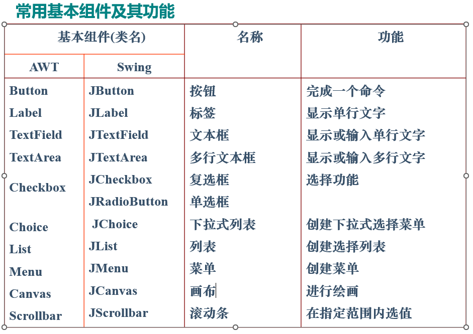
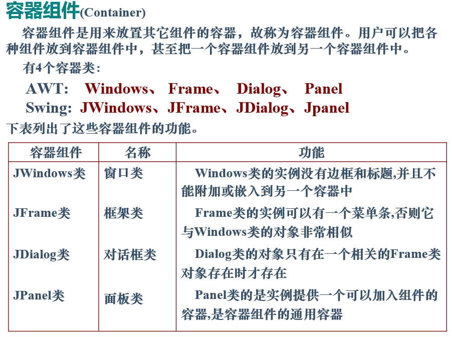
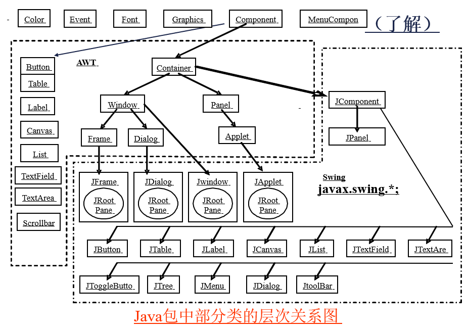
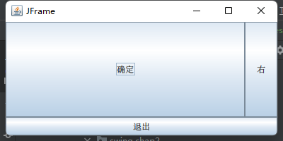
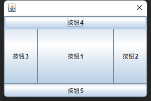
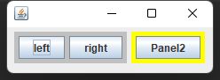
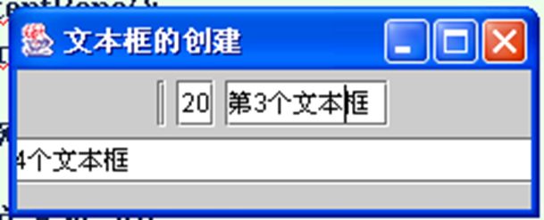
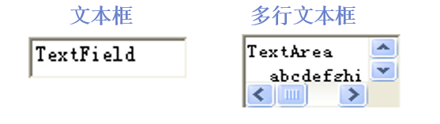

# 组件

在图形用户界面设计中，窗口系统中所显示的各种对象都统称为“控件”或“组件”，组件分为:

- 基本组件——不可再分割的组件
- 容器组件——用来放置其它组件的组件

> 基本组件



> 容器组件





# 顶级容器

建立一个窗口系统，首先需要创建一个图形用户界面，这就需要使用顶级容器类JWindows、JFrame、JDialog 等 。 

Window类提供了用于窗口操作的基本功能，但**通常使用的是Window类的子类JFrame(框架)类和JDialog(对话框)类**。

## JFrame

### 常用方法

**显示**

setVisible(boolean b):使框架可见/不可见(true/false)
hide() :隐藏框架
setTitle():设置框架的标题

**尺寸**

pack():调整窗口正好容纳各组件
setSize(int w,int h):设置框架的尺寸
setLocation(int x, int y):设置框架位置
reSize(int w, int h):调整框架的尺寸(宽/高为w/h)
setBounds(int x, int y, int w,int h):调整框架的位置及尺寸(左上角为(x,y), 宽、高为w、h)

**添加组件至容器**

add(Component ob):将其它组件ob加入到框架的中心位置 
add(String p, Component ob)   将组件ob加入到框架的p位置 (框架默认的布局方式是BorderLayout,  它将容器划分为东西南北中) (**如果是JFrame,则需要获取框架的内容面板后，将其他组件加到内容面板中。**)

> 例1:
>
> 

```java
/*测试顶级容器JFrame*/
public class JFrameTest {
    public static void main(String[] args) {
        new amDemo();
    }
    static class amDemo extends JFrame {
        private JButton jButton = null;
        private JButton jButton1 = null;
        private JButton jButton2 = null;

        public amDemo() {
            this.setSize(400, 200);   // this.setBounds(100,100,400,200);
            //Container c=this.getContentPane();
            jButton = new JButton("右");
            jButton1 = new JButton("退出");
            jButton2 = new JButton("确定");
            
            add(jButton, BorderLayout.EAST);
            add(jButton1, BorderLayout.SOUTH);
            add(jButton2, BorderLayout.CENTER);
            
            this.setTitle("JFrame");
            this.setVisible(true);
            this.setDefaultCloseOperation(JFrame.EXIT_ON_CLOSE);
        }

    }
}
```

> 新版本JDK:直接在JFrame中可以调用add(组件)来添加组件，组件将被添加到 contentPane。

```java
    public static void main(String[] args) {
        /*
        * 新版本的JDK，直接在JFrame中可以调用add(组件)来添加组件，组件将被添加到 contentPane。
        * */
        JFrame f=new JFrame("简单框架");  //创建框架
        /*下面三行相当于f.add(new JButton("Button1"))*/
        /*
        Container c=f.getContentPane();//获取内容面板
        //根面板contentPane 的默认布局为 BorderLayout
        c.setLayout(new FlowLayout());
        c.add(new JButton("Button1"));//将按钮加入面板中
        */
        f.getContentPane().setLayout(new FlowLayout());
        f.add(new JButton("Button1"));

        f.setSize(160,100) ;  //修改框架尺寸
        f.setVisible(true);//显示框架
        f. setDefaultCloseOperation(JFrame.EXIT_ON_CLOSE);

    }
```

## JDialog

对话框类Dialog (JDialog)的对象是有标题条而无菜单条和最小化按钮图标的容器组件，它必须依附在某个窗口上(如Frame),一旦它所依附的窗口关闭了, 对话框也自动关闭。

对话框默认的布局是BorderLayout。调用show()方法显示才可见, 调用hide()方法可将其隐藏。

### 模式

有两种模式的对话框:

- 有模式:对话框出现期间，所依附窗口不接收任何操作 。

- 无模式: 对话框出现时, 与所依附窗口都可同时接收操作 
      

对话框通常用于在应用程序中弹出一个窗口, 用于提示输入数据、保存文件等。

### 常用方法

可以用下列构造方法创建普通对话框：

 JDialog() 创建无标题，**初始不可见**的对话框
 JDialog(JFrame)  创建依附于Frame的无模式对话框
 JDialog(JFrame,boolean)  创建对话框,并由布尔值的真假决定此对话框有无模式
 JDialog(JFrame,String)     创建无模式对话框，并给定对话框的标题
 JDialog(JFrame, String, boolean)  创建对话框,指出是否有模式,并给定对话框的标题 

> 例子
>
> 

```java
class DiaDemo extends JDialog {
    private static final long serialVersionUID = 1L;
    private JButton jB1 = new JButton("按钮1");
    private JButton jB2 = new JButton("按钮2");
    private JButton jB3 = new JButton("按钮3");
    private JButton jB4 = new JButton("按钮4");
    private JButton jB5 = new JButton("按钮5");

    public DiaDemo(Frame owner) {
        super(owner);
        this.add(jB1,BorderLayout.CENTER);
        this.add(jB2, BorderLayout.EAST);
        this.add(jB3,BorderLayout.WEST);
        this.add(jB4,BorderLayout.NORTH);
        this.add(jB5,BorderLayout.SOUTH);
        this.setSize(300, 200);
        this.setVisible(true);}
}
class Dia1{
    public static void main(String arg[]){
        new DiaDemo(new Frame());
    }
}
```

### 标准对话框（JOptionPane）

确认对话框

- ```java
  JOptionPane.showConfirmDialog(Component pc, Object message, String title, int optionType);
  ```

  - optionType为表示yes,no cancel组合的常数

消息对话框

- ```java
  JOptionPane.showMessageDialog(Component pc, Object message, String title, int messagetype);
  ```

输入对话框

- ```java
  JOptionPane.showInputDialog(Component pc, Object message, String title, int messagetype);
  ```

## **Panel (JPanel)**  

JPanel(面板)是能在屏幕上实际显示的容器,但必须放在JWindows、JFrame、JDialog等容器中才能够显示。

- 面板提供容纳其他组件的功能，利用面板可以把控件分组，使整个窗口的组件显得有层次，安排合理布局。

- 面板缺省的布局方式是顺序方式(FlowLayout)，即按照从左至右、从上到下的方式布局。 

> **面板的创建与使用**
>
> 

```java
public class JPanelTest extends JFrame {
    public JPanelTest() {
        setLayout(new FlowLayout());
        JPanel  panel1=new JPanel();  // 创建一个面板对象
        JPanel  panel2=new JPanel();
        add(panel1);
        add(panel2);

        panel1.setBackground(Color.lightGray);//为能看清面板,这里修改面板的背景颜色
        panel2.setBackground(Color.yellow);//这里修改面板的背景颜色
        panel1.add(new JButton("left"));
        panel1.add(new JButton("right"));

        panel2.add(new JButton("Panel2"));
        //最佳显示模式

        pack(); //根据所放组件，调整窗口正好容纳各组件
        setVisible(true);
        //设置关闭
//        setDefaultCloseOperation(JFrame.EXIT_ON_CLOSE);
    }

    public static void main(String[] args) {
        new JPanelTest();
    }
}
```

# 常用组件

## 按钮

按钮(JButton)是相对简单的一种组件，它在屏幕上通常表现为一块有边界的矩形区域，上面有文字标记来说明该按钮的功能,　例如：

按钮由Button类来定义，其**构造方法**有二个：
JButton( ):生成一个没有标记的按钮
JButton(Icon icon):生成一个带标记label的按钮
JButton(String str)　
JButton(String str,Icon icon )

Button类中有一系列对按钮进行管理的方法，可以进行设置和获取按钮的状态，处理按钮产生的事件等。


常用方法:
setText(String label)   设置按钮标记 
getText( )获取按钮标记
setActionCommand(String s) 设置用户按下按钮时返回的信息
addActionListener(ActionListener l) 将l指定为按钮的监听者
removeActionListener(ActionListener l) 将l从按钮监听者中去掉

## **文本组件** 

1.  标签(Label)
2.  文本框(TextField)
3.  文本区域(TextArea) 

### ?标签(JLabel)

标签是一种只能用来显示单行文本的组件。

标签在容器中的对齐方式有三种：左对齐、居中和右对齐, 用Label.LEFT、Label.CENTER、Label.RIGHT三个静态常量表示，在程序中可以设置其对齐方式。

标签类**构造方法**：
JLabel() 生成一个空标签
JLabel(String text)  生成一个带有指定文本的标签
JLabel(Icon image)
JLabel(Icon image, int horizontalAlignment)
JLabel(Strlng text, int horizontalalignment):生成一个带有指定文本和在容器中的对齐方式的标签

标签类的**常用方法**：
setBackground(Color c)设置背景色
setForeground(Color c) 设置文字内容的字体颜色
getText( )/ setText(String text)  获取/设置文本
setFont(Font f) 设置字体 

```java
        JFrame frm=new JFrame("标签的创建");
        Container c=frm.getContentPane();
        c.setLayout(new GridLayout(3,9));
        JLabel la1, la2, la3; //定义三个标签
        la1=new JLabel(); 
		la2=new JLabel("Lab2",Label.LEFT); //实例化标签对象
        la3=new JLabel("Lab3", Label.RIGHT);

        c.add(la1); 
		c.add(la2);   
		c.add(la3); //将标签加入Frame 中

        la1.setText("Label1");
        frm.setSize(100,100);
        frm.setVisible(true);
```

> 
>
> 为什么?

## 文字输入组件的使用

在Swing中与文字输入有关的组件有：
JTextField      该组件为单行文本编辑器 
JPasswordField  该组件为密码框编辑器
JTextArea	   该组件为多行文本编辑器
JEditorPane	   该组件可显示多种文件格式
JTextPane	   该组件可设置文件各种样式
JScrollPane     当组件内容大于显示区域时会 自动产生滚动轴

## 文本框(JTextField)

单行的

文本框(JTextField)和多行文本区域(JTextArea)是用来显示和输入文本的控件，它们都是TextComponent的子类。

文本框由JTextField类来创建，其构造方法有：

```java
JTextField( )     //创建一个空的文本框
JTextField(Strint text)创建一个带有初始文本的文本框
JTextField(int Columns) 创建一个初始字段长度为Column 的文本框 
JTextField(String text, int colulmns)创建一个指定字段长和带有初始文本的文本框 
JTextField(Document doc,String text, int colulmns)创建一个指定字段长和带有初始文本的文本框,且使用指定的文件存储模式。
```

文本框类的常用方法:

```java
addActionListener(ActionListener l) // 将l指定为文本框的ActionEvent事件监听者 
removeActionListener(ActionListener l)   //将l从文本框的监听者中去掉
setText(String s)    //设置文本框中的字符串 
getText( )           //获取文本框中的字符串 
```

> 例子

```java
class TextFieldDemo extends JFrame
{
  JTextField t1, t2, t3, t4;
  public static void main(String args[])   {new TextFieldDemo(); }
  TextFieldDemo(){
       setLayout(new FlowLayout());
       setTitle("文本框的创建");
        t1=new JTextField();   //实例化文本框对象
        t2=new JTextField("20");
        t3=new JTextField("第3个文本框  ");
        t4=new JTextField("第4个文本框  ", 25);
       	add(t1); //将文本框加入窗口中
        add(t2);
        add(t3);
        add(t4);
        setSize(250,100);
        setVisible(true);
 	} 
}

```



## 文本区域(JTextArea)

称为多行文本框，除了多了处理大量文本的功能以外，其余同单行文本框(TexiFieid)是一样的。 
单行文本框在尺寸上有限制而且不能卷动，而多行文本框可以指定其高度和宽度，而且具有滚动条，因此它可以处理较大数量的文本



下面的语句创建了两个文本区（JTextArea）对象：

```java
    JTextArea t1 = new JTextArea(2,8);      
```

创建文本区t1：2行、字段长度为8。

```java
    JTextArea t2 = new JTextArea("TravelMate 342 系列",3,10);   
```

创建文本区t2：初始字符串为"TravelMate 342 系列"、3行、字段长度为10。 

## JPasswordField

用JPasswordField来创建密码验证窗口
JPasswordField是密码输入验证框组件，输入时在屏幕上只显示*，隐藏了输入的信息，从而达到保密的目的。

下面的语句创建了一个密码输入框

```
JPasswordField  t1 = new JPasswordField(10);
```

## JEditorPane

JEditorPane的功能是展示不同类型的文件格式内容，它所支持的文件格式有3种：
一是纯文本（text/plain）格式，
二是RTF（text/rtf）格式，
三是HTML格式。

表4-10列出了JEditorPane类常用构造方法。

JEditorPane类的构造方法

| 构造方法名称                           | 方 法 说 明                                                  |
| -------------------------------------- | ------------------------------------------------------------ |
| JEditorPane ()                         | 建立一个新的展示文件内容的窗口界面                           |
| JEditorPane (String url)               | 以详细的URL字符串为基础，创建一个展示HTML文件内容的窗口界面  |
| JEditorPane (String type，String text) | 建立一个按指定文件格式类型显示文本                           |
| JEditorPane (URL initalPane)           | 以详细的URL字符串当作输入值来创建一个展示HTML文件内容的窗口界面 |

## JTree

> 用JTree类来创造文件管理器

Swing提供了一个JTree类，该类创建的实例可实现一个树状分层结构显示数据的视图。所有的节点都是从根节点引出。除根节点外，其他节点都具有两类：一类是带子节点的分枝节点，一类是不带子节点的节点，称为叶节点。 

表7-11    JTree类的构造方法和其他常用方法

| 方 法 名 称                                                  | 方 法 说 明                                                  |
| ------------------------------------------------------------ | ------------------------------------------------------------ |
| JTree()                                                      | 构造方法，建立一颗系统默认的树                               |
| JTree(TreeNode root)                                         | 构造方法，使用TreeNode创建树的根节点                         |
| DefaultMutableTreeMode(Object userObject)                    | 构造方法，建立一个默认有子节点的树，节点是userObject对象，该节点可以用add方法增加其他节点作为它的子节点 |
| DefaultMutableTreeMode(Object  userObject，boolean allowsChildren) | 构造方法，建立一个树，Boolean allowsChildren确定是否允许建立子节点 |
| addTreeSelectionlistener()                                   | 方法,获得监视器                                              |
| TreeSelectionListener                                        | 接口，处理Tree事件的接口                                     |

## 复选框、选项按钮、列表框和下拉列表