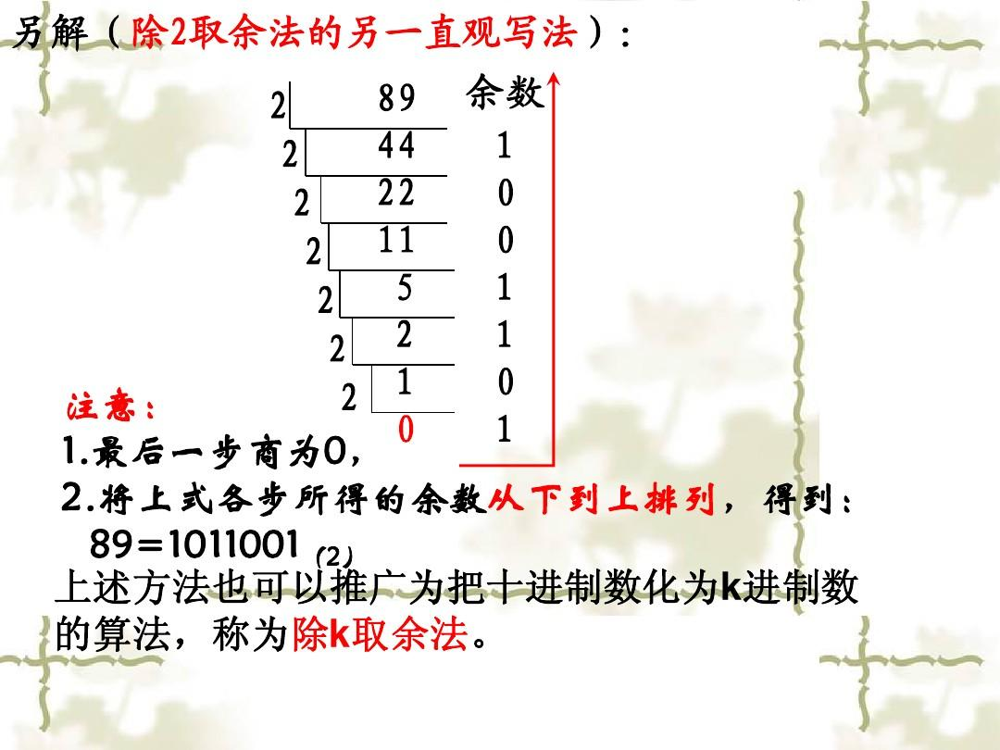

# 进制

## 进制与进制间的转换

> 关于进制

*   所有数字在计算机底层都以二进制形式存在。
*   对于整数，有四种表示方式：
    *   二进制(binary)：0,1 ，满2进1.以`0b`或`0B`开头。
    *   十进制(decimal)：0-9 ，满10进1。
    *   八进制(octal)：0-7 ，满8进1. 以数字`0`开头表示。
    *   十六进制(hex)：0-9及A-F，满16进1. 以`0x`或`0X`开头表示。此处的A-F不区分大小写。如：0x21AF +1= 0X21B0

```java
class BinaryTest{
	public static void main(String[] args){

		int num1 = 0b110;//二进制,补码形式解析
		int num2 = 110;//十进制
		int num3 = 0127;//8进制
		int num4 = 0x110A;//16进制

		System.out.println("num1 = " + num1);
		System.out.println("num2 = " + num2);
		System.out.println("num3 = " + num3);
		System.out.println("num4 = " + num4);
	}
}
```

二进制
-------------------------------------------------------------------

*   Java整数常量默认是int类型，当用二进制定义整数时，其第32位是符号位；当是long类型时，二进制默认占64位，第64位是符号位
*   二进制的整数有如下三种形式：
    *   原码：直接将一个数值换成二进制数。最高位是符号位
    *   负数的**反码**：是对**原码按位取反，只是最高位（符号位）确定为1(补码-1)**。
    *   负数的**补码**：其**反码加1**。计算机以二进制补码的形式保存所有的整数。
    *   正数的原码、反码、补码都相同，负数的补码是其反码+1

> 为什么要使用原码、反码、补码表示形式呢？

计算机辨别“符号位”显然会让计算机的基础电路设计变得十分复杂! 于是人们想出了将符号位也参与运算的方法. 我们知道, 根据运算法则减去一个正数等于加上一个负数, 即: 1-1 = 1 + (-1) = 0 , 所以机器可以只有加法而没有减法, 这样计算机运算的设计就更简单了。


**二进制——>十进制**


> 原码与反码是帮助推导出补码而存在的！！！

十进制——》二进制


*   对于正数来讲：原码、反码、补码是相同的：三码合一。
*   计算机底层都是使用二进制表示的数值。
*   **计算机底层都是使用的数值的`补码`保存数据的。**

## 进制间转化

> 十进制二进制互转

* 二进制转成十进制乘以2的幂数

* 十进制转成二进制除以2取余数

  - 

  - 写成程序

    ```java
        static String DecToBin(int dec){
            int yu=dec%2;
            String s1=yu+"";
            dec/=2;
            while(dec!=0){
                /*此时还可以取余*/
                yu=dec%2;
                dec/=2;
                s1=yu+s1;
            }
            return "0x"+s1;
        }
    ```

    


# 原码

有符号数, 首位作为符号位,0+,1-

```
0000,0001原->1
1000,0001原->-1
```

# 补码

有符号数

