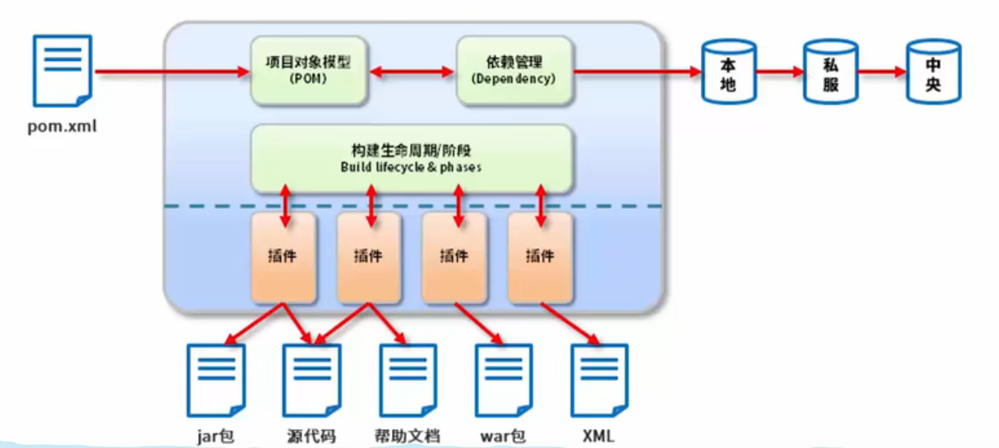

# 1、Maven概述

## 1.1、Maven是什么

在Javaweb开发中，需要使用大量的jar包，我们手动去导入；
如何能够让一个东西自动帮我导入和配置这个jar包。由此，Maven诞生了！
Maven的本质是一个项目管理工具，将项目开发和管理过程抽象成一个**项目对象模型（POM）**

Maven是用Java语言编写的。他管理的东西统统以面向对象的形式进行设计，最终它把一个项目看成一个对象，而这个对象叫做POM(project object model)，即项目对象模型。

我们说一个项目就是一个对象，作为对象的行为、对象的属性都有哪些呢？

Maven说我们需要编写一个**pom.xml文件**，Maven通过加载这个配置文件就可以知道我们项目的相关信息了！到这里我们知道了Maven离不开一个叫pom.xml的文件。因为这个文件代表就一个项目。

```
提个问题大家思考，如果我们做8个项目，对应的是1个文件，还是8个文件？肯定是8个！
```

那Maven是如何帮我们进行项目资源管理的呢？这就需要用到Maven中的第二个东西：**依赖管理**。这也是它的第二个核心！

所谓**依赖管理**就是maven对项目所有依赖资源的一种管理，它和项目之间是一种**双向关系**，即当我们做项目的时候maven的依赖管理可以帮助你去管理你所需要的其他资源，当其他的项目需要依赖我们项目的时候，maven也会把我们的项目当作一种资源去进行管理，这就是一种双向关系。

那maven的依赖管理它管理的这些资源存在哪儿呢？主要有三个位置：**本地仓库，私服，中央仓库**

```
最终依赖的都是从中央层拿到的
```

本地仓库顾名思义就是存储在本地的一种资源仓库，如果本地仓库中没有相关资源，可以去私服上获取，私服也是一个资源仓库，只不过不在本地，是一种远程仓库，如果私服上也没有相关资源，可以去中央仓库去获取，中央仓库也是一种远程仓库。

Maven除了帮我们管理项目资源之外**还能帮助我们对项目进行构建，管理项目的整个生命周期**，当然它的这些功能需要使用一些相关的插件来完成，当然整个生命周期过程中插件是需要配合使用的，单独一个无法完成完整的生命周期。

```
插件与工作是多对多
```



```
方框内是Maven核心
线上方是Maven需要手动操作的部分
线下方是Maven自动完成的
```

## 1.2、Maven的作用

Maven的作用我们可以分成三类：

（1）项目构建：提供标准的，跨平台的自动化构建项目的方式

（2）依赖管理：方便快捷的管理项目依赖的资源（jar包），避免资源间的版本冲突等问题

（3）统一开发结构：提供标准的，统一的项目开发结构，如下图所示：


各目录存放资源类型说明：

```
src/main/java：项目java源码

src/main/resources：项目的相关配置文件（比如mybatis配置，xml映射配置，自定义配置文件等）

src/main/webapp：web资源（比如html，css，js等）

src/test/java：测试代码

src/test/resources：测试相关配置文件

src同层pom.xml：项目pom文件

```

```
<?xml version="1.0" encoding="UTF-8"?>
<!--pom的根目录-->
<project xmlns="http://maven.apache.org/POM/4.0.0"
         xmlns:xsi="http://www.w3.org/2001/XMLSchema-instance"
         xsi:schemaLocation="http://maven.apache.org/POM/4.0.0 http://maven.apache.org/xsd/maven-4.0.0.xsd">
    	<!--指定pom的模型版本-->
    <modelVersion>4.0.0</modelVersion>
    	<!--打包方式 web工程打包为war java工程打包为jar-->
    <packaging>war</packaging>
    
    	<!--组织id-->
    <groupId>com.itheima</groupId>
    	<!--项目id-->
    <artifactId>web01</artifactId>
    	<!--组织id  release代表完成版,SNAPSHOT代表开发版-->
    <version>1.0-SNAPSHOT</version>
    
    <!--设置当前工程的所有依赖-->
    <!--一般maven通过dependencies来下载-->
    <dependencies>
        <!--具体的依赖-->
        <dependency>
                <!--组织id-->
            <groupId>junit</groupId>
                <!--项目id-->
            <artifactId>junit</artifactId>
                <!--组织id  release代表完成版,SNAPSHOT代表开发版-->
            <version>4.12</version>
        </dependency>
    </dependencies>
</project>
```

