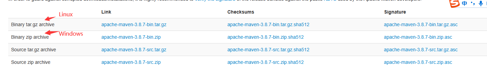
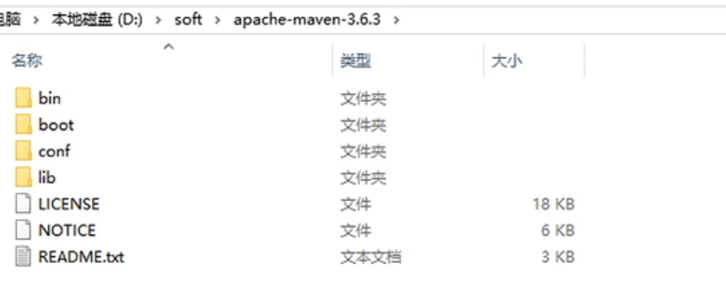
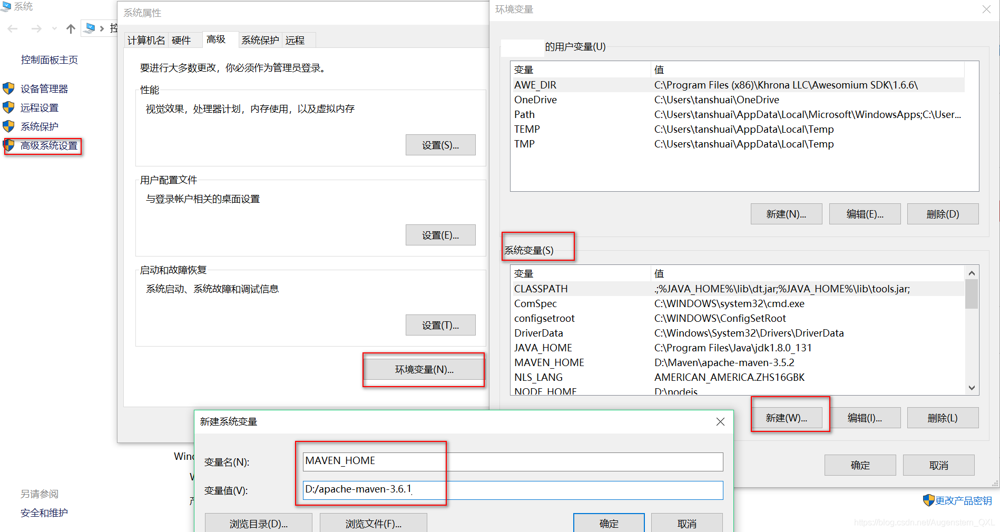
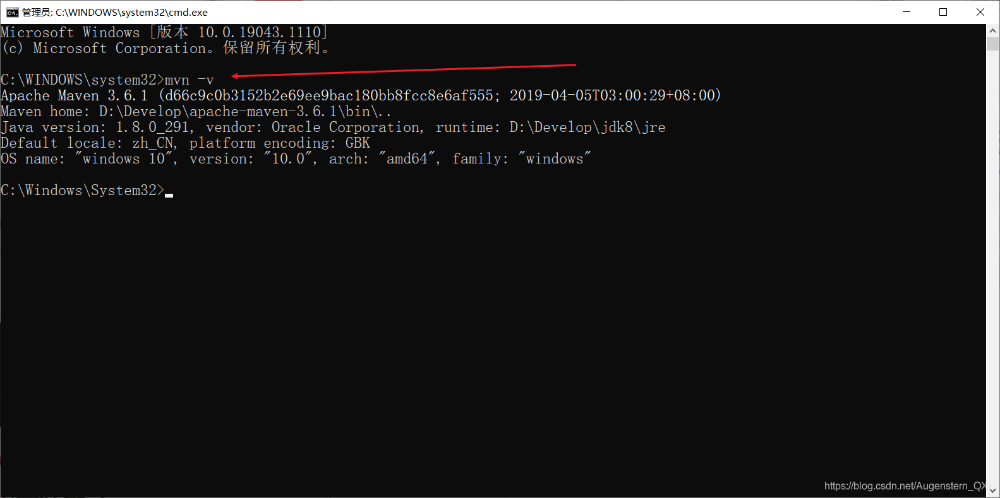

# 安装与配置

## 下载网站

[Maven – Download Apache Maven](https://maven.apache.org/download.cgi)



配过服务器的都应该知道,gz是linux的



各目录结构说明：

bin：可执行程序目录，

boot：maven自身的启动加载器

conf：maven配置文件的存放目录

lib：maven运行所需库的存放目录

配置环境变量
----------------------------------------------------------------------------

`我的电脑`\-------->`属性`\--------->`高级系统设置`\---------->`新建系统变量MAVEN_HOME`，

在我们的系统环境变量中

配置如下配置：

*   MAVEN\_HOME maven的目录
*   在系统的path中配置 `%MAVEN_HOME%\bin`
*   之后在命令行窗口中输入`mvn -version`
*   测试Maven是否安装成功，保证必须配置完毕！



* * *

环境变量配置好之后需要测试环境配置结果，我们需要在DOS命令窗口下输入以下命令查看输出

```cmd
mvn -v
```



如果能够看到输出的maven的版本信息代表配置成功