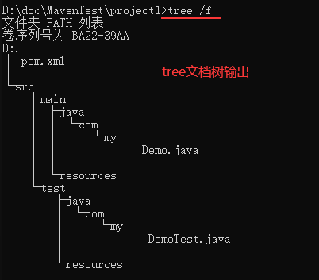
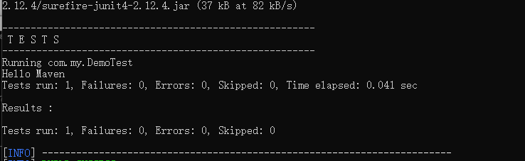
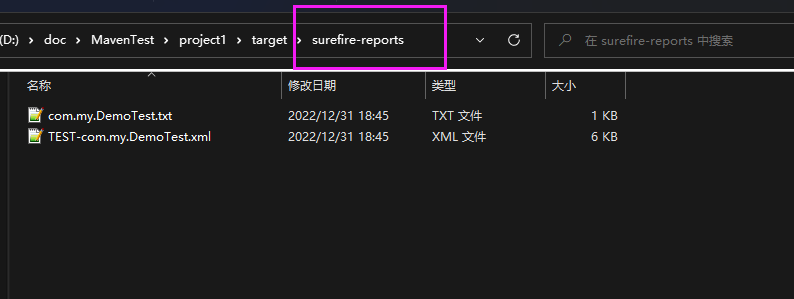
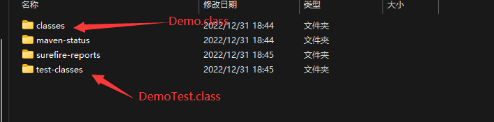
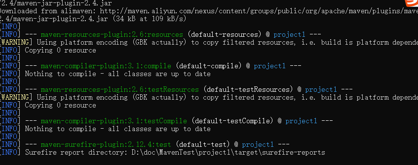
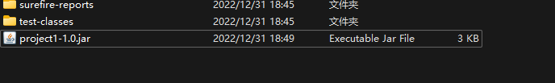
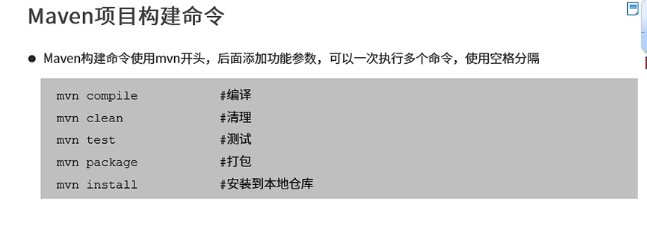
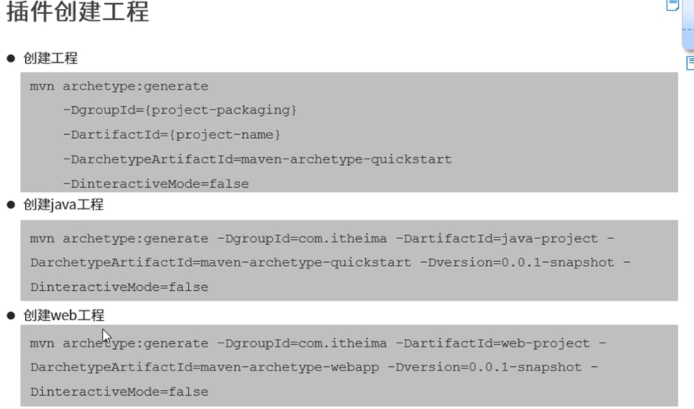
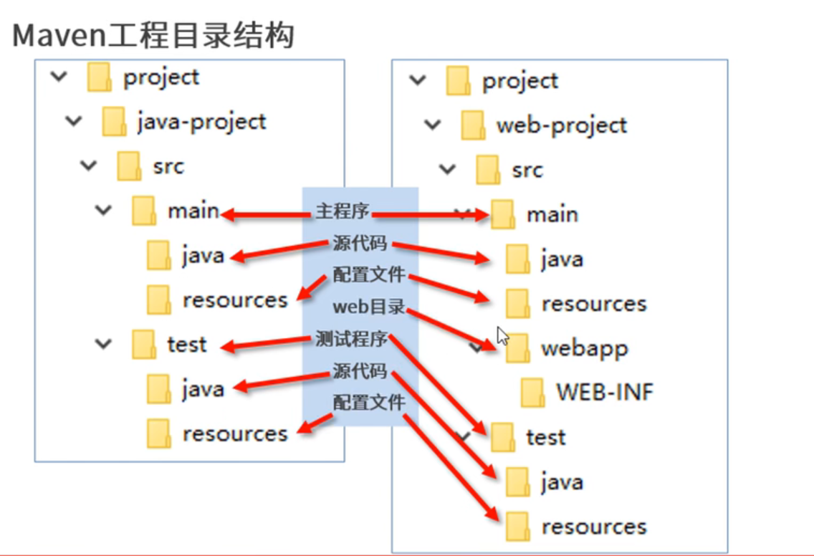

## Maven的工程目录结构



```
D:.
│  pom.xml
│
└─src
    ├─main
    │  ├─java
    │  │  └─com
    │  │      └─my
    │  │              Demo.java
    │  │
    │  └─resources
    └─test
        ├─java
        │  └─com
        │      └─my
        │              DemoTest.java
        │
        └─resources
```

## mvn命令

版本命令

```
mvn -version
```

构建命令

```
mvn -compile
//下载依赖的插件并生成target文件夹
```

```
mvn -clean
//下载依赖的插件并清理target文件夹
```

测试命令

```
mvn -test
```



测试报告





打包指令

```
mvn package
```



先编译,测试再打包



mvn安装到本地仓库

```
mvn install
```



## Maven插件创建工程



要求

```
创建时里面不是一个maven工程的结构,没有pom.xml
```

