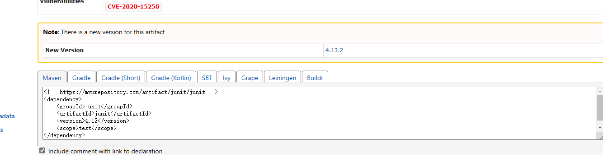
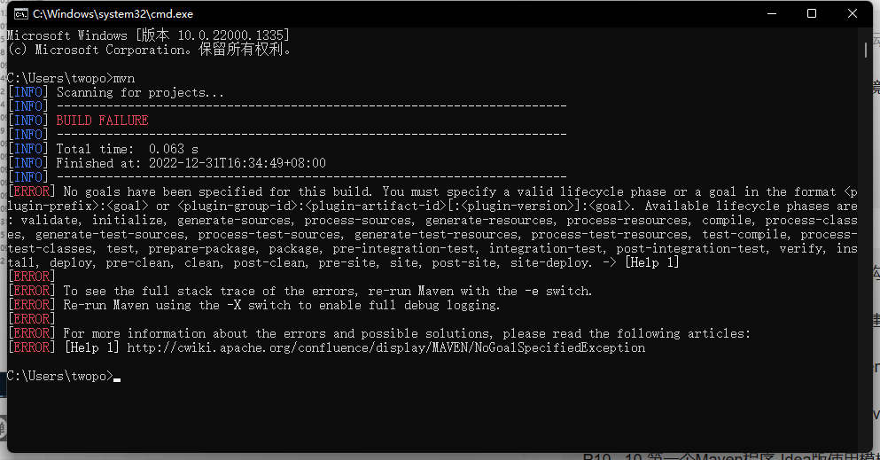
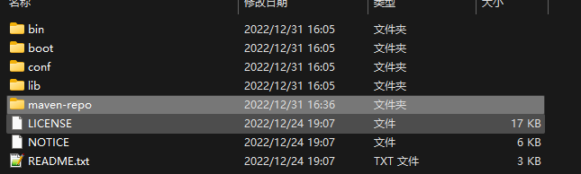
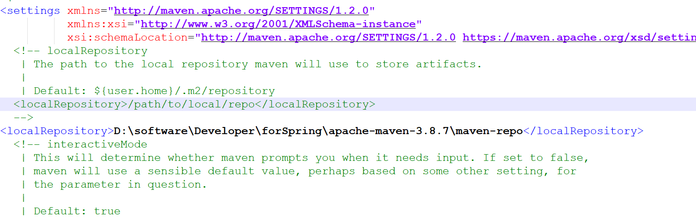
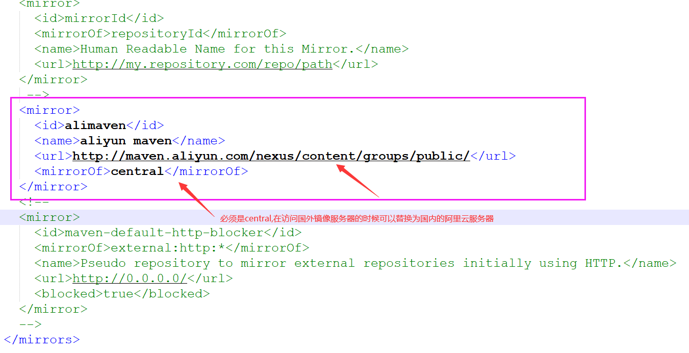

3、Maveb基础概念
=============================================================================

3.1、仓库
------------------------------------------------------------------------

仓库：用于存储资源，主要是各种jar包


关于仓库，我们前面讲到了有三种：本地仓库，私服，中央仓库，其中私服和中央仓库都属于远程仓库

**中央仓库**：maven团队自身维护的仓库，属于开源的

**私服**：各公司/部门等小范围内存储资源的仓库，私服也可以从中央仓库获取资源, 私服比较快

**本地仓库**：开发者自己电脑上存储资源的仓库，也可从远程仓库获取资源

**私服的作用：**解决访问速度慢和版权问题

（1）保存具有版权的资源，包含购买或自主研发的jar

（2）一定范围内共享资源，能做到仅对内不对外开放

3.2、坐标
------------------------------------------------------------------------

我们说maven的仓库里存储了各种各样的资源（jar包），那这些资源我们如何找到它们呢？我们需要知道它们具体的一个位置才能知道如何找到它们，这个就叫坐标

**坐标**：maven中的坐标用于描述仓库中资源的位置

maven坐标的主要组成如下：

*   **groupId**：定义当前资源隶属组织名称（通常是域名反写，如：org.mybatis；com.itheima）

*   **artifactId**：定义当前资源的名称（通常是项目或模块名称，如：crm，sms）

*   **version**：定义当前资源的版本号

*   **packaging**：定义资源的打包方式，取值一般有如下三种

    *   jar：该资源打成jar包，默认是jar java工程打包为jar
    *   war：该资源打成war包 web工程打包为war
    *   pom：该资源是一个父资源（表明使用maven分模块管理），打包时只生成一个pom.xml不生成jar或其他包结构

```
<?xml version="1.0" encoding="UTF-8"?>
<project xmlns="http://maven.apache.org/POM/4.0.0"
         xmlns:xsi="http://www.w3.org/2001/XMLSchema-instance"
         xsi:schemaLocation="http://maven.apache.org/POM/4.0.0 http://maven.apache.org/xsd/maven-4.0.0.xsd">
    <!--指定pom的模型版本-->
    <modelVersion>4.0.0</modelVersion>
    <!--打包方式 web工程打包为war java工程打包为jar-->
    <packaging>war</packaging>
    
    <!--组织id-->
    <groupId>com.itheima</groupId>
    <!--项目id-->
    <artifactId>web01</artifactId>
    <!--组织id  release代表完成版,SNAPSHOT代表开发版-->
    <version>1.0-SNAPSHOT</version>
    
    <!--设置当前工程的所有依赖-->
    <dependencies>
        <!--具体的依赖-->
        <dependency>
        </dependency>
    </dependencies>
</project>

```

### maven编写方式

```
https://mvnrepository.com/
```



3.3 配置本地仓库
----------------------------------------------------------------------------

cmd输入

```
mvn
```




在Maven -bin 的同级目录下建立一个文件夹 `maven-repo`



在`conf/settings.xml`的文件中可以配置本地仓库`local repository`的位置



## 3.4 远程仓库配置



```xml
<mirror>
	<id>alimaven</id>
	<name>aliyun maven</name>
	<url>http://maven.aliyun.com/nexus/content/groups/public/</url>
	<mirrorOf>central</mirrorOf>
</mirror>
```

