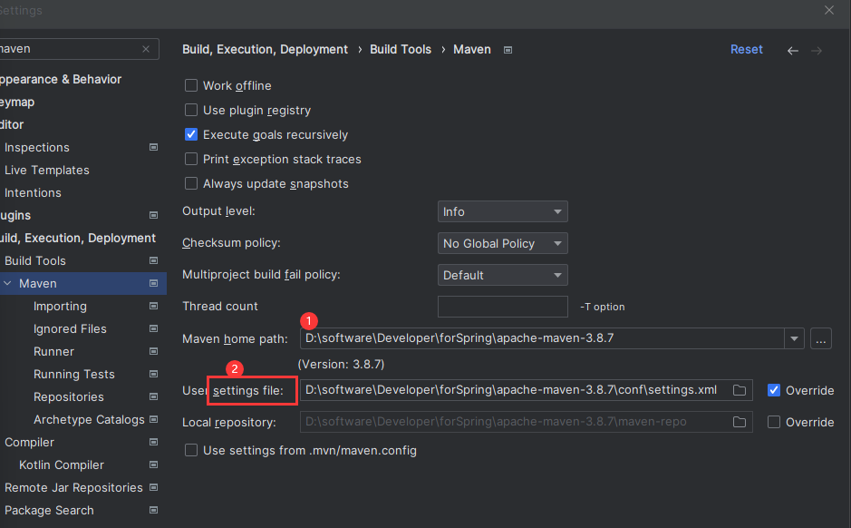

新建`maven工程`

`settings\Build Tools\Maven`进行配置



创建一个普通的Maven项目
==================================================================================


## 1. 添加<dependencies>依赖


## 2. 编写程序测试


```
D:.
├─src
│  ├─main
│  │  ├─java-Demo.java
│  │  └─resources
│  │      ├─archetype-resources
│  │      │  └─src
│  │      │      ├─main
│  │      │      │  └─java
│  │      │      └─test
│  │      │          └─java
│  │      └─META-INF
│  │          └─maven
│  └─test
│      └─java--DemoTest.java
└─target
```

## 3. 可以在右侧进行mvn的命令选择


## 4. 也可以在运行配置中

配置需要执行的mvn命令和mvn工作文件夹

