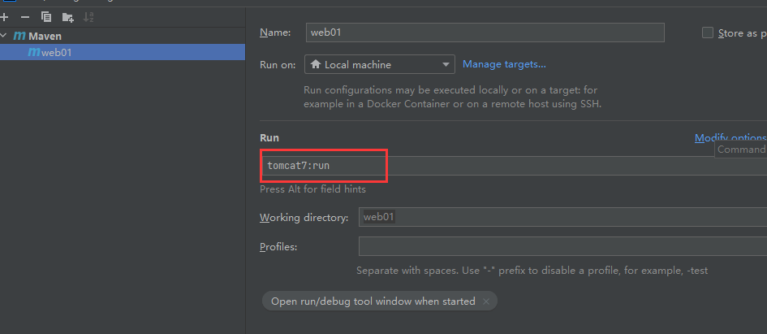

# tomcat插件安装和web工程启动

我们也可以不配置Tomcat，而是在 `pom.xml` 中配置 tomcat 插件来运行项目

*   在Maven仓库中搜索 tomcat Maven

*   找到 org.apache.tomcat.maven


我们使用2.1版本的，相对来说稳定一些

```
    <!--构建-->
    <build>
        <!--设置插件-->
        <plugins>
            <plugin>
                <!--具体的插件配置-->
                <groupId>org.apache.tomcat.maven</groupId>
                <artifactId>tomcat7-maven-plugin</artifactId>
                <version>2.1</version>
                <!--配置端口-->
                <configuration>
                    <port>80</port>
                    <!--虚拟路径-->
                    <path>/</path>
                    <!--解决get请求中文乱码-->
                    <uriEncoding>utf-8</uriEncoding>
                </configuration>
            </plugin>
        </plugins>
    </build>

```

插件配置好后，在IDEA右侧`maven-project`操作面板上可以看到该插件，并且可以利用该插件启动项目


运行后该插件会给我们一个可运行地址：


进入网页

> 

**运行配置**



```
tomcat7:run
```

pom文件
---------------------------------------------------------------------------

pom.xml 是Maven的核心配置文件

```
<?xml version="1.0" encoding="UTF-8"?>

<!--Maven版本和头文件-->
<project xmlns="http://maven.apache.org/POM/4.0.0" xmlns:xsi="http://www.w3.org/2001/XMLSchema-instance"
  xsi:schemaLocation="http://maven.apache.org/POM/4.0.0 http://maven.apache.org/xsd/maven-4.0.0.xsd">
  <modelVersion>4.0.0</modelVersion>

  <groupId>com.kuang</groupId>
  <artifactId>javaweb-01-maven</artifactId>
  <version>1.0-SNAPSHOT</version>
  <!--Package：项目的打包方式
  jar：java应用
  war：JavaWeb应用
  -->
  <packaging>war</packaging>

  <!--配置-->
  <properties>
    <!--项目的默认构建编码-->
    <project.build.sourceEncoding>UTF-8</project.build.sourceEncoding>
    <!--编码版本-->
    <maven.compiler.source>1.8</maven.compiler.source>
    <maven.compiler.target>1.8</maven.compiler.target>
  </properties>

  <!--项目依赖-->
  <dependencies>
    <!--具体依赖的jar包配置文件-->
    <dependency>
      <groupId>junit</groupId>
      <artifactId>junit</artifactId>
      <version>4.11</version>
    </dependency>
  </dependencies>

  <!--项目构建用的东西-->
  <build>
    <finalName>javaweb-01-maven</finalName>
    <pluginManagement>
      <plugins>
        <plugin>
          <artifactId>maven-clean-plugin</artifactId>
          <version>3.1.0</version>
        </plugin>
        <plugin>
          <artifactId>maven-resources-plugin</artifactId>
          <version>3.0.2</version>
        </plugin>
        <plugin>
          <artifactId>maven-compiler-plugin</artifactId>
          <version>3.8.0</version>
        </plugin>
        <plugin>
          <artifactId>maven-surefire-plugin</artifactId>
          <version>2.22.1</version>
        </plugin>
        <plugin>
          <artifactId>maven-war-plugin</artifactId>
          <version>3.2.2</version>
        </plugin>
        <plugin>
          <artifactId>maven-install-plugin</artifactId>
          <version>2.5.2</version>
        </plugin>
        <plugin>
          <artifactId>maven-deploy-plugin</artifactId>
          <version>2.8.2</version>
        </plugin>
      </plugins>
    </pluginManagement>
  </build>
</project>

```